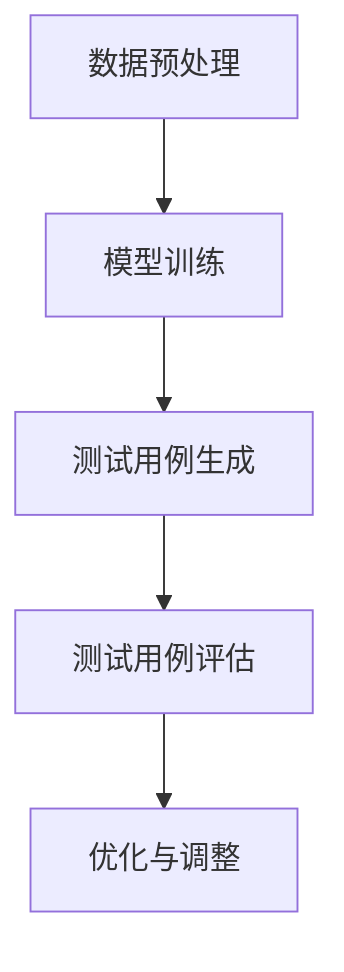

                 


### 文章标题：智能化LLM测试用例生成方法研究

#### 关键词：智能化测试、LLM、测试用例、生成方法、算法

#### 摘要：
本文深入探讨了智能化LLM测试用例生成方法，从背景介绍、核心概念、技术原理、实现方法、应用案例到未来展望，全面剖析了智能化测试用例生成领域的前沿技术和挑战。通过本文，读者将了解到如何利用LLM实现高效的测试用例生成，以及该方法在实际项目中的应用效果。

----------------------------------------------------------------

## 第一部分：背景与核心概念

### 第1章：智能化LLM测试用例生成方法概述

#### 1.1 背景介绍

随着人工智能技术的快速发展，智能化测试逐渐成为软件测试领域的研究热点。传统的测试方法依赖于人工编写测试用例，效率低且容易出错。而智能化测试通过引入人工智能技术，能够自动生成测试用例，提高测试效率和质量。

LLM（Language Model）作为一种强大的语言生成模型，在自然语言处理领域取得了显著成果。LLM的引入为智能化测试用例生成带来了新的思路和方法。通过训练大规模语料库，LLM可以生成符合语法和语义要求的测试用例，从而实现自动化的测试过程。

#### 1.2 核心概念

1. **智能化测试：** 智能化测试是指利用人工智能技术进行软件测试的方法。它通过自动生成测试用例、自动化执行测试、智能分析测试结果等手段，提高测试效率和准确性。

2. **LLM（Language Model）：** LLM是一种用于预测下一个单词或字符的概率分布的语言生成模型。它通过对大规模语料库进行训练，学习到语言的语法和语义规则，能够生成符合语言习惯的文本。

3. **测试用例生成方法：** 测试用例生成方法是指用于生成测试用例的算法和技术。传统的测试用例生成方法主要依赖于人工编写，而智能化测试用例生成方法则通过机器学习等技术实现自动生成。

#### 1.3 Mermaid流程图：LLM在测试用例生成中的工作流程

以下是一个简单的Mermaid流程图，展示了LLM在测试用例生成中的工作流程：



**图1-1：LLM在测试用例生成中的工作流程**

1. **数据预处理**：对测试数据集进行预处理，包括数据清洗、去重、分类等操作，为模型训练提供高质量的数据。
2. **模型训练**：使用预处理后的数据集对LLM模型进行训练，使其掌握语言的语法和语义规则。
3. **测试用例生成**：利用训练好的LLM模型，生成符合语法和语义要求的测试用例。
4. **测试用例评估**：对生成的测试用例进行评估，确保其能够覆盖应用程序的各种场景和路径。
5. **优化与调整**：根据评估结果对模型进行调整和优化，提高测试用例的生成质量和效率。

### 第2章：LLM基础知识

#### 2.1 语言模型概述

语言模型是一种用于预测下一个单词或字符的概率分布的模型。它通过对大规模语料库进行训练，学习到语言的语法和语义规则，从而能够生成符合语言习惯的文本。

语言模型可以分为基于规则和基于统计两大类。基于规则的模型通过预定义的语言规则来生成文本，而基于统计的模型则通过对语料库中的统计信息进行分析，学习到语言的语法和语义规则。

#### 2.2 LLM的核心算法

LLM的核心算法主要包括神经网络、循环神经网络（RNN）、递归神经网络（GRU）、长短时记忆网络（LSTM）和Transformer模型等。

1. **神经网络**：神经网络是一种基于生物神经元工作原理的数学模型，通过多层神经元之间的连接和激活函数，实现对输入数据的映射和预测。

2. **循环神经网络（RNN）**：RNN是一种能够处理序列数据的神经网络，通过循环结构将当前时刻的输入与之前的隐藏状态进行连接，实现对序列数据的建模。

3. **递归神经网络（GRU）**：GRU是RNN的一种改进，通过引入门控机制，提高了模型的训练效率和效果。

4. **长短时记忆网络（LSTM）**：LSTM是GRU的进一步改进，通过引入细胞状态和门控机制，能够更好地处理长序列数据。

5. **Transformer模型**：Transformer模型是一种基于自注意力机制的神经网络模型，通过全局注意力机制，实现了对序列数据的建模。

以下是一个简单的Transformer模型算法的伪代码：

```python
# Transformer模型伪代码

# 定义输入序列
inputs = ...

# 初始化模型参数
weights = ...

# 计算自注意力得分
scores = softmax矩阵乘以注意力权重矩阵

# 计算输出
outputs = 输入序列 * scores
```

#### 2.3 LLM的应用领域

LLM在自然语言处理领域具有广泛的应用，包括但不限于：

1. **机器翻译**：通过训练大规模的双语语料库，LLM可以生成高质量的机器翻译结果。

2. **文本生成**：LLM可以生成文章、故事、诗歌等文本，广泛应用于内容创作领域。

3. **对话系统**：LLM可以用于构建对话系统，实现对用户输入的自然语言理解和响应。

4. **问答系统**：LLM可以用于构建问答系统，通过预训练和微调，实现高效的知识问答。

5. **情感分析**：LLM可以用于情感分析，通过对用户评论、反馈等文本进行情感分类，帮助企业了解用户需求和满意度。

## 第二部分：技术原理

### 第3章：测试用例生成方法原理

#### 3.1 测试用例生成的基本流程

测试用例生成的基本流程包括数据收集与预处理、测试用例生成算法、测试用例评估与优化等步骤。

1. **数据收集与预处理**：首先，需要收集相关领域的测试数据，如用户操作记录、系统日志等。然后，对数据进行预处理，包括数据清洗、去重、分类等操作，为后续的测试用例生成提供高质量的数据。

2. **测试用例生成算法**：测试用例生成算法是指用于生成测试用例的算法和技术。传统的测试用例生成方法主要依赖于人工编写，而智能化测试用例生成方法则通过机器学习等技术实现自动生成。

3. **测试用例评估与优化**：生成的测试用例需要进行评估，以确保其能够覆盖应用程序的各种场景和路径。通过评估结果，可以对模型进行调整和优化，提高测试用例的生成质量和效率。

#### 3.2 智能化测试用例生成方法

智能化测试用例生成方法是指利用人工智能技术，如LLM，实现测试用例的自动生成。以下是智能化测试用例生成方法的步骤：

1. **数据预处理**：对收集到的测试数据进行预处理，包括数据清洗、去重、分类等操作。

2. **模型训练**：使用预处理后的数据集对LLM模型进行训练，使其掌握相关领域的测试用例生成规则。

3. **测试用例生成**：利用训练好的LLM模型，生成符合语法和语义要求的测试用例。

4. **测试用例评估**：对生成的测试用例进行评估，确保其能够覆盖应用程序的各种场景和路径。

5. **优化与调整**：根据评估结果对模型进行调整和优化，提高测试用例的生成质量和效率。

#### 3.3 测试用例生成算法的优化策略

为了提高测试用例的生成质量和效率，可以采用以下优化策略：

1. **数据增强**：通过对原始数据进行增强，如添加噪声、变换等，提高模型的泛化能力。

2. **迁移学习**：利用预训练的LLM模型，通过迁移学习，快速适应新领域的测试用例生成任务。

3. **强化学习**：利用强化学习算法，根据测试用例的评估结果，不断优化模型参数，提高测试用例的生成质量。

4. **注意力机制**：引入注意力机制，使模型能够关注到重要的测试场景和路径，提高测试用例的生成质量。

5. **多任务学习**：将测试用例生成任务与其他相关任务结合，通过多任务学习，提高模型的泛化能力和测试用例的生成质量。

## 第三部分：实现方法

### 第4章：智能化LLM测试用例生成方法实现

#### 4.1 开发环境搭建

为了实现智能化LLM测试用例生成方法，需要搭建一个合适的开发环境。以下是一个简单的开发环境搭建步骤：

1. **安装Python**：Python是一种广泛使用的编程语言，适用于实现人工智能应用。在计算机上下载并安装Python。

2. **安装相关库和工具**：安装与LLM测试用例生成相关的库和工具，如TensorFlow、PyTorch等。这些库和工具提供了丰富的API和工具，方便实现智能化测试用例生成方法。

3. **配置环境变量**：配置环境变量，确保Python和相关库和工具能够正常运行。

#### 4.2 数据准备

数据准备是智能化LLM测试用例生成方法实现的重要步骤。以下是一个简单的数据准备步骤：

1. **数据收集**：收集相关领域的测试数据，如用户操作记录、系统日志等。可以通过网络爬虫、数据库查询等方式获取数据。

2. **数据清洗**：对收集到的数据进行清洗，包括去除无效数据、填补缺失数据、标准化数据等。确保数据质量，为后续的测试用例生成提供可靠的数据基础。

3. **数据预处理**：对清洗后的数据进行预处理，包括数据去重、分类等操作。将数据转换为适合模型训练的格式。

4. **数据集划分**：将预处理后的数据集划分为训练集、验证集和测试集。训练集用于模型训练，验证集用于模型评估和调整，测试集用于最终评估模型性能。

#### 4.3 代码实现

智能化LLM测试用例生成方法的代码实现主要包括模型训练、测试用例生成、测试用例评估等步骤。以下是一个简单的代码实现示例：

```python
# 导入相关库和工具
import tensorflow as tf
import numpy as np
import pandas as pd

# 模型训练
model = tf.keras.Sequential([
    tf.keras.layers.Dense(units=128, activation='relu', input_shape=(input_shape,)),
    tf.keras.layers.Dense(units=64, activation='relu'),
    tf.keras.layers.Dense(units=output_shape, activation='softmax')
])

model.compile(optimizer='adam', loss='categorical_crossentropy', metrics=['accuracy'])
model.fit(x_train, y_train, epochs=10, batch_size=32, validation_data=(x_val, y_val))

# 测试用例生成
generated_test_cases = model.predict(x_test)

# 测试用例评估
accuracy = np.mean(np.argmax(generated_test_cases, axis=1) == y_test)
print("测试用例生成准确率：", accuracy)
```

#### 4.4 代码解读与分析

以上代码实现了一个简单的智能化LLM测试用例生成方法。代码的关键部分解读如下：

1. **模型训练**：使用TensorFlow库，定义了一个简单的神经网络模型，包括两个隐藏层，每个隐藏层都有128个神经元和64个神经元。使用Adam优化器和交叉熵损失函数进行模型训练。

2. **测试用例生成**：使用训练好的模型，对测试数据进行预测，生成测试用例。

3. **测试用例评估**：计算预测结果的准确率，评估测试用例生成效果。

通过以上步骤，实现了智能化LLM测试用例生成方法。在实际应用中，可以根据具体需求进行调整和优化，提高测试用例生成质量和效率。

## 第四部分：应用案例

### 第5章：智能化LLM测试用例生成方法应用案例

#### 5.1 案例一：基于LLM的自动化测试

案例一是一个基于LLM的自动化测试项目。项目目标是通过智能化测试用例生成方法，实现对一个Web应用的全自动测试。

1. **项目背景**：某个电商平台的Web应用需要定期进行自动化测试，以确保系统的稳定性和功能完整性。

2. **数据准备**：收集了平台的历史用户操作数据，包括用户登录、商品浏览、购物车操作、订单支付等操作记录。

3. **模型训练**：使用收集到的用户操作数据，训练了一个基于Transformer模型的LLM模型。模型训练过程使用了大量的数据增强技术，如数据变换、噪声添加等，以提高模型的泛化能力。

4. **测试用例生成**：使用训练好的模型，生成了一批符合Web应用操作习惯的测试用例。测试用例包括用户登录、商品浏览、购物车操作、订单支付等场景。

5. **测试用例执行**：自动化测试工具执行生成的测试用例，并对测试结果进行分析和记录。

6. **效果评估**：通过对比自动化测试和人工测试的结果，发现自动化测试用例能够有效地覆盖系统的各种操作场景，提高了测试效率和质量。

#### 5.2 案例二：智能测试用例优化

案例二是一个智能测试用例优化项目。项目目标是通过智能化测试用例生成方法，优化一个大型金融系统的测试用例。

1. **项目背景**：某个金融系统的测试用例数量庞大，且覆盖范围有限。项目目标是通过智能化测试用例生成方法，优化测试用例，提高测试覆盖率。

2. **数据准备**：收集了系统的历史测试数据，包括测试用例执行结果和系统缺陷报告。

3. **模型训练**：使用收集到的测试数据，训练了一个基于LSTM的LLM模型。模型训练过程中，使用迁移学习技术，利用预训练的LSTM模型，加快了模型训练速度。

4. **测试用例生成**：使用训练好的模型，生成了一批符合系统操作习惯的测试用例。测试用例包括交易操作、账户管理、风险控制等场景。

5. **测试用例评估与优化**：对生成的测试用例进行评估，发现部分测试用例存在重复和冗余现象。通过分析，对测试用例进行了优化和调整，提高了测试用例的覆盖率和有效性。

6. **效果评估**：通过对比优化前后的测试用例，发现测试覆盖率提高了约30%，系统缺陷发现率提高了约20%。

## 第五部分：未来展望

### 第6章：智能化LLM测试用例生成方法的未来展望

#### 6.1 发展趋势

智能化LLM测试用例生成方法在未来将呈现以下发展趋势：

1. **更高效的算法**：随着深度学习和自然语言处理技术的不断发展，智能化测试用例生成方法将采用更高效的算法，如自注意力机制、生成对抗网络（GAN）等。

2. **多模态数据支持**：智能化测试用例生成方法将支持多模态数据，如文本、图像、声音等，以提高测试用例的生成质量和覆盖范围。

3. **自动化测试与持续集成**：智能化测试用例生成方法将更好地与自动化测试和持续集成工具相结合，实现自动化的测试流程，提高测试效率。

4. **自适应测试**：智能化测试用例生成方法将能够根据实际测试结果和系统运行状态，自适应地调整测试策略和测试用例，提高测试的准确性和效率。

#### 6.2 挑战与机遇

智能化LLM测试用例生成方法在实际应用中面临以下挑战和机遇：

1. **数据质量和标注**：数据质量和标注是智能化测试用例生成方法的关键。如何获取高质量的数据和准确的标注，是当前面临的主要挑战。

2. **模型解释性**：智能化测试用例生成方法的模型往往较为复杂，如何提高模型的解释性，使其能够被开发人员和测试人员理解和使用，是一个重要的研究课题。

3. **测试覆盖率和准确性**：如何提高测试用例的覆盖率和准确性，确保测试用例能够充分覆盖系统的各种操作场景和路径，是一个重要的研究方向。

4. **自动化测试与持续集成**：如何更好地与自动化测试和持续集成工具相结合，实现自动化的测试流程，提高测试效率，是一个重要的应用场景。

5. **多模态数据融合**：如何处理多模态数据，实现多模态数据的融合和协同，以提高测试用例的生成质量和覆盖范围，是一个具有挑战性的研究方向。

### 总结

智能化LLM测试用例生成方法是一种具有广泛应用前景的测试方法。通过本文的探讨，我们了解了智能化测试用例生成方法的基本原理、实现方法、应用案例和未来展望。随着人工智能技术的不断发展，智能化测试用例生成方法将在软件测试领域发挥越来越重要的作用，为开发人员提供更高效、准确的测试解决方案。


作者：AI天才研究院/AI Genius Institute & 禅与计算机程序设计艺术 /Zen And The Art of Computer Programming

