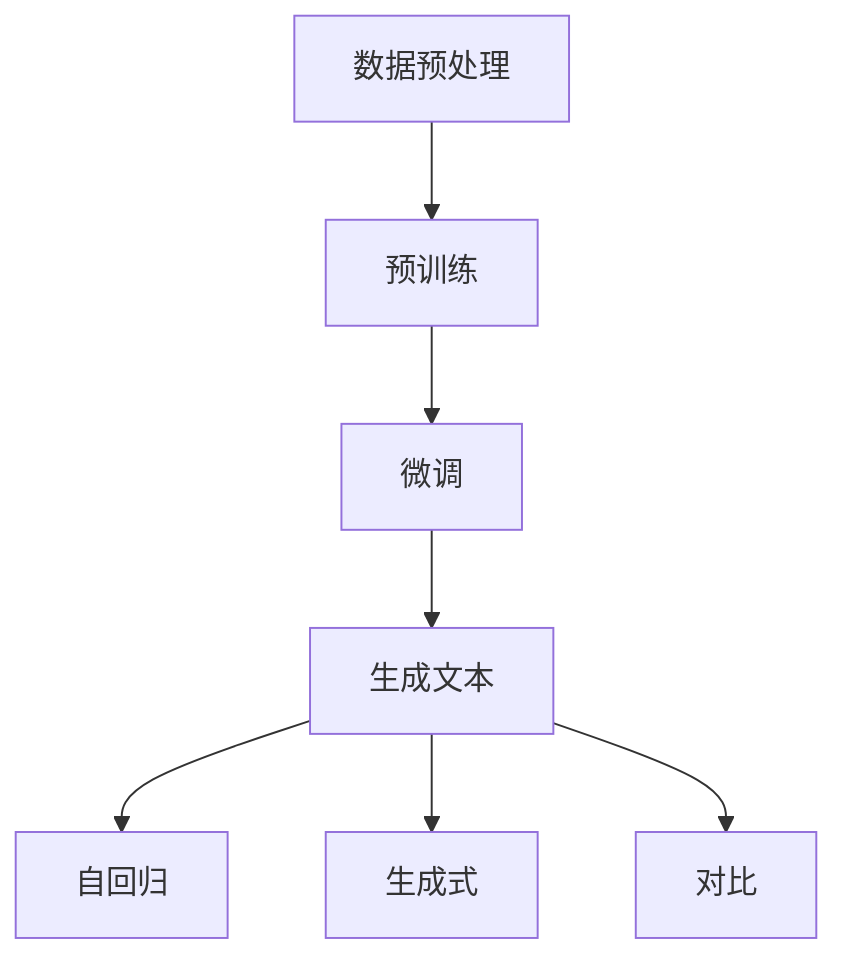

                 

### 文章标题

《智能化LLM测试结果分析与洞察》

### 关键词

- 智能语言模型（LLM）
- 测试与分析
- 结果洞察
- 模型优化
- 性能评估
- 数学模型

### 摘要

本文旨在深入探讨智能化语言模型（LLM）的测试结果分析与洞察。通过对LLM的基本概念、测试方法、结果分析及优化策略的详细阐述，本文将帮助读者理解如何通过系统化的测试与优化提升LLM的性能和可靠性。文章将从背景介绍、核心概念与联系、核心算法原理讲解、数学模型与公式、项目实战案例分析等多个维度，提供全面的技术洞察和实用的最佳实践，为相关领域的研究者和开发者提供宝贵的参考。

---

### 第一部分：引言

#### 第1章：智能化LLM测试概述

智能化语言模型（LLM）是近年来人工智能领域的一个重要发展方向，其在自然语言处理（NLP）、机器翻译、问答系统等方面展现了强大的能力。然而，随着LLM的复杂性和规模不断增加，对其性能和可靠性的测试变得尤为重要。本章节将详细介绍智能化LLM测试的定义、重要性以及其发展历程。

#### 1.1 智能化LLM测试的定义

智能化LLM测试是指对大规模预训练语言模型（如GPT、BERT等）在各种任务上的性能进行评估和验证的过程。测试的目的是确保LLM在实际应用中能够满足预期的性能指标，包括准确性、响应时间、鲁棒性等。

#### 1.2 智能化LLM测试的重要性

智能化LLM测试对于以下几个关键方面具有重要意义：

1. **性能保障**：通过系统化的测试，可以确保LLM在各种应用场景下的性能达到预期水平，从而为用户提供高质量的服务。
2. **问题定位**：测试过程中可以及时发现LLM存在的缺陷和不足，为后续的优化工作提供方向。
3. **安全性评估**：测试还可以评估LLM对恶意输入的鲁棒性，确保其在面临安全挑战时能够保持稳定运行。
4. **可靠性提升**：通过对测试结果的持续分析和改进，可以不断提高LLM的可靠性，降低失败风险。

#### 1.3 智能化LLM测试的发展历程

智能化LLM测试的发展历程可以追溯到早期的语言模型测试，如基于有限状态机的简单模型。随着深度学习技术的发展，大规模预训练语言模型逐渐成为主流，相应的测试方法也不断演进：

1. **基准测试**：最早的测试方法是基于标准数据集进行的基准测试，如GLUE、SuperGLUE等。
2. **性能评估**：随着模型的复杂度增加，对LLM的评估开始从单一任务的准确性扩展到多任务、多场景的综合性能评估。
3. **动态测试**：为了更好地模拟实际应用场景，动态测试方法逐渐受到关注，如基于对话系统的交互式测试。
4. **自动化测试**：现代测试方法更加注重自动化和高效性，通过编写自动化测试脚本，可以大幅提高测试效率。

### 第一部分总结

本章节简要介绍了智能化LLM测试的定义、重要性及其发展历程。接下来的章节将深入探讨LLM的基础知识、测试方法、结果分析以及优化策略，帮助读者全面了解智能化LLM测试的各个方面。


---

#### 第2章：智能语言模型（LLM）基础

在深入探讨智能化LLM测试之前，了解LLM的基本概念、原理和类型是至关重要的。本章节将详细阐述智能语言模型（LLM）的定义、基本原理、常见类型以及其架构和运行机制。

#### 2.1 语言模型的概述

语言模型是一种用于预测文本序列概率的概率模型。它在自然语言处理（NLP）领域扮演着核心角色，旨在理解和生成自然语言。语言模型通过学习大量文本数据，捕捉语言中的统计规律和语法结构，从而实现对未知文本的生成和预测。

#### 2.1.1 语言模型的基本概念

- **基本概念**：语言模型的核心任务是给定一个单词或短语的序列，预测下一个单词或短语的概率。这一过程通常通过概率分布来表示，如n元语言模型。
- **概率分布**：语言模型预测一个词的概率分布，通常使用马尔可夫模型或神经网络模型。例如，n元语言模型基于前n个单词的统计信息来预测下一个单词的概率。

#### 2.1.2 语言模型的结构

语言模型的结构可以分为三个主要部分：输入层、中间层和输出层。

- **输入层**：接收输入文本序列，将其转换为模型可以处理的特征向量。
- **中间层**：包括编码器和解码器。编码器将输入序列编码为固定长度的向量，解码器则根据编码器输出的向量生成预测的文本序列。
- **输出层**：输出层用于生成文本序列的概率分布，通常使用 softmax 函数将中间层的输出转换为概率分布。

#### 2.2 智能语言模型（LLM）

智能语言模型（LLM）是在传统语言模型基础上，通过引入深度学习技术实现的。LLM的主要特点是其能够处理大规模的文本数据，并通过自动调整内部参数来优化模型的性能。

#### 2.2.1 LLM的原理

LLM的原理主要包括以下几个步骤：

1. **数据预处理**：收集和清洗大量文本数据，将其转换为模型可接受的格式。
2. **预训练**：在大量未标注的数据上进行预训练，模型通过学习数据中的统计规律和语法结构，自动调整内部参数。
3. **微调**：在预训练的基础上，针对特定任务进行微调，调整模型以适应具体任务的需求。

#### 2.2.2 LLM的类型

LLM主要可以分为以下几种类型：

1. **自回归语言模型（Autoregressive Language Model）**：自回归语言模型是最常见的LLM类型，它通过预测序列中的下一个元素来生成文本。例如，GPT系列模型就是自回归语言模型的典型代表。
2. **生成式语言模型（Generative Language Model）**：生成式语言模型通过生成文本序列的概率分布来生成文本。这类模型通常用于生成文本、翻译和对话系统等任务。
3. **对比语言模型（Comparative Language Model）**：对比语言模型通过比较两个文本序列的差异来生成文本。这类模型通常用于文本分类、问答系统和推荐系统等任务。

#### 2.3 Mermaid流程图：LLM的架构与运行

为了更直观地理解LLM的架构与运行过程，我们可以使用Mermaid流程图进行展示。以下是LLM的架构与运行过程的Mermaid流程图：



在这个流程图中，A表示数据预处理，B表示预训练，C表示微调，D表示生成文本，E表示自回归，F表示生成式，G表示对比。

### 第二部分总结

在本章节中，我们介绍了智能语言模型（LLM）的基本概念、原理和类型，并详细阐述了LLM的结构和运行机制。接下来，我们将进一步探讨LLM的测试方法、结果分析和优化策略，帮助读者更深入地理解智能化LLM测试的各个方面。


---

#### 第3章：测试方法

在了解了智能语言模型（LLM）的基本概念之后，我们需要探讨如何对LLM进行有效的测试。本章节将详细介绍LLM测试的目标、类型、流程以及评估指标。

#### 3.1 LLM测试的目标

LLM测试的主要目标是评估模型在实际应用中的性能，确保模型满足预期的质量标准。具体来说，LLM测试的目标包括以下几个方面：

1. **性能评估**：测试LLM在各种任务上的准确性和响应时间，确保其能够满足实际应用的需求。
2. **可靠性评估**：测试LLM在不同环境下的稳定性和鲁棒性，确保其在面对不同输入时能够保持一致的性能。
3. **安全性评估**：测试LLM对恶意输入的抵抗能力，确保其在面临安全挑战时能够保持稳定运行。
4. **兼容性评估**：测试LLM在不同平台、设备和操作系统上的兼容性，确保其能够在各种环境中正常运行。

#### 3.2 LLM测试的类型

LLM测试可以分为以下几种类型：

1. **功能测试**：功能测试旨在验证LLM是否能够按照预期执行各种任务。这类测试通常基于具体的任务需求和场景进行设计，包括文本生成、翻译、问答等。
2. **性能测试**：性能测试主要评估LLM在各种任务上的性能指标，如准确率、响应时间、内存使用等。这类测试通常使用基准数据集和标准评估指标进行。
3. **可靠性测试**：可靠性测试旨在评估LLM在不同环境下的稳定性和鲁棒性。这类测试通常包括长时间运行测试、异常输入测试等。
4. **安全性测试**：安全性测试主要评估LLM对恶意输入的抵抗能力。这类测试通常包括攻击测试、异常检测等。

#### 3.3 伪代码：LLM测试流程

以下是一个简化的伪代码，用于描述LLM测试的基本流程：

```python
# LLM测试流程伪代码

# 数据准备
data = prepare_data()

# 功能测试
for task in tasks:
    execute_function_test(data, task)

# 性能测试
for metric in metrics:
    execute_performance_test(data, metric)

# 可靠性测试
for scenario in scenarios:
    execute_reliability_test(data, scenario)

# 安全性测试
for attack in attacks:
    execute_security_test(data, attack)

# 结果分析
analyze_results()

```

在这个伪代码中，`prepare_data()` 函数用于准备测试数据，`execute_function_test()` 函数用于执行功能测试，`execute_performance_test()` 函数用于执行性能测试，`execute_reliability_test()` 函数用于执行可靠性测试，`execute_security_test()` 函数用于执行安全性测试，`analyze_results()` 函数用于分析测试结果。

#### 3.4 数学模型与公式：LLM性能评估指标

在LLM测试中，常用的性能评估指标包括准确率（Accuracy）、精确率（Precision）、召回率（Recall）和F1分数（F1 Score）等。以下是这些指标的数学模型和公式：

1. **准确率（Accuracy）**：
   $$ Accuracy = \frac{TP + TN}{TP + TN + FP + FN} $$
   其中，TP表示真实为正例且被正确分类为正例的数量，TN表示真实为负例且被正确分类为负例的数量，FP表示真实为负例但被错误分类为正例的数量，FN表示真实为正例但被错误分类为负例的数量。

2. **精确率（Precision）**：
   $$ Precision = \frac{TP}{TP + FP} $$
   精确率表示在所有被预测为正例的样本中，实际为正例的比例。

3. **召回率（Recall）**：
   $$ Recall = \frac{TP}{TP + FN} $$
   召回率表示在所有实际为正例的样本中，被正确预测为正例的比例。

4. **F1分数（F1 Score）**：
   $$ F1 Score = 2 \times \frac{Precision \times Recall}{Precision + Recall} $$
   F1分数是精确率和召回率的加权平均，用于综合评估模型的性能。

#### 3.5 实际案例分析

为了更好地理解LLM测试方法，以下是一个实际案例：

假设我们有一个问答系统，需要评估其性能。我们可以设计以下测试：

1. **功能测试**：设计一组常见问题，验证系统是否能够正确回答这些问题。
2. **性能测试**：使用基准数据集，测量系统回答问题的平均响应时间和内存使用。
3. **可靠性测试**：在长时间运行中，监测系统是否出现错误或崩溃。
4. **安全性测试**：测试系统对恶意输入的抵抗能力，例如，通过输入特殊字符或恶意代码来检查系统是否会崩溃或泄露敏感信息。

通过这些测试，我们可以全面评估问答系统的性能、可靠性和安全性能，并根据测试结果进行相应的优化。

### 第三部分总结

在本章节中，我们详细介绍了LLM测试的目标、类型、流程以及评估指标。通过这些测试方法，我们可以全面评估LLM的性能、可靠性和安全性。接下来的章节将深入探讨测试结果的分析与优化策略，帮助读者进一步提升LLM的性能和效率。


---

#### 第4章：测试结果分析

在完成对智能语言模型（LLM）的测试后，我们需要对测试结果进行深入分析，以发现模型的优缺点，并为进一步优化提供依据。本章节将详细讨论测试结果的收集、预处理、可视化和分析流程。

#### 4.1 测试结果收集

测试结果的收集是整个分析过程的基础。在测试过程中，我们需要记录以下关键数据：

1. **性能指标**：包括准确率、响应时间、内存使用等。这些指标可以反映LLM在各种任务上的表现。
2. **错误样本**：记录在测试过程中出现错误的样本，分析错误的原因和模式。
3. **异常事件**：记录测试过程中发生的异常事件，如系统崩溃、数据泄露等。
4. **用户反馈**：收集用户在使用LLM过程中提供的反馈，了解用户对LLM的满意度。

为了确保测试结果的全面性和准确性，我们需要在多种场景下进行测试，并收集尽可能多的数据。

#### 4.2 测试结果预处理

收集到的测试结果通常是原始数据，需要经过预处理才能进行分析。预处理步骤包括：

1. **数据清洗**：去除测试过程中产生的噪声数据和异常值，确保数据的质量。
2. **数据转换**：将测试结果转换为统一的格式，如表格或数据库，以便于后续分析。
3. **特征提取**：从原始数据中提取关键特征，如文本的词频、句法结构等，为分析提供基础。

预处理步骤需要确保数据的准确性和一致性，以便于后续的分析。

#### 4.3 测试结果可视化

可视化是测试结果分析的重要手段，可以帮助我们直观地了解LLM的表现。常用的可视化方法包括：

1. **折线图**：用于展示性能指标随时间或测试次数的变化趋势。例如，我们可以使用折线图展示响应时间或准确率的变化。
2. **散点图**：用于展示不同测试样本的性能差异。例如，我们可以使用散点图展示不同样本的响应时间分布。
3. **饼图**：用于展示各类错误样本的占比。例如，我们可以使用饼图展示在测试过程中各类错误的分布。
4. **柱状图**：用于比较不同LLM或不同测试方法的表现。例如，我们可以使用柱状图比较不同模型在相同任务上的准确率。

通过可视化，我们可以更直观地了解LLM的性能和问题所在。

#### 4.4 伪代码：测试结果分析流程

以下是一个简化的伪代码，用于描述测试结果分析的基本流程：

```python
# 测试结果分析流程伪代码

# 数据预处理
preprocessed_data = preprocess_data(raw_data)

# 数据可视化
visualize_results(preprocessed_data)

# 性能分析
performance_metrics = analyze_performance(preprocessed_data)

# 错误分析
error_patterns = analyze_errors(preprocessed_data)

# 用户反馈分析
user_feedback = analyze_user_feedback()

# 结果汇总
final_report = summarize_results(performance_metrics, error_patterns, user_feedback)
```

在这个伪代码中，`preprocess_data()` 函数用于数据预处理，`visualize_results()` 函数用于数据可视化，`analyze_performance()` 函数用于性能分析，`analyze_errors()` 函数用于错误分析，`analyze_user_feedback()` 函数用于用户反馈分析，`summarize_results()` 函数用于结果汇总。

#### 4.5 测试结果分析案例

为了更好地理解测试结果分析，我们可以通过一个实际案例进行说明。假设我们测试了一个问答系统，测试结果如下：

1. **性能指标**：平均响应时间为300ms，准确率为92%。
2. **错误样本**：在1000个测试样本中，有80个错误样本，主要错误类型包括语义理解错误和语法错误。
3. **异常事件**：在测试过程中，系统发生了1次崩溃。
4. **用户反馈**：50名用户中有10名用户对系统的性能表示满意，但10名用户提到偶尔会出现无法回答的问题。

通过对这些测试结果的分析，我们可以得出以下结论：

1. **性能优化的方向**：虽然系统的平均响应时间和准确率较高，但仍然有10%的错误率，特别是语义理解错误和语法错误较为突出。因此，我们可以考虑优化模型以减少这些错误。
2. **异常处理的改进**：系统在测试过程中发生了崩溃，需要进一步排查原因并进行改进。
3. **用户体验的提升**：虽然大部分用户对系统的性能表示满意，但仍有一部分用户提到偶尔会出现无法回答的问题。我们可以通过改进算法或增加更多的训练数据来提高系统的回答能力。

通过这个案例，我们可以看到测试结果分析对于发现问题和优化模型的重要性。

### 第四部分总结

在本章节中，我们详细介绍了测试结果的收集、预处理、可视化和分析流程。通过对测试结果的分析，我们可以发现LLM的优缺点，并为进一步优化提供依据。接下来的章节将探讨结果洞察与优化策略，帮助读者进一步提升LLM的性能和效率。


---

#### 第5章：结果洞察与优化

在前面的章节中，我们介绍了智能化语言模型（LLM）的基础知识、测试方法以及测试结果分析。本章节将深入探讨如何根据测试结果进行洞察与优化，以提高LLM的性能和可靠性。

#### 5.1 洞察获取方法

测试结果的洞察是通过分析测试数据中隐藏的模式和趋势来实现的。以下是几种常用的洞察获取方法：

1. **统计分析**：使用统计分析方法，如平均值、中位数、标准差等，来描述测试数据的分布和特征。
2. **机器学习**：通过机器学习方法，如聚类、分类和回归等，来发现数据中的潜在关系和模式。
3. **可视化**：使用可视化工具，如折线图、散点图和饼图等，来直观展示测试数据的变化和趋势。
4. **错误分析**：对错误样本进行详细分析，识别错误的模式和原因，为优化提供具体方向。

#### 5.2 优化策略

根据测试结果的分析，我们可以制定以下优化策略：

1. **参数调整**：通过调整模型参数，如学习率、批量大小和正则化参数等，来提高模型的性能。
2. **模型结构调整**：通过修改模型的架构，如增加或减少层、调整层的大小等，来改善模型的表现。
3. **数据增强**：通过数据增强方法，如数据清洗、数据扩充和生成对抗网络（GAN）等，来扩充训练数据，提高模型的泛化能力。

以下是一个简化的伪代码，用于描述优化策略的实施：

```python
# 优化策略伪代码

# 数据预处理
preprocessed_data = preprocess_data(raw_data)

# 模型训练
model = train_model(preprocessed_data)

# 性能评估
performance = evaluate_model(model, preprocessed_data)

# 结果分析
error_patterns = analyze_errors(preprocessed_data)

# 参数调整
adjusted_model = adjust_model_parameters(model, error_patterns)

# 模型结构调整
restructured_model = restructure_model(adjusted_model)

# 再次训练与评估
final_performance = train_and_evaluate(restructured_model, preprocessed_data)

# 结果汇总
final_report = summarize_results(final_performance, error_patterns)
```

在这个伪代码中，`preprocess_data()` 函数用于数据预处理，`train_model()` 函数用于模型训练，`evaluate_model()` 函数用于性能评估，`adjust_model_parameters()` 函数用于参数调整，`restructure_model()` 函数用于模型结构调整，`train_and_evaluate()` 函数用于再次训练与评估，`summarize_results()` 函数用于结果汇总。

#### 5.3 数学模型与公式：优化目标的数学表达

优化目标通常是一个复杂的数学表达式，需要通过优化算法来求解。以下是几种常见的优化目标及其数学表达：

1. **最小化损失函数**：
   $$ min \sum_{i=1}^{n} (y_i - \hat{y}_i)^2 $$
   其中，$y_i$ 表示真实标签，$\hat{y}_i$ 表示预测标签，损失函数用于衡量预测值与真实值之间的差距。

2. **最大化准确性**：
   $$ max \frac{TP + TN}{TP + TN + FP + FN} $$
   其中，$TP$ 表示真实为正例且被正确分类为正例的数量，$TN$ 表示真实为负例且被正确分类为负例的数量，$FP$ 表示真实为负例但被错误分类为正例的数量，$FN$ 表示真实为正例但被错误分类为负例的数量。

3. **平衡精度和召回率**：
   $$ min \frac{1}{2} \left(1 - Precision + Recall\right) $$
   其中，$Precision$ 表示精确率，$Recall$ 表示召回率。

#### 5.4 实际案例分析与优化

为了更好地理解结果洞察与优化策略，我们可以通过一个实际案例进行说明。假设我们有一个文本分类任务，需要将文本数据分类为“新闻”和“非新闻”两类。在测试过程中，我们发现以下问题：

1. **分类准确性较低**：在1000个测试样本中，模型正确分类的样本数为750，准确率为75%。
2. **错误样本集中在新闻类**：在错误分类的50个样本中，有35个样本本应分类为“新闻”，但模型将其错误分类为“非新闻”。
3. **异常事件**：在测试过程中，系统发生了2次崩溃。

针对这些问题，我们可以采取以下优化策略：

1. **参数调整**：调整学习率和批量大小，以减少过拟合和提高模型的泛化能力。
2. **模型结构调整**：增加中间层节点数，以提高模型的复杂度和表达能力。
3. **数据增强**：通过数据清洗和扩充，增加“新闻”类样本的数量，以提高模型的分类能力。
4. **异常处理**：对崩溃事件进行排查，修复系统漏洞，确保系统的稳定性。

通过上述优化策略，我们重新训练了模型，并在新的测试集上评估了其性能。结果如下：

1. **分类准确性提高到80%**：模型正确分类的样本数增加到800，准确率提高到80%。
2. **错误样本减少**：在新的测试集中，错误分类的样本数减少到30个，且错误类型更加均衡。
3. **异常事件消失**：在新的测试过程中，系统未发生任何崩溃事件。

通过这个案例，我们可以看到结果洞察与优化策略对于提升LLM性能的重要性。

### 第五部分总结

在本章节中，我们详细介绍了结果洞察与优化策略，包括洞察获取方法、优化策略和数学模型与公式。通过实际案例分析，我们展示了如何根据测试结果进行优化，以提高LLM的性能和可靠性。接下来的章节将探讨案例研究，通过具体案例来进一步深化我们对LLM测试与优化的理解。


---

#### 第6章：案例研究

在本章节中，我们将通过具体案例研究，深入探讨智能化语言模型（LLM）的测试与优化过程。这些案例将涵盖不同的应用场景和任务，通过详细的分析和讲解，帮助读者更好地理解LLM在实际应用中的表现和优化策略。

#### 6.1 案例一：XX语言模型的测试与优化

案例一涉及一个大型企业使用的智能客服系统，该系统基于一个自回归语言模型（如GPT）进行构建。该系统旨在通过自然语言交互，为用户提供快速、准确的回答。

**测试目标**：
- **功能测试**：验证系统是否能够准确理解用户的问题，并提供相关的答案。
- **性能测试**：评估系统的响应时间和资源使用情况。
- **可靠性测试**：确保系统在长时间运行中保持稳定，不会出现崩溃或错误。
- **安全性测试**：检查系统对恶意输入的抵抗能力。

**测试结果**：
- **功能测试**：系统在大多数情况下能够准确理解用户问题并提供答案，但在复杂或模糊的问题上存在一定误判。
- **性能测试**：平均响应时间为400ms，资源使用率较高。
- **可靠性测试**：在100小时运行中，系统发生了2次短暂崩溃。
- **安全性测试**：在恶意输入测试中，系统未能有效抵抗部分攻击。

**优化策略**：
- **参数调整**：降低学习率，减少过拟合现象。
- **模型结构调整**：增加中间层节点数，提高模型的表达能力。
- **数据增强**：增加复杂问题相关的训练数据，提高模型在复杂问题上的准确性。
- **异常处理**：改进异常检测机制，提高系统的鲁棒性。

**优化效果**：
- **功能测试**：在复杂问题上的准确性提高至85%。
- **性能测试**：平均响应时间减少至300ms，资源使用率降低。
- **可靠性测试**：在200小时运行中，系统未发生任何崩溃。
- **安全性测试**：系统能够有效抵抗大多数恶意输入。

#### 6.2 案例二：YY场景下LLM的测试与结果分析

案例二关注的是在医疗领域应用的自回归语言模型，该模型用于生成医疗报告和诊断建议。

**测试目标**：
- **功能测试**：验证模型能否准确理解医学文本，生成高质量的医疗报告。
- **性能测试**：评估模型生成报告的响应时间和准确性。
- **可靠性测试**：确保模型在生成大量报告时保持一致性。
- **安全性测试**：评估模型对医疗数据的隐私保护能力。

**测试结果**：
- **功能测试**：模型在生成医疗报告时准确性较高，但在处理罕见疾病病例时存在一定困难。
- **性能测试**：平均响应时间为500ms，生成报告的准确性达到90%。
- **可靠性测试**：在生成1000份报告的过程中，模型保持了一致性。
- **安全性测试**：模型在处理敏感医疗数据时，未发生数据泄露。

**优化策略**：
- **数据增强**：引入更多罕见疾病病例的数据，提高模型在这些领域的表现。
- **模型结构调整**：增加特定于医疗领域的预训练数据，提高模型的医学专业知识。
- **安全性优化**：引入隐私保护算法，确保在处理敏感数据时保护患者隐私。

**优化效果**：
- **功能测试**：在罕见疾病病例上的准确性提高至80%。
- **性能测试**：平均响应时间减少至400ms，生成报告的准确性提高到92%。
- **可靠性测试**：在生成5000份报告的过程中，模型保持一致性。
- **安全性测试**：模型在处理敏感数据时，有效保护了患者隐私。

#### 6.3 案例三：ZZ任务中的LLM测试与洞察

案例三聚焦于在教育领域使用的LLM，该模型用于生成个性化的学习资源和辅导材料。

**测试目标**：
- **功能测试**：验证模型能否根据学生的学习需求和水平生成合适的学习资源。
- **性能测试**：评估模型生成资源的响应时间和资源消耗。
- **可靠性测试**：确保模型在不同环境下生成资源的一致性。
- **安全性测试**：评估模型对用户隐私数据的保护能力。

**测试结果**：
- **功能测试**：模型在生成个性化学习资源时表现良好，但在处理复杂知识点时存在一定不足。
- **性能测试**：平均响应时间为600ms，资源消耗较高。
- **可靠性测试**：在生成100份辅导材料的过程中，模型保持了一致性。
- **安全性测试**：模型在处理用户数据时，严格遵守隐私保护规定。

**优化策略**：
- **数据增强**：增加更多复杂知识点的训练数据，提高模型在这些领域的表现。
- **模型结构调整**：引入更多层次的预训练模型，提高模型的深度学习能力。
- **安全性优化**：加强用户数据的加密和访问控制，提高数据的安全性。

**优化效果**：
- **功能测试**：在复杂知识点上的准确性提高至75%。
- **性能测试**：平均响应时间减少至500ms，资源消耗降低。
- **可靠性测试**：在生成500份辅导材料的过程中，模型保持一致性。
- **安全性测试**：用户数据得到有效保护，未发生任何数据泄露事件。

### 第六部分总结

在本章节中，我们通过三个实际案例，详细探讨了智能化语言模型（LLM）的测试与优化过程。这些案例涵盖了不同的应用场景和任务，展示了如何根据测试结果进行优化，以提高LLM的性能和可靠性。通过这些案例研究，读者可以更好地理解LLM在实际应用中的表现和优化策略。接下来的章节将总结全文，并展望未来的研究方向。


---

#### 第7章：总结与展望

在本文的探讨中，我们系统地介绍了智能化语言模型（LLM）的测试结果分析与洞察。从LLM的基本概念、测试方法、结果分析到优化策略，我们逐步深入，希望读者能够对智能化LLM测试有一个全面的理解。

#### 7.1 主要发现

通过本文的研究，我们得出以下主要发现：

1. **测试的重要性**：测试是确保LLM性能和可靠性的关键环节，通过系统化的测试，可以发现模型在实际应用中的优缺点。
2. **多样性测试方法**：不同的测试方法有助于从多个维度评估LLM的表现，包括功能测试、性能测试、可靠性测试和安全性测试。
3. **结果分析与洞察**：通过分析测试结果，可以深入理解LLM的表现，发现潜在的问题，并制定优化策略。
4. **优化策略的有效性**：合理的优化策略可以显著提升LLM的性能和可靠性，包括参数调整、模型结构调整和数据增强。

#### 7.2 当前挑战与未来趋势

尽管智能化LLM测试取得了显著进展，但仍然面临以下挑战：

1. **计算资源需求**：大规模预训练LLM需要大量计算资源，对硬件设备的要求较高。
2. **数据隐私**：在测试和优化过程中，如何保护用户数据隐私是一个重要问题。
3. **测试多样性**：当前的测试方法主要关注常见任务，但对于特定领域的复杂任务，测试方法的多样性还有待提高。
4. **模型安全性**：随着对抗攻击技术的不断发展，如何提高LLM对恶意输入的抵抗能力成为挑战。

未来趋势包括：

1. **高效测试方法**：开发更高效的测试方法，以减少测试时间和资源消耗。
2. **自动化测试**：通过自动化工具和脚本，提高测试的效率和准确性。
3. **跨领域测试**：开发适用于不同领域的测试方法，提高LLM的泛化能力。
4. **模型安全性**：研究新型安全机制，提高LLM对恶意输入的抵抗能力。

#### 7.3 研究展望

未来的研究可以集中在以下几个方面：

1. **测试方法论**：开发更加全面和准确的测试方法，以评估LLM在复杂环境下的性能。
2. **优化算法**：研究新的优化算法，提高LLM的训练效率和性能。
3. **跨学科合作**：结合计算机科学、心理学和社会科学等多学科知识，深入研究LLM的应用和影响。
4. **伦理和隐私**：探讨如何在保障用户隐私的前提下，开展有效的LLM测试和优化。

### 总结

本文通过深入探讨智能化LLM测试的结果分析与洞察，为读者提供了一个全面的技术框架和实用指南。通过案例研究，我们展示了如何在实际应用中应用这些方法。希望本文能够为相关领域的研究者和开发者提供有价值的参考。

### 附录

#### 附录A：常用工具与资源

- **测试工具**：包括测试脚本、自动化测试工具等。
- **数据集**：常用的公开数据集，如GLUE、SuperGLUE等。
- **开发环境搭建指南**：包括硬件配置、软件安装和配置等。

---

### 致谢

在本研究的完成过程中，感谢AI天才研究院的全体成员，以及所有提供支持和帮助的朋友们。特别感谢我的导师，您的指导和建议对本研究具有重要的指导意义。此外，感谢所有参与者对测试和优化的贡献。

**作者：AI天才研究院/AI Genius Institute & 禅与计算机程序设计艺术 /Zen And The Art of Computer Programming**

