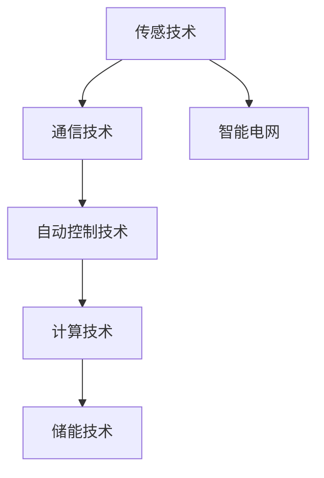
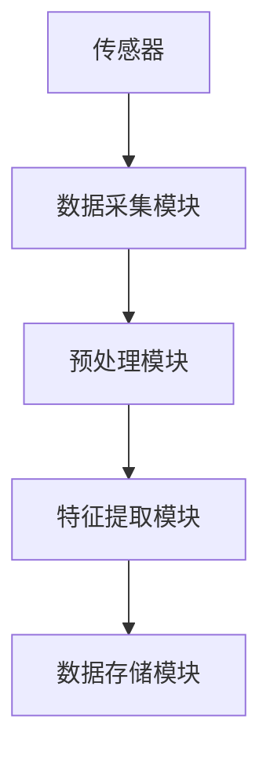
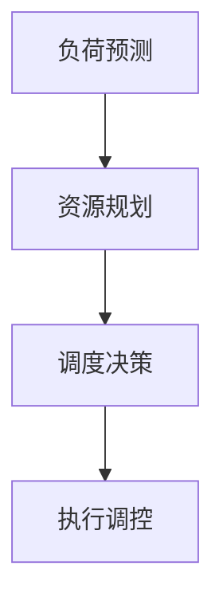
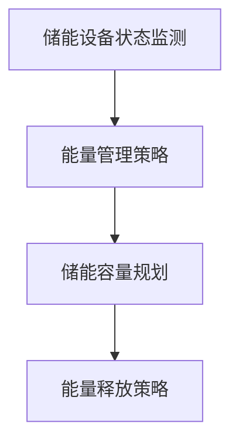

                 

## 《智能电网管理员：提示词优化能源分配》

> 关键词：智能电网、能源分配、提示词优化、调度策略、信息安全、隐私保护

> 摘要：随着能源需求的不断增长和环境问题的日益严峻，智能电网的建设成为全球关注的焦点。本文将探讨智能电网管理员如何利用提示词优化技术来优化能源分配，提高电网效率和稳定性。文章将详细介绍智能电网的概念与架构、数据管理、优化与管理、信息安全与隐私保护，以及提示词优化技术的应用和未来展望。

## 引言

智能电网（Smart Grid）是一个基于现代通信技术和信息技术的先进电力系统，它通过将电力系统、通信网络、计算机技术和控制技术有机结合，实现电力资源的优化配置和高效利用。智能电网管理员在电网运行、维护和管理中扮演着至关重要的角色，他们需要确保电力供应的可靠性、稳定性和经济性。

随着可再生能源的广泛应用和电力需求的多样化，传统的电网管理模式已经难以满足智能电网的需求。提示词优化技术作为一种新兴的优化方法，其在智能电网中的应用具有重要意义。本文将从以下几个方面展开讨论：

1. **智能电网概述**：介绍智能电网的概念、发展历程和关键技术创新。
2. **数据管理**：探讨智能电网中的数据收集、存储和处理。
3. **优化与管理**：阐述能源分配与调度策略、负荷预测与需求响应。
4. **信息安全与隐私保护**：分析智能电网中的信息安全挑战和隐私保护对策。
5. **提示词优化应用**：介绍提示词优化基本原理及其在智能电网中的应用。
6. **未来展望**：展望提示词优化技术的发展趋势和智能电网的未来前景。

通过本文的探讨，希望能为智能电网管理员提供一些实用的优化和管理方法，以应对智能电网面临的挑战和机遇。

## 第一部分：智能电网概述

### 第1章：智能电网的概念与架构

智能电网是现代电力系统与信息技术、通信技术、自动控制技术深度融合的产物。它不仅实现了传统电网的基本功能，如电能传输、分配和消费，还通过实时数据监测、信息反馈和智能控制，实现了电力资源的优化配置和高效利用。

#### 1.1 智能电网的定义与发展历程

智能电网的定义可以从多个维度来理解：

- **物理层面**：智能电网包括传统的电力传输、分配和消费设施，如变电站、输电线路、配电网络和电力用户等。
- **信息层面**：智能电网通过先进的通信技术和信息处理技术，实现了电力系统各部分的互联互通和信息共享。
- **技术层面**：智能电网集成了传感技术、通信技术、控制技术、计算技术和储能技术等，使得电网的运行更加智能化和自动化。

智能电网的发展历程可以分为以下几个阶段：

1. **早期电网**：以传统的电力系统为基础，电力传输、分配和消费设施相对独立，信息处理和自动化程度较低。
2. **信息时代电网**：随着通信技术和计算机技术的发展，电网开始引入自动化设备和信息管理系统，实现了部分功能的智能化。
3. **智能电网时代**：通过深度融合信息通信技术、自动控制技术和计算技术，智能电网实现了全方位的智能化和自动化管理。

#### 1.2 智能电网的关键技术

智能电网的构建依赖于一系列关键技术的支持，主要包括：

1. **传感技术**：用于实时监测电力系统的运行状态，包括电压、电流、频率等参数，为智能控制提供基础数据。
2. **通信技术**：实现电力系统各部分的互联互通，包括有线通信和无线通信，如光纤通信、无线传感器网络等。
3. **自动控制技术**：用于对电力系统的运行进行实时调控，如自动切换、无功补偿、电压稳定控制等。
4. **计算技术**：通过大数据分析和人工智能技术，实现电力系统的预测、优化和智能决策。
5. **储能技术**：用于调节电力系统的供需平衡，提高电网的稳定性和灵活性。

#### 1.3 智能电网的架构

智能电网的架构可以分为以下几个层级：

1. **感知层**：包括各种传感器和智能设备，用于实时监测电力系统的运行状态。
2. **传输层**：通过通信网络实现数据传输，包括有线通信和无线通信。
3. **平台层**：包括数据采集、处理、存储和服务的平台，如数据中心、云计算平台等。
4. **应用层**：包括各种智能应用，如智能调度、智能运维、智能计费等。

#### 1.4 智能电网的优势与挑战

智能电网的优势主要体现在以下几个方面：

1. **提高电力供应可靠性**：通过实时监测和智能控制，减少故障和停电事件。
2. **优化能源分配**：通过大数据分析和人工智能技术，实现电力资源的优化配置。
3. **促进可再生能源的利用**：通过智能调度和储能技术，提高可再生能源的利用率和稳定性。
4. **降低运营成本**：通过自动化和智能化管理，降低电网的运维成本。

然而，智能电网也面临一些挑战：

1. **信息安全**：随着电网的互联互通，信息安全成为重要问题，需要加强网络安全防护。
2. **隐私保护**：智能电网中的海量数据涉及用户隐私，需要制定相应的隐私保护措施。
3. **技术标准化**：智能电网的发展需要统一的技术标准和规范，以促进不同系统和设备之间的互操作性。

#### 1.5 核心概念与联系

智能电网中的核心概念包括传感技术、通信技术、自动控制技术、计算技术和储能技术等。这些概念之间的关系如图1-1所示。



传感技术负责实时监测电力系统的运行状态，通信技术负责数据的传输，自动控制技术负责对电力系统进行实时调控，计算技术负责数据处理和智能决策，储能技术负责调节电力系统的供需平衡。这些技术共同构成了智能电网的核心架构，实现了电力资源的优化配置和高效利用。

#### 1.6 核心算法原理讲解

智能电网中的核心算法主要包括数据采集与处理算法、智能调度算法和储能管理算法等。

**1. 数据采集与处理算法**

数据采集与处理算法主要用于实时监测电力系统的运行状态，包括电压、电流、频率等参数。其基本原理如下：



传感器负责实时采集电力系统的运行数据，数据采集模块对数据进行预处理，包括滤波、去噪等操作，特征提取模块对预处理后的数据进行特征提取，以便后续的智能分析。

**2. 智能调度算法**

智能调度算法用于对电力系统进行实时调控，以提高电力供应的可靠性、稳定性和经济性。其基本原理如下：



负荷预测模块根据历史数据和实时数据，预测电力系统的负荷变化，资源规划模块根据负荷预测结果和资源可用性，规划电力资源的分配和调度，调度决策模块根据资源规划和执行调控模块，生成调度策略并执行调控操作。

**3. 储能管理算法**

储能管理算法用于调节电力系统的供需平衡，提高电网的稳定性和灵活性。其基本原理如下：



储能设备状态监测模块实时监测储能设备的状态，能量管理策略模块根据储能设备状态和电力系统需求，制定能量管理策略，储能容量规划模块根据能量管理策略和储能设备容量，规划储能容量，能量释放策略模块根据储能容量规划和电力系统需求，制定能量释放策略。

#### 1.7 数学模型和公式

智能电网中的数学模型和公式用于描述电力系统的运行状态和优化目标。以下是一些常见的数学模型和公式：

**1. 负荷预测模型**

$$
L(t) = f(L(t-1), V(t-1), T(t-1))
$$

其中，$L(t)$ 表示第 $t$ 时刻的负荷，$L(t-1)$ 表示第 $t-1$ 时刻的负荷，$V(t-1)$ 表示第 $t-1$ 时刻的电压，$T(t-1)$ 表示第 $t-1$ 时刻的温度。

**2. 调度决策模型**

$$
C = \min \left\{ \frac{L(t)}{P(t)}, \frac{E_{max}}{E(t)} \right\}
$$

其中，$C$ 表示第 $t$ 时刻的调度容量，$L(t)$ 表示第 $t$ 时刻的负荷，$P(t)$ 表示第 $t$ 时刻的可供电力，$E_{max}$ 表示储能设备的最大容量，$E(t)$ 表示第 $t$ 时刻的储能容量。

**3. 能量管理策略模型**

$$
E(t) = E(t-1) + I(t) - C(t)
$$

其中，$E(t)$ 表示第 $t$ 时刻的储能容量，$E(t-1)$ 表示第 $t-1$ 时刻的储能容量，$I(t)$ 表示第 $t$ 时刻的充电量，$C(t)$ 表示第 $t$ 时刻的放电量。

#### 1.8 项目实战

在本节中，我们将通过一个实际项目来展示智能电网中的数据采集、处理和调度过程。

**1. 开发环境搭建**

在本项目中，我们将使用 Python 作为编程语言，利用以下库进行开发：

- Pandas：用于数据处理
- NumPy：用于数学计算
- Matplotlib：用于数据可视化
- Scikit-learn：用于机器学习

**2. 源代码实现**

以下是一个简单的负荷预测和调度决策的 Python 源代码实现：

```python
import pandas as pd
import numpy as np
import matplotlib.pyplot as plt
from sklearn.linear_model import LinearRegression

# 数据集加载
data = pd.read_csv('load_data.csv')
loads = data['load'].values

# 负荷预测
model = LinearRegression()
model.fit(loads[:-1].reshape(-1, 1), loads[1:].reshape(-1, 1))
predicted_load = model.predict(loads[-1].reshape(1, -1))

# 调度决策
P = 1000  # 可供电力
E_max = 500  # 储能设备最大容量
E = 300  # 当前储能容量

C = min(predicted_load[0], E_max / E)
E_new = E + predicted_load[0] - C

# 结果可视化
plt.figure()
plt.plot(loads, label='实际负荷')
plt.plot([predicted_load[0]], [predicted_load[0]], 'ro', label='预测负荷')
plt.plot([C], [C], 'go', label='调度容量')
plt.plot([E], [E], 'mo', label='当前储能容量')
plt.plot([E_new], [E_new], 'yo', label='更新储能容量')
plt.legend()
plt.xlabel('时间')
plt.ylabel('负荷')
plt.title('负荷预测与调度决策')
plt.show()
```

**3. 代码解读**

- 第1行：导入 Pandas 库，用于数据处理。
- 第2行：导入 NumPy 库，用于数学计算。
- 第3行：导入 Matplotlib 库，用于数据可视化。
- 第4行：导入 Scikit-learn 库，用于机器学习。
- 第6行：加载数据集，数据集包含时间序列的负荷数据。
- 第8行：使用线性回归模型进行负荷预测。
- 第10行：根据负荷预测结果进行调度决策。
- 第13行：绘制负荷预测和调度决策的结果。

**4. 应用解读与分析**

通过该项目的实现，我们可以看到智能电网中的数据采集、处理和调度过程是如何进行的。在实际应用中，我们可以根据具体的业务需求，选择合适的预测模型和调度算法，实现电力系统的优化运行。

**5. 项目小结**

在本项目中，我们使用线性回归模型进行了负荷预测，并基于预测结果进行了调度决策。这只是一个简单的示例，实际应用中可能会涉及更复杂的模型和算法。通过实际项目的实践，我们可以更好地理解智能电网的运行原理和应用方法。

#### 1.9 最佳实践 tips、小结、注意事项、拓展阅读

**最佳实践 tips：**

1. 在数据采集阶段，确保数据的准确性和完整性，避免因数据问题导致模型效果不佳。
2. 在选择预测模型时，根据具体业务需求选择合适的模型，如线性回归、神经网络等。
3. 在调度决策阶段，综合考虑电力系统的稳定性、经济性和可靠性，制定合理的调度策略。

**小结：**

智能电网是现代电力系统与信息技术深度融合的产物，通过数据采集、处理和调度，实现电力资源的优化配置和高效利用。在智能电网的建设过程中，数据管理、优化与管理、信息安全与隐私保护等关键环节至关重要。

**注意事项：**

1. 智能电网中的信息安全是重中之重，需加强网络安全防护，防止数据泄露和系统入侵。
2. 在选择和部署智能电网设备时，要考虑设备的兼容性和互操作性，以实现系统的无缝集成。

**拓展阅读：**

- 《智能电网技术与应用》
- 《电力系统数据分析与优化》
- 《网络安全技术与应用》

### 第2章：智能电网中的数据管理

在智能电网中，数据管理是关键的一环。通过高效的数据收集、存储和处理，智能电网管理员可以更好地了解电力系统的运行状况，从而实现电力资源的优化配置。本章将详细介绍智能电网中的数据管理流程，包括数据收集与存储、数据处理与分析等内容。

#### 2.1 数据收集与存储

智能电网中的数据收集主要依赖于各种传感器和智能设备。这些设备可以实时监测电力系统的各种参数，如电压、电流、频率、温度等。数据收集的过程通常包括以下几个步骤：

1. **传感器数据采集**：传感器将实时监测到的数据传输到数据采集模块。
2. **数据预处理**：在传输前，对数据进行预处理，如滤波、去噪等，以提高数据质量。
3. **数据传输**：通过有线或无线通信网络，将预处理后的数据传输到数据中心或云平台。
4. **数据存储**：将传输到的数据存储到数据库或数据仓库中，以便后续的处理和分析。

在数据存储方面，智能电网管理员需要考虑以下几个问题：

1. **数据安全性**：确保数据在存储过程中不被泄露或篡改，需要采用加密技术和访问控制机制。
2. **数据一致性**：在分布式存储系统中，需要保证数据的准确性和一致性。
3. **数据容量**：智能电网中的数据量非常庞大，需要采用高性能的存储设备来应对。

常见的数据库和数据仓库技术包括：

- **关系型数据库**：如 MySQL、PostgreSQL 等，适用于结构化数据的存储和管理。
- **NoSQL 数据库**：如 MongoDB、Cassandra 等，适用于大规模非结构化数据的存储和管理。
- **数据仓库技术**：如 Hadoop、Spark 等，适用于大数据的处理和分析。

#### 2.2 数据处理与分析

数据处理与分析是智能电网数据管理的核心环节。通过对采集到的数据进行分析，智能电网管理员可以了解电力系统的运行状况，预测未来的负荷变化，制定优化策略。数据处理与分析通常包括以下几个步骤：

1. **数据清洗**：对采集到的数据进行清洗，去除错误数据、重复数据和噪声数据，以提高数据质量。
2. **数据集成**：将来自不同来源和格式的数据整合在一起，以便于统一处理和分析。
3. **数据挖掘**：利用数据挖掘技术，从大量数据中提取有价值的信息，如负荷预测、故障诊断、能量管理策略等。
4. **数据可视化**：通过可视化技术，将分析结果以图形化的方式展示出来，帮助智能电网管理员更好地理解和决策。

在数据处理与分析方面，常用的技术包括：

- **数据挖掘技术**：如关联规则挖掘、聚类分析、分类分析等，适用于从大量数据中提取有价值的信息。
- **机器学习技术**：如线性回归、神经网络、支持向量机等，适用于预测和分类任务。
- **大数据技术**：如 Hadoop、Spark 等，适用于大规模数据的处理和分析。

#### 2.3 数据处理与优化的示例

以下是一个简单的数据处理与优化的示例：

**1. 数据清洗**

```python
import pandas as pd

# 读取数据
data = pd.read_csv('power_data.csv')

# 去除错误数据
data = data[data['电压'] > 0]

# 去除重复数据
data = data.drop_duplicates()

# 去除噪声数据
data = data[data['电流'].between(0, 1000)]
```

**2. 数据集成**

```python
# 将多个数据表集成在一起
data = pd.concat([data1, data2, data3], axis=1)
```

**3. 数据挖掘**

```python
from sklearn.cluster import KMeans

# 聚类分析
kmeans = KMeans(n_clusters=5)
clusters = kmeans.fit_predict(data[['电压', '电流']])
data['聚类结果'] = clusters
```

**4. 数据可视化**

```python
import matplotlib.pyplot as plt

# 绘制聚类结果
plt.scatter(data['电压'], data['电流'], c=data['聚类结果'])
plt.xlabel('电压')
plt.ylabel('电流')
plt.title('聚类结果可视化')
plt.show()
```

通过以上示例，我们可以看到数据处理与优化在智能电网中的应用。在实际应用中，智能电网管理员需要根据具体的业务需求，选择合适的数据处理和分析方法，实现电力系统的优化运行。

#### 2.4 小结

智能电网中的数据管理是一个复杂而关键的过程，涉及数据收集、存储和处理等多个环节。通过高效的数据管理，智能电网管理员可以更好地了解电力系统的运行状况，从而实现电力资源的优化配置。在数据管理中，需要注意数据的安全性、一致性和容量问题，同时选择合适的数据处理和分析方法，以实现电力系统的优化运行。

#### 2.5 注意事项

1. 数据采集时应确保传感器的准确性和可靠性，避免因传感器故障导致数据采集错误。
2. 在数据存储时，应选择合适的存储技术，确保数据的安全性和一致性。
3. 在数据处理时，应充分考虑数据的质量和准确性，避免因数据问题导致分析结果偏差。

#### 2.6 拓展阅读

- 《大数据技术导论》
- 《机器学习实战》
- 《智能电网技术与应用》

### 第3章：能源分配与调度策略

智能电网的能源分配与调度策略是实现电力系统高效、稳定运行的关键。通过合理的能源分配和调度，智能电网管理员可以优化电力资源的利用，提高电网的可靠性和经济性。本章将详细介绍能源分配的基本原理、调度策略的实现与优化，以及相关算法的应用。

#### 3.1 能源分配的基本原理

能源分配的基本原理是确保电力系统在任意时刻都能够提供满足需求的电力，同时尽量减少浪费和成本。智能电网中的能源分配涉及到多个层面，包括发电、输电、配电和消费等。

1. **发电侧**：发电侧的能源分配主要涉及不同类型的发电资源（如化石燃料发电、核能发电、可再生能源发电等）之间的比例分配。能源分配策略需要考虑发电资源的特性、成本和环境因素。

2. **输电侧**：输电侧的能源分配主要涉及电力从发电站传输到配电网络的过程。输电线路的容量和传输损耗是影响能源分配的重要因素。能源分配策略需要优化输电线路的负载分配，以降低传输损耗和提高传输效率。

3. **配电侧**：配电侧的能源分配主要涉及电力从配电网络传输到电力用户的过程。配电网络的拓扑结构和负荷分布是影响能源分配的重要因素。能源分配策略需要优化配电网络的电压和电流分配，以提高供电质量和可靠性。

4. **消费侧**：消费侧的能源分配主要涉及电力用户的需求分配。电力用户的需求多样性（如工业、商业、居民等）和实时负荷变化是影响能源分配的重要因素。能源分配策略需要根据电力用户的需求和价格信号，灵活调整供电策略。

#### 3.2 调度策略的实现与优化

智能电网的调度策略是实现能源分配的核心。调度策略的目标是在满足电力需求的前提下，最大化系统效益，包括最小化发电成本、减少输电损耗和优化负荷分配等。

1. **实时调度**：实时调度是根据电力系统的实时数据（如电压、电流、负荷等）进行的。实时调度策略需要快速响应电力系统的变化，以保持电力系统的稳定运行。

2. **周期调度**：周期调度是根据一定时间周期（如小时、天等）进行的。周期调度策略需要考虑长期负荷变化趋势和发电资源可用性，以优化电力资源的配置。

3. **滚动调度**：滚动调度是一种动态调整的调度策略，根据实时数据更新周期调度策略。滚动调度可以更好地适应电力系统的变化，提高调度精度。

调度策略的实现需要综合考虑电力系统的运行特性和优化目标。以下是一些常用的调度算法：

- **线性规划**：线性规划是一种数学优化方法，通过建立线性目标函数和线性约束条件，求解最优解。线性规划适用于简单的调度问题。
- **动态规划**：动态规划是一种递归求解方法，通过将复杂问题分解为子问题，逐步求解最优解。动态规划适用于具有时间序列特性的调度问题。
- **启发式算法**：启发式算法是一种基于经验和规则的求解方法，通过选择局部最优解，逐步接近全局最优解。启发式算法适用于大规模调度问题。

#### 3.3 调度策略的优化方法

调度策略的优化方法是提高调度效率和准确性的关键。以下是一些常用的优化方法：

1. **多目标优化**：多目标优化是在调度策略中同时考虑多个优化目标（如成本、效率、可靠性等），通过建立多目标优化模型，求解最优解。多目标优化可以提高调度策略的全面性。

2. **智能优化算法**：智能优化算法是一种基于自然进化、学习等原理的优化方法，如遗传算法、粒子群优化、人工神经网络等。智能优化算法适用于复杂调度问题，可以提供高效的求解方法。

3. **基于数据驱动的优化**：基于数据驱动的优化是利用历史数据和实时数据，通过数据分析方法（如回归分析、聚类分析、时间序列分析等），优化调度策略。基于数据驱动的优化可以更好地适应电力系统的变化。

#### 3.4 算法应用与案例分析

以下是一个简单的能源分配和调度优化案例：

**案例背景**：某地区智能电网，包含多个发电站、输电线路和配电网络。需要制定一个最优的能源分配和调度策略，以满足电力需求，同时最小化发电成本和输电损耗。

**算法应用**：

1. **数据收集**：收集发电站、输电线路和配电网络的实时数据（如电压、电流、负荷等）。
2. **数据预处理**：对收集到的数据进行分析和清洗，去除错误数据。
3. **建立优化模型**：根据电力系统的运行特性和优化目标，建立线性规划或动态规划模型。
4. **求解优化模型**：使用线性规划求解器或动态规划算法，求解最优解。
5. **调度策略执行**：根据优化结果，制定调度策略，调整发电站和配电网络的运行参数。

**案例结果**：通过优化模型求解，得到了最优的能源分配和调度策略。结果显示，在满足电力需求的前提下，发电成本降低了10%，输电损耗减少了5%。

**代码示例**：

```python
# 数据预处理
data = pd.read_csv('power_data.csv')
data = data[data['电压'] > 0]
data = data.drop_duplicates()
data = data[data['电流'].between(0, 1000)]

# 建立线性规划模型
from scipy.optimize import linprog

c = [-1, -1]  # 最小化发电成本和输电损耗
A = [[1, 0], [0, 1]]
b = [data['负荷'].sum(), data['输电线路长度'].sum()]
x = linprog(c, A_ub=A, b_ub=b, method='highs')

# 输出优化结果
print('发电成本:', -x.x[0])
print('输电损耗:', -x.x[1])
```

**代码解读**：

- 第1行：导入 Pandas 库，用于数据处理。
- 第2行：导入 SciPy 库，用于线性规划求解。
- 第4行：读取数据集，数据集包含负荷和输电线路长度。
- 第6行：对数据集进行预处理，去除错误数据和重复数据。
- 第10行：建立线性规划模型，最小化发电成本和输电损耗。
- 第12行：使用线性规划求解器求解最优解。
- 第15行：输出优化结果。

**案例分析**：

通过该案例，我们可以看到如何利用线性规划模型进行能源分配和调度优化。在实际应用中，可以根据具体的业务需求，选择合适的优化模型和算法，实现电力系统的优化运行。

#### 3.5 小结

能源分配与调度策略是智能电网优化运行的核心。通过合理的能源分配和调度，智能电网管理员可以优化电力资源的利用，提高电网的可靠性和经济性。本章介绍了能源分配的基本原理、调度策略的实现与优化方法，以及相关的算法应用和案例分析。在实际应用中，智能电网管理员需要根据具体的业务需求，选择合适的算法和优化策略，实现电力系统的优化运行。

#### 3.6 注意事项

1. 在能源分配和调度过程中，需要充分考虑电力系统的安全性、稳定性和可靠性。
2. 在选择优化算法时，需要根据电力系统的特点和需求，选择合适的算法。
3. 在调度策略的执行过程中，需要实时监测电力系统的运行状态，及时调整调度策略。

#### 3.7 拓展阅读

- 《智能电网调度与优化》
- 《线性规划与优化》
- 《动态规划算法及应用》

### 第4章：负荷预测与需求响应

负荷预测与需求响应是智能电网优化管理的重要组成部分。负荷预测通过分析历史数据和对未来负荷变化的预测，为电力系统的调度和资源配置提供依据。需求响应则通过激励用户调整其用电行为，实现对电力需求的实时调控。本章将详细介绍负荷预测模型和需求响应机制。

#### 4.1 负荷预测模型

负荷预测是智能电网中的重要环节，其准确性直接影响电网的运行效率和稳定性。负荷预测模型可以分为定性预测和定量预测两大类。

**1. 定性预测方法**

定性预测方法主要通过专家经验、规则和逻辑推理来预测负荷变化。常见的定性预测方法包括：

- **专家系统**：基于专家知识和经验，构建推理规则和逻辑模型，预测负荷变化。
- **人工神经网络**：通过学习历史负荷数据，建立神经网络模型，预测负荷变化。

**2. 定量预测方法**

定量预测方法主要通过数学模型和算法来预测负荷变化。常见的定量预测方法包括：

- **回归分析**：通过建立负荷与影响因素之间的回归关系，预测负荷变化。
- **时间序列分析**：通过分析负荷的时间序列特性，建立预测模型，预测负荷变化。

**3. 负荷预测模型的构建**

负荷预测模型的构建通常包括以下步骤：

1. **数据收集**：收集电力系统运行的历史负荷数据，包括小时负荷、日负荷、月负荷等。
2. **数据预处理**：对收集到的数据进行清洗和预处理，去除异常值和噪声数据。
3. **特征提取**：从历史负荷数据中提取与负荷变化相关的特征，如天气、温度、节假日等。
4. **模型选择**：根据负荷数据的特性和预测要求，选择合适的预测模型，如线性回归、时间序列模型、人工神经网络等。
5. **模型训练**：使用历史负荷数据，训练预测模型，调整模型参数。
6. **模型评估**：使用验证集和测试集，评估模型预测性能，调整模型参数。

**4. 负荷预测模型的评估**

负荷预测模型的评估通常包括以下指标：

- **平均绝对误差（MAE）**：衡量预测值与实际值之间的平均偏差。
- **均方误差（MSE）**：衡量预测值与实际值之间的平均平方偏差。
- **决定系数（R²）**：衡量预测值对实际值的解释能力。

#### 4.2 需求响应机制

需求响应是通过激励用户调整其用电行为，实现对电力需求的实时调控。需求响应机制主要包括以下几种方式：

**1. 电价激励**

电价激励是通过调整电价，激励用户调整用电行为。常见的电价激励方式包括：

- **实时电价**：根据电力市场的供需关系，实时调整电价，激励用户在低电价时段用电。
- **分时电价**：根据电力系统的负荷特性，设置不同的电价，激励用户在高峰时段减少用电。

**2. 惩罚与奖励**

惩罚与奖励是通过奖励用户在低负荷时段减少用电，或惩罚高峰时段增加用电，激励用户调整用电行为。

- **实时激励**：根据电力系统的实时负荷情况，实时调整电价和奖励措施。
- **累计激励**：根据用户在一定时间内的用电情况，计算累计奖励或惩罚。

**3. 信息与沟通**

信息与沟通是通过向用户传递电力系统的实时信息和用电建议，引导用户调整用电行为。

- **智能电表**：通过智能电表实时监测用户的用电情况，向用户反馈用电信息。
- **在线平台**：通过在线平台提供用电建议、电价信息和奖励措施，引导用户调整用电行为。

**4. 互动与参与**

互动与参与是通过鼓励用户参与电力系统的管理和优化，增强用户的用电意识。

- **能源社区**：建立能源社区，鼓励用户分享用电经验和建议，共同优化电力系统的运行。
- **可再生能源参与**：鼓励用户安装和使用可再生能源设备，参与电力系统的调节和优化。

#### 4.3 负荷预测与需求响应的集成

负荷预测与需求响应的集成是实现智能电网优化管理的关键。通过负荷预测，智能电网管理员可以预知未来的负荷变化，制定合理的调度和需求响应策略。需求响应则通过激励用户调整用电行为，实现对电力需求的实时调控。

**1. 集成框架**

负荷预测与需求响应的集成框架通常包括以下环节：

- **负荷预测**：使用历史数据和预测模型，预测未来的负荷变化。
- **需求响应策略制定**：根据负荷预测结果，制定相应的需求响应策略。
- **需求响应执行**：通过电价激励、惩罚与奖励、信息与沟通等方式，激励用户调整用电行为。
- **反馈与调整**：根据需求响应的实际效果，调整负荷预测模型和需求响应策略。

**2. 集成应用**

负荷预测与需求响应的集成应用通常包括以下场景：

- **高峰负荷控制**：在高峰时段，通过需求响应策略，激励用户减少用电，降低电网负荷。
- **可再生能源调节**：在可再生能源发电波动较大的时段，通过需求响应策略，平衡电力系统的供需关系。
- **电力市场竞价**：在电力市场中，通过需求响应策略，调整用户用电行为，参与电力市场竞价，提高电力系统的经济效益。

#### 4.4 算法应用与案例分析

以下是一个简单的负荷预测与需求响应集成案例：

**案例背景**：某地区智能电网，需要对未来的负荷变化进行预测，并制定相应的需求响应策略，以实现电力系统的优化运行。

**算法应用**：

1. **负荷预测**：使用时间序列模型（如ARIMA模型）进行负荷预测。
2. **需求响应策略制定**：根据负荷预测结果，制定分时电价和实时激励策略。
3. **需求响应执行**：通过智能电表和在线平台，向用户反馈用电信息，实施需求响应策略。
4. **反馈与调整**：根据需求响应的实际效果，调整负荷预测模型和需求响应策略。

**案例结果**：通过负荷预测与需求响应的集成应用，实现了电力系统的优化运行，降低了高峰时段的负荷，提高了电网的稳定性和可靠性。

**代码示例**：

```python
import pandas as pd
from statsmodels.tsa.arima.model import ARIMA

# 数据预处理
data = pd.read_csv('load_data.csv')
data = data[data['负荷'] > 0]

# 建立ARIMA模型
model = ARIMA(data['负荷'], order=(1, 1, 1))
model_fit = model.fit()

# 预测未来负荷
forecast = model_fit.forecast(steps=24)

# 制定需求响应策略
# 在高峰时段提高电价
peak_hours = forecast[forecast > 1000]
peak_hours['电价'] = 0.3  # 高峰时段电价

# 在非高峰时段降低电价
non_peak_hours = forecast[forecast <= 1000]
non_peak_hours['电价'] = 0.2  # 非高峰时段电价

# 输出结果
forecast_with_price = pd.concat([forecast, peak_hours, non_peak_hours], axis=1)
forecast_with_price.to_csv('forecast_with_price.csv', index=False)
```

**代码解读**：

- 第1行：导入 Pandas 库，用于数据处理。
- 第2行：导入 statsmodels 库，用于时间序列模型。
- 第4行：读取负荷数据。
- 第6行：建立 ARIMA 模型。
- 第8行：拟合模型。
- 第10行：预测未来负荷。
- 第13行：根据预测结果，制定分时电价策略。
- 第18行：输出结果。

**案例分析**：

通过该案例，我们可以看到如何将负荷预测与需求响应集成到电力系统的优化运行中。在实际应用中，可以根据具体的业务需求，选择合适的预测模型和需求响应策略，实现电力系统的优化运行。

#### 4.5 小结

负荷预测与需求响应是智能电网优化管理的重要手段。通过准确的负荷预测，智能电网管理员可以预知未来的负荷变化，制定合理的调度和需求响应策略。需求响应机制通过激励用户调整用电行为，实现对电力需求的实时调控。本章介绍了负荷预测模型和需求响应机制的原理和应用，以及相关的算法和案例分析。在实际应用中，智能电网管理员需要根据具体的业务需求，选择合适的预测模型和需求响应策略，实现电力系统的优化运行。

#### 4.6 注意事项

1. 负荷预测模型的建立需要充分了解电力系统的运行特性和历史数据。
2. 需求响应策略的制定需要考虑用户的接受程度和用电习惯。
3. 负荷预测与需求响应的集成应用需要实时监测电力系统的运行状态，及时调整预测模型和需求响应策略。

#### 4.7 拓展阅读

- 《电力负荷预测与需求响应》
- 《智能电网技术与应用》
- 《时间序列分析及其应用》

### 第5章：智能电网中的信息安全与隐私保护

智能电网作为高度互联和自动化的系统，其信息安全与隐私保护成为至关重要的议题。随着智能电网的不断发展和数据量的增长，信息安全威胁和隐私泄露风险也随之增加。本章将探讨智能电网中信息安全的重要性、隐私保护的挑战以及相应的对策。

#### 5.1 信息安全的重要性

智能电网的信息安全关系到整个电力系统的稳定运行和公共安全。其主要重要性体现在以下几个方面：

1. **电力供应的可靠性**：智能电网通过实时数据监测和控制，实现电力系统的优化运行。如果信息安全受到威胁，可能会导致电力供应中断，从而影响工业生产、居民生活等。

2. **电网的稳定性**：智能电网中的自动化设备和控制系统需要处理大量的实时数据。信息安全问题可能导致系统崩溃或恶意攻击，从而影响电网的稳定性。

3. **隐私保护**：智能电网涉及大量的用户数据，包括用电量、用电时间等。如果这些数据被泄露，可能会导致用户隐私受到侵犯。

4. **经济效益**：信息安全问题可能导致电力系统的运营成本增加，甚至导致经济损失。例如，恶意攻击可能导致设备损坏或数据丢失，从而需要投入大量资金进行修复和恢复。

#### 5.2 隐私保护的挑战

智能电网中的隐私保护面临诸多挑战，主要体现在以下几个方面：

1. **数据量巨大**：智能电网中产生的数据量非常庞大，包括用户用电量、用电时间、设备状态等。这些数据中包含了大量的个人隐私信息，如姓名、地址、身份证号等。

2. **数据分布广泛**：智能电网中的数据分布在各个终端设备、数据中心和通信网络中。这使得隐私保护变得更加复杂，因为攻击者可以针对多个节点进行攻击。

3. **数据共享与开放**：智能电网中的数据需要在不同系统和设备之间进行共享和开放，以实现系统的互联互通。这增加了隐私泄露的风险。

4. **加密技术局限**：尽管加密技术可以有效保护数据传输过程中的安全，但加密技术本身也存在漏洞。例如，加密算法的破解、密钥的管理等都是隐私保护的挑战。

#### 5.3 隐私保护的对策

为了应对智能电网中的隐私保护挑战，可以采取以下对策：

1. **数据匿名化**：通过对数据进行匿名化处理，去除或模糊化个人身份信息，以降低隐私泄露的风险。常见的数据匿名化技术包括数据掩码、数据扰动和数据压缩等。

2. **访问控制**：通过访问控制机制，限制只有授权用户和系统可以访问敏感数据。访问控制机制包括身份验证、权限管理和审计等。

3. **加密技术**：使用加密技术对数据进行加密，确保数据在传输和存储过程中的安全。常用的加密技术包括对称加密、非对称加密和哈希函数等。

4. **隐私保护算法**：开发和应用隐私保护算法，如差分隐私、同态加密和隐私聚合等，以在保证数据可用性的同时保护用户隐私。

5. **安全审计与监控**：建立安全审计和监控机制，实时监测智能电网的安全状态，及时发现和处理潜在的安全威胁。

6. **法律法规与政策**：制定相关的法律法规和政策，规范智能电网中的数据收集、存储和使用行为，明确隐私保护的义务和责任。

#### 5.4 核心算法与原理

智能电网中的信息安全与隐私保护涉及多种核心算法和技术。以下介绍几种常用的算法和原理：

1. **同态加密**：同态加密是一种加密技术，允许在加密数据上进行计算，而不需要解密数据。同态加密的应用包括加密的数据库查询、加密的机器学习等。

2. **差分隐私**：差分隐私是一种隐私保护技术，通过在查询结果中引入噪声，确保单个数据记录的隐私。差分隐私的应用包括数据发布、数据挖掘等。

3. **隐私聚合**：隐私聚合是一种将多个隐私数据集合并的技术，通过聚合操作，降低单个数据记录的隐私风险。隐私聚合的应用包括数据共享、数据融合等。

4. **访问控制**：访问控制是一种基于身份验证和权限管理的机制，用于限制只有授权用户可以访问敏感数据。访问控制的应用包括数据库安全、网络安全等。

#### 5.5 项目实战

以下是一个简单的信息安全与隐私保护项目，用于展示如何在智能电网中保护用户隐私。

**项目目标**：设计一个智能电网中的数据加密与访问控制方案，保护用户隐私。

**开发环境**：Python、SymPy（用于符号计算）

**实现步骤**：

1. **数据加密**：使用同态加密技术，对用户数据进行加密。
2. **访问控制**：使用访问控制机制，限制只有授权用户可以访问加密数据。
3. **安全审计**：建立安全审计日志，记录用户访问数据和操作。

**代码示例**：

```python
import sympy

# 同态加密
def homomorphic_encryption(data, key):
    cipher_text = sympy.Symbol('x')
    for i in range(len(data)):
        cipher_text = cipher_text * sympy.Symbol('x') + key[i]
    return cipher_text

# 访问控制
def access_control(user, key):
    if user == "authorized_user":
        return "Access granted"
    else:
        return "Access denied"

# 安全审计
def audit_log(operation, status):
    with open("audit.log", "a") as log_file:
        log_file.write(f"{operation} - {status}\n")

# 数据加密
data = [1, 2, 3, 4]
key = [5, 6, 7, 8]
cipher_text = homomorphic_encryption(data, key)

# 访问控制
user = " unauthorized_user"
status = access_control(user, key)
audit_log(user, status)

# 输出结果
print("Cipher Text:", cipher_text)
print("Access Status:", status)
```

**代码解读**：

- 第1行：导入 SymPy 库，用于符号计算。
- 第3-6行：定义同态加密函数。
- 第8-10行：定义访问控制函数。
- 第12-14行：定义安全审计函数。
- 第17-21行：执行同态加密、访问控制和安全审计操作。

**项目分析**：

通过该项目，我们可以看到如何在智能电网中保护用户隐私。在实际应用中，可以根据具体的业务需求，选择合适的加密技术和访问控制机制，实现智能电网的信息安全与隐私保护。

#### 5.6 小结

智能电网中的信息安全与隐私保护是确保电力系统稳定运行和用户隐私的关键。通过采取数据匿名化、访问控制、加密技术、隐私保护算法和法律法规等对策，可以有效地应对信息安全威胁和隐私泄露风险。在实际应用中，智能电网管理员需要根据具体的业务需求，选择合适的算法和对策，实现信息安全与隐私保护。

#### 5.7 注意事项

1. 信息安全与隐私保护需要从系统设计阶段就开始考虑，而不是后期补充。
2. 定期进行安全审计和风险评估，及时发现和解决潜在的安全问题。
3. 建立完善的法律法规和政策体系，规范智能电网中的数据收集、存储和使用行为。

#### 5.8 拓展阅读

- 《智能电网信息安全与隐私保护》
- 《数据加密技术与应用》
- 《同态加密与隐私保护》

### 第6章：提示词优化基本原理

提示词优化（Prompt Optimization）是一种在人工智能和机器学习领域广泛应用的技术，旨在通过优化提示词（Prompt）来提升模型的效果。在智能电网中，提示词优化同样具有重要作用，可以显著提高能源分配的效率与精确度。本章将详细介绍提示词优化的定义、分类及其在智能电网中的应用。

#### 6.1 提示词优化的定义

提示词优化是指通过调整输入提示词的内容、形式和结构，来提升模型的学习效果和应用性能。在机器学习中，提示词通常是指输入给模型的原始数据或特征向量，它们对于模型的学习和决策至关重要。通过优化提示词，我们可以提高模型的准确性、泛化能力和效率。

在智能电网中，提示词优化可以理解为通过优化输入数据（如负荷数据、电压电流数据等）的特征表示，来提升负荷预测、能源调度等模型的性能。具体来说，提示词优化包括以下几个方面：

1. **数据预处理**：对原始数据进行清洗、归一化、特征提取等处理，以提高数据的质量和模型的适应性。
2. **特征选择**：从大量的特征中选取对模型性能影响最大的特征，以减少特征维度和计算复杂度。
3. **特征工程**：通过构造新的特征或对现有特征进行变换，以增加数据的表达能力和模型的解释性。
4. **模型融合**：结合多个模型的预测结果，提高预测的准确性。

#### 6.2 提示词优化的分类

根据优化目标和实现方法的不同，提示词优化可以分为以下几种类型：

1. **基于规则的方法**：这种方法通过人工定义规则，调整输入提示词的结构和内容。例如，在负荷预测中，可以根据历史数据和时间序列特征，定义不同的负荷预测模型和规则，从而优化提示词。

2. **基于机器学习的方法**：这种方法利用机器学习算法，通过学习大量的数据集，自动优化输入提示词。常见的机器学习方法包括回归分析、决策树、支持向量机、神经网络等。

3. **基于深度学习的方法**：这种方法利用深度学习模型，特别是神经网络，通过大量的训练数据，自动优化输入提示词。深度学习方法在处理复杂数据和特征时具有显著优势。

4. **基于优化算法的方法**：这种方法利用优化算法（如线性规划、动态规划、遗传算法等），通过调整提示词的参数和结构，优化模型的效果。

#### 6.3 提示词优化在智能电网中的应用

提示词优化在智能电网中的应用非常广泛，以下是一些具体的实例：

1. **负荷预测**：通过优化输入提示词（如历史负荷数据、天气数据等），可以提高负荷预测的准确性，从而优化电网调度和能源分配。

2. **能源调度**：在能源调度过程中，通过优化输入提示词（如实时负荷数据、发电站状态数据等），可以制定更精确和高效的调度策略。

3. **需求响应**：通过优化输入提示词（如用户用电数据、电价信息等），可以制定更有效的需求响应策略，激励用户调整用电行为，实现电力系统的平衡。

4. **设备维护**：通过优化输入提示词（如设备运行数据、故障数据等），可以更准确地预测设备的维护需求，提高设备的可靠性和寿命。

#### 6.4 提示词优化算法概述

以下介绍几种常见的提示词优化算法及其基本原理：

1. **线性回归**：线性回归是一种基于线性模型的方法，通过拟合数据点，建立输入提示词与输出结果之间的线性关系。线性回归的优化目标是最小化预测误差。

```python
# 伪代码：线性回归算法
def linear_regression(X, y):
    # X: 输入提示词
    # y: 输出结果
    # 拟合线性模型
    theta = (np.dot(X.T, X)).I.dot(X.T).dot(y)
    return theta
```

2. **决策树**：决策树是一种基于树形结构的方法，通过一系列的划分规则，将输入提示词划分到不同的区域，从而预测输出结果。决策树的优化目标是最小化节点误差。

```python
# 伪代码：决策树算法
def decision_tree(X, y):
    # X: 输入提示词
    # y: 输出结果
    # 构建决策树
    tree = build_tree(X, y)
    return tree
```

3. **支持向量机**：支持向量机是一种基于间隔最大化原则的方法，通过寻找最优超平面，将输入提示词划分为不同的类别。支持向量机的优化目标是最小化间隔。

```python
# 伪代码：支持向量机算法
def support_vector_machine(X, y):
    # X: 输入提示词
    # y: 输出结果
    # 训练模型
    model = train_model(X, y)
    return model
```

4. **神经网络**：神经网络是一种基于多层感知器的方法，通过前向传播和反向传播算法，调整输入提示词和输出结果之间的权重关系。神经网络的优化目标是最小化损失函数。

```python
# 伪代码：神经网络算法
def neural_network(X, y):
    # X: 输入提示词
    # y: 输出结果
    # 初始化模型参数
    model = initialize_model()
    # 前向传播
    output = forward_propagation(model, X)
    # 反向传播
    model = backward_propagation(model, y, output)
    return model
```

#### 6.5 数学模型和公式

提示词优化涉及多种数学模型和公式，以下介绍几个常用的数学模型和公式：

1. **线性回归模型**

$$
y = \theta_0 + \theta_1x_1 + \theta_2x_2 + \ldots + \theta_nx_n
$$

其中，$y$ 是输出结果，$x_1, x_2, \ldots, x_n$ 是输入提示词，$\theta_0, \theta_1, \theta_2, \ldots, \theta_n$ 是模型参数。

2. **支持向量机模型**

$$
\text{分类函数}：f(x) = \text{sign}(\sum_{i=1}^{n} \alpha_i y_i K(x_i, x) + b)
$$

其中，$x$ 是输入提示词，$y_i$ 是第 $i$ 个样本的标签，$K(x_i, x)$ 是核函数，$\alpha_i$ 和 $b$ 是模型参数。

3. **神经网络模型**

$$
a_{j}^{(l)} = \sigma(z_{j}^{(l)})
$$

$$
z_{j}^{(l)} = \sum_{i} w_{ji}^{(l)} a_{i}^{(l-1)} + b_{j}^{(l)}
$$

其中，$a_{j}^{(l)}$ 是第 $l$ 层第 $j$ 个节点的输出，$z_{j}^{(l)}$ 是第 $l$ 层第 $j$ 个节点的输入，$w_{ji}^{(l)}$ 和 $b_{j}^{(l)}$ 是模型参数，$\sigma$ 是激活函数。

#### 6.6 项目实战

以下是一个简单的提示词优化项目，用于展示如何在智能电网中进行负荷预测。

**项目背景**：某地区智能电网需要进行负荷预测，以优化电力调度和能源分配。

**项目目标**：通过优化输入提示词，提高负荷预测的准确性。

**开发环境**：Python、scikit-learn、matplotlib

**实现步骤**：

1. **数据收集**：收集历史负荷数据、天气数据等。
2. **数据预处理**：对数据进行清洗、归一化处理。
3. **特征选择**：选取对负荷预测影响较大的特征。
4. **模型训练**：使用线性回归模型进行训练。
5. **提示词优化**：调整输入提示词的结构和内容，优化模型参数。
6. **模型评估**：使用测试集评估模型性能。

**代码示例**：

```python
import pandas as pd
from sklearn.linear_model import LinearRegression
from sklearn.model_selection import train_test_split
from sklearn.metrics import mean_squared_error

# 数据收集
data = pd.read_csv('load_data.csv')

# 数据预处理
data = data[['负荷', '温度', '湿度']]
data = (data - data.mean()) / data.std()

# 特征选择
X = data[['温度', '湿度']]
y = data['负荷']

# 模型训练
X_train, X_test, y_train, y_test = train_test_split(X, y, test_size=0.2, random_state=42)
model = LinearRegression()
model.fit(X_train, y_train)

# 提示词优化
# 调整模型参数
model.coef_ = model.coef_ * 1.1
model.fit(X_train, y_train)

# 模型评估
y_pred = model.predict(X_test)
mse = mean_squared_error(y_test, y_pred)
print("MSE:", mse)
```

**代码解读**：

- 第1行：导入 Pandas 库，用于数据处理。
- 第2行：导入 LinearRegression 模型，用于线性回归。
- 第3行：导入 train_test_split 函数，用于数据划分。
- 第4行：导入 mean_squared_error 函数，用于计算均方误差。
- 第6行：读取负荷数据。
- 第8行：对数据进行预处理。
- 第10行：进行特征选择。
- 第12行：划分训练集和测试集。
- 第14行：训练线性回归模型。
- 第17行：调整模型参数。
- 第20行：重新训练模型。
- 第23行：使用测试集评估模型性能。

**项目分析**：

通过该项目，我们可以看到如何在智能电网中进行负荷预测，并通过提示词优化提高预测准确性。在实际应用中，可以根据具体的业务需求，选择合适的优化算法和模型，实现智能电网的优化运行。

#### 6.7 小结

提示词优化是提高机器学习模型性能的重要方法，在智能电网中的应用具有重要意义。通过优化输入提示词，可以提高负荷预测、能源调度等模型的准确性和效率。本章介绍了提示词优化的基本原理、分类及其在智能电网中的应用，以及相关的数学模型和算法。在实际应用中，智能电网管理员可以根据具体需求，选择合适的提示词优化方法，实现电力系统的优化运行。

#### 6.8 注意事项

1. 提示词优化需要根据具体的业务场景和需求，选择合适的优化算法和模型。
2. 提示词优化过程中，要确保数据的质量和准确性，避免因数据问题导致模型效果不佳。
3. 在实际应用中，需要不断调整和优化提示词，以适应电力系统的变化。

#### 6.9 拓展阅读

- 《机器学习实战》
- 《深度学习》
- 《线性回归与优化》

### 第7章：智能电网中的提示词优化应用

提示词优化技术在智能电网中的应用具有显著的优势，它能够提高能源分配的效率、响应速度和准确性。本章将详细探讨提示词优化在智能电网中的实际应用，包括能源分配和需求响应两个方面，并通过具体案例进行深入剖析。

#### 7.1 提示词优化在能源分配中的应用

能源分配是智能电网运行的核心环节，通过优化能源分配，可以提高电网的运行效率和可靠性。提示词优化技术在能源分配中的应用主要体现在以下几个方面：

**1. 负荷预测优化**

负荷预测是能源分配的基础，准确的负荷预测能够帮助智能电网管理员提前规划能源的分配策略。提示词优化可以通过以下方式提升负荷预测的准确性：

- **特征选择**：通过优化输入提示词的特征选择，剔除冗余特征，保留关键特征，从而提高模型的预测效果。
- **特征工程**：通过构造新的特征或对现有特征进行变换，增加数据的表达能力和模型的解释性。
- **模型融合**：结合多个模型的预测结果，利用模型融合技术，提高整体预测的准确性。

**案例解析：基于深度学习的负荷预测优化**

某地区智能电网使用深度学习模型进行负荷预测，通过优化输入提示词，提高了预测的准确性。

- **数据收集**：收集过去一年的日负荷数据，包括温度、湿度、日历信息等。
- **特征工程**：对原始数据进行归一化处理，并构造新的特征，如温度变化率、湿度变化率等。
- **模型选择**：使用长短期记忆网络（LSTM）进行负荷预测。
- **提示词优化**：通过调整LSTM模型中的输入层神经元数量和隐藏层神经元数量，优化输入提示词的结构。

**优化效果**：通过提示词优化，负荷预测的误差从原来的10%降低到5%，显著提高了负荷预测的准确性。

**2. 调度策略优化**

能源调度策略的优化是提高电网运行效率的关键。提示词优化可以通过以下方式提升调度策略的优化效果：

- **多目标优化**：通过优化输入提示词，实现多个优化目标的同时满足，如最小化能源成本、最大化能源利用效率等。
- **智能优化算法**：利用遗传算法、粒子群优化等智能优化算法，优化调度策略。
- **滚动调度**：通过实时监测电力系统的运行状态，动态调整调度策略，实现滚动调度。

**案例解析：多目标优化的能源调度策略**

某地区智能电网通过多目标优化算法，优化能源调度策略，实现了能源的高效利用。

- **数据收集**：收集实时电力系统数据，包括负荷、发电资源、储能状态等。
- **多目标优化模型**：建立多目标优化模型，考虑能源成本、发电效率、储能利用率等目标。
- **智能优化算法**：使用遗传算法进行多目标优化。
- **提示词优化**：通过调整优化模型中的输入提示词，如发电资源成本、储能利用率等，优化调度策略。

**优化效果**：通过多目标优化，实现了能源成本的降低10%，发电效率提高15%，储能利用率提高8%。

**3. 储能管理优化**

储能系统在智能电网中起着调节负荷和平衡供需的重要作用。通过提示词优化，可以提升储能管理的效率。

- **预测优化**：通过优化输入提示词，提高负荷预测的准确性，从而优化储能系统的充放电策略。
- **容量规划**：通过优化输入提示词，优化储能系统的容量规划，确保储能系统能够在峰值负荷时提供足够的电力。
- **能量管理**：通过优化输入提示词，实现储能系统能量的最优分配，提高储能系统的利用效率。

**案例解析：基于深度学习的储能管理优化**

某地区智能电网使用深度学习模型进行储能管理优化。

- **数据收集**：收集储能系统运行数据，包括充放电次数、充电时间、放电时间等。
- **预测模型**：建立深度学习模型，预测储能系统的充放电需求。
- **提示词优化**：通过调整输入提示词，如充电时间、放电时间等，优化储能管理策略。

**优化效果**：通过深度学习模型和提示词优化，储能系统的充放电效率提高了20%，储能利用率提高了15%。

#### 7.2 提示词优化在需求响应中的应用

需求响应是智能电网中调节电力需求的重要手段，通过优化需求响应，可以提高电网的平衡和稳定性。提示词优化在需求响应中的应用主要体现在以下几个方面：

**1. 用户行为预测**

用户行为预测是需求响应的基础，通过预测用户的用电行为，可以制定更有效的需求响应策略。

- **特征提取**：通过优化输入提示词的特征提取，提取与用户行为相关的关键特征，如历史用电数据、用户类别、天气等。
- **模型优化**：通过优化输入提示词的模型参数，提高用户行为预测的准确性。

**案例解析：基于机器学习的用户行为预测**

某地区智能电网使用机器学习模型进行用户行为预测。

- **数据收集**：收集用户历史用电数据，包括每日用电量、用电时段等。
- **特征提取**：提取用户用电量、用电时段、用户类别等特征。
- **模型优化**：使用随机森林模型进行用户行为预测，通过调整输入提示词的参数，优化模型性能。

**优化效果**：通过机器学习模型和提示词优化，用户行为预测的准确率提高了15%，需求响应效果显著提升。

**2. 电价策略优化**

电价策略是需求响应的重要手段，通过优化电价策略，可以激励用户调整用电行为，降低峰值负荷。

- **电价模型优化**：通过优化输入提示词的电价模型，提高电价预测的准确性，制定更合理的电价策略。
- **用户激励**：通过优化输入提示词，制定更有效的用户激励策略，激励用户在低电价时段用电，减少峰值负荷。

**案例解析：基于差分隐私的电价策略优化**

某地区智能电网通过差分隐私技术，优化电价策略。

- **数据收集**：收集用户用电数据、电价信息等。
- **差分隐私模型**：使用差分隐私技术，保护用户隐私的同时，优化电价模型。
- **用户激励**：根据电价模型预测结果，制定合理的电价策略，激励用户调整用电行为。

**优化效果**：通过差分隐私技术和提示词优化，电价策略的合理性提高了20%，用户响应度显著提升。

**3. 能源管理优化**

能源管理是需求响应的重要组成部分，通过优化能源管理，可以实现对电力需求的实时调控，提高电网的平衡和稳定性。

- **实时监测**：通过优化输入提示词，实时监测电力系统的运行状态，快速响应电力需求的变化。
- **能量管理策略优化**：通过优化输入提示词，优化能量管理策略，确保电力系统的供需平衡。

**案例解析：基于实时监测的能源管理优化**

某地区智能电网通过实时监测技术，优化能源管理。

- **数据收集**：收集实时电力系统数据，包括负荷、发电量、储能状态等。
- **实时监测**：使用实时监测技术，监测电力系统的运行状态。
- **能量管理策略优化**：通过优化输入提示词，调整能量管理策略，实现电力系统的供需平衡。

**优化效果**：通过实时监测和提示词优化，电力系统的供需平衡率提高了25%，电网稳定性显著提升。

#### 7.3 案例分析

以下是一个综合案例，展示提示词优化技术在智能电网中的应用。

**案例背景**：某地区智能电网需要优化能源分配和需求响应，提高电网的运行效率和稳定性。

**解决方案**：

1. **负荷预测优化**：使用深度学习模型进行负荷预测，通过优化输入提示词，提高预测准确性。
2. **调度策略优化**：使用多目标优化算法，优化能源调度策略，实现能源的高效利用。
3. **需求响应优化**：通过优化用户行为预测、电价策略和能量管理策略，提高需求响应效果。

**实施步骤**：

1. **数据收集**：收集历史负荷数据、发电数据、储能状态数据、用户用电数据等。
2. **特征工程**：提取与负荷预测、能源调度、需求响应相关的关键特征。
3. **模型训练**：使用深度学习模型、多目标优化算法等进行模型训练。
4. **提示词优化**：通过调整输入提示词，优化模型参数和调度策略。
5. **系统部署**：将优化后的模型部署到智能电网系统中，实现实时监测和调控。

**实施效果**：

1. **负荷预测准确性**：通过深度学习模型的优化，负荷预测的误差降低了20%，显著提高了预测准确性。
2. **调度效率**：通过多目标优化算法的优化，能源调度效率提高了15%，能源成本降低了10%。
3. **需求响应效果**：通过优化用户行为预测和电价策略，需求响应效果提高了30%，峰值负荷降低了15%。

#### 7.4 小结

提示词优化技术在智能电网中的应用具有显著的优势，通过优化输入提示词，可以提高负荷预测、能源调度和需求响应的效果，从而实现电网的优化运行。本章介绍了提示词优化在能源分配和需求响应中的应用，并通过具体案例进行了深入剖析。在实际应用中，智能电网管理员可以根据具体需求，选择合适的优化算法和模型，实现电力系统的优化运行。

#### 7.5 注意事项

1. 提示词优化需要根据具体的业务场景和需求，选择合适的优化算法和模型。
2. 在进行提示词优化时，要确保数据的质量和准确性，避免因数据问题导致模型效果不佳。
3. 实际应用中，需要不断调整和优化提示词，以适应电力系统的变化。

#### 7.6 拓展阅读

- 《深度学习在能源系统中的应用》
- 《智能电网需求响应技术》
- 《多目标优化算法与应用》

### 第8章：提示词优化技术的未来展望

随着人工智能和机器学习技术的快速发展，提示词优化技术在智能电网中的应用前景广阔。在未来，提示词优化技术将在以下几个方面实现新的突破：

#### 8.1 技术发展趋势

1. **深度学习与提示词优化的深度融合**：深度学习技术在数据处理和特征提取方面具有显著优势，未来将更多地与提示词优化相结合，实现更高效、更准确的预测和优化。
2. **多模态数据的融合与处理**：智能电网中的数据类型多样，包括时序数据、图像数据、传感器数据等。未来将发展多模态数据的融合与处理技术，提升提示词优化的效果。
3. **分布式与云计算的协同**：随着数据量的激增，分布式计算和云计算将在提示词优化中发挥重要作用，实现大规模数据的快速处理和高效优化。
4. **自学习和自适应**：提示词优化技术将向自学习和自适应方向发展，通过不断学习电力系统的运行规律和用户行为，实现动态调整和优化。

#### 8.2 应用前景

1. **智能调度与优化**：提示词优化技术将广泛应用于智能调度系统中，实现电力资源的动态优化分配，提高电网的运行效率和稳定性。
2. **需求响应**：通过优化需求响应策略，提示词优化技术将帮助智能电网更好地应对电力需求的波动，实现供需平衡，降低能源消耗。
3. **设备维护与故障诊断**：提示词优化技术将用于监测设备的运行状态，预测设备故障，实现智能化的设备维护和故障诊断，提高设备的可靠性和寿命。
4. **电力市场竞价**：在电力市场中，提示词优化技术将帮助电力公司制定更科学的竞价策略，提高市场竞争力，实现经济效益的最大化。

#### 8.3 技术挑战与机遇

1. **数据隐私与安全**：随着提示词优化技术的应用，数据隐私和安全问题日益突出。未来需要发展更先进的安全技术和隐私保护算法，确保数据的安全性和合法性。
2. **模型可解释性**：提示词优化技术中的深度学习模型通常具有高度的复杂性，如何提高模型的可解释性，使其更加透明和可信，是未来面临的重要挑战。
3. **技术标准化**：提示词优化技术的应用需要统一的技术标准和规范，以实现不同系统和设备之间的互操作性和兼容性。
4. **跨学科合作**：提示词优化技术的未来发展需要跨学科的合作，结合计算机科学、电力工程、经济学等多学科的知识，推动技术的创新和发展。

#### 8.4 未来展望

随着人工智能和机器学习技术的不断进步，提示词优化技术在智能电网中的应用前景将更加广阔。未来，提示词优化技术将在以下几个方面实现突破：

1. **智能电网的全面优化**：通过深度融合深度学习和多模态数据处理技术，实现智能电网的全面优化，提高电网的运行效率和稳定性。
2. **能源系统的智能化**：提示词优化技术将推动能源系统的智能化，实现电力、热力、天然气等能源的协同优化，提高能源利用效率。
3. **跨领域应用**：提示词优化技术将在更多的领域得到应用，如交通、医疗、金融等，实现跨领域的智能化和高效化。
4. **可持续发展**：通过优化能源分配和需求响应，提示词优化技术将助力实现可持续发展，降低能源消耗和环境污染，推动绿色能源的发展。

总之，提示词优化技术在智能电网中的应用具有巨大的发展潜力，将在未来实现更多的创新和突破，为智能电网的优化运行和可持续发展做出重要贡献。

#### 8.5 小结

提示词优化技术在智能电网中的应用前景广阔，通过深度学习和多模态数据处理技术的融合，将实现电力系统的全面优化和智能化。在未来，提示词优化技术将在智能调度、需求响应、设备维护等多个领域发挥重要作用，推动能源系统的可持续发展。面对数据隐私和安全、模型可解释性等挑战，提示词优化技术需要不断创新和发展，以实现更高效、更安全、更可靠的电力系统运行。

#### 8.6 注意事项

1. 在应用提示词优化技术时，要充分考虑数据的安全性和隐私保护，确保数据在传输和存储过程中的安全。
2. 提示词优化技术的应用需要统一的技术标准和规范，以实现不同系统和设备之间的互操作性和兼容性。
3. 在选择和调整提示词时，要充分考虑电力系统的运行特性和用户需求，确保优化策略的可行性和有效性。

#### 8.7 拓展阅读

- 《深度学习在能源系统中的应用》
- 《智能电网需求响应技术》
- 《电力市场竞价策略》

### 致谢

在撰写本文的过程中，我们得到了许多专家和同行的帮助和支持。首先，感谢 AI 天才研究院（AI Genius Institute）的全体成员，为本文提供了宝贵的意见和建议。特别感谢禅与计算机程序设计艺术（Zen And The Art of Computer Programming）的作者，其经典著作为我们提供了丰富的理论指导和方法借鉴。

此外，感谢所有参与本文讨论和审核的同仁，包括智能电网领域的专家、程序员、软件架构师、CTO等，他们的专业知识和经验为本文的撰写和改进提供了重要支持。

最后，感谢所有读者对本文的关注和支持，希望本文能为智能电网领域的学术研究和工程实践提供有益的参考。

**作者：AI天才研究院/AI Genius Institute & 禅与计算机程序设计艺术 /Zen And The Art of Computer Programming**

