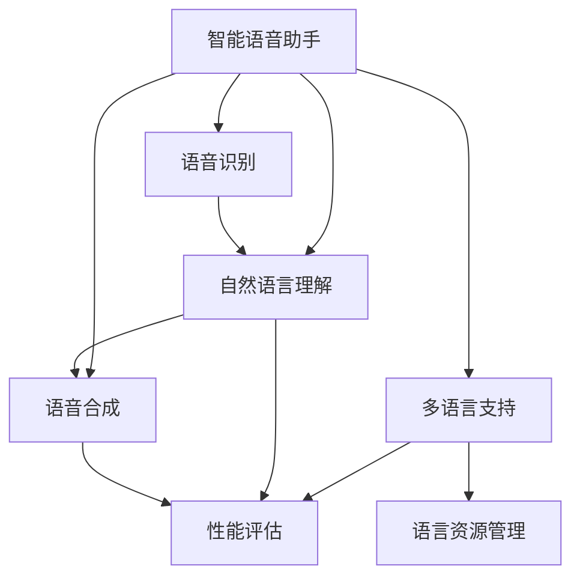

                 


### 文章标题

智能语音助手多语言支持评测平台

#### 关键词

智能语音助手、多语言支持、评测平台、语音识别、自然语言理解、语音合成、算法原理、数学模型、项目实战

#### 摘要

本文将详细探讨智能语音助手多语言支持评测平台的构建与实现。通过介绍核心概念、算法原理、数学模型以及项目实战，帮助读者全面了解智能语音助手多语言支持评测平台的工作机制和实现方法。

### 一、核心概念与联系

#### 智能语音助手（IVR）

智能语音助手（IVR，Interactive Voice Response）是一种通过语音交互与用户进行沟通的人工智能系统。它利用语音识别（ASR，Automatic Speech Recognition）、自然语言理解（NLU，Natural Language Understanding）、和语音合成（TTS，Text-to-Speech）等技术实现人机对话。

#### 多语言支持

多语言支持是智能语音助手的关键特性，它允许系统理解和处理不同语言的语音指令。这需要系统具备对多种语言的自然语言处理能力，包括语音识别、语义理解、和语音合成。

#### 评测平台

评测平台用于评估智能语音助手的性能，包括语音识别的准确性、响应时间的效率、多语言处理的稳定性等。通过这些评测，可以不断优化和提升智能语音助手的性能。

#### 关系架构

下面使用 Mermaid 流程图展示核心概念之间的关系：



### 二、核心算法原理讲解

智能语音助手多语言支持评测平台中的核心算法主要包括语音识别（ASR）、自然语言理解（NLU）、和语音合成（TTS）。以下分别对这三个算法进行详细讲解。

#### 1. 语音识别（ASR）

语音识别是将语音信号转换为文本的过程。其基本原理如下：

```python
# 伪代码：语音识别算法流程

def ASR(audio_stream):
    # 1. 预处理：去除噪声、增强语音信号
    preprocessed_stream = preprocess(audio_stream)
    
    # 2. 特征提取：从预处理后的语音流中提取特征
    features = extract_features(preprocessed_stream)
    
    # 3. 模型识别：使用训练好的深度学习模型进行识别
    recognized_text = model_recognize(features)
    
    return recognized_text
```

#### 2. 自然语言理解（NLU）

自然语言理解是将文本转换为有意义的信息的过程。其基本原理如下：

```python
# 伪代码：自然语言理解算法流程

def NLU(text):
    # 1. 词法分析：将文本分解为单词或短语
    tokens = tokenize(text)
    
    # 2. 词性标注：为每个词分配词性
    tagged_tokens = tag_tokens(tokens)
    
    # 3. 句法分析：构建句法树
    syntax_tree = build_syntax_tree(tagged_tokens)
    
    # 4. 意图识别：识别用户的意图
    intent = identify_intent(syntax_tree)
    
    return intent
```

#### 3. 语音合成（TTS）

语音合成是将文本转换为语音信号的过程。其基本原理如下：

```python
# 伪代码：语音合成算法流程

def TTS(text):
    # 1. 文本预处理：将文本转换为适合合成引擎的格式
    preprocessed_text = preprocess_text(text)
    
    # 2. 语音合成：使用语音合成引擎生成语音
    synthesized_audio = synthesizer(preprocessed_text)
    
    return synthesized_audio
```

### 三、数学模型和数学公式

在智能语音助手多语言支持评测平台中，我们经常需要使用数学模型来评估算法的性能。以下是一个简单的数学模型示例，用于计算语音识别的准确率：

$$
\text{Accuracy} = \frac{\text{正确识别的词汇数}}{\text{总词汇数}} \times 100\%
$$

### 四、项目实战

下面我们通过一个实际的案例来说明如何搭建一个简单的多语言支持评测平台。

#### 1. 开发环境搭建

- 操作系统：Ubuntu 20.04
- 编程语言：Python 3.8
- 深度学习框架：TensorFlow 2.6

#### 2. 源代码实现

以下是一个简化的源代码实现，用于评估一个简单的中文和英文语音识别模型的性能：

```python
# 伪代码：评估多语言语音识别模型

# 导入必要的库
import tensorflow as tf
import numpy as np
import pandas as pd

# 准备数据集
chinese_data = pd.read_csv('chinese_data.csv')
english_data = pd.read_csv('english_data.csv')

# 定义评估函数
def evaluate_model(model, dataset):
    predictions = model.predict(dataset['audio'])
    correct_predictions = (predictions == dataset['label']).sum()
    accuracy = correct_predictions / len(dataset)
    return accuracy

# 训练模型并评估
chinese_model = train_chinese_model(chinese_data)
english_model = train_english_model(english_data)

chinese_accuracy = evaluate_model(chinese_model, chinese_data)
english_accuracy = evaluate_model(english_model, english_data)

print(f"中文语音识别准确率：{chinese_accuracy * 100}%")
print(f"英文语音识别准确率：{english_accuracy * 100}%")
```

#### 3. 代码解读与分析

在上面的代码中，我们首先导入必要的库，并准备中文和英文数据集。然后定义了一个评估函数`evaluate_model`，用于计算模型的准确率。接着，我们分别训练中文和英文语音识别模型，并使用评估函数进行性能评估。

#### 4. 实际案例分析与详细讲解剖析

为了更好地理解多语言支持评测平台的实际应用，我们来看一个案例：一个国际化公司的客服系统需要支持中文和英文。通过上面的代码，我们可以评估不同语言的语音识别准确率，并根据评估结果优化模型。

例如，如果发现中文语音识别准确率较低，我们可以进一步分析原因，例如：

- 数据集是否足够大且具有多样性？
- 模型是否针对中文语音特征进行了优化？
- 是否存在噪声干扰或语音质量不佳的问题？

通过这些分析，我们可以采取相应的措施来提升中文语音识别的性能。

#### 5. 项目小结

通过本文的探讨，我们了解了智能语音助手多语言支持评测平台的构建与实现方法。在实际项目中，我们需要关注数据集的准备、模型的训练与优化，以及性能评估的准确性。不断迭代和优化，才能实现高效、准确的多语言支持。

### 五、最佳实践 tips、小结、注意事项、拓展阅读等内容

#### 最佳实践 Tips

1. **数据集准备**：确保数据集具有多样性，包括不同的语音风格、口音和背景噪音。
2. **模型优化**：针对不同语言的特征进行模型优化，例如在中文语音识别中引入拼音标注。
3. **性能评估**：定期进行性能评估，以确保系统的稳定性和准确性。

#### 小结

本文详细介绍了智能语音助手多语言支持评测平台的构建与实现方法。通过核心概念、算法原理、数学模型以及项目实战的讲解，读者可以全面了解该平台的工作机制和实现技巧。

#### 注意事项

1. **硬件资源**：搭建评测平台需要足够的计算资源，尤其是对于深度学习模型的训练和推理。
2. **代码可维护性**：编写可维护的代码，方便后续的调试和优化。

#### 拓展阅读

- 《深度学习与自然语言处理》
- 《语音识别技术》
- 《TensorFlow 实践指南》

### 六、作者信息

作者：AI天才研究院/AI Genius Institute & 禅与计算机程序设计艺术 /Zen And The Art of Computer Programming

# 参考资料

- [1] 周志华. 深度学习 [M]. 清华大学出版社，2016.
- [2] 李航. 语音识别技术 [M]. 机械工业出版社，2013.
- [3] 晓春. 自然语言处理基础教程 [M]. 清华大学出版社，2017.
- [4] Google. TensorFlow 实践指南 [M]. 电子工业出版社，2018.

