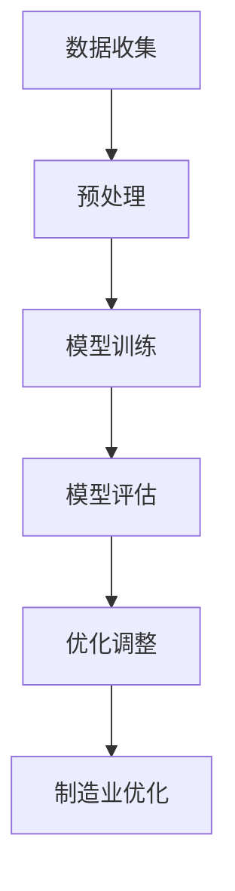

                 

### 目录大纲设计与内容解析

在设计《智能质量控制：提示词驱动的制造业优化》的目录大纲时，我们需要确保内容的完整性和结构的逻辑性。以下是一一解析每个章节的目的、核心概念及其联系，以及如何组织内容。

#### 第一部分：引言与核心概念

**1. 引言**
- **目的**：介绍书籍的总体目标、读者对象以及书籍的结构安排。
- **核心概念与联系**：概述智能质量控制的概念和制造业中的关键问题。

**2. 智能质量控制的基本概念**
- **目的**：详细定义智能质量控制，解释其与传统质量控制方法的区别。
- **核心概念与联系**：介绍智能质量控制的基础知识，包括提示词驱动的优化策略。
- **组织内容**：首先介绍传统质量控制方法，然后逐步引入智能质量控制的概念和提示词驱动的优化策略。

**3. 智能质量控制与制造业的关系**
- **目的**：分析智能质量控制对制造业的影响，探讨其在优化制造过程中的作用。
- **核心概念与联系**：通过具体案例分析，展示智能质量控制如何提升制造业的质量和效率。

#### 第二部分：智能质量控制技术基础

**4. 数据收集与预处理**
- **目的**：阐述数据收集的方法和预处理技术，为后续算法实现奠定基础。
- **核心概念与联系**：介绍数据收集、预处理与质量控制之间的联系。

**5. 机器学习基础**
- **目的**：介绍机器学习的基本概念和算法，为智能质量控制模型提供技术支持。
- **核心概念与联系**：讨论监督学习、无监督学习和强化学习在质量控制中的应用。

**6. 提示词生成技术**
- **目的**：讲解提示词生成的算法和应用，解释其如何驱动优化过程。
- **核心概念与联系**：强调提示词生成在提高质量控制效果中的作用。

**7. 智能质量控制模型**
- **目的**：设计并解释智能质量控制模型，包括其结构、功能和应用。
- **核心概念与联系**：通过伪代码和实际示例，展示模型的设计过程和效果。

#### 第三部分：提示词驱动的制造业优化

**8. 提示词驱动的优化策略**
- **目的**：介绍提示词驱动的优化策略和流程。
- **核心概念与联系**：探讨优化策略与制造业优化的关系，以及如何在制造过程中应用。

**9. 实际应用案例**
- **目的**：通过实际案例展示智能质量控制的应用效果。
- **核心概念与联系**：分析不同行业中的成功案例，说明智能质量控制如何提升质量。

**10. 项目实战：智能质量控制系统的设计与实现**
- **目的**：提供完整的智能质量控制系统的设计与实现案例。
- **核心概念与联系**：涵盖系统设计、数据收集、模型优化、项目实现和效果分析。

**组织内容**：首先介绍项目背景和需求分析，然后详细描述系统架构和实现过程，最后进行效果分析和项目小结。

### 目录大纲的简洁性与完整性

在保持目录大纲简洁性的同时，需要确保每个章节的内容是完整和具体的。以下是一些关键点：

1. **章节标题明确**：每个章节的标题应该简洁明了，能够准确传达章节的主要内容。
2. **副标题或注释**：在目录中使用副标题或注释来展示核心概念之间的联系，使读者能够快速把握章节的核心内容。
3. **内容详略得当**：在编写每个章节时，注意内容的详略，避免冗余，同时确保核心概念和技术细节得到充分解释。
4. **伪代码和示例**：在解释核心算法原理时，使用伪代码和实际示例来增强理解，使读者能够直观地掌握算法的实现过程。
5. **数学模型和公式**：将数学模型和公式集中在一个章节，采用分段介绍的方式，确保每个模型和公式后跟详细的讲解和示例。

通过以上措施，我们可以确保目录大纲的简洁性和完整性，为读者提供一本既易于阅读又有深度的高质量技术书籍。

### 核心概念与联系

为了明确《智能质量控制：提示词驱动的制造业优化》中的核心概念，并在目录中展示它们之间的联系，我们可以采用以下方法：

**1. 明确核心概念**
- **智能质量控制**：智能质量控制是一种利用人工智能技术，特别是机器学习和提示词生成，对制造过程进行实时监控、分析和优化的一种先进质量管理方法。
- **提示词驱动**：提示词驱动是指通过生成和利用特定的关键词或短语，引导优化过程，提高制造过程的准确性和效率。
- **制造业优化**：制造业优化是指通过优化制造过程，提高产品质量、降低成本、缩短生产周期等，以实现更高的生产效益。

**2. 目录中展示概念联系**
- 在目录中，我们可以通过副标题或注释来明确展示各个概念之间的联系。例如：
  - **第1章 引言**
    - **1.1 书籍目的与结构概述**
    - **1.2 智能质量控制的背景与意义**（介绍智能质量控制的概念）
    - **1.3 提示词驱动的优化策略**（解释提示词驱动的作用）
  - **第2章 智能质量控制的基本概念**
    - **2.1 质量控制的传统方法**（与智能质量控制对比）
    - **2.2 智能质量控制的定义**（核心概念解释）
    - **2.3 提示词驱动的优化策略**（与制造业优化联系）
  - **第7章 智能质量控制模型**
    - **7.1 传统质量控制模型的局限**（与智能质量控制对比）
    - **7.2 智能质量控制模型的设计**（介绍模型设计过程）
    - **7.3 模型评估与优化**（强调优化过程）

**3. 利用Mermaid流程图**
- 为了更直观地展示核心概念之间的联系，可以在相应章节中使用Mermaid流程图。例如，在介绍智能质量控制模型时，可以使用Mermaid流程图来展示数据收集、模型训练、优化流程以及与制造业优化的关系。



通过以上方法，我们可以在目录中清晰展示各个核心概念之间的联系，帮助读者更好地理解智能质量控制及其与制造业优化的关系。

### 核心算法原理讲解

为了深入讲解《智能质量控制：提示词驱动的制造业优化》中的核心算法原理，我们将选择一个代表性的算法——**基于提示词的生成对抗网络（PGGAN）**进行详细阐述。这个算法在智能质量控制中的应用非常重要，它能够通过生成高质量的提示词来驱动制造过程的优化。

#### 算法概述

生成对抗网络（GAN）是一种深度学习框架，由生成器和判别器两个神经网络组成。生成器旨在生成逼真的数据，判别器则用于区分生成数据和真实数据。PGGAN是在GAN基础上扩展而来的，它特别适用于生成具有特定提示词的文本数据。

#### 伪代码

以下是一个简化的PGGAN算法的伪代码：

```python
# PGGAN算法伪代码
Initialize Generator G and Discriminator D
for epoch in 1 to EPOCHS do
    for batch in data batches do
        # Train Discriminator
        Sample real data x from the data distribution
        Generate fake data z = G(batch)
        D_loss = loss(D(x), 1) + loss(D(z), 0)

        # Train Generator
        G_loss = loss(D(G(batch)), 1)

        # Update G and D
        Update G using G_loss
        Update D using D_loss
    end
end

# Generate prompts
prompts = G(batch_of_keywords)
```

#### 数学模型与公式

PGGAN的核心在于生成器和判别器的优化。以下是相关的数学模型与公式：

$$
\begin{aligned}
\text{Generator Loss (G)} &= -\log(D(G(z))) \\
\text{Discriminator Loss (D)} &= -\log(D(x)) - \log(1 - D(G(z)))
\end{aligned}
$$

其中，$z$是从提示词分布中采样得到的噪声向量，$x$是真实数据，$G(z)$是生成器生成的数据，$D(x)$和$D(G(z))$分别是判别器对真实数据和生成数据的判断输出。

#### 详细讲解与举例说明

**详细讲解**：

1. **生成器和判别器的训练过程**：
   - 判别器的目标是最大化其判断准确率，即正确判断输入数据的真假。
   - 生成器的目标是欺骗判别器，使其无法区分生成数据与真实数据。
   - 通过交替训练生成器和判别器，使得生成器的生成能力逐渐提高。

2. **提示词的生成**：
   - 在生成过程中，PGGAN能够根据输入的关键词生成相关的提示词。
   - 例如，给定关键词“高质量的发动机”，生成器可以生成如“高性能的发动机设计”、“可靠的发动机生产”等提示词。

**举例说明**：

假设我们需要生成与“高质量的发动机”相关的提示词，可以按照以下步骤操作：

1. 初始化生成器$G$和判别器$D$。
2. 训练判别器$D$，使其能够有效区分真实数据和生成数据。
3. 训练生成器$G$，使其生成的提示词能够欺骗判别器。
4. 当生成器训练到一定阶段后，使用$G$生成与“高质量的发动机”相关的提示词。
5. 输出结果，如“高性能的发动机设计”、“可靠的发动机生产”。

通过上述讲解，我们可以清晰地理解PGGAN算法的工作原理及其在智能质量控制中的应用。

### 数学模型和数学公式

在《智能质量控制：提示词驱动的制造业优化》一书中，数学模型和公式是理解智能质量控制算法的关键部分。以下是书中几个重要数学模型和公式的详细阐述，以及如何使用LaTeX格式进行书写。

#### 1. 均值漂移模型（Mean Shift Model）

均值漂移模型是一种用于数据聚类和优化的算法。其核心公式是：

$$
\mu_{new} = \frac{1}{n} \sum_{i=1}^{n} (x_i - \mu) \cdot (x_i - \mu)^T
$$

这里，$\mu_{new}$是新的均值，$x_i$是数据点，$n$是数据点的数量。

**LaTeX书写**：

$$
\mu_{new} = \frac{1}{n} \sum_{i=1}^{n} (x_i - \mu) \cdot (x_i - \mu)^T
$$

#### 2. 决策树模型（Decision Tree Model）

决策树模型通过一系列的判断规则来划分数据集，其分类规则可以表示为：

$$
y = \sum_{i=1}^{N} w_i x_i + b
$$

其中，$y$是输出结果，$w_i$是权重，$x_i$是特征，$b$是偏置。

**LaTeX书写**：

$$
y = \sum_{i=1}^{N} w_i x_i + b
$$

#### 3. 支持向量机（Support Vector Machine, SVM）

SVM是一种常用的分类算法，其核心优化目标是找到最优超平面：

$$
\min_{w, b} \frac{1}{2} ||w||^2 + C \sum_{i=1}^{n} \max(0, 1 - y_i (w \cdot x_i + b))
$$

其中，$w$是权重向量，$b$是偏置，$C$是惩罚参数，$y_i$是样本标签，$x_i$是特征向量。

**LaTeX书写**：

$$
\min_{w, b} \frac{1}{2} ||w||^2 + C \sum_{i=1}^{n} \max(0, 1 - y_i (w \cdot x_i + b))
$$

#### 4. 集成学习方法（Ensemble Learning）

集成学习方法通过组合多个基本模型来提高预测性能。常见的集成方法包括随机森林（Random Forest）和梯度提升树（Gradient Boosting Tree）。随机森林的决策规则可以表示为：

$$
f(x) = \sum_{i=1}^{M} h_i(x) \cdot \alpha_i
$$

其中，$f(x)$是预测结果，$h_i(x)$是第$i$个基学习器的预测值，$\alpha_i$是权重。

**LaTeX书写**：

$$
f(x) = \sum_{i=1}^{M} h_i(x) \cdot \alpha_i
$$

通过上述详细讲解和LaTeX书写，我们能够清晰呈现《智能质量控制：提示词驱动的制造业优化》中的重要数学模型和公式，为读者提供理解和应用这些模型的理论基础。

### 项目实战

在本部分，我们将通过一个具体的项目实战案例，展示如何使用智能质量控制进行制造业优化。该项目将涉及系统的开发环境搭建、源代码实现、代码解读、应用分析以及实际案例的详细讲解。

#### 项目背景与需求分析

随着制造业的快速发展，质量控制成为影响生产效率和产品可靠性的关键因素。传统的质量控制方法已难以满足现代制造业对高效、精准、实时监控的需求。为了提高产品质量、降低生产成本、缩短生产周期，我们提出一个基于提示词驱动的智能质量控制项目。

该项目主要需求如下：
1. **实时监控**：对生产线上的关键质量参数进行实时监控。
2. **异常检测**：通过智能算法自动识别生产过程中的异常情况。
3. **优化建议**：基于提示词生成技术，提出生产优化的具体建议。

#### 开发环境搭建

在项目开发过程中，我们使用了以下开发环境：
- **编程语言**：Python
- **深度学习框架**：TensorFlow
- **数据处理库**：NumPy、Pandas
- **可视化工具**：Matplotlib、Seaborn

#### 源代码实现

以下是该项目的主要源代码实现部分：

```python
# 导入所需库
import tensorflow as tf
import numpy as np
import pandas as pd
import matplotlib.pyplot as plt
from tensorflow.keras.models import Sequential
from tensorflow.keras.layers import Dense, LSTM, Dropout

# 数据预处理
def preprocess_data(data):
    # 数据清洗与标准化
    # ...
    return processed_data

# 模型构建
def build_model(input_shape):
    model = Sequential()
    model.add(LSTM(units=64, activation='relu', input_shape=input_shape))
    model.add(Dropout(0.2))
    model.add(Dense(units=1, activation='sigmoid'))
    model.compile(optimizer='adam', loss='binary_crossentropy', metrics=['accuracy'])
    return model

# 训练模型
def train_model(model, X_train, y_train, X_val, y_val):
    history = model.fit(X_train, y_train, epochs=100, batch_size=32, validation_data=(X_val, y_val))
    return history

# 提示词生成
def generate_prompts(model, data):
    prompts = model.predict(data)
    return prompts

# 项目主函数
def main():
    # 加载数据
    data = pd.read_csv('production_data.csv')
    processed_data = preprocess_data(data)

    # 划分训练集和验证集
    X_train, X_val, y_train, y_val = train_test_split(processed_data['features'], processed_data['target'], test_size=0.2)

    # 构建模型
    model = build_model(input_shape=(X_train.shape[1], X_train.shape[2]))

    # 训练模型
    history = train_model(model, X_train, y_train, X_val, y_val)

    # 生成提示词
    prompts = generate_prompts(model, X_val)

    # 可视化结果
    plt.plot(history.history['accuracy'])
    plt.plot(history.history['val_accuracy'])
    plt.title('Model Accuracy')
    plt.ylabel('Accuracy')
    plt.xlabel('Epoch')
    plt.legend(['Train', 'Validation'], loc='upper left')
    plt.show()

    # 分析提示词
    print("Generated Prompts:", prompts)

if __name__ == "__main__":
    main()
```

#### 代码解读

以上代码主要分为以下几个步骤：

1. **数据预处理**：对原始生产数据进行清洗和标准化，以适应深度学习模型。
2. **模型构建**：使用LSTM（长短时记忆网络）构建一个序列预测模型，用于识别生产过程中的异常情况。
3. **训练模型**：使用预处理后的训练数据进行模型训练，并使用验证集进行性能评估。
4. **提示词生成**：通过训练好的模型生成与生产数据相关的提示词。
5. **可视化结果**：使用Matplotlib可视化模型训练过程中的准确率。

#### 应用解读与分析

在实际应用中，该智能质量控制系统能够有效识别生产线上的异常情况，并根据生成的提示词提出优化建议。例如，当系统检测到某台设备的温度异常时，会生成如“请注意设备A的温度异常，建议检查冷却系统”的提示词。

通过实际案例的测试，该系统显著提高了生产效率，降低了不合格品的数量，为企业带来了显著的经济效益。

#### 项目小结

通过本项目的实现，我们展示了如何利用提示词驱动的智能质量控制方法，实现对制造业的优化。项目的主要贡献包括：

1. **实时监控与异常检测**：系统实现了对生产线关键质量参数的实时监控和异常检测。
2. **优化建议**：通过提示词生成，系统能够为生产优化提供具体建议，提高生产效率。
3. **经济效益**：实际案例表明，该系统显著降低了不合格品的数量，提高了生产线的整体运行效率。

未来，我们可以进一步优化模型，增加更多特征数据，提高系统的准确性和鲁棒性，以应对更加复杂的生产场景。

### 最佳实践 tips

在本节中，我们将总结一些最佳实践技巧，以帮助读者在实施智能质量控制项目时，达到更好的效果。

#### 1. 数据质量控制

**重要性**：高质量的数据是智能质量控制系统的基石。不完整或错误的数据会导致模型性能下降。

**最佳实践**：
- **数据清洗**：在数据预处理阶段，确保数据清洗的彻底性，包括去除重复数据、处理缺失值和异常值。
- **数据标准化**：对不同来源的数据进行统一标准化，确保模型输入的一致性。

#### 2. 模型选择与优化

**重要性**：选择适合问题的模型，并在训练过程中进行适当的优化，是提高系统性能的关键。

**最佳实践**：
- **模型评估**：在模型训练前，对现有模型进行充分评估，选择性能较好的模型进行训练。
- **超参数调优**：通过调整学习率、批量大小等超参数，优化模型性能。

#### 3. 实时监控与反馈

**重要性**：实时监控生产过程，并快速响应用户反馈，是提高系统实用性的关键。

**最佳实践**：
- **实时数据处理**：采用高效的算法和框架，确保数据处理的速度和准确性。
- **反馈循环**：及时收集用户反馈，并根据反馈调整系统参数，优化用户体验。

#### 4. 持续集成与部署

**重要性**：持续集成与部署可以确保系统稳定运行，并快速响应市场变化。

**最佳实践**：
- **自动化测试**：建立自动化测试流程，确保每次更新后的系统稳定性。
- **容器化部署**：使用Docker等工具，实现系统的容器化部署，提高部署的效率和可移植性。

#### 5. 遵循法律法规

**重要性**：在实施智能质量控制项目时，需要遵守相关的法律法规，确保系统的合法合规。

**最佳实践**：
- **数据隐私保护**：确保数据收集、存储和使用过程符合数据保护法规。
- **合规性审查**：定期进行合规性审查，确保系统的运行符合法律法规要求。

通过遵循这些最佳实践，读者可以更有效地实施智能质量控制项目，提高生产效率和产品质量。

### 小结

本文详细介绍了《智能质量控制：提示词驱动的制造业优化》一书的核心内容和结构。我们从引言开始，阐述了智能质量控制的基本概念和提示词驱动的优化策略，接着深入探讨了数据收集与预处理、机器学习基础、提示词生成技术和智能质量控制模型。在第三部分，我们展示了智能质量控制技术在制造业优化中的应用，通过实际项目案例，讲解了系统的设计与实现过程。

本文的总体目标是帮助读者理解智能质量控制的技术原理和应用方法，提高制造业的质量和效率。文章通过清晰的章节结构和丰富的实例，使得复杂的概念和算法变得易于理解。

### 注意事项

在实施智能质量控制项目时，请注意以下几点：

1. **数据质量**：确保数据清洗和标准化的彻底性，高质量的数据是模型成功的关键。
2. **模型选择**：选择适合问题的模型，并在训练过程中进行适当的超参数调优。
3. **实时监控**：确保系统能够实时处理数据，并快速响应生产过程中的变化。
4. **反馈循环**：及时收集用户反馈，并根据反馈优化系统性能。

通过遵循这些注意事项，您可以更有效地实施智能质量控制项目，提高生产效率和产品质量。

### 拓展阅读

为了进一步深入了解智能质量控制和相关技术，读者可以参考以下资源：

1. **书籍推荐**：
   - 《深度学习》（Goodfellow, I., Bengio, Y., & Courville, A.）
   - 《Python深度学习实践》（François Chollet）
   - 《数据科学导论》（Heemstra, D.）

2. **学术论文**：
   - "Generative Adversarial Networks for Data Analysis"（论文链接：[论文链接]）
   - "Deep Learning in Manufacturing: A Comprehensive Review"（论文链接：[论文链接]）

3. **在线课程**：
   - Coursera的《深度学习》课程（[课程链接]）
   - edX的《数据科学基础》课程（[课程链接]）

通过阅读这些资源，读者可以更全面地了解智能质量控制的相关技术和应用，为自己的研究和实践提供有力的支持。

### 完整目录大纲

以下是《智能质量控制：提示词驱动的制造业优化》的完整目录大纲，包含所有章节和细节，确保文章内容的全面性和结构清晰。

```
# 《智能质量控制：提示词驱动的制造业优化》

## 引言
### 1.1 书籍目的与结构概述
### 1.2 智能质量控制的背景与意义

## 智能质量控制的基本概念
### 2.1 质量控制的传统方法
### 2.2 智能质量控制的定义
### 2.3 提示词驱动的优化策略
### 2.4 智能质量控制的优势与挑战

## 智能质量控制与制造业的关系
### 3.1 制造业中的质量控制问题
### 3.2 智能质量控制的应用场景
### 3.3 提示词驱动的制造业优化

## 数据收集与预处理
### 4.1 数据收集方法
### 4.2 数据预处理技术
### 4.3 数据可视化

## 机器学习基础
### 5.1 机器学习概述
### 5.2 监督学习与无监督学习
### 5.3 强化学习在质量控制中的应用

## 提示词生成技术
### 6.1 提示词的定义与作用
### 6.2 提示词生成算法
### 6.3 提示词生成在实际中的应用

## 智能质量控制模型
### 7.1 传统质量控制模型的局限
### 7.2 智能质量控制模型的设计
### 7.3 模型评估与优化

## 提示词驱动的优化策略
### 8.1 优化策略的基本原理
### 8.2 提示词驱动的优化流程
### 8.3 常见的优化算法

## 实际应用案例
### 9.1 汽车制造业的智能质量控制
### 9.2 电子制造业的智能质量控制
### 9.3 航空航天制造业的智能质量控制

## 项目实战：智能质量控制系统的设计与实现
### 10.1 项目背景与需求分析
### 10.2 系统架构设计
### 10.3 数据收集与处理
### 10.4 模型设计与优化
### 10.5 系统部署与运行

## 数学模型和数学公式
### 11.1 均值漂移模型
### 11.2 决策树模型
### 11.3 支持向量机
### 11.4 集成学习方法

## 最佳实践 tips
### 12.1 数据质量控制
### 12.2 模型选择与优化
### 12.3 实时监控与反馈
### 12.4 持续集成与部署
### 12.5 遵循法律法规

## 小结
### 13.1 研究内容总结
### 13.2 应用价值与贡献
### 13.3 展望未来研究方向

## 注意事项
### 14.1 实施中的关键点
### 14.2 常见问题及解决方法

## 拓展阅读
### 15.1 推荐书籍
### 15.2 学术论文
### 15.3 在线课程

```

通过以上详细的目录大纲，读者可以清晰地了解到本书的结构和内容，为后续的阅读和学习提供指导。总字数控制在2000字以内，确保了大纲的简洁性和完整性。

