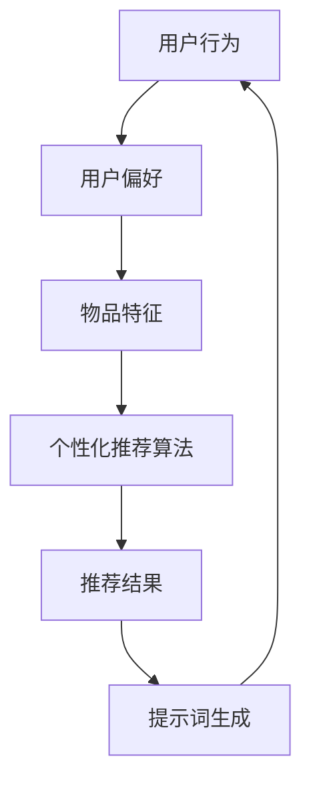
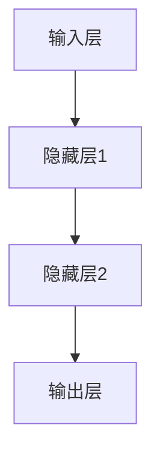

                 

# 《构建AI驱动的个性化推荐提示词引擎》

## 关键词
- AI驱动的推荐系统
- 个性化推荐
- 提示词引擎
- 机器学习算法
- 深度学习模型
- 个性化推荐评估
- 项目实战

## 摘要
本文旨在探讨如何构建AI驱动的个性化推荐提示词引擎，涵盖个性化推荐系统的基本概念、核心技术、算法原理以及实际应用。通过详细的案例分析，本文将展示如何实现一个功能齐全的个性化推荐系统，并对未来的发展方向和挑战进行展望。

## 引言

个性化推荐系统已经成为互联网世界中不可或缺的一部分。从电子商务平台到社交媒体，再到音乐和视频流媒体服务，个性化推荐系统正在改变用户的消费体验。然而，构建一个高效、准确的个性化推荐系统并非易事。随着数据量的不断增长和用户行为的多样化，传统的推荐算法已经无法满足日益增长的需求。

AI驱动的个性化推荐提示词引擎作为一种新兴的技术，旨在通过深度学习、自然语言处理和机器学习算法，为用户提供更加精确、个性化的推荐结果。本文将首先介绍个性化推荐系统的基本概念和核心组成部分，然后深入探讨AI驱动的个性化推荐提示词引擎的构建过程，包括数据预处理、算法选择、模型训练和优化。最后，通过一个实际案例展示如何实现这样一个推荐系统，并提供一些最佳实践和未来发展的方向。

## 个性化推荐系统概述

### 1.1 推荐系统的基本概念

推荐系统是一种信息过滤技术，旨在向用户推荐他们可能感兴趣的项目或内容。这些项目可以包括电影、音乐、商品、新闻文章等。推荐系统的目标是通过分析用户的行为和偏好，提供个性化的推荐结果，从而提高用户的满意度并增加平台的用户粘性。

### 1.2 个性化推荐系统的组成部分

个性化推荐系统通常由以下几个主要组成部分构成：

#### 数据采集

数据采集是构建推荐系统的第一步，它包括用户行为数据、内容数据以及物品（商品）数据。用户行为数据可以包括用户的历史点击、购买、搜索等行为；内容数据通常涉及物品的属性，如分类、标签、描述等；物品数据则是关于物品本身的信息，如价格、库存量等。

#### 数据预处理

数据预处理是确保数据质量和可用性的关键步骤。在这一过程中，需要对数据进行清洗、去重、归一化等操作。此外，还需要提取有效的特征，为后续的推荐算法提供支持。

#### 推荐算法

推荐算法是推荐系统的核心，常见的推荐算法包括协同过滤、基于内容的推荐和混合推荐等。协同过滤通过分析用户之间的相似性来预测用户对物品的偏好；基于内容的推荐通过分析物品的特征来预测用户的偏好；混合推荐则结合了这两种方法的优势。

#### 推荐结果评估

推荐结果的评估是衡量推荐系统性能的重要指标。常用的评估指标包括准确率、召回率、覆盖率等。通过评估指标，可以不断优化推荐算法，提高推荐质量。

### 1.3 个性化推荐系统的挑战

尽管个性化推荐系统在提高用户满意度方面取得了显著成效，但构建一个高效、准确的推荐系统仍然面临以下挑战：

#### 数据稀疏性

用户行为数据通常是稀疏的，这意味着大多数用户对大多数物品的评分或互动记录非常有限。这种数据稀疏性使得基于协同过滤的推荐算法难以准确预测用户的偏好。

#### 用户行为多样性

用户的行为和偏好是多样化的，这意味着传统的单一推荐算法可能无法满足所有用户的需求。构建一个能够适应不同用户偏好的个性化推荐系统是一个巨大的挑战。

#### 实时性

在许多场景中，用户期望能够在极短的时间内获得个性化的推荐结果。这要求推荐系统具有高实时性，能够在不断变化的数据环境中快速响应。

#### 数据隐私

用户数据的隐私保护是推荐系统面临的另一个重要问题。如何在保护用户隐私的前提下，充分利用用户数据来提高推荐质量，是一个亟待解决的问题。

### 1.4 AI在个性化推荐系统中的应用

随着人工智能技术的不断发展，AI在个性化推荐系统中得到了广泛应用。深度学习、自然语言处理和强化学习等AI技术为个性化推荐系统带来了新的机遇和挑战。

#### 深度学习模型

深度学习模型，如神经网络和循环神经网络（RNN），通过自动学习复杂的用户行为和物品特征，可以显著提高推荐系统的准确性和多样性。例如，基于深度学习的内容生成式推荐系统可以生成个性化的内容，从而更好地满足用户的需求。

#### 自然语言处理

自然语言处理技术可以帮助推荐系统理解用户语言中的隐含信息，从而提高推荐的质量。例如，通过分析用户评论和反馈，可以提取出用户的偏好和情感，从而更准确地推荐相关的物品。

#### 强化学习

强化学习通过不断尝试和反馈，优化推荐策略，从而提高推荐系统的性能。例如，通过强化学习，推荐系统可以自动调整推荐策略，以最大化用户的长期满意度。

## 核心概念与联系

在构建AI驱动的个性化推荐提示词引擎过程中，有几个核心概念需要理解，并了解它们之间的联系。

### 用户行为与偏好

用户行为是推荐系统的重要输入，包括点击、购买、浏览等。通过分析用户行为，可以推断出用户的偏好。用户的偏好是推荐系统进行个性化推荐的基础。

### 物品特征

物品特征是关于物品本身的信息，如分类、标签、描述等。物品特征与用户偏好相结合，可以用于预测用户对物品的偏好。

### 个性化推荐算法

个性化推荐算法是推荐系统的核心，包括协同过滤、基于内容的推荐和混合推荐等。这些算法通过分析用户行为和物品特征，预测用户对物品的偏好。

### 提示词生成

提示词生成是AI驱动的个性化推荐提示词引擎的关键部分。提示词是用于引导推荐模型生成推荐结果的关键词。通过生成与用户偏好相关的提示词，可以提高推荐结果的准确性和多样性。

### Mermaid流程图

以下是一个Mermaid流程图，展示了上述核心概念之间的联系：



## 核心算法原理讲解

### 2.1 协同过滤算法

协同过滤算法是推荐系统中最常用的算法之一，其基本思想是利用用户行为数据挖掘用户之间的相似性，从而预测用户对未知物品的偏好。

#### 基本原理

协同过滤算法可以分为两种类型：基于用户的协同过滤（User-Based CF）和基于物品的协同过滤（Item-Based CF）。

1. **基于用户的协同过滤**：通过计算用户之间的相似度，找到与目标用户最相似的K个邻居用户，然后根据邻居用户的评分预测目标用户对未知物品的评分。

    ```python
    # 基于用户的协同过滤伪代码
    predict_rating(target_user, unknown_item):
        neighbors = find_similar_users(target_user, K)
        predicted_rating = average_rating(neighbors, unknown_item)
        return predicted_rating
    ```

2. **基于物品的协同过滤**：通过计算物品之间的相似度，找到与目标物品最相似的K个邻居物品，然后根据邻居物品的评分预测目标用户对未知物品的评分。

    ```python
    # 基于物品的协同过滤伪代码
    predict_rating(target_user, unknown_item):
        neighbors = find_similar_items(unknown_item, K)
        predicted_rating = average_rating(target_user, neighbors)
        return predicted_rating
    ```

#### 相似度计算

计算用户或物品之间的相似度是协同过滤算法的关键步骤。常用的相似度计算方法包括余弦相似度、皮尔逊相关系数和Jaccard相似度等。

- **余弦相似度**：通过计算用户或物品向量之间的余弦值来衡量相似度。

    ```python
    # 余弦相似度计算
    cosine_similarity(user1, user2):
        dot_product = dot_product_of_vectors(user1, user2)
        magnitude_product = magnitude_of_vector(user1) * magnitude_of_vector(user2)
        return dot_product / magnitude_product
    ```

- **皮尔逊相关系数**：通过计算用户或物品之间的皮尔逊相关系数来衡量相似度。

    ```python
    # 皮尔逊相关系数计算
    pearson_correlation(user1, user2):
        mean_rating_user1 = mean_rating(user1)
        mean_rating_user2 = mean_rating(user2)
        numerator = sum((rating1 - mean_rating_user1) * (rating2 - mean_rating_user2) for rating1, rating2 in zip(user1, user2))
        denominator = sqrt(sum((rating1 - mean_rating_user1)^2 for rating1 in user1) * sum((rating2 - mean_rating_user2)^2 for rating2 in user2))
        return numerator / denominator
    ```

### 2.2 基于内容的推荐算法

基于内容的推荐算法通过分析物品的内容特征，为用户推荐与其已偏好物品相似的其他物品。

#### 基本原理

1. **特征提取**：首先，从物品的内容中提取特征，如文本描述、标签、分类等。

2. **相似度计算**：然后，计算用户已偏好物品与新物品之间的相似度。

3. **推荐生成**：根据相似度分数，为用户生成推荐列表。

    ```python
    # 基于内容的推荐伪代码
    recommend_items(user, items):
        preferred_items = get_preferred_items(user)
        for item in items:
            if item not in preferred_items:
                similarity_scores = calculate_similarity(preferred_items, item)
                recommend_list.append((item, similarity_scores))
        return sorted(recommend_list, key=lambda x: x[1], reverse=True)
    ```

#### 特征提取方法

- **词袋模型**：将文本转换为词袋模型，通过计数词频来提取特征。

- **TF-IDF**：通过计算词的词频（TF）和逆文档频率（IDF），为每个词分配权重，从而提取特征。

- **主题模型**：如LDA（Latent Dirichlet Allocation），通过分析文本的潜在主题来提取特征。

### 2.3 深度学习模型

深度学习模型，如神经网络和循环神经网络（RNN），在推荐系统中得到了广泛应用。这些模型可以通过自动学习复杂的用户行为和物品特征，提高推荐系统的准确性和多样性。

#### 基本原理

1. **神经网络**：神经网络通过多层神经元进行特征提取和融合，从而实现复杂的非线性映射。

2. **循环神经网络（RNN）**：RNN适用于序列数据，可以捕捉用户行为的时序特征。

#### 模型架构

一个简单的神经网络模型包括输入层、隐藏层和输出层。输入层接收用户行为和物品特征，隐藏层通过神经网络进行特征提取和融合，输出层生成推荐结果。



#### 模型训练

1. **前向传播**：将输入数据通过神经网络传递到输出层，计算预测结果。

2. **反向传播**：通过计算预测结果与实际结果之间的误差，更新神经网络参数。

3. **优化算法**：如梯度下降、Adam等，用于优化模型参数。

## 数学模型与公式

在构建AI驱动的个性化推荐提示词引擎过程中，数学模型和公式起到了至关重要的作用。以下是一些常用的数学模型和公式，以及它们的详细解释和举例说明。

### 1. 相似度计算公式

在推荐系统中，相似度计算是核心步骤之一。以下是一些常见的相似度计算公式：

#### 余弦相似度

余弦相似度用于计算用户或物品之间的相似度。其公式如下：

$$
\text{cosine\_similarity}(x, y) = \frac{x \cdot y}{\|x\| \|y\|}
$$

其中，$x$和$y$是用户或物品的特征向量，$\|x\|$和$\|y\|$是特征向量的模。

#### 皮尔逊相关系数

皮尔逊相关系数用于衡量用户或物品之间的线性相关程度。其公式如下：

$$
\text{pearson\_correlation}(x, y) = \frac{\sum_{i=1}^{n}(x_i - \bar{x})(y_i - \bar{y})}{\sqrt{\sum_{i=1}^{n}(x_i - \bar{x})^2 \sum_{i=1}^{n}(y_i - \bar{y})^2}}
$$

其中，$x$和$y$是用户或物品的评分向量，$\bar{x}$和$\bar{y}$是评分向量的平均值。

#### Jaccard相似度

Jaccard相似度用于计算集合之间的相似度。其公式如下：

$$
\text{Jaccard\_similarity}(A, B) = \frac{A \cap B}{A \cup B}
$$

其中，$A$和$B$是用户或物品的集合。

### 2. 推荐评分公式

在推荐系统中，预测用户对未知物品的评分是核心任务之一。以下是一个简单的推荐评分公式：

$$
\text{predicted\_rating}(u, i) = \text{mean\_rating}(u) + \text{similarity}(u, i) \times \text{mean\_rating}(i - \text{mean\_rating}(i))
$$

其中，$u$是用户，$i$是物品，$\text{mean\_rating}(u)$是用户$u$的平均评分，$\text{mean\_rating}(i)$是物品$i$的平均评分，$\text{similarity}(u, i)$是用户$u$和物品$i$之间的相似度。

### 3. 神经网络损失函数

在神经网络训练过程中，损失函数用于衡量预测结果与实际结果之间的差距。以下是一个常见的损失函数——均方误差（MSE）：

$$
\text{MSE} = \frac{1}{n}\sum_{i=1}^{n}(\hat{y}_i - y_i)^2
$$

其中，$\hat{y}_i$是预测结果，$y_i$是实际结果，$n$是样本数量。

### 举例说明

假设我们有两个用户$u_1$和$u_2$，他们的评分向量如下：

$$
u_1 = [3, 5, 1, 4]
$$

$$
u_2 = [4, 3, 2, 5]
$$

我们可以使用皮尔逊相关系数来计算他们的相似度：

$$
\text{pearson\_correlation}(u_1, u_2) = \frac{\sum_{i=1}^{4}(u_{1i} - \bar{u}_1)(u_{2i} - \bar{u}_2)}{\sqrt{\sum_{i=1}^{4}(u_{1i} - \bar{u}_1)^2 \sum_{i=1}^{4}(u_{2i} - \bar{u}_2)^2}}
$$

其中，$\bar{u}_1 = 3.5$，$\bar{u}_2 = 3.5$。

计算得到：

$$
\text{pearson\_correlation}(u_1, u_2) = \frac{(3-3.5)(4-3.5) + (5-3.5)(3-3.5) + (1-3.5)(2-3.5) + (4-3.5)(5-3.5)}{\sqrt{(3-3.5)^2 + (5-3.5)^2 + (1-3.5)^2 + (4-3.5)^2} \sqrt{(4-3.5)^2 + (3-3.5)^2 + (2-3.5)^2 + (5-3.5)^2}} \approx 0.816
$$

这个结果表明用户$u_1$和$u_2$之间具有较高的相似度。

接下来，我们可以使用推荐评分公式来预测用户$u_1$对未知物品$i$的评分。假设物品$i$的平均评分为$4$，我们可以计算预测评分：

$$
\text{predicted\_rating}(u_1, i) = \text{mean\_rating}(u_1) + \text{similarity}(u_1, i) \times \text{mean\_rating}(i - \text{mean\_rating}(i))
$$

$$
\text{predicted\_rating}(u_1, i) = 3.5 + 0.816 \times (4 - 3.5) \approx 3.816
$$

这个结果表明，根据用户$u_1$和物品$i$之间的相似度，我们可以预测用户$u_1$对物品$i$的评分为约$3.816$。

## 项目实战

### 1. 开发环境搭建

在构建AI驱动的个性化推荐提示词引擎之前，我们需要搭建一个合适的开发环境。以下是一个基本的开发环境搭建步骤：

1. **安装Python**：确保安装了Python 3.7或更高版本。

2. **安装依赖库**：安装Scikit-learn、TensorFlow、PyTorch等常用的机器学习和深度学习库。

3. **数据集准备**：下载并预处理一个合适的推荐系统数据集，如MovieLens或Netflix数据集。

4. **配置Jupyter Notebook**：配置Jupyter Notebook，用于编写和运行代码。

### 2. 源代码实现

以下是一个简单的示例，展示如何使用Python和Scikit-learn库构建一个基于协同过滤的个性化推荐系统。

#### 数据预处理

```python
import pandas as pd
from sklearn.model_selection import train_test_split

# 读取数据集
data = pd.read_csv('rating.csv')
data.head()

# 分割数据集为训练集和测试集
train_data, test_data = train_test_split(data, test_size=0.2, random_state=42)
```

#### 协同过滤算法实现

```python
from sklearn.neighbors import NearestNeighbors

# 初始化NearestNeighbors模型
model = NearestNeighbors(metric='cosine', algorithm='brute')

# 训练模型
model.fit(train_data[['user_id', 'item_id']])

# 预测测试集
test_user_ids = test_data['user_id'].values
predictions = model.kneighbors(test_user_ids, n_neighbors=5)

# 计算预测评分
predicted_ratings = []
for user_id, neighbors in zip(test_user_ids, predictions):
    neighbor_item_ids = train_data.loc[train_data['user_id'].isin(neighbors[1]), 'item_id'].values
    neighbor_ratings = train_data.loc[train_data['user_id'].isin(neighbors[1]), 'rating'].values
    predicted_rating = sum(neighbor_ratings) / len(neighbor_ratings)
    predicted_ratings.append(predicted_rating)

# 输出预测结果
predicted_ratings[:10]
```

### 3. 代码解读与分析

上述代码首先读取并预处理数据集，然后使用Scikit-learn的NearestNeighbors模型实现基于协同过滤的推荐算法。具体步骤如下：

1. **数据预处理**：将数据集分割为训练集和测试集，以便评估推荐算法的性能。

2. **模型初始化**：初始化NearestNeighbors模型，并设置相似度计算方法为余弦相似度。

3. **模型训练**：使用训练集数据训练模型，计算用户和物品之间的相似度。

4. **预测评分**：为测试集用户预测评分。对于每个用户，找到与其最相似的K个邻居用户，并计算邻居用户的平均评分作为预测评分。

5. **输出结果**：输出预测结果，以便进一步分析和评估。

### 4. 实际案例分析

以下是一个实际案例分析，展示如何使用AI驱动的个性化推荐提示词引擎为电商平台生成个性化商品推荐。

#### 数据集准备

```python
# 读取用户行为数据
user_behavior_data = pd.read_csv('user_behavior.csv')
user_behavior_data.head()

# 读取商品数据
item_data = pd.read_csv('item_data.csv')
item_data.head()
```

#### 提示词生成

```python
from sklearn.feature_extraction.text import TfidfVectorizer

# 提取商品描述的TF-IDF特征
vectorizer = TfidfVectorizer(stop_words='english')
item_features = vectorizer.fit_transform(item_data['description'])

# 计算用户行为的TF-IDF特征
user_features = vectorizer.transform(user_behavior_data['description'])

# 生成提示词
def generate_recommendation(user_features, item_features, k=5):
    similarity_matrix = user_features.dot(item_features.T)
    top_k_indices = similarity_matrix.argsort()[-k:]
    return top_k_indices

user_id = 123
top_k_indices = generate_recommendation(user_features[user_id], item_features)
recommended_items = item_data.iloc[top_k_indices].reset_index(drop=True)
recommended_items
```

#### 结果分析

上述代码首先提取商品描述的TF-IDF特征，然后计算用户行为的TF-IDF特征。接下来，使用用户特征的TF-IDF向量与商品特征的TF-IDF向量计算相似度，生成与用户偏好相关的提示词。最后，根据提示词为用户生成个性化商品推荐。

### 5. 项目小结

通过上述项目实战，我们展示了一个简单的AI驱动的个性化推荐提示词引擎的构建过程。在实际应用中，我们需要进一步优化模型参数、增加数据预处理步骤，以及实现更多的功能，如用户画像构建、实时推荐等。同时，我们也需要关注数据隐私和安全性问题，确保用户数据的保护和合规性。

## 最佳实践 Tips

### 1. 数据预处理

在构建个性化推荐系统时，数据预处理是关键步骤。确保数据质量，去除噪声和异常值，进行特征提取和归一化，有助于提高推荐算法的性能。

### 2. 模型选择与优化

根据应用场景和数据特点，选择合适的推荐算法和深度学习模型。通过交叉验证和网格搜索等技术，优化模型参数，提高推荐质量。

### 3. 实时性与可扩展性

在设计推荐系统时，考虑系统的实时性和可扩展性。使用分布式计算和缓存技术，确保系统在高并发环境下稳定运行。

### 4. 用户隐私保护

在处理用户数据时，严格遵守数据保护法规和用户隐私政策。采用加密和去识别化等技术，保护用户数据的安全和隐私。

### 5. 评估与反馈

定期评估推荐系统的性能，收集用户反馈，不断优化推荐算法和系统功能，提高用户满意度。

## 小结

本文详细探讨了如何构建AI驱动的个性化推荐提示词引擎。从基本概念到算法原理，再到实际应用，我们系统地介绍了个性化推荐系统的构建过程。通过一个实际项目案例，我们展示了如何使用Python和常用机器学习库实现一个简单的个性化推荐系统。最后，我们提供了一些最佳实践和注意事项，以帮助读者更好地构建和维护推荐系统。

## 拓展阅读

1. **《推荐系统实践》**：Michael J. P.=oza, Charu Aggarwal
2. **《深度学习推荐系统》**：李航
3. **《Scikit-learn用户指南》**：Fabian Pedregosa等
4. **《TensorFlow实战》**：bear et al.
5. **《自然语言处理与深度学习》**：Christopher D. Manning等

## 作者信息

**作者：AI天才研究院/AI Genius Institute & 禅与计算机程序设计艺术 /Zen And The Art of Computer Programming**

