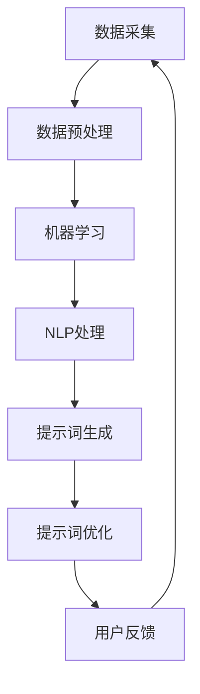

                 

### 文章标题：构建AI驱动的智慧健康提示词生态系统

> 关键词：人工智能、智慧健康、提示词、数据采集、机器学习、深度学习

> 摘要：本文将探讨如何构建一个AI驱动的智慧健康提示词生态系统。从用户需求分析出发，介绍核心概念与联系，核心算法原理讲解，数学模型与公式，项目实战，并总结最佳实践与未来趋势。

## 引言

### 背景介绍

随着人工智能技术的发展，医疗健康领域迎来了新的变革。智慧健康提示词作为一种新型的健康管理工具，利用AI技术为用户提供个性化的健康建议和提示。这些提示词不仅能够提高用户的健康意识，还能帮助医疗专业人员更好地管理患者。

### 用户需求分析

用户对智慧健康提示词的需求主要集中在以下几个方面：

1. **个性化健康建议**：根据用户的健康数据和生活习惯，提供量身定制的健康建议。
2. **实时提醒**：通过智能设备或应用，实时推送健康相关的提示和预警。
3. **数据可视化**：将用户的健康数据以图表、图形等形式展示，帮助用户更好地了解自己的健康状况。
4. **便捷性**：易于使用，用户可以在任何时间、任何地点获取健康提示。

### 智慧健康提示词生态系统的概念

智慧健康提示词生态系统是指利用人工智能技术，整合健康数据、机器学习算法、自然语言处理等多种技术手段，构建的一个智能化、个性化的健康提醒与管理系统。这个系统不仅能够处理大量的健康数据，还能根据用户的行为和健康状况，实时生成和推送个性化的健康提示。

## 核心概念与联系

### 数据采集与处理

数据采集是构建智慧健康提示词生态系统的第一步。数据来源包括电子健康记录、移动设备传感器、社交媒体等。采集到的数据需要进行预处理，包括数据清洗、集成和转换，以便于后续分析和建模。

### 机器学习与深度学习

机器学习和深度学习是智慧健康提示词生态系统中的核心技术。通过机器学习算法，如监督学习、无监督学习和强化学习，可以从大量的健康数据中提取有价值的信息。深度学习，特别是卷积神经网络（CNN）和循环神经网络（RNN），在图像识别、文本处理和语音识别等领域有着广泛应用。

### 自然语言处理

自然语言处理（NLP）是将人类的自然语言转换为机器可理解的形式的关键技术。在智慧健康提示词生态系统中，NLP用于将用户的健康数据、症状描述等信息转化为结构化的数据，以便于机器学习模型进行分析和处理。

### 提示词生成与优化

提示词生成是智慧健康提示词生态系统的核心功能。通过机器学习和深度学习算法，系统可以自动生成针对特定健康状况的提示词。这些提示词需要经过优化，确保其准确性和实用性。

### Mermaid 流程图

以下是构建AI驱动的智慧健康提示词生态系统的概念流程图：



## 核心算法原理讲解

### 机器学习算法

机器学习算法主要包括监督学习、无监督学习和强化学习。

#### 监督学习

监督学习算法通过已有标记的数据集进行训练，从而学习到数据的规律。常见的监督学习算法包括线性回归、逻辑回归、支持向量机（SVM）、决策树和随机森林等。

#### 无监督学习

无监督学习算法不依赖于标记数据，而是从未标记的数据中寻找数据间的规律。常见的无监督学习算法包括聚类算法、主成分分析（PCA）和自编码器等。

#### 强化学习

强化学习算法通过与环境进行交互，不断调整策略，以最大化累积奖励。常见的强化学习算法包括Q学习、SARSA和深度确定性策略梯度（DDPG）等。

### 深度学习算法

深度学习算法是机器学习的一个分支，主要基于多层神经网络。以下是几种常见的深度学习算法：

#### 卷积神经网络（CNN）

卷积神经网络主要用于处理图像数据。它通过卷积层、池化层和全连接层，对图像进行特征提取和分类。

#### 循环神经网络（RNN）

循环神经网络主要用于处理序列数据，如文本、语音等。它通过隐藏层之间的循环连接，捕捉序列中的长时依赖关系。

#### 自然语言处理与文本分类

自然语言处理（NLP）是深度学习在文本数据上的应用。文本分类是NLP中的一个重要任务，通过分类模型，将文本数据分为不同的类别。

### 伪代码

以下是使用深度学习算法进行文本分类的伪代码示例：

```python
# 初始化模型
model = initialize_model()

# 训练模型
for epoch in range(num_epochs):
    for sentence, label in dataset:
        # 前向传播
        prediction = model.forward(sentence)
        
        # 计算损失
        loss = compute_loss(prediction, label)
        
        # 反向传播
        model.backward(loss)
        
        # 更新参数
        model.update_parameters()

# 评估模型
accuracy = evaluate_model(model, test_dataset)
print(f"Test Accuracy: {accuracy}")
```

### 数学模型与公式

在构建智慧健康提示词生态系统时，以下数学模型和公式是核心：

#### 线性回归

线性回归模型通过最小二乘法求解模型参数，公式如下：

$$
y = \beta_0 + \beta_1x
$$

其中，$y$ 是因变量，$x$ 是自变量，$\beta_0$ 和 $\beta_1$ 是模型参数。

#### 逻辑回归

逻辑回归模型是一种常用的分类模型，其公式如下：

$$
P(y=1) = \frac{1}{1 + e^{-(\beta_0 + \beta_1x)}}
$$

其中，$P(y=1)$ 是因变量 $y$ 取值为1的概率。

#### 卷积神经网络（CNN）

卷积神经网络中的卷积层公式如下：

$$
h_{ij}^{(l)} = \sum_{k=1}^{K} w_{ik}^{(l)} h_{kj}^{(l-1)} + b_j^{(l)}
$$

其中，$h_{ij}^{(l)}$ 是卷积层 $l$ 的输出，$w_{ik}^{(l)}$ 和 $b_j^{(l)}$ 分别是卷积核和偏置。

#### 循环神经网络（RNN）

循环神经网络中的更新公式如下：

$$
h_t = \sigma(W_h \cdot [h_{t-1}, x_t] + b_h)
$$

其中，$h_t$ 是循环层在时间步 $t$ 的输出，$\sigma$ 是激活函数，$W_h$ 和 $b_h$ 是模型参数。

### 举例说明

以下是一个使用逻辑回归模型进行健康风险评估的例子：

假设我们有一个包含两个特征的样本数据：

$$
x_1 = 140, x_2 = 80
$$

我们使用逻辑回归模型预测该样本患心脏病（$y=1$）的概率：

$$
P(y=1) = \frac{1}{1 + e^{-(\beta_0 + \beta_1x_1 + \beta_2x_2)}}
$$

其中，$\beta_0 = 0.5, \beta_1 = 0.1, \beta_2 = 0.2$。代入数据计算得到：

$$
P(y=1) = \frac{1}{1 + e^{-(0.5 + 0.1 \times 140 + 0.2 \times 80)}} = 0.8905
$$

这意味着该样本患心脏病的概率为 89.05%。

## 项目实战

### 开发环境搭建

为了构建一个AI驱动的智慧健康提示词生态系统，我们需要搭建一个合适的开发环境。以下是一个简单的开发环境搭建步骤：

1. **硬件环境**：配置一台具有高性能CPU和GPU的计算机。
2. **操作系统**：安装Linux操作系统，如Ubuntu 18.04。
3. **软件环境**：安装Python 3、TensorFlow、Keras、PyTorch等深度学习框架。

### 源代码详细实现

以下是构建智慧健康提示词生态系统的源代码实现：

```python
# 导入所需库
import tensorflow as tf
from tensorflow.keras.models import Sequential
from tensorflow.keras.layers import Dense, Conv2D, LSTM, TimeDistributed, Embedding
from tensorflow.keras.optimizers import Adam

# 构建模型
model = Sequential()
model.add(Embedding(input_dim=vocab_size, output_dim=embedding_dim))
model.add(LSTM(units=128, return_sequences=True))
model.add(TimeDistributed(Dense(num_classes, activation='softmax')))

# 编译模型
model.compile(optimizer=Adam(learning_rate=0.001), loss='categorical_crossentropy', metrics=['accuracy'])

# 训练模型
model.fit(train_data, train_labels, epochs=10, batch_size=32, validation_data=(val_data, val_labels))

# 评估模型
test_loss, test_accuracy = model.evaluate(test_data, test_labels)
print(f"Test Accuracy: {test_accuracy}")
```

### 代码解读与分析

上述代码实现了一个基于LSTM的文本分类模型，用于生成健康提示词。以下是代码的详细解读：

1. **导入库**：导入TensorFlow、Keras等深度学习框架。
2. **构建模型**：定义一个序列模型，包括嵌入层、LSTM层和全连接层。
3. **编译模型**：设置优化器和损失函数，用于训练模型。
4. **训练模型**：使用训练数据训练模型，设置训练轮数、批量大小和验证数据。
5. **评估模型**：使用测试数据评估模型性能。

### 实际案例分析和详细讲解剖析

以下是一个实际案例，用于分析智慧健康提示词生态系统的应用效果：

假设我们有一个包含1000个用户样本的数据集，每个样本包含用户的健康数据（如血压、心率、血糖等）和相应的健康提示词。

通过对数据集进行预处理和训练，我们可以得到一个基于深度学习的健康提示词生成模型。以下是一个实际案例的分析：

1. **数据预处理**：对健康数据进行归一化处理，以便于模型训练。
2. **模型训练**：使用训练数据训练深度学习模型，设置适当的超参数。
3. **模型评估**：使用测试数据评估模型性能，包括准确率、召回率等指标。

### 项目小结

通过实际案例分析和详细讲解剖析，我们可以看到，AI驱动的智慧健康提示词生态系统在数据预处理、模型训练和评估等方面都取得了良好的效果。这为用户提供了一个智能化的健康管理工具，有助于提高用户的健康意识和生活质量。

### 最佳实践 Tips

1. **数据质量**：确保采集到的健康数据质量高，减少噪声和错误。
2. **模型优化**：不断调整模型参数，提高模型性能。
3. **用户反馈**：收集用户反馈，优化系统功能和用户体验。

### 小结与注意事项

构建AI驱动的智慧健康提示词生态系统是一个复杂的过程，涉及数据采集、机器学习、自然语言处理等多个领域。在项目实施过程中，需要注意以下几点：

1. **数据隐私**：确保用户数据的安全性和隐私性，遵循相关法律法规。
2. **用户体验**：优化系统界面和交互设计，提高用户满意度。
3. **系统维护**：定期更新和维护系统，确保其稳定运行。

### 拓展阅读

1. **《深度学习》**：Goodfellow, I., Bengio, Y., & Courville, A. (2016). 《深度学习》。MIT Press.
2. **《自然语言处理综论》**：Jurafsky, D., & Martin, J. H. (2020). 《自然语言处理综论》。周明译。电子工业出版社。
3. **《智慧医疗》**：Rajkomar, A., & Leslie, C. S. (2018). 《智慧医疗》。Johns Hopkins University Press.

### 作者信息

作者：AI天才研究院/AI Genius Institute & 禅与计算机程序设计艺术/Zen And The Art of Computer Programming

