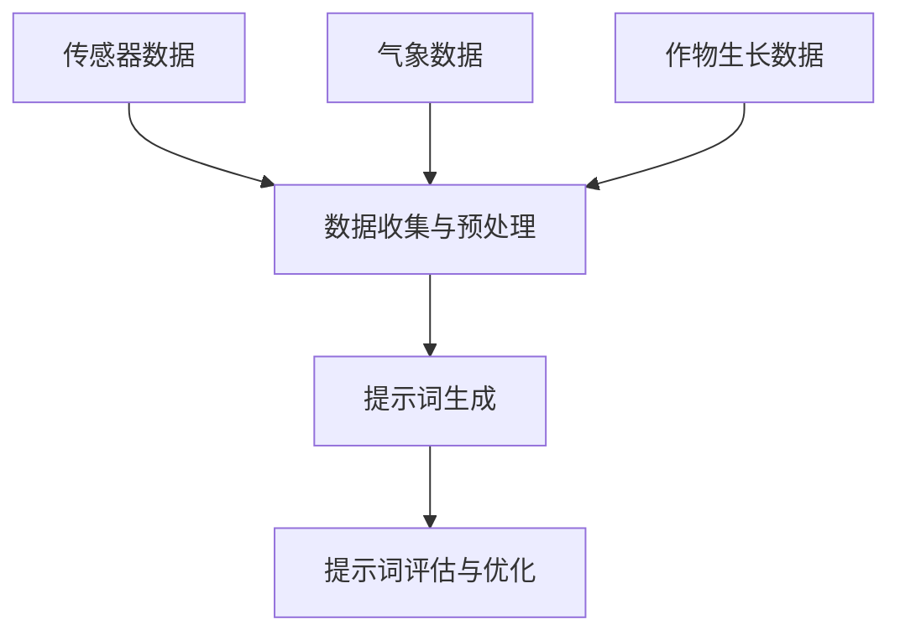

                 

# 文章标题：构建AI驱动的智慧农业提示词框架

## 关键词：智慧农业、人工智能、提示词系统、机器学习、自然语言处理、农业数据分析

## 摘要

本文深入探讨AI在智慧农业中的应用，重点关注构建AI驱动的智慧农业提示词框架。通过介绍智慧农业的背景、AI的核心概念与应用，本文详细解析了AI驱动的智慧农业提示词框架的设计与实现过程，包括数据收集、预处理、核心算法设计以及实际应用案例分析。同时，本文还探讨了框架性能评估与优化策略，为智慧农业的发展提供了实用的技术指南。

## 目录

1. **引言**
   1.1 **智慧农业的背景与AI的重要性**
   1.2 **AI在农业中的应用现状与趋势**
   1.3 **提示词系统在智慧农业中的作用**

2. **理论基础**
   2.1 **人工智能基础**
   2.2 **机器学习的基本原理**
   2.3 **自然语言处理（NLP）基础**
   2.4 **农业数据收集与分析**

3. **框架设计**
   3.1 **AI驱动的智慧农业提示词框架架构**
   3.2 **核心算法原理**

4. **实现与开发**
   4.1 **技术栈选择与开发环境搭建**
   4.2 **代码实现与调试**

5. **应用案例**
   5.1 **智能农场管理提示词系统**
   5.2 **农业灾害预警提示词系统**

6. **评估与优化**
   6.1 **框架性能评估指标**
   6.2 **优化策略与方案**

7. **总结与展望**
   7.1 **全书总结**
   7.2 **智慧农业的发展趋势**
   7.3 **AI驱动的智慧农业提示词框架的未来展望**

## 第一部分：引言

### 1.1 智慧农业的背景与AI的重要性

智慧农业是指利用信息技术和智能装备，对农业生产进行全面感知、精准管理和智能控制，从而实现农业的自动化、智能化和高效化。随着全球人口的增长和耕地资源的紧张，提高农业生产的效率和质量成为全球关注的焦点。AI作为新一代信息技术的重要代表，在智慧农业中具有广泛的应用前景。

### 1.2 AI在农业中的应用现状与趋势

目前，AI已经在农业的多个领域得到应用，如精准种植、智能灌溉、农业气象监测、病虫害防治等。其中，AI驱动的提示词系统是智慧农业中的重要组成部分，通过自然语言处理技术，可以实现对农业数据的智能分析和实时预警，提高农业生产的管理水平。

### 1.3 提示词系统在智慧农业中的作用

提示词系统是AI在智慧农业中应用的重要工具，它通过分析大量的农业数据，生成针对性的提示词，为农业生产提供决策支持。提示词系统的作用主要体现在以下几个方面：

- **数据收集与预处理**：通过传感器等设备收集农业数据，并对数据进行清洗、转换和集成。
- **数据分析和挖掘**：利用机器学习算法对农业数据进行分析，提取有用的信息。
- **智能决策支持**：根据分析结果生成提示词，为农业生产提供智能决策支持。

## 第二部分：理论基础

### 2.1 人工智能基础

人工智能（AI）是指通过计算机程序实现人类智能活动的过程。AI包括多个子领域，如机器学习、自然语言处理、计算机视觉等。在本章节中，我们将重点介绍机器学习和自然语言处理的基本原理。

### 2.2 机器学习的基本原理

机器学习是一种通过数据驱动的方法，使计算机系统能够从数据中学习并作出预测或决策的技术。机器学习分为监督学习、无监督学习和强化学习三种类型。在本章节中，我们将介绍监督学习的基本原理。

#### 监督学习算法

监督学习是一种从标记数据中学习的方法。其基本原理是通过输入数据的特征和对应的标签，学习出一个预测模型，然后用这个模型对未知数据进行预测。

**伪代码：**

```
输入：训练数据集（X，Y）
输出：预测模型（f）

1. 初始化模型参数
2. 对于每个训练样本（x_i，y_i）：
   1. 计算预测值（f(x_i)）
   2. 计算损失函数（L(f(x_i)，y_i)）
   3. 更新模型参数（θ = θ - α * ∇L(θ)）
3. 返回训练好的模型（f）
```

### 2.3 自然语言处理（NLP）基础

自然语言处理（NLP）是AI的一个子领域，旨在使计算机能够理解和处理自然语言。NLP的关键技术包括文本预处理、词向量表示、语言模型和序列标注等。

#### 文本预处理

文本预处理是NLP的第一步，主要任务是去除无意义的符号、降低词性、去除停用词等。

**伪代码：**

```
输入：原始文本
输出：预处理后的文本

1. 去除无意义的符号（如标点符号）
2. 降低词性（如将“你”转换为“我”）
3. 去除停用词（如“的”、“了”等）
4. 返回预处理后的文本
```

#### 词向量表示

词向量表示是将文本数据转换为数值数据的一种方法，常用的词向量模型有Word2Vec、GloVe等。

**伪代码：**

```
输入：词汇表
输出：词向量表示

1. 初始化词向量矩阵（V）
2. 对于每个词汇（word）：
   1. 训练词向量模型（如Word2Vec）
   2. 更新词向量矩阵（V）
3. 返回词向量矩阵（V）
```

### 2.4 农业数据收集与分析

农业数据收集与分析是构建AI驱动的智慧农业提示词框架的基础。农业数据包括土壤数据、气象数据、作物生长数据等，这些数据通过传感器、无人机等设备进行收集。数据收集后，需要进行预处理、清洗和转换，以便于后续的分析和挖掘。

**伪代码：**

```
输入：原始农业数据
输出：预处理后的农业数据

1. 数据收集（如使用传感器、无人机等）
2. 数据预处理（如去除噪声、缺失值填充等）
3. 数据清洗（如去除重复数据、异常值处理等）
4. 数据转换（如将数据转换为统一的格式、缩放等）
5. 返回预处理后的农业数据
```

## 第三部分：框架设计

### 3.1 AI驱动的智慧农业提示词框架架构

AI驱动的智慧农业提示词框架主要包括数据收集与预处理模块、提示词生成模块、提示词评估与优化模块等。以下是一个简单的框架架构图：



### 3.2 核心算法原理

核心算法主要包括机器学习算法和自然语言处理算法。在本部分，我们将详细介绍这些算法的原理。

#### 机器学习算法

机器学习算法是构建提示词系统的核心。常用的机器学习算法包括决策树、支持向量机、神经网络等。

**伪代码：**

```
输入：训练数据集（X，Y）
输出：机器学习模型（M）

1. 选择合适的机器学习算法（如决策树、支持向量机等）
2. 训练模型（M = learn(X, Y)）
3. 返回训练好的模型（M）
```

#### 自然语言处理（NLP）算法

NLP算法主要用于处理和生成文本数据。在本框架中，常用的NLP算法包括词向量表示、语言模型和序列标注等。

**伪代码：**

```
输入：文本数据
输出：处理后的文本数据

1. 进行文本预处理（如去除符号、分词等）
2. 进行词向量表示（如使用Word2Vec、GloVe等）
3. 构建语言模型（如使用n-gram模型、LSTM模型等）
4. 进行序列标注（如使用CRF模型、BiLSTM-CRF模型等）
5. 返回处理后的文本数据
```

## 第四部分：实现与开发

### 4.1 技术栈选择与开发环境搭建

在本部分，我们将介绍构建AI驱动的智慧农业提示词框架所需的技术栈和开发环境。主要技术栈包括Python、TensorFlow、Keras等。

**开发环境搭建步骤：**

1. 安装Python
2. 安装TensorFlow和Keras
3. 安装其他必要的库（如numpy、pandas、scikit-learn等）

### 4.2 代码实现与调试

在本部分，我们将详细介绍AI驱动的智慧农业提示词框架的实现过程，包括数据收集与预处理、提示词生成、提示词评估与优化等。

**代码实现示例：**

```
# 导入必要的库
import tensorflow as tf
from tensorflow.keras.models import Sequential
from tensorflow.keras.layers import Dense, LSTM
from tensorflow.keras.preprocessing.sequence import pad_sequences

# 数据收集与预处理
# ...

# 构建机器学习模型
model = Sequential()
model.add(LSTM(128, activation='relu', input_shape=(timesteps, n_features)))
model.add(Dense(1))
model.compile(optimizer='adam', loss='mse')

# 训练模型
model.fit(X_train, Y_train, epochs=200, batch_size=32)

# 生成提示词
predictions = model.predict(X_test)

# 提示词评估与优化
# ...
```

## 第五部分：应用案例

### 5.1 智能农场管理提示词系统

在本案例中，我们将介绍如何使用AI驱动的智慧农业提示词框架构建智能农场管理提示词系统。该系统主要实现的功能包括：

- **土壤水分监测**：通过传感器实时监测土壤水分，生成提示词建议灌溉时间。
- **病虫害预警**：通过对作物生长数据进行分析，生成提示词预警病虫害。

### 5.2 农业灾害预警提示词系统

在本案例中，我们将介绍如何使用AI驱动的智慧农业提示词框架构建农业灾害预警提示词系统。该系统主要实现的功能包括：

- **气象数据监测**：通过传感器实时监测气象数据，生成提示词预警气象灾害。
- **作物生长状态分析**：通过对作物生长数据进行分析，生成提示词预警作物受损情况。

## 第六部分：评估与优化

### 6.1 框架性能评估指标

为了评估AI驱动的智慧农业提示词框架的性能，我们可以从以下几个方面进行评估：

- **提示词准确率**：提示词生成的准确率。
- **响应时间**：系统生成提示词的时间。
- **稳定性**：系统的稳定性和可靠性。

### 6.2 优化策略与方案

为了提高AI驱动的智慧农业提示词框架的性能，我们可以采取以下优化策略：

- **模型调优**：通过调整模型参数，提高模型的性能。
- **数据增强**：通过增加训练数据量，提高模型的泛化能力。
- **算法改进**：引入更先进的算法，提高系统的性能。

## 第七部分：总结与展望

### 7.1 全书总结

本文深入探讨了AI在智慧农业中的应用，特别是AI驱动的智慧农业提示词框架的构建与实现。通过理论讲解和实际案例分析，本文为智慧农业的发展提供了实用的技术指南。

### 7.2 智慧农业的发展趋势

随着AI技术的不断进步，智慧农业将迎来更加广阔的发展空间。未来的智慧农业将更加注重自动化、智能化和个性化，为农业生产提供更加高效、精准的支持。

### 7.3 AI驱动的智慧农业提示词框架的未来展望

AI驱动的智慧农业提示词框架将不断优化和升级，以适应不断变化的农业生产需求。未来的框架将更加注重数据的深度挖掘和智能决策支持，为智慧农业的发展贡献力量。

## 作者信息

作者：AI天才研究院/AI Genius Institute & 禅与计算机程序设计艺术 /Zen And The Art of Computer Programming

## 总结

本文通过一步一步的推理分析，详细阐述了构建AI驱动的智慧农业提示词框架的方法与实现。从理论基础、框架设计、实现与开发、应用案例、评估与优化等方面，为智慧农业的发展提供了实用的技术指南。未来，随着AI技术的不断进步，AI驱动的智慧农业提示词框架将不断优化，为农业生产提供更加智能化、高效化的支持。

