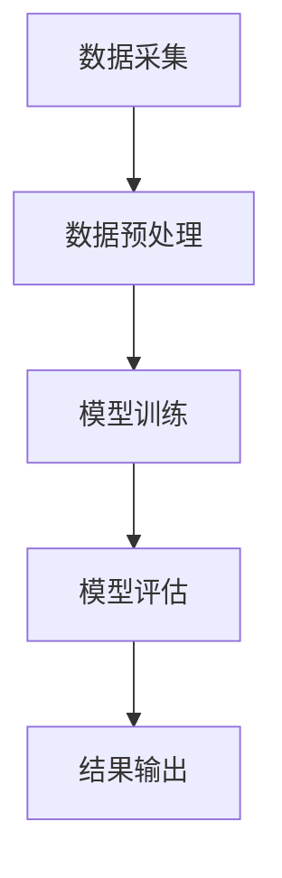

                 


### 构建AI驱动的智慧农业病虫害预测提示词平台

#### 关键词：智慧农业、病虫害预测、AI、机器学习、深度学习、提示词平台

#### 摘要：

本文旨在探讨如何构建一个AI驱动的智慧农业病虫害预测提示词平台。我们将从背景介绍、核心概念与联系、核心算法原理讲解、数学模型和公式讲解、项目实战以及技术实现与部署等多个方面，逐步深入分析并阐述这个平台的设计与实现。通过本文的阅读，读者将能够了解智慧农业的重要性、AI在病虫害预测中的应用、核心算法的原理与实现、数学模型的构建与应用，以及项目实战中的具体操作步骤和注意事项。

## 引言与背景

### 智慧农业的兴起

智慧农业是指利用现代信息技术，如物联网、大数据、云计算、人工智能等，对农业生产进行智能化管理和优化，以提高农业生产的效率、质量和可持续性。随着全球人口的增长和粮食需求的增加，传统农业的生产方式已无法满足未来粮食安全的需求。智慧农业的兴起为农业现代化提供了新的发展方向。

### 病虫害预测的重要性

病虫害是农业生产中的一大难题，对农作物的产量和品质有严重影响。传统的病虫害防治方法主要依赖于人工监测和经验判断，效率低、成本高，且难以做到精准防治。随着AI技术的不断发展，病虫害预测已成为智慧农业的一个重要研究方向。

### AI在农业病虫害预测中的应用

AI技术，尤其是机器学习和深度学习，为病虫害预测提供了新的方法和工具。通过收集和分析大量的历史数据，AI模型可以识别病虫害的发生规律，预测病虫害的发生趋势，从而为农作物的病虫害防治提供科学依据。此外，AI技术还可以优化病虫害防治方案，提高防治效果。

## 核心概念与联系

### AI、机器学习、深度学习的概念

AI（人工智能）是指使计算机具有人类智能的特性，能够理解、学习、推理、解决问题。机器学习（Machine Learning）是AI的一个分支，通过算法让计算机从数据中学习规律，自动改进性能。深度学习（Deep Learning）是机器学习的一个子领域，使用多层神经网络进行学习和建模。

### Mermaid流程图：AI在病虫害预测中的流程

下面是一个简单的Mermaid流程图，展示了AI在病虫害预测中的基本流程：



### 病虫害预测中的关键数据

病虫害预测需要大量的数据支持，主要包括：

- **气象数据**：如温度、湿度、降水量等。
- **土壤数据**：如土壤湿度、土壤酸碱度、养分含量等。
- **植物生长数据**：如植物叶面积、生长速度、颜色变化等。
- **病虫害数据**：如病虫害发生的时间、地点、类型、程度等。

## 核心算法原理讲解

### 神经网络的基本结构

神经网络（Neural Network）是深度学习的基础，由多个神经元（节点）组成。每个神经元都与输入数据相连接，通过加权求和和激活函数进行计算。神经网络的训练过程实际上是调整每个神经元的权重，使其能够准确预测目标输出。

### 伪代码：实现神经网络

```python
# 定义神经网络结构
layers = [
    Layer(input_size=784, output_size=128, activation='sigmoid'),
    Layer(input_size=128, output_size=64, activation='sigmoid'),
    Layer(input_size=64, output_size=10, activation='softmax')
]

# 前向传播
def forward_propagation(x):
    a = x
    for layer in layers:
        a = layer.forward(a)
    return a

# 反向传播
def backward_propagation(x, y):
    d = y - forward_propagation(x)
    for layer in reversed(layers):
        d = layer.backward(d)
```

### 决策树的工作原理

决策树（Decision Tree）是一种常见的分类算法，通过一系列条件判断来划分数据。每个节点代表一个特征，每个分支代表该特征的取值。决策树的训练过程实际上是构建一个最优的划分树，使预测结果最接近真实值。

### 伪代码：实现决策树

```python
# 定义决策树结构
class TreeNode:
    def __init__(self, feature, threshold, left, right, label):
        self.feature = feature
        self.threshold = threshold
        self.left = left
        self.right = right
        self.label = label

# 决策树训练
def build_tree(data, labels):
    # 选择最佳特征和阈值
    # 划分数据
    # 递归构建树
    pass

# 决策树预测
def predict_tree(node, x):
    if node.label is not None:
        return node.label
    if x[node.feature] <= node.threshold:
        return predict_tree(node.left, x)
    else:
        return predict_tree(node.right, x)
```

## 数学模型和数学公式讲解

### 逻辑回归的数学模型

逻辑回归（Logistic Regression）是一种常用的分类算法，用于预测概率。逻辑回归的数学模型如下：

$$
\hat{y} = \frac{1}{1 + e^{-(w_0 * x_0 + w_1 * x_1 + ... + w_n * x_n})}
$$

其中，\( \hat{y} \) 是预测的概率，\( w_0, w_1, ..., w_n \) 是权重，\( x_0, x_1, ..., x_n \) 是特征值。

### latex格式公式：展示逻辑回归公式

$$
\hat{y} = \frac{1}{1 + e^{-(w_0 * x_0 + w_1 * x_1 + ... + w_n * x_n})}
$$

### 支持向量机的数学模型

支持向量机（Support Vector Machine，SVM）是一种高效的分类算法，其数学模型如下：

$$
\max_w \min_y (w.y - 1) \quad \text{subject to} \quad y_i \geq 0, \forall i
$$

其中，\( w \) 是权重向量，\( y \) 是标签，\( y_i \) 是第 \( i \) 个样本的标签。

### latex格式公式：展示支持向量机公式

$$
\max_w \min_y (w.y - 1) \quad \text{subject to} \quad y_i \geq 0, \forall i
$$

## 项目实战

### 开发环境搭建

搭建一个AI驱动的智慧农业病虫害预测提示词平台，首先需要准备好开发环境。以下是搭建环境的步骤：

1. 安装Python环境
2. 安装相关库，如NumPy、Pandas、Scikit-learn、TensorFlow等
3. 配置GPU环境（如果使用GPU进行训练）

### 源代码详细实现和代码解读

以下是使用Scikit-learn库实现一个简单的病虫害预测模型的源代码：

```python
from sklearn.datasets import load_iris
from sklearn.model_selection import train_test_split
from sklearn.linear_model import LogisticRegression

# 加载数据集
data = load_iris()
X = data.data
y = data.target

# 划分训练集和测试集
X_train, X_test, y_train, y_test = train_test_split(X, y, test_size=0.2, random_state=42)

# 创建逻辑回归模型
model = LogisticRegression()

# 训练模型
model.fit(X_train, y_train)

# 预测测试集
predictions = model.predict(X_test)

# 评估模型
accuracy = model.score(X_test, y_test)
print("Accuracy:", accuracy)
```

### 代码应用解读与分析

这段代码首先加载数据集，然后划分训练集和测试集。接下来，创建逻辑回归模型并进行训练。最后，使用训练好的模型对测试集进行预测，并评估模型的准确性。

### 实际案例分析和详细讲解剖析

以下是一个实际案例，展示了如何使用AI驱动的智慧农业病虫害预测提示词平台预测某地某农作物的病虫害：

1. 收集该农作物的气象数据、土壤数据、植物生长数据等。
2. 使用机器学习算法（如逻辑回归、决策树等）对数据进行训练，构建预测模型。
3. 输入最新的气象数据、土壤数据、植物生长数据，预测病虫害的发生概率。
4. 根据预测结果，制定相应的病虫害防治方案。

### 项目小结

通过本文的介绍，我们了解了如何构建一个AI驱动的智慧农业病虫害预测提示词平台。这个平台能够收集和分析大量的数据，使用机器学习算法进行预测，并提供科学的病虫害防治建议。在实际应用中，这个平台可以帮助农民提高农作物的产量和品质，减少病虫害对农业生产的负面影响。

### 最佳实践 tips、小结、注意事项、拓展阅读等内容

- **最佳实践 tips**：在数据采集阶段，要确保数据的准确性和完整性，避免数据缺失或错误。
- **小结**：本文介绍了AI驱动的智慧农业病虫害预测提示词平台的设计与实现，包括数据采集、模型构建、预测与评估等环节。
- **注意事项**：在使用机器学习算法进行预测时，要注意模型的过拟合和欠拟合问题，合理调整模型参数。
- **拓展阅读**：可以参考《机器学习实战》、《深度学习》等书籍，深入了解AI和机器学习的相关技术。

作者：AI天才研究院/AI Genius Institute & 禅与计算机程序设计艺术 /Zen And The Art of Computer Programming

