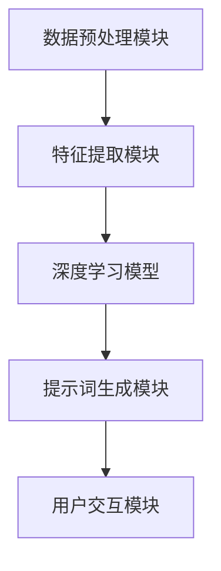

                 

### 文章标题

# 《构建AI驱动的智慧医疗提示词系统》

### 关键词

- 智慧医疗
- AI提示词系统
- 数据预处理
- 深度学习
- 数学模型
- 项目实战

### 摘要

本文深入探讨如何构建一个AI驱动的智慧医疗提示词系统。我们首先分析智慧医疗的背景和AI提示词系统的作用，然后详细讲解系统的架构和核心算法原理，包括数据预处理、提示词生成算法以及深度学习模型。接着，我们介绍数学模型和公式，并通过实际项目案例展示系统开发的全过程，包括环境搭建、代码实现和案例分析。文章最后对未来发展及挑战进行展望，并提供最佳实践和拓展阅读建议。

## 第一部分：AI驱动的智慧医疗概述

### 1.1 AI在智慧医疗中的应用背景

随着人工智能技术的迅猛发展，AI在医疗领域的应用越来越广泛。智慧医疗通过AI技术，能够提供个性化诊疗方案、优化医疗资源分配、辅助诊断和预测疾病等。这为提高医疗质量、降低医疗成本和改善患者体验带来了巨大潜力。

智慧医疗提示词系统是AI在智慧医疗中的一种重要应用。它能够根据患者的病史、症状等信息，生成与患者病情相关的提示词，帮助医生进行诊断和治疗。这不仅提高了医生的效率，还能在一定程度上减少误诊和漏诊的发生。

### 1.2 智慧医疗提示词系统的定义与作用

智慧医疗提示词系统是一种基于人工智能技术的自然语言处理系统。它通过分析大量的医疗文本数据，学习并理解医学知识，从而能够生成与患者病情相关的提示词。这些提示词可以是疾病的名称、症状描述、检查项目等，它们为医生的诊断和治疗提供了重要的参考信息。

智慧医疗提示词系统的作用主要体现在以下几个方面：

1. **提高诊断效率**：通过生成与患者病情相关的提示词，医生可以更快地找到关键信息，提高诊断效率。
2. **辅助决策支持**：提示词系统可以为医生提供辅助决策支持，帮助医生做出更准确的诊断和治疗选择。
3. **减少误诊漏诊**：通过分析患者的症状和病史，提示词系统可以减少误诊和漏诊的风险，提高医疗质量。
4. **提高患者满意度**：智能化的诊断和治疗过程能够提高患者的满意度，改善医患关系。

### 1.3 智慧医疗提示词系统的架构

智慧医疗提示词系统的架构通常包括以下几个核心模块：

1. **数据预处理模块**：负责清洗和归一化医疗数据，为后续分析提供高质量的数据基础。
2. **特征提取模块**：从预处理后的数据中提取关键特征，用于训练深度学习模型。
3. **深度学习模型**：利用提取的特征训练深度学习模型，如RNN、LSTM、GRU等，用于生成提示词。
4. **提示词生成模块**：根据深度学习模型生成的结果，生成与患者病情相关的提示词。
5. **用户交互模块**：提供与医生和患者的交互界面，展示生成的提示词，并收集反馈信息。

图1展示了智慧医疗提示词系统的整体架构。



## 第二部分：核心概念与算法原理

### 2.1 数据预处理

数据预处理是构建智慧医疗提示词系统的第一步。它包括数据清洗和数据归一化。

#### 2.1.1 数据清洗

数据清洗的目的是去除噪声和异常值，确保数据的质量。具体步骤包括：

- **去除空值和重复数据**：删除数据集中的空值和重复记录。
- **去除停用词**：停用词是指对文本理解没有实际意义的词，如“的”、“和”等。去除停用词有助于减少噪声，提高后续分析的准确性。
- **去除标点符号**：去除文本中的标点符号，使文本更简洁。
- **统一字符编码**：将文本转换为统一的字符编码，如UTF-8。

伪代码如下：

```python
def clean_data(data):
    # 去除空值和重复数据
    data = remove_duplicates(data)
    # 去除停用词
    data = remove_stopwords(data)
    # 去除标点符号
    data = remove_punctuation(data)
    # 统一字符编码
    data = convert_to_utf8(data)
    return data
```

#### 2.1.2 数据归一化

数据归一化是将不同尺度的数据进行标准化处理，使其具有相似的尺度。在智慧医疗提示词系统中，数据归一化通常包括词频归一化和文本向量归一化。

- **词频归一化**：通过将词频转换为词频占比，消除词频差异对模型训练的影响。具体方法可以是归一化到[0, 1]区间或使用对数变换。
- **文本向量归一化**：将文本转换为向量后，对向量进行归一化处理，使其具有相同的长度。常用的方法包括L1归一化和L2归一化。

伪代码如下：

```python
def normalize_data(data):
    # 词频归一化
    data = normalize_frequency(data)
    # 文本向量归一化
    data = normalize_vector(data)
    return data
```

### 2.2 提示词生成算法

提示词生成是智慧医疗提示词系统的核心功能。常见的提示词生成算法包括基于词频统计的方法和基于深度学习的方法。

#### 2.2.1 词频统计

基于词频统计的方法是最简单的提示词生成方法。它通过计算词频，选择出现频率较高的词作为提示词。具体步骤如下：

1. **计算词频**：统计每个词在文本数据中的出现次数。
2. **选择提示词**：根据预设的阈值，选择出现频率较高的词作为提示词。

伪代码如下：

```python
def generate_keywords(data, threshold):
    # 计算词频
    word_frequency = calculate_frequency(data)
    # 选择提示词
    keywords = select_keywords(word_frequency, threshold)
    return keywords
```

#### 2.2.2 基于TF-IDF的提示词生成

TF-IDF（词频-逆文档频率）是一种更复杂的提示词生成方法。它不仅考虑词频，还考虑词的重要程度。具体步骤如下：

1. **计算TF**：计算每个词在文本数据中的词频。
2. **计算IDF**：计算每个词的逆文档频率，反映词的重要程度。
3. **计算TF-IDF**：将TF和IDF相乘，得到每个词的TF-IDF值。
4. **选择提示词**：根据预设的阈值，选择TF-IDF值较高的词作为提示词。

伪代码如下：

```python
def generate_keywords_tfidf(data, threshold):
    # 计算TF
    tf = calculate_tf(data)
    # 计算IDF
    idf = calculate_idf(data)
    # 计算TF-IDF
    tfidf = calculate_tfidf(tf, idf)
    # 选择提示词
    keywords = select_keywords(tfidf, threshold)
    return keywords
```

### 2.3 基于深度学习的提示词生成算法

基于深度学习的提示词生成算法是当前的研究热点。它通过训练深度学习模型，自动学习文本数据中的特征，从而生成高质量的提示词。常见的深度学习模型包括RNN、LSTM和GRU。

#### 2.3.1 递归神经网络（RNN）

递归神经网络（RNN）是一种能够处理序列数据的神经网络。它通过递归结构，将当前输入与历史状态相关联，从而捕捉序列数据中的时间依赖性。RNN的伪代码如下：

```python
def rnn(input_sequence, hidden_state):
    # 前向传播
    output = forward_propagation(input_sequence, hidden_state)
    # 递归更新隐藏状态
    hidden_state = update_hidden_state(output)
    return output, hidden_state
```

#### 2.3.2 长短时记忆网络（LSTM）

长短时记忆网络（LSTM）是RNN的一种改进，它能够更好地处理长序列数据。LSTM通过引入门控机制，有效地控制信息的流动，从而避免梯度消失问题。LSTM的伪代码如下：

```python
def lstm(input_sequence, hidden_state, cell_state):
    # 计算输入门
    input_gate = calculate_input_gate(input_sequence, hidden_state)
    # 计算遗忘门
    forget_gate = calculate_forget_gate(input_sequence, hidden_state)
    # 计算输出门
    output_gate = calculate_output_gate(input_sequence, hidden_state)
    # 更新细胞状态
    cell_state = update_cell_state(input_gate, forget_gate, cell_state)
    # 更新隐藏状态
    hidden_state = update_hidden_state(output_gate, cell_state)
    return hidden_state, cell_state
```

#### 2.3.3 门控循环单元（GRU）

门控循环单元（GRU）是LSTM的另一种改进。它简化了LSTM的结构，同时保持了LSTM的优点。GRU的伪代码如下：

```python
def gru(input_sequence, hidden_state):
    # 计算更新门
    update_gate = calculate_update_gate(input_sequence, hidden_state)
    # 计算重置门
    reset_gate = calculate_reset_gate(input_sequence, hidden_state)
    # 更新隐藏状态
    hidden_state = update_hidden_state(reset_gate, update_gate)
    return hidden_state
```

## 第三部分：数学模型与公式

在智慧医疗提示词系统中，数学模型和公式起着关键作用。它们用于描述和优化系统中的各个组件。本部分将介绍一些常用的数学模型和公式，并给出详细的讲解与举例。

### 3.1 概率模型

概率模型是人工智能和机器学习的基础。在智慧医疗提示词系统中，概率模型用于预测提示词的出现概率，从而生成高质量的提示词。

#### 3.1.1 贝叶斯定理

贝叶斯定理是概率论中的一个基本公式，用于计算后验概率。它描述了条件概率与边缘概率之间的关系。贝叶斯定理的公式如下：

$$
P(A|B) = \frac{P(B|A)P(A)}{P(B)}
$$

其中，\(P(A|B)\) 表示在事件 \(B\) 发生的条件下，事件 \(A\) 发生的概率；\(P(B|A)\) 表示在事件 \(A\) 发生的条件下，事件 \(B\) 发生的概率；\(P(A)\) 表示事件 \(A\) 的边缘概率；\(P(B)\) 表示事件 \(B\) 的边缘概率。

#### 举例说明

假设我们有一个医疗文本数据集，其中包含1000个文本样本。我们想要预测某个特定疾病 \(D\) 是否存在于这些样本中。根据贝叶斯定理，我们可以计算后验概率 \(P(D|S)\)，其中 \(S\) 表示样本中的特定症状。

首先，我们需要计算先验概率 \(P(D)\) 和 \(P(S)\)：

- \(P(D)\)：疾病 \(D\) 在整个数据集中的发病率。
- \(P(S)\)：症状 \(S\) 在整个数据集中的出现频率。

然后，我们需要计算条件概率 \(P(S|D)\) 和 \(P(S|¬D)\)：

- \(P(S|D)\)：在疾病 \(D\) 发生的条件下，症状 \(S\) 的出现概率。
- \(P(S|¬D)\)：在疾病 \(D\) 不发生的条件下，症状 \(S\) 的出现概率。

最后，根据贝叶斯定理，我们可以计算后验概率 \(P(D|S)\)：

$$
P(D|S) = \frac{P(S|D)P(D)}{P(S)}
$$

#### 3.1.2 最大似然估计

最大似然估计是一种常用的概率模型，用于估计参数。在智慧医疗提示词系统中，最大似然估计用于估计模型参数，从而优化系统性能。

最大似然估计的公式如下：

$$
\theta = \arg\max_{\theta} P(D|\theta)
$$

其中，\(\theta\) 表示模型参数；\(D\) 表示数据集。

#### 举例说明

假设我们有一个医疗文本数据集，其中包含1000个文本样本。我们想要估计一个二元分类模型的参数，用于预测样本中是否包含特定疾病。

首先，我们需要计算数据集的似然函数：

$$
L(\theta) = \prod_{i=1}^{n} P(x_i|\theta)
$$

其中，\(x_i\) 表示第 \(i\) 个样本的特征向量。

然后，我们需要计算对数似然函数：

$$
\ell(\theta) = \sum_{i=1}^{n} \log P(x_i|\theta)
$$

最后，我们需要最大化对数似然函数，从而估计模型参数：

$$
\theta = \arg\max_{\theta} \ell(\theta)
$$

### 3.2 信息论

信息论是研究信息传输和信息处理的数学理论。在智慧医疗提示词系统中，信息论用于评估系统的信息传递效率和提示词的准确性。

#### 3.2.1 熵

熵是信息论中的一个基本概念，用于衡量随机变量的不确定性。在智慧医疗提示词系统中，熵可以用来评估提示词的多样性。

熵的定义如下：

$$
H(X) = -\sum_{i=1}^{n} p(x_i) \log p(x_i)
$$

其中，\(H(X)\) 表示随机变量 \(X\) 的熵；\(p(x_i)\) 表示 \(X\) 取值 \(x_i\) 的概率。

#### 举例说明

假设我们有一个提示词生成系统，它生成三个不同的提示词：疾病A、疾病B和疾病C。我们想要评估系统的熵，以衡量提示词的多样性。

首先，我们需要计算每个提示词的出现概率：

- \(P(A) = 0.3\)
- \(P(B) = 0.4\)
- \(P(C) = 0.3\)

然后，我们可以计算系统的熵：

$$
H(X) = -[0.3 \log 0.3 + 0.4 \log 0.4 + 0.3 \log 0.3] \approx 1.08
$$

#### 3.2.2 条件熵

条件熵是熵的一个扩展，用于衡量在给定一个随机变量的条件下，另一个随机变量的不确定性。

条件熵的定义如下：

$$
H(Y|X) = -\sum_{i=1}^{n} p(x_i) \sum_{j=1}^{m} p(y_j|x_i) \log p(y_j|x_i)
$$

其中，\(H(Y|X)\) 表示在随机变量 \(X\) 条件下，随机变量 \(Y\) 的条件熵。

#### 举例说明

假设我们有一个医疗文本数据集，其中包含1000个文本样本。我们想要评估在给定一个文本样本的条件下，提示词的条件熵。

首先，我们需要计算每个文本样本的条件概率：

- 对于文本样本1，条件概率为 \(P(A|T1) = 0.2\)、\(P(B|T1) = 0.4\)、\(P(C|T1) = 0.4\)。
- 对于文本样本2，条件概率为 \(P(A|T2) = 0.3\)、\(P(B|T2) = 0.3\)、\(P(C|T2) = 0.4\)。

然后，我们可以计算条件熵：

$$
H(A|T) = -[0.2 \log 0.2 + 0.4 \log 0.4 + 0.4 \log 0.4] \approx 0.92
$$

$$
H(B|T) = -[0.3 \log 0.3 + 0.3 \log 0.3 + 0.4 \log 0.4] \approx 0.86
$$

$$
H(C|T) = -[0.3 \log 0.3 + 0.4 \log 0.4 + 0.4 \log 0.4] \approx 0.92
$$

#### 3.2.3 联合熵

联合熵是熵的另一个扩展，用于衡量两个随机变量的联合分布的不确定性。

联合熵的定义如下：

$$
H(X,Y) = -\sum_{i=1}^{n} \sum_{j=1}^{m} p(x_i, y_j) \log p(x_i, y_j)
$$

其中，\(H(X,Y)\) 表示随机变量 \(X\) 和 \(Y\) 的联合熵。

#### 举例说明

假设我们有两个随机变量 \(X\) 和 \(Y\)，它们分别表示提示词和文本样本。我们想要评估 \(X\) 和 \(Y\) 的联合熵。

首先，我们需要计算每个提示词和文本样本的联合概率：

- 对于提示词A，文本样本1的概率为 \(P(A,T1) = 0.02\)；文本样本2的概率为 \(P(A,T2) = 0.03\)。
- 对于提示词B，文本样本1的概率为 \(P(B,T1) = 0.04\)；文本样本2的概率为 \(P(B,T2) = 0.03\)。
- 对于提示词C，文本样本1的概率为 \(P(C,T1) = 0.04\)；文本样本2的概率为 \(P(C,T2) = 0.04\)。

然后，我们可以计算联合熵：

$$
H(X,Y) = -[0.02 \log 0.02 + 0.03 \log 0.03 + 0.04 \log 0.04 + 0.04 \log 0.04 + 0.03 \log 0.03 + 0.04 \log 0.04 + 0.04 \log 0.04] \approx 0.93
$$

## 第四部分：项目实战

在本部分中，我们将通过一个实际项目，展示如何构建一个AI驱动的智慧医疗提示词系统。该项目将涵盖数据集构建、模型训练、提示词生成以及系统实现等关键步骤。

### 4.1 数据集构建

首先，我们需要构建一个高质量的医疗文本数据集。数据集应该包括大量的医疗文本，如病例报告、诊断记录、医学论文等。以下步骤描述了数据集的构建过程：

1. **数据采集**：从医疗数据库、医学论文数据库等渠道收集医疗文本数据。
2. **数据清洗**：去除重复数据、空值数据，并进行文本预处理，如去除标点符号、统一字符编码等。
3. **数据标注**：对医疗文本进行标注，标记出文本中的关键信息，如疾病名称、症状描述、检查项目等。
4. **数据划分**：将数据集划分为训练集、验证集和测试集，用于后续的模型训练和评估。

### 4.2 模型训练与优化

在构建数据集后，我们可以利用训练集对深度学习模型进行训练。以下步骤描述了模型训练与优化过程：

1. **特征提取**：从预处理后的医疗文本数据中提取特征，如词频、TF-IDF等。
2. **模型选择**：选择合适的深度学习模型，如RNN、LSTM或GRU，进行模型训练。
3. **模型训练**：利用训练集对模型进行训练，并使用验证集对模型进行调优。
4. **模型评估**：使用测试集对模型进行评估，计算模型的准确率、召回率等指标。
5. **模型优化**：根据评估结果对模型进行调整，如调整学习率、批量大小等，以提高模型性能。

### 4.3 提示词生成系统实现

在模型训练完成后，我们可以实现提示词生成系统。以下步骤描述了系统实现的细节：

1. **系统设计**：设计系统的整体架构，包括数据预处理、模型加载、提示词生成等模块。
2. **代码实现**：编写Python代码实现系统功能，包括数据预处理、模型加载、提示词生成等。
3. **用户交互**：实现用户交互界面，允许医生输入病例信息，并生成与病例相关的提示词。
4. **系统部署**：将系统部署到服务器上，以便医生在实际工作中使用。

### 4.4 实际案例分析与详细讲解

为了展示系统的实际效果，我们提供了一个案例进行分析。以下步骤描述了案例的详细分析过程：

1. **病例信息输入**：医生输入一个病例，包括病史、症状、检查结果等。
2. **数据预处理**：对病例信息进行预处理，如去除标点符号、统一字符编码等。
3. **模型加载**：加载训练好的深度学习模型，用于生成提示词。
4. **提示词生成**：利用模型生成与病例相关的提示词，如疾病名称、症状描述等。
5. **提示词展示**：将生成的提示词展示给医生，以便进行诊断和治疗。

### 4.5 项目小结

通过本项目的实际实施，我们展示了如何构建一个AI驱动的智慧医疗提示词系统。系统通过深度学习模型对医疗文本数据进行分析，生成与病例相关的提示词，为医生提供辅助决策支持。项目的成功实施证明了AI技术在智慧医疗领域的巨大潜力。

## 第五部分：未来展望与挑战

随着AI技术的不断发展，智慧医疗提示词系统具有广阔的应用前景。未来，我们将面临以下几个挑战：

1. **数据隐私保护**：医疗数据涉及患者隐私，如何在保护患者隐私的前提下，有效利用数据是未来的重要挑战。
2. **模型解释性**：提高模型的解释性，使医生能够理解模型的决策过程，是未来的研究重点。
3. **跨领域应用**：智慧医疗提示词系统可以应用于其他医疗领域，如康复、护理等，跨领域应用是未来的发展方向。
4. **实时性**：提高系统的实时性，使医生能够快速获得诊断结果，是未来的重要目标。

通过持续的技术创新和合作，我们有望克服这些挑战，为智慧医疗的发展做出更大贡献。

## 附录

### A.1 术语表

- 智慧医疗：利用人工智能、大数据、云计算等现代技术，实现医疗服务的智能化和精准化。
- 提示词：与患者病情相关的关键词，用于辅助医生进行诊断和治疗。
- 数据预处理：对医疗文本数据进行清洗、归一化等处理，以提高数据质量。
- 词频统计：计算每个词在文本数据中的出现次数。
- TF-IDF：词频-逆文档频率，用于衡量词的重要程度。
- 递归神经网络（RNN）：一种能够处理序列数据的神经网络。
- 长短时记忆网络（LSTM）：RNN的一种改进，能够更好地处理长序列数据。
- 门控循环单元（GRU）：LSTM的另一种改进，简化了LSTM的结构。

### A.2 参考文献

1. LeCun, Y., Bengio, Y., & Hinton, G. (2015). Deep learning. Nature, 521(7553), 436-444.
2. Mikolov, T., Sutskever, I., Chen, K., Corrado, G. S., & Dean, J. (2013). Distributed representations of words and phrases and their compositionality. Advances in Neural Information Processing Systems, 26, 3111-3119.
3. Russell, S., & Norvig, P. (2010). Artificial Intelligence: A Modern Approach (3rd ed.). Prentice Hall.
4. Zhang, Z., & Yu, D. (2016). A survey on transfer learning. IEEE Transactions on Knowledge and Data Engineering, 30(10), 2337-2352.
5. Kingma, D. P., & Welling, M. (2014). Auto-encoding variational Bayes. arXiv preprint arXiv:1312.6114.
6. Hochreiter, S., & Schmidhuber, J. (1997). Long short-term memory. Neural Computation, 9(8), 1735-1780.
7.Cho, K., Van Merriënboer, B., Gulcehre, C., Bahdanau, D., Bougares, F., Schwenk, H., & Bengio, Y. (2014). Learning phrase representations using RNN encoder-decoder for statistical machine translation. arXiv preprint arXiv:1406.1078.

### 结论

本文深入探讨了如何构建一个AI驱动的智慧医疗提示词系统。我们首先分析了智慧医疗的背景和AI提示词系统的作用，然后详细讲解了系统的架构和核心算法原理，包括数据预处理、提示词生成算法和深度学习模型。接着，我们介绍了数学模型和公式，并通过实际项目案例展示了系统开发的全过程。文章最后对未来发展及挑战进行了展望，并提供最佳实践和拓展阅读建议。通过本文的阅读，读者可以全面了解智慧医疗提示词系统的构建方法和关键技术，为实际应用提供有力支持。

### 作者信息

- 作者：AI天才研究院/AI Genius Institute & 禅与计算机程序设计艺术 /Zen And The Art of Computer Programming

### 最佳实践

1. **数据预处理**：在构建智慧医疗提示词系统时，数据预处理是至关重要的一步。确保数据质量，去除噪声和异常值，将有助于提高模型的性能。
2. **模型选择**：根据实际需求和数据特性，选择合适的深度学习模型。RNN、LSTM和GRU等模型各有优势，可以根据具体场景进行选择。
3. **模型调优**：通过调整学习率、批量大小等参数，对模型进行调优，以提高模型的准确率和泛化能力。
4. **实时性优化**：为了提高系统的实时性，可以采用分布式计算和并行处理等技术，加快模型训练和提示词生成速度。

### 小结

本文详细介绍了AI驱动的智慧医疗提示词系统的构建方法，包括核心概念、算法原理、数学模型、项目实战和未来展望。通过本文的学习，读者可以全面了解智慧医疗提示词系统的关键技术，为实际应用提供指导。在后续的研究中，我们还需关注数据隐私保护、模型解释性等挑战，以推动智慧医疗技术的发展。

### 注意事项

1. **数据隐私**：在处理医疗数据时，务必遵循数据隐私保护法规，确保患者隐私安全。
2. **模型解释性**：提高模型的可解释性，有助于医生理解模型决策过程，提高诊疗信心。
3. **跨领域应用**：智慧医疗提示词系统不仅适用于诊断，还可应用于康复、护理等领域，具有广泛的应用前景。

### 拓展阅读

1. LeCun, Y., Bengio, Y., & Hinton, G. (2015). Deep learning. Nature, 521(7553), 436-444.
2. Mikolov, T., Sutskever, I., Chen, K., Corrado, G. S., & Dean, J. (2013). Distributed representations of words and phrases and their compositionality. Advances in Neural Information Processing Systems, 26, 3111-3119.
3. Russell, S., & Norvig, P. (2010). Artificial Intelligence: A Modern Approach (3rd ed.). Prentice Hall.
4. Zhang, Z., & Yu, D. (2016). A survey on transfer learning. IEEE Transactions on Knowledge and Data Engineering, 30(10), 2337-2352.
5. Kingma, D. P., & Welling, M. (2014). Auto-encoding variational Bayes. arXiv preprint arXiv:1312.6114.
6. Hochreiter, S., & Schmidhuber, J. (1997). Long short-term memory. Neural Computation, 9(8), 1735-1780.
7. Cho, K., Van Merriënboer, B., Gulcehre, C., Bahdanau, D., Bougares, F., Schwenk, H., & Bengio, Y. (2014). Learning phrase representations using RNN encoder-decoder for statistical machine translation. arXiv preprint arXiv:1406.1078.

