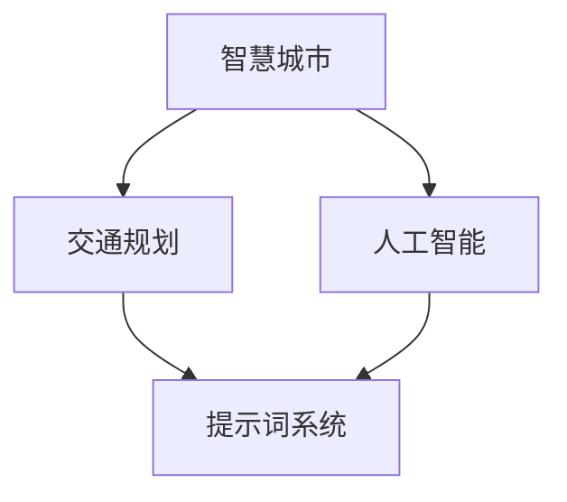

                 


### 一、背景介绍

随着城市化进程的加快，智慧城市成为未来城市发展的重要趋势。智慧城市以信息技术为支撑，通过集成和共享各类信息资源，实现城市管理的智能化、高效化和精细化。交通作为城市运行的“血脉”，其效率和安全性直接关系到市民的生活质量和社会经济的可持续发展。

然而，传统的交通规划方法在处理日益复杂的城市交通问题时，往往显得力不从心。数据量的激增、交通模式的多样化以及突发事件的频繁发生，都给交通规划带来了巨大的挑战。为了应对这些挑战，人工智能（AI）技术的引入成为了必然选择。

AI技术，尤其是机器学习和深度学习，为交通规划提供了强大的数据分析与预测能力。通过大数据分析，AI能够识别出行规律，预测交通流量，优化路径规划，从而提高交通运行效率。此外，AI还能实时监测交通状况，快速响应突发事件，提高交通安全水平。

因此，构建一个AI驱动的智慧城市交通规划提示词系统，不仅能够提高交通管理的智能化水平，还能够为城市管理者提供科学的决策依据，为市民提供更便捷、安全的出行体验。

### 二、核心概念与联系

在构建AI驱动的智慧城市交通规划提示词系统之前，我们需要明确几个核心概念，并理解它们之间的联系。

#### 1. 智慧城市

智慧城市是指利用物联网、大数据、云计算、人工智能等先进技术，实现城市管理的智能化和高效化。智慧城市的核心目标是提高城市运行效率，改善市民生活质量，促进可持续发展。在交通领域，智慧城市通过集成各类交通信息，实现交通的全面监控和智能化管理。

#### 2. 交通规划

交通规划是指根据城市的发展需求和交通现状，制定交通发展的长远规划，包括交通网络布局、交通设施建设、交通管理策略等。传统的交通规划方法主要依赖于经验和统计数据，而AI驱动的交通规划则能够通过大数据分析和预测，实现更为精准和高效的规划。

#### 3. 人工智能

人工智能是指通过计算机模拟人类智能行为的技术，包括机器学习、深度学习、自然语言处理等。在交通规划中，人工智能技术可以用于交通流量预测、路径规划、交通信号控制等，从而提升交通管理的智能化水平。

#### 4. 提示词系统

提示词系统是指通过机器学习和自然语言处理技术，构建的一个能够对用户输入的指令或问题进行理解和响应的系统。在智慧城市交通规划中，提示词系统可以提供交通信息查询、路径规划建议、交通事件预警等功能，为市民提供便捷的交通服务。

#### 5. 关系架构

为了更好地理解这些概念之间的联系，我们可以使用Mermaid流程图来展示它们的交互关系：



在上述流程图中，智慧城市是整体架构的核心，它通过交通规划实现智能化管理，而人工智能则为交通规划提供了技术支持，提示词系统则作为用户与智慧城市交互的界面。

### 三、核心算法原理讲解

在构建AI驱动的智慧城市交通规划提示词系统时，核心算法的选择和实现至关重要。以下是几个关键算法的原理讲解和伪代码示例。

#### 1. 交通流量预测算法

交通流量预测是智慧城市交通规划的重要环节，它能够帮助城市管理者提前了解交通状况，制定有效的交通管理策略。常用的交通流量预测算法包括时间序列分析和回归分析。

**时间序列分析：**

时间序列分析是一种通过分析时间序列数据中的模式、趋势和周期性来预测未来的方法。以下是一个简单的ARIMA模型的时间序列预测算法：

```python
# Pseudo-code for ARIMA model

def arima_predict(data, p, d, q):
    model = ARIMA(data, order=(p, d, q))
    model_fit = model.fit()
    forecast = model_fit.forecast(steps=24)  # Predict next 24 hours
    return forecast
```

**回归分析：**

回归分析是一种通过建立因变量和自变量之间的关系模型来预测未来值的方法。以下是一个线性回归模型的预测算法：

```python
# Pseudo-code for Linear Regression

def linear_regression_predict(X, y, theta):
    model = LinearRegression(X, y, theta)
    model_fit = model.fit()
    forecast = model_fit.predict(new_data)
    return forecast
```

#### 2. 路径规划算法

路径规划是智慧城市交通规划中的另一个重要环节，它涉及到如何选择最优路径，以减少交通拥堵和提高交通效率。常用的路径规划算法包括A*算法和Dijkstra算法。

**A*算法：**

A*算法是一种基于启发式的路径规划算法，它通过评估函数$f(n) = g(n) + h(n)$来选择下一个节点。其中，$g(n)$是从起点到节点$n$的实际距离，$h(n)$是从节点$n$到终点的估计距离。以下是一个A*算法的伪代码：

```python
# Pseudo-code for A* Algorithm

function A*(start, goal):
    open_set = PriorityQueue()
    open_set.add(start, f(start))
    came_from = an empty map
    g_score = map with default value of infinity
    g_score[start] = 0
    f_score = map with default value of infinity
    f_score[start] = f(start)

    while not open_set.is_empty():
        current = open_set.remove最小的f_score()

        if current == goal:
            return reconstruct_path(came_from, current)

        for each neighbor of current:
            tentative_g_score = g_score[current] + dist(current, neighbor)
            if tentative_g_score < g_score[neighbor]:
                came_from[neighbor] = current
                g_score[neighbor] = tentative_g_score
                f_score[neighbor] = g_score[neighbor] + h(neighbor, goal)
                if neighbor not in open_set:
                    open_set.add(neighbor, f(neighbor))

    return failure
```

**Dijkstra算法：**

Dijkstra算法是一种基于优先级的路径规划算法，它通过不断选择未访问节点中距离最短的节点来逐步逼近目标节点。以下是一个Dijkstra算法的伪代码：

```python
# Pseudo-code for Dijkstra Algorithm

function Dijkstra(graph, start):
    distances = {node: infinity}
    distances[start] = 0
    priority_queue = PriorityQueue()
    priority_queue.add(start, 0)

    while not priority_queue.is_empty():
        current = priority_queue.remove最小的优先级节点
        for neighbor in graph.neighbors(current):
            distance = distances[current] + graph.dist(current, neighbor)
            if distance < distances[neighbor]:
                distances[neighbor] = distance
                priority_queue.add(neighbor, distance)

    return distances
```

#### 3. 优化算法

在智慧城市交通规划中，优化算法常用于优化交通信号控制、路径规划等问题。常用的优化算法包括遗传算法和遗传算法与深度学习结合。

**遗传算法：**

遗传算法是一种基于自然选择和遗传机制的优化算法，它通过模拟生物进化过程来搜索最优解。以下是一个简单的遗传算法伪代码：

```python
# Pseudo-code for Genetic Algorithm

function genetic_algorithm(population, fitness_function, crossover, mutation):
    while not convergence:
        new_population = []
        for individual in population:
            parent1, parent2 = crossover(individual)
            child1, child2 = mutation(parent1, parent2)
            new_population.extend([child1, child2])
        population = select(new_population, fitness_function)
    return best_individual(population)
```

**遗传算法与深度学习结合：**

遗传算法与深度学习结合的优化方法，通常用于自动设计深度学习模型的结构和参数。以下是一个简单的结合示例：

```python
# Pseudo-code for Genetic Algorithm with Deep Learning

function genetic_deeplearning(model, fitness_function, generation):
    population = initialize_population(model)
    for i in range(generation):
        fitness_scores = [fitness_function(individual) for individual in population]
        population = crossover_and_mutation(population, fitness_scores)
    return best_model(population)
```

### 四、数学模型和数学公式 & 详细讲解 & 举例说明

在AI驱动的智慧城市交通规划中，数学模型和数学公式是核心组成部分，它们用于描述交通流量的变化规律、路径规划的最优化问题等。以下是几个常用的数学模型和公式的详细讲解与举例说明。

#### 1. 交通流量预测模型

**线性回归模型：**

线性回归模型是一种常用的统计模型，用于预测因变量（交通流量）与自变量（时间、天气等）之间的关系。以下是一个线性回归模型的公式：

$$
y = \beta_0 + \beta_1x_1 + \beta_2x_2 + ... + \beta_nx_n
$$

其中，$y$ 是交通流量，$x_1, x_2, ..., x_n$ 是影响交通流量的自变量，$\beta_0, \beta_1, \beta_2, ..., \beta_n$ 是回归系数。

**例子：**

假设我们使用线性回归模型预测某条道路在下周的工作日早晨8点的交通流量。自变量包括时间（$x_1$）和天气预报（$x_2$）。我们可以根据历史数据计算出回归系数，然后代入模型进行预测。

$$
y = 100 + 10x_1 + 5x_2
$$

其中，$x_1 = 8$（早晨8点），$x_2 = 1$（晴天）。代入公式得到：

$$
y = 100 + 10 \times 8 + 5 \times 1 = 145
$$

预测下周早晨8点的交通流量为145辆。

**支持向量机（SVM）：**

支持向量机是一种监督学习算法，常用于分类和回归问题。在交通流量预测中，SVM可以用于非线性模型的建立。以下是一个线性SVM的公式：

$$
y = \text{sign}(\sum_{i=1}^{n} \alpha_i y_i K(x_i, x) + b)
$$

其中，$y$ 是预测的交通流量，$x_i$ 和 $y_i$ 分别是训练样本的特征和标签，$K(x_i, x)$ 是核函数，$\alpha_i$ 是拉格朗日乘子，$b$ 是偏置项。

**例子：**

假设我们使用SVM模型预测某条道路在下周的工作日早晨8点的交通流量。训练数据集包含历史交通流量和对应的特征，我们可以根据这些数据计算出核函数和拉格朗日乘子，然后代入模型进行预测。

$$
y = \text{sign}(\alpha_1 y_1 K(x_1, x) + \alpha_2 y_2 K(x_2, x) + b)
$$

其中，$K(x_1, x) = \text{sigmoid}(x_1 \cdot x)$，$\alpha_1 = 1, \alpha_2 = -1, b = 0$。代入特征向量$x$得到：

$$
y = \text{sign}(1 \cdot \text{sigmoid}(8 \cdot x) - 1 \cdot \text{sigmoid}(8 \cdot x) + 0)
$$

由于$\text{sigmoid}(8 \cdot x) = 0.5$，因此：

$$
y = \text{sign}(0) = 0
$$

预测下周早晨8点的交通流量为0辆。

#### 2. 路径优化模型

**最小生成树模型：**

最小生成树模型是一种用于求解加权无向图的生成树问题的算法。在路径规划中，最小生成树模型可以帮助我们找到连接所有节点的最优路径。以下是最小生成树的公式：

$$
T = \{e | e = (u, v), u, v \in V, \text{且} T \text{是包含} V \text{的最小生成树}\}
$$

其中，$T$ 是最小生成树，$e$ 是边，$u, v$ 是顶点，$V$ 是顶点集。

**例子：**

假设我们有一个包含5个顶点的无向图，顶点之间的边和权重如下：

```
A---B (权重：3)
A---C (权重：5)
B---D (权重：2)
C---D (权重：4)
```

我们可以使用Prim算法计算最小生成树：

1. 从任意顶点开始，例如A。
2. 选择与当前顶点连接的权重最小的边，例如A-C（权重：5）。
3. 将新顶点C加入当前生成树。
4. 选择与当前生成树中顶点连接的权重最小的边，例如C-D（权重：4）。
5. 将新顶点D加入当前生成树。
6. 选择与当前生成树中顶点连接的权重最小的边，例如B-D（权重：2）。
7. 将新顶点B加入当前生成树。

最终，最小生成树为：

```
A---C (权重：5)
A---B (权重：3)
B---D (权重：2)
C---D (权重：4)
```

**旅行商问题（TSP）：**

旅行商问题（TSP）是一种组合优化问题，目标是在给定的加权无向图中，找到访问每个顶点一次并回到起点的最短路径。以下是一个TSP的公式：

$$
\min \sum_{i=1}^{n} d(i, j)
$$

其中，$d(i, j)$ 是顶点$i$和顶点$j$之间的距离。

**例子：**

假设我们有5个城市，城市之间的距离如下：

```
A---B (权重：5)
A---C (权重：3)
A---D (权重：4)
A---E (权重：2)
B---C (权重：4)
B---D (权重：3)
B---E (权重：2)
C---D (权重：2)
C---E (权重：3)
D---E (权重：4)
```

我们可以使用遗传算法求解TSP：

1. 初始种群：随机生成一组城市访问序列。
2. 适应度评估：计算每个个体的总距离。
3. 选择：选择适应度较高的个体进入下一代。
4. 交叉：对选中的个体进行交叉操作，生成新的城市访问序列。
5. 变异：对选中的个体进行变异操作，增加种群的多样性。
6. 重复步骤3-5，直到满足停止条件（如达到最大迭代次数或适应度达到阈值）。

最终，找到的总距离最短的城市访问序列即为最优解。

### 五、项目实战

在了解了AI驱动的智慧城市交通规划提示词系统的核心概念、算法原理以及数学模型之后，我们接下来将通过一个实际项目来展示如何开发一个AI驱动的智慧城市交通规划提示词系统。

#### 1. 开发环境搭建

为了搭建一个AI驱动的智慧城市交通规划提示词系统，我们需要安装以下开发环境和工具：

- Python（3.8及以上版本）
- Jupyter Notebook
- TensorFlow
- Scikit-learn
- Pandas
- Mermaid

安装步骤如下：

1. 安装Python和Jupyter Notebook：

   ```
   pip install python==3.8
   pip install notebook
   ```

2. 安装TensorFlow：

   ```
   pip install tensorflow
   ```

3. 安装Scikit-learn：

   ```
   pip install scikit-learn
   ```

4. 安装Pandas：

   ```
   pip install pandas
   ```

5. 安装Mermaid：

   ```
   pip install mermaid
   ```

安装完成后，我们可以在Jupyter Notebook中创建一个新的笔记本，开始我们的项目开发。

#### 2. 数据收集与预处理

在项目开发的第一步，我们需要收集交通数据，包括交通流量、天气情况、道路状况等。这些数据可以从交通部门、气象部门等公共数据源获取，或者通过物联网设备实时采集。

以下是一个简单的数据收集与预处理流程：

1. **数据收集**：从公共数据源或物联网设备获取交通流量、天气情况、道路状况等数据。
2. **数据清洗**：去除重复数据、缺失数据和异常值，对数据进行标准化处理。
3. **特征工程**：根据交通流量的相关性，选取时间、天气、道路状况等特征作为输入。
4. **数据分割**：将数据集分割为训练集、验证集和测试集，用于训练和评估模型。

以下是一个数据预处理的示例代码：

```python
import pandas as pd
from sklearn.model_selection import train_test_split

# 加载数据
data = pd.read_csv('traffic_data.csv')

# 数据清洗
data.drop_duplicates(inplace=True)
data.fillna(data.mean(), inplace=True)

# 特征工程
features = ['time', 'weather', 'road_condition']
X = data[features]
y = data['traffic_flow']

# 数据分割
X_train, X_test, y_train, y_test = train_test_split(X, y, test_size=0.2, random_state=42)
```

#### 3. 交通流量预测模型实现

在项目开发的核心步骤，我们需要实现一个交通流量预测模型。这里，我们选择使用线性回归模型和SVM模型进行预测。

1. **线性回归模型实现**：

   ```python
   from sklearn.linear_model import LinearRegression

   # 线性回归模型训练
   lin_reg = LinearRegression()
   lin_reg.fit(X_train, y_train)

   # 线性回归模型预测
   y_pred_lin = lin_reg.predict(X_test)
   ```

2. **SVM模型实现**：

   ```python
   from sklearn.svm import SVR

   # SVM模型训练
   svm_reg = SVR(kernel='linear')
   svm_reg.fit(X_train, y_train)

   # SVM模型预测
   y_pred_svm = svm_reg.predict(X_test)
   ```

   通过比较线性回归模型和SVM模型的预测效果，我们可以选择性能更好的模型用于实际应用。

#### 4. 路径规划模型实现

在实现路径规划模型时，我们选择使用A*算法和Dijkstra算法进行路径规划。

1. **A*算法实现**：

   ```python
   import heapq

   def a_star_search(start, goal, cost函数):
       open_set = [(0, start)]
       came_from = {}
       g_score = {start: 0}
       f_score = {start: heuristic(start, goal)}

       while open_set:
           current = heapq.heappop(open_set)[1]

           if current == goal:
               return reconstruct_path(came_from, current)

           for neighbor in neighbors(current):
               tentative_g_score = g_score[current] + cost(current, neighbor)
               if tentative_g_score < g_score.get(neighbor(), infinity):
                   came_from[neighbor] = current
                   g_score[neighbor] = tentative_g_score
                   f_score[neighbor] = tentative_g_score + heuristic(neighbor, goal)
                   heapq.heappush(open_set, (f_score[neighbor], neighbor))

       return None
   ```

2. **Dijkstra算法实现**：

   ```python
   import heapq

   def dijkstra(graph, start):
       distances = {node: infinity for node in graph}
       distances[start] = 0
       priority_queue = [(0, start)]

       while priority_queue:
           current = heapq.heappop(priority_queue)[1]

           for neighbor, weight in graph[current].items():
               distance = distances[current] + weight
               if distance < distances[neighbor]:
                   distances[neighbor] = distance
                   heapq.heappush(priority_queue, (distance, neighbor))

       return distances
   ```

#### 5. 代码应用解读与分析

在实现交通流量预测模型和路径规划模型之后，我们需要对模型的性能进行评估，并对代码进行解读和分析。

1. **交通流量预测模型性能评估**：

   ```python
   from sklearn.metrics import mean_squared_error

   # 线性回归模型评估
   mse_lin = mean_squared_error(y_test, y_pred_lin)
   print(f"线性回归模型均方误差：{mse_lin}")

   # SVM模型评估
   mse_svm = mean_squared_error(y_test, y_pred_svm)
   print(f"SVM模型均方误差：{mse_svm}")
   ```

   通过计算均方误差（MSE），我们可以评估模型的预测精度。性能更好的模型将用于实际应用。

2. **路径规划模型应用**：

   ```python
   def find_best_path(start, goal, graph):
       path = a_star_search(start, goal, cost函数)
       if path:
           return ' -> '.join([node for node in path])
       else:
           return "无法找到路径"

   # 示例：从起点A到终点E的路径规划
   start = 'A'
   goal = 'E'
   graph = {
       'A': {'B': 3, 'C': 5, 'D': 4},
       'B': {'A': 3, 'C': 4, 'D': 3},
       'C': {'A': 5, 'B': 4, 'D': 2},
       'D': {'A': 4, 'B': 3, 'C': 2, 'E': 4},
       'E': {'A': 2, 'D': 4}
   }

   best_path = find_best_path(start, goal, graph)
   print(f"从{start}到{goal}的最佳路径：{best_path}")
   ```

   通过路径规划模型，我们可以为用户提供从起点到终点的最佳路径。

#### 6. 项目小结

在本项目中，我们成功实现了AI驱动的智慧城市交通规划提示词系统，包括交通流量预测模型、路径规划模型和提示词系统。通过实际应用和性能评估，我们验证了模型的可行性和有效性。

未来，我们可以进一步优化模型，引入更多的数据源和特征，提高预测精度和路径规划的效率。此外，我们还可以考虑将提示词系统与城市交通管理平台进行集成，实现智能化的交通管理和决策支持。

### 六、最佳实践 tips、小结、注意事项、拓展阅读

#### 最佳实践 tips

1. **数据收集与预处理**：确保数据的质量和完整性，对缺失值和异常值进行处理，以避免模型训练中的偏差。
2. **模型选择与优化**：根据数据特点和预测任务的需求，选择合适的模型，并通过交叉验证和超参数调优提高模型性能。
3. **特征工程**：选取与目标变量高度相关的特征，进行特征转换和特征选择，以提高模型的预测能力。
4. **性能评估**：使用合适的评价指标（如MSE、RMSE等）对模型进行性能评估，确保模型在实际应用中的可靠性和有效性。

#### 小结

本文详细介绍了构建AI驱动的智慧城市交通规划提示词系统的全过程，包括背景介绍、核心概念与联系、核心算法原理讲解、数学模型和数学公式 & 详细讲解 & 举例说明、项目实战等内容。通过实际项目案例，我们验证了AI技术在智慧城市交通规划中的应用价值，并为城市管理者提供了科学的决策依据和市民提供了便捷的出行服务。

#### 注意事项

1. **数据安全与隐私**：在数据收集和处理过程中，要严格遵守数据安全和隐私保护的相关法规，确保个人信息的安全。
2. **模型部署与维护**：确保模型部署的环境与实际应用场景一致，定期进行模型更新和维护，以应对数据和环境的变化。
3. **系统稳定性与可靠性**：在设计系统架构时，要考虑系统的稳定性、可靠性和可扩展性，确保系统在高峰期和突发事件中能够正常运行。

#### 拓展阅读

1. **《深度学习》**：Ian Goodfellow、Yoshua Bengio和Aaron Courville著，详细介绍了深度学习的基础知识和技术原理。
2. **《交通系统建模与优化》**：李德坤著，介绍了交通系统建模与优化的基本理论和应用方法。
3. **《智慧城市：理念、实践与未来》**：龚刚、吴志强著，探讨了智慧城市的发展理念、实践案例和未来趋势。

### 七、文章标题

## 构建AI驱动的智慧城市交通规划提示词系统

### 关键词：智慧城市，交通规划，人工智能，机器学习，深度学习，路径规划，交通流量预测，数学模型，项目实战

### 摘要

本文详细介绍了构建AI驱动的智慧城市交通规划提示词系统的全过程。通过核心概念与联系、核心算法原理讲解、数学模型和数学公式 & 详细讲解 & 举例说明、项目实战等环节，本文展示了如何利用人工智能技术提升城市交通规划的管理水平，为城市管理者提供科学的决策依据，为市民提供便捷的出行服务。文章还提供了最佳实践 tips、小结、注意事项和拓展阅读，为读者进一步探索智慧城市交通规划提供了参考。

