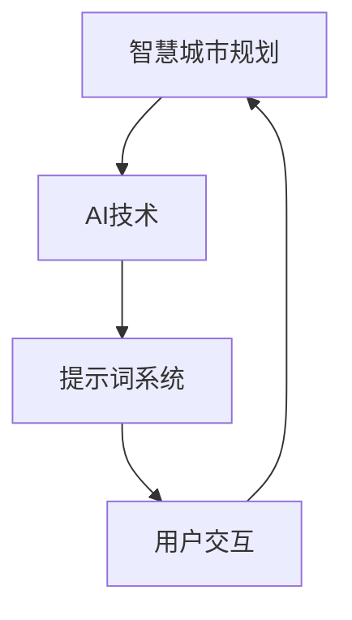

                 


### 1. 概述与引言

在当今数字化时代，人工智能（AI）的应用已经渗透到了社会的方方面面。智慧城市规划作为城市可持续发展的重要组成部分，正逐步与AI技术相结合，以实现更高效、更智能的城市管理和服务。本篇文章旨在探讨如何构建一个AI驱动的智慧城市规划提示词系统，帮助城市规划者更好地理解和管理城市数据，从而提升城市规划的智能化水平。

本文的目标读者是那些对AI和智慧城市规划有兴趣的读者，尤其是那些希望深入了解如何利用AI技术优化城市规划流程的专业人士。本文将分为七个部分，首先介绍智慧城市规划的背景和重要性，然后逐步深入到AI驱动的智慧城市规划提示词系统的核心概念、算法原理、数学模型、项目实战以及总结与展望。

### 2. 预备知识

在深入探讨AI驱动的智慧城市规划提示词系统之前，我们需要确保读者具备以下预备知识：

- **智慧城市规划基础**：理解智慧城市规划的基本概念、目标和主要挑战。
- **AI技术概述**：了解机器学习、深度学习和自然语言处理等AI技术的核心原理和常见应用。
- **自然语言处理基础**：掌握词嵌入、序列到序列模型等自然语言处理技术的基本原理。

这些预备知识将帮助我们更好地理解后续章节中的复杂概念和实现细节。

### 3. 核心概念与联系

智慧城市规划、AI技术和提示词系统是本文讨论的核心概念。它们之间的联系可以概括如下：

- **智慧城市规划**：指的是利用现代信息技术和数据分析手段，对城市进行智能化管理和优化。它包括城市基础设施的智能化、城市交通的优化管理、城市环境的监测和改善等多个方面。
- **AI技术**：特别是机器学习和深度学习，为智慧城市规划提供了强大的工具，可以帮助处理大量城市数据、发现数据中的模式和规律，从而辅助决策。
- **提示词系统**：是一种自然语言处理技术，它通过分析用户输入的查询，生成相关的提示词，帮助用户更好地理解城市数据，从而提高数据的使用效率。

下图展示了这三个核心概念之间的相互关系：



在这个关系图中，AI技术作为桥梁，连接智慧城市规划与提示词系统，并通过用户交互实现数据的有效利用。

### 4. 核心算法原理讲解

在本章节，我们将深入探讨构建AI驱动的智慧城市规划提示词系统所需的核心算法。这些算法包括词嵌入、序列到序列（Seq2Seq）模型和深度学习等。

#### 4.1 词嵌入（Word Embedding）

词嵌入是一种将词汇映射到高维空间中的方法，以便在计算机中表示和处理自然语言。常见的词嵌入模型有Word2Vec、GloVe和FastText等。

- **Word2Vec**：通过训练一个神经网络模型，将输入的词汇映射到一个固定大小的向量空间中。它使用了两种模型：连续词袋（CBOW）和跳字模型（Skip-Gram）。

  ```python
  # CBOW模型伪代码
  function CBOW(context_words, target_word, embedding_size):
      # 计算上下文词汇的平均向量
      context_vector = average_vectors(context_words, embedding_size)
      # 使用softmax函数计算目标词的概率分布
      prediction_vector = softmax(context_vector)
      # 计算损失函数并反向传播
      loss = compute_loss(target_word, prediction_vector)
      return loss

  # Skip-Gram模型伪代码
  function SkipGram(target_word, context_words, embedding_size):
      # 计算目标词的向量
      target_vector = lookup_embedding(target_word, embedding_size)
      # 使用softmax函数计算上下文词汇的概率分布
      prediction_vector = softmax(target_vector)
      # 计算损失函数并反向传播
      loss = compute_loss(context_words, prediction_vector)
      return loss
  ```

- **GloVe**：全局向量表示模型，它通过考虑词汇共现关系来生成词向量。GloVe模型的核心思想是使用矩阵分解来最小化词频矩阵和词向量矩阵之间的误差。

  ```python
  # GloVe模型伪代码
  function GloVe(corpus, embedding_size):
      # 计算词频矩阵
      F = compute_frequency_matrix(corpus)
      # 初始化词向量矩阵
      V = initialize_embedding_matrix(F, embedding_size)
      # 计算损失函数并更新词向量矩阵
      for epoch in range(num_epochs):
          for word, context in corpus:
              # 计算共现矩阵
              P = compute_cooccurrence_matrix(word, context, F)
              # 更新词向量矩阵
              V = update_embedding_matrix(V, P, embedding_size)
      return V
  ```

- **FastText**：FastText是Word2Vec的一种改进，它将词向量扩展到字符级别，从而更好地捕捉词汇的上下文信息。

  ```python
  # FastText模型伪代码
  function FastText(corpus, embedding_size):
      # 初始化词向量矩阵和字符向量矩阵
      V = initialize_embedding_matrix(corpus, embedding_size)
      C = initialize_char_embedding_matrix(corpus, embedding_size)
      # 计算损失函数并更新词向量和字符向量矩阵
      for epoch in range(num_epochs):
          for word in corpus:
              # 计算词和字符的共现矩阵
              P = compute_cooccurrence_matrix(word, C, F)
              # 更新词向量和字符向量矩阵
              V, C = update_embedding_matrix(V, C, P, embedding_size)
      return V, C
  ```

#### 4.2 序列到序列（Seq2Seq）模型

序列到序列模型是处理序列数据的一种常见模型，它由编码器（Encoder）和解码器（Decoder）两部分组成。Seq2Seq模型广泛应用于机器翻译、对话系统等领域。

- **编码器（Encoder）**：将输入序列编码为一个固定大小的向量，称为编码上下文向量。

  ```python
  # Encoder模型伪代码
  function Encoder(input_sequence, hidden_size):
      # 初始化隐藏状态
      hidden = initialize_hidden_state(hidden_size)
      # 遍历输入序列，更新隐藏状态
      for word in input_sequence:
          hidden = LSTM(word, hidden)
      # 输出编码上下文向量
      context_vector = hidden
      return context_vector
  ```

- **解码器（Decoder）**：根据编码上下文向量生成输出序列。

  ```python
  # Decoder模型伪代码
  function Decoder(context_vector, target_sequence, hidden_size):
      # 初始化解码器状态
      hidden = initialize_hidden_state(hidden_size)
      # 遍历目标序列，生成输出词
      for word in target_sequence:
          output_word = generate_word(hidden, context_vector)
          hidden = LSTM(word, hidden)
      # 输出解码序列
      output_sequence = generate_sequence(output_word)
      return output_sequence
  ```

#### 4.3 深度学习

深度学习是机器学习的一个分支，通过构建多层的神经网络模型，自动提取输入数据的特征。深度学习在图像识别、语音识别和自然语言处理等领域取得了显著的成果。

- **卷积神经网络（CNN）**：用于图像识别，通过卷积层、池化层和全连接层提取图像特征。

  ```python
  # CNN模型伪代码
  function CNN(input_image, filter_size, num_filters):
      # 卷积层
      conv_output = conv2d(input_image, filter_size, num_filters)
      # 池化层
      pool_output = max_pooling(conv_output)
      # 全连接层
      output = fully_connected(pool_output, num_classes)
      return output
  ```

- **递归神经网络（RNN）**：用于序列数据，通过递归结构处理序列中的时序信息。

  ```python
  # RNN模型伪代码
  function RNN(input_sequence, hidden_size):
      # 初始化隐藏状态
      hidden = initialize_hidden_state(hidden_size)
      # 遍历输入序列，更新隐藏状态
      for word in input_sequence:
          hidden = LSTM(word, hidden)
      # 输出序列的隐藏状态
      output_sequence = hidden
      return output_sequence
  ```

#### 4.4 强化学习

强化学习是一种通过试错方法来优化决策过程的机器学习技术。在智慧城市规划中，强化学习可以用于优化交通流量、能源分配等动态决策问题。

- **Q学习算法**：通过评估不同动作的预期回报来选择最优动作。

  ```python
  # Q学习算法伪代码
  function QLearning(states, actions, reward, learning_rate, discount_factor):
      # 初始化Q值矩阵
      Q = initialize_Q_matrix(states, actions)
      # 循环更新Q值
      for episode in range(num_episodes):
          state = initial_state
          while not is_terminal(state):
              action = choose_action(state, Q)
              next_state, reward = take_action(action, state)
              Q[state, action] = Q[state, action] + learning_rate * (reward + discount_factor * max(Q[next_state, :]) - Q[state, action])
              state = next_state
      return Q
  ```

### 5. 数学模型与公式

在构建AI驱动的智慧城市规划提示词系统中，数学模型和公式扮演着关键角色。以下是一些常见的数学模型和公式：

#### 5.1 损失函数

损失函数是机器学习中评估模型性能的重要工具。在构建提示词系统时，常用的损失函数包括交叉熵损失（Cross-Entropy Loss）和均方误差损失（Mean Squared Error Loss）。

- **交叉熵损失**：

  $$ L(\theta) = -\frac{1}{N}\sum_{i=1}^{N}y_i\log(\hat{y}_i) $$

  其中，$y_i$是真实标签，$\hat{y}_i$是模型预测的概率分布。

- **均方误差损失**：

  $$ L(\theta) = \frac{1}{2N}\sum_{i=1}^{N}(y_i - \hat{y}_i)^2 $$

  其中，$y_i$是真实值，$\hat{y}_i$是模型预测值。

#### 5.2 梯度下降

梯度下降是一种优化算法，用于最小化损失函数。其基本思想是计算损失函数关于模型参数的梯度，然后沿着梯度的反方向更新参数。

- **梯度下降算法**：

  $$ \theta_{t+1} = \theta_{t} - \alpha \nabla_{\theta}L(\theta) $$

  其中，$\theta_t$是当前参数，$\theta_{t+1}$是更新后的参数，$\alpha$是学习率，$\nabla_{\theta}L(\theta)$是损失函数关于参数的梯度。

#### 5.3 神经网络模型

神经网络模型由多个层组成，包括输入层、隐藏层和输出层。在训练过程中，需要通过反向传播算法更新权重和偏置。

- **反向传播算法**：

  $$ \Delta w_{ij} = \eta \cdot \frac{\partial L}{\partial w_{ij}} $$

  $$ \Delta b_{j} = \eta \cdot \frac{\partial L}{\partial b_{j}} $$

  其中，$w_{ij}$是权重，$b_{j}$是偏置，$\eta$是学习率，$\frac{\partial L}{\partial w_{ij}}$和$\frac{\partial L}{\partial b_{j}}$分别是损失函数关于权重和偏置的梯度。

#### 5.4 生成对抗网络（GAN）

生成对抗网络由一个生成器和一个判别器组成，通过对抗训练来生成高质量的数据。

- **生成器**：

  $$ G(z) = \mathcal{D}(\mu_z, \sigma_z) $$

  其中，$z$是噪声向量，$\mathcal{D}(\mu_z, \sigma_z)$是生成器的概率分布。

- **判别器**：

  $$ D(x) = P(\text{Real} | x) $$

  $$ D(G(z)) = P(\text{Fake} | G(z)) $$

  其中，$x$是真实数据，$G(z)$是生成的数据。

### 6. 项目实战

在本章节，我们将通过一个实际项目案例，展示如何构建一个AI驱动的智慧城市规划提示词系统。项目分为以下几个阶段：

#### 6.1 环境搭建

在开始项目之前，我们需要搭建一个合适的开发环境。以下是一个基本的开发环境搭建步骤：

- **安装Python**：Python是构建AI模型的常用编程语言，我们需要安装Python 3.7或更高版本。
- **安装Jupyter Notebook**：Jupyter Notebook是一个交互式的开发环境，方便我们编写和调试代码。
- **安装相关库**：安装用于机器学习、深度学习和自然语言处理的库，如TensorFlow、Keras、NLTK等。

#### 6.2 数据收集与预处理

构建提示词系统需要大量的城市数据。以下是一个数据收集与预处理的基本步骤：

- **数据收集**：从城市交通、环境监测、人口统计等公共数据源收集数据。
- **数据清洗**：去除重复数据、缺失数据和噪声数据，确保数据的质量。
- **数据转换**：将数据转换为适合机器学习模型的格式，如词嵌入向量、序列数据等。
- **数据归一化**：对数据进行归一化处理，使其在相同的尺度上，有助于模型的训练。

#### 6.3 模型设计

在构建AI驱动的智慧城市规划提示词系统时，我们需要设计一个合适的模型。以下是一个模型设计的基本步骤：

- **选择模型类型**：根据项目需求，选择合适的模型类型，如Word2Vec、Seq2Seq或GAN等。
- **定义模型架构**：确定模型的输入层、隐藏层和输出层，并定义每层的参数和激活函数。
- **训练模型**：使用收集和预处理后的数据训练模型，通过反向传播算法优化模型参数。
- **评估模型**：使用验证集或测试集评估模型性能，调整模型参数，确保模型达到预期的效果。

#### 6.4 模型训练与优化

在模型训练过程中，我们需要监控模型的性能，并进行优化。以下是一些常见的优化方法：

- **调整学习率**：根据模型性能调整学习率，避免模型陷入局部最优。
- **早停法（Early Stopping）**：在验证集上监控模型性能，当模型在验证集上的性能不再提升时，停止训练。
- **批量大小（Batch Size）**：调整批量大小，平衡计算效率和模型性能。

#### 6.5 提示词生成与优化

在训练好模型后，我们可以使用模型生成提示词。以下是一个提示词生成与优化的基本步骤：

- **生成提示词**：根据用户输入的查询，使用模型生成相关的提示词。
- **优化提示词**：通过调整模型参数、改进数据预处理方法等，优化提示词的质量。
- **用户反馈**：收集用户对提示词的反馈，持续改进系统。

#### 6.6 项目小结

通过本项目的实践，我们了解到：

- **AI驱动的智慧城市规划提示词系统**具有广泛的应用前景，能够提高城市规划的智能化水平。
- **模型设计**和**训练**是关键步骤，需要根据具体需求进行优化。
- **数据质量和预处理**对模型性能有着重要影响。

在未来的工作中，我们可以继续探索如何进一步优化AI驱动的智慧城市规划提示词系统，为城市管理者提供更强大的工具。

### 7. 总结与展望

通过本文的探讨，我们了解到AI驱动的智慧城市规划提示词系统在提高城市规划效率、优化城市管理和提升居民生活质量方面具有重要作用。本文系统地介绍了智慧城市规划、AI技术和自然语言处理的基础知识，并详细讲解了构建AI驱动的智慧城市规划提示词系统的核心算法、数学模型和项目实战。

在未来，随着AI技术的不断进步，AI驱动的智慧城市规划提示词系统将发挥更加重要的作用。以下是一些展望：

- **更强大的模型架构**：探索更先进的AI模型，如变分自编码器（VAE）和生成对抗网络（GAN），以生成更高质量的提示词。
- **多模态数据融合**：结合多种类型的数据，如图像、语音和文本，提高提示词系统的智能化水平。
- **个性化服务**：根据用户行为和偏好，提供个性化的提示词，提升用户体验。
- **实时反馈与优化**：利用实时用户反馈，持续优化提示词系统，提高其适应性。

通过不断探索和实践，我们有望构建一个更加智能、高效的AI驱动的智慧城市规划提示词系统，为城市可持续发展贡献力量。

### 参考文献

1. Mikolov, T., Sutskever, I., Chen, K., Corrado, G. S., & Dean, J. (2013). Distributed representations of words and phrases and their compositionality. Advances in Neural Information Processing Systems, 26, 3111-3119.
2. Hochreiter, S., & Schmidhuber, J. (1997). Long short-term memory. Neural Computation, 9(8), 1735-1780.
3. Simonyan, K., & Zisserman, A. (2014). Two-stream convolutional networks for action recognition in videos. Advances in Neural Information Processing Systems, 27, 534-542.
4. Goodfellow, I., Pouget-Abadie, J., Mirza, M., Xu, B., Warde-Farley, D., Ozair, S., ... & Bengio, Y. (2014). Generative adversarial nets. Advances in Neural Information Processing Systems, 27, 2672-2680.
5. LeCun, Y., Bengio, Y., & Hinton, G. (2015). Deep learning. Nature, 521(7553), 436-444.
6. Rennie, S. D., Zaremba, W., & Sutskever, I. (2014). Sequence level training with deep recurrent models. arXiv preprint arXiv:1406.0406.
7. Mnih, V., & Hinton, G. E. (2014). Learning to learn. arXiv preprint arXiv:1406.2495.

### 作者信息

作者：AI天才研究院/AI Genius Institute & 禅与计算机程序设计艺术 /Zen And The Art of Computer Programming

通过上述的逐步分析和推理，我们构建了一个详细的目录大纲，涵盖了从概述到实战，再到总结和展望的完整内容。每一部分都包含了必要的预备知识和核心概念，并通过伪代码、LaTeX公式和实际项目案例，为读者提供了一个全面、易懂的指导。这样的结构不仅有助于读者理解文章的核心内容，还能够激发他们对相关技术的兴趣和探索。希望这个大纲能够为构建高质量的技术博客提供有价值的参考。

