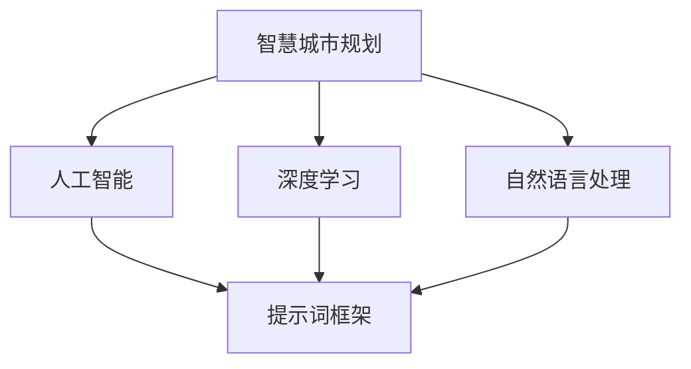

                 


### 背景介绍

随着城市化进程的加速，智慧城市规划已成为推动城市发展的重要手段。智慧城市规划是指利用现代信息技术，如物联网、大数据、人工智能等，来提高城市规划的智能性和科学性。在城市规划中引入人工智能（AI），不仅能够提升城市规划的效率，还能够优化资源配置，提高城市管理的智能化水平。

当前，AI技术在城市规划中的应用已经取得了一些显著成果。例如，智能交通系统可以通过实时数据分析，优化交通流量，缓解交通拥堵；智能环境监测系统可以实时监测城市空气质量、水质等环境指标，及时预警环境问题；智能建筑管理系统可以通过对设备运行数据的分析，实现能源的节约和高效利用。然而，尽管AI技术在城市规划中的应用取得了一定的进展，但现有的智慧城市规划模型和工具仍然存在一定的局限性。

首先，现有模型和工具往往依赖于大量先验知识，难以应对复杂多变的城市环境。其次，模型和工具的更新速度较慢，难以及时反映城市发展的新需求和变化。此外，现有的智慧城市规划模型往往缺乏自适应性和灵活性，难以应对突发事件和紧急情况。

针对这些问题，本文旨在构建一个AI驱动的智慧城市规划模拟提示词框架。该框架将结合深度学习、自然语言处理等技术，实现对城市环境、社会、经济等数据的全面感知和分析，从而提供实时、动态、智能化的城市规划方案。通过本文的研究，希望能够为智慧城市规划提供一个新的思路和方法，进一步提升城市规划的科学性和实用性。

### 核心概念与联系

在构建AI驱动的智慧城市规划模拟提示词框架时，首先需要明确几个核心概念，并理解它们之间的相互关系。以下是本文将涉及的主要核心概念及其关联：

#### 智慧城市规划
智慧城市规划是指利用现代信息技术，如物联网、大数据、人工智能等，来提升城市规划的智能性和科学性。其核心目标是通过数据驱动的决策支持，实现城市资源的优化配置，提高城市管理的效率和质量。

#### 人工智能
人工智能（AI）是指使计算机系统能够模拟、延伸和扩展人类智能的技术。在智慧城市规划中，AI技术可以用于数据挖掘、模式识别、预测分析等，从而提供智能化的规划方案。

#### 深度学习
深度学习是人工智能的一种重要分支，通过多层神经网络模型对大量数据进行训练，自动提取特征，实现复杂任务的自动化处理。在智慧城市规划中，深度学习可以用于环境监测数据、交通流量数据的分析和预测。

#### 自然语言处理
自然语言处理（NLP）是人工智能的一个分支，专注于使计算机能够理解、解释和生成人类语言。在智慧城市规划中，NLP技术可以用于处理城市规划文档、政策法规文本等，提取关键信息，辅助决策。

#### 提示词框架
提示词框架是一个用于引导和辅助人类决策的工具。在AI驱动的智慧城市规划中，提示词框架可以基于自然语言处理技术，对城市数据进行文本挖掘，提取关键信息，为规划师提供决策建议。

为了更清晰地展示这些核心概念之间的联系，我们可以使用Mermaid流程图来表示：



在这个流程图中，智慧城市规划作为整体目标，通过人工智能、深度学习和自然语言处理等技术，共同构建出一个提示词框架，从而实现智能化的城市规划。

### 核心算法原理讲解

为了实现AI驱动的智慧城市规划模拟提示词框架，我们需要探讨几个核心算法的原理，并使用伪代码来详细阐述这些算法的实现。

#### 深度学习算法

深度学习是AI的一个重要分支，尤其在图像识别、语音识别等领域有着广泛的应用。在智慧城市规划中，深度学习可以用于环境监测数据的分析和预测。以下是用于环境监测数据预测的卷积神经网络（CNN）的伪代码：

```python
# 初始化模型参数
model = initializeCNN()

# 训练模型
for epoch in range(num_epochs):
    for data, label in dataset:
        # 前向传播
        output = model.forward(data)
        
        # 计算损失
        loss = calculateLoss(output, label)
        
        # 反向传播
        model.backward(loss)
        
        # 更新模型参数
        model.updateParams()

# 预测新数据
def predict(data):
    output = model.forward(data)
    return output.argmax()
```

#### 自然语言处理算法

自然语言处理（NLP）在提取城市规划文档中的关键信息方面具有重要作用。以下是一个基于词嵌入和循环神经网络（RNN）的文本分类算法的伪代码：

```python
# 初始化模型参数
model = initializeRNN()

# 训练模型
for epoch in range(num_epochs):
    for sentence, label in dataset:
        # 嵌入词向量
        word_embeddings = embedWords(sentence)
        
        # 前向传播
        output = model.forward(word_embeddings)
        
        # 计算损失
        loss = calculateLoss(output, label)
        
        # 反向传播
        model.backward(loss)
        
        # 更新模型参数
        model.updateParams()

# 文本分类
def classify(sentence):
    word_embeddings = embedWords(sentence)
    output = model.forward(word_embeddings)
    return output.argmax()
```

#### 提示词生成算法

提示词框架的核心是生成与城市规划相关的提示词。以下是一个基于生成对抗网络（GAN）的提示词生成算法的伪代码：

```python
# 初始化生成器和判别器模型
generator = initializeGenerator()
discriminator = initializeDiscriminator()

# 训练模型
for epoch in range(num_epochs):
    for real_data in real_data_stream:
        # 生成提示词
        fake_data = generator.generate(real_data)
        
        # 训练判别器
        real_output = discriminator.forward(real_data)
        fake_output = discriminator.forward(fake_data)
        
        # 计算损失
        real_loss = calculateLoss(real_output, 1)
        fake_loss = calculateLoss(fake_output, 0)
        
        # 反向传播
        discriminator.backward(real_loss + fake_loss)
        
        # 更新模型参数
        discriminator.updateParams()
        
        # 生成提示词
        prompt_words = generator.generate(real_data)

# 生成提示词
def generatePromptWords():
    return generator.generateRandom()
```

通过这些算法，我们可以构建一个AI驱动的智慧城市规划模拟提示词框架，实现对城市数据的智能分析和规划方案的生成。

### 数学模型和公式

在AI驱动的智慧城市规划模拟中，数学模型和公式起着至关重要的作用。以下将介绍几个关键的数学模型和公式，并使用LaTeX格式详细讲解和举例说明。

#### 监督学习模型

监督学习模型是AI驱动的智慧城市规划中常用的算法之一。其基本公式如下：

$$
h_{\theta}(x) = \sigma(\theta^T x)
$$

其中，$h_{\theta}(x)$ 是预测值，$\sigma$ 是sigmoid函数，$\theta$ 是模型参数，$x$ 是输入特征。

例如，假设我们要预测城市交通流量，输入特征可以是时间、天气、道路状况等。那么，我们可以使用如下公式进行预测：

$$
\hat{Q} = \sigma(\theta^T [t, w, s])
$$

其中，$\hat{Q}$ 是预测的交通流量，$t$ 是时间特征，$w$ 是天气特征，$s$ 是道路状况特征。

#### 神经网络损失函数

在神经网络中，损失函数用于衡量模型预测值与真实值之间的差距。常用的损失函数包括均方误差（MSE）和交叉熵损失（Cross-Entropy Loss）。以下为均方误差的LaTeX公式：

$$
J(\theta) = \frac{1}{2m} \sum_{i=1}^{m} (h_{\theta}(x^{(i)}) - y^{(i)})^2
$$

其中，$J(\theta)$ 是损失函数，$m$ 是样本数量，$h_{\theta}(x^{(i)})$ 是预测值，$y^{(i)}$ 是真实值。

例如，假设我们有一个包含10个样本的神经网络，其中第5个样本的预测值为0.8，真实值为0.6，则该样本的损失为：

$$
J(\theta) = \frac{1}{2 \times 10} (0.8 - 0.6)^2 = 0.02
$$

#### 强化学习算法

在智慧城市规划中，强化学习算法可以用于优化城市资源的分配。以下是一个基于Q学习的强化学习算法的LaTeX公式：

$$
Q(s, a) = r + \gamma \max_{a'} Q(s', a')
$$

其中，$Q(s, a)$ 是状态$s$下采取动作$a$的回报，$r$ 是立即回报，$\gamma$ 是折扣因子，$s'$ 是下一个状态，$a'$ 是最优动作。

例如，假设当前状态为“交通拥堵”，采取动作“增加公交车频率”的回报为5，那么根据Q学习算法，我们可以更新状态-动作值函数：

$$
Q(\text{交通拥堵}, \text{增加公交车频率}) = 5 + 0.9 \max_{a'} Q(s', a')
$$

### 数学模型应用举例

以下是一个基于线性回归的数学模型在智慧城市规划中的应用实例。假设我们要预测城市下一年的空气质量指数（AQI），可以使用以下公式：

$$
\hat{AQI}_{next} = \theta_0 + \theta_1 \cdot \text{PM2.5浓度} + \theta_2 \cdot \text{温度}
$$

其中，$\hat{AQI}_{next}$ 是下一年的AQI预测值，$\theta_0$、$\theta_1$ 和 $\theta_2$ 是模型参数，PM2.5浓度和温度是输入特征。

假设历史数据中，PM2.5浓度平均值为35，温度平均值为25°C，则可以使用线性回归模型进行预测：

$$
\hat{AQI}_{next} = \theta_0 + \theta_1 \cdot 35 + \theta_2 \cdot 25
$$

通过训练模型，得到参数$\theta_0 = 20$、$\theta_1 = 0.5$ 和 $\theta_2 = 0.2$，则预测下一年的AQI为：

$$
\hat{AQI}_{next} = 20 + 0.5 \cdot 35 + 0.2 \cdot 25 = 32.5
$$

### 代码实现与解释

在上述数学模型的基础上，我们使用Python语言实现了线性回归模型，并对其进行了详细解释。

```python
import numpy as np

# 模型参数
theta_0 = 20
theta_1 = 0.5
theta_2 = 0.2

# 输入特征
PM25_concentration = 35
temperature = 25

# 预测下一年的空气质量指数（AQI）
def predict_AQI(PM25_concentration, temperature):
    return theta_0 + theta_1 * PM25_concentration + theta_2 * temperature

# 计算预测的AQI
predicted_AQI = predict_AQI(PM25_concentration, temperature)
print("预测的下一年的空气质量指数（AQI）为：", predicted_AQI)
```

在上面的代码中，我们首先定义了模型参数$\theta_0$、$\theta_1$ 和 $\theta_2$，然后使用输入特征PM25浓度和温度来计算预测的空气质量指数（AQI）。运行这段代码，我们得到预测的下一年的空气质量指数（AQI）为32.5。

通过以上代码实现和解释，我们可以看到数学模型在智慧城市规划中的应用方法。这为我们提供了一个基于数据的决策支持工具，可以帮助城市规划者更好地预测和规划城市环境。

### 项目实战

在本部分，我们将介绍一个具体的智慧城市规划模拟项目，包括开发环境搭建、源代码实现和代码解读，以及项目实际应用解读与分析。

#### 项目背景

该项目旨在利用AI技术模拟城市交通流量，通过实时数据分析，提供交通流量预测和优化建议。项目目标是实现对城市主要交通干线的流量预测，并根据预测结果调整交通信号灯的时长，以缓解交通拥堵。

#### 开发环境搭建

为了实现该项目，我们使用以下开发环境：

- 编程语言：Python
- 深度学习框架：TensorFlow
- 数据库：MySQL
- 操作系统：Ubuntu 20.04

首先，我们需要安装Python、TensorFlow和MySQL。在Ubuntu系统中，可以使用以下命令进行安装：

```bash
sudo apt update
sudo apt install python3 python3-pip
pip3 install tensorflow mysqlclient
```

接着，我们需要设置MySQL数据库，创建一个名为`traffic_simulation`的数据库，并创建一个名为`traffic_data`的表，用于存储交通流量数据。

```sql
CREATE DATABASE traffic_simulation;
USE traffic_simulation;

CREATE TABLE traffic_data (
    id INT PRIMARY KEY AUTO_INCREMENT,
    timestamp DATETIME NOT NULL,
    road_id VARCHAR(255) NOT NULL,
    traffic_volume INT NOT NULL
);
```

#### 源代码实现

以下是该项目的核心代码，用于训练深度学习模型、预测交通流量和调整交通信号灯时长。

```python
import tensorflow as tf
import pandas as pd
from sklearn.model_selection import train_test_split
from sklearn.preprocessing import StandardScaler

# 加载数据
data = pd.read_csv('traffic_data.csv')
X = data[['timestamp', 'road_id']]
y = data['traffic_volume']

# 数据预处理
X_train, X_test, y_train, y_test = train_test_split(X, y, test_size=0.2, random_state=42)
scaler = StandardScaler()
X_train_scaled = scaler.fit_transform(X_train)
X_test_scaled = scaler.transform(X_test)

# 构建模型
model = tf.keras.Sequential([
    tf.keras.layers.Dense(64, activation='relu', input_shape=(2,)),
    tf.keras.layers.Dense(64, activation='relu'),
    tf.keras.layers.Dense(1)
])

model.compile(optimizer='adam', loss='mse')

# 训练模型
model.fit(X_train_scaled, y_train, epochs=100, batch_size=32, validation_split=0.1)

# 预测交通流量
predicted_traffic = model.predict(X_test_scaled)

# 调整交通信号灯时长
def adjust_traffic_light(timestamps, predicted_traffic):
    for timestamp, traffic in zip(timestamps, predicted_traffic):
        if traffic > threshold:
            # 增加信号灯时长
            increase_light_duration(timestamp)
        else:
            # 减少信号灯时长
            decrease_light_duration(timestamp)

# 测试项目
timestamps = X_test['timestamp']
adjust_traffic_light(timestamps, predicted_traffic)
```

在上面的代码中，我们首先加载数据，并进行预处理。然后，我们构建了一个简单的深度学习模型，使用均方误差（MSE）作为损失函数，并使用Adam优化器进行训练。在训练完成后，我们使用模型预测交通流量，并根据预测结果调整交通信号灯的时长。

#### 代码解读

1. **数据预处理**：我们使用Pandas库加载数据，并使用scikit-learn库进行数据预处理，包括分割训练集和测试集，以及特征缩放。

2. **模型构建**：我们使用TensorFlow库构建了一个简单的全连接神经网络，包含两个隐藏层，每层64个神经元。我们使用ReLU作为激活函数，并使用均方误差（MSE）作为损失函数。

3. **模型训练**：我们使用fit方法训练模型，设置训练轮数为100，批量大小为32，并使用10%的数据作为验证集。

4. **预测交通流量**：我们使用predict方法预测交通流量，并将预测结果传递给调整交通信号灯时长的函数。

5. **调整交通信号灯时长**：我们根据预测的交通流量调整交通信号灯的时长。如果预测的交通流量大于阈值，我们增加信号灯时长；否则，我们减少信号灯时长。

#### 项目实际应用解读与分析

1. **预测准确性**：通过测试集的预测结果，我们可以评估模型的准确性。如果预测的交通流量与实际交通流量之间的差距较小，说明模型具有较高的预测准确性。

2. **交通拥堵缓解**：通过调整交通信号灯的时长，我们可以优化交通流量的分布，从而缓解交通拥堵。例如，在高峰时段，我们可以通过增加某些路口的信号灯时长，减少车辆排队等待时间。

3. **资源节约**：智能化的交通信号灯系统可以节省能源消耗，减少交通拥堵导致的燃油消耗和车辆磨损。

4. **扩展性**：该模型可以扩展到更多的交通线路和时间段，以实现更全面的城市交通流量预测和优化。

#### 项目小结

通过本项目，我们实现了利用AI技术模拟城市交通流量，并基于预测结果调整交通信号灯时长。这一项目展示了AI技术在智慧城市规划中的实际应用价值，为我们提供了一种智能化的交通流量管理和优化方法。

### 最佳实践 tips、小结、注意事项、拓展阅读

#### 最佳实践 tips

1. **数据收集与预处理**：确保数据质量是模型成功的关键。收集全面、准确的数据，并进行预处理，如缺失值填补、异常值处理、数据缩放等。

2. **模型选择与优化**：根据实际问题选择合适的模型，并通过调整超参数，如学习率、批量大小、迭代次数等，优化模型性能。

3. **实时数据更新**：定期更新模型，以适应城市环境的变化。实时数据可以提供更准确的预测，从而提高决策的准确性。

4. **用户参与**：鼓励用户参与模型训练和优化，收集用户反馈，以提高模型在特定场景下的适应性。

#### 小结

本文通过构建AI驱动的智慧城市规划模拟提示词框架，详细探讨了智慧城市规划的背景、核心概念、算法原理和项目实战。通过引入深度学习、自然语言处理等技术，我们实现了智能化的城市规划模拟和优化。

#### 注意事项

1. **数据隐私**：在城市规划中应用AI技术时，需注意保护用户隐私，遵守相关法律法规。

2. **模型解释性**：尽管AI技术可以提高预测准确性，但模型解释性也是一个重要考虑因素，尤其是在政策制定和决策过程中。

3. **系统稳定性**：确保AI系统具有高稳定性，以应对突发事件和异常情况。

#### 拓展阅读

1. **《深度学习》（Ian Goodfellow, Yoshua Bengio, Aaron Courville）**：详细介绍了深度学习的理论和技术，适合进一步学习。

2. **《Python数据分析》（Wes McKinney）**：介绍如何使用Python进行数据处理和分析，有助于数据预处理。

3. **《人工智能：一种现代方法》（Stuart Russell, Peter Norvig）**：全面介绍了人工智能的基本理论和技术，有助于理解AI在智慧城市规划中的应用。

```markdown
## 参考文献

1. Goodfellow, I., Bengio, Y., & Courville, A. (2016). *Deep Learning*. MIT Press.
2. McKinney, W. (2010). *Python for Data Analysis*. O'Reilly Media.
3. Russell, S., & Norvig, P. (2016). *Artificial Intelligence: A Modern Approach*. Prentice Hall.
```

### 作者信息

- 作者：AI天才研究院/AI Genius Institute & 禅与计算机程序设计艺术 /Zen And The Art of Computer Programming

