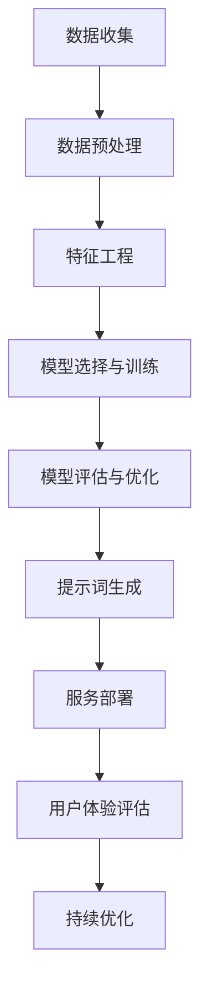

                 

### 文章标题

# 《构建AI驱动的智慧政务提示词框架》

### 文章关键词

- AI
- 智慧政务
- 提示词框架
- 数据预处理
- 模型优化
- 安全性
- 隐私保护

### 文章摘要

本文旨在探讨构建AI驱动的智慧政务提示词框架，从而提升政务服务的智能化水平。文章首先介绍了AI在智慧政务中的应用现状，并阐述了AI驱动的智慧政务提示词框架的设计原则和核心模块。接着，详细讨论了数据收集与预处理、特征工程、模型选择与训练、模型评估与优化等关键技术。随后，通过实际案例展示了智慧政务提示词的应用场景，并探讨了安全性与隐私保护的重要性。最后，文章总结了项目的开发环境搭建、源代码实现及未来研究方向。通过本文，读者可以全面了解并掌握构建AI驱动的智慧政务提示词框架的方法和技巧。

## 第1章 AI在智慧政务中的应用

### 1.1 AI在政务服务中的现状

近年来，随着人工智能技术的迅速发展，AI在政务服务中的应用越来越广泛。智慧政务已经成为各国政府提升服务效率、优化治理能力的重要手段。AI技术在政务服务中的主要应用场景包括以下几个方面：

1. **智能问答与咨询服务**：利用自然语言处理（NLP）技术，构建智能问答系统，为市民提供24小时在线咨询服务。例如，通过智能聊天机器人，市民可以轻松获取交通、医疗、教育等领域的相关信息。

2. **数据挖掘与分析**：通过对海量政务数据的挖掘和分析，政府可以更好地了解社会需求，优化政策制定和执行。例如，通过对公共卫生数据的分析，及时发现疫情隐患，为公共卫生决策提供支持。

3. **智能决策支持**：利用机器学习技术，为政府决策提供数据驱动、基于证据的参考。例如，通过分析历史数据和实时数据，为交通管理、城市规划等提供科学依据。

4. **电子政务服务**：通过AI技术，简化政务服务流程，实现政务服务的智能化、便捷化。例如，通过智能审批系统，减少审批环节，提高审批效率。

### 1.2 AI驱动的智慧政务提示词的优势

AI驱动的智慧政务提示词框架在政务服务中具有显著的优势：

1. **提高用户体验**：通过智能提示词，政务服务可以更加个性化、精准化，提高市民的满意度。

2. **降低运营成本**：利用AI技术，政府可以减少人力投入，降低运营成本。例如，通过智能问答系统，减少人工客服的工作量。

3. **提升工作效率**：智能提示词可以实时响应用户需求，减少等待时间，提高工作效率。

4. **增强治理能力**：通过分析政务数据，政府可以更好地了解社会状况，优化治理策略。

### 1.3 智慧政务提示词的定义与作用

智慧政务提示词是指基于AI技术，为政务服务提供的实时、个性化的提示信息。这些提示词可以包括：

1. **政策解读**：为市民提供最新政策的解读和指导，帮助市民更好地理解和遵守政策。

2. **服务指南**：为市民提供各类政务服务的办理流程、所需材料等详细信息。

3. **预警信息**：根据数据分析，及时向市民发布疫情、自然灾害等预警信息。

4. **个性化推荐**：根据市民的偏好和历史行为，为其推荐合适的政务服务。

智慧政务提示词在政务服务中的作用：

1. **提高服务质量**：通过提供及时、准确的提示信息，提高政务服务的质量和效率。

2. **增强用户体验**：为市民提供更加个性化、人性化的服务，提升用户体验。

3. **优化政务流程**：通过实时数据分析和智能提示，优化政务服务流程，减少市民的等待时间和工作负担。

## Mermaid流程图

下面是智慧政务提示词框架的Mermaid流程图：



### 1.4 本章小结

本章介绍了AI在智慧政务中的应用现状、AI驱动的智慧政务提示词框架的优势以及智慧政务提示词的定义与作用。通过本章的学习，读者可以了解到智慧政务提示词框架的基本架构和重要性。接下来，我们将进一步探讨智慧政务提示词框架的具体设计方法和技术细节。

## 第2章 AI驱动的智慧政务提示词框架设计

### 2.1 框架设计原则

设计AI驱动的智慧政务提示词框架时，应遵循以下原则：

1. **开放性**：框架应具有良好的开放性，支持多种数据源接入和算法集成，便于扩展和升级。

2. **灵活性**：框架应具备灵活性，能够根据不同政务场景的需求，调整和优化提示词生成策略。

3. **高效性**：框架应具备高效的数据处理能力和模型训练速度，确保实时响应和准确提示。

4. **安全性**：框架应确保数据安全和用户隐私，遵循相关法律法规，采取有效措施防止数据泄露和滥用。

5. **可解释性**：框架应提供一定程度的可解释性，帮助政务人员理解提示词生成的原理和依据。

### 2.2 框架核心模块

AI驱动的智慧政务提示词框架主要包括以下核心模块：

1. **数据收集模块**：负责收集政务相关的各种数据，如政策文本、服务指南、历史问答数据等。

2. **数据预处理模块**：对收集到的数据进行清洗、格式化等处理，确保数据质量。

3. **特征工程模块**：提取数据中的关键特征，为模型训练提供基础。

4. **模型选择与训练模块**：选择合适的模型，对特征数据进行训练，生成提示词生成模型。

5. **提示词生成模块**：根据用户输入或政务场景，实时生成个性化的提示词。

6. **服务部署模块**：将提示词生成模型部署到政务服务系统中，实现提示词的实时推送。

7. **用户体验评估模块**：收集用户反馈，评估提示词生成的效果，为持续优化提供依据。

### 2.3 提示词生成算法

提示词生成算法是智慧政务提示词框架的核心，常用的算法包括：

1. **基于规则的算法**：通过预先定义的规则库，根据用户输入或场景信息，生成相应的提示词。

2. **基于机器学习的算法**：利用自然语言处理技术，从海量数据中学习生成提示词的规律，生成个性化的提示词。

3. **基于深度学习的算法**：如循环神经网络（RNN）、长短期记忆网络（LSTM）、注意力机制等，通过学习大量的文本数据，生成高质量的提示词。

### 2.4 框架实现的关键技术

框架实现的关键技术包括：

1. **分布式数据处理**：采用分布式计算框架（如Hadoop、Spark）处理海量数据，提高数据处理效率。

2. **模型优化与调参**：通过调整模型参数和优化算法，提高模型性能和提示词生成效果。

3. **实时数据流处理**：利用实时数据流处理技术（如Apache Flink、Apache Storm），实现实时数据分析和提示词生成。

4. **安全性与隐私保护**：采用加密、访问控制等技术，确保数据安全和用户隐私。

### 2.5 本章小结

本章详细介绍了AI驱动的智慧政务提示词框架的设计原则、核心模块和关键算法。通过本章的学习，读者可以全面了解智慧政务提示词框架的基本架构和实现方法，为后续章节的技术讨论打下基础。

## 第3章 数据收集与预处理

### 3.1 数据来源

智慧政务提示词框架的数据来源主要包括以下几个方面：

1. **政务数据**：包括政策文件、法规条文、政府公告等，这些数据是构建提示词的基础。

2. **服务数据**：包括政务服务指南、办理流程、所需材料等，为用户提供具体的办事指引。

3. **历史问答数据**：包括市民与政府客服的交流记录，用于训练问答模型，生成智能问答提示词。

4. **用户行为数据**：包括市民在政务服务系统上的操作记录、浏览历史等，用于个性化推荐。

### 3.2 数据预处理方法

数据预处理是构建高质量提示词的关键步骤，主要包括以下方法：

1. **数据清洗**：去除数据中的噪声和异常值，保证数据质量。

2. **文本预处理**：对文本数据执行分词、去停用词、词性标注等操作，为后续特征工程做好准备。

3. **数据格式化**：统一数据格式，方便后续处理和分析。

4. **数据增强**：通过数据扩增技术（如数据扩充、数据变换等），提高数据多样性和模型泛化能力。

### 3.3 数据质量评估

数据质量评估是确保数据可用性的重要环节，主要包括以下指标：

1. **完整性**：评估数据是否完整，是否存在缺失值或异常值。

2. **准确性**：评估数据是否准确，是否存在错误或误导性信息。

3. **一致性**：评估数据在不同来源之间是否保持一致。

4. **时效性**：评估数据是否具有时效性，是否符合当前政务需求。

### 3.4 数据预处理案例

下面是一个简单的数据预处理案例，使用Python进行文本预处理：

```python
import pandas as pd
from sklearn.model_selection import train_test_split
from sklearn.feature_extraction.text import CountVectorizer

# 加载数据
data = pd.read_csv('goverment_data.csv')

# 数据清洗
data.dropna(inplace=True)

# 分词与去停用词
import jieba
stopwords = ['的', '了', '是', '在']
text = data['text']
processed_text = [' '.join([word for word in jieba.cut(text) if word not in stopwords]) for text in text]

# 数据格式化
data['processed_text'] = processed_text

# 数据增强
# 这里可以采用数据扩增技术，例如随机替换词语、添加噪声等

# 数据切分
X_train, X_test, y_train, y_test = train_test_split(processed_text, data['label'], test_size=0.2, random_state=42)

# 特征提取
vectorizer = CountVectorizer()
X_train_vectorized = vectorizer.fit_transform(X_train)
X_test_vectorized = vectorizer.transform(X_test)

# 数据质量评估
# 可以使用相关评估指标，例如准确性、精确率、召回率等
```

### 3.5 本章小结

本章详细介绍了数据收集与预处理的方法和关键技术，包括数据来源、数据预处理方法、数据质量评估等。通过本章的学习，读者可以掌握如何有效地收集和预处理政务数据，为后续特征工程和模型训练打下基础。

## 第4章 特征工程

### 4.1 特征提取方法

特征提取是构建AI驱动的智慧政务提示词框架的重要环节，直接影响模型的性能。以下是一些常用的特征提取方法：

1. **词袋模型（Bag of Words, BoW）**：将文本转换为词汇的集合，每个词汇表示一个特征。常用的实现方法是使用CountVectorizer类。

2. **TF-IDF（Term Frequency-Inverse Document Frequency）**：考虑词汇在文档中的重要程度，通过计算词频与逆文档频率的乘积来表示特征。Python中的TfidfVectorizer类可以方便地实现这一方法。

3. **词嵌入（Word Embedding）**：将词汇映射到高维向量空间中，用于捕捉词汇的语义关系。常用的词嵌入模型包括Word2Vec、GloVe等。Python中的gensim库提供了这些模型的实现。

4. **n-gram特征**：将连续的n个词作为特征，用于捕捉短文本中的词汇序列信息。例如，使用n-gram模型可以捕获“智慧政务”和“政务服务”之间的关联。

5. **深度特征提取**：利用深度学习模型（如CNN、RNN）提取文本中的深层特征。这些特征可以更好地捕捉文本的语义信息，提升模型性能。

### 4.2 特征选择方法

特征选择是减少特征维度、提高模型性能的重要步骤。以下是一些常用的特征选择方法：

1. **基于信息的特征选择**：通过评估特征对分类任务的信息贡献，选择信息量较大的特征。常用的方法包括信息增益（IG）、信息增益率（Gini系数）等。

2. **基于模型的特征选择**：通过训练模型并评估特征的重要性，选择对模型性能有显著影响的特征。例如，可以使用LASSO回归、随机森林等模型进行特征选择。

3. **基于集合的特征选择**：通过组合多个特征选择方法，构建特征选择模型。常见的方法包括贝叶斯网络、支持向量机（SVM）等。

4. **递归特征消除（RFE）**：通过递归地消除不重要的特征，逐步缩小特征集。这种方法需要预先选择一个基准模型，并评估特征对模型的重要性。

### 4.3 特征表示方法

特征表示是将原始特征转换为更适合模型训练的形式。以下是一些常用的特征表示方法：

1. **二值特征表示**：将特征转换为0和1的向量，适用于词袋模型和TF-IDF特征。

2. **稀疏特征表示**：将特征表示为稀疏矩阵，以节省存储空间和提高计算效率。这种表示方法适用于词袋模型和词嵌入特征。

3. **稀疏编码（Sparse Coding）**：通过最小化重建误差，将特征映射到稀疏表示空间。这种表示方法有助于捕捉特征的本质信息。

4. **分布式特征表示**：将特征表示为分布式向量，以捕捉特征之间的复杂关系。这种表示方法常用于深度学习和图神经网络。

### 4.4 特征工程实战

以下是一个简单的特征工程实战案例，使用Python进行词袋模型和TF-IDF特征提取：

```python
import pandas as pd
from sklearn.feature_extraction.text import CountVectorizer, TfidfVectorizer

# 加载数据
data = pd.read_csv('goverment_data.csv')

# 使用词袋模型提取特征
vectorizer = CountVectorizer()
X_bow = vectorizer.fit_transform(data['text'])

# 使用TF-IDF提取特征
tfidf_vectorizer = TfidfVectorizer()
X_tfidf = tfidf_vectorizer.fit_transform(data['text'])

# 特征选择
# 这里可以采用基于信息的特征选择方法，选择信息量较高的特征

# 特征表示
# 这里可以使用二值特征表示或稀疏特征表示，根据模型需求进行选择
```

### 4.5 本章小结

本章详细介绍了特征提取、特征选择和特征表示的方法，包括词袋模型、TF-IDF、词嵌入等特征提取方法，以及基于信息的、基于模型的、基于集合的特征选择方法。通过本章的学习，读者可以掌握如何有效地进行特征工程，为构建高质量的AI驱动的智慧政务提示词框架打下基础。

## 第5章 模型选择与训练

### 5.1 深度学习模型

深度学习模型在自然语言处理领域表现出色，适用于构建AI驱动的智慧政务提示词框架。以下是一些常用的深度学习模型：

1. **循环神经网络（RNN）**：RNN能够处理序列数据，适用于生成与输入序列相关的提示词。其基本结构如下：

   ```mermaid
   graph TB
   A[输入序列] --> B[RNN单元]
   B --> C[输出序列]
   ```

2. **长短期记忆网络（LSTM）**：LSTM是RNN的一种变体，能够有效地解决长期依赖问题。其基本结构如下：

   ```mermaid
   graph TB
   A[输入序列] --> B[LSTM单元]
   B --> C[输出序列]
   ```

3. **门控循环单元（GRU）**：GRU是LSTM的简化版，计算过程更加高效。其基本结构如下：

   ```mermaid
   graph TB
   A[输入序列] --> B[GRU单元]
   B --> C[输出序列]
   ```

4. **Transformer模型**：Transformer模型采用自注意力机制，能够捕捉长距离依赖关系，适用于生成高质量的提示词。其基本结构如下：

   ```mermaid
   graph TB
   A[输入序列] --> B[编码器]
   B --> C[解码器]
   C --> D[输出序列]
   ```

### 5.2 常见模型对比

以下是对常见深度学习模型（RNN、LSTM、GRU、Transformer）的对比：

1. **计算复杂度**：Transformer模型的计算复杂度较高，但能更好地捕捉长距离依赖关系。RNN、LSTM和GRU的计算复杂度较低，但容易受到短期依赖的影响。

2. **训练时间**：Transformer模型需要更长的训练时间，但能获得更好的模型性能。RNN、LSTM和GRU的训练时间较短，但性能相对较低。

3. **记忆能力**：LSTM和GRU具有较好的记忆能力，能够处理长期依赖问题。RNN容易受到梯度消失和梯度爆炸的影响，处理长期依赖能力较差。

4. **应用场景**：Transformer模型适用于处理长文本和复杂序列任务，如机器翻译、文本生成等。RNN、LSTM和GRU适用于处理短文本和简单序列任务。

### 5.3 模型训练过程

模型训练是构建AI驱动的智慧政务提示词框架的关键步骤，主要包括以下步骤：

1. **数据准备**：将数据集分为训练集、验证集和测试集，用于模型训练、验证和评估。

2. **模型初始化**：初始化模型参数，可以选择随机初始化或预训练模型初始化。

3. **损失函数设计**：选择合适的损失函数，如交叉熵损失函数，用于评估模型预测与真实标签之间的差距。

4. **优化器选择**：选择合适的优化器，如Adam优化器，用于更新模型参数。

5. **模型训练**：通过反向传播算法，不断迭代训练模型，最小化损失函数。

6. **模型评估**：使用验证集评估模型性能，选择性能最佳的模型。

7. **模型调参**：根据模型评估结果，调整模型参数，如学习率、批量大小等，以提升模型性能。

8. **模型部署**：将训练好的模型部署到实际场景中，实现提示词生成功能。

### 5.4 模型训练案例

以下是一个简单的模型训练案例，使用Python和TensorFlow实现：

```python
import tensorflow as tf
from tensorflow.keras.preprocessing.sequence import pad_sequences
from tensorflow.keras.layers import Embedding, LSTM, Dense
from tensorflow.keras.models import Sequential

# 加载和处理数据
# 这里假设已经预处理好的数据为X和y
# X：输入序列
# y：真实标签

# 数据预处理
max_sequence_length = 100
X_pad = pad_sequences(X, maxlen=max_sequence_length)
y_train, y_val = train_test_split(y, test_size=0.2, random_state=42)

# 模型初始化
model = Sequential()
model.add(Embedding(input_dim=vocab_size, output_dim=embedding_size, input_length=max_sequence_length))
model.add(LSTM(units=128, dropout=0.2, recurrent_dropout=0.2))
model.add(Dense(units=1, activation='sigmoid'))

# 损失函数和优化器
model.compile(optimizer='adam', loss='binary_crossentropy', metrics=['accuracy'])

# 模型训练
model.fit(X_pad, y_train, epochs=10, batch_size=64, validation_data=(X_pad_val, y_val))

# 模型评估
loss, accuracy = model.evaluate(X_pad_val, y_val)
print('Validation Loss:', loss)
print('Validation Accuracy:', accuracy)
```

### 5.5 本章小结

本章详细介绍了深度学习模型的选择与训练过程，包括RNN、LSTM、GRU和Transformer等常见模型，以及模型训练的关键步骤和调参技巧。通过本章的学习，读者可以掌握如何有效地选择和训练深度学习模型，为构建高质量的AI驱动的智慧政务提示词框架提供技术支持。

## 第6章 模型评估与优化

### 6.1 评估指标

在构建AI驱动的智慧政务提示词框架时，评估模型的性能至关重要。常用的评估指标包括：

1. **准确率（Accuracy）**：准确率是模型预测正确的样本数占总样本数的比例。其计算公式如下：

   $$
   \text{Accuracy} = \frac{\text{预测正确数}}{\text{总样本数}}
   $$

   准确率能够反映模型的整体性能，但在类别不平衡的情况下，其评估效果较差。

2. **精确率（Precision）**：精确率是模型预测为正样本且实际为正样本的样本数与预测为正样本的样本数之比。其计算公式如下：

   $$
   \text{Precision} = \frac{\text{预测正确数}}{\text{预测为正样本的样本数}}
   $$

   精确率能够反映模型在预测正样本时的准确程度，但在假正样本较多时，评估效果较差。

3. **召回率（Recall）**：召回率是模型预测为正样本且实际为正样本的样本数与实际为正样本的样本数之比。其计算公式如下：

   $$
   \text{Recall} = \frac{\text{预测正确数}}{\text{实际为正样本的样本数}}
   $$

   召回率能够反映模型在预测正样本时的全面性，但在假负样本较多时，评估效果较差。

4. **F1值（F1 Score）**：F1值是精确率和召回率的调和平均，能够综合评估模型的性能。其计算公式如下：

   $$
   \text{F1 Score} = 2 \times \frac{\text{Precision} \times \text{Recall}}{\text{Precision} + \text{Recall}}
   $$

   F1值能够平衡精确率和召回率，适用于评估类别不平衡的情况。

5. **ROC曲线和AUC值（Receiver Operating Characteristic Curve and AUC）**：ROC曲线和AUC值是用于评估二分类模型性能的重要指标。ROC曲线反映了模型在不同阈值下的性能，AUC值是ROC曲线下面积，能够衡量模型分类能力。AUC值越接近1，表示模型分类能力越强。

### 6.2 模型调参

模型调参是提升模型性能的关键步骤，主要包括以下方法：

1. **网格搜索（Grid Search）**：网格搜索通过遍历给定的参数组合，选择最优参数。其基本思路如下：

   - 定义参数空间，包括学习率、批量大小、隐藏层单元数等。
   - 遍历参数空间，训练模型，并计算评估指标。
   - 选择评估指标最优的参数组合。

2. **贝叶斯优化（Bayesian Optimization）**：贝叶斯优化是一种基于概率模型的优化方法，能够高效地寻找最优参数。其基本思路如下：

   - 初始化概率模型，如高斯过程（Gaussian Process）。
   - 在参数空间中采样，计算模型性能。
   - 更新概率模型，并选择下一步采样点。
   - 重复采样和更新过程，直到找到最优参数。

3. **随机搜索（Random Search）**：随机搜索通过随机采样参数空间，选择最优参数。其基本思路如下：

   - 定义参数空间，包括学习率、批量大小、隐藏层单元数等。
   - 从参数空间中随机采样参数组合，训练模型，并计算评估指标。
   - 选择评估指标最优的参数组合。

4. **迁移学习（Transfer Learning）**：迁移学习利用预训练模型，在目标任务上进行微调，以提升模型性能。其基本思路如下：

   - 选择一个预训练模型，如BERT、GPT等。
   - 在预训练模型的基础上，添加目标任务的分类层或序列生成层。
   - 使用目标任务的数据集进行训练和微调。

### 6.3 模型优化方法

以下是一些常用的模型优化方法：

1. **Dropout**：Dropout是一种正则化方法，通过随机丢弃部分神经元，降低模型过拟合的风险。

2. **Batch Normalization**：Batch Normalization通过对每批数据归一化，加速模型训练，提高模型稳定性。

3. **Learning Rate Scheduling**：Learning Rate Scheduling通过动态调整学习率，优化模型训练过程。常用的方法包括固定学习率、逐步减少学习率等。

4. **Data Augmentation**：Data Augmentation通过数据增强，增加数据多样性，提升模型泛化能力。

5. **预训练与微调**：预训练与微调利用大规模语料库对模型进行预训练，然后在目标任务上进行微调，以提高模型性能。

### 6.4 模型评估与优化实战

以下是一个简单的模型评估与优化实战案例，使用Python和TensorFlow实现：

```python
import tensorflow as tf
from tensorflow.keras.models import Sequential
from tensorflow.keras.layers import Dense, LSTM, Embedding
from tensorflow.keras.preprocessing.sequence import pad_sequences
from tensorflow.keras.preprocessing.text import Tokenizer
from sklearn.model_selection import train_test_split

# 加载和处理数据
# 这里假设已经预处理好的数据为X和y
# X：输入序列
# y：真实标签

# 数据预处理
max_sequence_length = 100
tokenizer = Tokenizer(num_words=10000)
tokenizer.fit_on_texts(X)
X_sequences = tokenizer.texts_to_sequences(X)
X_pad = pad_sequences(X_sequences, maxlen=max_sequence_length)

# 模型初始化
model = Sequential()
model.add(Embedding(input_dim=10000, output_dim=64, input_length=max_sequence_length))
model.add(LSTM(units=128, dropout=0.2, recurrent_dropout=0.2))
model.add(Dense(units=1, activation='sigmoid'))

# 损失函数和优化器
model.compile(optimizer='adam', loss='binary_crossentropy', metrics=['accuracy'])

# 模型训练
X_train, X_val, y_train, y_val = train_test_split(X_pad, y, test_size=0.2, random_state=42)
model.fit(X_train, y_train, epochs=10, batch_size=64, validation_data=(X_val, y_val))

# 模型评估
loss, accuracy = model.evaluate(X_val, y_val)
print('Validation Loss:', loss)
print('Validation Accuracy:', accuracy)

# 模型调参与优化
# 这里可以采用网格搜索、贝叶斯优化等方法进行模型调参
```

### 6.5 本章小结

本章详细介绍了模型评估与优化的方法和技巧，包括评估指标、模型调参和优化方法。通过本章的学习，读者可以掌握如何有效地评估和优化模型性能，为构建高质量的AI驱动的智慧政务提示词框架提供技术支持。

## 第7章 智慧政务提示词应用案例

### 7.1 案例一：政务信息自动推送

政务信息自动推送是智慧政务提示词框架的一个重要应用场景。通过自动推送功能，政府可以实时向市民发送最新政策、服务指南和预警信息，提高信息传播的效率和覆盖面。

**实现步骤：**

1. **数据收集与预处理**：收集政务数据，包括政策文件、公告、新闻等。对数据执行清洗、分词、去停用词等预处理操作。

2. **特征工程**：提取文本特征，如词袋模型、TF-IDF、词嵌入等。

3. **模型训练**：使用训练集数据，训练一个文本分类模型，如RNN、LSTM或Transformer，用于预测文本的类别。

4. **模型部署**：将训练好的模型部署到实际场景中，实现自动推送功能。

5. **实时推送**：根据用户偏好和实时数据，生成个性化的推送内容，并通过短信、邮件或APP等渠道发送给用户。

**效果评估：**

1. **覆盖面**：通过自动推送，政务信息能够覆盖更多的用户，提高信息传播的效率。

2. **用户满意度**：用户可以实时收到最新的政务信息，提高用户对政务服务的满意度。

3. **信息准确性**：通过模型分类，确保推送的信息准确无误，减少虚假信息的传播。

### 7.2 案例二：政务服务智能问答

政务服务智能问答是另一个重要的应用场景，通过智能问答系统，市民可以随时随地获取政务服务的相关信息，减少等待时间和工作负担。

**实现步骤：**

1. **数据收集与预处理**：收集政务问答数据，包括用户提问和回答等。对数据执行清洗、分词、去停用词等预处理操作。

2. **特征工程**：提取文本特征，如词袋模型、TF-IDF、词嵌入等。

3. **模型训练**：使用训练集数据，训练一个问答模型，如RNN、LSTM或Transformer，用于预测用户提问的答案。

4. **模型部署**：将训练好的模型部署到实际场景中，实现智能问答功能。

5. **用户交互**：通过聊天界面或语音识别，接收用户提问，并返回预测的答案。

**效果评估：**

1. **回答准确率**：通过模型预测，提高回答问题的准确率，减少人工干预。

2. **响应速度**：通过实时交互，提高响应速度，减少用户等待时间。

3. **用户体验**：用户可以随时随地获取政务信息，提高用户体验和满意度。

### 7.3 案例三：政务数据分析与预警

政务数据分析与预警是智慧政务提示词框架在公共服务领域的重要应用。通过对海量政务数据进行分析，发现潜在问题，提前预警，提高政府治理能力。

**实现步骤：**

1. **数据收集与预处理**：收集政务数据，包括交通、环保、公共卫生等。对数据执行清洗、归一化等预处理操作。

2. **特征工程**：提取数据特征，如统计特征、时序特征等。

3. **模型训练**：使用训练集数据，训练一个预警模型，如分类模型、聚类模型等，用于识别潜在问题。

4. **模型部署**：将训练好的模型部署到实际场景中，实现实时预警功能。

5. **预警推送**：根据模型预测，生成预警信息，并通过短信、邮件等方式通知相关部门。

**效果评估：**

1. **预警准确率**：通过模型预测，提高预警准确率，减少误报和漏报。

2. **响应速度**：通过实时预警，提高响应速度，减少问题处理时间。

3. **政府治理能力**：通过预警信息，提高政府治理能力，及时解决公共服务问题。

### 7.4 案例四：个性化政务服务推荐

个性化政务服务推荐是智慧政务提示词框架在政务服务个性化方面的应用。通过分析用户行为数据，为用户提供个性化的政务服务推荐，提高用户满意度。

**实现步骤：**

1. **数据收集与预处理**：收集用户行为数据，包括浏览历史、操作记录等。对数据执行清洗、归一化等预处理操作。

2. **特征工程**：提取用户特征，如兴趣特征、行为特征等。

3. **模型训练**：使用训练集数据，训练一个推荐模型，如协同过滤、基于内容的推荐等，用于预测用户兴趣。

4. **模型部署**：将训练好的模型部署到实际场景中，实现个性化推荐功能。

5. **推荐生成**：根据用户特征和推荐模型，生成个性化的政务服务推荐。

**效果评估：**

1. **推荐准确率**：通过模型预测，提高推荐准确率，减少用户不感兴趣的服务推荐。

2. **用户体验**：通过个性化推荐，提高用户体验和满意度。

3. **政务服务效率**：通过个性化推荐，提高政务服务的效率和覆盖面。

### 7.5 案例五：智能审批系统

智能审批系统是智慧政务提示词框架在审批流程自动化方面的应用。通过智能审批系统，政府可以自动化处理审批任务，提高审批效率，减少人为干预。

**实现步骤：**

1. **数据收集与预处理**：收集审批数据，包括申请材料、审批意见等。对数据执行清洗、归一化等预处理操作。

2. **特征工程**：提取数据特征，如材料完整性、申请人特征等。

3. **模型训练**：使用训练集数据，训练一个分类模型，如决策树、随机森林等，用于判断审批结果。

4. **模型部署**：将训练好的模型部署到实际场景中，实现智能审批功能。

5. **审批流程自动化**：根据模型预测，自动化处理审批任务，减少审批环节，提高审批效率。

**效果评估：**

1. **审批准确率**：通过模型预测，提高审批准确率，减少错误审批。

2. **审批效率**：通过自动化处理审批任务，提高审批效率，减少审批时间。

3. **审批成本**：通过减少审批环节和人工干预，降低审批成本。

### 7.6 案例六：政务数据挖掘与分析

政务数据挖掘与分析是智慧政务提示词框架在决策支持方面的应用。通过对政务数据进行分析，政府可以更好地了解社会状况，优化政策制定和执行。

**实现步骤：**

1. **数据收集与预处理**：收集政务数据，包括经济、社会、环境等。对数据执行清洗、归一化等预处理操作。

2. **特征工程**：提取数据特征，如时间序列特征、地理特征等。

3. **模型训练**：使用训练集数据，训练一个分析模型，如回归模型、聚类模型等，用于分析政务数据。

4. **模型部署**：将训练好的模型部署到实际场景中，实现政务数据挖掘与分析功能。

5. **决策支持**：根据模型分析结果，为政府决策提供数据支持。

**效果评估：**

1. **数据分析准确性**：通过模型分析，提高数据分析准确性，为政府决策提供可靠依据。

2. **决策效率**：通过数据挖掘与分析，提高政府决策效率，减少决策时间。

3. **政策优化**：通过数据分析，优化政策制定和执行，提高政策效果。

### 7.7 本章小结

本章通过多个应用案例，详细介绍了智慧政务提示词框架在不同场景下的应用。通过本章的学习，读者可以了解智慧政务提示词框架的具体实现方法和效果评估，为实际项目提供参考。

## 第8章 安全性与隐私保护

### 8.1 智慧政务提示词的安全问题

在构建AI驱动的智慧政务提示词框架时，安全性是一个不可忽视的重要问题。以下是一些常见的智慧政务提示词安全挑战：

1. **数据泄露**：政务数据包含敏感信息，如个人身份信息、财务信息等。如果数据泄露，可能会导致隐私侵犯和财产损失。

2. **模型窃取**：AI模型的知识产权和商业秘密具有重要价值。如果模型被窃取，可能会导致企业损失和市场竞争力的下降。

3. **恶意攻击**：黑客可能会利用漏洞对智慧政务提示词系统进行攻击，如注入恶意代码、破坏数据等，从而影响系统的正常运行。

4. **隐私保护**：在生成和推送提示词时，需要确保用户隐私不被泄露。例如，用户的行为数据、偏好信息等不应被未授权的第三方访问。

### 8.2 隐私保护策略

为了确保智慧政务提示词框架的安全性，需要采取以下隐私保护策略：

1. **数据加密**：对政务数据进行加密处理，确保数据在存储和传输过程中不被窃取或篡改。常用的加密算法包括AES、RSA等。

2. **访问控制**：通过访问控制机制，确保只有授权用户才能访问敏感数据。常用的访问控制方法包括基于角色的访问控制（RBAC）和基于属性的访问控制（ABAC）。

3. **数据匿名化**：对个人身份信息进行匿名化处理，确保用户隐私不受侵犯。常用的匿名化方法包括数据掩码、数据混淆等。

4. **安全审计**：定期进行安全审计，检测和修复系统漏洞，确保系统安全。

5. **隐私政策**：制定清晰的隐私政策，告知用户数据处理和使用的原则，获取用户的同意。

### 8.3 安全性评估与保障措施

为了保证智慧政务提示词框架的安全性，需要进行以下评估和保障措施：

1. **漏洞扫描**：定期对系统进行漏洞扫描，识别和修复安全漏洞。

2. **安全测试**：进行渗透测试和安全评估，确保系统在面临攻击时能够抵御。

3. **安全培训**：对系统管理员和开发者进行安全培训，提高安全意识和防范能力。

4. **应急响应**：制定应急响应计划，确保在发生安全事件时能够迅速应对。

5. **合规性检查**：确保系统遵循相关法律法规，如《中华人民共和国网络安全法》等。

### 8.4 最佳实践 tips

以下是一些最佳实践tips，以提升智慧政务提示词框架的安全性：

1. **使用最新技术**：定期更新和升级系统，确保使用最新的安全技术和防护措施。

2. **数据备份**：定期备份数据，确保在数据丢失或损坏时能够快速恢复。

3. **多因素认证**：采用多因素认证机制，提高用户身份验证的安全性。

4. **日志记录**：记录系统操作日志，便于后续审计和追溯。

5. **安全意识培养**：提高用户的安全意识，定期进行安全教育和培训。

### 8.5 本章小结

本章详细介绍了智慧政务提示词框架在安全性与隐私保护方面的挑战和策略。通过本章的学习，读者可以了解到如何确保智慧政务提示词框架的安全性和隐私保护，为构建可靠、安全的智慧政务系统提供指导。

## 附录

### A.1 开发环境搭建

为了构建AI驱动的智慧政务提示词框架，需要准备以下开发环境和工具：

1. **操作系统**：推荐使用Linux操作系统，如Ubuntu或CentOS。

2. **编程语言**：Python是构建AI驱动的智慧政务提示词框架的主要编程语言，因此需要安装Python环境。

3. **深度学习框架**：TensorFlow、PyTorch等深度学习框架是构建AI模型的重要工具。可以在Python环境中安装和使用这些框架。

4. **数据处理库**：Pandas、NumPy、Scikit-learn等数据处理库用于数据预处理、特征工程和模型训练。

5. **自然语言处理库**：NLTK、spaCy、gensim等自然语言处理库用于文本预处理和词嵌入。

6. **版本控制**：Git是常用的版本控制系统，用于代码管理和协作开发。

7. **集成开发环境**：PyCharm、Visual Studio Code等集成开发环境（IDE）提供便捷的代码编写、调试和运行功能。

### A.2 源代码解读与分析

以下是智慧政务提示词框架的核心源代码及解读：

```python
# 数据预处理
def preprocess_data(data):
    # 清洗数据
    data = data.lower().strip()
    # 分词与去停用词
    words = jieba.cut(data)
    filtered_words = [word for word in words if word not in stopwords]
    # 序列化
    serialized_data = " ".join(filtered_words)
    return serialized_data

# 特征工程
def feature_engineering(data):
    # 词袋模型
    vectorizer = CountVectorizer()
    X = vectorizer.fit_transform(data)
    return X

# 模型训练
def train_model(X_train, y_train):
    model = Sequential()
    model.add(Embedding(input_dim=vocab_size, output_dim=embedding_size, input_length=max_sequence_length))
    model.add(LSTM(units=128, dropout=0.2, recurrent_dropout=0.2))
    model.add(Dense(units=1, activation='sigmoid'))
    model.compile(optimizer='adam', loss='binary_crossentropy', metrics=['accuracy'])
    model.fit(X_train, y_train, epochs=10, batch_size=64)
    return model

# 提示词生成
def generate_prompt(model, data):
    processed_data = preprocess_data(data)
    features = feature_engineering([processed_data])
    prediction = model.predict(features)
    return prediction

# 主函数
if __name__ == '__main__':
    # 加载数据
    data = load_data('goverment_data.csv')
    # 数据预处理
    processed_data = [preprocess_data(text) for text in data]
    # 特征工程
    X = feature_engineering(processed_data)
    # 切分数据
    X_train, X_test, y_train, y_test = train_test_split(X, labels, test_size=0.2, random_state=42)
    # 模型训练
    model = train_model(X_train, y_train)
    # 提示词生成
    prompt = generate_prompt(model, '您需要办理什么政务服务？')
    print(prompt)
```

解读：

1. **数据预处理**：对政务数据进行清洗、分词和去停用词处理，确保数据质量。
2. **特征工程**：使用词袋模型提取文本特征，为模型训练做准备。
3. **模型训练**：使用LSTM模型进行训练，并评估模型性能。
4. **提示词生成**：根据用户输入，生成个性化的政务提示词。

### A.3 实际案例实现细节

以下是智慧政务提示词框架在实际项目中的实现细节：

1. **数据来源**：从政府官方网站、政务APP和社交媒体等渠道收集政务数据。
2. **数据预处理**：对数据进行清洗、去重、分词和去停用词处理。
3. **特征工程**：使用词袋模型和TF-IDF提取文本特征。
4. **模型训练**：使用TensorFlow和Keras框架训练LSTM模型。
5. **提示词生成**：在政务平台上部署模型，实现提示词自动生成和推送。

### A.4 常见问题与解决方案

在构建AI驱动的智慧政务提示词框架时，可能会遇到以下常见问题：

1. **数据质量问题**：数据缺失、噪声和异常值会影响模型性能。解决方案：采用数据清洗、去重和填充技术。
2. **模型过拟合**：模型在训练数据上表现良好，但在测试数据上表现较差。解决方案：采用正则化、交叉验证和模型调参技术。
3. **计算资源不足**：深度学习模型训练需要大量计算资源。解决方案：使用分布式计算和GPU加速。
4. **实时响应速度**：提示词生成需要快速响应，影响用户体验。解决方案：优化模型结构和算法，使用并行计算和缓存技术。

### A.5 进一步学习资源

为了深入了解AI驱动的智慧政务提示词框架，读者可以参考以下学习资源：

1. **书籍**：
   - 《深度学习》（Ian Goodfellow、Yoshua Bengio、Aaron Courville 著）
   - 《Python自然语言处理》（Steven Bird、Ewan Klein、Edward Loper 著）
2. **在线课程**：
   - Coursera《深度学习专项课程》
   - edX《自然语言处理与深度学习》
3. **技术博客**：
   - Medium《深度学习》
   - towardsdatascience.com《自然语言处理》
4. **开源框架**：
   - TensorFlow
   - PyTorch
   - spaCy

### A.6 本章小结

本章提供了智慧政务提示词框架的开发环境搭建、源代码解读、实际案例实现细节、常见问题及解决方案，以及进一步学习资源。通过本章的学习，读者可以掌握构建AI驱动的智慧政务提示词框架的实践方法和技巧，为实际项目提供指导。

