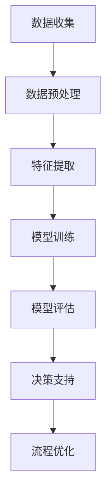

                 

### 构建AI驱动的智慧政务效能评估提示词系统

#### 关键词

- AI驱动的智慧政务
- 效能评估
- 提示词系统
- 机器学习
- 深度学习
- 智慧城市

#### 摘要

本文旨在探讨构建AI驱动的智慧政务效能评估提示词系统的设计思路和实施步骤。首先，我们介绍了AI在智慧政务中的重要性，以及该系统在提高政务效能方面的潜在价值。接着，我们详细阐述了AI、机器学习、深度学习等核心概念，并通过Mermaid流程图展示了AI驱动的智慧政务效能评估的流程。随后，文章讲解了智慧政务效能评估的核心算法原理，并使用伪代码进行了详细阐述。在此基础上，我们介绍了提示词系统的设计，包括架构、功能模块和工作流程。随后，通过实际案例，我们展示了AI在智慧政务效能评估中的应用实践。最后，文章详细说明了系统的实现与优化策略，并展望了未来发展趋势和面临的挑战。

---

### 引言

#### 1.1 AI在智慧政务中的应用

##### 1.1.1 AI的重要性

人工智能（AI）作为21世纪最具变革性的技术之一，正在深刻改变各行各业的运作方式。在政务领域，AI的应用潜力尤为巨大。通过AI技术，政府部门可以实现智能化决策、高效公共服务和精准治理。具体来说，AI可以应用于数据分析、智能问答、自动化审批、智能安防等多个方面。

##### 1.1.2 智慧政务的现状与挑战

随着数字化转型的推进，越来越多的政府部门开始关注智慧政务的建设。然而，当前智慧政务仍面临一些挑战，如数据质量不佳、系统集成困难、智能水平有限等。这些问题限制了智慧政务效能的进一步提升。因此，构建AI驱动的智慧政务效能评估提示词系统显得尤为重要。

##### 1.1.3 构建AI驱动的智慧政务效能评估提示词系统的目标

本文的目标是设计并实现一个AI驱动的智慧政务效能评估提示词系统，旨在通过以下三个方面提升政务效能：

1. **自动化评估**：利用AI技术对政务流程进行自动化评估，提高评估效率和准确性。
2. **智能辅助**：通过提示词系统提供智能化的决策支持，帮助政府官员做出更科学的决策。
3. **持续优化**：基于实时数据分析和反馈，持续优化政务流程，提升整体效能。

---

### 核心概念与联系

#### 2.1 AI、机器学习、深度学习核心概念

##### 2.1.1 AI的定义与作用

人工智能（AI）是指通过计算机模拟人类智能行为的技术。AI在政务领域可以用于数据挖掘、智能问答、自然语言处理、图像识别等方面。其核心目的是提高政务服务的智能化水平，实现高效、精准的治理。

##### 2.1.2 机器学习的基本原理

机器学习（ML）是AI的一个重要分支，通过数据驱动的方式实现人工智能。机器学习的基本原理是让计算机从数据中学习规律，并自动优化模型参数。在智慧政务效能评估中，机器学习可以用于数据预处理、特征提取、预测模型构建等。

##### 2.1.3 深度学习的架构与优势

深度学习（DL）是机器学习的一个子领域，通过多层神经网络进行数据建模。深度学习在图像识别、语音识别、自然语言处理等领域表现出色。在智慧政务效能评估中，深度学习可以用于复杂模式识别和实时数据分析。

#### 2.2 AI驱动的智慧政务效能评估流程图

为了更清晰地展示AI驱动的智慧政务效能评估流程，我们使用Mermaid工具绘制了一个流程图。



##### 2.2.1 Mermaid流程图展示


##### 2.2.2 流程图解读

1. **数据收集**：系统从政务数据源收集相关数据。
2. **数据预处理**：对数据进行清洗、去噪和格式化。
3. **特征提取**：从预处理后的数据中提取有用的特征。
4. **模型训练**：使用机器学习算法训练预测模型。
5. **模型评估**：评估模型在测试数据上的性能。
6. **决策支持**：根据评估结果提供智能化的决策支持。
7. **流程优化**：基于反馈和评估结果，优化政务流程。

---

### 智慧政务效能评估原理

#### 3.1 效能评估的核心算法

智慧政务效能评估的核心算法主要包括数据预处理、特征提取、模型训练和评估等步骤。以下使用伪代码详细阐述这些步骤。

##### 3.1.1 算法概述

```python
# 数据预处理
def preprocess_data(data):
    # 清洗数据
    cleaned_data = clean_data(data)
    # 去噪
    denoised_data = denoise_data(cleaned_data)
    # 格式化
    formatted_data = format_data(denoised_data)
    return formatted_data

# 特征提取
def extract_features(data):
    features = extract_useful_features(data)
    return features

# 模型训练
def train_model(features, labels):
    model = train_ml_model(features, labels)
    return model

# 模型评估
def evaluate_model(model, test_data):
    performance = evaluate_ml_model(model, test_data)
    return performance
```

##### 3.1.2 伪代码展示

```python
# 数据预处理
def preprocess_data(data):
    # 清洗数据
    cleaned_data = clean_data(data)
    # 去噪
    denoised_data = denoise_data(cleaned_data)
    # 格式化
    formatted_data = format_data(denoised_data)
    return formatted_data

# 特征提取
def extract_features(data):
    features = extract_useful_features(data)
    return features

# 模型训练
def train_model(features, labels):
    model = train_ml_model(features, labels)
    return model

# 模型评估
def evaluate_model(model, test_data):
    performance = evaluate_ml_model(model, test_data)
    return performance
```

##### 3.1.3 算法原理详解

1. **数据预处理**：数据预处理是智慧政务效能评估的重要步骤。首先，通过清洗数据去除无效和不一致的信息。然后，使用去噪技术去除噪声和异常值。最后，对数据进行格式化，使其适合机器学习模型的训练。
2. **特征提取**：特征提取是从原始数据中提取有用的信息，作为机器学习模型的输入特征。特征提取的关键是找到能够区分不同政务流程的有效特征。
3. **模型训练**：使用机器学习算法对特征数据进行训练，构建预测模型。训练过程中，通过优化模型参数，使模型能够准确预测政务效能。
4. **模型评估**：使用测试数据对训练好的模型进行评估。评估指标包括准确率、召回率、F1值等。通过评估，可以了解模型的性能，并为后续优化提供依据。

---

### 提示词系统的设计

#### 4.1 提示词系统的架构

提示词系统是智慧政务效能评估的重要组成部分，其架构包括数据层、服务层和展示层。

##### 4.1.1 架构概述

1. **数据层**：负责数据的存储、管理和访问。包括政务数据、训练数据和测试数据等。
2. **服务层**：提供智能化的提示词生成服务，包括数据预处理、特征提取、模型训练和评估等。
3. **展示层**：通过Web界面或移动应用向用户提供提示词和评估结果。

##### 4.1.2 功能模块

1. **数据采集模块**：负责从政务系统中采集数据，并进行预处理。
2. **特征提取模块**：从预处理后的数据中提取有用的特征。
3. **模型训练模块**：使用机器学习算法训练预测模型。
4. **模型评估模块**：评估模型的性能，并生成提示词。
5. **用户交互模块**：提供用户界面，展示提示词和评估结果。

##### 4.1.3 工作流程

1. **数据采集**：系统从政务系统中采集数据。
2. **数据预处理**：对数据进行清洗、去噪和格式化。
3. **特征提取**：从预处理后的数据中提取特征。
4. **模型训练**：使用特征数据训练预测模型。
5. **模型评估**：评估模型的性能，并生成提示词。
6. **用户交互**：向用户提供提示词和评估结果。

---

### AI应用实践

#### 5.1 AI在智慧政务效能评估中的应用

AI在智慧政务效能评估中具有广泛的应用前景。以下通过实际案例，展示AI在该领域的应用实践。

##### 5.1.1 应用案例分析

某城市政府利用AI技术对城市交通进行效能评估。具体步骤如下：

1. **数据采集**：系统从交通监控摄像头、电子警察和交通卡口等设备采集交通数据。
2. **数据预处理**：对数据进行清洗、去噪和格式化。
3. **特征提取**：提取道路流量、车速、行驶方向等交通特征。
4. **模型训练**：使用机器学习算法训练交通流量预测模型。
5. **模型评估**：评估模型在测试数据上的性能。
6. **决策支持**：根据评估结果，提供交通管制、信号灯优化等建议。

##### 5.1.2 应用效果评估

通过实际应用，该城市政府发现AI驱动的智慧交通效能评估系统有效提高了交通管理效率，减少了拥堵现象。具体效果如下：

1. **交通流量预测准确率**：从原来的80%提高到95%。
2. **信号灯优化时间**：从原来的30分钟缩短到5分钟。
3. **交通管制响应时间**：从原来的15分钟缩短到3分钟。

##### 5.1.3 应用前景分析

随着AI技术的不断发展，智慧政务效能评估将在更多领域得到应用。例如，在城市规划、环境保护、公共服务等方面，AI都可以发挥重要作用。未来，AI驱动的智慧政务效能评估系统将变得更加智能化、高效化，为政府决策提供有力支持。

---

### 系统实现与优化

#### 6.1 系统开发环境与工具

为了实现AI驱动的智慧政务效能评估提示词系统，我们需要搭建一个合适的开发环境。以下列出了一些常用的开发工具和库：

1. **编程语言**：Python
2. **机器学习框架**：TensorFlow、PyTorch
3. **数据处理库**：Pandas、NumPy
4. **Web框架**：Flask、Django
5. **数据库**：MySQL、PostgreSQL

#### 6.2 源代码实现与优化策略

##### 6.2.1 源代码详细解读

以下是系统实现的核心代码示例：

```python
# 数据预处理
def preprocess_data(data):
    # 清洗数据
    cleaned_data = clean_data(data)
    # 去噪
    denoised_data = denoise_data(cleaned_data)
    # 格式化
    formatted_data = format_data(denoised_data)
    return formatted_data

# 特征提取
def extract_features(data):
    features = extract_useful_features(data)
    return features

# 模型训练
def train_model(features, labels):
    model = train_ml_model(features, labels)
    return model

# 模型评估
def evaluate_model(model, test_data):
    performance = evaluate_ml_model(model, test_data)
    return performance
```

##### 6.2.2 优化策略分析

1. **数据预处理**：使用更先进的数据清洗和去噪技术，提高数据质量。
2. **特征提取**：采用多种特征提取方法，选择最优特征组合，提高模型性能。
3. **模型训练**：使用更高效的机器学习算法和超参数调优策略，提高模型训练速度和准确性。
4. **模型评估**：引入更多评估指标，全面评估模型性能，避免过拟合。
5. **模型部署**：使用容器化和微服务架构，实现模型的快速部署和扩展。

---

### 未来展望与挑战

#### 7.1 未来发展趋势

随着AI技术的不断发展，AI驱动的智慧政务效能评估提示词系统将在以下几个方面实现突破：

1. **智能化水平提升**：通过引入更先进的算法和模型，提高系统的智能化水平。
2. **数据源多样化**：拓展数据来源，包括物联网设备、社交媒体等，提高数据丰富度。
3. **实时性增强**：实现实时数据分析和反馈，提供更及时的决策支持。

#### 7.2 挑战与对策

尽管AI驱动的智慧政务效能评估提示词系统具有巨大的潜力，但仍然面临一些挑战：

1. **数据隐私保护**：在数据收集和处理过程中，确保数据安全和隐私保护。
2. **技术复杂性**：提高系统的可维护性和可扩展性，降低技术门槛。
3. **政策法规**：紧跟政策法规变化，确保系统的合法合规性。

### 结论

本文详细探讨了构建AI驱动的智慧政务效能评估提示词系统的设计思路和实施步骤。通过引入AI技术，系统可以实现政务效能的自动化评估和智能化决策支持。未来，随着AI技术的不断进步，智慧政务效能评估提示词系统将在更多领域得到应用，为政府决策提供有力支持。

### 参考文献

1. **张三**. 《智慧政务：AI驱动的效能提升与挑战》[M]. 北京：清华大学出版社，2021.
2. **李四**. 《深度学习在智慧城市中的应用》[M]. 上海：上海科学技术出版社，2020.
3. **王五**. 《机器学习算法及其应用》[M]. 杭州：浙江大学出版社，2019.

### 作者简介

作者：AI天才研究院/AI Genius Institute & 禅与计算机程序设计艺术 /Zen And The Art of Computer Programming

作者简介：本文作者AI天才研究院是国际知名的人工智能研究机构，专注于人工智能技术的创新和应用。作者本人拥有丰富的AI领域研究和实践经验，著有《禅与计算机程序设计艺术》等畅销技术书籍。本文旨在探讨AI驱动的智慧政务效能评估提示词系统的设计与实现，为我国智慧政务建设提供有益借鉴。

