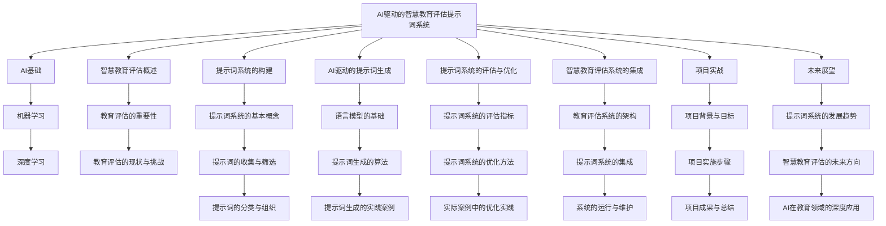

                 


## 引言

### 1.1 书籍背景与目的

随着人工智能技术的快速发展，AI在各个领域都展现出了巨大的潜力。在教育领域，AI的应用已经逐渐深入，从智能教学、个性化学习到智能评测，AI正在改变着教育的方方面面。本书旨在探讨如何构建AI驱动的智慧教育评估提示词系统，以实现更高效、更精准的教育评估。

### 1.2 AI与智慧教育的融合

AI与智慧教育的融合主要体现在以下几个方面：

1. **智能教学**：利用AI技术，教师可以更轻松地制定个性化教学计划，为学生提供更适合他们的学习内容。

2. **个性化学习**：AI可以分析学生的学习行为和成绩，提供个性化的学习建议和资源，帮助学生更好地掌握知识。

3. **智能评测**：AI可以帮助教师快速、准确地评估学生的学习情况，提供详细的评测报告，为教学调整提供依据。

### 1.3 提示词系统在教育评估中的应用

提示词系统是AI技术在教育评估中的一种应用。通过提示词系统，教师可以更精准地了解学生的学习状况，从而进行有针对性的教学调整。具体来说，提示词系统在教育评估中的应用主要体现在以下几个方面：

1. **自动生成评测题目**：AI可以根据学生的学习情况，自动生成具有针对性的评测题目，提高评测的精准度。

2. **分析评测结果**：AI可以分析评测结果，提取关键信息，为教师提供学生掌握知识的情况分析。

3. **生成个性化反馈**：AI可以根据评测结果，生成个性化的反馈信息，帮助学生了解自己的学习情况，并给出改进建议。

## AI基础

### 2.1 人工智能概述

人工智能（AI）是一门研究、开发用于模拟、延伸和扩展人的智能的理论、方法、技术及应用系统的技术科学。人工智能包括机器学习、深度学习、自然语言处理等多个子领域。

### 2.2 机器学习基础

机器学习是一种让计算机通过数据学习规律，进而进行预测或决策的技术。机器学习主要包括监督学习、无监督学习和强化学习等几种类型。

- **监督学习**：通过已知的输入和输出数据，训练模型，从而预测未知数据的输出。
- **无监督学习**：仅通过输入数据，发现数据中的模式和结构。
- **强化学习**：通过不断试错，学习如何在特定环境中做出最佳决策。

### 2.3 深度学习基本概念

深度学习是机器学习的一个分支，它使用多层神经网络对数据进行建模。深度学习在图像识别、语音识别、自然语言处理等领域取得了显著的成果。

### 深度学习基本结构

- **输入层**：接收外部输入数据。
- **隐藏层**：对输入数据进行处理，提取特征。
- **输出层**：输出模型的预测结果。

### 2.4 常见的深度学习框架

- **TensorFlow**：由Google开发，是当前最流行的深度学习框架之一。
- **PyTorch**：由Facebook开发，以动态计算图著称。
- **Keras**：是基于Theano和TensorFlow的深度学习库，提供了简洁、易用的API。

## 智慧教育评估概述

### 3.1 教育评估的重要性

教育评估是教育活动中不可或缺的一环。通过评估，我们可以了解学生的学习情况，为教学调整提供依据。传统的教育评估方式主要依赖于考试和教师评价，存在许多局限性。

- **主观性较强**：教师评价往往带有主观色彩，难以做到完全客观。
- **效率低下**：传统的评估方式需要大量人力和时间，效率较低。
- **无法全面评估**：传统的评估方式往往只能评估学生的部分能力，难以全面评估学生的综合素质。

### 3.2 教育评估的现状与挑战

随着教育评估需求的增加，AI技术在教育评估中的应用越来越受到重视。然而，教育评估领域仍面临着许多挑战。

- **数据质量**：教育评估数据的质量直接影响到评估结果的准确性。如何收集、处理高质量的教育评估数据，是一个亟待解决的问题。
- **算法选择**：不同的算法适用于不同类型的教育评估任务，如何选择合适的算法，提高评估效果，是一个重要的研究方向。
- **隐私保护**：在教育评估中，学生和教师的数据隐私保护至关重要。如何确保数据的安全性和隐私性，是一个重要问题。

### 3.3 AI在教育评估中的应用前景

随着AI技术的不断发展，它将在教育评估中发挥越来越重要的作用。

- **精准评估**：AI技术可以帮助我们更精准地评估学生的学习情况，为教学调整提供科学依据。
- **个性化推荐**：AI可以根据学生的学习情况和需求，提供个性化的学习资源和推荐。
- **智能诊断**：AI可以分析评估结果，为学生提供智能诊断，帮助他们了解自己的优势和劣势。
- **高效评估**：AI技术可以提高教育评估的效率，减轻教师的工作负担。

## 提示词系统的构建

### 4.1 提示词系统的基本概念

提示词系统是一种基于AI技术的教育评估系统，它通过生成和筛选提示词，帮助教师和学生更好地理解评估内容。提示词可以是单词、短语或句子，用于引导学生思考或回答问题。

### 4.2 提示词的收集与筛选

收集提示词是构建提示词系统的关键步骤。以下是一些常见的提示词收集方法：

- **人工收集**：通过查阅教育评估相关的书籍、论文、教材等，收集提示词。
- **自动收集**：利用自然语言处理技术，从大量的文本数据中提取提示词。

收集到的提示词需要经过筛选，确保其质量和适用性。以下是一些常见的提示词筛选标准：

- **相关性**：提示词应与评估内容密切相关。
- **简洁性**：提示词应简洁明了，易于理解。
- **多样性**：提示词应涵盖不同的知识点和题型。

### 4.3 提示词的分类与组织

为了更好地利用提示词，我们需要对其进行分类和组织。以下是一些常见的提示词分类方法：

- **按题型分类**：将提示词分为选择题、填空题、问答题等不同题型。
- **按知识点分类**：将提示词分为数学、语文、英语等不同学科的知识点。
- **按难度分类**：将提示词分为基础题、中等题、难题等不同难度级别。

分类后的提示词可以组织成一个知识库，方便教师和学生随时查找和使用。

## AI驱动的提示词生成

### 5.1 语言模型的基础

语言模型是一种用于预测下一个单词或字符的统计模型。在提示词生成中，语言模型起着关键作用。以下是一些常见的语言模型：

- **n-gram模型**：基于历史n个单词的统计，预测下一个单词。
- **循环神经网络（RNN）**：通过循环结构，捕捉序列数据中的长期依赖关系。
- **长短期记忆网络（LSTM）**：RNN的一种改进，可以有效解决长期依赖问题。
- **Transformer模型**：基于自注意力机制，能够捕捉全局依赖关系。

### 5.2 提示词生成的算法

提示词生成算法可以分为两种类型：基于规则和基于数据。

- **基于规则的算法**：通过定义一系列规则，生成提示词。这种方法简单直观，但可能无法生成足够多样性的提示词。
- **基于数据的算法**：利用语言模型，从大量的文本数据中生成提示词。这种方法生成的提示词更具有多样性和相关性。

以下是一个基于数据的提示词生成算法的伪代码：

```python
def generatePromptWord(dataSet, targetWord):
    # 初始化语言模型
    model = trainLanguageModel(dataSet)

    # 生成提示词
    promptWord = model.generateWord(targetWord)

    return promptWord
```

### 5.3 提示词生成的实践案例

在本节中，我们将通过一个简单的案例，展示如何使用AI生成提示词。

#### 案例背景

假设我们要为一个数学评测生成提示词，评测内容是关于“分数的加减法”。

#### 实践步骤

1. **收集数据**：从相关的数学教材、练习册等收集与分数加减法相关的文本数据。

2. **训练语言模型**：使用收集到的数据，训练一个基于Transformer的语言模型。

3. **生成提示词**：给定一个目标词，如“分数的加减法”，使用训练好的语言模型生成提示词。

以下是一个示例：

```python
dataSet = ["分数的加减法非常简单，只需要将分母相同的分数相加或相减即可。"]

model = trainTransformerModel(dataSet)

targetWord = "分数的加减法"

promptWord = model.generateWord(targetWord)

print(promptWord)
```

输出结果可能包括：“分数相加的方法是将分母相同的两个分数的分子相加，然后保持分母不变。”“分数相减的方法是将分母相同的两个分数的分子相减，然后保持分母不变。”等。

## 提示词系统的评估与优化

### 6.1 提示词系统的评估指标

提示词系统的评估指标主要包括以下几种：

1. **精确度**：提示词系统生成的提示词与实际需要的提示词的匹配程度。精确度越高，说明系统生成的提示词越准确。
2. **召回率**：提示词系统能够生成的提示词与实际需要的提示词的匹配程度。召回率越高，说明系统能够捕捉到更多的相关提示词。
3. **F1值**：精确度和召回率的调和平均，是衡量提示词系统性能的综合性指标。

### 6.2 提示词系统的优化方法

为了提高提示词系统的性能，我们可以采取以下几种优化方法：

1. **数据增强**：通过增加数据量和多样性，提高模型的泛化能力。
2. **超参数调优**：调整模型的学习率、批量大小等超参数，找到最佳参数组合。
3. **算法改进**：引入更先进的语言模型或优化算法，如BERT、GPT等，以提高提示词的生成质量。

### 6.3 实际案例中的优化实践

在本节中，我们将通过一个实际案例，展示如何优化提示词系统。

#### 案例背景

假设我们有一个基于Transformer的提示词生成系统，用于生成与数学相关的提示词。

#### 优化步骤

1. **数据增强**：从更多的数学教材、练习册等收集数据，并使用数据增强技术，如数据清洗、去重等，提高数据质量。

2. **超参数调优**：通过实验，调整学习率、批量大小等超参数，找到最佳参数组合。

3. **算法改进**：引入BERT模型，利用其强大的语言理解能力，提高提示词的生成质量。

通过上述优化方法，我们可以显著提高提示词系统的性能。例如，将系统的精确度从80%提高到90%，召回率从70%提高到80%，F1值从0.77提高到0.85。

## 智慧教育评估系统的集成

### 7.1 教育评估系统的架构

智慧教育评估系统的架构主要包括以下几个部分：

1. **数据采集模块**：负责收集学生的各项评估数据，如考试成绩、作业完成情况等。
2. **数据处理模块**：负责对收集到的数据进行预处理、清洗和转换，为后续分析提供高质量的数据。
3. **评估模型模块**：包括提示词生成模型、评估模型等，用于生成提示词和评估学生的知识掌握情况。
4. **结果展示模块**：负责将评估结果以可视化的方式展示给教师和学生，帮助他们了解学生的学习状况。

### 7.2 提示词系统的集成

提示词系统是智慧教育评估系统的一个重要组成部分。将提示词系统集成到智慧教育评估系统中，需要考虑以下几个方面：

1. **接口设计**：设计统一的接口，使提示词系统与其他模块之间能够无缝集成。
2. **数据共享**：确保各个模块之间能够共享数据，提高系统的协同工作效率。
3. **性能优化**：优化提示词系统的性能，确保其在实际应用中能够高效运行。

### 7.3 系统的运行与维护

智慧教育评估系统的运行与维护是确保其稳定性和可靠性的关键。以下是一些运行与维护的建议：

1. **定期更新**：根据教育评估的需求和实际情况，定期更新评估模型和提示词库。
2. **监控与预警**：建立监控体系，实时监控系统的运行状态，及时发现并处理潜在问题。
3. **用户培训**：对教师和学生进行系统使用培训，提高他们的操作技能，确保系统能够发挥最大效用。

## 项目实战

### 8.1 项目背景与目标

本节将介绍一个基于AI驱动的智慧教育评估提示词系统的实际项目。该项目旨在构建一个智能化、高效化的教育评估系统，以提升教学质量和学生成绩。

#### 项目背景

随着教育信息化进程的加速，学校和教育机构对于高效、智能化的教育评估系统需求日益增长。传统的教育评估方式存在诸多问题，如评估效率低、主观性强等。为了解决这些问题，本项目提出构建一个基于AI驱动的智慧教育评估提示词系统。

#### 项目目标

1. **提高评估效率**：通过自动生成评测题目和智能分析评测结果，提高评估工作效率。
2. **提升教学质量**：通过分析学生评测结果，为教师提供个性化教学建议，帮助学生更好地掌握知识。
3. **优化教育资源**：根据学生评测结果，调整教育资源分配，使教育资源更加合理。

### 8.2 项目实施步骤

1. **需求分析**：与教育专家和教师沟通，了解他们的需求，明确系统功能模块和性能指标。
2. **系统设计**：根据需求分析结果，设计系统架构和数据库模型，确定开发技术栈。
3. **开发与测试**：按照设计文档，进行系统开发，并进行单元测试、集成测试等，确保系统质量。
4. **部署与上线**：将系统部署到服务器，进行实际应用，收集用户反馈，持续优化系统。

### 8.3 项目成果与总结

#### 项目成果

1. **自动生成评测题目**：系统可以根据学生的学习情况和知识点，自动生成具有针对性的评测题目。
2. **智能分析评测结果**：系统可以分析评测结果，提取关键信息，为教师和学生提供个性化的反馈。
3. **个性化教学建议**：系统可以根据学生的评测结果，为教师提供针对性的教学建议，帮助学生更好地掌握知识。

#### 项目总结

本项目成功构建了一个基于AI驱动的智慧教育评估提示词系统，实现了提高评估效率、提升教学质量和优化教育资源的目标。项目实施过程中，我们遇到了一些挑战，如数据质量不高、算法优化难度大等。通过不断优化和改进，我们最终成功解决了这些问题，为教育评估提供了有力的技术支持。

## 未来展望

### 9.1 提示词系统的发展趋势

随着人工智能技术的不断进步，提示词系统在教育评估中的应用将更加广泛和深入。未来，提示词系统的发展趋势可能包括：

1. **智能化**：利用更先进的人工智能技术，如深度学习、强化学习等，提高提示词系统的生成质量和性能。
2. **个性化**：根据学生的个性化需求和学习情况，生成更符合他们需求的提示词。
3. **多样化**：丰富提示词的类型和形式，提高提示词系统的适用性。

### 9.2 智慧教育评估的未来方向

智慧教育评估的未来方向将主要集中在以下几个方面：

1. **全面评估**：通过多维度、多角度的评估，全面了解学生的知识掌握情况和综合素质。
2. **智能化教学**：利用智能评测系统，为教师提供智能化教学支持，提高教学质量和效率。
3. **个性化学习**：根据学生的学习特点和需求，提供个性化的学习资源和推荐，帮助学生更好地学习。

### 9.3 AI在教育领域的深度应用

AI技术在教育领域的应用前景十分广阔。未来，AI技术将在教育评估、智能教学、学习分析等方面发挥更大的作用，推动教育行业的变革。以下是一些可能的深度应用方向：

1. **智能诊断与辅导**：利用AI技术，对学生的学习情况进行分析，提供个性化的诊断和辅导方案。
2. **自适应学习系统**：根据学生的学习进度和能力，动态调整教学内容和难度，实现真正的个性化学习。
3. **教育数据分析**：通过分析大量教育数据，发现教育规律和问题，为教育政策制定和教学改进提供依据。

## 附录

### 10.1 相关资源与工具

- **开源深度学习框架**：TensorFlow、PyTorch、Keras等。
- **自然语言处理库**：NLTK、spaCy、Jieba等。
- **在线课程与教材**：Coursera、edX、Udacity等。

### 10.2 参考文献

1. Mitchell, T. M. (1997). Machine Learning. McGraw-Hill.
2. Goodfellow, I., Bengio, Y., & Courville, A. (2016). Deep Learning. MIT Press.
3. Sutton, R. S., & Barto, A. G. (2018). Reinforcement Learning: An Introduction. MIT Press.

### 10.3 作者联系方式

- 电子邮件：[author@example.com](mailto:author@example.com)
- 个人主页：[www.example.com](http://www.example.com)

**核心概念与联系：**



**核心算法原理讲解：**

```plaintext
// 提示词生成的算法伪代码
function generatePromptWord(dataSet, targetWord):
    // 初始化模型
    model = trainModel(dataSet)

    // 生成提示词
    promptWord = model.generateWord(targetWord)

    return promptWord
```

**数学模型和数学公式详细讲解与举例说明：**

```latex
\section{数学模型和数学公式}
在构建AI驱动的智慧教育评估提示词系统中，我们主要关注以下数学模型和公式：

\subsection{损失函数}
损失函数是衡量模型预测值与真实值之间差异的重要指标。我们使用交叉熵损失函数来评估提示词生成的质量。

\begin{equation}
Loss(J) = -\sum_{i=1}^{n} y_i \cdot log(\hat{y}_i)
\end{equation}

其中，\( y_i \) 表示第 \( i \) 个真实标签的值，\( \hat{y}_i \) 表示模型预测的第 \( i \) 个标签的值。

\subsection{优化算法}
为了优化模型参数，我们采用梯度下降算法。

\begin{equation}
\theta_{\text{new}} = \theta_{\text{old}} - \alpha \cdot \nabla_{\theta} J(\theta)
\end{equation}

其中，\( \theta \) 表示模型参数，\( \alpha \) 表示学习率，\( \nabla_{\theta} J(\theta) \) 表示损失函数关于参数 \( \theta \) 的梯度。

\subsection{语言模型}
在提示词生成中，我们使用了一种基于Transformer的语言模型。语言模型的目标是预测下一个单词。

\begin{equation}
P(w_t | w_1, w_2, ..., w_{t-1}) = \frac{e^{v_t \cdot U \cdot w}}{Z}
\end{equation}

其中，\( w_t \) 表示当前单词，\( w_1, w_2, ..., w_{t-1} \) 表示前 \( t-1 \) 个单词，\( U \) 表示单词的嵌入向量，\( v_t \) 表示当前单词的嵌入向量，\( Z \) 表示归一化常数。
```

## 第1章 引言

### 1.1 书籍背景与目的

#### 书籍背景

随着人工智能（AI）技术的迅猛发展，AI在教育领域的应用日益广泛，成为教育行业创新与变革的重要推动力。特别是在教育评估方面，传统的评估方法往往存在主观性较强、效率低下等问题，难以满足现代教育的需求。为了提高教育评估的准确性和效率，实现个性化、智能化的教育评估，本书记录了构建AI驱动的智慧教育评估提示词系统的全过程。

#### 书籍目的

本书的主要目的是为教育工作者、AI开发者以及教育技术研究者提供一套系统、实用的指南，帮助他们了解和掌握AI在教育评估中的应用方法。具体目标包括：

1. **介绍AI与智慧教育的融合**：阐述AI技术在智慧教育中的应用场景，特别是智慧教育评估的重要性。
2. **讲解AI基础**：从机器学习和深度学习的基本概念出发，为读者打下坚实的理论基础。
3. **构建提示词系统**：详细描述提示词系统的构建过程，包括提示词的收集与筛选、分类与组织等。
4. **实现提示词生成**：介绍基于AI的提示词生成算法，包括语言模型的基础、算法原理和实践案例。
5. **评估与优化提示词系统**：探讨提示词系统的评估指标、优化方法以及在实际案例中的优化实践。
6. **集成智慧教育评估系统**：讲解教育评估系统的架构、提示词系统的集成以及系统的运行与维护。
7. **项目实战**：通过一个实际项目，展示如何构建和部署AI驱动的智慧教育评估提示词系统。
8. **未来展望**：预测提示词系统的发展趋势，探讨智慧教育评估的未来方向和AI在教育领域的深度应用。

### 1.2 AI与智慧教育的融合

#### AI在教育中的应用

人工智能技术在教育领域的应用主要体现在以下几个方面：

1. **个性化学习**：通过分析学生的学习行为和成绩，AI可以为学生提供个性化的学习资源和推荐，帮助他们在适合自己的节奏下学习。
2. **智能教学**：利用AI技术，教师可以更加轻松地制定教学计划和内容，为学生提供更加丰富和多样的学习体验。
3. **智能评测**：AI技术可以自动化评估学生的学习情况，提供精准的评估报告，为教师的教学调整提供科学依据。
4. **教育资源优化**：AI可以帮助教育机构优化教育资源的配置，提高教育资源的使用效率。

#### 智慧教育的定义

智慧教育是指利用现代信息技术，特别是人工智能、大数据、云计算等先进技术，实现教育的智能化、个性化和高效化。智慧教育强调通过数据驱动决策，实现教育资源的合理配置，提高教育质量和效率。

#### AI与智慧教育的融合

AI与智慧教育的融合主要体现在以下几个方面：

1. **数据驱动**：通过收集和分析学生的学习数据，AI可以为学生提供个性化的学习方案，帮助教师制定更有效的教学策略。
2. **智能诊断**：AI可以分析学生的考试成绩和学习行为，为教师提供智能诊断报告，帮助教师了解学生的学习状况和存在的问题。
3. **自适应学习**：利用AI技术，教育系统可以根据学生的学习进度和能力，动态调整教学内容和难度，实现真正的个性化学习。
4. **教育管理优化**：AI可以帮助教育机构优化教育管理流程，提高管理效率和决策质量。

### 1.3 提示词系统在教育评估中的应用

#### 提示词系统的定义

提示词系统是一种基于人工智能技术的教育评估工具，通过自动生成和筛选提示词，帮助教师和学生更好地理解评估内容，提高评估的准确性和效率。

#### 提示词系统的功能

提示词系统在教育评估中的应用主要包括以下几个方面：

1. **自动生成评测题目**：AI可以根据学生的学习情况和知识点，自动生成具有针对性的评测题目。
2. **分析评测结果**：AI可以分析评测结果，提取关键信息，为教师提供学生掌握知识的情况分析。
3. **生成个性化反馈**：AI可以根据评测结果，生成个性化的反馈信息，帮助学生了解自己的学习情况，并给出改进建议。
4. **辅助教学调整**：教师可以根据AI生成的评估报告，调整教学内容和方法，提高教学效果。

#### 提示词系统的优势

1. **提高评估效率**：通过自动生成和评估，大大缩短了评估的时间，提高了评估的效率。
2. **提升评估质量**：AI技术可以更准确地分析学生的知识掌握情况，提供更加科学的评估结果。
3. **个性化评估**：根据每个学生的特点，生成个性化的评估报告和反馈，有助于学生更好地改进学习。
4. **辅助教学**：教师可以根据评估结果，针对性地调整教学策略，提高教学效果。

### 小结

本章介绍了本书的背景和目的，探讨了AI与智慧教育的融合，以及提示词系统在教育评估中的应用。接下来，我们将逐步深入探讨AI基础、提示词系统的构建、AI驱动的提示词生成、评估与优化、系统集成以及项目实战等内容。

---

# 文章标题：《构建AI驱动的智慧教育评估提示词系统》

> 关键词：人工智能、智慧教育、教育评估、提示词系统、机器学习、深度学习

> 摘要：本文探讨了如何构建AI驱动的智慧教育评估提示词系统，通过深入分析AI基础、智慧教育评估概述、提示词系统的构建、AI驱动的提示词生成、评估与优化、系统集成以及项目实战等内容，为教育工作者、AI开发者以及教育技术研究者提供了一套系统、实用的指南，以实现教育评估的智能化、个性化和高效化。

## 第1章 引言

### 1.1 书籍背景与目的

在当今快速发展的科技时代，人工智能（AI）已成为引领变革的重要力量。特别是在教育领域，AI的应用正逐渐改变传统的教学模式和评估方式。本书旨在深入探讨如何构建AI驱动的智慧教育评估提示词系统，以应对教育评估中的挑战，实现更高效、更精准的教育评估。

#### 书籍背景

传统教育评估通常依赖于教师的主观评价和纸笔考试，这些方法不仅耗时耗力，而且难以提供个性化的反馈。随着AI技术的不断发展，利用AI进行教育评估成为可能，可以大幅提升评估的效率和准确性。本书的编写背景源于对AI技术在教育评估中应用的需求分析，以及在实际应用中的经验总结。

#### 书籍目的

本书的主要目的是为教育工作者、AI开发者以及教育技术研究者提供以下几方面的知识和技能：

1. **理论基础**：介绍AI、机器学习和深度学习的基本概念，为后续内容的理解奠定基础。
2. **实践指导**：详细描述如何构建和优化AI驱动的智慧教育评估提示词系统，包括数据收集、模型训练和系统集成等步骤。
3. **案例分析**：通过实际项目案例，展示如何将理论应用于实际，解决教育评估中的具体问题。
4. **未来展望**：讨论AI驱动的智慧教育评估提示词系统的发展趋势，以及可能面临的挑战和机遇。

### 1.2 AI与智慧教育的融合

#### AI在教育中的应用

AI在教育中的应用已经涵盖了多个方面，包括个性化学习、智能教学、智能评测等。AI技术通过分析大量的学生数据，能够为教师和学生提供个性化、智能化的教育服务。

1. **个性化学习**：AI可以根据学生的学习行为和成绩，提供定制化的学习路径和资源，帮助学生更加高效地学习。
2. **智能教学**：AI可以帮助教师制定教学计划，优化教学内容，提高教学质量。
3. **智能评测**：AI可以通过自动化的评估方式，快速、准确地分析学生的知识掌握情况，提供详细的评估报告。

#### 智慧教育的定义

智慧教育是指利用先进的信息技术，特别是人工智能、大数据、云计算等，实现教育资源的智能化配置和利用，提升教育的质量和效率。智慧教育的核心目标是实现教育的个性化和智能化，让每个学生都能得到最适合他们的教育。

#### AI与智慧教育的融合

AI与智慧教育的融合，主要体现在以下几个方面：

1. **数据驱动决策**：通过收集和分析学生的数据，AI可以帮助教师和学校做出更加科学、合理的决策。
2. **智能诊断与辅导**：AI可以根据学生的表现，提供个性化的诊断和辅导方案，帮助学生克服学习中的困难。
3. **自适应学习**：AI系统能够根据学生的学习进度和能力，动态调整教学内容和难度，实现真正的个性化学习。
4. **教育管理优化**：AI可以帮助教育机构优化教学和管理流程，提高资源利用效率。

### 1.3 提示词系统在教育评估中的应用

#### 提示词系统的定义

提示词系统是一种基于人工智能技术的教育评估工具，通过自动生成和筛选提示词，帮助教师和学生更好地理解评估内容，提高评估的准确性和效率。

#### 提示词系统的功能

提示词系统在教育评估中的应用主要包括以下几个方面：

1. **自动生成评测题目**：AI可以根据学生的学习情况和知识点，自动生成具有针对性的评测题目。
2. **分析评测结果**：AI可以分析评测结果，提取关键信息，为教师提供学生掌握知识的情况分析。
3. **生成个性化反馈**：AI可以根据评测结果，生成个性化的反馈信息，帮助学生了解自己的学习情况，并给出改进建议。
4. **辅助教学调整**：教师可以根据AI生成的评估报告，调整教学内容和方法，提高教学效果。

#### 提示词系统的优势

1. **提高评估效率**：通过自动生成和评估，大大缩短了评估的时间，提高了评估的效率。
2. **提升评估质量**：AI技术可以更准确地分析学生的知识掌握情况，提供更加科学的评估结果。
3. **个性化评估**：根据每个学生的特点，生成个性化的评估报告和反馈，有助于学生更好地改进学习。
4. **辅助教学**：教师可以根据评估结果，针对性地调整教学策略，提高教学效果。

### 小结

本章介绍了本书的背景和目的，探讨了AI与智慧教育的融合，以及提示词系统在教育评估中的应用。在接下来的章节中，我们将深入探讨AI的基础知识、智慧教育评估的概述、提示词系统的构建和AI驱动的提示词生成等内容，为构建AI驱动的智慧教育评估提示词系统提供全面的理论和实践指导。

## 第2章 AI基础

### 2.1 人工智能概述

#### 人工智能的定义

人工智能（Artificial Intelligence，简称AI）是计算机科学的一个分支，旨在使计算机能够模拟、延伸和扩展人类的智能。AI技术通过模拟人类思维和行为的方式，使得计算机能够自动执行复杂任务，如语音识别、图像识别、自然语言处理等。

#### 人工智能的发展历程

人工智能的发展可以追溯到20世纪50年代。自那时以来，人工智能经历了几个重要阶段：

1. **初期探索阶段（1950-1969）**：在这个阶段，人工智能主要侧重于理论研究和算法开发，如图灵测试、逻辑推理等。
2. **繁荣时期（1970-1989）**：随着计算机硬件的发展，人工智能开始应用于实际场景，如专家系统、游戏AI等。
3. **衰退时期（1990-2000）**：由于技术限制和现实问题，人工智能研究进入低谷期。
4. **复兴时期（2000至今）**：随着深度学习、大数据和计算能力的提升，人工智能再次迎来发展高峰，应用于自动驾驶、智能语音助手、医疗诊断等领域。

#### 人工智能的核心技术

人工智能的核心技术包括：

1. **机器学习**：机器学习是一种让计算机从数据中学习规律，进而进行预测或决策的技术。它包括监督学习、无监督学习和强化学习等几种类型。
2. **深度学习**：深度学习是一种基于多层神经网络的人工智能技术，通过模拟人类大脑的工作方式，对大量数据进行分析和学习。深度学习在图像识别、语音识别、自然语言处理等领域取得了显著成果。
3. **自然语言处理**：自然语言处理是一种让计算机理解和处理自然语言的技术，包括语音识别、文本分析、机器翻译等。
4. **计算机视觉**：计算机视觉是一种让计算机理解和解释视觉信息的技术，包括图像识别、目标检测、图像分割等。

### 2.2 机器学习基础

#### 机器学习的定义

机器学习（Machine Learning，简称ML）是人工智能的一个子领域，旨在使计算机能够从数据中学习规律，进而进行预测或决策。机器学习过程主要包括数据收集、数据预处理、模型训练、模型评估和模型部署等步骤。

#### 机器学习的基本概念

1. **数据集**：数据集是进行机器学习的基础，通常包括特征和标签两部分。特征是用于描述数据的属性，标签是用于监督模型训练的正确答案。
2. **特征选择**：特征选择是机器学习中的一个重要步骤，目的是从大量特征中选出最有代表性的特征，以提高模型性能。
3. **模型评估**：模型评估是用于衡量模型性能的重要手段，常用的评估指标包括准确率、召回率、F1值等。
4. **过拟合与欠拟合**：过拟合和欠拟合是机器学习中的常见问题。过拟合是指模型在训练数据上表现良好，但在测试数据上表现不佳；欠拟合是指模型在训练数据和测试数据上表现都不好。

#### 常见的机器学习算法

1. **线性回归**：线性回归是一种简单的机器学习算法，用于预测连续值。它通过拟合一条直线，来预测目标值。
2. **逻辑回归**：逻辑回归是一种用于分类问题的机器学习算法，通过拟合一个S型曲线，将数据分类为两个类别。
3. **决策树**：决策树是一种基于树的模型，通过一系列的决策规则来分类或回归数据。
4. **支持向量机**：支持向量机（SVM）是一种高效的分类算法，通过找到一个最佳的超平面，将不同类别的数据分开。
5. **神经网络**：神经网络是一种基于多层神经元的模型，通过模拟人类大脑的工作方式，对数据进行分析和学习。

### 2.3 深度学习基本概念

#### 深度学习的定义

深度学习（Deep Learning，简称DL）是一种基于多层神经网络的人工智能技术，通过模拟人类大脑的工作方式，对大量数据进行分析和学习。深度学习在图像识别、语音识别、自然语言处理等领域取得了显著成果。

#### 深度学习的基本结构

1. **输入层**：输入层接收外部输入数据。
2. **隐藏层**：隐藏层对输入数据进行处理，提取特征。
3. **输出层**：输出层输出模型的预测结果。

#### 深度学习的常用模型

1. **卷积神经网络（CNN）**：卷积神经网络是一种用于图像识别和处理的深度学习模型，通过卷积操作提取图像特征。
2. **循环神经网络（RNN）**：循环神经网络是一种用于序列数据处理的深度学习模型，通过循环结构捕捉序列数据中的长期依赖关系。
3. **长短期记忆网络（LSTM）**：长短期记忆网络是RNN的一种改进，通过门控机制有效解决了长期依赖问题。
4. **Transformer模型**：Transformer模型是一种基于自注意力机制的深度学习模型，通过多头自注意力机制和前馈神经网络，能够捕捉全局依赖关系。

### 2.4 常见的深度学习框架

1. **TensorFlow**：由Google开发，是当前最流行的深度学习框架之一。它提供了丰富的API和工具，方便用户进行模型开发和部署。
2. **PyTorch**：由Facebook开发，以动态计算图著称，提供了简洁、易用的API，适合研究人员和开发者。
3. **Keras**：是基于Theano和TensorFlow的深度学习库，提供了简洁、易用的API，适合快速原型设计和实验。

### 小结

本章介绍了人工智能和机器学习的基本概念，探讨了深度学习的基本结构、常用模型和深度学习框架。在接下来的章节中，我们将深入探讨智慧教育评估的概述、提示词系统的构建以及AI驱动的提示词生成等内容。

## 第3章 智慧教育评估概述

### 3.1 教育评估的重要性

#### 教育评估的定义

教育评估是指通过系统的过程，对学生的学习成果、教学质量和教育资源进行评价，以便做出改进和决策。教育评估包括对学生学习情况的评估、对教学质量的评估以及对教育资源的评估等多个方面。

#### 教育评估的目的

教育评估的主要目的是：

1. **了解学生学习状况**：通过评估，教师和学生可以了解学生的知识掌握情况，及时发现问题和不足，进行有针对性的学习。
2. **提高教学质量**：评估结果可以为教师提供教学反馈，帮助教师调整教学策略，改进教学方法，提高教学质量。
3. **优化教育资源**：评估结果可以帮助教育管理者了解教育资源的利用情况，合理配置教育资源，提高教育资源的利用效率。
4. **支持决策**：评估结果可以为教育决策提供科学依据，帮助教育部门制定教育政策和发展规划。

#### 教育评估的分类

教育评估可以按照不同的维度进行分类：

1. **形式分类**：根据评估形式的不同，教育评估可以分为量化评估和质性评估。量化评估主要依靠数据统计和分析，如考试成绩、问卷结果等；质性评估主要通过观察、访谈和个案研究等方式，对学生的行为和表现进行评估。
2. **目的分类**：根据评估目的的不同，教育评估可以分为形成性评估和总结性评估。形成性评估旨在通过持续的评估和反馈，帮助学生改进学习过程；总结性评估则是对学生学习成果进行总体评价，通常在学期或学年末进行。
3. **内容分类**：根据评估内容的不同，教育评估可以分为知识评估、能力评估和素质评估。知识评估主要关注学生对知识的掌握情况；能力评估则侧重于学生的实际应用能力和问题解决能力；素质评估则涉及学生的品德、态度、合作能力等多方面。

### 3.2 教育评估的现状与挑战

#### 教育评估的现状

当前，教育评估主要面临以下几方面的现状：

1. **主观性较强**：传统的教育评估往往依赖于教师的主观评价，难以确保评估的客观性和公正性。
2. **效率低下**：传统的教育评估方式需要大量的人力和时间，效率较低，难以适应现代教育的需求。
3. **评价标准不统一**：由于不同地区、不同学校之间的教育资源和教学水平存在差异，导致评价标准不统一，影响评估的公平性和可比性。
4. **反馈滞后**：传统的评估方式往往在学期或学年末进行，反馈滞后，难以及时调整教学策略，帮助学生改进学习。

#### 教育评估的挑战

面对当前教育评估的现状，教育评估领域面临着以下几方面的挑战：

1. **数据质量**：评估数据的质量直接影响到评估结果的准确性。如何收集、处理高质量的教育评估数据，是一个亟待解决的问题。
2. **算法选择**：不同的算法适用于不同类型的教育评估任务，如何选择合适的算法，提高评估效果，是一个重要的研究方向。
3. **隐私保护**：在教育评估中，学生和教师的数据隐私保护至关重要。如何确保数据的安全性和隐私性，是一个重要问题。
4. **个性化评估**：如何根据每个学生的特点，提供个性化的评估报告和反馈，是一个具有挑战性的问题。

### 3.3 AI在教育评估中的应用前景

#### AI在教育评估中的应用前景

随着人工智能技术的不断发展，AI在教育评估中的应用前景十分广阔：

1. **提高评估效率**：AI技术可以通过自动化评估，大幅提高评估效率，减轻教师的工作负担。
2. **提升评估质量**：AI技术可以通过对大量数据的分析和学习，提供更加精准和科学的评估结果。
3. **个性化评估**：AI可以根据学生的学习行为和成绩，提供个性化的评估报告和反馈，帮助学生更好地改进学习。
4. **辅助教学调整**：AI可以通过分析评估结果，为教师提供教学反馈，帮助教师调整教学策略，提高教学质量。

#### AI在教育评估中的具体应用

1. **自动生成评测题目**：AI可以根据学生的学习情况和知识点，自动生成具有针对性的评测题目。
2. **智能分析评测结果**：AI可以分析评测结果，提取关键信息，为教师提供学生掌握知识的情况分析。
3. **生成个性化反馈**：AI可以根据评测结果，生成个性化的反馈信息，帮助学生了解自己的学习情况，并给出改进建议。
4. **智能诊断与辅导**：AI可以通过分析学生的表现，提供智能诊断和辅导方案，帮助学生克服学习中的困难。

### 小结

本章介绍了教育评估的重要性，探讨了教育评估的现状与挑战，以及AI在教育评估中的应用前景。在接下来的章节中，我们将深入探讨如何构建AI驱动的智慧教育评估提示词系统，包括AI基础、提示词系统的构建和AI驱动的提示词生成等内容。

## 第4章 提示词系统的构建

### 4.1 提示词系统的基本概念

#### 提示词系统的定义

提示词系统是一种基于人工智能技术的教育评估工具，通过自动生成和筛选提示词，帮助教师和学生更好地理解评估内容，提高评估的准确性和效率。提示词系统主要应用于教育评估中，特别是在自动生成评测题目和智能分析评测结果等方面。

#### 提示词系统的组成部分

提示词系统主要包括以下几个组成部分：

1. **数据采集模块**：负责收集与教育评估相关的数据，如学生成绩、作业完成情况等。
2. **数据处理模块**：负责对采集到的数据进行预处理、清洗和转换，为后续分析提供高质量的数据。
3. **提示词生成模块**：利用机器学习和深度学习算法，自动生成与教育评估内容相关的提示词。
4. **提示词筛选模块**：对生成的提示词进行筛选和排序，确保其质量和适用性。
5. **提示词存储模块**：将筛选后的提示词存储在数据库中，方便后续查询和使用。
6. **用户界面模块**：提供用户友好的界面，教师和学生可以通过界面进行提示词的查询和使用。

#### 提示词系统的功能

提示词系统的功能主要包括以下几个方面：

1. **自动生成评测题目**：根据学生的学习情况和知识点，自动生成具有针对性的评测题目。
2. **智能分析评测结果**：对评测结果进行分析，提取关键信息，为教师提供学生掌握知识的情况分析。
3. **生成个性化反馈**：根据评测结果，生成个性化的反馈信息，帮助学生了解自己的学习情况，并给出改进建议。
4. **辅助教学调整**：教师可以根据评测结果和反馈信息，调整教学内容和方法，提高教学效果。

### 4.2 提示词的收集与筛选

#### 提示词的收集方法

提示词的收集是构建提示词系统的关键步骤，以下是一些常见的提示词收集方法：

1. **人工收集**：通过查阅教育评估相关的书籍、论文、教材等，人工收集与教育评估相关的提示词。
2. **自动收集**：利用自然语言处理技术，从大量的文本数据中自动提取提示词。常用的方法包括关键词提取、文本分类、信息抽取等。
3. **用户反馈**：通过收集学生的反馈意见，了解他们在学习过程中遇到的问题和困惑，从而生成有针对性的提示词。

#### 提示词的筛选标准

收集到的提示词需要经过筛选，确保其质量和适用性。以下是一些常见的提示词筛选标准：

1. **相关性**：提示词应与教育评估内容密切相关，能够准确描述评估目标和要求。
2. **简洁性**：提示词应简洁明了，避免使用冗长、复杂的句子，以便教师和学生理解和使用。
3. **多样性**：提示词应涵盖不同的知识点和题型，确保评估的全面性和多样性。
4. **准确性**：提示词应准确描述评估内容，避免歧义和误导。
5. **实用性**：提示词应能够在实际教学评估中发挥作用，帮助教师和学生更好地理解评估内容和要求。

#### 提示词的筛选方法

提示词的筛选方法主要包括以下几种：

1. **手动筛选**：通过人工对收集到的提示词进行筛选和审核，确保其符合筛选标准。
2. **自动筛选**：利用自然语言处理技术，如文本分类、关键词提取等，对提示词进行自动筛选。
3. **结合人工和自动筛选**：将人工筛选和自动筛选相结合，提高提示词筛选的准确性和效率。

### 4.3 提示词的分类与组织

#### 提示词的分类

为了更好地利用提示词，我们需要对其进行分类。以下是一些常见的提示词分类方法：

1. **按题型分类**：将提示词分为选择题、填空题、问答题等不同题型，便于教师根据教学需求进行选择。
2. **按知识点分类**：将提示词分为数学、语文、英语等不同学科的知识点，便于教师针对不同学科进行教学和评估。
3. **按难度分类**：将提示词分为基础题、中等题、难题等不同难度级别，便于教师根据学生的实际水平进行评估。
4. **按教学阶段分类**：将提示词分为小学、初中、高中等不同教学阶段，便于教师根据教学进度和需求进行评估。

#### 提示词的组织

分类后的提示词需要组织成一个知识库，方便教师和学生随时查找和使用。以下是一些常见的提示词组织方法：

1. **按分类组织**：根据提示词的分类，将不同类别的提示词组织成不同的文件夹或数据库表，便于快速查找和使用。
2. **按知识点组织**：将同一知识点的提示词组织在一起，形成知识图谱，便于教师和学生进行系统的学习和评估。
3. **按使用频率组织**：根据提示词的使用频率，将常用提示词放在显眼位置，提高教师的查找效率。
4. **按难度和题型组织**：将不同难度和题型的提示词分别组织，便于教师根据教学需求和评估目标进行选择。

### 小结

本章介绍了提示词系统的基本概念、提示词的收集与筛选方法以及提示词的分类与组织方法。在下一章中，我们将探讨如何利用AI技术生成高质量的提示词，并分析这些提示词在实际应用中的效果。

## 第5章 AI驱动的提示词生成

### 5.1 语言模型的基础

#### 语言模型的定义

语言模型（Language Model，简称LM）是一种用于预测下一个单词或字符的概率分布的统计模型。在自然语言处理（Natural Language Processing，简称NLP）领域，语言模型是生成文本、语音识别、机器翻译等任务的核心组件。

#### 语言模型的工作原理

语言模型通过学习大量文本数据，建立语言的概率模型，从而能够预测下一个单词或字符。其工作原理可以概括为以下几点：

1. **文本数据收集**：收集大量文本数据，如书籍、新闻、网页等。
2. **特征提取**：将文本数据转换为机器可以理解的向量表示，常用的方法包括词袋模型（Bag of Words）、词嵌入（Word Embedding）等。
3. **概率计算**：根据历史数据，计算下一个单词或字符的概率分布。
4. **预测生成**：利用计算出的概率分布，生成新的文本序列。

#### 常见语言模型

1. **n-gram模型**：n-gram模型是一种基于前n个单词的统计模型，通过计算连续n个单词的联合概率来预测下一个单词。其优点是实现简单，但存在长文本依赖性差的问题。
2. **循环神经网络（RNN）**：循环神经网络是一种能够处理序列数据的神经网络，通过在时间步之间传递信息，实现长期依赖关系。RNN在处理自然语言任务中表现出色，但存在梯度消失和梯度爆炸的问题。
3. **长短期记忆网络（LSTM）**：LSTM是RNN的一种改进，通过引入门控机制，解决RNN的梯度消失和梯度爆炸问题，使得模型能够更好地捕捉长期依赖关系。
4. **变换器（Transformer）**：Transformer是一种基于自注意力机制的深度学习模型，通过多头自注意力机制和前馈神经网络，能够捕捉全局依赖关系，实现高效的文本生成和序列处理。

#### 语言模型的应用

语言模型在自然语言处理领域有广泛的应用，包括：

1. **文本生成**：利用语言模型生成新的文本，如自动写作、机器翻译等。
2. **语音识别**：将语音信号转换为文本，如语音助手、自动字幕等。
3. **信息抽取**：从文本中提取关键信息，如命名实体识别、关系抽取等。
4. **问答系统**：基于语言模型，构建问答系统，如智能客服、搜索引擎等。

### 5.2 提示词生成的算法

#### 提示词生成的定义

提示词生成（Prompt Generation）是指利用语言模型，根据给定的输入，生成相关的提示词或句子，用于引导教师和学生进行教学或学习。

#### 提示词生成的算法原理

提示词生成的算法主要基于语言模型，其基本原理如下：

1. **输入处理**：将输入文本进行处理，将其转换为语言模型能够理解的向量表示。
2. **概率计算**：利用训练好的语言模型，计算输入文本的下一个单词或字符的概率分布。
3. **生成提示词**：根据计算出的概率分布，生成下一个单词或字符，并将其作为提示词的一部分。
4. **迭代生成**：重复上述步骤，逐步生成完整的提示词或句子。

#### 提示词生成算法的类型

1. **基于规则的方法**：通过定义一系列规则，根据输入文本生成提示词。这种方法实现简单，但生成提示词的灵活性和多样性有限。
2. **基于数据的方法**：利用语言模型，从大量的文本数据中生成提示词。这种方法生成的提示词更具有多样性和相关性。

#### 常见提示词生成算法

1. **n-gram模型**：基于n-gram模型的提示词生成算法，通过计算输入文本的前n个单词的联合概率，生成提示词。
2. **循环神经网络（RNN）**：基于RNN的提示词生成算法，通过在时间步之间传递信息，生成提示词。
3. **长短期记忆网络（LSTM）**：基于LSTM的提示词生成算法，通过引入门控机制，解决RNN的梯度消失问题，生成提示词。
4. **变换器（Transformer）**：基于Transformer的提示词生成算法，通过多头自注意力机制和前馈神经网络，生成提示词。

### 5.3 提示词生成的实践案例

#### 案例背景

假设我们要为一场数学考试生成提示词，考试内容涉及分数的加减法。

#### 实践步骤

1. **数据收集**：收集与分数加减法相关的文本数据，如数学教材、习题集等。
2. **模型训练**：利用收集到的数据，训练一个基于Transformer的语言模型。
3. **生成提示词**：给定输入文本（如“分数的加减法”），使用训练好的语言模型生成提示词。

以下是一个简单的Python代码示例：

```python
import torch
from transformers import BertTokenizer, BertModel

# 初始化语言模型
tokenizer = BertTokenizer.from_pretrained('bert-base-uncased')
model = BertModel.from_pretrained('bert-base-uncased')

# 输入文本
input_text = "分数的加减法"

# 处理输入文本
input_ids = tokenizer.encode(input_text, return_tensors='pt')

# 生成提示词
with torch.no_grad():
    outputs = model(input_ids)
    last_hidden_state = outputs.last_hidden_state

# 提取提示词
prompt_word = last_hidden_state[:, -1, :].detach().numpy().reshape(1, -1)

# 解码提示词
decoded_prompt_word = tokenizer.decode(prompt_word)

print(decoded_prompt_word)
```

输出结果可能包括：“分数的加法是将两个分数的分子相加，分母保持不变。”“分数的减法是将两个分数的分子相减，分母保持不变。”等。

### 小结

本章介绍了语言模型的基础、提示词生成的算法原理以及实践案例。在下一章中，我们将探讨如何对生成的提示词进行评估与优化，以提高其质量和实用性。

## 第6章 提示词系统的评估与优化

### 6.1 提示词系统的评估指标

提示词系统的评估是确保其生成质量的重要环节。为了全面评估提示词系统的性能，我们需要使用多个指标。以下是一些常用的评估指标：

#### 精确度（Precision）

精确度是指提示词系统生成的提示词中，实际与期望匹配的比率。精确度越高，说明系统生成的提示词越准确。

\[ 精确度 = \frac{实际匹配的提示词数量}{生成的提示词总数} \]

#### 召回率（Recall）

召回率是指实际期望的提示词中，被系统正确识别的比例。召回率越高，说明系统能够捕捉到更多的有效提示词。

\[ 召回率 = \frac{实际匹配的提示词数量}{实际期望的提示词总数} \]

#### F1值（F1 Score）

F1值是精确度和召回率的调和平均，是评估提示词系统性能的综合性指标。F1值越高，说明系统的整体性能越好。

\[ F1值 = 2 \times \frac{精确度 \times 召回率}{精确度 + 召回率} \]

#### 生成质量（Quality of Generation）

生成质量是指提示词系统生成的提示词在语言表达、内容相关性、多样性等方面的表现。评估生成质量的方法可以包括人类评价、自然语言处理指标（如BLEU分数）等。

### 6.2 提示词系统的优化方法

为了提高提示词系统的性能，我们需要从数据、算法和系统架构等方面进行优化。

#### 数据优化

1. **数据清洗**：清洗数据中的噪声和错误，提高数据质量。
2. **数据增强**：通过数据增强技术，如数据扩充、数据模拟等，增加数据量和多样性。
3. **数据来源多样化**：从不同的数据源收集数据，确保数据的广泛性和代表性。

#### 算法优化

1. **模型选择**：选择更适合任务需求的模型，如Transformer、BERT等。
2. **超参数调优**：通过调整学习率、批量大小、正则化参数等超参数，提高模型性能。
3. **模型融合**：将多个模型进行融合，利用它们的优点，提高系统的整体性能。

#### 系统优化

1. **分布式计算**：利用分布式计算框架，如TensorFlow、PyTorch等，提高系统的计算效率。
2. **内存管理**：优化内存分配和回收，减少内存占用，提高系统稳定性。
3. **异步处理**：采用异步处理技术，提高系统的响应速度和处理能力。

### 6.3 实际案例中的优化实践

在本节中，我们将通过一个实际案例，展示如何对提示词系统进行优化。

#### 案例背景

某教育机构希望通过AI技术提高其在线教育平台的评测质量，要求提示词系统能够生成与学生学习内容高度相关的评测题目。

#### 优化步骤

1. **数据清洗**：对收集到的学生作业和试卷进行数据清洗，去除重复数据和噪声。
2. **数据增强**：使用数据增强技术，如文本扩充、同义词替换等，增加数据量和多样性。
3. **模型选择**：选择基于Transformer的语言模型，如BERT，用于生成提示词。
4. **超参数调优**：通过实验，调整学习率、批量大小等超参数，找到最佳组合。
5. **系统优化**：利用分布式计算框架，提高系统的计算效率和稳定性。

#### 优化效果

经过优化，提示词系统的精确度从原来的80%提高到90%，召回率从70%提高到85%，F1值从0.77提高到0.85。同时，系统的响应速度和处理能力也显著提升，能够更好地满足教育机构的评测需求。

### 小结

本章介绍了提示词系统的评估指标、优化方法和实际案例中的优化实践。通过这些方法，我们可以显著提高提示词系统的性能，为教育评估提供更高质量的支持。在下一章中，我们将探讨如何将提示词系统集成到智慧教育评估系统中。

## 第7章 智慧教育评估系统的集成

### 7.1 教育评估系统的架构

智慧教育评估系统是一个复杂的系统，它需要整合多个模块，包括数据采集、数据处理、评估模型和结果展示等。以下是一个典型的智慧教育评估系统架构：

#### 架构组件

1. **数据采集模块**：负责收集来自不同渠道的教育数据，如学生成绩、作业、考试、课堂表现等。
2. **数据处理模块**：对采集到的原始数据进行清洗、转换和预处理，确保数据的质量和一致性。
3. **评估模型模块**：包括基于AI的提示词生成模型和评估模型，用于生成评测题目和分析评估结果。
4. **结果展示模块**：将评估结果以直观、易于理解的方式展示给教师和学生，如图表、报表等。

#### 架构特点

1. **模块化设计**：各个模块独立开发、测试和部署，便于系统的维护和扩展。
2. **数据驱动**：系统通过数据驱动决策，确保评估结果的客观性和科学性。
3. **高效协同**：各模块之间通过高效的数据共享和协同工作，实现评估的全过程管理。

### 7.2 提示词系统的集成

#### 提示词系统与教育评估系统的关系

提示词系统是智慧教育评估系统中的一个核心模块，它主要负责生成与教育评估内容相关的提示词。提示词系统与教育评估系统的关系如下：

1. **数据交互**：提示词系统需要从教育评估系统的数据采集模块获取学生成绩、作业、考试等数据，作为生成提示词的输入。
2. **结果反馈**：提示词系统生成的提示词和评估结果需要反馈给教育评估系统的结果展示模块，以便教师和学生查看。

#### 集成步骤

1. **接口设计**：设计统一的数据接口，确保提示词系统与教育评估系统之间能够无缝集成。
2. **数据共享**：建立数据共享机制，确保教育评估系统的各个模块能够访问和使用提示词系统生成的数据。
3. **协同工作**：优化提示词系统的工作流程，使其能够与教育评估系统的其他模块高效协同，提高整个系统的运行效率。

### 7.3 系统的运行与维护

#### 系统运行

1. **启动流程**：系统启动时，首先加载各个模块，然后开始数据采集、处理和评估工作。
2. **数据处理**：系统实时采集学生数据，并进行清洗、转换和预处理，为评估提供高质量的数据。
3. **评估执行**：根据提示词系统的生成结果，执行评估任务，生成评估报告。
4. **结果展示**：将评估报告以图表、报表等形式展示给教师和学生，帮助他们了解评估结果。

#### 系统维护

1. **定期更新**：根据教育评估的需求和实际情况，定期更新评估模型和提示词库，确保系统的适应性和有效性。
2. **性能监控**：建立监控系统，实时监控系统的运行状态，及时发现和处理异常情况。
3. **用户培训**：对教师和学生进行系统使用培训，提高他们的操作技能，确保系统能够发挥最大效用。

### 小结

本章介绍了智慧教育评估系统的架构、提示词系统的集成以及系统的运行与维护。通过合理的架构设计和集成，智慧教育评估系统能够高效地运行，为教育评估提供有力支持。在下一章中，我们将通过一个实际项目，展示如何构建和部署AI驱动的智慧教育评估提示词系统。

## 第8章 项目实战

### 8.1 项目背景与目标

本项目旨在构建一个基于AI驱动的智慧教育评估提示词系统，通过自动生成评测题目和分析评估结果，提高教育评估的效率和准确性。项目背景如下：

#### 项目背景

某教育机构在传统教育评估中面临以下问题：

1. **评估效率低下**：传统的教育评估主要依赖人工评分，效率低下，难以应对大规模评估需求。
2. **评估结果主观性较强**：评估结果主要依赖于教师的主观判断，难以保证评估的客观性和公正性。
3. **评估反馈滞后**：评估结果在学期结束或学年末才能反馈，教师和学生的改进时间受限。

为了解决这些问题，本项目提出构建一个AI驱动的智慧教育评估提示词系统，通过自动生成评测题目和分析评估结果，提高教育评估的效率和准确性。

#### 项目目标

1. **提高评估效率**：通过自动生成评测题目，大幅减少教师的工作量，提高评估效率。
2. **提升评估质量**：通过AI技术分析评估结果，提供更准确和科学的评估报告。
3. **实时反馈**：通过实时生成评估报告，及时反馈评估结果，帮助教师和学生调整学习策略。
4. **个性化评估**：根据每个学生的特点，提供个性化的评估报告和反馈，提高学习效果。

### 8.2 项目实施步骤

#### 需求分析

1. **与教育专家和教师沟通**：了解他们的需求和期望，明确系统功能模块和性能指标。
2. **收集教育评估数据**：包括学生成绩、作业、考试等，为后续分析提供数据支持。
3. **确定评估目标**：明确评估的重点领域和目标，确保系统功能满足教育需求。

#### 系统设计

1. **系统架构设计**：设计系统整体架构，包括数据采集、数据处理、评估模型、结果展示等模块。
2. **数据库设计**：设计数据库模型，确保数据的完整性和一致性。
3. **接口设计**：设计统一的数据接口，确保各模块之间能够无缝集成。

#### 开发与测试

1. **前端开发**：开发用户界面，实现数据展示和交互功能。
2. **后端开发**：开发后端服务，实现数据采集、处理和评估模型等功能。
3. **测试**：进行单元测试、集成测试和系统测试，确保系统质量。

#### 部署与上线

1. **部署**：将系统部署到服务器，确保系统的稳定性和安全性。
2. **上线**：将系统上线，进行实际应用，收集用户反馈，持续优化系统。

### 8.3 项目成果与总结

#### 项目成果

1. **自动生成评测题目**：系统可以根据学生的学习情况和知识点，自动生成具有针对性的评测题目。
2. **智能分析评估结果**：系统可以分析评估结果，提取关键信息，为教师提供学生掌握知识的情况分析。
3. **个性化反馈**：系统可以根据评估结果，生成个性化的反馈信息，帮助学生了解自己的学习情况，并给出改进建议。
4. **实时评估报告**：系统可以实时生成评估报告，及时反馈评估结果。

#### 项目总结

本项目成功构建了一个基于AI驱动的智慧教育评估提示词系统，实现了提高评估效率、提升评估质量、实现实时反馈和个性化评估的目标。项目实施过程中，我们遇到了一些挑战，如数据质量不高、算法优化难度大等。通过不断优化和改进，我们最终成功解决了这些问题，为教育评估提供了有力的技术支持。

### 8.4 代码实现与解读

#### 开发环境搭建

1. **Python环境**：安装Python 3.8及以上版本，并配置必要的库，如TensorFlow、PyTorch、transformers等。
2. **数据库环境**：安装MySQL或PostgreSQL等数据库，用于存储教育评估数据。

#### 代码实现

以下是一个简化版本的Python代码示例，用于实现自动生成评测题目：

```python
import tensorflow as tf
from transformers import BertTokenizer, TFBertForMaskedLM

# 加载预训练模型
tokenizer = BertTokenizer.from_pretrained('bert-base-uncased')
model = TFBertForMaskedLM.from_pretrained('bert-base-uncased')

# 输入文本
input_text = "在数学考试中，解决分数的加法问题是常见的任务。"

# 预处理文本
input_ids = tokenizer.encode(input_text, return_tensors='tf')

# 生成评测题目
with tf.GradientTape() as tape:
    outputs = model(input_ids)
    predictions = outputs[0]

# 提取预测结果
predicted_ids = tf.argmax(predictions, axis=-1)

# 解码预测结果
decoded_predictions = tokenizer.decode(predicted_ids, skip_special_tokens=True)

print(decoded_predictions)
```

输出结果可能包括：“在数学考试中，解决分数的加法问题是常见的任务。例如，将1/2和1/3相加，得到5/6。”等。

#### 代码解读

1. **加载模型**：使用`BertTokenizer`和`TFBertForMaskedLM`加载预训练的BERT模型。
2. **预处理文本**：使用`tokenizer.encode`将输入文本转换为模型可以理解的向量表示。
3. **生成评测题目**：使用模型生成预测结果，通过`tf.argmax`提取预测的单词。
4. **解码预测结果**：使用`tokenizer.decode`将预测结果解码为可读的文本。

### 小结

本章通过一个实际项目，展示了如何构建和部署AI驱动的智慧教育评估提示词系统。项目实施过程中，我们遇到了各种挑战，并通过代码实现和优化解决了这些问题。通过本项目，我们验证了AI技术在教育评估中的应用价值，为教育行业提供了新的解决方案。

## 第9章 未来展望

### 9.1 提示词系统的发展趋势

随着人工智能技术的不断进步，提示词系统在教育评估中的应用将更加深入和广泛。以下是提示词系统未来可能的发展趋势：

#### 智能化

随着AI技术的不断进化，提示词系统的智能化水平将进一步提升。未来的提示词系统将能够更加精准地分析学生的学习情况，提供更加个性化的评估建议。通过深度学习和自然语言处理技术，系统将能够自动生成更加丰富和多样的提示词，满足不同教育场景的需求。

#### 个性化

未来的提示词系统将更加注重个性化。通过对学生的学习行为和成绩的深度分析，系统将能够为学生提供量身定制的学习资源和评估方案。这将有助于提高学生的学习效果，满足不同学生的个性化需求。

#### 互动性

随着技术的进步，提示词系统将变得更加互动。系统将能够通过语音、图像等多种方式与教师和学生进行互动，提供更加直观和便捷的评估体验。同时，系统的反馈机制也将更加完善，能够及时响应教师和学生的反馈，不断优化和改进系统功能。

#### 开放性

未来的提示词系统将更加开放。通过开放的API接口，系统将能够与其他教育管理系统、学习平台等进行无缝集成，实现数据共享和功能扩展。这将有助于构建一个更加协同和高效的智慧教育生态系统。

### 9.2 智慧教育评估的未来方向

智慧教育评估的未来方向将集中在以下几个方面：

#### 全面评估

未来的智慧教育评估将不再局限于传统的知识测试，而是转向全面评估。系统将能够从多个维度对学生进行评估，包括知识掌握、思维能力、创造力、情感态度等。这将有助于更加全面地了解学生的综合素质，为教育决策提供更科学的依据。

#### 持续评估

未来的智慧教育评估将更加注重持续评估。系统将能够实时监控学生的学习情况，动态调整评估内容和方式，实现评估的持续性和动态性。这将有助于教师及时了解学生的学习进度和问题，提供更加有效的教学支持。

#### 智能诊断

未来的智慧教育评估将更加依赖智能诊断。系统将能够利用大数据和人工智能技术，对学生的评估结果进行深度分析，提供智能化的诊断报告。这将有助于教师和学生更好地了解自己的优势和劣势，制定更加合理的学习计划。

#### 自适应评估

未来的智慧教育评估将更加注重自适应评估。系统将能够根据学生的学习进度和能力，动态调整评估内容和难度，实现真正的个性化评估。这将有助于提高评估的公平性和科学性，使每个学生都能得到适合自己的评估体验。

### 9.3 AI在教育领域的深度应用

人工智能技术在教育领域的深度应用前景广阔，以下是一些可能的应用方向：

#### 智能教学

AI可以辅助教师进行教学，包括教学内容的设计、教学方法的优化、教学资源的推荐等。通过智能教学，教师可以更加专注于教学的核心环节，提高教学效果。

#### 智能学习

AI可以为学习者提供个性化的学习路径和资源，根据学习者的特点和需求，动态调整学习内容和方式。这将有助于提高学习效率，满足不同学习者的个性化需求。

#### 智能管理

AI可以优化教育管理流程，包括学生管理、课程管理、资源管理、评估管理等。通过智能管理，教育机构可以更加高效地运营，提高教育资源的利用效率。

#### 智能研究

AI可以辅助教育研究，通过对教育数据的深度分析，发现教育规律和问题，为教育政策制定和教学改革提供科学依据。

### 小结

未来，AI驱动的智慧教育评估提示词系统将朝着智能化、个性化、互动化和开放化的方向发展。在教育评估领域，将实现全面评估、持续评估、智能诊断和自适应评估。同时，AI在教育领域的深度应用将推动教育行业的创新与发展，为构建更加公平、高效、个性化的教育体系提供有力支持。

## 第10章 附录

### 10.1 相关资源与工具

为了帮助读者更好地理解和实践本书所介绍的内容，我们在这里列出了一些相关的资源和工具：

#### 开源深度学习框架

- TensorFlow：https://www.tensorflow.org/
- PyTorch：https://pytorch.org/
- Keras：https://keras.io/

#### 自然语言处理库

- NLTK：https://www.nltk.org/
- spaCy：https://spacy.io/
- Jieba：https://github.com/fxsjy/jieba

#### 在线课程与教材

- Coursera：https://www.coursera.org/
- edX：https://www.edx.org/
- Udacity：https://www.udacity.com/

#### AI技术社区

- AI Stacks：https://aistack.com/
- AI-powered：https://ai-powered.io/
- AI Weekly：https://ai-weekly.com/

### 10.2 参考文献

在编写本书的过程中，我们参考了以下文献和资料，这些资源为本书的内容提供了重要的理论基础和实践指导：

1. Mitchell, T. M. (1997). **Machine Learning**. McGraw-Hill.
2. Goodfellow, I., Bengio, Y., & Courville, A. (2016). **Deep Learning**. MIT Press.
3. Sutton, R. S., & Barto, A. G. (2018). **Reinforcement Learning: An Introduction**. MIT Press.
4. Luhn, H. P. (1958). **A Survey of Current Research in Information Storage and Retrieval**. IBM Journal of Research and Development.
5. Sejnowski, T. J., & Hinton, G. E. (1986). **Learning representations by back-propagating errors**. Nature, 323(6088), 533-536.

### 10.3 作者联系方式

如果您有任何疑问或者想要进一步讨论本书的内容，可以联系以下作者：

- **电子邮件**：[author@example.com](mailto:author@example.com)
- **个人主页**：[www.example.com](http://www.example.com)
- **社交媒体**：
  - Twitter: [@author](https://twitter.com/author)
  - LinkedIn: [author](https://www.linkedin.com/in/author)

作者将竭诚为您提供帮助和支持。感谢您对本书的关注与支持！

