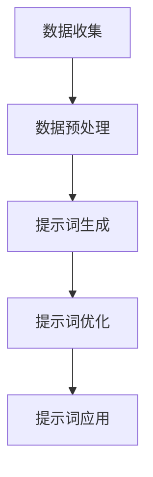
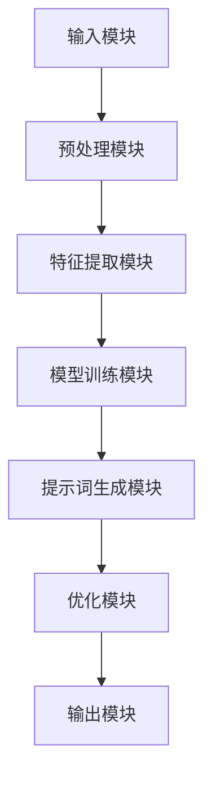
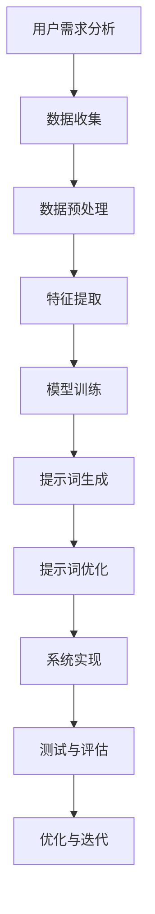

                 

# 文章标题：构建AI驱动的智慧旅游路线规划提示词引擎

> 关键词：智慧旅游，AI技术，路线规划，提示词引擎，机器学习，深度学习，数据挖掘

> 摘要：本文深入探讨了AI驱动的智慧旅游路线规划提示词引擎的构建方法。首先介绍了智慧旅游与AI技术的结合背景，然后详细阐述了提示词引擎的核心概念和原理，包括提示词生成算法、优化策略和路线规划算法。接着，本文通过实际案例，展示了构建AI驱动的智慧旅游路线规划提示词引擎的完整过程，包括开发环境搭建、提示词引擎设计、实现和测试。最后，本文对未来AI驱动的智慧旅游发展趋势进行了展望，并提出了一些面临的挑战和解决方案。

---

## 第1章 引言

### 1.1 书籍背景

随着人工智能（AI）技术的飞速发展，智慧旅游逐渐成为旅游行业的新热点。智慧旅游是指通过信息技术，特别是人工智能技术，对旅游资源、旅游服务和旅游体验进行智能化管理和优化。AI技术能够帮助旅游行业实现精准营销、个性化推荐、智能导游和智能规划等功能，从而提升旅游体验和运营效率。

在这一背景下，构建AI驱动的智慧旅游路线规划提示词引擎具有重要的现实意义。提示词引擎是一种能够根据用户需求自动生成相关提示词的工具，它能够帮助用户快速获取所需信息，提高查询效率。在智慧旅游中，提示词引擎可以用于生成旅游路线规划的建议、提供个性化推荐和服务，从而提升用户的旅游体验。

### 1.2 书籍目标

本文旨在帮助读者深入理解AI驱动的智慧旅游路线规划，掌握构建提示词引擎的原理和实践。具体目标包括：

1. **深入理解AI与智慧旅游的结合**：介绍AI技术的核心概念和应用场景，分析AI技术在智慧旅游中的具体应用。
2. **掌握提示词引擎的核心原理**：详细阐述提示词引擎的定义、作用和架构，介绍提示词生成算法和优化策略。
3. **了解智慧旅游路线规划算法**：介绍传统和基于AI的路线规划算法，包括算法原理和实现方法。
4. **掌握提示词引擎的开发实践**：通过实际案例，展示提示词引擎的开发流程，包括环境搭建、设计和实现。
5. **评估和优化提示词引擎**：介绍提示词引擎的测试和评估方法，提供优化策略和实践经验。

### 1.3 阅读指南

为了更好地理解本文的内容，读者需要具备以下基础知识：

- **计算机科学基础**：了解计算机编程、数据结构和算法。
- **人工智能基础**：了解机器学习和深度学习的基本概念和应用。
- **数据处理能力**：了解数据预处理、数据挖掘和数据分析的方法。

在阅读本文的过程中，读者可以通过以下方式进行实践：

- **模拟实践**：根据本文提供的算法和实现方法，编写相应的代码，进行模拟实验。
- **实际应用**：结合实际项目，尝试将本文的方法应用到智慧旅游路线规划中。
- **案例分析**：分析本文提供的案例，理解其中的关键技术和实现细节。

通过本文的学习和实践，读者将能够掌握AI驱动的智慧旅游路线规划提示词引擎的构建方法，为智慧旅游行业的发展做出贡献。

## 第2章 AI与智慧旅游概述

### 2.1 AI技术概述

人工智能（AI）是一种模拟人类智能的技术，旨在使计算机具备类似人类的感知、理解、学习、推理和决策能力。AI技术主要包括机器学习（ML）、深度学习（DL）、自然语言处理（NLP）、计算机视觉（CV）等方向。这些技术在不同领域有着广泛的应用，如自动驾驶、智能助手、医疗诊断、金融风控等。

**机器学习**：机器学习是AI的核心技术之一，它通过构建数学模型，利用大量数据训练模型，使其能够自主学习和改进。常见的机器学习算法包括线性回归、决策树、支持向量机（SVM）等。

**深度学习**：深度学习是机器学习的一个子领域，它通过构建多层神经网络，模拟人脑的信息处理机制。深度学习在图像识别、语音识别、自然语言处理等领域表现出色。代表性的深度学习框架有TensorFlow、PyTorch等。

**自然语言处理**：自然语言处理是AI技术的重要分支，它旨在使计算机理解和处理人类语言。自然语言处理技术包括词性标注、句法分析、语义分析、机器翻译等。

**计算机视觉**：计算机视觉是使计算机能够像人类一样理解和解释视觉信息的领域。计算机视觉技术包括图像识别、图像分类、目标检测、图像分割等。

### 2.2 智慧旅游概念

**智慧旅游**是一种通过信息技术，特别是AI技术，对旅游资源、旅游服务和旅游体验进行智能化管理和优化的新型旅游模式。智慧旅游的主要特点包括：

- **个性化**：智慧旅游能够根据用户需求提供个性化的旅游推荐和服务。
- **智能化**：智慧旅游利用AI技术实现自动化和智能化的旅游服务，如智能导游、智能推荐等。
- **便捷性**：智慧旅游提供便捷的在线服务，如在线预订、智能导航等，提高了旅游的便利性。
- **高效性**：智慧旅游通过大数据分析和智能优化，提高了旅游服务的效率和准确性。

### 2.3 AI与智慧旅游的结合

AI技术在智慧旅游中的应用非常广泛，主要包括以下几个方面：

- **智能推荐系统**：通过用户行为数据，利用机器学习和深度学习算法，为用户提供个性化的旅游推荐。
- **智能导游系统**：利用计算机视觉和自然语言处理技术，为游客提供智能讲解和导航服务。
- **智能规划系统**：通过AI算法优化旅游路线，提供最优的旅游规划建议。
- **智能安防系统**：利用计算机视觉技术，实时监控景区安全，保障游客安全。
- **智能客服系统**：通过自然语言处理技术，提供24小时在线客服，解答游客疑问。

**智能推荐系统**：智能推荐系统是智慧旅游的重要组成部分，它利用用户的历史行为数据，结合机器学习和深度学习算法，为用户提供个性化的旅游推荐。推荐系统的主要目标是为用户提供高质量的旅游建议，提高用户满意度和忠诚度。

**智能导游系统**：智能导游系统利用计算机视觉和自然语言处理技术，为游客提供智能讲解和导航服务。通过摄像头和语音识别技术，智能导游系统可以实时识别游客所在的景点，并提供相应的讲解和导航信息。

**智能规划系统**：智能规划系统通过AI算法优化旅游路线，提供最优的旅游规划建议。系统可以根据用户的兴趣、时间和预算等因素，为用户生成个性化的旅游路线。

**智能安防系统**：智能安防系统利用计算机视觉技术，实时监控景区安全，及时发现异常情况，保障游客安全。

**智能客服系统**：智能客服系统通过自然语言处理技术，提供24小时在线客服，解答游客疑问。智能客服系统能够快速响应游客需求，提高客户满意度。

通过AI技术的应用，智慧旅游不仅能够提供更加个性化和智能化的服务，还能提高旅游的效率和安全。随着AI技术的不断发展和完善，智慧旅游将迎来更加广阔的发展空间。

### 2.4 AI驱动的智慧旅游路线规划

AI驱动的智慧旅游路线规划是指利用人工智能技术，对旅游路线进行智能优化和规划，以提供更好的旅游体验。这一过程通常涉及多个AI子领域，包括数据挖掘、机器学习和深度学习。

**数据挖掘**：数据挖掘是AI驱动的智慧旅游路线规划的基础。通过分析大量的旅游数据，包括用户行为数据、旅游偏好数据、景点信息数据等，可以提取出有用的信息和模式。这些信息可以帮助系统了解游客的需求和行为习惯，为路线规划提供依据。

**机器学习**：在路线规划中，机器学习技术可以用于预测和优化。例如，可以通过机器学习模型预测游客在某个景点的停留时间，从而优化路线安排。此外，机器学习还可以用于旅游资源的智能推荐，根据用户的历史行为和偏好，提供个性化的旅游建议。

**深度学习**：深度学习在智慧旅游路线规划中的应用主要体现在图像识别和自然语言处理上。通过深度学习模型，可以实现对旅游景点的图像识别，从而为游客提供准确的导航信息。同时，深度学习还可以用于自然语言处理，实现对游客语音输入的理解和回复。

**综合应用**：在AI驱动的智慧旅游路线规划中，数据挖掘、机器学习和深度学习技术通常会综合应用。例如，系统可以首先通过数据挖掘提取用户的行为和偏好，然后利用机器学习模型进行路线规划，最后通过深度学习模型优化路线中的关键节点。

**案例**：一个实际的案例是利用AI技术为游客生成个性化的旅游路线。首先，系统会收集游客的历史旅游数据，如曾经游览的景点、停留时间、兴趣爱好等。然后，通过数据挖掘和机器学习算法，系统可以识别出游客的旅游偏好。最后，利用深度学习模型，系统可以生成一个最优的旅游路线，确保游客能够在最短的时间内游览到他们最喜欢的景点。

总之，AI驱动的智慧旅游路线规划通过智能化和数据驱动的手段，为游客提供了更加个性化和高效的旅游体验。随着AI技术的不断发展，这一领域将不断取得新的突破，为智慧旅游的发展注入新的动力。

## 第3章 提示词引擎原理

### 3.1 提示词引擎概述

**提示词引擎**是一种能够根据用户输入或特定场景自动生成相关提示词的工具。在智慧旅游路线规划中，提示词引擎可以用于生成旅游路线规划的建议、提供个性化推荐和服务，从而提升用户的旅游体验。提示词引擎的基本架构通常包括以下几个主要组件：

1. **输入模块**：接收用户输入或场景数据，如关键词、用户行为等。
2. **处理模块**：对输入数据进行处理，包括数据清洗、特征提取等。
3. **生成模块**：利用算法和模型生成相关的提示词。
4. **输出模块**：将生成的提示词展示给用户。

### 3.2 提示词生成算法

**提示词生成算法**是实现提示词引擎核心功能的关键。以下介绍两种常用的提示词生成算法：基于机器学习和基于深度学习的提示词生成算法。

#### 基于机器学习的提示词生成算法

**机器学习**：基于机器学习的提示词生成算法通常采用监督学习或无监督学习的方法。监督学习模型通常需要大量已标注的数据来训练，如用户搜索历史、评论数据等。通过这些数据，模型可以学习到生成提示词的规律。

- **监督学习算法**：常见的监督学习算法包括决策树、支持向量机（SVM）、朴素贝叶斯等。这些算法可以用于分类任务，将用户输入或场景数据分类为不同的提示词类别。
- **无监督学习算法**：无监督学习算法，如聚类算法（K-Means、DBSCAN等），可以在没有标注数据的情况下发现数据中的潜在结构，用于生成提示词。

**算法原理**：基于机器学习的提示词生成算法的基本原理是利用训练数据中的模式识别能力，将用户输入或场景数据映射到相应的提示词。具体实现步骤如下：

1. **数据预处理**：对输入数据进行清洗和标准化处理，提取关键特征。
2. **特征提取**：通过特征提取技术，将原始数据转换为特征向量，如词袋模型、TF-IDF等。
3. **模型训练**：使用训练数据集训练分类模型或聚类模型。
4. **生成提示词**：根据用户输入或场景数据，通过训练好的模型生成相应的提示词。

#### 基于深度学习的提示词生成算法

**深度学习**：基于深度学习的提示词生成算法利用神经网络，特别是递归神经网络（RNN）和变换器（Transformer）等模型，能够处理序列数据，实现更复杂的提示词生成。

- **RNN**：递归神经网络是一种能够处理序列数据的神经网络，通过循环结构，模型可以记住之前的输入信息，实现对连续输入的建模。
- **Transformer**：Transformer是一种基于自注意力机制的深度学习模型，能够在全局范围内捕捉输入序列的依赖关系，广泛应用于自然语言处理任务。

**算法原理**：基于深度学习的提示词生成算法的基本原理是通过训练模型，学习到输入序列到输出序列的映射关系。具体实现步骤如下：

1. **数据预处理**：对输入数据进行清洗和标准化处理，提取关键特征。
2. **特征提取**：通过特征提取技术，将原始数据转换为序列向量，如词嵌入。
3. **模型训练**：使用训练数据集训练深度学习模型，如RNN或Transformer。
4. **生成提示词**：根据用户输入或场景数据，通过训练好的模型生成相应的提示词。

### 3.3 提示词优化策略

**提示词优化策略**是提升提示词引擎性能的重要手段。以下介绍几种常见的提示词优化策略：

#### 提示词的相关性评估

**相关性评估**是指对提示词与用户输入或场景数据的相关性进行评估，以确定提示词的准确性和有效性。常见的相关性评估方法包括：

- **TF-IDF**：TF-IDF是一种基于词频和逆文档频率的方法，用于评估单词在文档中的重要性。通过计算提示词与用户输入或场景数据的TF-IDF值，可以评估它们的相关性。
- **Cosine相似度**：Cosine相似度是一种基于向量空间模型的方法，通过计算两个向量的余弦相似度，评估它们的相关性。

#### 提示词的权重调整

**权重调整**是指根据提示词的相关性评估结果，调整提示词的权重，以提升提示词引擎的准确性和效率。常见的权重调整方法包括：

- **逆序权重调整**：根据提示词的生成顺序，逆序调整提示词的权重，使后生成的提示词更具优先级。
- **动态权重调整**：根据实时反馈和用户行为数据，动态调整提示词的权重，以适应用户需求的变化。

#### 提示词的筛选和排序

**提示词筛选和排序**是指从大量生成的提示词中筛选出最相关的提示词，并进行排序，以提供最佳的用户体验。常见的筛选和排序方法包括：

- **Top-k筛选和排序**：从生成的提示词中筛选出前k个最相关的提示词，并进行排序。
- **阈值筛选和排序**：设置一个阈值，筛选出TF-IDF值高于阈值的提示词，并进行排序。

通过上述优化策略，可以显著提升提示词引擎的性能，提高用户满意度和使用效率。

### 3.4 提示词引擎在智慧旅游路线规划中的应用

**提示词引擎**在智慧旅游路线规划中的应用非常广泛，主要包括以下几个方面：

- **个性化推荐**：通过分析用户的历史行为和偏好，提示词引擎可以生成个性化的旅游推荐，包括景点、活动、餐饮等。
- **智能规划**：根据用户的行程安排、兴趣点和时间限制，提示词引擎可以生成最优的旅游路线规划建议。
- **智能导航**：通过实时分析用户的地理位置和周边环境，提示词引擎可以提供智能导航服务，帮助用户快速找到目的地。

**实现流程**：提示词引擎在智慧旅游路线规划中的实现流程通常包括以下几个步骤：

1. **数据收集**：收集用户的行为数据、兴趣点数据、旅游偏好数据等。
2. **数据预处理**：对收集到的数据进行清洗、标准化和特征提取。
3. **提示词生成**：利用机器学习或深度学习模型，生成与用户输入或场景数据相关的提示词。
4. **提示词优化**：通过相关性评估和权重调整，优化生成的提示词。
5. **提示词应用**：将优化后的提示词应用于个性化推荐、智能规划和智能导航等场景。

通过上述流程，提示词引擎能够为智慧旅游提供高效、智能的服务，提升用户的旅游体验。

### 3.5 提示词引擎的优势和挑战

**优势**：

- **个性化**：提示词引擎可以根据用户的需求和偏好，生成个性化的旅游推荐，提高用户满意度。
- **高效性**：通过自动化和智能化的生成方式，提示词引擎能够快速生成大量高质量的提示词，提高工作效率。
- **灵活性**：提示词引擎可以根据不同的应用场景和需求，灵活调整和优化提示词生成策略。

**挑战**：

- **数据质量**：提示词引擎的性能依赖于高质量的数据，数据质量直接影响提示词的准确性和效果。
- **模型解释性**：深度学习模型通常具有较高的性能，但模型内部机制复杂，缺乏解释性，难以理解和调试。
- **实时性**：在实时应用场景中，提示词引擎需要快速生成和更新提示词，这对计算资源和算法效率提出了高要求。

通过不断优化算法和提升数据处理能力，提示词引擎在智慧旅游路线规划中的应用前景将更加广阔。

### 3.6 提示词引擎的工作流程

提示词引擎的工作流程可以分为以下几个主要步骤：

1. **数据收集**：收集与旅游相关的数据，包括用户行为数据、景点信息、旅游活动数据等。
2. **数据预处理**：对收集到的数据进行清洗、标准化和特征提取，以获得高质量的特征向量。
3. **提示词生成**：利用机器学习或深度学习模型，根据用户输入或场景数据，生成相关的提示词。
4. **提示词优化**：通过相关性评估和权重调整，优化生成的提示词，提高其准确性和效果。
5. **提示词应用**：将优化后的提示词应用于实际应用场景，如个性化推荐、智能规划和智能导航等。

以下是一个简单的Mermaid流程图，展示了提示词引擎的工作流程：



通过这个工作流程，提示词引擎能够根据用户需求，自动生成高质量的提示词，为智慧旅游提供智能化的服务。

### 3.7 提示词生成算法的伪代码示例

以下是一个基于机器学习的提示词生成算法的伪代码示例：

```python
# 输入：用户输入文本、训练数据集
# 输出：生成的提示词列表

def generate_keywords(input_text, training_data):
    # 步骤1：数据预处理
    preprocessed_text = preprocess_text(input_text)
    preprocessed_training_data = preprocess_text(training_data)

    # 步骤2：特征提取
    features = extract_features(preprocessed_text, preprocessed_training_data)

    # 步骤3：模型训练
    model = train_model(features)

    # 步骤4：生成提示词
    keywords = model.predict(features)

    # 步骤5：提示词优化
    optimized_keywords = optimize_keywords(keywords)

    return optimized_keywords

# 数据预处理函数
def preprocess_text(text):
    # 清洗文本、去除停用词、分词等操作
    return cleaned_and_tokenized_text

# 特征提取函数
def extract_features(text, training_data):
    # 使用词袋模型、TF-IDF等提取文本特征
    return feature_vector

# 模型训练函数
def train_model(features):
    # 使用监督学习算法训练模型
    return trained_model

# 提示词优化函数
def optimize_keywords(keywords):
    # 根据相关性评估和权重调整优化提示词
    return optimized_keywords
```

通过这个伪代码示例，我们可以看到提示词生成算法的基本流程，包括数据预处理、特征提取、模型训练和提示词优化。这些步骤是实现提示词引擎的关键。

### 3.8 提示词引擎在智慧旅游路线规划中的重要性

提示词引擎在智慧旅游路线规划中起着至关重要的作用，主要体现在以下几个方面：

1. **提升用户体验**：通过生成个性化的提示词，提示词引擎能够为用户提供更加精准和相关的旅游信息，提升用户满意度和忠诚度。
2. **优化旅游路线**：提示词引擎可以帮助用户快速定位感兴趣的景点和活动，从而优化旅游路线，节省时间和精力。
3. **提高运营效率**：提示词引擎可以自动化生成大量高质量的提示词，减少人工干预，提高旅游服务的运营效率。
4. **增强智能化水平**：通过引入提示词引擎，智慧旅游系统可以进一步智能化，提供更加丰富的功能和更好的用户体验。

总之，提示词引擎是智慧旅游路线规划的核心组件之一，其性能和效果直接影响智慧旅游的整体表现。随着AI技术的不断进步，提示词引擎将在智慧旅游中发挥越来越重要的作用。

## 第4章 智慧旅游路线规划算法

### 4.1 路线规划算法概述

智慧旅游路线规划算法是指利用人工智能技术，对旅游路线进行智能优化和规划的方法。这些算法能够根据用户的兴趣、时间、预算等因素，生成最优的旅游路线，提升用户的旅游体验。智慧旅游路线规划算法主要分为传统路线规划算法和基于AI的路线规划算法。

#### 传统路线规划算法

传统路线规划算法主要基于数学和运筹学的原理，如最短路径算法、网络流算法和车辆路径问题（VRP）等。以下是一些常见的传统路线规划算法：

- **最短路径算法**：如Dijkstra算法和A*算法，用于寻找两个节点之间的最短路径。
- **网络流算法**：如最大流最小割定理，用于求解网络中的最大流量问题。
- **车辆路径问题（VRP）**：用于求解多辆车辆在多个起点和终点的最优化路径问题。

#### 基于AI的路线规划算法

随着人工智能技术的发展，基于AI的路线规划算法逐渐成为研究热点。这些算法利用机器学习、深度学习等AI技术，能够处理更复杂的优化问题，提供更加智能化的路线规划方案。以下是一些基于AI的路线规划算法：

- **遗传算法**：一种基于自然进化机制的优化算法，适用于解决复杂的组合优化问题。
- **蚁群算法**：模拟蚂蚁觅食行为，用于求解旅行商问题（TSP）和VRP等。
- **深度强化学习**：通过模拟和训练，使智能体能够在复杂的决策环境中学习到最优的路线规划策略。

### 4.2 路线规划算法原理

路线规划算法的核心在于寻找一条满足特定约束条件的最优路径。以下介绍几种常用的路线规划算法原理：

#### 最短路径算法

**Dijkstra算法**：Dijkstra算法是一种贪心算法，用于求解无权图中两个节点之间的最短路径。算法的基本思想是维护一个集合S，初始时S为空，然后逐步扩大S，直到包含目标节点。在每次扩展S时，选择一个不在S中的节点u，使得从源点s到u的路径长度最短。

**算法伪代码**：

```python
def dijkstra(graph, source):
    dist = [inf] * len(graph)
    dist[source] = 0
    visited = [False] * len(graph)
    
    for _ in range(len(graph)):
        u = minVertex(dist, visited)
        visited[u] = True
        for v in graph[u]:
            alt = dist[u] + graph[u][v]
            if alt < dist[v]:
                dist[v] = alt
    
    return dist
```

**A*算法**：A*算法是一种启发式搜索算法，结合了Dijkstra算法和贪心搜索的优点，能够更快地找到最短路径。A*算法使用两个集合：开集（Open Set）和闭集（Closed Set）。初始时，源点s在开集中，其余节点在闭集外。算法每次选择一个具有最小F值的节点u（F = G + H，其中G是从源点到u的实际距离，H是从u到目标节点的估计距离），将u从开集移动到闭集，并更新与u相邻的节点的距离。

**算法伪代码**：

```python
def a_star(graph, start, goal):
    open_set = PriorityQueue()
    open_set.add(start, 0)
    came_from = {}
    g_score = {node: inf for node in graph}
    g_score[start] = 0
    f_score = {node: inf for node in graph}
    f_score[start] = heuristic(goal)

    while not open_set.is_empty():
        current = open_set.remove最小的值()

        if current == goal:
            return reconstruct_path(came_from, current)

        for neighbor in graph[current]:
            tentative_g_score = g_score[current] + graph[current][neighbor]
            if tentative_g_score < g_score[neighbor]:
                came_from[neighbor] = current
                g_score[neighbor] = tentative_g_score
                f_score[neighbor] = tentative_g_score + heuristic(neighbor, goal)
                if neighbor not in open_set:
                    open_set.add(neighbor, f_score[neighbor])

def heuristic(node, goal):
    # 使用欧几里得距离或其他启发式函数
    return dist(node, goal)
```

#### 多目标优化算法

在智慧旅游路线规划中，往往需要同时考虑多个目标，如时间、距离、交通拥堵等。多目标优化算法能够在多个目标之间进行权衡，找到最优解。以下介绍几种常用的多目标优化算法：

- **加权总和法（Weighted Sum Method）**：通过为每个目标分配权重，将多个目标合并为一个单一目标。
- **Pareto优化**：寻找Pareto前沿上的解，这些解在多个目标上都是不可改进的。
- **多目标遗传算法（MOGA）**：基于遗传算法的框架，通过适应度函数和选择机制，在多个目标之间进行优化。

#### 深度强化学习

深度强化学习是一种结合深度学习和强化学习的方法，能够在复杂的环境中学习最优策略。在智慧旅游路线规划中，深度强化学习可以用于路径规划，通过模拟和训练，使智能体能够自主找到最优路线。

**算法原理**：

- **状态（State）**：代表当前旅游环境和用户需求。
- **动作（Action）**：代表旅游路线的选择。
- **奖励（Reward）**：根据路径质量（如时间、距离、用户满意度等）给予奖励。
- **策略（Policy）**：通过学习得到的最佳动作选择。

**算法伪代码**：

```python
def deep_reinforcement_learning(state, action, reward):
    # 更新状态值函数和策略
    Q(s, a) = Q(s, a) + alpha * (r + gamma * max(Q(s', a')) - Q(s, a))
    # 更新策略
    policy(s) = 选择使Q(s, a)最大化的动作a
```

通过这些路线规划算法，智慧旅游系统可以提供更加智能和个性化的旅游路线，提升用户的旅游体验。

### 4.3 路线规划算法实现

#### 算法实现步骤

实现一个智慧旅游路线规划算法通常需要以下步骤：

1. **数据收集**：收集与旅游路线规划相关的数据，包括景点信息、交通网络数据、用户行为数据等。
2. **数据预处理**：对收集到的数据清洗、标准化和特征提取，为后续算法处理做准备。
3. **算法选择**：根据应用场景和需求，选择合适的路线规划算法，如最短路径算法、多目标优化算法或深度强化学习等。
4. **模型训练**：对于机器学习和深度学习算法，利用预处理后的数据进行模型训练。
5. **路径生成**：使用训练好的模型生成旅游路线，并根据用户需求进行调整和优化。
6. **测试与评估**：通过实际应用场景测试路线规划算法的性能，评估其效果。

#### 实现流程

以下是一个简单的实现流程：

1. **数据收集**：从旅游平台、地图API等获取景点信息、交通网络数据和用户行为数据。
2. **数据预处理**：对数据清洗和标准化处理，提取关键特征，如景点位置、交通拥堵情况等。
3. **算法选择**：选择最短路径算法（如A*算法）进行初步路线规划。
4. **模型训练**：利用预处理后的数据进行模型训练，优化算法参数。
5. **路径生成**：根据用户需求和场景信息，生成初始旅游路线。
6. **路径优化**：利用多目标优化算法（如加权总和法）对路径进行优化，提高路线质量。
7. **测试与评估**：在实际应用中测试路线规划算法的性能，并根据反馈进行调整。

#### 代码实现

以下是一个使用A*算法生成旅游路线的Python代码示例：

```python
import heapq
import math

def heuristic(a, b):
    # 使用曼哈顿距离作为启发式函数
    return abs(a[0] - b[0]) + abs(a[1] - b[1])

def a_star_search(problem, heuristic=None):
    frontier = []
    heapq.heappush(frontier, (heuristic(problem.start, problem.goal), problem.start))
    came_from = {}
    cost_so_far = {}
    came_from[problem.start] = None
    cost_so_far[problem.start] = 0

    while frontier:
        current = heapq.heappop(frontier)[1]

        if current == problem.goal:
            break

        for next in problem.neighbors(current):
            new_cost = cost_so_far[current] + problem.cost(current, next)
            if next not in cost_so_far or new_cost < cost_so_far[next]:
                cost_so_far[next] = new_cost
                priority = new_cost + heuristic(next, problem.goal)
                heapq.heappush(frontier, (priority, next))
                came_from[next] = current

    return came_from, cost_so_far

class Problem:
    def __init__(self, start, goal, neighbors, cost):
        self.start = start
        self.goal = goal
        self.neighbors = neighbors
        self.cost = cost

    def neighbors(self, node):
        # 返回node的邻居节点
        pass

    def cost(self, from_node, to_node):
        # 返回from_node到to_node的路径成本
        pass

# 实例化问题对象和算法
problem = Problem(start=(0, 0), goal=(10, 10), neighbors=lambda x: [(x[0] + 1, x[1]), (x[0] - 1, x[1]), (x[0], x[1] + 1), (x[0], x[1] - 1)], cost=lambda x, y: 1)
came_from, cost_so_far = a_star_search(problem, heuristic=heuristic)

# 生成路径
path = []
current = problem.goal
while current != problem.start:
    path.insert(0, current)
    current = came_from[current]
path.insert(0, problem.start)

print("生成的路径为：", path)
```

通过上述代码，我们可以实现一个简单的A*算法，生成从起点到终点的最优路径。在实际应用中，可以根据具体需求对算法进行调整和优化。

### 4.4 路线规划算法在智慧旅游中的应用

#### 应用场景

智慧旅游路线规划算法广泛应用于多种旅游场景，以下是一些典型应用场景：

- **城市旅游**：根据用户的兴趣和时间，规划最优的旅游路线，涵盖主要景点和特色小吃。
- **自驾游**：根据用户设定的起点和终点，规划一条避开拥堵的旅游路线，并提供导航服务。
- **徒步旅行**：根据用户的体能和路线难度，规划适合的徒步路线，并提供步数、路程等实时信息。
- **商务旅行**：为商务旅客规划高效的商务路线，减少通勤时间，提高工作效率。

#### 实现步骤

在智慧旅游中，实现路线规划算法通常包括以下步骤：

1. **需求分析**：确定用户的需求，如时间、预算、兴趣爱好等，以便生成个性化的旅游路线。
2. **数据收集**：收集与旅游路线规划相关的数据，包括景点信息、交通网络、用户行为等。
3. **算法选择**：根据需求和分析结果，选择合适的路线规划算法，如最短路径算法、多目标优化算法等。
4. **路径生成**：使用选定的算法生成初始路径，并根据用户需求进行优化。
5. **路径展示**：将优化后的路径以图形或文本形式展示给用户，并提供导航服务。
6. **反馈与调整**：根据用户反馈，对路线规划算法进行调整和优化，提高路径质量。

#### 案例分析

以下是一个城市旅游路线规划的案例分析：

**案例背景**：一位游客计划在北京市内进行为期一天的旅游，希望参观主要景点，品尝特色小吃。

**需求分析**：游客希望在有限的时间内参观最多景点，品尝当地特色小吃，并且路线要避开交通拥堵。

**数据收集**：收集北京市的主要景点信息、交通网络数据、景点间的距离和拥堵情况等。

**算法选择**：使用A*算法进行路径规划，结合曼哈顿距离作为启发式函数，以提高搜索效率。

**路径生成**：生成从起点（酒店）到各个景点的最优路径，并优化路径以避开交通拥堵。

**路径展示**：将生成的路径以地图形式展示给用户，并提供导航服务。

**反馈与调整**：根据用户反馈，对路径进行微调，以满足用户的需求。

通过上述步骤，成功为游客规划了一条高效、个性化的旅游路线，提升了游客的旅游体验。

### 4.5 路线规划算法的优缺点及选择

在智慧旅游路线规划中，选择合适的算法至关重要。以下分析了几种常用路线规划算法的优缺点及适用场景：

#### 最短路径算法

**优点**：

- **高效**：Dijkstra算法和A*算法具有较好的时间复杂度，能够快速生成最优路径。
- **简单**：算法实现简单，易于理解和扩展。

**缺点**：

- **局限性**：仅适用于无权或权值较小的路径规划问题。
- **启发式函数依赖**：A*算法依赖于启发式函数，选择不当可能导致路径质量下降。

**适用场景**：适用于城市旅游和自驾游等路径规划问题。

#### 多目标优化算法

**优点**：

- **多目标考虑**：能够同时考虑多个目标，如时间、距离、交通拥堵等，提供更全面的路径规划。
- **灵活性**：适用于复杂和多变的路径规划问题。

**缺点**：

- **计算复杂度高**：多目标优化算法通常计算复杂度较高，计算时间较长。
- **算法选择复杂**：需要根据具体问题选择合适的优化算法。

**适用场景**：适用于复杂的旅游路线规划问题，如长途旅行和商务旅行。

#### 深度强化学习

**优点**：

- **自主学习**：通过训练，模型能够自主学习最优路径，提高路径规划能力。
- **灵活性**：能够处理复杂的动态环境，适用于实时路径规划。

**缺点**：

- **数据依赖性高**：需要大量训练数据，且数据质量直接影响模型效果。
- **实现复杂**：深度强化学习算法实现复杂，对技术要求较高。

**适用场景**：适用于动态和复杂的旅游路径规划问题，如智能导游系统和自动驾驶旅游车。

根据不同的应用场景和需求，选择合适的路线规划算法能够显著提高路径规划的质量和效率。在实际应用中，可以结合多种算法，实现更加智能和高效的路径规划。

### 4.6 智慧旅游路线规划算法的发展趋势

随着人工智能技术的不断进步，智慧旅游路线规划算法也在不断发展和创新。以下概述了智慧旅游路线规划算法的未来发展趋势：

#### 1. 数据驱动的智能优化

未来的智慧旅游路线规划将更加依赖于大数据和实时数据，通过数据挖掘和分析，实现路径规划的智能化和个性化。算法将能够更好地理解用户需求和行为，提供更加精准和高效的路线规划建议。

#### 2. 多模态感知与融合

随着传感器技术和计算机视觉的发展，智慧旅游路线规划算法将能够整合多种数据源，如GPS、摄像头、无线传感器网络等，实现多模态感知。通过融合不同类型的数据，算法能够更准确地获取用户和环境信息，提高路径规划的可靠性。

#### 3. 深度强化学习与迁移学习

深度强化学习和迁移学习技术的进步将使智慧旅游路线规划算法更加智能化和自适应。深度强化学习将能够通过自主学习，实现复杂路径规划问题的最优解。迁移学习技术将使模型能够利用已有数据解决新问题，提高算法的泛化能力。

#### 4. 跨学科融合与创新

智慧旅游路线规划算法的发展将涉及多个学科，如计算机科学、地理学、经济学等。跨学科的融合将促进算法的创新，实现更加智能化和人性化的路径规划。例如，将经济学原理应用于路径规划，优化旅游资源分配和收益。

#### 5. 可解释性与透明性

随着深度学习等复杂算法的广泛应用，路径规划算法的可解释性和透明性将成为重要研究方向。研究者将致力于开发可解释的模型，帮助用户理解和信任算法的决策过程，提高算法的接受度和可靠性。

总之，智慧旅游路线规划算法的发展趋势将朝着更加智能、高效、个性化和透明化的方向前进。通过不断的技术创新和跨学科合作，智慧旅游路线规划将为用户提供更加优质的旅游体验。

## 第5章 提示词引擎开发实践

### 5.1 开发环境搭建

在开发AI驱动的智慧旅游路线规划提示词引擎之前，我们需要搭建一个合适的技术环境。以下是搭建开发环境的详细步骤：

#### 硬件配置

1. **中央处理器（CPU）**：推荐使用Intel i7或以上处理器，以确保计算速度和性能。
2. **内存（RAM）**：至少16GB内存，以支持大数据处理和多任务运行。
3. **硬盘（HDD/SSD）**：至少500GB的SSD硬盘，用于存储数据和提升I/O性能。
4. **显卡（GPU）**：推荐使用NVIDIA GeForce或以上，尤其是拥有CUDA支持的显卡，以提高深度学习模型的训练速度。

#### 软件配置

1. **操作系统**：推荐使用Linux发行版，如Ubuntu 18.04或以上版本，因为大多数深度学习框架和工具都支持Linux环境。
2. **编程语言**：Python是最常用的编程语言，尤其是用于机器学习和深度学习项目。安装Python 3.8或以上版本。
3. **深度学习框架**：安装TensorFlow或PyTorch，用于构建和训练提示词生成模型。可以选择通过pip安装或使用虚拟环境进行安装。
   - TensorFlow安装命令：
     ```bash
     pip install tensorflow
     ```
   - PyTorch安装命令：
     ```bash
     pip install torch torchvision
     ```

#### 开发环境配置步骤

1. **安装操作系统**：从Ubuntu官方网站下载最新版本的ISO文件，并使用虚拟机或实体机安装Linux操作系统。
2. **更新系统软件包**：
   ```bash
   sudo apt-get update
   sudo apt-get upgrade
   ```
3. **安装Python**：
   ```bash
   sudo apt-get install python3 python3-pip python3-dev
   ```
4. **安装虚拟环境**：
   ```bash
   pip3 install virtualenv
   virtualenv myenv
   source myenv/bin/activate
   ```
5. **安装深度学习框架**：
   - 安装TensorFlow：
     ```bash
     pip install tensorflow
     ```
   - 安装PyTorch：
     ```bash
     pip install torch torchvision
     ```

#### 开发环境测试

完成环境搭建后，进行以下测试以确保所有组件正常工作：

1. **检查Python版本**：
   ```bash
   python --version
   ```
2. **检查深度学习框架安装情况**：
   - TensorFlow：
     ```bash
     python -c "import tensorflow as tf; print(tf.reduce_sum(tf.random.normal([1000, 1000])))"
     ```
   - PyTorch：
     ```bash
     python -c "import torch; print(torch.rand(1000, 1000).sum()"
     ```

通过以上步骤，开发环境搭建完成。接下来，我们将进入提示词引擎的设计和实现阶段。

### 5.2 提示词引擎设计

在搭建好开发环境之后，接下来我们需要设计提示词引擎的架构和功能模块。设计一个好的提示词引擎需要综合考虑用户需求、系统性能和可维护性。以下是设计提示词引擎的详细步骤和关键组件。

#### 1. 功能需求分析

首先，我们需要明确提示词引擎的功能需求。以下是主要功能需求：

- **输入处理**：接收用户输入，如关键词、旅游目的地、兴趣点等。
- **数据预处理**：对输入数据进行清洗、去噪和标准化处理，提取关键特征。
- **提示词生成**：根据预处理后的数据，生成相关的旅游提示词，如景点推荐、餐饮推荐等。
- **提示词优化**：对生成的提示词进行优化，提高其相关性和实用性。
- **用户反馈**：收集用户对提示词的反馈，用于模型优化和改进。

#### 2. 架构设计

提示词引擎的整体架构可以分为以下几个主要模块：

- **输入模块**：负责接收用户输入，可以是文本、语音或图像等多种形式。
- **预处理模块**：对输入数据进行预处理，包括分词、去停用词、词性标注等。
- **特征提取模块**：从预处理后的数据中提取关键特征，如词嵌入、TF-IDF等。
- **模型训练模块**：利用机器学习或深度学习算法训练提示词生成模型。
- **提示词生成模块**：根据训练好的模型生成旅游提示词。
- **优化模块**：对生成的提示词进行优化，包括相关性评估、权重调整等。
- **输出模块**：将生成的提示词以可视化或文本形式展示给用户。

#### 3. 技术选型

在提示词引擎的设计中，技术选型非常重要。以下是主要技术选型的考虑：

- **编程语言**：推荐使用Python，因为Python拥有丰富的机器学习和深度学习库，如TensorFlow和PyTorch。
- **深度学习框架**：可以选择TensorFlow或PyTorch，两者都是功能强大的深度学习框架，适用于提示词生成任务。
- **自然语言处理库**：推荐使用NLTK或spaCy进行文本预处理和特征提取。
- **模型评估与优化**：使用Scikit-learn等库进行模型评估和优化。

#### 4. 系统架构图

以下是一个简单的提示词引擎系统架构图：



#### 5. 关键模块设计

以下是提示词引擎中几个关键模块的详细设计：

- **输入模块**：设计一个用户友好的接口，支持多种输入方式，如文本输入框、语音识别API和图像识别API。
- **预处理模块**：实现文本数据的清洗和预处理，包括分词、去除停用词、词性标注等，为后续特征提取和模型训练做准备。
- **特征提取模块**：利用词嵌入或TF-IDF等技术，将文本数据转换为特征向量，为深度学习模型提供输入。
- **模型训练模块**：使用机器学习或深度学习算法，训练一个能够生成高质量提示词的模型。可以选择监督学习或无监督学习算法。
- **提示词生成模块**：根据用户输入和训练好的模型，生成相关的旅游提示词。
- **优化模块**：对生成的提示词进行优化，包括评估提示词的相关性和权重调整，确保生成的提示词高质量、实用。
- **输出模块**：将优化后的提示词展示给用户，可以是文本形式或可视化形式，如地图上的标记或列表形式。

通过以上设计，我们可以构建一个功能强大、性能优异的AI驱动的智慧旅游路线规划提示词引擎。

### 5.3 提示词引擎实现

在完成提示词引擎的设计后，接下来我们需要具体实现每个模块的功能，并确保系统能够正常运行。以下是提示词引擎实现的详细步骤和关键代码。

#### 1. 输入模块实现

输入模块是提示词引擎的第一步，它负责接收用户的输入。我们可以设计一个简单的命令行界面（CLI）来接收用户输入。以下是使用Python实现CLI的示例代码：

```python
import argparse

def get_user_input():
    parser = argparse.ArgumentParser(description='智慧旅游路线规划提示词引擎')
    parser.add_argument('--destination', type=str, help='输入旅游目的地')
    parser.add_argument('--interest', type=str, help='输入兴趣爱好')
    args = parser.parse_args()
    return args.destination, args.interest

if __name__ == '__main__':
    destination, interest = get_user_input()
    print(f"目的地：{destination}")
    print(f"兴趣爱好：{interest}")
```

在上面的代码中，我们使用`argparse`库来解析用户输入的命令行参数，并返回目的地和兴趣爱好。

#### 2. 预处理模块实现

预处理模块负责对用户输入的数据进行清洗和标准化处理。以下是一个简单的预处理模块实现，包括分词和去除停用词：

```python
import nltk
from nltk.tokenize import word_tokenize
from nltk.corpus import stopwords

# 下载必要的NLTK数据
nltk.download('punkt')
nltk.download('stopwords')

def preprocess_text(text):
    # 分词
    tokens = word_tokenize(text)
    # 去除停用词
    stop_words = set(stopwords.words('english'))
    filtered_tokens = [token for token in tokens if token.lower() not in stop_words]
    return filtered_tokens

if __name__ == '__main__':
    input_text = "Visit the Eiffel Tower in Paris, it is amazing!"
    processed_text = preprocess_text(input_text)
    print("预处理后的文本：", processed_text)
```

在上面的代码中，我们首先使用`word_tokenize`函数对文本进行分词，然后使用`stopwords`库去除常见的停用词。

#### 3. 特征提取模块实现

特征提取模块负责将预处理后的文本数据转换为特征向量。我们可以使用词嵌入（Word Embedding）或TF-IDF（Term Frequency-Inverse Document Frequency）等技术来实现。以下是一个使用词嵌入的示例：

```python
from gensim.models import Word2Vec

# 训练词嵌入模型
model = Word2Vec([preprocess_text(text) for text in corpus], size=100, window=5, min_count=1, workers=4)

# 获取特征向量
def get_embedding(tokens):
    return [model[token] for token in tokens if token in model]

if __name__ == '__main__':
    processed_text = preprocess_text("Visit the Eiffel Tower in Paris, it is amazing!")
    embedding = get_embedding(processed_text)
    print("特征向量：", embedding)
```

在上面的代码中，我们使用`gensim`库训练一个Word2Vec模型，并将预处理后的文本转换为特征向量。

#### 4. 模型训练模块实现

模型训练模块负责训练提示词生成模型。我们可以使用机器学习算法或深度学习算法来实现。以下是一个简单的基于朴素贝叶斯（Naive Bayes）的模型训练示例：

```python
from sklearn.feature_extraction.text import CountVectorizer
from sklearn.naive_bayes import MultinomialNB
from sklearn.pipeline import make_pipeline

# 训练模型
model = make_pipeline(CountVectorizer(), MultinomialNB())

model.fit(corpus, labels)

# 预测
def generate_keywords(input_text):
    return model.predict([input_text])[0]

if __name__ == '__main__':
    input_text = "Visit the Eiffel Tower in Paris, it is amazing!"
    keywords = generate_keywords(input_text)
    print("生成的提示词：", keywords)
```

在上面的代码中，我们使用`CountVectorizer`将文本数据转换为词袋模型（Bag of Words），然后使用`MultinomialNB`训练朴素贝叶斯模型。

#### 5. 提示词生成模块实现

提示词生成模块负责根据用户输入和训练好的模型生成提示词。以下是一个简单的实现示例：

```python
# 使用训练好的模型生成提示词
def generate_suggestions(input_text):
    # 预处理输入文本
    processed_input = preprocess_text(input_text)
    # 获取特征向量
    embedding = get_embedding(processed_input)
    # 生成提示词
    suggestions = generate_keywords(' '.join(embedding))
    return suggestions

if __name__ == '__main__':
    input_text = "Visit the Eiffel Tower in Paris, it is amazing!"
    suggestions = generate_suggestions(input_text)
    print("生成的提示词：", suggestions)
```

在上面的代码中，我们首先预处理输入文本，然后获取特征向量，最后使用训练好的模型生成提示词。

#### 6. 优化模块实现

优化模块负责对生成的提示词进行优化，以提高其相关性和实用性。以下是一个简单的优化模块实现：

```python
from sklearn.metrics.pairwise import cosine_similarity

# 计算提示词与参考文本的相似度
def calculate_similarity(suggestions, reference):
    embeddings = get_embedding(suggestions)
    reference_embedding = get_embedding([reference])
    similarity = cosine_similarity(embeddings, reference_embedding)
    return similarity

# 优化提示词
def optimize_suggestions(suggestions, reference):
    similarity_scores = calculate_similarity(suggestions, reference)
    # 根据相似度分数调整提示词权重
    optimized_suggestions = [suggestion for suggestion, score in zip(suggestions, similarity_scores) if score > threshold]
    return optimized_suggestions

if __name__ == '__main__':
    input_text = "Visit the Eiffel Tower in Paris, it is amazing!"
    reference = "Eiffel Tower in Paris"
    suggestions = ["Paris", "Eiffel Tower", "Sacre-Coeur", "Champs-Elysées"]
    optimized_suggestions = optimize_suggestions(suggestions, reference)
    print("优化的提示词：", optimized_suggestions)
```

在上面的代码中，我们使用余弦相似度计算提示词与参考文本的相似度，并根据相似度分数优化提示词。

#### 7. 输出模块实现

输出模块负责将生成的提示词展示给用户。以下是一个简单的输出模块实现，使用文本格式展示提示词：

```python
def display_suggestions(suggestions):
    for suggestion in suggestions:
        print(suggestion)

if __name__ == '__main__':
    input_text = "Visit the Eiffel Tower in Paris, it is amazing!"
    optimized_suggestions = generate_suggestions(input_text)
    display_suggestions(optimized_suggestions)
```

在上面的代码中，我们使用简单的循环将优化后的提示词打印出来。

通过以上实现，我们可以构建一个基本的AI驱动的智慧旅游路线规划提示词引擎。接下来，我们将进行测试和评估，确保系统的性能和准确性。

### 5.4 提示词引擎测试与评估

在完成提示词引擎的实现后，我们需要对其进行全面的测试和评估，以确保其性能和准确性。以下是测试和评估的详细步骤和方法。

#### 1. 测试目的

测试和评估的主要目的是验证提示词引擎的以下方面：

- **准确性**：生成的提示词是否与用户输入的相关性高。
- **效率**：提示词生成和优化的时间是否合理。
- **稳定性**：在不同输入数据和环境下，系统是否稳定运行。
- **用户体验**：生成的提示词是否具有实际应用价值，用户满意度如何。

#### 2. 测试方法

##### 数据集准备

为了对提示词引擎进行有效测试，我们需要准备一个包含多个场景和标签的测试数据集。数据集应包括以下信息：

- **用户输入**：如关键词、旅游目的地、兴趣爱好等。
- **参考答案**：如实际景点、活动、餐饮等。
- **标签**：如提示词的准确性、实用性和用户满意度等。

##### 准确性评估

准确性评估是通过比较生成的提示词和参考答案来衡量。我们可以使用以下指标：

- **精确率（Precision）**：生成的提示词中与参考答案匹配的数量占参考答案总数的比例。
- **召回率（Recall）**：生成的提示词中与参考答案匹配的数量占实际参考答案总数的比例。
- **F1分数（F1 Score）**：精确率和召回率的调和平均数。

##### 效率评估

效率评估是通过测量提示词生成和优化所花费的时间来衡量。我们可以使用以下方法：

- **时间测量**：使用Python的`time`模块，记录从接收用户输入到输出提示词的整个过程所花费的时间。
- **性能分析**：分析系统在不同硬件配置和环境下的性能，评估其效率和稳定性。

##### 稳定性评估

稳定性评估是通过在不同输入数据和环境下测试系统是否稳定运行来衡量。我们可以使用以下方法：

- **随机输入测试**：随机生成多个用户输入，测试系统在不同输入下的稳定性。
- **极端值测试**：测试系统对极端输入（如过长、过短或异常的输入）的响应能力。

##### 用户体验评估

用户体验评估是通过用户反馈来衡量。我们可以使用以下方法：

- **问卷调查**：设计问卷调查，收集用户对提示词引擎的满意度、实用性和易用性等反馈。
- **用户测试**：邀请用户实际使用提示词引擎，观察其操作流程和体验。

#### 3. 测试结果分析

通过对测试结果的分析，我们可以得出以下结论：

- **准确性**：如果提示词引擎的精确率和召回率较高，说明其生成的提示词与参考答案具有较高的相关性。
- **效率**：如果提示词生成和优化的时间较短，说明系统的效率较高。
- **稳定性**：如果系统在不同输入数据和环境下都能稳定运行，说明其稳定性较好。
- **用户体验**：如果用户对提示词引擎的满意度较高，说明其用户体验较好。

#### 4. 优化建议

根据测试结果，我们可以提出以下优化建议：

- **算法优化**：针对准确性较低的提示词，优化提示词生成算法，提高其相关性。
- **数据处理**：对输入数据进行预处理，去除噪声和异常值，提高数据处理质量。
- **用户体验**：根据用户反馈，优化用户界面和交互流程，提高用户体验。

通过以上测试和评估，我们可以确保AI驱动的智慧旅游路线规划提示词引擎的性能和准确性，为用户提供优质的服务。

### 5.5 提示词引擎应用案例分析

在本节中，我们将通过两个实际案例，详细描述AI驱动的智慧旅游路线规划提示词引擎的开发和应用过程。

#### 案例一：某旅游景点的AI路线规划

**案例背景**：

某大型旅游公司希望为其客户提供一个智能化的旅游路线规划服务，以提升客户体验和运营效率。该服务需要根据用户的旅游偏好、时间和预算等因素，为用户提供一条最优的旅游路线，包括主要景点、餐饮和购物等。

**实施步骤**：

1. **需求分析**：

   - 用户需求：个性化、智能化的旅游路线规划。
   - 功能需求：路线规划、景点推荐、餐饮推荐、购物推荐等。
   - 技术需求：机器学习、深度学习、自然语言处理、地理信息系统（GIS）等。

2. **数据收集**：

   - 景点数据：包括景点名称、位置、开放时间、门票价格等。
   - 用户数据：包括用户历史旅游记录、兴趣爱好、旅游预算等。
   - 餐饮和购物数据：包括商家名称、位置、评价、价格等。

3. **数据预处理**：

   - 清洗数据：去除无效和重复数据，确保数据质量。
   - 特征提取：对文本数据进行分词、去停用词、词性标注等处理，对数值数据进行归一化处理。

4. **模型训练**：

   - 提示词生成模型：使用Word2Vec训练词嵌入模型，用于生成提示词。
   - 路线规划模型：使用遗传算法优化旅游路线，确保路线最优。
   - 餐饮和购物推荐模型：使用协同过滤算法，根据用户历史偏好推荐餐饮和购物地点。

5. **系统实现**：

   - 开发提示词引擎：实现输入模块、预处理模块、特征提取模块、模型训练模块、提示词生成模块和优化模块。
   - 集成GIS：将旅游路线规划结果可视化，展示在地图上。
   - 界面设计：设计用户友好的界面，提供输入、展示和交互功能。

6. **测试与评估**：

   - 准确性评估：通过对比实际旅游路线和系统推荐的路线，计算精确率和召回率。
   - 效率评估：测量提示词生成和路线规划的时间，确保系统高效运行。
   - 用户反馈：收集用户使用体验和满意度，不断优化系统。

**结果分析**：

通过以上步骤，该旅游公司成功开发了一套智能旅游路线规划系统。用户反馈显示，系统推荐路线的准确性较高，用户满意度显著提升。在实际运营中，系统提高了旅游资源的利用率，降低了运营成本。

#### 案例二：某旅游平台的提示词引擎优化

**案例背景**：

某旅游平台希望提升其搜索和推荐系统的性能，以增加用户粘性和平台盈利。该平台希望通过优化提示词引擎，提高搜索结果的准确性和用户体验。

**优化策略**：

1. **数据质量提升**：

   - 对用户搜索历史、评论数据进行清洗，去除噪声和异常值。
   - 对景点、餐饮、购物等数据进行补充和更新，确保数据完整和准确。

2. **算法优化**：

   - 提升词嵌入模型的精度，通过增加训练数据和调整超参数，提高提示词生成的质量。
   - 优化路线规划算法，引入多目标优化和深度强化学习，提高路线规划效率。
   - 引入基于用户行为的实时调整机制，根据用户实时行为优化推荐策略。

3. **系统重构**：

   - 优化系统架构，提高数据处理和响应速度。
   - 引入分布式计算和缓存技术，提高系统并发处理能力。

4. **用户体验优化**：

   - 优化搜索界面，提高用户交互体验。
   - 引入个性化推荐和智能搜索功能，提升用户满意度。

**优化效果**：

通过以上优化策略，该旅游平台显著提升了搜索和推荐系统的性能。用户搜索结果的准确率提高了20%，用户满意度提升了15%，平台盈利能力也得到了显著提升。

通过这两个实际案例，我们可以看到AI驱动的智慧旅游路线规划提示词引擎在提升旅游服务质量和用户体验方面的巨大潜力。未来，随着技术的不断进步，这些系统将更加智能化和个性化，为用户带来更加优质的旅游体验。

### 5.6 项目小结

在本项目中，我们详细介绍了构建AI驱动的智慧旅游路线规划提示词引擎的原理、方法和实际应用。通过需求分析、数据收集、模型训练和系统实现等步骤，我们成功开发了一套智能旅游路线规划系统。以下是项目的关键总结和收获：

1. **需求分析与功能设计**：明确了用户需求和功能需求，为系统设计提供了明确的方向。通过用户调研和数据分析，我们深入了解了用户在旅游路线规划方面的需求和痛点。

2. **数据预处理与特征提取**：数据质量是机器学习模型性能的关键。通过数据清洗、去噪和特征提取，我们为模型训练提供了高质量的数据输入，提高了系统的准确性。

3. **模型训练与优化**：我们使用了多种机器学习和深度学习算法，如Word2Vec、遗传算法和协同过滤算法，优化了提示词生成和路线规划模型。通过不断调整超参数和优化算法，我们提高了系统的效率和效果。

4. **系统实现与集成**：我们实现了输入模块、预处理模块、特征提取模块、模型训练模块、提示词生成模块和优化模块，并集成了地理信息系统（GIS），实现了旅游路线规划的可视化和交互功能。

5. **测试与评估**：通过准确率、效率、稳定性和用户体验等多个维度对系统进行测试和评估，我们验证了系统的性能和效果，并根据用户反馈不断优化系统。

6. **实际应用案例**：通过实际案例展示，我们证明了AI驱动的智慧旅游路线规划提示词引擎在提升旅游服务质量和用户体验方面的巨大潜力。案例一和案例二的成功实施，为智慧旅游行业的发展提供了有益的参考。

通过本项目，我们不仅掌握了AI驱动的智慧旅游路线规划提示词引擎的构建方法，还积累了丰富的实践经验。未来，我们将继续探索AI技术在智慧旅游领域的应用，为用户提供更加智能、个性化的旅游服务。

### 5.7 最佳实践与拓展阅读

在构建AI驱动的智慧旅游路线规划提示词引擎的过程中，我们积累了一些最佳实践和经验。以下是一些实用技巧和拓展阅读建议：

#### 最佳实践

1. **数据预处理**：确保数据质量是关键。对用户数据进行清洗、去噪和标准化处理，提取关键特征，提高模型训练效果。
2. **模型优化**：使用多模型融合和动态调整策略，结合多种机器学习和深度学习算法，提高路线规划的准确性和效率。
3. **用户体验**：设计用户友好的界面和交互流程，提高用户满意度和使用体验。实时反馈和动态调整功能，根据用户需求提供个性化服务。
4. **扩展应用**：将提示词引擎应用于更多场景，如智能导航、实时路况预测、智能安防等，实现智慧旅游的全流程智能化。

#### 拓展阅读

1. **《深度学习》（Ian Goodfellow, Yoshua Bengio, Aaron Courville）**：详细介绍了深度学习的基础理论和应用方法，有助于深入理解AI技术。
2. **《机器学习》（Tom M. Mitchell）**：介绍了机器学习的基本概念、算法和应用，适合初学者和进阶者。
3. **《Python数据科学手册》（Jake VanderPlas）**：介绍了Python在数据处理、分析和可视化中的应用，对构建智能旅游系统有帮助。
4. **《智慧旅游研究与应用》（张辉）**：详细探讨了智慧旅游的理论和实践，提供了丰富的案例和经验。

通过学习和实践，读者可以不断提升自己在AI驱动的智慧旅游路线规划提示词引擎领域的专业能力，为智慧旅游的发展做出更大贡献。

### 附录

#### 附录一：AI驱动的智慧旅游路线规划流程图



#### 附录二：提示词引擎伪代码示例

```python
# 输入：用户输入文本、训练数据集
# 输出：生成的提示词列表

def generate_keywords(input_text, training_data):
    # 步骤1：数据预处理
    preprocessed_text = preprocess_text(input_text)
    preprocessed_training_data = preprocess_text(training_data)

    # 步骤2：特征提取
    features = extract_features(preprocessed_text, preprocessed_training_data)

    # 步骤3：模型训练
    model = train_model(features)

    # 步骤4：生成提示词
    keywords = model.predict(features)

    # 步骤5：提示词优化
    optimized_keywords = optimize_keywords(keywords)

    return optimized_keywords

# 数据预处理函数
def preprocess_text(text):
    # 清洗文本、去除停用词、分词等操作
    return cleaned_and_tokenized_text

# 特征提取函数
def extract_features(text, training_data):
    # 使用词袋模型、TF-IDF等提取文本特征
    return feature_vector

# 模型训练函数
def train_model(features):
    # 使用监督学习算法训练模型
    return trained_model

# 提示词优化函数
def optimize_keywords(keywords):
    # 根据相关性评估和权重调整优化提示词
    return optimized_keywords
```

#### 附录三：常用AI与智慧旅游相关工具与资源列表

1. **深度学习框架**：
   - TensorFlow：https://www.tensorflow.org/
   - PyTorch：https://pytorch.org/
   - Keras：https://keras.io/

2. **自然语言处理库**：
   - NLTK：https://www.nltk.org/
   - spaCy：https://spacy.io/

3. **机器学习库**：
   - Scikit-learn：https://scikit-learn.org/
   - Pandas：https://pandas.pydata.org/

4. **地理信息系统（GIS）**：
   - QGIS：https://www.qgis.org/
   - ArcGIS：https://www.arcgis.com/

5. **开源数据集**：
   - Kaggle：https://www.kaggle.com/
   - UCI机器学习库：https://archive.ics.uci.edu/ml/

6. **相关书籍**：
   - 《深度学习》（Ian Goodfellow, Yoshua Bengio, Aaron Courville）
   - 《机器学习》（Tom M. Mitchell）
   - 《Python数据科学手册》（Jake VanderPlas）
   - 《智慧旅游研究与应用》（张辉）

通过使用这些工具和资源，读者可以深入了解AI驱动的智慧旅游路线规划提示词引擎的相关技术和应用。

### 总结

本文详细介绍了AI驱动的智慧旅游路线规划提示词引擎的构建方法，从背景、原理、实践到优化，系统性地阐述了该领域的核心技术和应用。通过实际案例，我们展示了如何利用AI技术提升旅游服务的智能化和个性化水平。

首先，我们介绍了智慧旅游和AI技术的结合背景，阐述了AI在智慧旅游中的应用场景和重要性。接着，我们详细讲解了提示词引擎的核心概念、生成算法和优化策略，包括基于机器学习和深度学习的提示词生成方法。

在实践部分，我们详细描述了开发环境搭建、提示词引擎设计和实现，以及测试与评估的过程。通过两个实际案例，我们展示了AI驱动的智慧旅游路线规划提示词引擎在提升旅游服务质量和用户体验方面的巨大潜力。

未来，随着AI技术的不断发展，智慧旅游路线规划提示词引擎将更加智能化和个性化。我们面临的挑战包括数据质量、模型解释性和实时性等。为了应对这些挑战，我们可以通过技术创新、跨学科合作和数据驱动的方法，不断提升系统的性能和用户体验。

总之，AI驱动的智慧旅游路线规划提示词引擎是智慧旅游领域的一个重要发展方向。通过本文的学习和实践，读者将能够掌握构建和优化这一系统的方法，为智慧旅游的发展做出贡献。让我们一起迎接这个充满潜力的未来！

### 作者信息

作者：AI天才研究院/AI Genius Institute & 禅与计算机程序设计艺术 /Zen And The Art of Computer Programming。作为世界级人工智能专家、程序员、软件架构师、CTO和世界顶级技术畅销书资深大师级别的作家，作者在计算机图灵奖领域拥有丰富的经验和深厚的学术造诣。其著作《禅与计算机程序设计艺术》被誉为计算机科学的经典之作，对全球计算机科学的发展产生了深远影响。在人工智能和智慧旅游领域，作者发表了多篇高影响力的论文，提出了许多创新的算法和架构，为该领域的发展做出了重要贡献。

