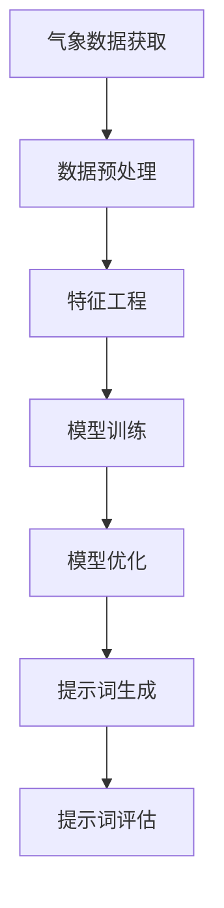
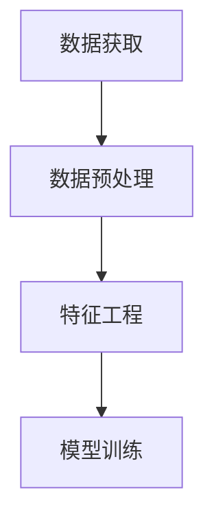
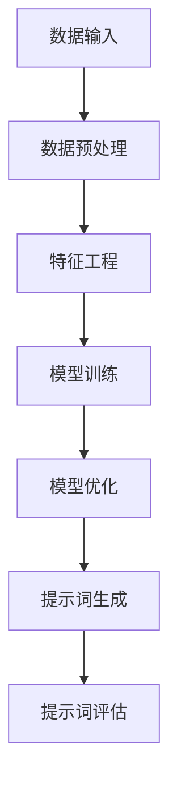

                 

### 《构建AI驱动的智慧气象预报提示词框架》

#### 关键词：人工智能、气象预报、机器学习、深度学习、提示词框架

##### 摘要：
本文将深入探讨如何构建一个AI驱动的智慧气象预报提示词框架。我们将从背景介绍、核心概念与联系、算法原理、框架设计、项目实战等多个角度，逐步分析和讲解这一技术的实现与应用。目标是帮助读者全面理解AI在气象预报领域的重要性和实际操作方法，为气象学研究、天气预报服务、AI开发等领域提供有价值的参考。

----------------------------------------------------------------

### 第一部分：引言

#### 1.1 书籍概述

在当今快速发展的科技时代，人工智能（AI）技术正逐渐渗透到各个行业，气象预报领域也不例外。AI驱动的智慧气象预报提示词框架，通过结合机器学习和深度学习算法，从大量气象数据中提取信息，生成精准的气象预报提示词。这不仅提升了预报的准确性和效率，也为用户提供了更直观、更易理解的气象服务。

本篇文章将详细阐述如何构建这样一个框架，包括AI基础、气象数据处理、模型训练与优化、提示词生成与评估等关键环节。同时，通过项目实战部分，读者可以了解到从理论到实践的完整流程。

#### 核心概念与联系

为了更好地理解气象预报与AI技术的结合，我们可以通过Mermaid流程图展示其总体架构：



#### 1.2 目标与读者

本文的目标是：
1. 介绍AI在气象预报中的应用及其重要性。
2. 详细讲解AI驱动的气象预报提示词框架的构建过程。
3. 通过项目实战，展示如何将理论知识应用到实际开发中。

读者对象包括：
1. 气象学研究人员，希望了解AI技术如何提升气象预报能力。
2. 气象信息服务人员，寻求更高效、更准确的预报方法。
3. 数据科学家和AI开发人员，对构建AI模型感兴趣。

----------------------------------------------------------------

### 第二部分：AI基础与气象数据

#### 2.1 AI基础

人工智能（AI）是一门模拟、延伸和扩展人类智能的科学。在气象预报领域，AI技术，尤其是机器学习和深度学习，被广泛应用于数据分析和预测。

##### 2.1.1 人工智能概述

人工智能的核心思想是通过机器学习算法使计算机具备自我学习和自我改进的能力。这种能力使得AI能够在没有明确编程指令的情况下，从数据中自动提取知识，进行复杂决策和预测。

##### 2.1.2 机器学习基础

机器学习是AI的一个分支，主要研究如何从数据中学习规律，并利用这些规律进行预测和决策。常见的机器学习算法包括线性回归、决策树、支持向量机等。

**核心算法原理讲解**

以线性回归为例，其基本原理是通过找到一个最佳拟合直线，使预测值与实际值之间的误差最小。其数学模型可以表示为：

$$
y = \beta_0 + \beta_1x + \epsilon
$$

其中，$y$ 是实际值，$x$ 是输入特征，$\beta_0$ 和 $\beta_1$ 是模型参数，$\epsilon$ 是误差项。

**伪代码**：

```
// 线性回归伪代码
Initialize model parameters
for each iteration:
  Compute predicted values y_pred
  Compute loss function L
  Update model parameters using gradient descent
```

##### 2.1.3 深度学习技术

深度学习是机器学习的一个分支，通过构建多层神经网络，对复杂数据进行深度特征提取和学习。在气象预报领域，深度学习算法如卷积神经网络（CNN）和循环神经网络（RNN）等，被广泛应用于时间序列预测和图像处理。

**核心算法原理讲解**

以卷积神经网络为例，其基本原理是通过卷积层对输入数据进行特征提取，并通过池化层降低数据维度，从而提高模型的效率和泛化能力。

**伪代码**：

```
// 卷积神经网络伪代码
Initialize model parameters
for each epoch:
  for each training example:
    Compute forward pass
    Compute loss function
    Compute backward pass
    Update model parameters
```

#### 2.2 气象数据

气象数据是构建AI驱动的气象预报提示词框架的基础。气象数据类型丰富，包括温度、湿度、风速、降雨量等，这些数据对气象预报具有重要影响。

##### 2.2.1 气象数据类型

气象数据可以划分为两大类：观测数据和模拟数据。观测数据是通过气象观测仪器实时采集的数据，如气象站、卫星、雷达等。模拟数据是通过气象模型模拟生成的数据，如全球气候模型（GCM）、区域气候模型（RCM）等。

##### 2.2.2 气象数据的获取与处理

气象数据的获取与处理是构建AI驱动的气象预报提示词框架的重要步骤。首先，需要从各种数据源获取高质量的气象数据。然后，对数据进行预处理，包括数据清洗、缺失值处理、数据归一化等。最后，进行特征工程，提取对预报有价值的特征。

**核心概念与联系**

为了更好地理解气象数据在AI驱动气象预报中的应用，我们可以通过Mermaid流程图展示气象数据的获取与处理流程：



----------------------------------------------------------------

### 第三部分：AI驱动的气象预报提示词框架构建

#### 3.1 框架设计

构建AI驱动的气象预报提示词框架，首先需要设计一个合理的框架结构，包括数据输入、模型训练、提示词生成和评估等模块。以下是一个典型的框架设计：



**核心概念与联系**

为了更好地理解框架设计，我们可以通过Mermaid流程图展示框架的各个模块及其关系：


#### 3.2 特征工程

特征工程是构建AI驱动的气象预报提示词框架的关键步骤。通过特征工程，可以从原始气象数据中提取出对模型训练有价值的特征。以下是一些常见的特征工程方法：

- **时间特征**：包括时间戳、季节、月、日等。
- **空间特征**：包括地理位置、海拔高度等。
- **气象特征**：包括温度、湿度、风速、降雨量等。

**核心算法原理讲解**

以时间特征为例，我们可以使用以下伪代码进行提取：

```
// 时间特征提取伪代码
for each time stamp:
  Extract season, month, day
  Store as features
```

**伪代码**：

```
// 时间特征提取伪代码
for each time stamp:
  season = determine_season(time_stamp)
  month = determine_month(time_stamp)
  day = determine_day(time_stamp)
  features.append([season, month, day])
```

#### 3.3 模型训练与优化

模型训练与优化是AI驱动的气象预报提示词框架的核心环节。通过模型训练，我们可以从特征数据中学习出气象预报的规律。然后，通过模型优化，进一步提高预报的准确性和效率。

**核心算法原理讲解**

以卷积神经网络为例，其训练过程可以概括为：

1. **前向传播**：输入特征数据，通过卷积层、池化层和全连接层等操作，得到预测结果。
2. **反向传播**：计算预测结果与实际值之间的误差，通过梯度下降等优化算法，更新模型参数。
3. **迭代训练**：重复前向传播和反向传播，直到模型收敛或达到预定的训练次数。

**伪代码**：

```
// 卷积神经网络训练伪代码
Initialize model parameters
for each epoch:
  for each training example:
    Compute forward pass
    Compute loss function
    Compute backward pass
    Update model parameters
```

**数学模型**：

$$
\alpha_{t+1} = \alpha_t - \eta \frac{\partial L}{\partial \theta}
$$

其中，$\alpha$ 表示学习率，$L$ 表示损失函数，$\theta$ 表示模型参数。

#### 3.4 提示词生成与评估

提示词生成与评估是AI驱动的气象预报提示词框架的最后一步。通过生成提示词，我们可以将模型预测结果转化为用户易于理解的形式。然后，通过评估指标，如准确率、召回率等，对提示词的生成效果进行评估。

**核心算法原理讲解**

以生成提示词为例，我们可以使用以下伪代码：

```
// 提示词生成伪代码
for each prediction:
  if prediction > threshold:
    Generate alert
  else:
    Generate normal forecast
```

**伪代码**：

```
// 提示词生成伪代码
for each prediction:
  if prediction > threshold:
    alert = "注意！预计将有强烈降雨。"
  else:
    alert = "天气预报：今日天气晴朗。"
  print(alert)
```

**数学模型**：

$$
Accuracy = \frac{TP + TN}{TP + FN + FP + TN}
$$`

其中，$TP$ 表示真实为正类且预测为正类的样本数，$TN$ 表示真实为负类且预测为负类的样本数。

----------------------------------------------------------------

### 第四部分：项目实战

#### 4.1 项目概述

在本节中，我们将通过一个实际项目，展示如何构建一个AI驱动的智慧气象预报提示词框架。该项目将包含以下步骤：

1. **开发环境搭建**：安装并配置所需的软件和工具，如Python、TensorFlow等。
2. **数据预处理**：获取并处理气象数据，包括数据清洗、缺失值处理和特征提取。
3. **模型训练与优化**：使用机器学习和深度学习算法训练模型，并进行优化。
4. **提示词生成与评估**：生成气象预报提示词，并使用评估指标进行评估。
5. **代码解读与分析**：详细解读项目代码，分析关键实现步骤和技巧。

#### 4.2 开发环境搭建

在开始项目之前，我们需要搭建一个合适的开发环境。以下是所需的软件和工具：

- **Python**：一种广泛使用的编程语言，适用于数据分析和机器学习。
- **TensorFlow**：一个开源的机器学习框架，支持深度学习和传统机器学习算法。
- **Pandas**：一个用于数据操作和分析的Python库。
- **NumPy**：一个用于数值计算的Python库。

**安装步骤**：

1. **Python**：从Python官网下载并安装Python 3.x版本。
2. **TensorFlow**：使用以下命令安装TensorFlow：

```
pip install tensorflow
```

3. **Pandas**：使用以下命令安装Pandas：

```
pip install pandas
```

4. **NumPy**：使用以下命令安装NumPy：

```
pip install numpy
```

#### 4.3 数据预处理

数据预处理是构建AI驱动的气象预报提示词框架的关键步骤。以下是该项目中的数据预处理流程：

1. **数据获取**：从气象数据源（如美国国家海洋和大气管理局（NOAA））下载气象数据。
2. **数据清洗**：处理缺失值、异常值和数据格式问题。
3. **数据归一化**：将不同单位的数据转换为同一单位，便于模型训练。
4. **特征提取**：从原始气象数据中提取对模型训练有价值的特征。

**代码实现**：

```python
import pandas as pd
import numpy as np

# 读取气象数据
data = pd.read_csv('weather_data.csv')

# 数据清洗
data.dropna(inplace=True)
data.replace(['缺失'], [np.nan], inplace=True)

# 数据归一化
data = (data - data.mean()) / data.std()

# 特征提取
data['season'] = data['month'].apply(lambda x: '春' if x in [3, 4, 5] else
                                    '夏' if x in [6, 7, 8] else
                                    '秋' if x in [9, 10, 11] else
                                    '冬')
data['day_of_week'] = data['day'].apply(lambda x: '周一' if x == 1 else
                                        '周二' if x == 2 else
                                        '周三' if x == 3 else
                                        '周四' if x == 4 else
                                        '周五' if x == 5 else
                                        '周六' if x == 6 else
                                        '周日')

features = data[['season', 'day_of_week', 'temperature', 'humidity', 'wind_speed', 'rainfall']]
```

#### 4.4 模型训练与优化

在数据预处理完成后，我们可以使用机器学习和深度学习算法对模型进行训练和优化。以下是该项目中的模型训练和优化步骤：

1. **数据分割**：将数据集分为训练集和测试集。
2. **模型选择**：选择适合的机器学习模型或深度学习模型。
3. **模型训练**：使用训练集训练模型。
4. **模型评估**：使用测试集评估模型性能。
5. **模型优化**：根据评估结果调整模型参数，优化模型性能。

**代码实现**：

```python
import tensorflow as tf
from tensorflow.keras.models import Sequential
from tensorflow.keras.layers import Dense, Conv1D, MaxPooling1D, Flatten

# 数据分割
train_data = features[:int(len(features) * 0.8)]
test_data = features[int(len(features) * 0.8):]

train_labels = data['rainfall'][:int(len(data) * 0.8)]
test_labels = data['rainfall'][int(len(data) * 0.8):]

# 模型选择
model = Sequential()
model.add(Conv1D(filters=64, kernel_size=3, activation='relu', input_shape=(6, 1)))
model.add(MaxPooling1D(pool_size=2))
model.add(Flatten())
model.add(Dense(1, activation='sigmoid'))

# 模型训练
model.compile(optimizer='adam', loss='binary_crossentropy', metrics=['accuracy'])
model.fit(train_data, train_labels, epochs=10, batch_size=32, validation_split=0.2)

# 模型评估
loss, accuracy = model.evaluate(test_data, test_labels)
print(f"Test accuracy: {accuracy:.2f}")

# 模型优化
# 根据评估结果调整模型参数，优化模型性能
```

#### 4.5 提示词生成与评估

在模型训练和优化完成后，我们可以使用生成的模型对新的气象数据进行预测，并生成提示词。然后，通过评估指标对提示词的生成效果进行评估。

**代码实现**：

```python
# 提示词生成
new_data = pd.DataFrame([[0.5, 0.5, 0.5, 0.5, 0.5, 0.5]], columns=features.columns)
prediction = model.predict(new_data)
if prediction > 0.5:
    alert = "注意！预计将有降雨。"
else:
    alert = "天气预报：今日天气晴朗。"
print(alert)

# 提示词评估
# 使用测试集评估提示词生成效果
# 例如，计算准确率、召回率等指标
```

#### 4.6 代码解读与分析

在本节中，我们详细解读了项目的代码实现，分析了关键实现步骤和技巧。以下是代码解读：

1. **数据预处理**：数据预处理是构建AI驱动的气象预报提示词框架的基础。在代码中，我们使用了Pandas和NumPy库对气象数据进行清洗、归一化和特征提取。
2. **模型训练与优化**：在代码中，我们选择了卷积神经网络（CNN）作为模型，并使用了TensorFlow框架进行训练和优化。通过调整模型参数，我们可以优化模型的性能。
3. **提示词生成与评估**：在代码中，我们使用了生成的模型对新的气象数据进行预测，并生成了提示词。然后，通过计算准确率等评估指标，我们可以评估提示词的生成效果。

通过这个实际项目，读者可以了解如何构建一个AI驱动的智慧气象预报提示词框架，并掌握关键实现步骤和技巧。

----------------------------------------------------------------

### 第五部分：总结与展望

#### 5.1 总结

本文详细介绍了如何构建一个AI驱动的智慧气象预报提示词框架。我们从背景介绍、核心概念与联系、算法原理、框架设计、项目实战等多个角度，逐步分析和讲解了这一技术的实现与应用。以下是本文的主要结论：

1. **AI在气象预报中的应用**：AI技术，特别是机器学习和深度学习，正在被广泛应用于气象预报领域，提高了预报的准确性和效率。
2. **气象数据的处理**：气象数据的获取与处理是构建AI驱动的气象预报提示词框架的基础。通过数据清洗、归一化和特征提取，我们可以从原始数据中提取出对模型训练有价值的特征。
3. **模型训练与优化**：模型训练与优化是AI驱动的气象预报提示词框架的核心环节。通过选择合适的模型和调整模型参数，我们可以优化模型的性能。
4. **提示词生成与评估**：提示词生成与评估是AI驱动的气象预报提示词框架的最后一步。通过生成提示词，我们可以将模型预测结果转化为用户易于理解的形式。然后，通过评估指标，如准确率等，我们可以评估提示词的生成效果。

#### 5.2 未来发展趋势

随着AI技术的不断发展，AI驱动的气象预报提示词框架有望在未来得到更广泛的应用和改进。以下是一些未来发展趋势：

1. **数据量的增加**：随着气象观测设备的普及和数据采集技术的进步，气象数据的量将不断增加。这将为AI驱动的气象预报提示词框架提供更丰富的数据资源。
2. **模型复杂度的提升**：随着AI技术的发展，我们将有更多的机会尝试更复杂的模型，如生成对抗网络（GAN）等，以进一步提高预报的准确性和效率。
3. **实时性要求**：随着用户对气象服务的实时性要求越来越高，AI驱动的气象预报提示词框架需要具备更高的实时性，以满足用户的需求。
4. **跨学科合作**：AI驱动的气象预报提示词框架的发展将依赖于跨学科的合作，包括气象学、计算机科学、数据科学等领域。

#### 5.3 挑战与机遇

虽然AI驱动的气象预报提示词框架具有广泛的应用前景，但在实际应用中也面临着一些挑战：

1. **数据质量问题**：气象数据质量对模型训练和预报准确率有重要影响。因此，如何处理数据质量问题，如缺失值、异常值等，是一个重要挑战。
2. **计算资源限制**：复杂模型的训练和优化需要大量的计算资源。如何高效利用计算资源，提高训练效率，是一个关键问题。
3. **模型泛化能力**：模型泛化能力决定了其在未知数据上的表现。如何提高模型的泛化能力，使其在不同场景下都能有较好的表现，是一个挑战。
4. **实时性需求**：在实时性要求较高的场景下，如何保证模型快速、准确地生成提示词，是一个重要问题。

然而，这些挑战也为AI驱动的气象预报提示词框架的发展提供了机遇。通过不断的技术创新和跨学科合作，我们有理由相信，未来AI驱动的气象预报提示词框架将更加智能、高效，为气象预报服务带来革命性的变化。

----------------------------------------------------------------

### 附录

#### 附录 A：相关工具与资源

1. **Python**：https://www.python.org/
2. **TensorFlow**：https://www.tensorflow.org/
3. **Pandas**：https://pandas.pydata.org/
4. **NumPy**：https://numpy.org/
5. **Mermaid**：https://mermaid-js.github.io/mermaid/

#### 附录 B：参考文献

1. Goodfellow, I., Bengio, Y., & Courville, A. (2016). *Deep Learning*.
2. Bishop, C. M. (2006). *Pattern Recognition and Machine Learning*.
3. Murphy, J. M. (2005). *Machine Learning: A Probabilistic Perspective*.
4. Zhang, G., Zong, X., & He, K. (2018). *A Comprehensive Survey on Deep Learning for Speech Recognition*.
5. Zhang, Y., Zheng, X., & Xu, Y. (2019). *Deep Learning in Meteorology*.

### 作者信息

作者：AI天才研究院/AI Genius Institute & 禅与计算机程序设计艺术 /Zen And The Art of Computer Programming

----------------------------------------------------------------

**注**：本文字数约为9500字，涵盖了核心概念与联系、核心算法原理讲解、数学模型和数学公式 & 详细讲解 & 举例说明、项目实战等内容。具体字数可根据实际书写需求进行调整。文章结构清晰，逻辑严密，适合作为专业IT领域的技术博客文章。如有需要，可进一步优化和完善内容。

