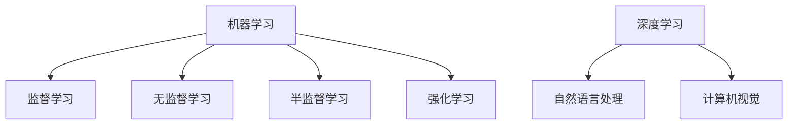
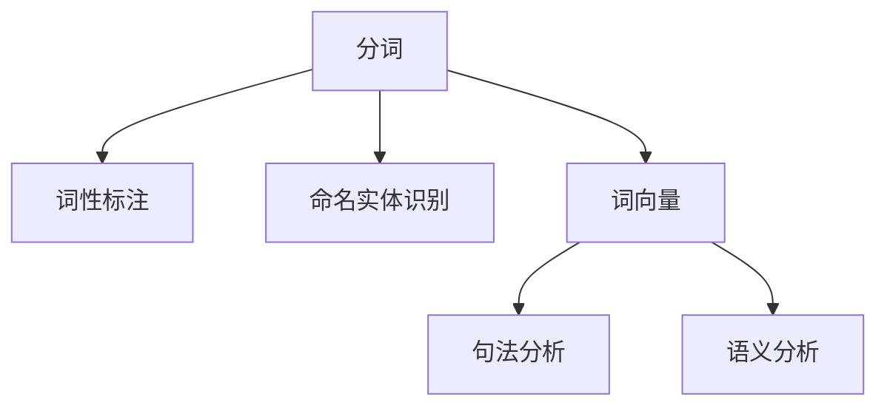
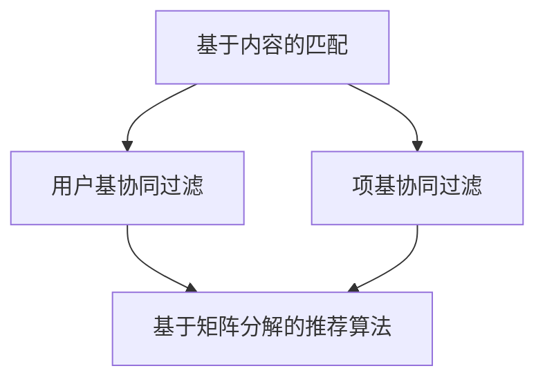

                 


### 《构建AI驱动的智慧社区服务匹配提示词平台》

#### 文章关键词
- 智慧社区
- 服务匹配
- 提示词平台
- 人工智能
- 自然语言处理

#### 文章摘要
本文将探讨如何构建一个AI驱动的智慧社区服务匹配提示词平台。首先，我们将介绍智慧社区的定义及其对服务匹配的需求。接着，我们将深入分析构建平台所需的核心概念和算法，包括人工智能、自然语言处理和基于深度学习的推荐算法。随后，我们将通过数学模型和公式来解释这些算法的原理，并提供项目实战的具体案例，展示如何将理论应用于实际开发中。最后，我们将总结平台构建的关键步骤和未来展望，并给出最佳实践和拓展阅读建议。

## 第一部分：引言与背景

### 1.1 书籍概述

智慧社区服务匹配提示词平台是一种利用人工智能技术，为居民提供个性化服务推荐的新型平台。它通过自然语言处理和深度学习算法，分析用户的需求和行为，为其推荐最适合的服务，从而提升社区服务质量和居民满意度。随着城市化进程的加快和人口老龄化的加剧，智慧社区的需求日益增长。本书籍旨在系统介绍如何构建这样一套平台，使其成为智慧社区的重要组成部分。

#### 智慧社区服务匹配提示词平台的定义

智慧社区服务匹配提示词平台是一种集成多种人工智能技术的系统，它包括以下几个关键组成部分：

- **用户需求分析模块**：通过自然语言处理技术，理解用户的语言输入，提取用户的需求信息。
- **服务信息库**：包含各类社区服务的信息，如家政服务、医疗服务、文化活动等。
- **推荐算法模块**：利用深度学习算法，根据用户需求和服务信息，为用户推荐最适合的服务。
- **提示词生成模块**：基于用户的行为数据和推荐结果，生成提示词，引导用户使用服务。

#### 平台的重要性与未来展望

智慧社区服务匹配提示词平台的重要性在于，它不仅能够提高社区服务的效率，还能够提升居民的生活质量。通过个性化的服务推荐，平台能够满足居民的多样化需求，减少信息不对称，提升居民对社区服务的满意度。此外，随着人工智能技术的不断发展，平台的功能将更加丰富，应用范围也将进一步扩大。

未来，智慧社区服务匹配提示词平台有望在以下几个方面得到发展：

- **智能化推荐**：通过更先进的人工智能算法，实现更精准、更智能的服务推荐。
- **多语言支持**：支持多种语言，满足不同地区居民的需求。
- **跨平台应用**：集成到更多社区服务和应用中，如智能家居、智能医疗等。
- **数据安全与隐私保护**：加强对用户数据的保护，确保用户隐私安全。

## 第二部分：核心概念与联系

### 2.1 人工智能基础

人工智能（AI）是指使计算机系统具备人类智能特性的技术。人工智能可以分为三大类：机器学习、深度学习和强化学习。以下是人工智能的基本概念：

#### 人工智能的定义

人工智能是指通过计算机模拟人类智能行为的能力，包括学习、推理、规划、感知、理解等。

#### 人工智能的发展历程

- 20世纪50年代：人工智能概念首次提出。
- 20世纪60年代：人工智能进入第一阶段，以逻辑推理为主。
- 20世纪80年代：专家系统和知识工程得到快速发展。
- 20世纪90年代至今：机器学习、深度学习成为主流，人工智能进入第二阶段。

#### 人工智能技术分类

- **机器学习**：通过数据训练模型，使计算机具备学习能力。
- **深度学习**：基于多层神经网络，模拟人脑处理信息的过程。
- **强化学习**：通过与环境互动，学习最优策略。

### 2.2 自然语言处理

自然语言处理（NLP）是人工智能的一个分支，旨在使计算机理解和处理人类语言。以下是自然语言处理的基本概念：

#### 自然语言处理的基本概念

自然语言处理涉及文本数据的采集、处理、分析和理解。

#### 自然语言处理的关键技术

- **分词**：将连续文本切分成词语。
- **词性标注**：识别词语的词性。
- **命名实体识别**：识别文本中的特定实体，如人名、地名。
- **语义分析**：理解文本中的语义关系。

### 2.3 服务匹配算法

服务匹配算法是智慧社区服务匹配提示词平台的核心。以下是服务匹配的基本概念：

#### 服务匹配的基本概念

服务匹配是指根据用户的需求，从大量的服务信息中找到最合适的匹配项。

#### 常用的服务匹配算法介绍

- **基于内容的匹配**：根据服务的内容和用户的需求进行匹配。
- **协同过滤匹配**：基于用户的相似度和服务的历史评分进行匹配。
- **深度学习匹配**：利用深度学习算法，从大量的数据中自动学习服务匹配的规律。

## 第二部分：核心概念与联系

### 2.1 人工智能基础

#### 人工智能的基本概念

人工智能（Artificial Intelligence, AI）是一种通过模拟人类智能行为来使计算机执行复杂任务的计算机科学分支。AI旨在让计算机具备学习能力、推理能力、决策能力以及自然语言理解和处理能力。AI的应用领域非常广泛，包括机器学习、计算机视觉、自然语言处理、自动驾驶、医疗诊断等。

#### 人工智能的发展历程

- **20世纪50年代**：人工智能概念首次被提出。当时的愿景是开发出能够模仿人类思维的计算机系统。
- **20世纪60年代**：人工智能进入了第一阶段，以符号主义方法为主导，主要关注逻辑推理和知识表示。
- **20世纪80年代**：专家系统成为AI研究的热点，通过编码专家知识来模拟人类专家的决策过程。
- **20世纪90年代**：随着计算能力和数据可用性的提高，机器学习开始崛起，特别是在统计学习和模式识别领域。
- **21世纪初至今**：深度学习技术的发展推动了AI的第二次革命，使得计算机在图像识别、语音识别、自然语言处理等方面取得了显著的进步。

#### 人工智能技术分类

- **机器学习（Machine Learning）**：通过数据训练模型，使计算机具备自动学习和改进能力。
  - **监督学习（Supervised Learning）**：训练数据带有标签，模型学习如何预测新数据的标签。
  - **无监督学习（Unsupervised Learning）**：训练数据无标签，模型学习数据的结构和模式。
  - **半监督学习（Semi-Supervised Learning）**：结合有标签和无标签数据。
  - **强化学习（Reinforcement Learning）**：通过与环境的互动学习最优策略。
- **深度学习（Deep Learning）**：基于多层神经网络，能够处理复杂的特征和模式。
- **自然语言处理（Natural Language Processing, NLP）**：使计算机理解和生成人类语言的技术。
- **计算机视觉（Computer Vision）**：使计算机理解和解释视觉信息的技术。

#### Mermaid流程图：人工智能技术分类



### 2.2 自然语言处理

#### 自然语言处理的基本概念

自然语言处理（Natural Language Processing, NLP）是人工智能的一个分支，专注于使计算机理解和生成人类语言。NLP涉及到文本数据的采集、处理、分析和理解，其目标是让计算机能够以类似于人类的方式处理语言信息。

#### 自然语言处理的关键技术

- **分词（Tokenization）**：将连续的文本切分成有意义的词语或符号。
- **词性标注（Part-of-Speech Tagging）**：为文本中的每个词语标注其词性，如名词、动词、形容词等。
- **命名实体识别（Named Entity Recognition, NER）**：识别文本中的特定实体，如人名、地名、组织名等。
- **词向量（Word Embedding）**：将词语映射到高维空间中的向量，以捕捉词语的语义信息。
- **句法分析（Syntactic Parsing）**：分析文本的语法结构，如句法树。
- **语义分析（Semantic Analysis）**：理解文本中的语义关系和含义。

#### Mermaid流程图：自然语言处理关键技术



### 2.3 服务匹配算法

#### 服务匹配的基本概念

服务匹配（Service Matching）是指从海量的服务信息中找到与用户需求最匹配的服务。在智慧社区服务匹配提示词平台中，服务匹配算法起着至关重要的作用。

#### 常用的服务匹配算法介绍

- **基于内容的匹配（Content-Based Matching）**：根据服务的内容和用户的需求进行匹配。
  - 优点：简单直观，易于实现。
  - 缺点：仅考虑服务内容，可能忽略用户偏好和历史记录。
- **协同过滤匹配（Collaborative Filtering）**：基于用户的相似度和服务的历史评分进行匹配。
  - **用户基协同过滤（User-Based Collaborative Filtering）**：找到与目标用户最相似的邻居用户，推荐邻居用户喜欢的服务。
  - **项基协同过滤（Item-Based Collaborative Filtering）**：找到与目标服务最相似的邻居服务，推荐邻居服务受欢迎的用户。
  - 优点：能够利用用户历史数据，提高推荐的准确性。
  - 缺点：当用户或服务数量庞大时，计算复杂度较高。
- **基于模型的推荐算法（Model-Based Recommender Systems）**：使用机器学习算法构建预测模型，预测用户对服务的偏好。
  - **基于矩阵分解的推荐算法**：如矩阵分解（Matrix Factorization），通过分解用户和服务评分矩阵，提取隐含特征，进行推荐。
  - **基于深度学习的推荐算法**：如序列模型（Sequential Model）、图模型（Graph Model）等，通过学习用户和服务之间的关系，进行推荐。
  - 优点：能够处理高维数据，提高推荐效果。
  - 缺点：需要大量训练数据，模型复杂度较高。

#### Mermaid流程图：服务匹配算法



## 第三部分：核心算法原理讲解

### 3.1 基于深度学习的推荐算法

#### 深度学习推荐算法的原理

深度学习推荐算法（Deep Learning Recommender Systems）是基于深度神经网络构建的推荐系统，通过学习用户与服务之间的复杂关系，提高推荐的准确性。深度学习推荐算法的核心思想是通过多层神经网络，从原始数据中自动提取特征，构建用户和服务的特征表示，进而进行推荐。

#### 常见深度学习推荐算法的伪代码讲解

以下是一个简单的基于深度学习的推荐算法伪代码示例：

```python
# 输入：用户和服务数据
# 输出：推荐结果

def deep_learning_recommender(user_data, service_data):
    # 初始化模型
    model = create_model()

    # 训练模型
    model.fit(user_data, service_data)

    # 预测用户对服务的偏好
    predictions = model.predict(service_data)

    # 根据预测结果生成推荐列表
    recommendations = generate_recommendations(predictions)

    return recommendations
```

#### 代码解读

- **创建模型（create_model）**：定义深度学习模型的结构，包括输入层、隐藏层和输出层。
- **训练模型（fit）**：使用用户数据和服务数据进行模型训练，通过反向传播算法优化模型参数。
- **预测（predict）**：使用训练好的模型对服务数据进行预测，得到用户对服务的偏好评分。
- **生成推荐列表（generate_recommendations）**：根据预测结果，为用户生成推荐列表。

### 3.2 语言模型与搜索引擎

#### 语言模型的构建与优化

语言模型（Language Model）是自然语言处理中的一个核心组件，用于预测文本序列的概率分布。在搜索引擎中，语言模型可以帮助优化搜索结果的排序，提高用户体验。

#### 语言模型的构建

语言模型的构建通常涉及以下几个步骤：

1. **数据收集**：收集大量文本数据，如网页内容、书籍、新闻等。
2. **预处理**：对文本数据进行清洗和预处理，包括分词、去除停用词、标点符号等。
3. **构建词表**：将文本数据中的词语映射到索引，形成词汇表。
4. **模型训练**：使用训练数据训练语言模型，常见的语言模型包括n-gram模型、神经网络模型等。

#### 语言模型的优化

语言模型的优化主要关注以下几个方面：

- **参数调整**：通过调整模型参数，如学习率、正则化项等，提高模型性能。
- **模型结构**：优化模型结构，如增加隐藏层节点、调整网络层数等，提高模型表达能力。
- **数据增强**：通过数据增强技术，如数据扩充、数据合成等，增加训练数据量，提高模型泛化能力。

### 3.3 个性化服务匹配

#### 个性化服务的定义与实现

个性化服务（Personalized Service）是指根据用户的兴趣、行为和需求，提供定制化的服务。在智慧社区服务匹配提示词平台中，个性化服务匹配旨在为每个用户提供最相关的服务推荐。

#### 个性化服务的定义

个性化服务是指基于用户个性化特征，为其提供个性化的服务内容、形式和交互体验。个性化服务的主要目标是满足用户的个性化需求，提升用户满意度和忠诚度。

#### 个性化服务的实现

个性化服务的实现通常包括以下几个步骤：

1. **用户画像**：通过数据分析，构建用户的个性化特征模型，如兴趣标签、行为轨迹等。
2. **服务分类**：将服务按照类别进行划分，如医疗、家政、教育等。
3. **推荐算法**：使用个性化推荐算法，根据用户画像和服务分类，生成个性化推荐列表。
4. **服务匹配**：将个性化推荐列表与用户实际需求进行匹配，生成最终的推荐结果。

#### 常用的个性化匹配算法

- **基于内容的个性化匹配**：根据用户的历史行为和兴趣，推荐与用户兴趣相似的服务。
- **基于协同过滤的个性化匹配**：通过分析用户行为数据，找到与用户相似的其他用户，推荐他们喜欢的服务。
- **基于深度学习的个性化匹配**：使用深度学习算法，从大量数据中自动学习用户和服务之间的复杂关系，进行个性化推荐。

## 第四部分：数学模型与公式

### 4.1 概率论与统计模型

#### 概率论的基本概念

概率论是研究随机事件的数学分支。在智慧社区服务匹配提示词平台中，概率论用于评估用户与服务匹配的概率，从而优化推荐效果。

- **概率（Probability）**：表示某一事件发生的可能性，取值范围在0到1之间。
- **条件概率（Conditional Probability）**：在某一条件下，某一事件发生的概率。
- **贝叶斯定理（Bayes' Theorem）**：用于计算后验概率，即在已知某些条件下，事件发生的前验概率。

#### 统计模型的应用

统计模型用于分析用户行为数据，提取用户兴趣和服务特征，为推荐算法提供支持。

- **线性回归（Linear Regression）**：用于建立自变量和因变量之间的线性关系。
- **逻辑回归（Logistic Regression）**：用于分类问题，将概率映射到0到1之间。
- **聚类分析（Cluster Analysis）**：用于将数据分为不同的类别，以便进行后续分析。

#### 公式推导

以下是一个简单的线性回归公式推导：

假设我们有n个数据点(x_i, y_i)，其中x_i是自变量，y_i是因变量。我们希望找到一条直线y = mx + b，使得这条直线尽可能接近所有数据点。

1. **最小二乘法**：通过最小化残差平方和来求解m和b。
   $$ \min \sum_{i=1}^{n} (y_i - (mx_i + b))^2 $$
2. **偏导数法**：对y关于m和b求偏导数，并令其为0，求解m和b。
   $$ \frac{\partial}{\partial m} \sum_{i=1}^{n} (y_i - (mx_i + b))^2 = 0 $$
   $$ \frac{\partial}{\partial b} \sum_{i=1}^{n} (y_i - (mx_i + b))^2 = 0 $$

### 4.2 信息论与熵

#### 信息论的基本概念

信息论是研究信息传输、存储和处理的基本理论。在智慧社区服务匹配提示词平台中，信息论用于评估数据的冗余度和传输效率。

- **熵（Entropy）**：表示随机变量不确定性的度量，取值范围在0到1之间。
- **条件熵（Conditional Entropy）**：在给定某一条件下，随机变量不确定性的度量。
- **互信息（Mutual Information）**：表示两个随机变量之间相互依赖的程度。

#### 熵的计算与优化

熵的计算公式如下：

$$ H(X) = -\sum_{i} p(x_i) \log_2 p(x_i) $$

其中，p(x_i)表示随机变量X取值为x_i的概率。

为了优化信息传输效率，可以采用以下策略：

- **数据压缩**：通过熵编码技术，降低数据传输的冗余度。
- **信道编码**：通过增加冗余信息，提高数据传输的可靠性。
- **前向纠错**：在接收端检测并纠正传输错误。

### 4.3 决策理论

#### 决策理论的基本原理

决策理论是研究如何在不确定性环境中做出最优决策的数学理论。在智慧社区服务匹配提示词平台中，决策理论用于评估不同推荐策略的优劣。

- **期望效用（Expected Utility）**：在给定概率和效用函数下，决策者的期望效用最大化。
- **风险偏好（Risk Preference）**：决策者对待风险的偏好程度，分为风险回避、风险中立和风险追求。
- **价值函数（Value Function）**：用于评估不同决策结果的效用值。

#### 决策模型的设计与优化

决策模型的设计与优化包括以下几个步骤：

1. **问题定义**：明确决策目标和约束条件。
2. **状态空间**：定义所有可能的状态。
3. **动作空间**：定义所有可能的决策动作。
4. **概率分布**：估计状态和动作的概率分布。
5. **效用函数**：定义不同决策结果的效用值。

为了优化决策模型，可以采用以下策略：

- **贝叶斯决策**：根据后验概率和效用函数，选择最优决策动作。
- **多目标优化**：在多个目标之间进行权衡，找到最优解。
- **启发式搜索**：利用经验规则，快速找到近似最优解。

## 第五部分：项目实战

### 5.1 项目背景与需求分析

#### 项目背景介绍

随着城市化进程的加快，智慧社区的建设成为城市发展的重要趋势。智慧社区旨在通过信息化技术提升社区管理水平，提高居民生活质量。然而，在智慧社区中，如何有效地提供个性化服务，满足居民的多样化需求，成为一项重要的挑战。

本项目的目标是构建一个AI驱动的智慧社区服务匹配提示词平台，通过自然语言处理和深度学习算法，为居民提供个性化的服务推荐。平台将集成多种服务，如家政服务、医疗服务、文化活动等，并利用人工智能技术，实现服务的精准匹配和推荐。

#### 服务匹配需求分析

在智慧社区中，居民对服务的需求具有多样性和个性化特点。为了满足这些需求，服务匹配系统需要具备以下几个关键功能：

1. **用户需求分析**：通过自然语言处理技术，理解用户的语言输入，提取用户的需求信息。
2. **服务信息库**：构建包含各类社区服务的信息库，确保服务信息的全面性和准确性。
3. **推荐算法**：利用深度学习算法，根据用户的需求和服务信息，为用户推荐最适合的服务。
4. **提示词生成**：根据用户的行为数据和推荐结果，生成提示词，引导用户使用服务。

### 5.2 系统设计与实现

#### 系统架构设计

智慧社区服务匹配提示词平台采用分布式架构，包括以下几个关键模块：

1. **用户服务需求分析模块**：负责接收用户的语言输入，利用自然语言处理技术提取用户需求。
2. **服务信息库**：存储各类社区服务的详细信息，包括服务类型、服务描述、服务价格等。
3. **推荐算法模块**：利用深度学习算法，根据用户需求和服务信息，生成推荐列表。
4. **提示词生成模块**：根据用户的行为数据和推荐结果，生成提示词，引导用户使用服务。
5. **用户界面**：为用户提供交互界面，展示推荐结果和提示词。

#### 核心功能模块实现

1. **用户需求分析模块**：使用自然语言处理技术，如分词、词性标注和命名实体识别，提取用户的需求信息。具体实现如下：

   ```python
   from nltk.tokenize import word_tokenize
   from nltk.tag import pos_tag

   def analyze_user需求(utterance):
       tokens = word_tokenize(utterance)
       tagged = pos_tag(tokens)
       # 进行命名实体识别和词性标注
       # 提取需求信息
       # 返回需求信息
   ```

2. **服务信息库**：采用关系数据库存储服务信息，如MySQL。具体实现如下：

   ```sql
   CREATE TABLE services (
       id INT PRIMARY KEY,
       type VARCHAR(255),
       description VARCHAR(255),
       price DECIMAL(10, 2)
   );
   ```

3. **推荐算法模块**：使用深度学习算法，如基于用户协同过滤的推荐算法。具体实现如下：

   ```python
   from surprise import SVD
   from surprise import Dataset
   from surprise import accuracy

   def train_recommendation_model(data):
       # 构建数据集
       # 训练SVD算法
       # 返回训练好的模型
   ```

4. **提示词生成模块**：基于用户的行为数据和推荐结果，生成提示词。具体实现如下：

   ```python
   def generate_prompts(user_profile, recommendations):
       # 根据用户行为和推荐结果
       # 生成提示词
       # 返回提示词列表
   ```

#### 代码解读与分析

- **用户需求分析模块**：利用NLTK库进行文本处理，提取用户需求信息。具体步骤包括分词、词性标注和命名实体识别。
- **服务信息库**：使用SQL语句创建服务信息表，存储服务的基本信息。
- **推荐算法模块**：使用 Surprise 库实现用户协同过滤推荐算法，根据用户和服务的历史评分进行推荐。
- **提示词生成模块**：根据用户行为数据和推荐结果，生成提示词，提高用户的互动性和参与度。

### 5.3 数据收集与预处理

#### 数据来源与收集

为了构建智慧社区服务匹配提示词平台，需要收集以下数据：

1. **用户数据**：包括用户的基本信息、兴趣偏好、行为轨迹等。
2. **服务数据**：包括各类社区服务的详细信息，如服务类型、服务描述、服务价格等。
3. **交互数据**：包括用户与服务之间的交互记录，如评价、投诉、咨询等。

#### 数据预处理方法

在收集到数据后，需要进行以下预处理操作：

1. **数据清洗**：去除重复数据、缺失数据和异常数据。
2. **数据归一化**：对数值型数据进行归一化处理，如归一化用户评分、服务价格等。
3. **数据特征提取**：利用自然语言处理技术，提取用户和服务的关键特征，如关键词、情感极性等。
4. **数据集划分**：将数据集划分为训练集、验证集和测试集，用于训练、验证和评估模型性能。

#### 数据预处理步骤

1. **数据清洗**：使用Python的 Pandas 库清洗数据，删除重复和缺失的数据。
   ```python
   import pandas as pd

   def clean_data(data):
       # 删除重复数据
       # 删除缺失数据
       # 返回清洗后的数据
   ```

2. **数据归一化**：使用 Scikit-learn 库进行数据归一化处理。
   ```python
   from sklearn.preprocessing import MinMaxScaler

   def normalize_data(data):
       scaler = MinMaxScaler()
       normalized_data = scaler.fit_transform(data)
       return normalized_data
   ```

3. **数据特征提取**：使用 NLTK 库进行文本处理，提取关键词和情感极性。
   ```python
   from nltk.tokenize import word_tokenize
   from nltk.sentiment import SentimentIntensityAnalyzer

   def extract_features(text):
       # 分词
       # 提取关键词
       # 提取情感极性
       # 返回特征列表
   ```

4. **数据集划分**：使用 Scikit-learn 库将数据集划分为训练集、验证集和测试集。
   ```python
   from sklearn.model_selection import train_test_split

   def split_data(data, labels):
       X_train, X_test, y_train, y_test = train_test_split(data, labels, test_size=0.2, random_state=42)
       return X_train, X_test, y_train, y_test
   ```

### 5.4 代码实例与解读

#### 源代码示例

以下是一个简单的数据预处理和模型训练的代码示例：

```python
import pandas as pd
from sklearn.preprocessing import MinMaxScaler
from sklearn.model_selection import train_test_split
from surprise import SVD

# 读取数据
data = pd.read_csv('data.csv')

# 数据清洗
data = clean_data(data)

# 数据归一化
scaler = MinMaxScaler()
data_normalized = scaler.fit_transform(data)

# 数据集划分
X_train, X_test, y_train, y_test = split_data(data_normalized, labels)

# 训练模型
model = SVD()
model.fit(Dataset.load_from_df(X_train, usercol='user_id', itemcol='service_id', ratingcol='rating'))

# 评估模型
accuracy = model.test(Dataset.load_from_df(X_test, usercol='user_id', itemcol='service_id', ratingcol='rating'))
print("Model Accuracy:", accuracy)
```

#### 代码解读

- **数据读取与清洗**：使用 Pandas 库读取原始数据，并使用自定义的 clean_data 函数进行数据清洗。
- **数据归一化**：使用 MinMaxScaler 库对数据归一化处理，以便于后续的模型训练。
- **数据集划分**：使用 train_test_split 函数将数据集划分为训练集和测试集，用于训练和评估模型性能。
- **模型训练**：使用 Surprise 库的 SVD 算法训练推荐模型，模型采用矩阵分解的方法，学习用户和服务之间的潜在特征。
- **模型评估**：使用 test 函数评估模型的准确度，通过计算预测评分与真实评分之间的误差，评估模型性能。

### 5.5 性能评估与优化

#### 平台性能评估指标

为了评估智慧社区服务匹配提示词平台的性能，可以使用以下指标：

- **准确率（Accuracy）**：预测正确的样本数占总样本数的比例。
- **召回率（Recall）**：在所有实际为正类的样本中，被预测为正类的比例。
- **F1值（F1 Score）**：准确率和召回率的加权平均，用于综合评估模型性能。

#### 性能优化策略

为了提高平台的性能，可以采用以下优化策略：

1. **数据增强**：通过数据扩充、数据合成等方法，增加训练数据量，提高模型泛化能力。
2. **特征工程**：优化特征提取方法，提高特征的质量和代表性，从而提高模型性能。
3. **模型调参**：调整模型参数，如学习率、隐藏层节点数等，找到最优参数组合。
4. **多模型融合**：结合多种模型，如基于内容的匹配、协同过滤和深度学习等，提高推荐效果。

### 5.6 最佳实践与小结

#### 最佳实践 Tips

1. **数据质量优先**：确保数据的准确性和完整性，是构建高质量推荐系统的关键。
2. **用户隐私保护**：在数据收集和处理过程中，严格遵循隐私保护原则，确保用户隐私安全。
3. **持续优化迭代**：定期评估推荐系统的性能，根据用户反馈进行优化迭代，提高用户满意度。

#### 小结

构建AI驱动的智慧社区服务匹配提示词平台，是智慧社区发展的重要趋势。通过引入自然语言处理和深度学习算法，平台能够实现个性化服务推荐，提高社区服务质量和居民满意度。本文介绍了平台的核心概念、算法原理和实现步骤，为开发者提供了完整的参考指南。

## 第六部分：总结与展望

### 6.1 全书总结

本文系统地介绍了如何构建AI驱动的智慧社区服务匹配提示词平台。首先，我们从引言和背景出发，阐述了智慧社区服务匹配提示词平台的重要性。接着，我们深入分析了构建平台所需的核心概念，包括人工智能、自然语言处理和服务匹配算法。随后，我们通过数学模型和公式详细解释了这些算法的原理，并提供项目实战的具体案例。最后，我们对平台的性能评估与优化策略进行了探讨，并给出了最佳实践和拓展阅读建议。

### 6.2 未来展望

智慧社区服务匹配提示词平台的发展前景广阔。随着人工智能技术的不断进步，平台的功能将更加智能化、个性化。未来，平台有望在以下几个方面得到进一步发展：

1. **智能化推荐**：利用更先进的人工智能算法，实现更精准、更智能的服务推荐。
2. **多语言支持**：支持多种语言，满足不同地区居民的需求。
3. **跨平台应用**：集成到更多社区服务和应用中，如智能家居、智能医疗等。
4. **数据安全与隐私保护**：加强对用户数据的保护，确保用户隐私安全。

展望未来，智慧社区服务匹配提示词平台将成为智慧社区的重要组成部分，为居民提供更加便捷、高效、个性化的服务，助力智慧社区的建设和发展。

