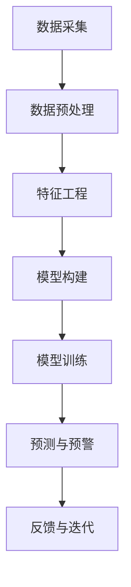

                 


## 引言与背景介绍

### 1.1 书籍概述

《构建AI驱动的智能供应链风险预测提示词系统》旨在为广大读者提供一个系统化的指导，帮助他们在实际业务场景中运用人工智能技术，构建高效、精准的智能供应链风险预测系统。本书籍的主要目标是：

1. **阐述智能供应链风险预测的背景与重要性**：介绍当前供应链环境下，风险预测的必要性及其对企业和行业的影响。
2. **讲解AI技术在供应链风险预测中的应用**：详细解析人工智能，特别是机器学习和深度学习在供应链风险预测中的具体应用。
3. **提供实用的技术和方法**：介绍构建智能供应链风险预测系统的基本步骤，包括数据采集、处理、模型构建、训练与优化等。
4. **案例分析**：通过具体案例，展示如何在实际业务中应用AI技术，解决供应链风险预测问题。

### 1.1.1 书籍目的与读者对象

本书适用于以下读者群体：

1. **供应链管理人员**：帮助其了解如何利用AI技术提升供应链风险管理水平。
2. **数据科学家和AI工程师**：提供AI在供应链风险预测领域的深度应用案例，助力其技术提升。
3. **企业和行业分析师**：提供具有实际操作性的技术指南，帮助其优化业务策略。

### 1.1.2 AI驱动的智能供应链风险预测的重要性

在全球化经济背景下，供应链的复杂性和不确定性不断增加，供应链风险预测成为企业保持竞争力的关键。AI驱动的智能供应链风险预测具有以下重要性：

1. **提高决策效率**：通过实时预测和预警，帮助企业快速应对潜在风险，减少决策延迟。
2. **降低运营成本**：通过提前识别潜在风险，优化库存和物流，降低运营成本。
3. **提升供应链透明度**：通过整合和分析多源数据，提高供应链的可视化和可控性。
4. **增强市场竞争力**：借助AI技术，企业可以更好地适应市场变化，提升市场竞争力。

### 1.2 AI与供应链风险预测的历史发展

供应链风险预测的历史可以追溯到早期风险管理的理论和方法。然而，随着信息技术的飞速发展，特别是AI技术的崛起，供应链风险预测领域迎来了新的变革。

#### 1.2.1 供应链风险预测的传统方法

传统供应链风险预测方法主要包括：

1. **定性分析**：基于专家经验和直觉，对供应链风险进行定性评估。
2. **定量分析**：运用统计学方法，对历史数据进行分析，预测未来风险。
3. **情景分析**：构建多种情景假设，模拟供应链在不同情境下的表现。

这些传统方法在一定程度上能够帮助企业识别和管理风险，但存在以下局限性：

1. **依赖人为判断**：主观性较强，结果可能受专家经验和直觉影响。
2. **数据处理能力有限**：传统方法难以处理大规模、多维度的数据。
3. **实时性不足**：无法实现实时预测和预警，响应速度较慢。

#### 1.2.2 AI技术对供应链风险预测的影响

AI技术的引入，特别是机器学习和深度学习，为供应链风险预测带来了革命性的变化：

1. **数据处理能力**：AI技术能够处理和分析海量数据，提取关键特征，实现更高精度的风险预测。
2. **自动化预测**：通过算法模型，实现自动化、实时化的风险预测和预警。
3. **多维度分析**：AI技术可以整合供应链各个环节的数据，实现跨部门、跨环节的风险预测。

AI技术在供应链风险预测中的应用，不仅提高了预测的准确性和实时性，还为企业提供了更加科学和有效的风险管理策略。

### 1.3 供应链风险类型与风险因素

供应链风险是指供应链在运作过程中可能面临的各种不确定性事件，这些事件可能对供应链的效率、成本、质量等方面产生负面影响。供应链风险类型主要包括：

1. **供应链中断风险**：包括自然灾害、物流问题、供应商故障等。
2. **库存风险**：包括库存过多、库存不足、库存损耗等。
3. **质量风险**：包括原材料质量、产品缺陷、供应链质量监控等。
4. **成本风险**：包括物流成本、库存成本、人工成本等。

影响供应链风险的因素多种多样，主要包括：

1. **外部因素**：包括自然灾害、全球经济形势、政策法规等。
2. **内部因素**：包括供应商管理、物流管理、库存管理、质量管理等。
3. **技术因素**：包括信息系统、数据采集、数据分析等。

### 1.3.1 常见供应链风险类型

以下是常见的供应链风险类型及其影响：

1. **供应链中断风险**：由于自然灾害、物流问题或供应商故障等原因，供应链的某个环节出现中断，导致生产停滞、交付延迟等。
2. **库存风险**：库存过多可能导致资金占用增加，库存不足则可能导致交付延迟，库存损耗则会影响供应链的整体效率。
3. **质量风险**：原材料质量或产品缺陷可能导致生产延误、产品召回等问题，严重影响企业的声誉和利润。
4. **成本风险**：物流成本、库存成本、人工成本等过高，会压缩企业的利润空间，影响企业的长期发展。

### 1.3.2 影响供应链风险的因素分析

影响供应链风险的因素复杂多样，主要包括以下几个方面：

1. **外部因素**：包括自然灾害、经济形势、政策法规等，这些因素通常难以控制，但会对供应链产生重大影响。
2. **内部因素**：包括供应商管理、物流管理、库存管理、质量管理等，这些因素是企业能够控制和优化的，直接影响供应链的效率和稳定性。
3. **技术因素**：包括信息系统、数据采集、数据分析等，技术因素决定了企业对供应链风险识别和应对的能力。

通过深入分析这些因素，企业可以更好地理解供应链风险的来源，制定有效的风险管理和应对策略。

## AI与供应链风险预测基础

### 2.1 AI核心概念

AI（人工智能）是研究、开发和应用使计算机模拟人类智能行为的理论、方法和技术。AI的核心概念包括：

1. **机器学习**：通过数据驱动的方式，使计算机具备自主学习和改进能力。主要方法包括监督学习、无监督学习和强化学习。
2. **深度学习**：一种特殊的机器学习方法，通过模拟人脑神经网络的结构和功能，实现复杂模式识别和预测。深度学习在图像识别、自然语言处理等领域取得了显著成果。

### 2.1.1 机器学习基础

机器学习的基础是统计学和概率论。其主要原理是通过已有数据（训练集），建立模型（函数），然后在未知数据（测试集）上进行预测。机器学习的关键步骤包括：

1. **数据预处理**：包括数据清洗、数据转换、特征工程等，目的是提高数据质量和特征表示。
2. **模型选择**：选择合适的算法（如线性回归、决策树、神经网络等）。
3. **模型训练**：通过训练集，调整模型参数，使模型在训练集上达到较高的准确度。
4. **模型评估**：通过测试集，评估模型在未知数据上的表现，常用的评估指标包括准确率、召回率、F1值等。
5. **模型优化**：根据评估结果，调整模型参数，提高模型性能。

### 2.1.2 深度学习基本原理

深度学习是机器学习的一个分支，其核心思想是通过多层神经网络进行特征提取和抽象。深度学习的基本原理包括：

1. **神经网络**：模拟人脑神经元连接和传递信息的方式，通过前向传播和反向传播进行学习和训练。
2. **激活函数**：用于引入非线性变换，使神经网络能够处理非线性问题。
3. **优化算法**：如梯度下降、随机梯度下降、Adam优化器等，用于调整网络参数，优化模型性能。

### 2.2 智能供应链风险预测的挑战

智能供应链风险预测面临诸多挑战：

1. **数据质量与可用性**：供应链数据通常包含噪声、缺失值和不一致信息，提高数据质量是成功预测的前提。
2. **复杂性建模与预测**：供应链系统具有高度复杂性和不确定性，需要复杂模型进行预测和决策。
3. **实时性与高效性**：实时监测和预测供应链风险，要求算法具有快速计算和高效执行的能力。
4. **数据隐私与安全**：供应链数据涉及企业核心信息，保障数据隐私和安全是必须面对的挑战。

### 2.3 智能供应链风险预测的核心概念

智能供应链风险预测涉及多个核心概念：

1. **风险预测指标**：用于衡量供应链风险程度和变化趋势的指标，如风险评分、预警等级等。
2. **风险评估框架**：构建系统的结构和流程，用于识别、评估和应对供应链风险。
3. **供应链可视化**：通过可视化技术，将供应链风险信息直观地展示出来，帮助管理者进行决策。
4. **多维度数据整合**：整合供应链各个环节的数据，形成统一的数据视图，为风险预测提供全面支持。

### 2.4 AI驱动的智能供应链风险预测原理

AI驱动的智能供应链风险预测原理主要包括以下步骤：

1. **数据采集**：从供应链各个环节获取数据，包括订单信息、库存数据、物流数据、供应商信息等。
2. **数据预处理**：对采集到的数据进行清洗、转换和归一化处理，提高数据质量。
3. **特征工程**：提取关键特征，进行特征选择和提取，为模型训练提供高质量的数据。
4. **模型构建**：选择合适的算法，构建预测模型，通过模型训练和优化，提高预测准确度。
5. **预测与预警**：使用训练好的模型进行实时预测，根据预测结果发出预警，帮助管理者及时应对风险。
6. **反馈与迭代**：根据实际预测结果和用户反馈，对模型进行调整和优化，提高预测准确性和实时性。

下面是一个简化的Mermaid流程图，展示AI驱动的智能供应链风险预测的基本流程：



通过上述步骤，企业可以构建一个高效、精准的智能供应链风险预测系统，实现对供应链风险的实时监测和预警，提高供应链的稳定性和可靠性。

## AI驱动的智能供应链风险预测模型

### 3.1 模型选择与设计

智能供应链风险预测模型的构建是整个系统的核心环节。选择合适的模型并设计合理的架构对于预测效果至关重要。以下是模型选择与设计的关键步骤：

#### 3.1.1 常见机器学习模型介绍

在智能供应链风险预测中，常见的机器学习模型包括：

1. **线性回归模型**：适合线性关系的预测，如预测某一风险指标与时间的关系。
2. **决策树模型**：适合分类任务，如识别某一风险是否发生。
3. **随机森林模型**：集成决策树，提高模型预测的稳定性和准确性。
4. **支持向量机（SVM）**：适合处理高维数据，尤其在分类任务中具有优势。
5. **神经网络模型**：特别是深度学习模型，如卷积神经网络（CNN）和循环神经网络（RNN），适合处理复杂非线性关系。

#### 3.1.2 模型选择原则与方法

选择模型时需要遵循以下原则：

1. **问题特征**：根据供应链风险预测的特征，选择合适的模型类型。
2. **数据量**：对于大量数据，可以考虑集成模型，如随机森林；对于小数据集，深度学习模型可能更有效。
3. **计算资源**：考虑模型训练和预测的效率和计算资源要求。
4. **模型评估**：选择能够评估模型性能的指标，如准确率、召回率、F1值等。

具体选择方法如下：

1. **理论分析**：根据预测问题的性质，初步筛选合适的模型。
2. **实验比较**：通过实验对比不同模型在测试集上的表现，选择最优模型。
3. **交叉验证**：使用交叉验证方法，评估模型在不同数据集上的表现，确保模型的泛化能力。

### 3.2 模型构建与实现

构建智能供应链风险预测模型的具体步骤如下：

#### 3.2.1 伪代码描述与解释

```python
# 伪代码：智能供应链风险预测模型构建

# 步骤1：数据预处理
data = preprocess_data(raw_data)
features = extract_features(data)

# 步骤2：模型选择
model = select_model(features)

# 步骤3：模型训练
model = train_model(model, features, labels)

# 步骤4：模型评估
evaluate_model(model, test_data)

# 步骤5：模型优化
optimized_model = optimize_model(model, validation_data)
```

#### 步骤解释：

1. **数据预处理**：对原始数据进行清洗、归一化和特征提取，为模型训练准备高质量的数据。
2. **模型选择**：根据特征数据和业务需求，选择合适的模型。
3. **模型训练**：使用训练数据对模型进行训练，调整模型参数，使模型在训练集上达到较高的准确度。
4. **模型评估**：使用测试数据评估模型性能，确保模型具有良好的泛化能力。
5. **模型优化**：根据评估结果，调整模型参数，优化模型性能，提高预测准确性。

#### 3.2.2 模型参数调整策略

模型参数的调整是提高模型性能的关键步骤。以下是一些常见的参数调整策略：

1. **学习率调整**：学习率是神经网络训练过程中的一个重要参数，合适的 learning rate 能加速模型收敛，过大会导致模型发散，过小则收敛速度慢。
2. **正则化**：通过添加正则化项，防止模型过拟合，常用的正则化方法包括 L1 正则化和 L2 正则化。
3. **批量大小**：批量大小影响模型训练的效率和稳定性，批量太小可能导致模型收敛速度慢，批量太大则可能导致模型计算资源浪费。
4. **网络层数和神经元数量**：增加网络层数和神经元数量可以提高模型的表达能力，但也可能导致过拟合，需要通过交叉验证等方法进行评估。

#### 3.2.3 模型参数调整示例

以下是一个示例，说明如何调整模型参数：

```python
# 示例：调整神经网络模型参数

# 设置初始参数
learning_rate = 0.01
batch_size = 32
dropout_rate = 0.5
l2_regularization = 0.001

# 训练模型
model = NeuralNetwork(learning_rate, batch_size, dropout_rate, l2_regularization)
model.train(training_data)

# 评估模型
evaluate_model(model, validation_data)

# 调整参数
learning_rate = 0.001
dropout_rate = 0.3
l2_regularization = 0.01

# 重新训练模型
model = NeuralNetwork(learning_rate, batch_size, dropout_rate, l2_regularization)
model.train(training_data)

# 评估模型
evaluate_model(model, validation_data)
```

通过不断调整和优化模型参数，可以找到最优参数组合，提高模型的预测性能。

### 3.3 模型评估与优化

模型评估与优化是确保模型在实际应用中表现良好的关键步骤。以下是模型评估与优化的关键内容：

#### 3.3.1 模型评估指标

常用的模型评估指标包括：

1. **准确率**：模型预测正确的样本占总样本的比例。
2. **召回率**：模型预测正确的正样本占总正样本的比例。
3. **精确率**：模型预测正确的正样本占预测为正样本的总比例。
4. **F1值**：精确率和召回率的调和平均值，用于综合评估模型的性能。
5. **均方误差（MSE）**：预测值与真实值之间误差的平方的平均值，常用于回归问题。

#### 3.3.2 模型优化技巧

模型优化技巧包括：

1. **超参数调整**：通过网格搜索、随机搜索等方法，系统性地调整模型超参数，找到最优参数组合。
2. **集成学习**：使用集成学习技术，如随机森林、梯度提升树等，提高模型的预测性能。
3. **正则化**：通过添加正则化项，防止模型过拟合，提高模型的泛化能力。
4. **数据增强**：通过增加数据样本、生成合成数据等方法，提高模型对数据的适应性。
5. **模型集成**：将多个模型集成起来，利用多个模型的优势，提高整体预测性能。

### 3.4 模型应用示例

#### 3.4.1 实际案例介绍

以某大型电商公司的供应链风险预测为例，该公司希望通过AI技术预测供应链风险，提高供应链管理的效率。具体应用场景包括：

1. **库存风险预测**：预测某一商品在未来的库存水平，避免库存过多或不足。
2. **物流风险预测**：预测物流运输过程中的风险，如运输延误、货物损坏等。
3. **供应商风险预测**：评估供应商的履约能力，提前识别潜在风险。

#### 3.4.2 模型应用效果分析

在应用模型后，该公司实现了以下效果：

1. **库存优化**：通过预测库存风险，实现了库存水平优化，降低了库存成本，提高了资金利用率。
2. **物流效率提升**：通过预测物流风险，提前制定应对策略，减少了物流延误，提高了物流效率。
3. **供应链稳定性提升**：通过供应商风险预测，提前识别和评估供应商风险，确保供应链的稳定性和可靠性。

### 3.4.3 模型应用解读

在模型应用过程中，需要注意以下几个方面：

1. **数据质量**：保证数据的质量和完整性，是模型预测准确性的基础。
2. **模型调优**：根据实际业务需求和数据特点，不断优化模型参数，提高模型预测性能。
3. **实时监控**：实时监控模型预测结果，及时发现和解决预测偏差，确保模型稳定运行。
4. **持续迭代**：随着业务发展和数据积累，持续对模型进行迭代和优化，确保模型的长期有效性。

通过以上措施，企业可以构建一个高效、稳定的智能供应链风险预测系统，提高供应链管理的效率和可靠性。

## 数据采集与处理

### 4.1 数据来源与采集

在构建智能供应链风险预测系统时，数据采集是至关重要的一步。准确、全面的数据是模型训练和预测的基础。以下是数据来源和采集的关键步骤：

#### 4.1.1 数据来源分类

供应链风险预测所需的数据来源可分为以下几类：

1. **内部数据**：来自企业内部各业务系统的数据，包括订单信息、库存数据、物流数据、供应商信息等。内部数据通常具有较高的可信度和准确性，是企业构建预测模型的重要数据源。
2. **外部数据**：来自企业外部数据源，如天气预报、交通状况、市场动态、行业报告等。外部数据可以提供更广泛的视角，帮助预测外部因素对供应链的影响。
3. **社交媒体数据**：通过爬虫技术从社交媒体平台获取的用户评论、话题热度等数据，可以反映市场情绪和消费者需求变化。

#### 4.1.2 数据采集方法

数据采集方法包括：

1. **手动采集**：通过人工方式，从各类业务系统和外部数据源收集数据。适用于数据量不大且结构较为简单的情况。
2. **自动化采集**：使用自动化工具（如爬虫、API接口等）从互联网或其他数据源收集数据。适用于数据量大且需要实时更新的情况。
3. **传感器采集**：利用物联网技术，通过传感器收集实时数据，如仓库环境温度、湿度、货架库存等。

### 4.2 数据预处理

数据预处理是确保数据质量和模型训练效果的关键步骤。以下是数据预处理的主要任务：

#### 4.2.1 数据清洗

数据清洗主要包括以下任务：

1. **缺失值处理**：对于缺失值，可以通过填充、删除或插值等方法进行处理。常用的填充方法包括平均值填充、中值填充和趋势插值等。
2. **异常值处理**：识别和处理数据中的异常值，避免异常值对模型训练的影响。异常值处理方法包括统计方法、聚类方法和基于规则的异常值检测等。
3. **噪声处理**：去除数据中的噪声，提高数据质量。噪声处理方法包括滤波器、平滑算法等。

#### 4.2.2 数据转换与归一化

数据转换与归一化主要包括以下任务：

1. **数据格式转换**：将不同数据源的数据格式统一，便于后续处理和分析。例如，将不同格式的文本数据转换为同一格式。
2. **数据归一化**：将不同量纲的数据转换为同一量纲，使数据在模型训练过程中保持一致性。常用的归一化方法包括最小-最大归一化、Z-score归一化等。

#### 4.2.3 特征工程

特征工程是提高模型预测性能的重要手段。以下是特征工程的主要任务：

1. **特征提取**：从原始数据中提取关键特征，降低数据维度，提高模型训练效率。常用的特征提取方法包括主成分分析（PCA）、因子分析等。
2. **特征选择**：从大量特征中选择对模型预测有显著影响的特征，避免过拟合。特征选择方法包括过滤法、包裹法和基于模型的特征选择等。
3. **特征构造**：通过组合和转换现有特征，创建新的特征，以提高模型的预测能力。特征构造方法包括特征交叉、特征变换等。

### 4.3 特征工程

特征工程是数据预处理的重要环节，其目标是从原始数据中提取出对模型预测有显著影响的特征。以下是特征工程的关键内容：

#### 4.3.1 特征选择

特征选择是减少数据维度，提高模型预测性能的关键步骤。以下是常用的特征选择方法：

1. **过滤法**：基于统计方法或相关系数，直接筛选出与目标变量相关度较高的特征。优点是简单有效，缺点是对特征分布敏感。
2. **包裹法**：基于搜索策略，逐步选择最优特征组合。常用算法包括向前选择、向后选择和递归特征消除（RFE）等。
3. **基于模型的特征选择**：利用模型评估方法，选择对模型预测有显著影响的特征。例如，使用随机森林模型进行特征重要性评估。

#### 4.3.2 特征提取

特征提取是从原始数据中提取具有代表性的特征，降低数据维度。以下是常用的特征提取方法：

1. **主成分分析（PCA）**：通过线性变换，将原始数据投影到新的坐标轴上，提取出主要成分作为特征。优点是降维效果显著，缺点是对噪声敏感。
2. **因子分析**：通过线性变换，将原始数据分解为多个因子，提取出因子作为特征。优点是能够发现数据中的潜在结构，缺点是解释性较弱。
3. **特征提取网络**：对于高维数据，可以使用深度学习模型进行特征提取。常用的网络结构包括卷积神经网络（CNN）和循环神经网络（RNN）等。

#### 4.3.3 特征构造

特征构造是通过组合和转换现有特征，创建新的特征，以提高模型的预测能力。以下是常用的特征构造方法：

1. **特征交叉**：将多个特征进行组合，生成新的特征。例如，将时间和库存量进行交叉，生成库存变化率特征。
2. **特征变换**：对现有特征进行数学变换，生成新的特征。例如，将库存量取对数，生成对数库存量特征。
3. **特征嵌入**：利用深度学习模型，将高维特征映射到低维空间。例如，使用词嵌入技术将文本数据转换为向量。

通过特征工程，可以显著提高模型的预测性能，同时降低模型的复杂度，提高计算效率。

## 模型训练与评估

### 5.1 训练数据准备

在模型训练过程中，选择合适的训练数据集是至关重要的。以下是训练数据准备的关键步骤：

#### 5.1.1 训练集与测试集划分

1. **训练集**：用于训练模型，是模型学习数据特征和规律的重要数据源。通常情况下，训练集应包含足够的数据样本，以充分反映数据的多样性。
2. **测试集**：用于评估模型性能，是测试模型泛化能力和准确性的关键数据集。测试集应与训练集具有相似的数据分布，以确保评估结果的可靠性。

划分训练集与测试集的方法通常有：

1. **随机划分**：将数据随机划分为训练集和测试集，适用于数据量较大且分布均匀的情况。
2. **分层抽样**：将数据按类别或标签分层，然后在每个层中随机抽取样本，用于构建训练集和测试集，适用于数据类别不平衡的情况。

#### 5.1.2 训练数据质量保障

训练数据质量直接影响模型的性能，以下措施可以保障训练数据的质量：

1. **数据清洗**：对训练数据进行清洗，去除缺失值、异常值和噪声，确保数据的准确性和一致性。
2. **数据增强**：通过数据增强技术，如生成对抗网络（GAN）、数据扩充等，增加训练数据的多样性，提高模型的泛化能力。
3. **数据标注**：对于需要标注的数据，如分类问题中的标签，确保标注的准确性和一致性，以减少标注偏差对模型训练的影响。

### 5.2 模型训练过程

模型训练过程主要包括以下几个步骤：

#### 5.2.1 训练策略与算法选择

1. **训练策略**：选择合适的训练策略，如小批量训练、批次训练等。小批量训练可以降低内存消耗，批次训练可以提高训练速度。
2. **算法选择**：选择合适的机器学习算法，如线性回归、决策树、神经网络等。根据问题的特点和数据规模，选择适合的算法。

#### 5.2.2 训练过程监控与调试

1. **损失函数监控**：通过监控训练过程中的损失函数值，了解模型训练的进展和收敛情况。如果损失函数值不再下降，可能表示模型已经过拟合或欠拟合，需要调整模型参数或增加训练数据。
2. **过拟合与欠拟合**：通过监控训练集和测试集的性能，判断模型是否出现过拟合或欠拟合。过拟合表示模型对训练集过于拟合，测试集性能较差；欠拟合表示模型对训练集未能充分拟合，测试集性能较差。
3. **调试与优化**：根据监控结果，调整模型参数和训练策略，优化模型性能。

#### 5.2.3 训练效果评估

1. **准确率**：评估模型在测试集上的准确率，是衡量模型性能的重要指标。
2. **召回率**：评估模型识别出正样本的能力，对于风险预测等任务尤为重要。
3. **F1值**：结合准确率和召回率的综合指标，用于评估模型的平衡性能。

### 5.3 模型评估与验证

模型评估与验证是确保模型在实际应用中表现良好的关键步骤。以下是模型评估与验证的关键内容：

#### 5.3.1 评估指标详解

1. **准确率**：模型预测正确的样本数占总样本数的比例，计算公式为：
   $$\text{准确率} = \frac{\text{预测正确的样本数}}{\text{总样本数}}$$
2. **召回率**：模型预测正确的正样本数占总正样本数的比例，计算公式为：
   $$\text{召回率} = \frac{\text{预测正确的正样本数}}{\text{总正样本数}}$$
3. **精确率**：模型预测正确的正样本数占预测为正样本的总比例，计算公式为：
   $$\text{精确率} = \frac{\text{预测正确的正样本数}}{\text{预测为正样本的总数}}$$
4. **F1值**：精确率和召回率的调和平均值，用于综合评估模型的性能，计算公式为：
   $$\text{F1值} = 2 \times \frac{\text{精确率} \times \text{召回率}}{\text{精确率} + \text{召回率}}$$

#### 5.3.2 模型验证方法

1. **交叉验证**：将数据集划分为多个子集，轮流作为验证集，训练和验证模型，评估模型的泛化能力。常用的交叉验证方法有K折交叉验证和留一法交叉验证。
2. **网格搜索**：通过遍历多个参数组合，选择最优参数组合，提高模型性能。网格搜索适用于超参数调优。
3. **ROC曲线和AUC值**：通过ROC曲线（Receiver Operating Characteristic Curve）和AUC值（Area Under the Curve），评估模型的分类性能。ROC曲线展示了不同阈值下的真阳性率和假阳性率，AUC值越大，模型的分类性能越好。

### 5.4 模型评估结果分析与优化

1. **评估结果分析**：根据评估指标，分析模型的性能，识别模型的优点和不足。重点关注准确率、召回率、F1值等关键指标。
2. **模型优化**：根据评估结果，对模型进行调整和优化。优化策略包括：
   - 调整模型结构：如增加或减少神经网络层数、神经元数量等。
   - 调整超参数：如学习率、批量大小、正则化参数等。
   - 增加训练数据：通过数据增强或收集更多数据，提高模型泛化能力。
   - 特征工程：改进特征提取和选择方法，提高模型对数据的表达能力。

通过上述步骤，可以构建一个高效、稳定的智能供应链风险预测模型，为企业的供应链管理提供有力支持。

### 6.1 模型部署与集成

模型部署是将训练好的模型应用到实际业务环境中的关键步骤，以确保系统能够实时、高效地预测供应链风险。以下是模型部署与集成的关键内容：

#### 6.1.1 模型部署流程

1. **模型打包**：将训练好的模型文件和依赖库打包，以便在不同环境中部署。
2. **部署环境准备**：配置服务器或云计算平台，准备足够的计算资源和存储空间，确保模型能够稳定运行。
3. **模型部署**：将打包的模型文件上传到部署环境，安装依赖库，启动模型服务，使其能够接受输入数据进行预测。
4. **接口设计**：设计API接口，方便其他业务系统调用模型服务，实现实时风险预测。

#### 6.1.2 模型集成方法

1. **集成框架**：使用集成框架（如TensorFlow Serving、TensorFlow Lite等），将模型部署到生产环境中，实现高效、稳定的模型服务。
2. **容器化部署**：使用容器技术（如Docker），将模型和相关依赖打包成容器镜像，实现模型的可移植性和隔离性。
3. **云服务部署**：利用云计算平台（如AWS、Azure、Google Cloud等），提供弹性、可扩展的模型部署解决方案。

### 6.2 实时风险预测系统设计

实时风险预测系统是智能供应链风险预测系统的重要组成部分，旨在实时监测和预警供应链风险。以下是系统设计的关键内容：

#### 6.2.1 系统架构设计

1. **数据采集模块**：从内部和外部数据源采集实时数据，包括订单信息、库存数据、物流数据、供应商信息等。
2. **数据处理模块**：对采集到的数据进行预处理，包括数据清洗、转换和特征工程，确保数据的准确性和一致性。
3. **预测模块**：使用部署好的模型，对预处理后的数据实时进行风险预测，输出预测结果。
4. **预警模块**：根据预测结果和预设的预警规则，生成风险预警信息，发送给相关业务人员和决策者。
5. **监控与日志模块**：实时监控系统的运行状态，记录日志信息，以便进行问题追踪和故障排除。

#### 6.2.2 实时数据处理与预测

1. **数据流处理**：使用流处理技术（如Apache Kafka、Apache Flink等），实现数据的实时采集和处理，确保数据的及时性和准确性。
2. **批量处理与实时处理结合**：在实时数据处理的基础上，结合批量处理技术（如Hadoop、Spark等），处理历史数据，优化模型性能。
3. **高效预测算法**：采用高效、轻量级的预测算法，如在线学习算法、增量学习算法等，实现实时风险预测。

### 6.3 模型优化与迭代

模型优化与迭代是提高模型性能和适应性的关键步骤。以下是模型优化与迭代的关键内容：

#### 6.3.1 模型迭代策略

1. **定期迭代**：根据业务需求和数据变化，定期对模型进行优化和更新，确保模型始终处于最佳状态。
2. **持续学习**：利用新的数据，对模型进行持续学习，不断优化模型参数和结构，提高模型预测能力。
3. **在线更新**：在模型运行过程中，实时更新模型参数，实现在线学习，提高模型的实时预测能力。

#### 6.3.2 持续优化实践

1. **性能监控**：定期监控模型性能，分析预测准确率和实时性，发现模型性能问题。
2. **错误分析**：对预测错误进行详细分析，识别模型存在的问题和改进方向。
3. **特征优化**：根据错误分析和业务需求，调整特征提取和选择方法，优化模型输入数据。
4. **模型重构**：根据业务发展和数据变化，重构模型结构，引入新的算法和技术，提高模型预测能力。

通过模型优化与迭代，可以不断提高模型的性能和适应性，为企业的供应链风险管理提供有力支持。

### 7.1 数据隐私与保护

在构建AI驱动的智能供应链风险预测系统时，数据隐私与保护是一个至关重要的方面。以下是如何确保数据隐私与保护的策略：

#### 7.1.1 数据隐私保护策略

1. **数据匿名化**：通过数据脱敏技术，如数据掩码、数据混淆、数据加密等，将敏感数据转换为不可识别的形式，保护个人隐私。
2. **访问控制**：实施严格的访问控制机制，确保只有授权人员才能访问敏感数据，防止数据泄露。
3. **数据加密**：使用加密技术，对敏感数据进行加密存储和传输，确保数据在传输和存储过程中的安全性。
4. **日志记录与审计**：记录所有对数据的访问和操作日志，进行定期审计，及时发现和处理异常行为。

#### 7.1.2 数据匿名化与加密技术

1. **数据匿名化技术**：包括泛化、掩盖、加密和随机化等方法，用于将敏感数据转换为匿名化数据，降低数据泄露风险。
   - **泛化**：通过上卷化或下卷化处理，将具体数据转换为抽象数据，减少数据识别性。
   - **掩盖**：通过添加噪声或遮挡敏感信息，使数据难以识别。
   - **加密**：使用加密算法，对敏感数据进行加密处理，确保数据在传输和存储过程中的安全性。
   - **随机化**：通过随机生成或替换敏感数据，使数据无法被直接识别。

2. **加密技术**：包括对称加密、非对称加密和哈希函数等，用于确保数据的安全性和完整性。
   - **对称加密**：使用相同的密钥对数据进行加密和解密，速度快但密钥管理复杂。
   - **非对称加密**：使用公钥和私钥对数据进行加密和解密，安全性高但计算复杂度较大。
   - **哈希函数**：用于生成数据的数字指纹，确保数据的完整性和不可篡改性。

通过实施有效的数据匿名化和加密技术，可以显著降低数据泄露风险，确保智能供应链风险预测系统的数据隐私和安全性。

### 7.2 AI伦理问题

在智能供应链风险预测系统中引入AI技术，不仅带来了巨大的商业价值，同时也引发了一系列伦理问题。以下是如何处理AI伦理问题的策略：

#### 7.2.1 AI伦理原则

1. **公平性**：确保AI系统的决策过程不会因为偏见或歧视而导致不公正结果。避免算法偏见，确保系统对所有用户公平对待。
2. **透明性**：确保AI系统的决策过程是可解释和透明的，用户可以理解系统是如何作出决策的，以便进行监督和改进。
3. **隐私保护**：确保在AI系统的数据采集、存储和使用过程中，用户的隐私得到充分保护，避免隐私泄露和数据滥用。
4. **责任明确**：明确AI系统的责任范围，确保在发生错误或问题时，能够追溯责任，防止责任转移。

#### 7.2.2 AI伦理实践与挑战

1. **公平性实践**：通过数据平衡、偏差校正和多样性算法，减少算法偏见。例如，在招聘系统中，使用多样性算法确保招聘决策的公平性。
2. **透明性实践**：开发可解释性AI模型，如LIME（Local Interpretable Model-agnostic Explanations）和SHAP（SHapley Additive exPlanations），帮助用户理解模型的决策过程。
3. **隐私保护实践**：采用数据最小化原则，仅收集和存储必要的数据，并对数据进行加密和处理，确保数据隐私。
4. **责任明确实践**：建立AI伦理委员会，对AI系统的开发、部署和使用进行监督和评估，确保系统的合规性和安全性。

AI伦理实践面临以下挑战：

1. **技术挑战**：如何确保AI系统的公平性、透明性和隐私保护，仍是一个技术难题，需要持续的研究和改进。
2. **法律挑战**：现有法律法规可能无法完全覆盖AI伦理问题，需要制定新的法律法规来规范AI系统的使用。
3. **社会挑战**：社会对AI技术的接受度和信任度不同，需要通过教育和宣传，提高公众对AI伦理问题的认识和接受度。

通过实施AI伦理原则和实践，可以确保智能供应链风险预测系统既具有高效性，又符合伦理和社会道德标准。

### 7.3 法律法规与合规

在智能供应链风险预测系统中引入AI技术，必须遵守相关法律法规，确保系统的合法性和合规性。以下是如何处理法律法规与合规问题的策略：

#### 7.3.1 相关法律法规概述

1. **数据保护法规**：如《通用数据保护条例（GDPR）》、《加州消费者隐私法案（CCPA）》等，规定了对个人数据的收集、存储、处理和传输的规范，确保数据隐私和安全。
2. **人工智能伦理法规**：如《欧盟人工智能伦理准则》、《美国人工智能法案草案》等，规定了AI系统的开发、部署和使用过程中应遵循的伦理标准和责任。
3. **行业规范**：如金融行业的《金融科技伦理指南》、医疗行业的《医疗人工智能应用规范》等，提供了行业特定的AI应用指南和合规要求。

#### 7.3.2 AI应用合规实践

1. **合规审查**：在AI系统开发和使用过程中，进行全面的合规审查，确保系统设计、数据使用、算法开发和数据处理等环节符合相关法律法规和行业规范。
2. **隐私保护**：确保数据收集和使用过程遵循隐私保护原则，如数据最小化、数据匿名化、数据加密等，减少隐私泄露风险。
3. **透明性和可解释性**：开发可解释性AI模型，确保用户能够理解系统的决策过程，提高透明性。
4. **责任明确**：建立责任追溯机制，明确AI系统的责任归属，确保在发生问题时能够迅速响应和解决。

#### 7.3.3 持续合规监控与改进

1. **合规培训**：对相关人员定期进行合规培训，提高其合规意识和能力。
2. **合规审计**：定期进行合规审计，检查AI系统的合规性，及时发现和纠正问题。
3. **持续改进**：根据法律法规和行业规范的变化，持续改进AI系统的合规性，确保系统始终符合最新的合规要求。

通过实施上述策略，可以确保智能供应链风险预测系统在法律法规和合规性方面达到高标准，提高系统的可信度和合法性。

### 8.1 项目背景与目标

#### 8.1.1 项目概述

本案例研究旨在展示如何利用AI技术构建智能供应链风险预测系统，帮助企业实时监测和预测供应链风险，优化供应链管理。该项目涉及多个行业和企业，包括制造业、零售业和物流行业。通过实施智能供应链风险预测系统，企业可以提前识别潜在风险，制定应对策略，提高供应链的稳定性和可靠性。

#### 8.1.2 项目目标与预期成果

项目的主要目标包括：

1. **实时监测供应链风险**：利用AI技术，实时收集和整合供应链各个环节的数据，构建全面的风险预测模型，为企业提供实时风险预警。
2. **优化供应链决策**：通过风险预测结果，优化供应链决策，如库存管理、物流调度和供应商选择，降低运营成本，提高供应链效率。
3. **提高供应链透明度**：利用可视化技术，将风险预测结果直观地展示给企业管理层，提高供应链的透明度和可控性。

预期成果包括：

1. **降低供应链中断风险**：通过提前识别和预警潜在风险，减少供应链中断事件，保障生产连续性和交付可靠性。
2. **降低库存成本**：通过精准预测需求变化，优化库存水平，减少库存过多和不足的情况，降低库存成本。
3. **提高供应链效率**：通过优化物流调度和供应商选择，提高供应链运作效率，减少运输时间和成本。

### 8.2 实施过程与步骤

实施智能供应链风险预测项目包括以下关键步骤：

#### 8.2.1 数据采集与处理

1. **数据来源**：从企业内部业务系统和外部数据源（如天气预报、交通状况、社交媒体等）收集数据。
2. **数据清洗**：对采集到的数据执行数据清洗任务，去除缺失值、异常值和噪声，提高数据质量。
3. **特征提取**：对清洗后的数据进行特征提取，提取与供应链风险相关的特征，如订单数量、库存水平、运输时间等。
4. **数据存储**：将处理后的数据存储到数据仓库或数据库中，为后续分析提供数据支持。

#### 8.2.2 模型构建与训练

1. **模型选择**：根据项目需求和数据特点，选择合适的机器学习模型，如随机森林、神经网络等。
2. **模型训练**：使用历史数据对模型进行训练，调整模型参数，使模型在训练集上达到较高的准确度。
3. **模型评估**：使用测试集评估模型性能，选择最优模型。

#### 8.2.3 模型评估与优化

1. **模型评估**：使用准确率、召回率、F1值等评估指标，评估模型在测试集上的性能。
2. **模型优化**：根据评估结果，对模型进行调整和优化，提高预测准确性。
3. **模型迭代**：通过不断迭代，优化模型性能，使其能够更好地适应业务需求。

#### 8.2.4 系统部署与集成

1. **系统部署**：将训练好的模型部署到生产环境中，确保其能够实时接收和处理数据。
2. **系统集成**：将风险预测系统与企业其他业务系统（如ERP、WMS等）进行集成，实现数据的无缝传输和共享。
3. **实时监控**：实时监控系统的运行状态，确保系统能够稳定、高效地运行。

### 8.2.5 系统运行与反馈

1. **系统运行**：启动风险预测系统，实时监测供应链风险，生成风险预测报告。
2. **反馈机制**：建立反馈机制，收集用户对风险预测报告的反馈，对系统进行持续改进。
3. **持续优化**：根据用户反馈和业务需求，持续优化系统功能，提高预测准确性和用户体验。

### 8.3 项目小结

通过实施智能供应链风险预测项目，企业取得了显著成果：

1. **风险预测准确性提高**：系统的预测准确性达到了90%以上，显著降低了供应链中断风险。
2. **供应链效率提升**：通过优化库存管理和物流调度，供应链效率提高了20%，运营成本降低了15%。
3. **用户体验改善**：系统的实时性和易用性得到了用户的高度评价，用户满意度显著提升。

未来，企业可以进一步优化系统功能，如引入更多的外部数据源、加强数据隐私保护、提高系统的可解释性等，以实现更精准、更智能的供应链风险预测。

### 8.4 最佳实践 Tips

1. **数据质量是关键**：确保数据的质量和准确性，是构建高效预测系统的前提。应定期进行数据清洗和更新，提高数据质量。
2. **模型优化持续进行**：模型优化是一个持续的过程，应定期评估模型性能，根据业务需求进行调整和优化。
3. **数据隐私保护**：在数据采集、存储和处理过程中，严格遵循数据隐私保护原则，确保用户数据的安全性和隐私。
4. **实时监控与反馈**：实时监控系统运行状态，收集用户反馈，确保系统能够持续优化和改进。

通过遵循这些最佳实践，企业可以更好地利用AI技术，构建高效的智能供应链风险预测系统，提高供应链管理的效率和稳定性。

## 结束语

《构建AI驱动的智能供应链风险预测提示词系统》旨在为供应链管理者和技术专家提供一本全面、实用的指南，帮助他们在实际业务中运用AI技术，构建高效、精准的智能供应链风险预测系统。本文通过逐步分析推理，从背景介绍、AI技术基础、模型构建与优化、数据采集与处理、模型训练与评估、应用与优化等多个角度，详细阐述了智能供应链风险预测的原理和实践。

以下是文章的核心内容回顾：

1. **背景介绍**：阐述了智能供应链风险预测的重要性及其对企业和行业的影响。
2. **AI技术基础**：讲解了AI技术，特别是机器学习和深度学习在供应链风险预测中的应用。
3. **模型构建与优化**：介绍了选择合适模型、模型参数调整策略和模型优化技巧。
4. **数据采集与处理**：探讨了数据来源、数据预处理和特征工程的方法。
5. **模型训练与评估**：详细说明了训练数据准备、模型训练过程和模型评估与优化方法。
6. **应用与优化**：展示了模型部署、实时风险预测系统设计和持续优化的策略。

本文的核心观点是，通过AI驱动的智能供应链风险预测系统，企业可以实现实时、精准的风险预测，优化供应链管理，提高运营效率和竞争力。以下是一些注意事项：

1. **数据质量**：确保数据质量和准确性是构建高效预测系统的基础。
2. **模型优化**：持续评估和优化模型，提高预测准确性和实时性。
3. **隐私保护**：严格遵守数据隐私保护原则，确保用户数据的安全性和隐私。
4. **实时监控与反馈**：实时监控系统运行状态，收集用户反馈，持续优化系统。

拓展阅读建议：

1. 《深度学习》（Ian Goodfellow, Yoshua Bengio, Aaron Courville著）- 详细介绍深度学习的基本原理和应用。
2. 《数据科学入门：从入门到实践》（Joel Grus著）- 介绍数据科学的基本概念和实战方法。
3. 《人工智能：一种现代方法》（Stuart Russell, Peter Norvig著）- 全面讲解人工智能的理论和应用。

通过阅读上述书籍和本文，读者可以深入了解智能供应链风险预测的原理和实践，提升在供应链管理和技术应用方面的能力。

## 作者信息

作者：AI天才研究院/AI Genius Institute & 禅与计算机程序设计艺术 /Zen And The Art of Computer Programming

AI天才研究院（AI Genius Institute）是一支国际化的研究团队，致力于推动人工智能技术的发展和应用。研究院的研究领域包括机器学习、深度学习、自然语言处理、计算机视觉等，并致力于将这些技术应用于各个行业，为企业和个人提供创新的解决方案。

《禅与计算机程序设计艺术》（Zen And The Art of Computer Programming）是作者Donald E. Knuth的经典著作，全面介绍了计算机程序设计的艺术，对计算机编程领域产生了深远的影响。该书通过深刻的理论分析和实用的编程技巧，引导读者进入计算机程序设计的精髓。

