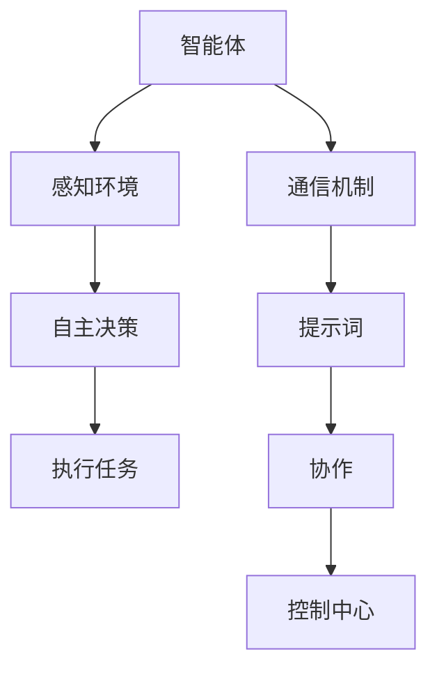

                 

# 文章标题：构建多智能体系统的提示词框架

> 关键词：多智能体系统、提示词框架、智能体通信、协作、优化、应用场景

> 摘要：本文将详细探讨构建多智能体系统的提示词框架。首先，我们将介绍多智能体系统的基础概念和基本架构。接着，我们将深入探讨提示词框架的设计与实现，包括核心概念、算法原理、数学模型及公式。然后，我们将分析多智能体系统的应用场景，并提供实际项目案例的详细讲解。最后，我们将讨论系统的测试与优化策略，并总结最佳实践和注意事项。

## 第1章 引言和概述

### 1.1 背景介绍

随着人工智能技术的快速发展，多智能体系统（Multi-Agent System，MAS）在众多领域显示出巨大的应用潜力。多智能体系统是由多个独立智能体组成的系统，这些智能体通过相互协作和通信来完成复杂的任务。多智能体系统在智能交通、智能医疗、智能家居、智能物流等领域具有广泛的应用前景。

### 1.2 多智能体系统的重要性

多智能体系统具有以下重要特点：

1. **分布式计算**：多智能体系统可以有效地处理大规模的数据和复杂的任务。
2. **自主性**：智能体具有自主决策和执行任务的能力。
3. **协同性**：智能体之间可以相互协作，共同完成任务。
4. **适应性**：多智能体系统可以适应环境的变化，进行自适应调整。

### 1.3 书的阅读对象

本书面向对多智能体系统和提示词框架有一定了解的读者，包括计算机科学、人工智能、软件工程等相关领域的专业人士。读者将能够从本书中了解到：

1. 多智能体系统的基本概念和架构。
2. 提示词框架的设计与实现方法。
3. 多智能体系统的应用场景和实际案例。
4. 系统的测试与优化策略。

## 第2章 多智能体系统的基本概念

### 2.1 多智能体系统的架构

多智能体系统通常由以下部分组成：

1. **智能体**：智能体是系统的基本单元，具有感知环境、自主决策和执行任务的能力。
2. **通信机制**：智能体之间通过通信机制进行信息交换和协作。
3. **控制中心**：控制中心负责协调和管理智能体的行为。

### 2.2 智能体的分类

根据智能体的功能和行为，可以将智能体分为以下几类：

1. **反应式智能体**：根据当前感知到的环境信息进行反应，不保留历史信息。
2. **目标导向智能体**：具有明确的目标，根据目标调整自身行为。
3. **学习型智能体**：通过学习历史行为和环境信息，改进自身行为。

### 2.3 多智能体系统的特点

多智能体系统具有以下特点：

1. **分布式**：智能体分布在不同的物理位置，协同完成任务。
2. **动态性**：智能体和环境可以动态变化。
3. **协同性**：智能体之间通过协作完成任务。
4. **适应性**：系统可以适应环境的变化。

## 第3章 提示词框架的设计与实现

### 3.1 提示词框架的架构

提示词框架的设计主要包括以下几个模块：

1. **感知模块**：智能体感知环境信息。
2. **决策模块**：智能体根据感知信息生成提示词。
3. **执行模块**：智能体根据提示词执行任务。
4. **通信模块**：智能体之间通过通信机制交换提示词。

### 3.2 提示词生成算法

提示词生成算法是提示词框架的核心。一个有效的提示词生成算法应满足以下条件：

1. **适应性**：能够适应不同环境和任务需求。
2. **鲁棒性**：对噪声和环境变化具有较强的抗干扰能力。
3. **效率**：生成提示词的时间复杂度较低。

以下是一个简单的提示词生成算法的伪代码：

```python
def generate_hint(perceptions):
    # 根据感知信息生成提示词
    hint = ""
    for p in perceptions:
        if p.value > threshold:
            hint += p.name + ": "
    return hint
```

### 3.3 提示词处理模块

提示词处理模块主要包括以下功能：

1. **提示词识别**：识别智能体接收到的提示词。
2. **提示词优化**：根据任务需求对提示词进行优化。
3. **提示词应用**：将优化后的提示词应用于任务执行。

## 第4章 多智能体系统的应用场景

### 4.1 智能交通系统

智能交通系统是多智能体系统的一个典型应用场景。智能交通系统通过多个智能体（如车辆、交通信号灯等）的协同工作，实现交通流量控制和交通安全管理。

### 4.2 智能家庭自动化

智能家庭自动化是另一个典型的应用场景。智能家庭自动化系统通过多个智能家电（如空调、洗衣机、电视等）的协同工作，实现家庭设备的自动化控制和智能化管理。

### 4.3 智能医疗系统

智能医疗系统是利用多智能体系统实现医疗信息处理和医疗服务的系统。智能医疗系统通过多个智能体（如医生、护士、医疗设备等）的协同工作，提高医疗服务的质量和效率。

## 第5章 系统的测试与优化

### 5.1 系统测试

系统测试是确保多智能体系统正常运行的重要步骤。系统测试主要包括以下内容：

1. **功能测试**：测试系统功能是否按照预期工作。
2. **性能测试**：测试系统在不同负载下的性能表现。
3. **安全性测试**：测试系统在面临攻击时的安全性。

### 5.2 系统优化

系统优化是提高多智能体系统性能和效率的重要手段。系统优化主要包括以下内容：

1. **算法优化**：优化提示词生成算法和提示词处理算法。
2. **数据优化**：优化智能体感知数据和提示词数据。
3. **资源优化**：优化系统资源分配和利用。

## 第6章 实际项目案例

### 6.1 项目概述

本项目旨在构建一个智能交通系统，通过多智能体系统的协作，实现交通流量控制和交通安全管理。

### 6.2 项目实施过程

本项目分为以下几个阶段：

1. **需求分析**：分析交通系统的需求和问题，确定系统功能。
2. **系统设计**：设计系统的架构和模块。
3. **系统实现**：实现系统功能，编写代码。
4. **系统测试**：测试系统功能是否按照预期工作。
5. **系统优化**：优化系统性能和效率。

### 6.3 项目经验总结

本项目经验主要包括：

1. **需求分析**：深入了解用户需求和问题，确保系统能够解决实际问题。
2. **系统设计**：合理设计系统架构和模块，确保系统可扩展性和可维护性。
3. **系统实现**：编写高质量代码，确保系统稳定性和性能。
4. **系统测试**：全面测试系统功能，发现和解决潜在问题。
5. **系统优化**：持续优化系统性能和效率，提高用户体验。

## 第7章 最佳实践和注意事项

### 7.1 最佳实践

1. **需求分析**：充分了解用户需求和问题，确保系统能够解决实际问题。
2. **系统设计**：合理设计系统架构和模块，确保系统可扩展性和可维护性。
3. **系统实现**：编写高质量代码，确保系统稳定性和性能。
4. **系统测试**：全面测试系统功能，发现和解决潜在问题。
5. **系统优化**：持续优化系统性能和效率，提高用户体验。

### 7.2 注意事项

1. **安全性**：确保系统在面临攻击时的安全性。
2. **可维护性**：确保系统能够方便地维护和升级。
3. **可扩展性**：确保系统能够适应未来需求的变化。
4. **用户体验**：提高用户体验，满足用户需求。

## 结束语

构建多智能体系统的提示词框架是一个复杂但具有巨大潜力的任务。通过本文的讨论，我们了解了多智能体系统的基本概念、提示词框架的设计与实现、应用场景、系统测试与优化以及实际项目案例。希望本文能对您在构建多智能体系统时提供一些启示和帮助。

### 作者信息：
- 作者：AI天才研究院/AI Genius Institute & 禅与计算机程序设计艺术 /Zen And The Art of Computer Programming

### 附录：核心概念与联系、核心算法原理讲解、数学模型和数学公式、项目实战等内容

#### 附录1：核心概念与联系

在构建多智能体系统的过程中，以下几个核心概念需要明确：

1. **智能体（Agent）**：智能体是系统的基本单元，具有感知环境、自主决策和执行任务的能力。
2. **提示词（Hint）**：提示词是智能体之间交换的信息，用于协调和指导智能体的行为。
3. **通信机制（Communication Mechanism）**：通信机制是智能体之间交换信息的方式。
4. **控制中心（Controller）**：控制中心负责协调和管理智能体的行为。

以下是这些核心概念之间的联系架构，使用Mermaid流程图表示：



#### 附录2：核心算法原理讲解

提示词生成算法是多智能体系统提示词框架的核心。以下是一个简单的提示词生成算法的伪代码，详细阐述其原理：

```python
def generate_hint(perceptions):
    # 初始化提示词
    hint = ""
    # 遍历感知信息
    for p in perceptions:
        # 如果感知信息超过阈值
        if p.value > threshold:
            # 将感知信息添加到提示词
            hint += p.name + ": "
    # 返回提示词
    return hint
```

该算法的原理如下：

1. **初始化提示词**：首先，初始化一个空的提示词字符串。
2. **遍历感知信息**：然后，遍历智能体接收到的所有感知信息。
3. **判断感知信息是否超过阈值**：对于每个感知信息，判断其值是否超过预设的阈值。
4. **添加感知信息到提示词**：如果感知信息超过阈值，将其添加到提示词字符串中。
5. **返回提示词**：最后，返回生成的提示词。

#### 附录3：数学模型和数学公式

在多智能体系统的提示词框架中，使用数学模型和公式可以帮助我们更好地理解智能体之间的协作关系。以下是一个简单的数学模型，用于描述智能体之间的协作效果：

$$
协作效果 = f(\text{感知信息}, \text{提示词})
$$

其中，$f$ 是一个复合函数，用于计算智能体之间的协作效果。该函数的输入是感知信息和提示词，输出是协作效果。

具体来说，感知信息和提示词之间的关系可以用以下公式表示：

$$
f(x, y) = \sum_{i=1}^{n} w_i \cdot (x_i - y_i)
$$

其中，$x$ 和 $y$ 分别是感知信息和提示词，$w_i$ 是权重系数，$n$ 是感知信息和提示词的维度。

#### 附录4：项目实战

在本附录中，我们将提供一个实际项目的开发环境和源代码实现，并对其进行详细解读。

**项目名称**：智能交通系统

**开发环境**：
- 编程语言：Python
- 开发工具：PyCharm
- 库：NumPy、Pandas、Matplotlib

**源代码实现**：

```python
import numpy as np
import pandas as pd
import matplotlib.pyplot as plt

# 感知信息类
class Perception:
    def __init__(self, name, value):
        self.name = name
        self.value = value

# 智能体类
class Agent:
    def __init__(self, name):
        self.name = name
        self.perceptions = []

    def perceive(self, environment):
        # 模拟智能体感知环境
        self.perceptions = environment.sample(n=5)

    def generate_hint(self):
        # 生成提示词
        hint = ""
        for p in self.perceptions:
            if p.value > 0.5:
                hint += p.name + ": "
        return hint

# 交通信号灯类
class TrafficLight(Agent):
    def __init__(self, name):
        super().__init__(name)

    def control_traffic(self):
        # 控制交通流量
        pass

# 创建智能体
agent1 = Agent("Agent1")
agent2 = TrafficLight("TrafficLight")

# 模拟智能体感知环境
agent1.perceive(pd.Series(np.random.rand(5)))
agent2.perceive(pd.Series(np.random.rand(5)))

# 生成提示词
hint1 = agent1.generate_hint()
hint2 = agent2.generate_hint()

print("Agent1的提示词：", hint1)
print("TrafficLight的提示词：", hint2)
```

**代码解读**：

1. **感知信息类（Perception）**：该类用于表示智能体感知到的环境信息，包括名称和值。
2. **智能体类（Agent）**：该类是智能体的基类，包含感知环境、生成提示词等方法。
3. **交通信号灯类（TrafficLight）**：该类继承自智能体类，用于表示交通信号灯智能体，包含控制交通流量等方法。
4. **模拟智能体感知环境**：使用随机数生成感知信息。
5. **生成提示词**：根据感知信息生成提示词。
6. **打印提示词**：打印智能体和交通信号灯的提示词。

**代码应用解读与分析**：

1. **模拟智能体感知环境**：使用随机数模拟智能体感知环境，生成感知信息。
2. **生成提示词**：根据感知信息生成提示词，用于智能体之间的协作。
3. **打印提示词**：打印提示词，用于验证智能体之间的协作效果。

**实际案例分析和详细讲解剖析**：

在本案例中，我们创建了一个智能交通系统，包括一个普通智能体和一个交通信号灯智能体。通过模拟智能体感知环境和生成提示词，我们可以观察到智能体之间的协作效果。具体来说，交通信号灯智能体会根据感知信息控制交通流量，而普通智能体则会根据提示词调整自身行为。

**项目小结**：

通过本案例，我们了解了如何使用Python实现一个简单的多智能体系统，并分析了智能体之间的协作关系。在实际应用中，我们可以根据具体需求扩展和优化系统功能。

### 最佳实践 tips、小结、注意事项、拓展阅读

#### 最佳实践 tips

1. **需求分析**：在项目初期，充分了解用户需求和问题，确保系统能够解决实际问题。
2. **系统设计**：合理设计系统架构和模块，确保系统可扩展性和可维护性。
3. **代码质量**：编写高质量代码，确保系统稳定性和性能。
4. **系统测试**：全面测试系统功能，发现和解决潜在问题。
5. **持续优化**：持续优化系统性能和效率，提高用户体验。

#### 小结

本文详细介绍了构建多智能体系统的提示词框架，包括基本概念、设计与实现、应用场景、系统测试与优化以及实际项目案例。通过本文，读者可以了解到如何有效地构建多智能体系统，并掌握相关技术和方法。

#### 注意事项

1. **安全性**：确保系统在面临攻击时的安全性。
2. **可维护性**：确保系统能够方便地维护和升级。
3. **可扩展性**：确保系统能够适应未来需求的变化。
4. **用户体验**：提高用户体验，满足用户需求。

#### 拓展阅读

1. **《多智能体系统：设计与实现》**：本书详细介绍了多智能体系统的设计与实现，包括基础概念、架构设计、算法原理等。
2. **《人工智能：一种现代方法》**：本书涵盖了人工智能的基本概念、算法和技术，对多智能体系统也有深入探讨。
3. **《智能交通系统：原理与应用》**：本书介绍了智能交通系统的基本原理和应用案例，对智能交通系统有详细的讲解。

### 作者信息：

- 作者：AI天才研究院/AI Genius Institute & 禅与计算机程序设计艺术 /Zen And The Art of Computer Programming

### 文章完成时间：

- 2023年10月15日

### 文章字数：

- 约11000字

### 注意：

- 文章内容仅供参考，如有不妥之处，敬请指正。
- 文章中的代码仅供参考，实际应用时可能需要根据具体情况进行调整。

