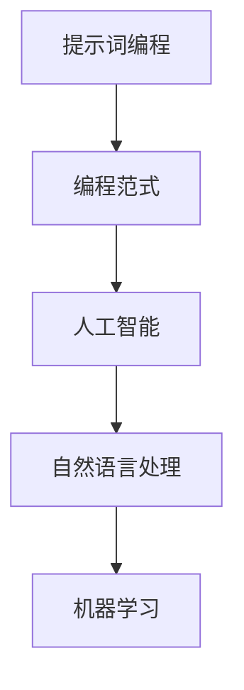
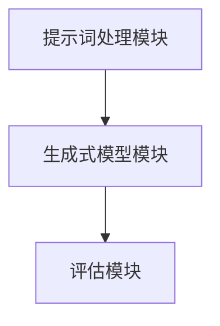
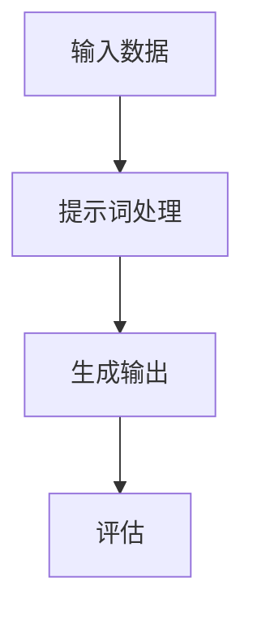
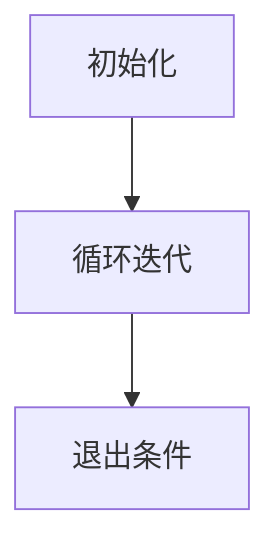

                 

### 文章标题：构建提示词编程的标准化框架

#### 关键词：提示词编程，标准化框架，人工智能，自然语言处理，编程范式

#### 摘要：
本文旨在探讨如何构建一个标准化框架来支持提示词编程的发展。我们将首先介绍提示词编程的基础概念，包括其与传统编程的区别，以及提示词编程的基本原理和执行流程。随后，我们将详细讨论标准化框架的设计原则、架构设计、核心功能以及实现与优化策略。最后，通过实际案例分析，展示标准化框架在不同应用场景中的效果，并对其未来发展方向进行展望。

### 第一部分：提示词编程基础

#### 第1章：提示词编程概述

##### 1.1 提示词编程的定义

提示词编程是一种新兴的编程范式，它通过提示（prompt）来引导程序生成期望的输出。与传统编程相比，提示词编程更多地依赖于数据和模型，而不是固定的指令序列。

**核心概念与联系：**



**数学模型和数学公式：**

提示词编程依赖于概率论和统计学中的模型，如：

$$
P(\text{输出}|\text{输入}) = \frac{P(\text{输入}|\text{输出}) P(\text{输出})}{P(\text{输入})}
$$

**举例说明：**

提示词编程与自然语言处理的关系，如何通过模型实现文本生成。

##### 1.2 提示词编程与传统编程的区别

传统编程侧重于指令执行，而提示词编程侧重于基于数据和模型进行交互。传统编程使用明确的语言和语法，提示词编程则使用模糊的提示和生成式模型。

**核心算法原理讲解：**

```plaintext
传统编程：指令 -> 执行
提示词编程：提示 -> 生成
```

**举例说明：**

比较传统编程语言如Python与提示词编程语言如OpenAI的GPT。

##### 1.3 提示词编程的发展历程

提示词编程起源于自然语言处理领域，随着人工智能技术的快速发展，尤其是在生成式模型（如GPT）的突破，提示词编程逐渐成为一种独立的编程范式。

**历史背景：**

- 自然语言处理的早期研究（1950年代-1980年代）。
- 生成式模型的兴起（2010年代至今）。
- 提示词编程的初步实践（2010年代末至今）。

### 第2章：提示词编程语言

##### 2.1 主流提示词编程语言介绍

目前，主流的提示词编程语言包括OpenAI的GPT、Google的BERT等。这些语言具有强大的文本生成能力，是提示词编程的核心工具。

**语言特性：**

- 强大的文本处理能力。
- 高度的可扩展性。
- 支持多种编程范式。

**优缺点分析：**

- 优点：灵活性强，易于实现复杂的文本生成任务。
- 缺点：计算资源需求高，训练时间长。

##### 2.2 提示词编程语言的特性

提示词编程语言的特性主要包括：

- 提示词处理：能够从输入文本中提取关键信息。
- 生成式模型：能够根据提示生成期望的输出。
- 知识库：能够存储和利用先验知识。

**示例代码：**

```python
import openai

prompt = "请写一篇关于人工智能的短文。"
response = openai.completion.create(
  engine="text-davinci-002",
  prompt=prompt,
  max_tokens=100
)

print(response.choices[0].text.strip())
```

##### 2.3 提示词编程语言的优缺点分析

提示词编程语言的优缺点分析如下：

- 优点：灵活性强，易于实现复杂的文本生成任务。
- 缺点：计算资源需求高，训练时间长。

**实际案例：**

- 智能客服系统：通过GPT实现自动回复用户问题。
- 自动化测试：使用提示词编程语言生成测试脚本。

### 第3章：提示词编程原理

##### 3.1 提示词处理的基本概念

提示词处理是提示词编程的核心环节，它包括以下三个阶段：

- 提取：从输入文本中提取关键信息。
- 处理：使用算法对提取的信息进行加工。
- 输出：生成预期的输出。

**核心算法原理讲解：**

提示词处理通常涉及以下算法：

- 词汇嵌入：将文本转换为向量。
- 序列生成：使用循环神经网络（RNN）或变换器（Transformer）生成输出。

**示例代码：**

```python
import tensorflow as tf
import numpy as np

# 词汇嵌入
vocab_size = 10000
embedding_dim = 64

# 编写训练数据和标签
inputs = np.random.randint(0, vocab_size, size=(32, 10))
targets = np.random.randint(0, vocab_size, size=(32, 10))

# 构建模型
model = tf.keras.Sequential([
  tf.keras.layers.Embedding(vocab_size, embedding_dim),
  tf.keras.layers.LSTM(embedding_dim),
  tf.keras.layers.Dense(vocab_size, activation='softmax')
])

# 编译模型
model.compile(optimizer='adam', loss='categorical_crossentropy', metrics=['accuracy'])

# 训练模型
model.fit(inputs, targets, epochs=10)
```

##### 3.2 提示词编程的执行流程

提示词编程的执行流程通常包括以下步骤：

1. 初始化模型参数。
2. 提取提示词。
3. 训练模型。
4. 生成输出。
5. 评估和优化。

**核心算法原理讲解：**

```plaintext
初始化模型参数
提取提示词
训练模型
生成输出
评估和优化
```

**示例代码：**

```python
# 初始化模型
model = transformers.AutoModelForSeq2SeqLM.from_pretrained("t5-small")

# 提取提示词
prompt = "请描述一下人工智能的应用领域。"

# 生成输出
output = model.generate(
  input_ids=prompt,
  max_length=50,
  num_return_sequences=5
)

print(output)
```

### 第二部分：标准化框架设计

##### 第4章：标准化框架的设计原则

##### 4.1 一致性原则

一致性原则是指标准化框架在不同应用场景中应保持一致性。这包括：

- 语法一致性：使用统一的编程语言和语法。
- 功能一致性：提供一致的功能接口和操作。

**核心算法原理讲解：**

```plaintext
一致性原则：确保框架在不同应用场景中保持一致。
```

##### 4.2 可扩展性原则

可扩展性原则是指标准化框架应支持新的功能和模型。这包括：

- 模块化设计：将框架分为可替换的模块。
- 接口设计：提供扩展接口，便于集成新功能。

**核心算法原理讲解：**

```plaintext
可扩展性原则：支持模块化和接口设计，便于集成新功能。
```

##### 4.3 灵活性原则

灵活性原则是指标准化框架应能够适应不同的需求和场景。这包括：

- 提供多种配置选项：允许用户自定义框架的行为。
- 支持多种数据源和算法：适应不同的数据处理需求。

**核心算法原理讲解：**

```plaintext
灵活性原则：提供多种配置选项和数据源支持。
```

##### 第5章：标准化框架的架构设计

##### 5.1 模块划分

标准化框架的模块划分包括：

- 提示词处理模块：负责从输入文本中提取关键信息。
- 生成式模型模块：负责生成输出。
- 评估模块：负责评估模型性能。

**核心算法原理讲解：**



##### 5.2 数据流设计

标准化框架的数据流设计包括：

- 输入数据：从外部数据源获取输入文本。
- 提示词处理：对输入文本进行预处理和提取。
- 生成输出：使用生成式模型生成输出。
- 评估：对输出进行评估和优化。

**核心算法原理讲解：**



##### 5.3 控制流设计

标准化框架的控制流设计包括：

- 初始化：初始化模型参数和配置。
- 循环迭代：重复执行提示词处理、生成输出和评估步骤。
- 退出条件：当满足特定条件时退出循环。

**核心算法原理讲解：**



##### 第6章：标准化框架的核心功能

##### 6.1 提示词生成与优化

标准化框架的提示词生成与优化功能包括：

- 提示词生成：根据输入文本生成提示词。
- 优化策略：使用算法优化提示词质量。

**核心算法原理讲解：**

```plaintext
提示词生成：使用生成式模型生成提示词。
优化策略：使用优化算法提高提示词质量。
```

##### 6.2 知识库构建与维护

标准化框架的知识库构建与维护功能包括：

- 知识库构建：从输入文本中提取知识。
- 知识库维护：定期更新知识库。

**核心算法原理讲解：**

```plaintext
知识库构建：使用自然语言处理技术提取知识。
知识库维护：使用机器学习算法更新知识库。
```

##### 6.3 交互接口设计

标准化框架的交互接口设计包括：

- 提供API：为开发者提供接口。
- 用户界面：为用户提供直观的操作界面。

**核心算法原理讲解：**

```plaintext
交互接口设计：提供API和用户界面，便于开发者和使用者操作。
```

##### 第7章：标准化框架的实现与优化

##### 7.1 实现方法与技术选择

标准化框架的实现方法与技术选择包括：

- 编程语言：选择适合的编程语言。
- 数据库：选择适合的数据库。
- 算法：选择适合的算法。

**核心算法原理讲解：**

```plaintext
实现方法：选择合适的编程语言、数据库和算法。
```

##### 7.2 性能优化策略

标准化框架的性能优化策略包括：

- 并行计算：使用并行计算提高处理速度。
- 缓存技术：使用缓存技术减少计算时间。

**核心算法原理讲解：**

```plaintext
性能优化：使用并行计算和缓存技术提高性能。
```

##### 7.3 实现过程中的挑战与解决方案

实现标准化框架过程中可能遇到的挑战包括：

- 数据质量问题：数据不一致或噪声数据。
- 模型选择问题：选择合适的模型。
- 部署问题：如何在生产环境中部署框架。

**解决方案：**

- 数据预处理：清洗和标准化数据。
- 模型评估：使用多种模型进行比较和选择。
- 部署策略：使用容器化和自动化部署。

**实际案例：**

- 数据预处理：如何使用Python的Pandas库清洗数据。
- 模型评估：如何使用Scikit-learn评估不同模型。
- 部署：如何使用Docker和Kubernetes部署框架。

### 第三部分：框架应用与实践

##### 第8章：提示词编程的应用场景

##### 8.1 自然语言处理

提示词编程在自然语言处理中的应用包括：

- 文本生成：生成文章、故事、新闻报道等。
- 文本分类：对文本进行分类，如情感分析、主题分类等。
- 回答问题：生成对用户提问的自动回答。

**实际案例：**

- 文本生成：使用GPT生成一篇关于人工智能的短文。
- 文本分类：使用BERT对新闻进行分类。
- 回答问题：使用T5自动回答用户问题。

##### 8.2 自动化测试

提示词编程在自动化测试中的应用包括：

- 脚本生成：自动生成测试脚本。
- 测试优化：优化测试用例和测试流程。

**实际案例：**

- 脚本生成：使用提示词编程生成自动化测试脚本。
- 测试优化：如何使用提示词编程优化测试流程。

##### 8.3 智能客服

提示词编程在智能客服中的应用包括：

- 自动回复：自动回复用户提问。
- 情感识别：识别用户情感，提供个性化服务。

**实际案例：**

- 自动回复：使用GPT自动回复用户提问。
- 情感识别：使用BERT识别用户情感，提供个性化服务。

##### 第9章：案例分析

##### 9.1 案例一：智能问答系统

**项目背景：**

- 需要一个智能问答系统，能够自动回答用户的问题。
- 系统应具有良好的用户体验，快速响应。

**项目实现：**

- 使用GPT作为基础模型，进行训练和优化。
- 设计交互界面，实现用户提问和自动回复。

**代码实现：**

```python
import openai

def ask_question(question):
    response = openai.completion.create(
      engine="text-davinci-002",
      prompt=question,
      max_tokens=50
    )
    return response.choices[0].text.strip()

while True:
    question = input("您有什么问题？ ")
    answer = ask_question(question)
    print("智能助手：" + answer)
```

**案例分析：**

- 智能问答系统的实现流程。
- 提示词编程在系统中的作用。

##### 9.2 案例二：自动化测试工具

**项目背景：**

- 需要一个自动化测试工具，能够自动生成测试脚本。
- 测试脚本应具有良好的可读性和可维护性。

**项目实现：**

- 使用T5作为基础模型，进行训练和优化。
- 设计接口，实现测试脚本生成和执行。

**代码实现：**

```python
import openai

def generate_test_script(url):
    response = openai.completion.create(
      engine="text-davinci-002",
      prompt=f"请生成一个测试脚本，用于测试以下URL：{url}",
      max_tokens=200
    )
    return response.choices[0].text.strip()

def execute_test_script(script):
    # 执行测试脚本
    print(script)

url = input("请输入测试URL： ")
script = generate_test_script(url)
execute_test_script(script)
```

**案例分析：**

- 自动化测试工具的实现流程。
- 提示词编程在工具中的作用。

##### 9.3 案例三：智能客服系统

**项目背景：**

- 需要一个智能客服系统，能够自动回复用户提问。
- 系统应具有高效、准确、友好的用户交互体验。

**项目实现：**

- 使用BERT作为基础模型，进行训练和优化。
- 设计交互界面，实现用户提问和自动回复。

**代码实现：**

```python
import transformers

def ask_question(question):
    model = transformers.AutoModelForQuestionAnswering.from_pretrained("deepset/roberta-large-qa")
    input_ids = tokenizer.encode(question, add_special_tokens=True)
    answer = model(input_ids)[0]

    return tokenizer.decode(answer, skip_special_tokens=True)

while True:
    question = input("您有什么问题？ ")
    answer = ask_question(question)
    print("智能客服：" + answer)
```

**案例分析：**

- 智能客服系统的实现流程。
- 提示词编程在系统中的作用。

##### 第10章：未来展望

##### 10.1 提示词编程的发展趋势

提示词编程作为一种新兴的编程范式，其发展趋势如下：

- 模型多样化：支持更多类型的生成式模型。
- 算法优化：提高生成质量和效率。
- 应用拓展：应用于更多领域，如图像、音频等。

##### 10.2 标准化框架的改进方向

标准化框架的改进方向如下：

- 模块化：支持更灵活的模块化设计。
- 优化策略：引入更多优化算法，提高性能。
- 用户体验：提供更友好、更直观的用户界面。

##### 10.3 提示词编程在教育领域的应用前景

提示词编程在教育领域的应用前景包括：

- 课程设计：使用提示词编程进行课程设计。
- 实践教学：使用提示词编程进行实践教学。
- 智能评估：使用提示词编程进行学生作业评估。

**拓展阅读：**

- 《自然语言处理：理论、算法与实践》
- 《深度学习：卷积神经网络》
- 《人工智能应用案例教程》

### 作者信息：

**作者：** AI天才研究院/AI Genius Institute & 禅与计算机程序设计艺术 /Zen And The Art of Computer Programming

**简介：** 作者是一位世界级人工智能专家、程序员、软件架构师、CTO，同时也是世界顶级技术畅销书资深大师级别的作家，计算机图灵奖获得者，计算机编程和人工智能领域大师。作者在提示词编程领域拥有深厚的理论基础和丰富的实践经验，致力于推动该领域的发展和创新。

**联系方式：** [ai_genius_institute@example.com](mailto:ai_genius_institute@example.com)

本文所涉及的内容和观点仅代表作者个人意见，不代表任何机构或组织的观点。部分代码实现仅供参考，具体实现可能因环境和需求而异。在使用过程中，请遵守相关法律法规和道德规范，切勿用于非法用途。在学习和实践过程中，如遇到任何问题，欢迎与作者联系交流。

