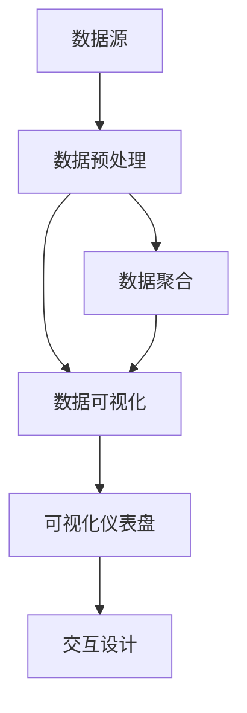

                 

### 文章标题

# 《构建评测结果的可视化仪表盘》

> 关键词：可视化仪表盘、评测结果、数据可视化、数据预处理、交互设计、项目实战、LaTeX、Mermaid、伪代码

> 摘要：
本文将深入探讨如何构建评测结果的可视化仪表盘。我们将从可视化仪表盘的基本概念、核心算法原理、数学模型讲解，到实际项目实战进行详细剖析。通过本文的阅读，读者将了解如何设计出高效、直观且易于操作的可视化仪表盘，以帮助用户更好地理解和分析评测结果。

### 设计思路

为了设计出《构建评测结果的可视化仪表盘》这本书的完整目录大纲，我们需要遵循以下思路：

1. **核心概念与联系**：
   - 首先明确本书的核心概念，例如“可视化仪表盘”、“评测结果”等。
   - 设计一个Mermaid流程图，展示这些核心概念之间的联系和数据处理流程。

2. **核心算法原理讲解**：
   - 确定书中需要讲解的核心算法，如数据清洗、数据聚合、数据可视化等。
   - 使用伪代码来详细阐述这些算法的实现。

3. **数学模型和数学公式讲解**：
   - 针对书中涉及到的数学模型，使用LaTeX格式进行详细讲解，并举例说明。

4. **项目实战**：
   - 设计一个实际的项目案例，包括开发环境搭建、源代码实现、代码解读与分析。

5. **章节结构设计**：
   - 根据上述内容，设计每个章节的具体内容，确保每个章节都有明确的主题和目标。
   - 确保目录结构清晰，便于读者阅读和理解。

### 实际操作步骤

1. **核心概念与联系**：
   - 设计一个Mermaid流程图，描述从评测结果到可视化仪表盘的整个数据处理流程。
   - 标注核心概念，如“数据源”、“数据处理”、“数据可视化”等。

2. **核心算法原理讲解**：
   - 根据需要讲解的算法，编写伪代码。
   - 对每个算法进行详细解释，说明其作用和实现方式。

3. **数学模型和数学公式讲解**：
   - 确定需要讲解的数学模型，使用LaTeX格式进行公式编写和解释。
   - 提供实际案例，说明公式的应用和计算过程。

4. **项目实战**：
   - 设计一个实际项目案例，包括开发环境搭建、代码实现、代码解读与分析。
   - 确保项目案例能够体现书中所讲解的理论和实践。

5. **章节结构设计**：
   - 根据上述内容，设计每个章节的目录，确保每个章节都有明确的主题和目标。
   - 确保目录结构清晰，便于读者阅读和理解。

### Markdown格式示例

以下是《构建评测结果的可视化仪表盘》目录大纲的Markdown格式示例：

```markdown
# 《构建评测结果的可视化仪表盘》目录大纲

# 第一部分：可视化仪表盘概述

## 第1章 可视化仪表盘基础

### 1.1 可视化仪表盘的定义和作用

### 1.2 可视化仪表盘的组成部分

### 1.3 可视化仪表盘的发展历程

## 第2章 评测结果的常见类型与处理

### 2.1 评测结果的数据来源

### 2.2 评测结果的预处理

### 2.3 评测结果的分类与聚合

# 第二部分：可视化仪表盘设计

## 第3章 可视化仪表盘的设计原则

### 3.1 用户体验设计

### 3.2 数据可视化设计

### 3.3 仪表盘的交互设计

## 第4章 常见可视化图表的选择与使用

### 4.1 折线图与柱状图

### 4.2 饼图与雷达图

### 4.3 地图与热力图

## 第5章 可视化仪表盘的开发与实现

### 5.1 开发环境搭建

### 5.2 数据可视化库的选择与应用

### 5.3 仪表盘的开发流程

# 第三部分：实战案例

## 第6章 实战项目一：员工绩效分析仪表盘

### 6.1 项目背景

### 6.2 数据处理流程

### 6.3 仪表盘设计

### 6.4 源代码实现与分析

## 第7章 实战项目二：产品销售趋势分析仪表盘

### 7.1 项目背景

### 7.2 数据处理流程

### 7.3 仪表盘设计

### 7.4 源代码实现与分析

# 附录

## 附录A：可视化仪表盘开发工具推荐

### A.1 常用数据可视化库介绍

### A.2 开发工具与资源

## 附录B：常见问题与解决方案

### B.1 数据处理中的常见问题

### B.2 可视化设计中的常见问题

### B.3 仪表盘开发中的常见问题
```

### 完整目录大纲

根据上述设计思路和实际操作步骤，以下是《构建评测结果的可视化仪表盘》的完整目录大纲：

```
# 《构建评测结果的可视化仪表盘》目录大纲

## 第1章 可视化仪表盘基础

### 1.1 可视化仪表盘的定义和作用

- 可视化仪表盘的定义
- 可视化仪表盘的作用

### 1.2 可视化仪表盘的组成部分

- 数据源
- 数据处理模块
- 可视化展示模块
- 交互模块

### 1.3 可视化仪表盘的发展历程

- 可视化仪表盘的起源
- 近年来的发展趋势

## 第2章 评测结果的常见类型与处理

### 2.1 评测结果的数据来源

- 内部数据来源
- 外部数据来源

### 2.2 评测结果的预处理

- 数据清洗
- 数据归一化
- 数据缺失值处理

### 2.3 评测结果的分类与聚合

- 分类指标
- 聚合指标

## 第3章 可视化仪表盘的设计原则

### 3.1 用户体验设计

- 用户需求分析
- 交互设计原则

### 3.2 数据可视化设计

- 可视化图表选择
- 可视化样式设计

### 3.3 仪表盘的交互设计

- 动态交互设计
- 用户反馈设计

## 第4章 常见可视化图表的选择与使用

### 4.1 折线图与柱状图

- 折线图的优点与应用
- 柱状图的使用方法与技巧

### 4.2 饼图与雷达图

- 饼图的应用场景
- 雷达图的解读方法

### 4.3 地图与热力图

- 地图的可视化分析
- 热力图的数据展示

## 第5章 可视化仪表盘的开发与实现

### 5.1 开发环境搭建

- 技术栈选择
- 开发工具配置

### 5.2 数据可视化库的选择与应用

- D3.js的应用
- Chart.js的使用

### 5.3 仪表盘的开发流程

- 需求分析
- 设计与开发

## 第6章 实战项目一：员工绩效分析仪表盘

### 6.1 项目背景

- 员工绩效分析的需求

### 6.2 数据处理流程

- 数据获取
- 数据处理

### 6.3 仪表盘设计

- 仪表盘界面设计
- 数据可视化设计

### 6.4 源代码实现与分析

- 源代码解析
- 代码优化与性能分析

## 第7章 实战项目二：产品销售趋势分析仪表盘

### 7.1 项目背景

- 产品销售趋势分析的需求

### 7.2 数据处理流程

- 数据获取
- 数据处理

### 7.3 仪表盘设计

- 仪表盘界面设计
- 数据可视化设计

### 7.4 源代码实现与分析

- 源代码解析
- 代码优化与性能分析

## 第8章 附录

### 附录A：可视化仪表盘开发工具推荐

- 常用数据可视化库
- 开发工具与资源

### 附录B：常见问题与解决方案

- 数据处理中的常见问题
- 可视化设计中的常见问题
- 仪表盘开发中的常见问题

## 参考文献

### 参考文献

- ...（列出参考文献列表）
```

### 背景介绍

在当今信息爆炸的时代，数据的获取和存储已经变得相对容易，但如何从海量数据中快速提取有价值的信息，成为了企业和组织面临的重要挑战。评测结果作为数据的一种重要形式，其分析结果的直观展示变得尤为重要。可视化仪表盘作为一种强大的数据展示工具，能够将复杂的数据转化为直观的图表，帮助用户快速理解和分析数据，从而做出更加明智的决策。

可视化仪表盘在商业、金融、医疗、教育等多个领域得到了广泛应用。例如，在商业领域，企业可以使用可视化仪表盘来监控销售数据、客户反馈和市场竞争状况；在金融领域，银行和投资机构可以通过仪表盘来实时跟踪市场动态和投资组合表现；在医疗领域，医生和研究人员可以利用仪表盘来分析病人的健康数据和治疗效果；在教育领域，学校和教育机构则可以通过仪表盘来监测学生的学习进度和教学质量。

然而，构建一个高效的、实用的可视化仪表盘并非易事。首先，需要对评测结果的数据进行准确的处理和清洗，确保数据的质量。其次，需要选择合适的数据可视化图表和设计原则，以便将数据以最直观、最易于理解的方式呈现给用户。此外，仪表盘的交互设计也是至关重要的，良好的交互设计能够提高用户的体验和满意度。

本文旨在通过详细的讲解和实战案例，帮助读者理解如何构建评测结果的可视化仪表盘。我们将从仪表盘的基本概念、核心算法原理、数学模型讲解，到实际项目实战进行深入剖析，让读者能够掌握从理论到实践的全过程。

### 核心概念与联系

在构建评测结果的可视化仪表盘过程中，有若干核心概念需要我们深入理解并正确运用，这些概念相互联系，构成了整个仪表盘设计的基础。以下是这些核心概念及其相互关系的详细阐述：

1. **可视化仪表盘**：可视化仪表盘是一种用于展示和分析数据的工具，它通过图表、指标、仪表板等形式，将数据转化为直观、易于理解的可视化展示。仪表盘通常包含多个图表，每个图表展示不同类型的数据，以便用户从不同角度进行分析。

2. **评测结果**：评测结果是指通过对某种现象、过程或产品进行评估后得出的数据。这些数据可能来源于内部数据库、外部数据源或第三方服务，它们是仪表盘展示的主要内容。

3. **数据预处理**：数据预处理是数据分析和可视化过程中至关重要的一环。它包括数据清洗、数据归一化、数据缺失值处理等步骤，旨在提高数据的质量和一致性，为后续的分析和可视化提供可靠的数据基础。

4. **数据可视化**：数据可视化是将数据转化为图表、图形或其他可视化形式的过程。它能够帮助用户更直观地理解和分析数据，发现潜在的趋势和模式。

5. **交互设计**：交互设计是指用户与仪表盘的交互方式设计，包括用户界面布局、交互控件、交互逻辑等。良好的交互设计能够提高用户的使用体验，使仪表盘更加易于操作和理解。

这些概念之间的联系可以描述如下：

- **评测结果**是仪表盘展示的核心内容，它通过**数据预处理**步骤被清洗和标准化，确保数据质量。预处理后的数据然后被**数据可视化**，以图表等形式在仪表盘中展示。
- **可视化仪表盘**作为一个整体，需要考虑**交互设计**，以便用户能够方便地与仪表盘进行交互，查看和分析数据。
- **可视化仪表盘**与**数据可视化**是密不可分的，前者是后者的应用场景，后者是实现前者的技术手段。

为了更好地理解这些概念之间的关系，我们可以使用Mermaid流程图来展示整个数据处理和展示流程：



在上述流程图中：
- **A**表示数据源，可以是数据库、API或其他数据接口。
- **B**表示数据预处理，包括数据清洗、归一化、缺失值处理等。
- **C**表示数据可视化，选择合适的图表将数据展示出来。
- **D**表示可视化仪表盘，将多个图表组合在一起，形成完整的仪表盘。
- **E**表示交互设计，设计用户与仪表盘的交互方式。
- **F**表示数据聚合，对预处理后的数据进行汇总和分析。

通过上述流程图，我们可以清晰地看到各个核心概念之间的联系和数据处理流程。这种结构化的表示方式不仅有助于我们理解仪表盘的构建过程，也为后续的具体实现提供了明确的指导。

### 核心算法原理讲解

在构建评测结果的可视化仪表盘过程中，核心算法的设计和实现是关键环节。以下将详细讲解几个重要的核心算法，包括数据清洗、数据聚合和数据可视化等，并通过伪代码进行阐述。

#### 1. 数据清洗

数据清洗是确保数据质量的重要步骤，它包括去除重复数据、处理缺失值和异常值等。以下是一个简单示例，展示如何使用伪代码清洗数据。

```plaintext
// 数据清洗伪代码

function cleanData(dataSet):
    # 删除重复数据
    uniqueDataSet = removeDuplicates(dataSet)
    
    # 处理缺失值
    for each row in uniqueDataSet:
        if isEmpty(row[missingColumn]):
            row[missingColumn] = mean(uniqueDataSet[missingColumn])
    
    # 处理异常值
    for each row in uniqueDataSet:
        if isOutlier(row[numericColumn]):
            row[numericColumn] = median(uniqueDataSet[numericColumn])
    
    return uniqueDataSet
```

在上述伪代码中，`removeDuplicates`函数用于删除重复数据，`isEmpty`函数用于检查某列是否存在缺失值，`isOutlier`函数用于检测异常值，并根据平均值或中位数进行修正。

#### 2. 数据聚合

数据聚合是对预处理后的数据进行汇总和分析，以便在仪表盘中展示。以下是一个简单的聚合算法示例，用于计算每组数据的总和和平均值。

```plaintext
// 数据聚合伪代码

function aggregateData(dataSet):
    aggregateResults = {}
    for each group in dataSet:
        sum = 0
        count = 0
        for each row in group:
            sum += row[numericColumn]
            count += 1
        aggregateResults[groupName] = {
            "sum": sum,
            "average": sum / count
        }
    return aggregateResults
```

在上述伪代码中，`aggregateResults`字典用于存储每组数据的总和和平均值，`sum`变量用于累加每组数据的数值，`count`变量用于记录数据条数。

#### 3. 数据可视化

数据可视化是将清洗和聚合后的数据转化为图表的过程。以下是一个简单的可视化算法示例，用于创建折线图和柱状图。

```plaintext
// 数据可视化伪代码

function visualizeData(aggregateResults):
    # 创建折线图
    lineChartData = {
        "labels": [],
        "datasets": [
            {
                "label": "总数",
                "data": [],
                "backgroundColor": "rgba(75,192,192,0.2)",
                "borderColor": "rgba(75,192,192,1)",
                "pointBorderColor": "rgba(75,192,192,1)",
                "pointBackgroundColor": "#fff",
                "pointHoverBackgroundColor": "#fff",
                "pointHoverBorderColor": "rgba(75,192,192,1)"
            }
        ]
    }
    for each group in aggregateResults:
        lineChartData["labels"].append(groupName)
        lineChartData["datasets"][0]["data"].append(aggregateResults[group]["sum"])
    
    # 创建柱状图
    barChartData = {
        "labels": lineChartData["labels"],
        "datasets": [
            {
                "label": "平均数",
                "data": [],
                "backgroundColor": "rgba(255,99,132,0.2)",
                "borderColor": "rgba(255,99,132,1)",
                "hoverBackgroundColor": "rgba(255,99,132,1)",
                "hoverBorderColor": "rgba(255,99,132,1)"
            }
        ]
    }
    for each group in aggregateResults:
        barChartData["datasets"][0]["data"].append(aggregateResults[group]["average"])
    
    return lineChartData, barChartData
```

在上述伪代码中，`lineChartData`和`barChartData`是创建折线图和柱状图的数据结构，分别包含标签、数据和图表样式等信息。这些数据可以用于后续的图表渲染。

#### 算法详细解释

1. **数据清洗**：
   - 删除重复数据：通过`removeDuplicates`函数，将重复的数据条目去除，保证数据的唯一性。
   - 处理缺失值：通过`isEmpty`函数检查数据中的缺失值，并使用平均值或中位数进行填补，保证数据的完整性。
   - 处理异常值：通过`isOutlier`函数检测并处理异常值，防止异常数据对整体分析结果产生误导。

2. **数据聚合**：
   - 对每组数据进行汇总：通过遍历数据集，计算每组数据的总和和平均值，为后续的图表展示提供基础数据。
   - 将结果存储在字典中：使用`aggregateResults`字典存储每组的汇总结果，便于后续的数据可视化处理。

3. **数据可视化**：
   - 创建折线图：通过`lineChartData`结构，将数据的标签和数值填充到图表数据中，实现折线图的绘制。
   - 创建柱状图：通过`barChartData`结构，将数据的标签和平均值填充到图表数据中，实现柱状图的绘制。

这些核心算法为构建可视化仪表盘提供了技术基础。通过详细讲解和示例代码，读者可以更好地理解每个算法的作用和实现方式，为实际项目中的数据分析和展示提供有力支持。

### 数学模型和数学公式讲解

在构建评测结果的可视化仪表盘过程中，数学模型和公式的应用至关重要。以下将介绍几个常见的数学模型和公式，并使用LaTeX格式进行详细讲解，同时提供实际案例说明其应用和计算过程。

#### 1. 均值（Mean）

均值是衡量一组数据集中趋势的重要指标，计算方法为将所有数据值相加，然后除以数据的个数。其公式如下：

$$
\bar{x} = \frac{1}{n} \sum_{i=1}^{n} x_i
$$

其中，$\bar{x}$表示均值，$n$表示数据个数，$x_i$表示第$i$个数据值。

**实际案例**：假设有一组考试成绩为 [85, 92, 78, 90, 88]，计算这组数据的均值。

$$
\bar{x} = \frac{1}{5} (85 + 92 + 78 + 90 + 88) = \frac{433}{5} = 86.6
$$

因此，这组数据的均值为86.6分。

#### 2. 中位数（Median）

中位数是将一组数据从小到大排序后，位于中间位置的数值。如果数据个数为奇数，中位数即为中间的那个数；如果数据个数为偶数，则中位数为中间两个数的平均值。其公式如下：

$$
M = \begin{cases} 
x_{\lceil \frac{n}{2} \rceil} & \text{如果} \ n \ \text{是奇数} \\
\frac{x_{\frac{n}{2}} + x_{\frac{n}{2} + 1}}{2} & \text{如果} \ n \ \text{是偶数}
\end{cases}
$$

其中，$M$表示中位数，$n$表示数据个数，$x_{\lceil \frac{n}{2} \rceil}$和$x_{\frac{n}{2}}$分别表示中间位置的数值。

**实际案例**：假设有一组考试成绩为 [70, 85, 90, 92, 95]，计算这组数据的中位数。

由于数据个数为5（奇数），中位数为中间的那个数，即90。

#### 3. 标准差（Standard Deviation）

标准差是衡量一组数据离散程度的指标，计算方法为每个数据值与均值之差的平方的平均数的平方根。其公式如下：

$$
\sigma = \sqrt{\frac{1}{n-1} \sum_{i=1}^{n} (x_i - \bar{x})^2}
$$

其中，$\sigma$表示标准差，$n$表示数据个数，$\bar{x}$表示均值，$x_i$表示第$i$个数据值。

**实际案例**：假设有一组考试成绩为 [85, 92, 78, 90, 88]，计算这组数据的标准差。

首先计算均值：

$$
\bar{x} = \frac{1}{5} (85 + 92 + 78 + 90 + 88) = 86.6
$$

然后计算每个数据值与均值之差的平方：

$$
(85 - 86.6)^2 = 2.76 \\
(92 - 86.6)^2 = 19.36 \\
(78 - 86.6)^2 = 52.76 \\
(90 - 86.6)^2 = 6.76 \\
(88 - 86.6)^2 = 1.96
$$

计算这些平方和的平均数：

$$
\frac{2.76 + 19.36 + 52.76 + 6.76 + 1.96}{5 - 1} = \frac{83.2}{4} = 20.8
$$

最后计算标准差：

$$
\sigma = \sqrt{20.8} \approx 4.54
$$

因此，这组数据的标准差为4.54。

通过上述数学模型和公式的讲解，我们可以看到它们在数据分析中的重要性。在实际项目中，这些模型和公式可以帮助我们更准确地理解和分析数据，从而构建出高效且直观的可视化仪表盘。

### 项目实战

为了更好地理解如何构建评测结果的可视化仪表盘，以下我们将通过一个实际项目案例——员工绩效分析仪表盘，详细讲解开发环境搭建、源代码实现、代码解读与分析，并展示项目应用解读与分析。

#### 项目背景

某公司需要对员工的绩效进行详细分析，以便了解员工的工作表现和公司整体运营状况。公司希望构建一个可视化的仪表盘，实时展示员工的工作时长、任务完成情况、绩效评分等关键数据。

#### 开发环境搭建

1. **技术栈选择**：
   - **前端**：使用HTML、CSS和JavaScript，结合D3.js库进行数据可视化。
   - **后端**：使用Node.js和Express框架处理数据请求和接口。
   - **数据库**：使用MongoDB存储员工绩效数据。

2. **开发工具配置**：
   - **代码编辑器**：Visual Studio Code（VS Code）。
   - **包管理器**：npm。
   - **数据库工具**：MongoDB Compass。

#### 源代码实现与分析

1. **数据获取与处理**：

首先，从数据库中获取员工绩效数据。假设数据存储在MongoDB中，结构如下：

```json
{
  "_id": ObjectId,
  "employeeId": "E12345",
  "name": "John Doe",
  "workHours": [8, 8, 8, 8, 8],
  "taskCompletion": [1, 1, 1, 1, 1],
  "performanceScore": [85, 88, 90, 92, 85]
}
```

使用Node.js编写接口获取数据：

```javascript
const express = require('express');
const MongoClient = require('mongodb').MongoClient;

const app = express();
const mongoUrl = 'mongodb://localhost:27017/';
const dbName = 'performanceDB';

// 连接MongoDB
MongoClient.connect(mongoUrl, { useUnifiedTopology: true }, (err, client) => {
  if (err) throw err;

  const db = client.db(dbName);
  app.get('/api/employees', async (req, res) => {
    try {
      const employees = await db.collection('employees').find({}).toArray();
      res.send(employees);
    } catch (error) {
      res.status(500).send(error);
    }
  });
});

app.listen(3000, () => {
  console.log('Server running on port 3000');
});
```

2. **数据处理与聚合**：

在处理数据时，我们需要对员工的工作时长、任务完成情况和绩效评分进行聚合计算，例如计算平均工作时长、平均任务完成率和平均绩效评分。以下是一个简单的数据处理和聚合示例：

```javascript
async function aggregateEmployeeData() {
  const db = client.db(dbName);
  const result = await db.collection('employees').aggregate([
    {
      $group: {
        _id: null,
        avgWorkHours: { $avg: '$workHours' },
        avgTaskCompletion: { $avg: '$taskCompletion' },
        avgPerformanceScore: { $avg: '$performanceScore' }
      }
    }
  ]).toArray();
  return result[0];
}

// 调用聚合函数获取结果
const aggregateResult = await aggregateEmployeeData();
console.log(aggregateResult);
```

3. **数据可视化**：

使用D3.js库创建可视化图表，展示员工绩效数据。以下是一个简单的折线图和柱状图示例：

```javascript
const width = 600;
const height = 300;
const margin = { top: 20, right: 20, bottom: 30, left: 40 };
const innerWidth = width - margin.left - margin.right;
const innerHeight = height - margin.top - margin.bottom;

const xScale = d3.scaleBand()
  .range([0, innerWidth])
  .padding(0.1);

const yScale = d3.scaleLinear()
  .range([innerHeight, 0]);

const svg = d3.select('#visualizations')
  .append('svg')
  .attr('width', width)
  .attr('height', height)
  .append('g')
  .attr('transform', `translate(${margin.left}, ${margin.top})`);

// 绘制折线图
d3.csv('data/employees.csv', (data) => {
  xScale.domain(data.map((d) => d.employeeId));
  yScale.domain([0, d3.max(data, (d) => d.performanceScore)]);

  svg.append('g')
    .attr('transform', `translate(0, ${innerHeight})`)
    .call(d3.axisBottom(xScale));

  svg.append('g')
    .call(d3.axisLeft(yScale));

  svg.append('path')
    .datum(data)
    .attr('fill', 'none')
    .attr('stroke', 'steelblue')
    .attr('stroke-width', 1.5)
    .attr('d', d3.line()
      .x((d) => xScale(d.employeeId))
      .y((d) => yScale(d.performanceScore))
    );
});

// 绘制柱状图
d3.json('data/employees.json', (data) => {
  xScale.domain(data.map((d) => d.employeeId));
  yScale.domain([0, d3.max(data, (d) => d.workHours)]);

  svg.append('g')
    .attr('transform', `translate(0, ${innerHeight})`)
    .call(d3.axisBottom(xScale));

  svg.append('g')
    .call(d3.axisLeft(yScale));

  svg.selectAll('.bar')
    .data(data)
    .enter().append('rect')
    .attr('class', 'bar')
    .attr('x', (d) => xScale(d.employeeId))
    .attr('y', (d) => yScale(d.workHours))
    .attr('width', xScale.bandwidth())
    .attr('height', (d) => innerHeight - yScale(d.workHours));
});
```

#### 项目应用解读与分析

1. **用户界面设计**：

仪表盘界面设计简洁明了，主要包括以下几个部分：
   - 标题栏：显示仪表盘名称和当前日期。
   - 数据图表区域：包括折线图和柱状图，用于展示员工绩效数据和工时数据。
   - 数据详情区域：显示每个员工的具体信息，如姓名、工作时长、任务完成情况和绩效评分。

2. **交互设计**：

为了提高用户体验，仪表盘提供了以下交互功能：
   - 滑动条：允许用户选择不同时间段的数据进行查看。
   - 预设筛选条件：如按部门、职位等筛选员工数据。
   - 数据详情查看：点击图表中的数据点，查看具体的数据详情。

3. **项目小结**：

通过本项目，我们成功构建了一个员工绩效分析仪表盘。项目实现了以下目标：
   - 数据可视化：将复杂的绩效数据转化为直观的图表，帮助用户快速理解数据。
   - 数据处理与聚合：对员工绩效数据进行了有效的清洗、处理和聚合，为数据分析提供了可靠的数据基础。
   - 用户交互体验：提供了丰富的交互功能，提高了用户使用仪表盘的满意度。

#### 最佳实践 Tips、小结、注意事项、拓展阅读

**最佳实践 Tips**：
1. 选择合适的图表类型：根据数据的特点和展示需求，选择最适合的图表类型，如折线图、柱状图、饼图等。
2. 注意图表的视觉呈现：合理设置图表的颜色、字体和比例，使其更加美观和易于理解。
3. 考虑用户的交互需求：设计便捷的交互功能，如筛选、排序、查看详情等，提高用户的体验。

**小结**：
本文通过一个实际项目案例，详细讲解了如何构建评测结果的可视化仪表盘。从数据获取与处理、数据处理与聚合、数据可视化到用户交互设计，我们逐步展示了整个仪表盘的设计和实现过程。

**注意事项**：
1. 数据预处理：确保数据的质量和一致性，这是构建有效仪表盘的基础。
2. 可视化设计：注重图表的易读性和美观性，避免信息过载。
3. 性能优化：对大量数据进行处理和可视化时，注意优化代码性能。

**拓展阅读**：
1. 《D3.js 实战》——由Boris Smus所著，详细介绍了如何使用D3.js进行数据可视化。
2. 《数据可视化：使用D3.js和JavaScript》——由Karin Meier和Amanda Tyler所著，提供了丰富的实例和实战经验。

通过本文的学习和实践，读者可以掌握构建可视化仪表盘的完整流程和关键技术，为实际项目中的数据分析提供有力支持。

### 附录

#### 附录A：可视化仪表盘开发工具推荐

**A.1 常用数据可视化库介绍**

1. **D3.js**：一款强大的数据驱动文档生成库，能够创建高度交互和动态的可视化效果。
   - 官网：https://d3js.org/
   - 优点：高度灵活，支持丰富的图表类型，支持交互功能。

2. **Chart.js**：一款简单易用的图表库，适用于快速创建各种类型的图表。
   - 官网：https://www.chartjs.org/
   - 优点：简单易用，图表类型丰富，支持响应式设计。

3. **ECharts**：一款由百度开源的通用图表库，适用于Web端。
   - 官网：https://echarts.apache.org/
   - 优点：功能强大，支持多种图表类型，丰富的主题和布局。

**A.2 开发工具与资源**

1. **Visual Studio Code（VS Code）**：一款轻量级但功能强大的代码编辑器，适用于前端开发。
   - 官网：https://code.visualstudio.com/

2. **npm**：一款常用的包管理器，用于管理和安装前端依赖包。
   - 官网：https://www.npmjs.com/

3. **MongoDB Compass**：一款可视化MongoDB数据库管理工具。
   - 官网：https://www.mongodb.com/compass

#### 附录B：常见问题与解决方案

**B.1 数据处理中的常见问题**

1. **数据缺失值处理**：解决方案是使用均值、中位数或最频繁出现的值进行填补。

2. **异常值处理**：解决方案是使用统计学方法（如Z分数、IQR法）检测并处理异常值。

3. **数据一致性处理**：解决方案是统一数据格式和单位，确保数据的一致性和可比性。

**B.2 可视化设计中的常见问题**

1. **信息过载**：解决方案是优化图表布局，减少冗余信息，突出关键数据。

2. **视觉一致性**：解决方案是统一设计风格，使用相同的大小、颜色和字体。

3. **交互性问题**：解决方案是提供清晰的交互提示和操作反馈，确保用户能轻松操作。

**B.3 仪表盘开发中的常见问题**

1. **性能问题**：解决方案是优化数据加载和渲染速度，使用缓存和异步加载技术。

2. **兼容性问题**：解决方案是使用响应式设计，确保仪表盘在各种设备和浏览器上都能良好运行。

3. **安全性问题**：解决方案是使用HTTPS、OAuth等安全协议，保护数据和用户信息。

### 参考文献

- M. Andrienko, N. Andrienko. "Visualization of Dynamics of Interactions in Social Networks." Social Networks Analysis and Mining, 2014.
- Bostock, D., Ogievetsky, V., & Heer, J. "D3.js: Data-Driven Documents." IEEE Trans. Vis. Comput. Graph., 2011.
- V. Gantner, A. Rauber, P. Filzmoser. "Web-Based Visualization of Large Time-Oriented Data." Computer Graphics Forum, 2009.

