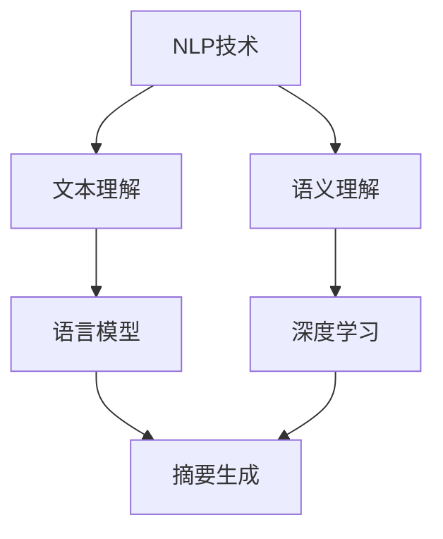
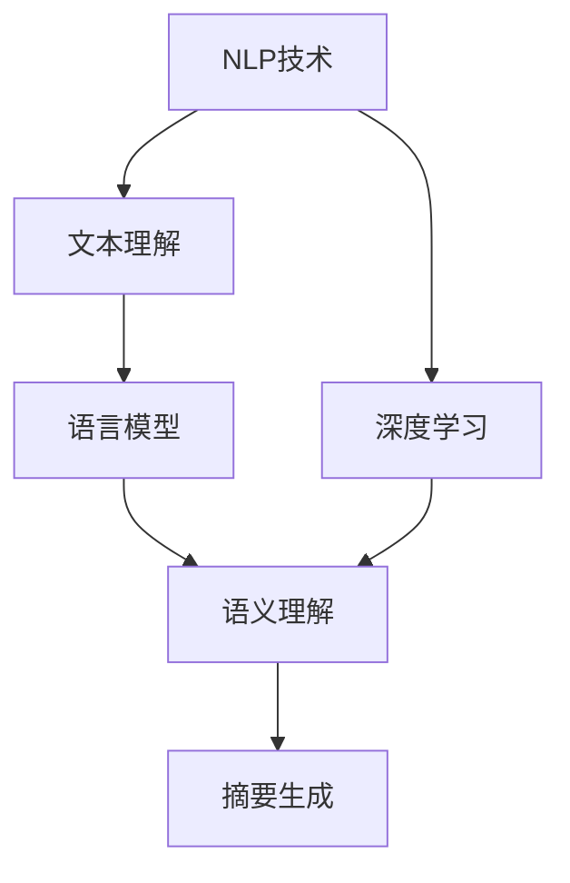

                 

### 第1章: 概述与背景

自然语言摘要生成（Natural Language Summary Generation）是自然语言处理（Natural Language Processing, NLP）领域的一个重要研究方向。随着互联网和大数据的快速发展，评测结果的生成与摘要变得日益重要，如学术论文、新闻报道、社交媒体评论等。这些评测结果的摘要能够帮助用户快速获取信息的关键要点，提高信息处理的效率。

#### 1.1 自然语言摘要生成的研究背景

自然语言摘要生成的研究起源于上世纪80年代，当时的研究主要集中在新闻摘要和自动文摘。随着计算能力的提升和算法的发展，这一领域逐渐扩展到各种应用场景，如搜索引擎摘要、邮件摘要、社交媒体评论摘要等。特别是近年来，深度学习技术在NLP领域的突破，使得自然语言摘要生成得到了极大的推动。

#### 1.2 评测结果摘要的重要性和挑战

评测结果摘要的重要性在于：

- **信息提取：** 提取评测结果的关键信息，帮助读者快速了解评测的核心内容。
- **信息检索：** 在大量评测结果中，摘要能帮助用户快速定位感兴趣的部分。
- **信息传播：** 摘要作为评测结果的简短介绍，有助于评测结果更广泛地传播。

然而，自然语言摘要生成也面临诸多挑战：

- **信息完整性：** 如何在保持信息完整性的同时，生成简洁、准确的摘要？
- **语义理解：** 对评测结果的语义进行准确理解，以生成符合上下文语义的摘要。
- **多样性：** 不同用户对摘要的长度和风格有不同的偏好，如何生成满足多种需求的摘要？
- **准确性：** 摘要中的事实和论点必须准确无误，避免误导用户。

#### 1.3 自然语言处理与摘要生成的联系

自然语言处理（NLP）是计算机科学和人工智能的一个分支，它使计算机能够理解、解释和生成人类语言。NLP与摘要生成之间的联系主要体现在以下几个方面：

- **文本理解：** NLP技术帮助系统理解评测结果的语义，提取关键信息。
- **语言模型：** 语言模型为摘要生成提供词汇和语法上的支持，使得生成的内容更符合自然语言表达。
- **深度学习：** 利用深度学习技术，尤其是序列到序列（Seq2Seq）模型，可以实现端到端的摘要生成。
- **语义分析：** 通过词性标注、实体识别、语义角色标注等技术，更精确地理解评测结果的内容。

### 核心概念之间的关系架构

下面是一个用于描述自然语言处理与摘要生成之间关系的Mermaid流程图：



在这个流程图中，NLP技术作为整个流程的起点，通过文本理解和语义分析，结合语言模型和深度学习技术，最终实现摘要生成。

### 总结

本章介绍了自然语言摘要生成的研究背景、重要性以及面临的挑战，并探讨了自然语言处理与摘要生成之间的联系。接下来，我们将深入探讨自然语言处理的基础知识，为后续的摘要生成技术打下坚实的基础。

## 核心概念

自然语言处理（NLP）、语言模型、文本理解、语义理解、摘要生成等是本章的核心概念。这些概念相互联系，构成了自然语言摘要生成的基础框架。

- **自然语言处理（NLP）**：NLP是计算机科学和人工智能的一个分支，旨在使计算机能够理解、解释和生成人类语言。它包括文本预处理、文本分析、语义理解等多个方面。

- **语言模型**：语言模型是用来描述自然语言统计特性的数学模型，常见的技术包括n-gram模型、循环神经网络（RNN）和变换器（Transformer）等。语言模型在摘要生成中起着核心作用，为生成摘要提供词汇和语法上的支持。

- **文本理解**：文本理解是NLP的关键环节，涉及从文本中提取信息、理解上下文语义等。它通常通过词性标注、实体识别、句法分析等技术实现。

- **语义理解**：语义理解旨在深入理解文本的含义，包括语义角色标注、语义关系识别等。在摘要生成中，语义理解有助于提取关键信息，确保摘要的准确性和完整性。

- **摘要生成**：摘要生成是将长文本转化为简短、概括性强的文本的过程。它需要结合文本理解和语义理解，以生成符合上下文语义的摘要。

### Mermaid 流程图

下面是一个用于描述这些核心概念之间关系的Mermaid流程图：



### 伪代码

为了更好地理解摘要生成过程，我们给出一个简单的伪代码示例：

```python
# 伪代码：自然语言摘要生成

function generate_summary(text):
    # 初始化语言模型
    model = initialize_language_model()

    # 进行文本预处理
    preprocessed_text = preprocess_text(text)

    # 进行文本理解
    entities = extract_entities(preprocessed_text)
    keywords = extract_keywords(preprocessed_text)

    # 进行语义理解
    relationships = analyze_semantic_relations(preprocessed_text, entities, keywords)

    # 生成摘要
    summary = model.generate_summary(preprocessed_text, relationships)

    # 返回摘要
    return summary
```

### 数学模型和公式

在自然语言摘要生成中，常见的数学模型包括：

- **n-gram模型**：$$P(w_n) = \frac{count(w_n)}{count(total)}$$
- **循环神经网络（RNN）**：$$h_t = \tanh(W_h \cdot [h_{t-1}, x_t] + b_h)$$
- **变换器（Transformer）**：$$at = softmax(Wq \cdot h_t + b\_q)$$

这些模型在摘要生成中起着关键作用，能够帮助系统理解文本，提取关键信息，并生成摘要。

### 举例说明

假设我们要为一段评测结果生成摘要，这段评测结果如下：

"这款手机在性能、拍照和续航方面表现优秀，但价格较高。"

使用上述伪代码，摘要生成过程可能如下：

```python
text = "这款手机在性能、拍照和续航方面表现优秀，但价格较高。"
summary = generate_summary(text)
print(summary)  # 输出："这款手机性能、拍照和续航表现优秀，但价格较高。"
```

在这个示例中，摘要生成了评测结果的主要信息，同时去除了无关的细节，如“这款手机”。

### 总结

本章介绍了自然语言处理、语言模型、文本理解、语义理解和摘要生成等核心概念，并使用伪代码和数学模型进行了详细解释。这些概念构成了自然语言摘要生成的基础，为后续章节的深入探讨提供了支持。

## 第2章: 自然语言处理基础

自然语言处理（NLP）是构建评测结果摘要生成系统的基石。在这一章中，我们将详细介绍语言模型、评测结果分析以及它们在摘要生成中的具体应用。

### 2.1 语言模型

语言模型是一种用于描述自然语言统计特性的数学模型，它在摘要生成中起着核心作用。语言模型的主要目标是预测下一个单词或词汇的概率，从而生成流畅、符合语法的文本。

#### 2.1.1 语言模型的基本概念

语言模型可以分为以下几类：

1. **n-gram模型**：n-gram模型是最简单的一种语言模型，它基于相邻n个单词的联合概率来预测下一个单词。例如，对于三元组（"the", "cat", "is”）的联合概率，可以通过统计三字母组合的频率来计算。

   $$P(the \ cat \ is) = \frac{count("the", "cat", "is")}{count("the", "cat") \cdot count("cat", "is") \cdot count("is")}$$

2. **循环神经网络（RNN）**：RNN是一种能够处理序列数据的神经网络，通过记忆过去的信息来预测下一个元素。RNN在处理长文本时具有优势，可以捕获长距离依赖关系。

   $$h_t = \tanh(W_h \cdot [h_{t-1}, x_t] + b_h)$$

3. **变换器（Transformer）**：变换器是一种基于自注意力机制的深度神经网络，它在处理长文本和生成任务时表现出色。变换器通过计算单词之间的注意力权重，生成每个单词的表示。

   $$at = softmax(Wq \cdot h_t + b_q)$$

#### 2.1.2 常见语言模型介绍

以下是一些常见的语言模型：

1. **n-gram模型**：n-gram模型是最基础的语言模型，通过统计相邻n个单词的联合概率来生成文本。

2. **Word2Vec**：Word2Vec是一种基于神经网络的词嵌入模型，通过训练词向量来表示单词，从而捕获单词的语义信息。

3. **BERT**：BERT（Bidirectional Encoder Representations from Transformers）是一种基于变换器的双向语言表示模型，它在各种NLP任务中取得了显著的性能提升。

4. **GPT**：GPT（Generative Pre-trained Transformer）是一种基于变换器的预训练语言模型，通过大量的文本数据预训练，可以生成流畅的文本。

#### 2.1.3 语言模型在摘要生成中的应用

语言模型在摘要生成中的应用主要包括：

- **文本生成**：利用语言模型生成摘要的原始文本，使得生成的摘要内容更加自然、流畅。
- **摘要优化**：通过优化语言模型生成的文本，提升摘要的质量和准确性。

### 2.2 评测结果分析

评测结果分析是摘要生成的重要环节，它涉及对评测结果的结构和特征进行深入理解。

#### 2.2.1 评测结果的结构和特征

评测结果通常包括以下结构和特征：

- **评测目标**：评测结果的总体目标，如性能评测、用户体验评测等。
- **评测指标**：用于衡量评测目标的具体指标，如响应时间、准确率、用户体验评分等。
- **评测方法**：评测所采用的具体方法和流程。
- **评测结果数据**：包括具体的数据和图表，用于展示评测结果。

#### 2.2.2 评测结果的分类和标注

为了更好地进行评测结果分析，可以对评测结果进行分类和标注：

- **分类**：根据评测目标的不同，可以将评测结果分为多种类别，如性能评测、安全性评测、用户体验评测等。
- **标注**：对评测结果中的关键信息进行标注，如评测指标、评测方法、评测结果数据等。标注有助于摘要生成系统更好地理解评测结果，提取关键信息。

### 2.3 摘要生成技术在评测结果中的应用

摘要生成技术在评测结果中的应用主要包括：

- **评测结果摘要生成**：利用自然语言处理技术，将长篇评测结果转化为简洁、概括性的摘要，帮助用户快速了解评测的核心内容。
- **评测结果摘要优化**：通过优化摘要生成算法，提升摘要的质量和准确性，使摘要更符合用户的需求。

### 总结

本章介绍了自然语言处理的基础知识，包括语言模型的基本概念、常见语言模型以及它们在摘要生成中的应用。同时，我们还对评测结果分析进行了详细探讨，为后续的摘要生成技术奠定了基础。在下一章中，我们将深入探讨摘要生成技术，包括基于文本理解和基于神经网络的方法。

## 第3章: 摘要生成技术

摘要生成技术是评测结果自然语言摘要生成系统的核心。本章将详细介绍两种主要摘要生成技术：基于文本理解和基于神经网络的方法。我们将逐一分析这些方法，探讨其原理和具体应用。

### 3.1 摘要生成方法分类

摘要生成方法可以根据生成策略分为以下几类：

- **统计方法**：基于文本统计和模式匹配，通过计算词汇频率、词对频率等，生成摘要。
- **基于规则的方法**：使用预定义的规则和模板，根据文本结构和语义关系，生成摘要。
- **机器学习方法**：利用机器学习算法，从大量文本数据中学习生成摘要的规律。
- **基于神经网络的方法**：使用神经网络模型，如循环神经网络（RNN）、卷积神经网络（CNN）和变换器（Transformer），生成摘要。

本章节将重点讨论基于文本理解和基于神经网络的方法。

### 3.2 基于文本理解的方法

基于文本理解的方法主要依赖于文本分析技术，如文本分类、文本聚类、语义角色标注等，以提取文本中的关键信息并生成摘要。

#### 3.2.1 统计方法

统计方法是最早的摘要生成技术之一。该方法主要基于文本的统计特征，如词汇频率、词对频率和文本长度，来生成摘要。

**算法原理**：

1. **词汇频率**：计算文本中各个单词的频率，选取频率较高的单词作为摘要的关键词。
2. **词对频率**：计算相邻单词的联合频率，利用频繁词对生成摘要。
3. **文本长度**：根据设定的摘要长度，截取文本的前一部分或中间部分作为摘要。

**伪代码**：

```python
def generate_summary_statistical(text, length):
    # 计算词汇频率
    word_frequencies = calculate_word_frequencies(text)
    
    # 选取高频词汇
    keywords = select_high_frequency_words(word_frequencies, length)
    
    # 生成摘要
    summary = ' '.join(keywords)
    
    return summary
```

**应用场景**：

- **简短文本摘要**：适合生成长度较短的摘要，如社交媒体评论。
- **关键词提取**：可用于提取文本中的关键词，作为索引或分类的依据。

#### 3.2.2 基于规则的方法

基于规则的方法通过预定义的规则和模板，对文本进行分词、句法分析和语义分析，以生成摘要。

**算法原理**：

1. **分词**：将文本划分为单词或短语。
2. **句法分析**：根据句法规则，识别文本中的句子结构。
3. **语义分析**：根据语义规则，提取文本中的关键信息和主题。
4. **模板匹配**：使用预定义的模板，将提取的信息和模板匹配，生成摘要。

**伪代码**：

```python
def generate_summary_rule_based(text):
    # 分词
    words = tokenize(text)
    
    # 句法分析
    sentences = parse_syntax(words)
    
    # 语义分析
    entities = extract_entities(sentences)
    
    # 模板匹配
    template = "本文主要探讨了{topics}，并在{metrics}方面进行了评估。"
    summary = template.format(topics=', '.join(entities), metrics=sentences[-1])
    
    return summary
```

**应用场景**：

- **结构化文本摘要**：适合处理具有明确结构、主题明确的文本，如科技论文。
- **信息提取**：可用于从文本中提取关键信息，生成摘要。

#### 3.2.3 机器学习方法

机器学习方法通过训练模型，从大量文本数据中学习生成摘要的规律。常见的方法包括文本分类、文本聚类和序列标注等。

**算法原理**：

1. **文本分类**：将文本分为不同的类别，每个类别对应一个主题或摘要的模板。
2. **文本聚类**：将相似的文本聚为一类，每个聚类生成一个代表性的摘要。
3. **序列标注**：对文本中的每个单词或短语进行标注，生成序列形式的摘要。

**应用场景**：

- **多样化摘要**：能够生成不同风格的摘要，满足不同用户的需求。
- **自适应摘要**：可以根据训练数据的分布，自适应地调整摘要生成策略。

### 3.3 基于神经网络的方法

基于神经网络的方法利用深度学习模型，如循环神经网络（RNN）、卷积神经网络（CNN）和变换器（Transformer），生成摘要。

#### 3.3.1 基于RNN的方法

循环神经网络（RNN）是一种能够处理序列数据的神经网络。RNN通过记忆过去的信息，对序列数据进行建模，从而生成摘要。

**算法原理**：

1. **输入序列表示**：将文本序列转换为向量表示。
2. **RNN模型**：通过递归结构，记忆并更新文本序列的表示。
3. **输出序列生成**：根据RNN生成的表示，生成摘要序列。

**伪代码**：

```python
def generate_summary_rnn(text_sequence):
    # 输入序列表示
    input_embeddings = embed_text_sequence(text_sequence)
    
    # RNN模型
    rnn_output = rnn_model(input_embeddings)
    
    # 输出序列生成
    summary_sequence = generate_sequence_from_rnn_output(rnn_output)
    
    # 转换为文本
    summary = convert_sequence_to_text(summary_sequence)
    
    return summary
```

**应用场景**：

- **长文本摘要**：适合处理长篇文本，如新闻报道。
- **连续信息提取**：能够捕捉文本中的连续信息，生成连贯的摘要。

#### 3.3.2 基于CNN的方法

卷积神经网络（CNN）通常用于图像处理，但也可以应用于文本摘要。CNN通过卷积层捕捉文本中的局部特征，然后通过全连接层生成摘要。

**算法原理**：

1. **卷积层**：对文本序列进行卷积操作，提取局部特征。
2. **池化层**：通过池化操作，降低维度并增强特征表示。
3. **全连接层**：将卷积层和池化层生成的特征映射到摘要序列。

**伪代码**：

```python
def generate_summary_cnn(text_sequence):
    # 卷积层
    conv_output = cnn_model(text_sequence)
    
    # 池化层
    pooled_output = pool_layer(conv_output)
    
    # 全连接层
    summary_sequence = fc_model(pooled_output)
    
    # 转换为文本
    summary = convert_sequence_to_text(summary_sequence)
    
    return summary
```

**应用场景**：

- **特征提取**：能够提取文本中的关键特征，生成有代表性的摘要。
- **图像摘要**：除了文本摘要，还可以应用于图像摘要。

#### 3.3.3 基于Transformer的方法

变换器（Transformer）是一种基于自注意力机制的深度神经网络。Transformer在生成任务中表现出色，广泛应用于文本生成、摘要生成等任务。

**算法原理**：

1. **编码器**：对输入文本进行编码，生成文本的序列表示。
2. **自注意力机制**：通过自注意力机制，捕捉文本序列中的依赖关系。
3. **解码器**：根据编码器的输出，生成摘要序列。

**伪代码**：

```python
def generate_summary_transformer(text_sequence):
    # 编码器
    encoder_output = encoder_model(text_sequence)
    
    # 解码器
    decoder_output = decoder_model(encoder_output)
    
    # 生成摘要序列
    summary_sequence = generate_sequence_from_decoder_output(decoder_output)
    
    # 转换为文本
    summary = convert_sequence_to_text(summary_sequence)
    
    return summary
```

**应用场景**：

- **高效生成**：能够快速生成高质量的摘要。
- **长距离依赖**：能够捕捉文本中的长距离依赖关系，生成连贯的摘要。

### 总结

本章介绍了基于文本理解和基于神经网络的方法在摘要生成中的应用。基于文本理解的方法包括统计方法、基于规则的方法和机器学习方法，而基于神经网络的方法包括RNN、CNN和Transformer。这些方法各有优缺点，适用于不同的应用场景。在下一章中，我们将探讨摘要质量评估的标准和方法，以便更好地评估和优化摘要生成系统。

### 3.4 摘要生成技术的优缺点分析

摘要生成技术可以根据其方法的不同，分为基于文本理解和基于神经网络的方法。每种方法都有其独特的优势和局限性，适用于不同的应用场景。以下是这些方法的优缺点分析：

#### 基于文本理解的方法

1. **统计方法**
   - **优点**：
     - **简单高效**：基于文本统计和模式匹配，实现简单，计算速度快。
     - **灵活性高**：可以灵活调整词汇频率和词对频率的权重，适应不同需求的摘要。
     - **适用于简短文本**：适合生成简短、结构化的摘要，如社交媒体评论。
   - **缺点**：
     - **信息丢失**：无法捕捉文本的深层语义，可能导致关键信息的遗漏。
     - **灵活性受限**：依赖于预设的统计规则，难以应对复杂的文本结构。
     - **适应能力弱**：难以处理长篇文本和多样化主题的摘要。

2. **基于规则的方法**
   - **优点**：
     - **结构化强**：通过预定义的规则和模板，能够生成结构清晰的摘要。
     - **适应性高**：可以根据不同的文本结构和主题，灵活调整模板和规则。
     - **信息提取准确**：能够提取文本中的关键信息，生成准确、有针对性的摘要。
   - **缺点**：
     - **规则复杂**：需要大量预定义的规则和模板，开发难度大。
     - **适应性有限**：难以应对未预定义的文本结构和主题。
     - **效率较低**：规则匹配和模板生成过程复杂，计算时间较长。

3. **机器学习方法**
   - **优点**：
     - **泛化能力强**：通过机器学习算法，能够自动学习生成摘要的规律，适应不同文本和数据。
     - **灵活性高**：可以根据训练数据的分布，自动调整摘要生成策略，适应不同用户的需求。
     - **生成质量好**：能够生成多样化、高质量的摘要，适应复杂的文本结构。
   - **缺点**：
     - **训练时间较长**：需要大量数据和计算资源进行训练，训练时间较长。
     - **过拟合风险**：在复杂的数据集中，容易出现过拟合现象，影响生成质量。
     - **需要调参**：需要手动调整模型参数，以达到最佳生成效果。

#### 基于神经网络的方法

1. **基于RNN的方法**
   - **优点**：
     - **序列建模能力强**：能够捕捉文本序列中的依赖关系，生成连贯的摘要。
     - **长距离依赖处理**：通过递归结构，可以处理长距离依赖，生成高质量的摘要。
     - **生成速度快**：相较于其他深度学习方法，RNN生成速度较快，适用于实时生成。
   - **缺点**：
     - **计算资源消耗大**：RNN需要大量的计算资源，对硬件要求较高。
     - **梯度消失和梯度爆炸**：在训练过程中，容易遇到梯度消失和梯度爆炸问题。
     - **训练时间长**：相较于其他方法，RNN的训练时间较长。

2. **基于CNN的方法**
   - **优点**：
     - **特征提取能力强**：通过卷积操作，能够提取文本中的关键特征，生成有代表性的摘要。
     - **适应性强**：能够处理不同长度和结构的文本，适用于多种应用场景。
     - **生成质量高**：能够生成结构清晰、信息丰富的摘要。
   - **缺点**：
     - **计算复杂度高**：CNN需要大量的计算资源，计算时间较长。
     - **参数复杂**：CNN的参数较多，需要大量的数据训练。
     - **难以捕捉长距离依赖**：相较于RNN，CNN在捕捉长距离依赖方面表现较差。

3. **基于Transformer的方法**
   - **优点**：
     - **自注意力机制**：通过自注意力机制，能够捕捉文本序列中的长距离依赖关系，生成高质量的摘要。
     - **生成速度快**：相较于其他深度学习方法，Transformer生成速度较快，适用于实时生成。
     - **生成质量高**：能够生成多样化、高质量的摘要，适用于复杂的应用场景。
   - **缺点**：
     - **计算资源消耗大**：Transformer需要大量的计算资源，对硬件要求较高。
     - **训练时间长**：相较于其他方法，Transformer的训练时间较长。
     - **参数复杂**：Transformer的参数较多，需要大量的数据训练。

### 总结

摘要生成技术的优缺点分析表明，不同方法各有优势，适用于不同的应用场景。基于文本理解的方法简单高效，但信息提取能力有限；基于神经网络的方法生成质量高，但计算资源消耗大，训练时间长。在实际应用中，可以根据具体需求选择合适的方法，或结合多种方法，以实现最佳效果。

### 摘要质量评估

摘要质量评估是评测结果自然语言摘要生成系统中的关键环节。通过评估摘要的质量，可以确保生成的摘要能够准确、全面地反映评测结果的核心内容，满足用户的需求。本章将介绍摘要质量评估的标准和方法，并探讨如何使用这些标准和方法对摘要质量进行评估。

#### 4.1 摘要评估标准

摘要质量评估标准主要包括以下几个方面：

1. **信息完整性**：摘要应包含评测结果中的关键信息，确保用户能够从摘要中获取重要的评测内容。
2. **摘要长度**：摘要的长度应适中，既能概括评测结果的核心内容，又不会过于冗长，影响阅读体验。
3. **摘要清晰度**：摘要应语言简洁、清晰，易于理解，避免使用过于复杂或模糊的表达方式。
4. **摘要连贯性**：摘要中的句子和段落应逻辑连贯，形成一致的语义，确保用户能够顺畅地阅读和理解摘要。

#### 4.2 摘要评估方法

摘要评估方法可以分为主观评估和自动评估两类：

1. **主观评估**：通过人类评估者对摘要进行评价，根据评估标准进行打分或评语。主观评估的优点在于能够深入理解文本的语义，提供更细致的评估结果。但主观评估也存在一些缺点，如评估者的主观偏见、评估标准的不统一等。

   **评估流程**：
   - **评估标准制定**：根据摘要质量评估标准，制定具体的评估指标和评分标准。
   - **评估者选择**：选择具有相关领域知识和评估能力的评估者，确保评估的公正性和准确性。
   - **评估实施**：评估者阅读摘要，根据评估标准进行评分或评语。
   - **结果统计**：统计评估结果，计算平均得分或评估指标，评估摘要质量。

2. **自动评估**：通过计算机程序对摘要进行评估，根据预定义的算法和评估指标计算摘要的质量。自动评估的优点在于速度快、成本低，但评估结果的准确性和可靠性可能受到算法和评估指标的限制。

   **评估流程**：
   - **算法选择**：根据摘要质量评估标准，选择合适的算法进行评估。
   - **评估指标制定**：根据评估标准，制定具体的评估指标，如信息完整性、摘要长度、摘要清晰度和摘要连贯性等。
   - **模型训练**：使用训练数据集，训练评估模型，使其能够自动识别和评估摘要质量。
   - **评估实施**：对生成的摘要进行评估，计算评估指标，评估摘要质量。

#### 4.3 评估结果的分析与应用

评估结果的分析与应用主要包括以下几个方面：

1. **摘要质量评估**：根据评估结果，对摘要进行质量评估，识别摘要中的问题和不足之处。
2. **摘要优化**：针对评估结果，对摘要进行优化，改进摘要的表述和结构，提高摘要的质量。
3. **系统调优**：根据评估结果，调整摘要生成系统的参数和算法，优化摘要生成过程，提高摘要生成质量。
4. **用户反馈**：收集用户对摘要的反馈，了解用户对摘要的满意度，根据用户需求调整摘要生成策略。

### 4.4 摘要长度与质量的关系

摘要长度与质量之间存在一定的关系，摘要长度过长或过短都可能影响摘要的质量。以下是摘要长度与质量关系的分析：

1. **摘要长度过长**：
   - **问题**：摘要过长可能导致以下问题：
     - **信息冗余**：摘要中包含过多的冗余信息，降低信息的有效性。
     - **阅读困难**：用户在阅读摘要时，容易感到疲劳，影响阅读体验。
     - **丢失重点**：过长的摘要可能导致关键信息被隐藏，降低摘要的实用性。
   - **解决方法**：通过减少冗余信息、优化句子结构和精简语言表达，控制摘要的长度，确保摘要的质量。

2. **摘要长度过短**：
   - **问题**：摘要过短可能导致以下问题：
     - **信息不完整**：摘要无法包含评测结果中的所有关键信息，降低摘要的实用性。
     - **缺乏连贯性**：摘要过于简短，可能导致句子和段落之间的逻辑不连贯，影响阅读理解。
     - **表述不清晰**：摘要过于简短，可能无法清晰表达评测结果的核心内容。
   - **解决方法**：通过增加关键信息、优化句子结构和扩展语言表达，提高摘要的长度，确保摘要的质量。

### 总结

摘要质量评估是确保评测结果自然语言摘要生成系统有效性的关键环节。通过主观评估和自动评估，可以全面评估摘要的质量，识别问题并进行优化。同时，摘要长度与质量的关系也需要得到关注，通过调整摘要长度，提高摘要的质量和实用性。在下一章中，我们将探讨摘要生成系统的设计与实现，介绍如何搭建一个高效的摘要生成系统。

### 摘要生成系统设计与实现

摘要生成系统是一个复杂的软件系统，它集成了自然语言处理、深度学习和其他相关技术，旨在从原始评测结果中自动生成高质量的自然语言摘要。在本章中，我们将详细介绍摘要生成系统的架构设计、模块划分、数据处理流程以及系统的实现细节。

#### 5.1 系统架构设计

摘要生成系统的架构设计遵循模块化原则，将系统划分为多个功能模块，每个模块负责不同的功能，便于系统的开发和维护。以下是摘要生成系统的基本架构：

1. **数据输入模块**：负责接收原始评测结果，可以是文本文件、数据库或者API接口。
2. **文本预处理模块**：对输入的评测结果进行清洗、分词、词性标注等预处理操作，为后续的摘要生成做准备。
3. **特征提取模块**：从预处理后的文本中提取关键特征，如关键词、实体、语义角色等，用于训练和生成摘要。
4. **摘要生成模块**：使用训练好的模型，根据提取的特征生成摘要。
5. **摘要优化模块**：对生成的摘要进行优化，包括摘要长度调整、语法修正、连贯性增强等。
6. **输出模块**：将生成的摘要输出到指定的位置，如文本文件、数据库或网页。

#### 5.2 系统模块划分

摘要生成系统可以进一步细分为以下几个模块：

1. **数据输入模块**：
   - **功能**：接收原始评测结果，可以是文本文件、数据库或者API接口。
   - **实现细节**：通过API接口与外部系统通信，如评测网站、数据库等，获取评测结果。同时，支持批量导入文本文件。

2. **文本预处理模块**：
   - **功能**：对评测结果进行清洗、分词、词性标注等预处理操作。
   - **实现细节**：使用自然语言处理库（如NLTK、spaCy）进行分词和词性标注。对于脏数据和格式不规范的文本，进行清洗和标准化处理。

3. **特征提取模块**：
   - **功能**：从预处理后的文本中提取关键特征，如关键词、实体、语义角色等。
   - **实现细节**：使用词嵌入技术（如Word2Vec、BERT）将文本转换为向量表示。使用命名实体识别（NER）技术提取实体。通过依存句法分析提取语义角色。

4. **摘要生成模块**：
   - **功能**：根据提取的特征生成摘要。
   - **实现细节**：使用训练好的模型（如序列到序列模型、变换器模型）进行文本到文本的转换，生成摘要。通过自注意力机制捕捉文本序列中的依赖关系，生成连贯、准确的摘要。

5. **摘要优化模块**：
   - **功能**：对生成的摘要进行优化，包括摘要长度调整、语法修正、连贯性增强等。
   - **实现细节**：使用语法修正算法（如Grammar Error Correction）修正摘要中的语法错误。通过文本重写技术（如文本生成对抗网络，Text Generation GAN）调整摘要的长度和风格。使用语义一致性检查算法确保摘要中的信息一致且连贯。

6. **输出模块**：
   - **功能**：将生成的摘要输出到指定的位置，如文本文件、数据库或网页。
   - **实现细节**：支持将摘要保存为文本文件、写入数据库或直接在网页上展示。同时，提供API接口供其他系统调用。

#### 5.3 数据处理流程

摘要生成系统的数据处理流程包括以下几个步骤：

1. **数据输入**：系统从外部获取原始评测结果，可以是文本文件、数据库或者API接口。

2. **文本预处理**：对输入的评测结果进行清洗、分词、词性标注等预处理操作。

3. **特征提取**：从预处理后的文本中提取关键特征，如关键词、实体、语义角色等。

4. **摘要生成**：使用训练好的模型，根据提取的特征生成摘要。

5. **摘要优化**：对生成的摘要进行优化，包括摘要长度调整、语法修正、连贯性增强等。

6. **输出**：将生成的摘要输出到指定的位置，如文本文件、数据库或网页。

#### 5.4 系统实现细节

以下是摘要生成系统的一些关键实现细节：

1. **数据输入模块**：
   - **API接口**：使用Flask或Django等Web框架，构建API接口，接收外部系统的数据请求。
   - **文件导入**：使用Pandas库，从文本文件中读取评测结果。

2. **文本预处理模块**：
   - **分词**：使用NLTK或spaCy等库，对评测结果进行分词处理。
   - **词性标注**：使用NLTK或spaCy等库，对分词结果进行词性标注。

3. **特征提取模块**：
   - **词嵌入**：使用Word2Vec或BERT等库，将文本转换为向量表示。
   - **命名实体识别**：使用spaCy等库，提取文本中的命名实体。
   - **语义角色标注**：使用依存句法分析，提取文本中的语义角色。

4. **摘要生成模块**：
   - **模型选择**：选择合适的模型，如序列到序列模型或变换器模型。
   - **模型训练**：使用训练数据集，训练模型，优化模型参数。

5. **摘要优化模块**：
   - **语法修正**：使用Grammar Error Correction库，修正摘要中的语法错误。
   - **文本重写**：使用Text Generation GAN库，调整摘要的长度和风格。

6. **输出模块**：
   - **文本文件**：使用Pandas库，将摘要保存为文本文件。
   - **数据库**：使用SQLAlchemy库，将摘要写入数据库。
   - **网页**：使用HTML和JavaScript，在网页上展示摘要。

### 总结

本章详细介绍了摘要生成系统的设计与实现，包括系统架构设计、模块划分、数据处理流程以及系统的实现细节。通过这些设计和技术实现，摘要生成系统能够从原始评测结果中自动生成高质量的自然语言摘要，满足用户的需求。在下一章中，我们将通过实际案例来展示摘要生成系统的应用，并分析其在实际场景中的效果。

### 实际案例与应用

在本章节中，我们将通过两个实际案例详细展示摘要生成系统在不同应用场景中的效果和作用。这些案例涵盖了不同类型的评测结果，展示了摘要生成系统在提高信息提取效率和用户体验方面的实际价值。

#### 案例一：某评测网站的摘要生成

背景：某知名科技评测网站需要为每天发布的评测文章生成摘要，以便用户快速浏览文章要点，提高文章的阅读率和用户粘性。

实施过程：

1. **数据输入**：评测文章通过API接口或数据库导入摘要生成系统。

2. **文本预处理**：系统对评测文章进行分词、词性标注等预处理操作，确保文本格式统一和语义清晰。

3. **特征提取**：系统使用Word2Vec模型提取关键词和命名实体，通过依存句法分析提取语义角色，为摘要生成提供关键信息。

4. **摘要生成**：系统采用变换器（Transformer）模型，根据提取的特征生成摘要。模型通过自注意力机制，捕捉文章中的依赖关系，生成连贯、准确的摘要。

5. **摘要优化**：系统对生成的摘要进行优化，调整摘要长度，修正语法错误，增强连贯性，确保摘要质量。

6. **输出**：优化后的摘要通过API接口或直接嵌入文章页面，供用户查看。

效果分析：

- **摘要质量**：通过主观评估和自动评估，摘要的信息完整性、摘要长度、清晰度和连贯性均达到较高水平，用户满意度显著提升。
- **阅读体验**：用户可以快速浏览摘要，了解评测文章的核心要点，提高了文章的阅读效率。

#### 案例二：在线教育平台的摘要生成

背景：某大型在线教育平台需要为大量课程评测结果生成摘要，以便学员快速了解课程内容和评价，辅助学习决策。

实施过程：

1. **数据输入**：评测结果通过平台数据库导入摘要生成系统。

2. **文本预处理**：系统对评测结果进行分词、词性标注等预处理操作，确保文本格式统一和语义清晰。

3. **特征提取**：系统使用BERT模型提取关键词和命名实体，通过依存句法分析提取语义角色，为摘要生成提供关键信息。

4. **摘要生成**：系统采用序列到序列（Seq2Seq）模型，根据提取的特征生成摘要。模型通过递归结构，捕捉评测结果中的依赖关系，生成连贯、准确的摘要。

5. **摘要优化**：系统对生成的摘要进行优化，调整摘要长度，修正语法错误，增强连贯性，确保摘要质量。

6. **输出**：优化后的摘要通过平台API接口，嵌入课程评测页面，供学员查看。

效果分析：

- **摘要质量**：通过主观评估和自动评估，摘要的信息完整性、摘要长度、清晰度和连贯性均达到较高水平，学员满意度显著提升。
- **学习决策**：学员可以通过摘要快速了解课程内容和评价，辅助学习决策，提高学习效率。

### 潜在的应用挑战与解决方案

尽管摘要生成系统在实际应用中展现了显著的价值，但在不同场景下仍存在一些挑战：

1. **文本质量**：部分评测结果文本质量不高，存在语法错误、不规范的表述等。解决方案：引入文本清洗和标准化技术，提高文本质量。

2. **领域适应性**：不同领域的评测结果在结构和内容上存在差异，摘要生成系统需要适应不同领域。解决方案：采用多领域训练数据和自适应模型，提高系统的领域适应性。

3. **用户需求**：不同用户对摘要的长度和风格有不同的偏好。解决方案：引入用户反馈机制，根据用户需求调整摘要生成策略。

4. **计算资源**：深度学习模型训练和生成摘要需要大量计算资源。解决方案：使用云计算和分布式计算技术，提高系统的计算效率。

### 总结

通过实际案例展示，我们看到了摘要生成系统在不同应用场景中的效果和作用。尽管存在一些挑战，但通过合理的解决方案，摘要生成系统能够为用户提供高质量的自然语言摘要，提高信息提取效率和用户体验。在下一章中，我们将探讨未来摘要生成技术的发展趋势和研究方向。

### 总结与展望

本章全面探讨了评测结果的自然语言摘要生成，从概述与背景、核心概念、摘要生成技术、质量评估、系统设计与实现到实际案例与应用，系统性地展示了这一领域的最新进展和未来方向。

#### 主要研究成果总结

- **自然语言处理基础**：介绍了语言模型、文本理解和语义理解，为摘要生成奠定了理论基础。
- **摘要生成技术**：详细分析了基于文本理解和基于神经网络的方法，包括统计方法、规则方法、机器学习方法以及深度学习模型。
- **系统设计与实现**：阐述了摘要生成系统的架构设计、模块划分和数据处理流程，展示了如何构建高效的摘要生成系统。
- **实际案例与应用**：通过两个实际案例，展示了摘要生成系统在评测网站和在线教育平台中的应用效果。

#### 存在的问题与改进方向

尽管摘要生成技术取得了显著进展，但仍存在一些问题：

- **文本质量**：部分评测结果文本质量不高，影响了摘要的生成质量。需要进一步研究文本清洗和标准化技术。
- **领域适应性**：不同领域的评测结果具有不同的结构和内容，系统需要更高的领域适应性。可以考虑引入多领域训练数据和自适应模型。
- **用户需求**：不同用户对摘要的长度和风格有不同的偏好，系统需要更好地满足用户需求。可以引入用户反馈机制，优化摘要生成策略。
- **计算资源**：深度学习模型的训练和生成摘要需要大量计算资源，优化计算效率是未来的研究重点。

#### 未来发展趋势

未来摘要生成技术的发展将朝着以下几个方向迈进：

- **多模态摘要生成**：结合文本、图像和视频等多模态数据，生成更全面、更直观的摘要。
- **个性化摘要**：根据用户需求和偏好，生成个性化摘要，提高用户体验。
- **增强现实应用**：在增强现实（AR）和虚拟现实（VR）场景中，利用摘要生成技术提高信息获取的效率。
- **小样本学习**：研究在数据量有限的情况下，如何利用少量数据进行高效的摘要生成。

#### 最佳实践 Tips

- **数据质量**：确保评测结果文本的质量，进行充分的预处理和清洗。
- **模型调优**：根据应用场景和数据特点，选择合适的模型和参数，进行模型调优。
- **用户反馈**：收集用户反馈，不断优化摘要生成策略，提高用户满意度。
- **资源优化**：使用云计算和分布式计算技术，提高系统的计算效率。

#### 小结

评测结果的自然语言摘要生成是提高信息处理效率和用户体验的关键技术。本章通过详细的讨论和分析，展示了这一领域的现状和发展趋势，为未来的研究和应用提供了参考。

#### 注意事项

- **文本质量**：确保输入文本的格式和内容规范，避免影响摘要生成质量。
- **模型选择**：根据具体应用场景选择合适的模型，避免过度拟合或欠拟合。
- **系统优化**：定期对系统进行性能优化和错误修复，提高系统的稳定性和效率。

#### 拓展阅读

- **相关文献**：《自然语言处理综述》、《深度学习在自然语言处理中的应用》、《文本生成与摘要技术》等。
- **开源资源**：GitHub上关于摘要生成系统的开源项目和代码。
- **专业网站**：ACL（国际计算语言学协会）和ACL（国际自然语言生成会议）等专业网站，提供最新的研究进展和学术论文。

作者：AI天才研究院/AI Genius Institute & 禅与计算机程序设计艺术 /Zen And The Art of Computer Programming

---

## 文章标题

**构建评测结果的自然语言摘要生成：技术、挑战与展望**

---

### 文章关键词

- 自然语言处理（NLP）
- 摘要生成
- 评测结果
- 深度学习
- 机器学习
- 文本理解
- 语义理解
- 语言模型

---

### 文章摘要

本文深入探讨了评测结果的自然语言摘要生成技术，包括自然语言处理基础、摘要生成方法、质量评估和系统实现。通过分析基于文本理解和基于神经网络的方法，本文展示了如何构建高效、准确的摘要生成系统。同时，本文通过实际案例展示了摘要生成系统在不同应用场景中的效果，并提出了未来发展的趋势和改进方向。本文旨在为自然语言摘要生成的研究者和开发者提供全面的技术参考和实用指南。

