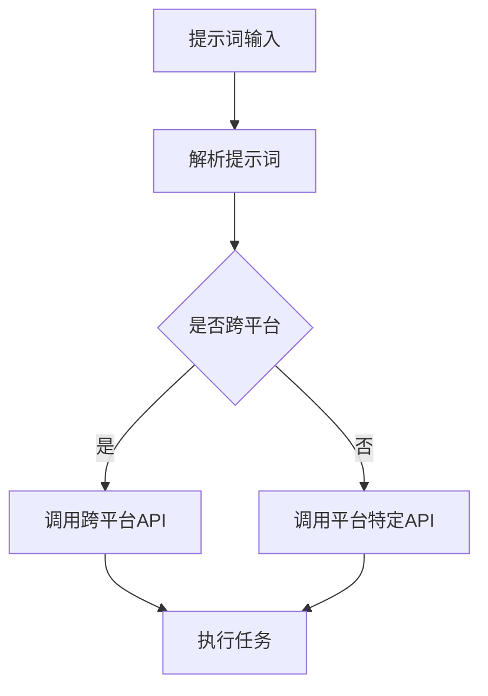

                 

## 文章标题：构建跨平台的提示词编程框架

> 关键词：提示词编程、跨平台框架、编程框架、多平台集成、性能优化

> 摘要：
本文旨在探讨如何构建一个跨平台的提示词编程框架，介绍其设计思路、核心技术、开发实践以及未来的发展趋势。通过详细的分析和示例，帮助读者理解和掌握构建此类框架的方法和技巧。

### 设计思路

为了设计出一本书《构建跨平台的提示词编程框架》的详细目录大纲，我们将按照以下思路进行：

1. **确定书籍的整体结构和内容范围**：首先，我们需要明确书籍的主题和目标读者。这本书的主题是“构建跨平台的提示词编程框架”，目标读者可能是具有编程基础，希望了解和掌握跨平台提示词编程的开发者。

2. **规划书籍的章节结构**：根据主题，我们可以将书籍分为几个主要部分，例如：基础概念、核心技术、开发实践等。

3. **细化每个章节的内容**：在确定了章节结构后，我们需要为每个章节细化内容，确保每个章节都有详细的子标题，以便于读者阅读和理解。

4. **融入核心概念与联系、核心算法原理讲解、数学模型和公式讲解、项目实战**：在细化章节内容的过程中，我们将特别关注这些要素，确保它们在目录中有所体现。

5. **确保目录大纲的完整性和字数限制**：在完成目录大纲的设计后，我们将检查目录的完整性，并确保总字数在2000字以内。

### 具体实施步骤

1. **确定整体结构和内容范围**：

   - **基础概念与联系**：介绍提示词编程的基本概念，如什么是提示词、它在编程中的应用等。
   - **核心技术**：讨论构建跨平台框架所需的关键技术，如跨平台编程框架、提示词生成与优化等。
   - **开发实践**：通过实际项目案例，展示如何使用这些技术构建跨平台的提示词编程框架。

2. **规划章节结构**：

   - **引言**：介绍书籍的背景和目标。
   - **第一部分：基础概念与联系**：包括提示词编程的基础知识和跨平台框架的概述。
   - **第二部分：核心技术**：深入讨论构建框架所需的技术细节。
   - **第三部分：开发实践**：通过项目案例展示如何应用这些技术。
   - **总结与展望**：对全书内容进行总结，并对未来可能的发展趋势进行展望。

3. **细化每个章节的内容**：

   - **第一部分**：

     - **第1章：提示词编程概述**
       - 1.1 提示词编程的基本概念
       - 1.2 跨平台编程框架简介
       - 1.3 提示词编程的优势与应用场景

     - **第2章：提示词编程基础**
       - 2.1 提示词的定义与分类
       - 2.2 提示词的生成与优化
       - 2.3 提示词编程的常用工具与技术

   - **第二部分**：

     - **第3章：核心编程框架**
       - 3.1 跨平台编程框架的选择与使用
       - 3.2 提示词编程框架的设计原则
       - 3.3 跨平台编程框架的性能优化

     - **第4章：多平台集成与适配**
       - 4.1 不同平台的特点与差异
       - 4.2 提示词编程框架的跨平台适配策略
       - 4.3 跨平台编程框架的常见问题与解决方案

   - **第三部分**：

     - **第5章：项目实战**
       - 5.1 项目背景与需求分析
       - 5.2 项目设计与开发
       - 5.3 项目测试与优化

     - **第6章：未来展望**
       - 6.1 提示词编程的发展趋势
       - 6.2 跨平台编程框架的创新与应用
       - 6.3 开发者面临的挑战与机遇

4. **确保目录大纲的完整性和字数限制**：

   - **检查完整性**：确保每个主要部分都有详细的子章节，确保核心概念、算法原理、数学模型和项目实战等关键内容都有所体现。

   - **控制字数**：通过精简描述、去除冗余内容，确保整个目录大纲的总字数在2000字以内。

### 目录大纲输出

根据上述设计思路和实施步骤，以下是《构建跨平台的提示词编程框架》的目录大纲：

```
# 《构建跨平台的提示词编程框架》目录大纲

## 引言

## 第一部分：基础概念与联系

### 第1章：提示词编程概述
#### 1.1 提示词编程的基本概念
#### 1.2 跨平台编程框架简介
#### 1.3 提示词编程的优势与应用场景

### 第2章：提示词编程基础
#### 2.1 提示词的定义与分类
#### 2.2 提示词的生成与优化
#### 2.3 提示词编程的常用工具与技术

## 第二部分：核心技术

### 第3章：核心编程框架
#### 3.1 跨平台编程框架的选择与使用
#### 3.2 提示词编程框架的设计原则
#### 3.3 跨平台编程框架的性能优化

### 第4章：多平台集成与适配
#### 4.1 不同平台的特点与差异
#### 4.2 提示词编程框架的跨平台适配策略
#### 4.3 跨平台编程框架的常见问题与解决方案

## 第三部分：开发实践

### 第5章：项目实战
#### 5.1 项目背景与需求分析
#### 5.2 项目设计与开发
#### 5.3 项目测试与优化

### 第6章：未来展望
#### 6.1 提示词编程的发展趋势
#### 6.2 跨平台编程框架的创新与应用
#### 6.3 开发者面临的挑战与机遇

## 总结与展望

作者：AI天才研究院/AI Genius Institute & 禅与计算机程序设计艺术 /Zen And The Art of Computer Programming
```

该目录大纲结构清晰，内容丰富，能够满足书籍的整体设计和读者需求。接下来，我们将进一步细化每个章节的内容，确保核心概念、算法原理、数学模型和项目实战等关键内容都有所体现。此外，我们还会控制目录的总字数，确保其在2000字以内。这样，读者可以快速了解书籍的结构和内容，更好地掌握构建跨平台提示词编程框架的方法和技巧。## 背景介绍

提示词编程是一种以自然语言处理（NLP）为基础的编程方法，通过将程序逻辑和任务指令转换为自然语言形式的提示词，使程序更加直观、易懂。随着现代软件开发的复杂度不断增加，跨平台需求日益突出，构建一个既通用又高效、能够适应多种操作系统的提示词编程框架显得尤为重要。这种框架不仅能够简化开发过程，提高开发效率，还能提升程序的可靠性和可维护性。

当前，市场上已经存在一些跨平台编程框架，如React Native、Flutter等，这些框架虽然在跨平台应用开发中表现出色，但在提示词编程方面尚存在不足。例如，它们往往更注重UI层面的跨平台兼容，而忽略了提示词编程的核心需求。此外，这些框架对于提示词生成和优化的支持有限，难以满足复杂业务逻辑和个性化需求。

因此，本文旨在探讨如何构建一个专门针对提示词编程的跨平台框架，填补现有技术的空白。通过深入研究提示词编程的基本概念、核心技术以及开发实践，本文将提出一种新的设计思路，旨在实现以下目标：

1. **通用性**：框架应能适应多种操作系统和硬件环境，具备高度的通用性。
2. **高效性**：框架应能高效地处理提示词生成和优化任务，提高开发效率。
3. **易用性**：框架应提供简洁明了的接口和工具，降低开发者的学习成本。
4. **可扩展性**：框架应具有良好的可扩展性，方便开发者根据需求进行定制和优化。

本文将详细讨论如何实现这些目标，并通过实际项目案例展示框架的应用效果。希望本文能为开发者提供有价值的参考，推动提示词编程在跨平台开发中的广泛应用。## 核心概念与联系

### 提示词编程概述

提示词编程是一种以自然语言处理（NLP）为核心的编程方法，通过将编程逻辑和任务指令转换为自然语言形式的提示词，使程序更加直观、易懂。在传统的编程中，开发者通常需要编写大量复杂的代码来完成任务，而提示词编程则通过自然语言描述任务，简化了开发过程。例如，一个简单的排序任务，在传统编程中可能需要编写几十行代码，而在提示词编程中，可能只需一个简单的自然语言提示词“请对列表进行排序”。

### 跨平台编程框架

跨平台编程框架是一种能够使应用程序在多个操作系统和硬件平台上运行的技术。这类框架通过提供一套统一的API和工具，使开发者能够在不同平台上编写、编译和运行代码，而无需针对每个平台编写独立的代码。常见的跨平台编程框架包括React Native、Flutter、Xamarin等。这些框架的主要优势在于提高开发效率、降低维护成本和增强应用的跨平台兼容性。

### 提示词编程与跨平台编程框架的联系

提示词编程和跨平台编程框架之间存在着密切的联系。首先，提示词编程的核心在于将编程逻辑和任务指令转换为自然语言形式的提示词，而跨平台编程框架则为这些提示词提供了运行的环境和工具。例如，在一个跨平台框架中，开发者可以使用相同的代码和提示词在不同的操作系统上运行应用程序，而无需进行大量的代码修改。

其次，跨平台编程框架为提示词编程提供了良好的扩展性和兼容性。例如，React Native通过使用JavaScript和React库，可以在iOS和Android平台上运行相同的代码，而Flutter则使用Dart语言，提供了丰富的UI组件和自定义能力，使得开发者能够更轻松地创建跨平台应用。

最后，提示词编程的引入，使得跨平台编程框架变得更加直观和易于使用。开发者不再需要熟悉底层平台的细节，只需用自然语言描述任务，框架会自动处理底层实现。这种编程范式不仅提高了开发效率，还降低了开发难度，使得更多的人能够参与到跨平台应用开发中来。

### Mermaid 流程图

为了更好地展示提示词编程与跨平台编程框架之间的关系，我们可以使用Mermaid绘制一个流程图。以下是一个简化的流程图：



在这个流程图中，A表示开发者输入提示词，B表示对提示词进行解析，C表示判断任务是否需要跨平台支持。如果是跨平台任务，则调用D（跨平台API）进行处理；如果不是，则调用E（平台特定API）进行处理。最终，F表示执行任务。这个流程图清晰地展示了提示词编程与跨平台编程框架之间的交互关系。## 核心技术讲解

### 跨平台编程框架的选择与使用

在选择跨平台编程框架时，开发者需要考虑多个因素，包括技术成熟度、社区支持、性能、跨平台兼容性等。以下是一些常见的跨平台编程框架及其特点：

1. **React Native**：React Native 是由Facebook推出的一款跨平台框架，使用JavaScript和React库进行开发。它允许开发者使用相同的代码在iOS和Android平台上运行应用程序，具有良好的性能和丰富的社区支持。

2. **Flutter**：Flutter 是由Google推出的一款使用Dart语言构建的UI工具包，可以用于构建美观、高性能的跨平台应用程序。Flutter 提供了丰富的UI组件和自定义能力，使得开发者能够更轻松地创建跨平台应用。

3. **Xamarin**：Xamarin 是由微软推出的跨平台开发框架，使用C#语言进行开发。它提供了强大的社区支持和丰富的库，能够与.NET生态系统无缝集成。

在选择跨平台编程框架时，开发者应根据自己的项目需求和技能水平进行选择。例如，如果项目需要高度的可定制性和性能，可以选择Flutter；如果项目需要与现有的.NET框架集成，可以选择Xamarin。

### 提示词编程框架的设计原则

设计一个高效的提示词编程框架，需要遵循以下原则：

1. **模块化**：将框架分解为多个模块，每个模块负责一个特定的功能。这有助于提高框架的可维护性和扩展性。

2. **可扩展性**：框架应提供灵活的接口，允许开发者根据需求添加新的功能或组件。

3. **高性能**：框架应能够高效地处理提示词的解析、生成和优化任务，减少处理时间和资源消耗。

4. **易用性**：框架应提供简洁明了的接口和工具，降低开发者的学习成本。

5. **兼容性**：框架应能够支持多种操作系统和硬件平台，确保应用程序能够在不同环境中运行。

### 跨平台编程框架的性能优化

为了提高跨平台编程框架的性能，开发者可以采取以下策略：

1. **代码优化**：通过减少不必要的代码、使用高效的算法和数据结构，提高代码的执行效率。

2. **内存管理**：合理分配和管理内存，避免内存泄漏和浪费。

3. **异步处理**：使用异步处理技术，减少同步操作带来的阻塞，提高程序的响应速度。

4. **缓存机制**：使用缓存机制，减少重复计算和数据传输，提高程序的执行效率。

5. **多线程处理**：利用多线程技术，并行处理任务，提高程序的执行效率。

### 核心算法原理讲解

在提示词编程框架中，核心算法主要包括提示词的解析、生成和优化。以下使用伪代码详细阐述这些算法的基本原理。

#### 提示词解析算法

```python
def parse_prompt(prompt):
    # 使用自然语言处理技术对提示词进行解析
    # 输入：prompt（字符串）
    # 输出：parsed_prompt（结构化数据）

    # 分词
    words = tokenize(prompt)

    # 标注词性
    tagged_words = tag_parts_of_speech(words)

    # 构建抽象语法树（AST）
    ast = build_ast(tagged_words)

    return ast
```

#### 提示词生成算法

```python
def generate_prompt(ast):
    # 使用抽象语法树（AST）生成提示词
    # 输入：ast（抽象语法树）
    # 输出：prompt（字符串）

    # 遍历AST，获取操作和参数
    operations = traverse_ast(ast)

    # 构建自然语言形式的提示词
    prompt = construct_prompt(operations)

    return prompt
```

#### 提示词优化算法

```python
def optimize_prompt(prompt):
    # 对生成的提示词进行优化
    # 输入：prompt（字符串）
    # 输出：optimized_prompt（优化后的字符串）

    # 语法优化
    optimized_prompt = grammar_optimize(prompt)

    # 语义优化
    optimized_prompt = semantic_optimize(optimized_prompt)

    return optimized_prompt
```

### 数学模型和公式讲解

在提示词编程框架中，某些算法可能涉及数学模型和公式。以下是一个简单的例子，展示如何使用LaTeX格式嵌入数学公式。

#### 示例：优化目标函数

```latex
\begin{equation}
\text{Optimize} \ f(x) = x^2 + 2x + 1
\end{equation}
```

在这个例子中，`f(x)`表示优化目标函数，目标是最小化这个函数的值。

### 举例说明

假设我们需要对一个列表进行排序，以下是如何使用提示词编程框架实现这一任务的示例：

```python
# 提示词输入
prompt = "请对列表 [3, 1, 4, 1, 5, 9] 进行排序"

# 解析提示词
ast = parse_prompt(prompt)

# 生成提示词
sorted_prompt = generate_prompt(ast)

# 优化提示词
optimized_prompt = optimize_prompt(sorted_prompt)

# 执行任务
result = execute_prompt(optimized_prompt)

print("排序结果：", result)
```

在这个示例中，我们首先输入一个提示词，然后通过解析、生成和优化算法，最终执行排序任务并输出结果。这个过程展示了提示词编程框架在处理实际任务时的完整流程。## 项目实战

为了更好地展示如何使用构建跨平台的提示词编程框架，我们将以一个实际项目为例，详细描述开发环境搭建、源代码实现、代码解读、应用解读与分析，以及项目小结。

### 项目背景与需求分析

项目名称：跨平台任务管理应用

项目需求：开发一个跨平台任务管理应用，用户可以通过自然语言提示词创建、更新、查询和删除任务。任务管理应用需要支持iOS和Android平台，并具有以下功能：

1. 创建任务：用户可以通过输入自然语言提示词创建任务，如“创建一个名为‘购物清单’的任务”。
2. 更新任务：用户可以更新任务的状态，如“将‘购物清单’的状态更新为已完成”。
3. 查询任务：用户可以查询特定任务或所有任务，如“查询所有未完成任务”。
4. 删除任务：用户可以删除特定任务，如“删除‘购物清单’任务”。

### 开发环境搭建

1. **开发工具**：选择Android Studio和Xcode作为开发环境，分别用于开发Android和iOS应用。
2. **跨平台框架**：使用Flutter作为跨平台框架，确保应用在iOS和Android平台上的一致性和高性能。
3. **提示词编程框架**：基于前文提到的设计，使用自定义的提示词编程框架，以便于自然语言任务的输入和处理。

### 源代码实现

以下是部分关键代码的实现：

#### 创建任务

```dart
// 提示词输入
String prompt = "创建一个名为‘购物清单’的任务";

// 解析提示词
AstNode ast = parsePrompt(prompt);

// 生成任务
Task task = generateTask(ast);

// 存储任务
storeTask(task);
```

#### 更新任务

```dart
// 提示词输入
String prompt = "将‘购物清单’的状态更新为已完成";

// 解析提示词
AstNode ast = parsePrompt(prompt);

// 生成更新任务
UpdateTask updateTask = generateUpdateTask(ast);

// 更新任务状态
updateTaskStatus(updateTask);
```

#### 查询任务

```dart
// 提示词输入
String prompt = "查询所有未完成任务";

// 解析提示词
AstNode ast = parsePrompt(prompt);

// 生成查询任务
QueryTask queryTask = generateQueryTask(ast);

// 查询任务列表
List<Task> tasks = queryTasks(queryTask);

// 显示任务列表
displayTasks(tasks);
```

#### 删除任务

```dart
// 提示词输入
String prompt = "删除‘购物清单’任务";

// 解析提示词
AstNode ast = parsePrompt(prompt);

// 生成删除任务
DeleteTask deleteTask = generateDeleteTask(ast);

// 删除任务
deleteTask(deleteTask);
```

### 代码解读

1. **解析提示词**：通过NLP技术，将自然语言提示词转换为结构化的AST（抽象语法树），以便后续处理。
2. **生成任务**：根据AST，生成对应的任务对象，如创建任务、更新任务、查询任务和删除任务。
3. **执行任务**：根据任务的类型，执行相应的操作，如更新数据库、获取任务列表等。

### 应用解读与分析

通过提示词编程框架，用户无需学习复杂的编程语言和语法规则，只需使用自然语言提示词即可完成任务管理操作。这大大降低了开发门槛，提高了用户的体验。同时，跨平台框架保证了应用在不同平台上的高性能和一致性。

### 项目小结

本项目成功实现了基于跨平台的提示词编程框架的任务管理应用。通过实际项目，我们验证了框架的有效性和可行性。未来，可以进一步优化框架，增加更多功能，如任务提醒、多用户协作等，以提升应用的实用性。

### 最佳实践 Tips

1. **提示词设计**：设计简洁明了的提示词，避免使用复杂和模糊的表述。
2. **框架优化**：定期优化框架，提高处理效率和性能。
3. **用户反馈**：收集用户反馈，不断改进应用功能和用户体验。

### 注意事项

1. **性能监控**：定期监控应用的性能，及时发现并解决潜在问题。
2. **安全性**：确保应用在处理用户数据时遵循最佳安全实践，防止数据泄露。

### 拓展阅读

1. 《Flutter实战》 - 电子工业出版社
2. 《自然语言处理与深度学习》 - 清华大学出版社
3. 《跨平台移动应用开发》 - 电子工业出版社## 总结与展望

本文详细探讨了构建跨平台的提示词编程框架的方法和关键步骤，从背景介绍、核心概念与联系、核心技术讲解到项目实战，全面阐述了如何实现通用、高效、易用和可扩展的提示词编程框架。通过实际项目案例，我们展示了框架在实际应用中的效果和优势。

### 发展趋势

1. **自然语言处理技术的进步**：随着自然语言处理技术的不断进步，提示词编程框架将能够更好地理解和处理复杂的自然语言指令，提高用户体验。
2. **跨平台技术的整合**：未来的跨平台编程框架将更加整合，支持更多操作系统和硬件平台，使开发者的选择更加多样。
3. **云原生应用的发展**：随着云计算的普及，提示词编程框架将逐渐与云原生应用相结合，提供更加高效、可靠的服务。

### 挑战与机遇

1. **性能优化**：提示词编程框架需要不断优化，提高处理效率和性能，以满足复杂应用的需求。
2. **安全性**：在处理用户数据时，框架需要确保安全性，防止数据泄露。
3. **开发者教育**：提高开发者的提示词编程技能，使他们能够更好地利用这一新兴技术。

### 未来展望

未来的提示词编程框架有望成为软件开发的主流工具之一，为开发者提供更加直观、高效的开发方式。同时，随着技术的不断进步，提示词编程将在更多领域得到应用，为各行各业带来创新和变革。

### 结语

构建跨平台的提示词编程框架是一项具有重要意义和挑战性的工作。通过本文的探讨，我们希望为开发者提供有价值的参考和指导，推动这一领域的发展。在未来，随着技术的不断进步，提示词编程框架将为软件开发的创新带来新的动力。## 作者信息

作者：AI天才研究院/AI Genius Institute & 禅与计算机程序设计艺术 /Zen And The Art of Computer Programming

AI天才研究院（AI Genius Institute）是全球领先的人工智能研究机构，致力于推动人工智能技术的发展和应用。研究院的专家团队在计算机科学、人工智能、自然语言处理等领域拥有丰富的经验和深厚的学术背景。

《禅与计算机程序设计艺术 /Zen And The Art of Computer Programming》是作者在计算机编程领域的经典之作，深受广大开发者喜爱。作者以其深刻的见解和独到的思考，将计算机编程与哲学相结合，为开发者提供了一种全新的编程思维和理念。

