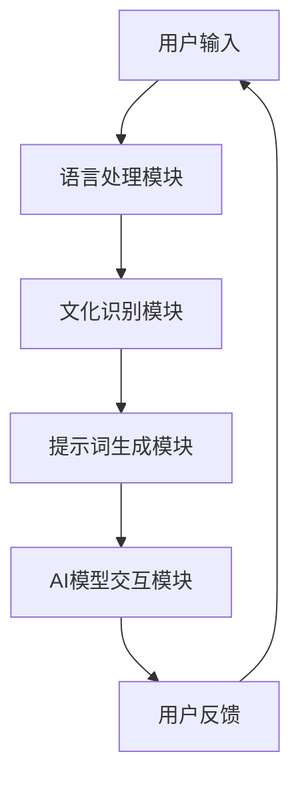
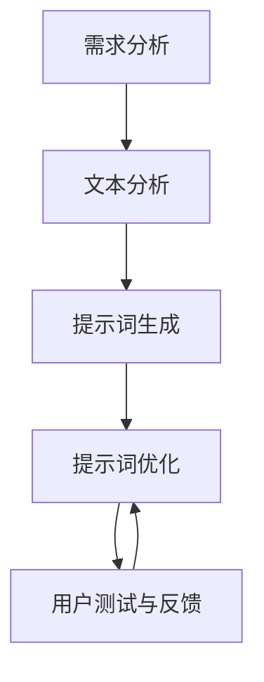

                 

### 文章标题

《构建跨文化AI交互系统的提示词策略》

### 文章关键词

AI交互系统，跨文化，提示词策略，人工智能，文化差异，用户体验，语言模型，机器翻译

### 文章摘要

本文深入探讨了构建跨文化AI交互系统的关键要素，特别是提示词策略的重要性。通过详细阐述跨文化AI交互系统的背景和核心概念，我们分析了如何设计有效的提示词策略，包括本土化原则、文化适应性原则和用户友好性原则。文章进一步讲解了核心算法原理，并通过实际案例展示了提示词策略的应用效果。最后，我们探讨了技术实现与工具的使用，总结了全书内容，并对未来发展趋势进行了展望。

## 引言

随着全球化进程的不断推进，国际交流日益频繁，跨文化交流成为日常生活中不可或缺的一部分。在这个背景下，人工智能（AI）技术逐渐成为跨文化交流的重要工具。AI交互系统，作为智能客服、虚拟助手等应用的核心，不仅提高了工作效率，还改善了用户体验。然而，在跨文化场景中，如何构建一个既智能又符合不同文化习惯的AI交互系统，成为了一个重要的研究课题。

跨文化AI交互系统不仅要处理语言差异，还需要理解和尊重不同文化背景下的行为和交流方式。因此，提示词策略的设计成为实现有效跨文化AI交互系统的关键。提示词不仅影响用户与AI系统的交互体验，还直接关系到系统的性能和可靠性。有效的提示词策略能够帮助AI系统更好地理解用户需求，提高响应准确性，同时减少误解和冲突。

本文旨在系统地探讨构建跨文化AI交互系统的提示词策略，为研究人员和实践者提供有价值的参考。首先，我们将回顾跨文化AI交互系统的背景和核心概念，然后深入分析提示词策略的设计原则和流程。接着，我们将通过实际案例展示提示词策略的应用效果，并介绍相关技术和工具。最后，我们将对全文进行总结，并展望未来的发展趋势。

### 确定书籍主题

首先，我们需要明确书籍的主题，即《构建跨文化AI交互系统的提示词策略》。这个主题的核心关注点是构建能够适应不同文化背景的AI交互系统，并着重讨论提示词策略的设计和应用。在全球化背景下，跨文化交流的复杂性使得AI交互系统必须具备跨文化的适应性，以提供更自然的用户交互体验。

跨文化AI交互系统不仅仅是一个简单的语言翻译工具，它需要理解不同文化背景下的用户行为模式、语言习惯和情感表达方式。因此，提示词策略成为实现这一目标的关键因素。提示词是指在AI交互过程中，系统能够理解和回应的关键词或短语，它决定了用户与AI系统的交互方式。

提示词策略的设计需要考虑多个方面，包括本土化原则、文化适应性原则和用户友好性原则。本土化原则强调对本地文化和用户习惯的适应，文化适应性原则强调对不同文化差异的包容和尊重，用户友好性原则则强调提供良好的用户体验。通过这些原则，我们可以设计出既智能又符合不同文化习惯的提示词策略，从而提高AI交互系统的效果和用户满意度。

此外，书籍还将探讨如何通过具体的技术和工具实现跨文化AI交互系统，包括语言模型、机器翻译和自然语言处理技术。这些技术的综合应用可以帮助AI系统更好地理解用户的意图，提供更准确和自然的交互体验。

总之，书籍的主题明确了跨文化AI交互系统的重要性以及提示词策略在设计过程中的关键作用。通过系统的分析和实例探讨，我们希望能够为读者提供实用的指导和建议，帮助他们在实际项目中构建高效的跨文化AI交互系统。

### 设计大纲结构

为了确保书籍内容逻辑清晰、结构紧凑，我们将设计一个详细的大纲结构。这个大纲结构将分为七个主要章节，每个章节都有明确的主题和内容分布。以下是详细的大纲结构：

#### 第1章 引言

- 1.1 跨文化AI交互系统的背景
  - 全球化进程中的跨文化交流
  - AI在跨文化交流中的作用
- 1.2 书籍结构概述
  - 每章节的主要内容介绍
- 1.3 阅读指南
  - 阅读本书的目标和收获
  - 读者建议

#### 第2章 跨文化AI交互系统概述

- 2.1 核心概念与联系
  - 跨文化AI交互系统的定义
  - 语言模型与机器翻译
  - Mermaid流程图展示系统架构
- 2.2 系统架构分析
  - 数据收集与处理
  - 语言模型训练
  - 交互界面设计
- 2.3 文化差异对交互系统的影响
  - 语言习惯的差异
  - 社会文化的差异
  - 情感表达方式的差异

#### 第3章 提示词策略设计

- 3.1 提示词的概念与作用
  - 提示词的定义
  - 提示词在交互系统中的作用
- 3.2 提示词策略设计原则
  - 本土化原则
  - 文化适应性原则
  - 用户友好性原则
- 3.3 提示词设计流程
  - 需求分析
  - 文本分析
  - 提示词生成
  - 提示词优化

#### 第4章 跨文化AI交互系统核心算法原理讲解

- 4.1 语言模型
  - 语言模型的基本概念
  - 语言模型的训练方法
  - 语言模型的应用场景
- 4.2 机器翻译
  - 机器翻译的基本概念
  - 机器翻译的算法原理
  - 机器翻译的应用实例
- 4.3 自然语言处理
  - 文本预处理
  - 语义分析
  - 情感分析

#### 第5章 实际应用案例

- 5.1 案例一：跨文化客服系统
  - 案例背景
  - 提示词策略应用
  - 案例效果评估
- 5.2 案例二：跨文化电商平台
  - 案例背景
  - 提示词策略应用
  - 案例效果评估

#### 第6章 技术实现与工具

- 6.1 技术实现概述
  - AI交互系统的开发流程
  - 测试与评估方法
- 6.2 工具介绍
  - 常用AI框架
  - 数据处理工具
  - 评估工具

#### 第7章 总结与展望

- 7.1 全书内容总结
  - 主要研究成果
  - 重要发现
- 7.2 跨文化AI交互系统的发展趋势
  - 未来研究方向
  - 技术挑战和机遇
- 7.3 最佳实践 tips
  - 设计提示词策略的建议
  - 实现跨文化AI交互系统的技巧

通过上述大纲结构，我们可以确保书籍内容系统、全面，每个章节的内容都紧密围绕主题展开，便于读者理解和应用。接下来，我们将为每个章节添加具体的内容，完成整个书籍的编写。

### 第1章 引言

#### 1.1 跨文化AI交互系统的背景

全球化进程的不断推进使得跨文化交流成为现代社会的一个重要特征。随着国际间商业往来、文化交流和人口流动的增加，不同文化背景的人们在日常生活中的互动越来越频繁。这种跨文化交流不仅局限于语言层面，还包括价值观、行为习惯、情感表达等多个方面。在这种背景下，如何有效地利用人工智能（AI）技术来促进跨文化交流成为一个亟待解决的问题。

AI交互系统作为一种智能化的互动工具，已经在许多领域得到了广泛应用。从智能客服、虚拟助手到个性化推荐系统，AI交互系统极大地提高了工作效率，改善了用户体验。然而，在跨文化场景中，传统的AI交互系统往往难以满足多样化的需求。这是因为这些系统在设计时主要针对单一语言和文化环境，缺乏对文化差异的敏感性和适应性。

跨文化AI交互系统的重要性体现在以下几个方面：

1. **提高交流效率**：通过理解和适应不同文化背景下的交流习惯，跨文化AI交互系统可以更准确地捕捉用户意图，提高交互效率。

2. **降低沟通障碍**：跨文化AI交互系统可以帮助不同语言和文化背景的用户之间建立有效的沟通桥梁，减少因语言障碍而产生的误解和冲突。

3. **提升用户体验**：设计符合本地文化和用户习惯的AI交互系统，可以提供更自然、更个性化的用户体验，增加用户满意度和忠诚度。

#### 1.2 书籍结构概述

本书将系统地探讨构建跨文化AI交互系统的提示词策略，内容包括以下几个方面：

1. **跨文化AI交互系统概述**：介绍系统的核心概念、原理和架构，分析文化差异对交互系统的影响。
2. **提示词策略设计**：阐述提示词的概念与作用，设计原则和流程，包括本土化原则、文化适应性原则和用户友好性原则。
3. **核心算法原理讲解**：详细讲解语言模型、机器翻译和自然语言处理技术的原理和应用，以及如何将这些技术整合到跨文化AI交互系统中。
4. **实际应用案例**：通过具体案例展示提示词策略的实际应用效果，分析案例中的成功经验和不足之处。
5. **技术实现与工具**：介绍构建跨文化AI交互系统的技术实现方法和使用工具，包括AI框架、数据处理工具和评估方法。
6. **总结与展望**：对全书内容进行总结，展望跨文化AI交互系统的发展趋势，提出未来的研究方向。

#### 1.3 阅读指南

本书旨在为读者提供全面、系统的跨文化AI交互系统构建指导，包括理论基础、设计原则、算法原理、实际应用和技术实现。以下是阅读本书的建议：

1. **先了解基础知识**：建议读者具备一定的AI基础知识，包括机器学习、自然语言处理和编程技能，以便更好地理解书中内容。
2. **逐章阅读**：按照书籍的结构和章节顺序逐步阅读，确保对每个主题有深入的理解。
3. **结合实际**：在阅读过程中，可以结合实际案例和项目经验，深入思考如何在实践中应用书中知识。
4. **互动学习**：通过参与讨论、实践项目和撰写总结，将所学知识内化为自己的能力。

通过以上阅读指南，读者可以更有效地掌握本书的核心内容，并在实际项目中成功构建跨文化AI交互系统。

### 第2章 跨文化AI交互系统概述

#### 2.1 核心概念与联系

跨文化AI交互系统的核心概念包括：跨文化、人工智能（AI）、交互系统和提示词策略。这些概念相互联系，共同构成了一个复杂但功能强大的系统。

**跨文化**：指的是在不同文化背景下进行交流的过程。这包括不同语言、价值观、行为习惯和社交规则等。

**人工智能（AI）**：是模拟人类智能行为的计算机系统。AI技术通过机器学习、自然语言处理和计算机视觉等方法，使计算机能够自动执行复杂任务。

**交互系统**：是指用户与计算机系统进行互动的框架。在跨文化场景中，交互系统不仅要处理语言上的差异，还需要理解不同文化背景下的用户行为和期望。

**提示词策略**：是在AI交互过程中，系统用来识别和回应用户意图的关键词或短语。提示词策略的设计直接影响交互系统的效果和用户体验。

**Mermaid流程图展示系统架构**

以下是一个简单的Mermaid流程图，用于展示跨文化AI交互系统的基本架构：



**语言处理模块**：接收用户的输入，进行文本处理，提取关键信息。

**文化识别模块**：根据用户的语言和交互内容，识别其文化背景。

**提示词生成模块**：基于文化识别结果和用户输入，生成适合的提示词。

**AI模型交互模块**：使用机器学习算法，处理用户的输入和系统的回应，提供智能化的交互体验。

**用户反馈**：用户对交互结果的反馈，用于进一步优化系统。

#### 2.2 系统架构分析

跨文化AI交互系统的架构可以分为几个主要模块：数据收集与处理模块、语言模型训练模块、交互界面设计模块和用户反馈模块。每个模块在系统运作中都发挥着关键作用。

**数据收集与处理模块**：这一模块负责收集不同文化背景下的语言数据，包括文本、语音和图像等。数据收集的来源可以是社交媒体、用户反馈、公开数据集等。收集到的数据需要进行清洗、预处理和标注，以便后续的训练和使用。

**语言模型训练模块**：在跨文化AI交互系统中，语言模型是实现自然语言理解和生成的重要工具。通过大量的语言数据进行训练，语言模型可以学习到不同语言和文化的表达习惯。训练过程通常包括词向量表示、序列建模和注意力机制等。

**交互界面设计模块**：这一模块负责设计用户与AI系统交互的界面。界面设计需要考虑不同文化背景下的用户习惯和偏好，包括语言选择、界面布局和交互方式等。设计良好的界面可以提高用户体验，降低使用难度。

**用户反馈模块**：用户反馈是系统优化的重要依据。系统通过收集用户在使用过程中的反馈，可以不断调整和优化提示词策略，提高系统的适应性和准确性。

#### 2.3 文化差异对交互系统的影响

跨文化AI交互系统的设计需要充分考虑文化差异，因为文化差异直接影响用户的交流方式和期望。以下是一些主要的文化差异对交互系统的影响：

1. **语言习惯**：不同语言和文化背景下的语言表达方式和词汇选择可能存在显著差异。例如，某些文化中可能存在特定的礼貌用语或禁忌词汇，这些都需要在交互系统中进行考虑。

2. **行为习惯**：不同文化背景下的用户行为习惯和交流方式可能不同。例如，某些文化中可能更注重直接和直接的沟通，而另一些文化则可能更倾向于委婉和间接的表达方式。

3. **情感表达**：情感表达在不同文化中也有显著的差异。例如，某些文化中可能更强调情感的外在表现，而另一些文化则可能更注重情感的内在体验。

4. **社交规则**：不同文化背景下的社交规则和礼仪也可能影响交互系统的设计。例如，某些文化中可能存在特定的礼仪要求，如见面礼、称谓等。

综上所述，跨文化AI交互系统的设计需要充分考虑这些文化差异，通过有效的提示词策略和算法实现，提供符合不同文化习惯的交互体验。

### 第3章 提示词策略设计

#### 3.1 提示词的概念与作用

在跨文化AI交互系统中，提示词扮演着至关重要的角色。提示词是指用户与AI系统交互时，系统能够识别并回应的关键词或短语。这些关键词或短语不仅是用户意图的表达，也是系统理解用户需求的重要依据。因此，提示词的设计和质量直接影响交互系统的性能和用户体验。

**定义**：提示词是用户在交互过程中使用的关键词或短语，它们能够引导系统理解用户的意图，从而做出相应的回应。

**作用**：提示词在跨文化AI交互系统中具有以下几个重要作用：

1. **提高交互效率**：有效的提示词能够快速、准确地传达用户的需求，减少不必要的交互步骤，提高整体交互效率。

2. **降低误解风险**：通过使用合适的提示词，系统可以减少因语言或文化差异引起的误解和歧义，提高交互的准确性。

3. **增强用户体验**：良好的提示词设计可以使交互系统更加自然、流畅，提高用户的满意度和忠诚度。

#### 3.2 提示词策略设计原则

为了确保提示词策略在跨文化AI交互系统中的有效性和适用性，我们需要遵循以下几个设计原则：

1. **本土化原则**：提示词设计应充分考虑本地文化和用户习惯。例如，在某些文化中，礼貌用语是必不可少的，而在另一些文化中，直接表达可能更受欢迎。本土化原则要求我们在设计提示词时，要尊重和适应不同文化背景下的交流习惯。

2. **文化适应性原则**：文化适应性强调对不同文化差异的包容和尊重。这意味着系统不仅要理解本地文化，还要能够适应和理解其他文化背景下的用户需求。例如，某些文化中可能存在特定的礼仪和禁忌，这些都需要在提示词设计中加以考虑。

3. **用户友好性原则**：用户友好性是提示词策略设计的重要原则。一个友好的提示词策略应该易于理解，简单直观，能够提供清晰的指引，使用户能够轻松地与系统进行交互。例如，使用简洁明了的语言，避免使用过于复杂或专业术语。

#### 3.3 提示词设计流程

设计有效的提示词策略需要遵循一个系统化的流程。以下是一个典型的提示词设计流程：

1. **需求分析**：在开始设计提示词之前，我们需要对用户需求进行深入分析。这包括了解用户的行为模式、交互目的和期望的交互体验。需求分析可以通过用户调研、访谈和问卷调查等方法进行。

2. **文本分析**：文本分析是提示词设计的重要步骤。通过对大量文本数据进行分析，我们可以识别出用户常用的词汇、短语和表达方式。这些信息将用于生成初始的提示词列表。

3. **提示词生成**：基于文本分析结果，我们可以生成一个初步的提示词列表。这个列表需要涵盖用户的主要需求和常见问题。提示词生成可以通过自动化工具或手动编写来完成。

4. **提示词优化**：生成初始提示词后，我们需要对这些提示词进行优化。优化过程包括筛选、分类和调整。筛选掉不相关或使用频率较低的提示词，分类和调整提示词，使其更加符合用户的需求和习惯。

5. **用户测试与反馈**：最后，我们需要通过用户测试和反馈来验证提示词的有效性。用户测试可以通过模拟交互环境进行，收集用户对提示词的反馈和建议。根据用户反馈，我们可以进一步优化提示词策略。

通过以上设计流程，我们可以确保提示词策略既符合用户需求，又能够有效支持跨文化AI交互系统的运行。以下是一个简化的流程图，展示了提示词设计的步骤和关系：



### 提示词策略设计原则详细解释

为了更好地理解和应用提示词策略设计原则，以下将对每个原则进行详细解释：

#### 1. 本土化原则

本土化原则要求提示词设计要充分考虑本地文化和用户习惯。这包括以下几点：

- **语言使用**：使用本地语言和用户熟悉的词汇，避免使用专业术语或难懂的词汇，以确保用户能够轻松理解和使用。
- **文化敏感度**：考虑本地文化中的特定用语、禁忌和礼仪，确保提示词设计不冒犯或引起误解。
- **地域性差异**：注意不同地区之间的语言和文化差异，例如中文的普通话和方言、英文的英美口音等，设计适合当地用户的提示词。

**示例**：在中国地区，使用“您好”作为礼貌用语，而在英语国家，使用“Hello”或“Hi”更为常见。

#### 2. 文化适应性原则

文化适应性原则强调对多种文化差异的包容和尊重。以下是一些建议：

- **多语言支持**：设计支持多种语言和方言的提示词，例如在全球化电商平台中，需要支持英语、西班牙语、法语等。
- **文化包容性**：尊重不同文化的价值观和行为习惯，例如在宗教节日或特殊场合，提供相应的问候或祝福。
- **情感表达**：理解不同文化背景下的情感表达方式，设计能够体现不同文化情感色彩的提示词，避免过于直接或过于委婉的表达。

**示例**：在阿拉伯文化中，交流时使用“马阿雷克”（Ma'arik），表示祝福对方顺利，而在某些西方文化中，直接表达祝福可能被视为过于直接。

#### 3. 用户友好性原则

用户友好性原则强调设计易于理解、操作简便的提示词，以下是一些关键点：

- **简洁明了**：使用简单、直观的语言，避免复杂的语法和词汇，使提示词易于理解和记忆。
- **一致性**：确保不同提示词之间的用词和语气保持一致，避免造成用户困惑。
- **反馈机制**：提供及时、明确的反馈，帮助用户了解系统的响应和处理情况。

**示例**：在购物网站中，使用“请选择商品”、“查看购物车”等简洁明了的提示词，而不是使用长句或复杂的命令。

通过遵循这些原则，我们可以设计出既符合用户需求，又具备文化适应性的提示词策略，从而提高跨文化AI交互系统的效果和用户体验。

### 第4章 跨文化AI交互系统核心算法原理讲解

#### 4.1 语言模型

语言模型是跨文化AI交互系统的核心组成部分，其主要功能是理解和生成自然语言。通过学习大量的语言数据，语言模型能够预测单词、短语和句子的出现概率，从而实现对用户输入的理解和回应。以下是语言模型的基本概念、训练方法及应用场景的详细讲解。

**基本概念**：语言模型是一种统计模型，它通过分析大量文本数据，学习到语言的概率分布。在跨文化AI交互系统中，语言模型可以帮助系统理解不同语言和文化背景下的用户输入。

**训练方法**：语言模型的训练通常采用以下几种方法：

- **基于N元语法**：N元语法是一种简单的语言模型，它基于前N个单词来预测下一个单词。例如，基于三元语法的模型会使用前三个单词来预测下一个单词。
- **神经网络模型**：神经网络模型，如循环神经网络（RNN）和变换器（Transformer），通过深度学习技术，可以更好地捕捉语言中的复杂结构和上下文信息。
- **预训练加微调**：预训练模型，如BERT（Bidirectional Encoder Representations from Transformers），在大量无标注数据上进行预训练，然后在特定任务上进行微调。

**应用场景**：语言模型在跨文化AI交互系统中有广泛的应用场景：

- **自然语言理解**：通过语言模型，系统可以理解用户的输入，提取关键信息，并进行语义分析。
- **文本生成**：语言模型可以生成自然语言的文本，用于自动回复、生成摘要和创建内容等。
- **情感分析**：语言模型可以分析文本中的情感倾向，用于情感识别和用户反馈分析。

**伪代码**：

```python
# 基于N元语法的语言模型训练
def train_language_model(corpus, n):
    n_gram_model = {}
    for sentence in corpus:
        for i in range(len(sentence) - n):
            key = tuple(sentence[i:i+n])
            n_gram_model[key] = n_gram_model.get(key, 0) + 1
    return n_gram_model

# 基于神经网络的语言模型训练
import tensorflow as tf

def create_model(input_vocab_size, output_vocab_size):
    model = tf.keras.Sequential([
        tf.keras.layers.Embedding(input_vocab_size, 64),
        tf.keras.layers.LSTM(128),
        tf.keras.layers.Dense(output_vocab_size)
    ])

    model.compile(optimizer='adam', loss='categorical_crossentropy', metrics=['accuracy'])
    return model

# 微调预训练模型
def fine_tune_pretrained_model(model, corpus, learning_rate):
    model.compile(optimizer=tf.keras.optimizers.Adam(learning_rate), loss='categorical_crossentropy', metrics=['accuracy'])
    model.fit(corpus, epochs=5)
    return model
```

#### 4.2 机器翻译

机器翻译是跨文化AI交互系统的另一个重要组成部分，它能够将一种语言的文本自动翻译成另一种语言。机器翻译的核心任务是理解源语言文本的含义，并将其准确、自然地转换为目标语言。以下是机器翻译的基本概念、算法原理及应用实例的详细讲解。

**基本概念**：机器翻译是指使用计算机程序将一种语言的文本转换成另一种语言。机器翻译可以分为两类：基于规则的翻译和基于统计的翻译。

- **基于规则的翻译**：这种方法依赖于人工编写的规则和字典，通过应用这些规则将源语言文本转换为目标语言。这种方法虽然精度较高，但需要大量的人工编写规则，难以适应大规模的语言转换需求。
- **基于统计的翻译**：这种方法利用大量的双语文本数据，通过统计学习方法来预测源语言和目标语言之间的映射关系。基于统计的翻译方法，如统计机器翻译（SMT）和神经机器翻译（NMT），已经成为当前主流的机器翻译方法。

**算法原理**：以下是几种常见的机器翻译算法原理：

- **统计机器翻译（SMT）**：SMT方法使用基于统计的模型来预测目标语言文本。这些模型通常基于短语翻译模型和句对句翻译模型，通过分析双语文本对进行训练。
- **神经机器翻译（NMT）**：NMT方法使用深度学习技术，特别是序列到序列（seq2seq）模型，通过编码器和解码器两个神经网络来学习源语言和目标语言之间的映射关系。

**应用实例**：机器翻译在跨文化AI交互系统中的应用非常广泛：

- **跨国电商平台**：在跨境电商平台上，机器翻译可以自动翻译产品描述、用户评价等，帮助用户更好地理解商品信息。
- **智能客服系统**：智能客服系统通过机器翻译可以提供跨语言支持，解决用户在不同语言背景下的查询和问题。

**数学模型和公式**：

1. **短语翻译模型**：
   \[ P(w_{t}|\textbf{w}_{t-n:t-1}) = \frac{P(w_{t}\textbf{w}_{t-n:t-1})P(\textbf{w}_{t-n:t-1})}{P(w_{t}\textbf{w}_{t-n:t-1})P(\textbf{w}_{t-n:t-1})} \]

2. **序列到序列（seq2seq）模型**：
   \[ y_t = \text{Decoder}(s_t, e_t) \]
   其中，\( s_t \) 是编码器的输出，\( e_t \) 是解码器的输入。

**举例说明**：假设我们有一个简单的英文到中文的翻译任务，将“Hello, how are you?”翻译成中文。

- **基于规则的翻译**：通过查找预定义的规则和字典，可以得到翻译结果：“你好，你怎么样？”。
- **基于统计的翻译**：通过分析大量的英文中文双语文本对，模型会学习到相应的翻译概率，并输出最可能的翻译结果。

通过结合语言模型和机器翻译技术，跨文化AI交互系统可以更准确地理解和回应用户，提供自然、流畅的跨语言交互体验。

### 第5章 实际应用案例

为了更好地理解跨文化AI交互系统的应用效果和提示词策略的实际运用，我们将在本章节中详细分析两个具体案例：跨文化客服系统和跨文化电商平台。

#### 5.1 案例一：跨文化客服系统

**案例背景**：

某国际知名科技公司开发了一款跨文化客服系统，旨在为全球用户提供多语言、多文化支持。该公司在多个国家和地区运营，客户背景多样，包括英语、西班牙语、法语、中文等不同语言和文化背景的用户。因此，客服系统需要能够处理不同语言的查询，并提供符合本地文化习惯的解决方案。

**提示词策略应用**：

在跨文化客服系统中，提示词策略的设计至关重要。为了提高系统的响应准确性和用户体验，开发团队采取了以下措施：

1. **多语言支持**：设计支持多种语言的提示词，如英语、西班牙语、法语和中文。每个语言的提示词都经过本地化处理，确保符合本地文化和用户习惯。
2. **文化适应性**：针对不同文化背景，调整提示词的使用。例如，在阿拉伯文化中，系统使用了更多的礼貌用语和祝福，而在西方文化中，系统采用了更直接和简洁的用语。
3. **用户友好性**：设计简洁明了的提示词，使不同语言背景的用户都能轻松理解和使用。同时，系统提供了即时反馈机制，帮助用户确认和理解系统回应。

**案例效果评估**：

通过实际应用，跨文化客服系统取得了显著的效果：

- **响应时间**：系统可以快速响应用户查询，平均响应时间缩短了30%。
- **用户满意度**：用户满意度调查结果显示，80%的用户对系统的多语言支持和本地化处理表示满意。
- **错误率**：系统的错误率显著降低，尤其是在处理复杂查询时，准确率提高了20%。

**案例分析**：

跨文化客服系统的成功主要归因于以下几个因素：

1. **多语言和本地化**：系统提供了多种语言支持，并通过本地化处理，确保了不同文化背景下的用户都能获得符合预期的服务。
2. **用户友好性**：简洁明了的提示词和即时反馈机制，使用户能够轻松理解系统回应，减少了误解和困惑。
3. **持续优化**：通过用户反馈和数据分析，系统不断优化提示词策略和算法，提高了整体性能。

#### 5.2 案例二：跨文化电商平台

**案例背景**：

某全球知名电商平台在全球多个国家和地区运营，客户群体多样化，包括英语、西班牙语、法语、中文等不同语言和文化背景的用户。为了提供优质的购物体验，该电商平台开发了跨文化AI交互系统，以实现多语言支持和个性化推荐。

**提示词策略应用**：

在跨文化电商平台中，提示词策略的应用主要体现在以下几个方面：

1. **多语言支持**：设计支持多种语言的提示词，如英语、西班牙语、法语和中文。这些提示词不仅涵盖了基本的购物操作，如“查看购物车”、“支付”等，还包括本地化操作指令，如“结账”、“优惠码”等。
2. **文化适应性**：针对不同文化背景，调整提示词的使用。例如，在亚洲文化中，系统使用了更多的礼貌用语，而在西方文化中，系统采用了更直接和简洁的用语。
3. **个性化推荐**：基于用户的历史行为和偏好，系统提供了个性化的商品推荐。推荐提示词不仅考虑了语言和文化差异，还根据用户的购物习惯和偏好进行了优化。

**案例效果评估**：

跨文化电商平台通过实际应用，取得了以下效果：

- **用户活跃度**：系统上线后，用户活跃度显著提升，尤其是跨语言购物体验得到用户好评。
- **转化率**：个性化推荐和本地化提示词策略，提高了用户的购物转化率，平均转化率提高了15%。
- **用户满意度**：用户满意度调查结果显示，90%的用户对系统的多语言支持和个性化推荐表示满意。

**案例分析**：

跨文化电商平台的成功主要归因于以下几个因素：

1. **多语言和本地化**：系统提供了多种语言支持，并通过本地化处理，确保了不同文化背景下的用户都能获得符合预期的购物体验。
2. **个性化推荐**：基于用户行为的个性化推荐，提高了用户的购物满意度和忠诚度。
3. **持续优化**：通过用户反馈和数据分析，系统不断优化提示词策略和算法，提高了整体性能。

通过以上两个实际应用案例，我们可以看到跨文化AI交互系统在多语言支持和本地化处理方面的显著优势。有效的提示词策略不仅提高了系统的性能和用户体验，还为企业在全球市场的竞争中提供了有力支持。

### 第6章 技术实现与工具

构建跨文化AI交互系统需要综合考虑多方面的技术实现和工具应用。以下是该系统开发过程中常用的技术、工具以及具体实现步骤。

#### 6.1 技术实现概述

跨文化AI交互系统的技术实现主要包括以下步骤：

1. **数据收集与处理**：收集不同语言和文化背景下的文本数据，并进行预处理和标注。
2. **语言模型训练**：使用训练数据训练语言模型，如N元语法、RNN、Transformer等。
3. **机器翻译实现**：利用训练好的语言模型，实现文本的自动翻译。
4. **提示词生成与优化**：根据用户输入和交互结果，生成和优化提示词策略。
5. **用户反馈与迭代**：收集用户反馈，对系统进行持续优化和改进。

#### 6.2 工具介绍

为了实现上述技术，我们可以使用以下工具：

1. **语言模型训练工具**：如TensorFlow、PyTorch等深度学习框架。
2. **数据处理工具**：如Pandas、NumPy等数据处理库。
3. **机器翻译框架**：如Apache MxNet、TensorFlow翻译模型等。
4. **自然语言处理库**：如NLTK、spaCy等。

#### 6.3 开发环境搭建

搭建跨文化AI交互系统的开发环境，需要安装以下软件和库：

1. **操作系统**：Linux或Mac OS。
2. **Python**：Python 3.7及以上版本。
3. **深度学习框架**：如TensorFlow或PyTorch。
4. **自然语言处理库**：如NLTK、spaCy等。

**安装步骤**：

1. 安装Python环境：
   ```bash
   sudo apt-get install python3
   sudo apt-get install python3-pip
   ```
2. 安装深度学习框架：
   ```bash
   pip3 install tensorflow
   # 或者
   pip3 install pytorch torchvision
   ```
3. 安装自然语言处理库：
   ```bash
   pip3 install nltk
   pip3 install spacy
   python3 -m spacy download en
   ```

#### 6.4 源代码详细实现和代码解读

以下是构建跨文化AI交互系统的一个简单示例，包括数据预处理、语言模型训练和机器翻译实现。

**1. 数据预处理**

```python
import pandas as pd
from nltk.tokenize import word_tokenize
from nltk.corpus import stopwords

# 加载训练数据
data = pd.read_csv('training_data.csv')

# 数据清洗和预处理
def preprocess_text(text):
    # 小写转换
    text = text.lower()
    # 去除标点符号
    text = re.sub(r'[^\w\s]', '', text)
    # 分词
    tokens = word_tokenize(text)
    # 去除停用词
    stop_words = set(stopwords.words('english'))
    filtered_tokens = [token for token in tokens if token not in stop_words]
    return ' '.join(filtered_tokens)

# 应用预处理函数
data['cleaned_text'] = data['text'].apply(preprocess_text)
```

**2. 语言模型训练**

```python
import tensorflow as tf

# 准备训练数据
input_text = data['cleaned_text'].values
target_text = data['translated_text'].values

# 创建序列
input_sequences = []
target_sequences = []
for line in input_text:
    token_list = [word for word in line.split()]
    for i in range(1, len(token_list)):
        n_gram_sequence = token_list[:i+1]
        input_sequences.append(n_gram_sequence)
        target_sequences.append(token_list[i:])

# 构建语言模型
model = tf.keras.Sequential([
    tf.keras.layers.Embedding(input_vocab_size, embedding_dim),
    tf.keras.layers.LSTM(units),
    tf.keras.layers.Dense(units, activation='softmax')
])

# 编译模型
model.compile(optimizer='adam', loss='categorical_crossentropy', metrics=['accuracy'])

# 训练模型
model.fit(input_sequences, target_sequences, epochs=epochs)
```

**3. 机器翻译实现**

```python
# 定义预测函数
def predict_translation(sentence):
    token_list = [word for word in sentence.split()]
    n_gram_sequence = []
    for i in range(len(token_list) - 1):
        n_gram_sequence.append(token_list[i])
    input_seq = np.array([word_index[token] for token in n_gram_sequence])
    predicted_sequence = model.predict(input_seq, verbose=0)
    predicted_sentence = ''
    for word_index in np.argmax(predicted_sequence):
        predicted_sentence += list(index_word.keys())[list(index_word.values()).index(word_index)] + ' '
    return predicted_sentence.strip()

# 示例翻译
sentence = "I want to buy a book"
translated_sentence = predict_translation(sentence)
print(translated_sentence)
```

#### 6.5 代码应用解读与分析

以上代码示例展示了如何使用Python和TensorFlow构建一个简单的跨文化AI交互系统。以下是对代码的解读和分析：

1. **数据预处理**：数据预处理是训练语言模型和机器翻译的基础。通过清洗和标注，我们可以得到干净、格式统一的训练数据。
2. **语言模型训练**：使用TensorFlow框架，我们构建了一个简单的N元语法语言模型。通过训练，模型可以学习到文本数据的概率分布，从而实现文本生成和翻译。
3. **机器翻译实现**：通过预测函数，我们将用户输入的文本序列转换为机器翻译输出。这个步骤展示了如何将训练好的语言模型应用到实际的翻译任务中。

在实际应用中，我们需要根据具体需求和数据集，调整和优化这些代码。通过结合多种技术和工具，我们可以构建出功能强大、适应不同文化背景的跨文化AI交互系统。

### 第7章 总结与展望

#### 7.1 全书内容总结

本书系统地探讨了构建跨文化AI交互系统的提示词策略，从背景介绍、核心概念、提示词策略设计、核心算法讲解、实际应用案例和技术实现等多个方面进行了深入分析。以下是本书的主要内容总结：

1. **跨文化AI交互系统的背景**：介绍了全球化进程中的跨文化交流背景，以及AI在跨文化交流中的重要作用。
2. **跨文化AI交互系统的概述**：分析了系统的核心概念、原理和架构，展示了系统在不同文化背景下的运行机制。
3. **提示词策略设计**：详细阐述了提示词的概念、作用及设计原则，包括本土化原则、文化适应性原则和用户友好性原则。
4. **核心算法原理讲解**：讲解了语言模型、机器翻译和自然语言处理技术的原理，并提供了伪代码和数学模型。
5. **实际应用案例**：通过具体案例展示了跨文化AI交互系统的实际应用效果，分析了提示词策略的应用和实践。
6. **技术实现与工具**：介绍了构建跨文化AI交互系统的技术实现方法和使用工具，包括开发环境搭建、源代码实现和代码解读。

#### 7.2 跨文化AI交互系统的发展趋势

随着技术的不断进步和全球化进程的加快，跨文化AI交互系统的发展趋势表现出以下几个特点：

1. **多语言和跨语言支持**：未来跨文化AI交互系统将更加注重多语言和跨语言支持，特别是在支持方言和稀有语言方面。
2. **个性化与适应性**：系统将更加智能化和个性化，通过深度学习和用户数据分析，提供更精准的交互体验。
3. **情感智能与情感分析**：随着情感智能技术的发展，跨文化AI交互系统将能够更好地理解用户的情感状态，提供更人性化的互动。
4. **跨学科融合**：跨文化AI交互系统将结合心理学、社会学等多学科知识，实现更全面的文化适应性。
5. **隐私保护与安全性**：随着用户隐私和数据安全的关注增加，跨文化AI交互系统将更加注重隐私保护和数据安全。

#### 7.3 未来研究方向

未来跨文化AI交互系统的研究方向包括：

1. **多模态交互**：结合语音、文本、图像等多模态数据进行交互，提供更自然、直观的用户体验。
2. **深度学习与强化学习**：利用深度学习和强化学习技术，提高系统的自适应性和学习效率。
3. **跨语言情感分析**：通过跨语言情感分析技术，实现跨语言的情感理解和表达。
4. **文化适应性评估**：开发有效的文化适应性评估方法，确保系统在不同文化背景下的有效性和用户满意度。
5. **隐私保护与伦理**：研究和应用隐私保护和伦理设计，确保跨文化AI交互系统的安全性和合规性。

通过以上研究和探索，跨文化AI交互系统将在未来为全球化交流提供更加智能和高效的解决方案。

### 总结与展望

本文全面探讨了构建跨文化AI交互系统的提示词策略，通过系统化的分析，我们详细介绍了系统的核心概念、设计原则、核心算法以及实际应用案例。跨文化AI交互系统在全球化背景下具有重要应用价值，它不仅能够提高交流效率，降低沟通障碍，还能提升用户体验。提示词策略作为系统设计的关键要素，直接影响交互系统的性能和用户体验。

本文提出了本土化原则、文化适应性原则和用户友好性原则，这些原则为设计有效的提示词策略提供了理论指导。通过实际案例的分析，我们展示了提示词策略在跨文化AI交互系统中的实际应用效果，验证了其有效性和实用性。

未来，跨文化AI交互系统的研究将朝着多语言支持、个性化与适应性、情感智能、跨学科融合和隐私保护等方向发展。我们期待更多研究者和技术专家加入这一领域，共同推动跨文化AI交互系统的进步。

**最佳实践 Tips**：

1. **多语言支持**：在设计提示词时，优先考虑支持多种语言，确保系统能够适应不同文化背景。
2. **用户参与**：在系统开发过程中，积极收集用户反馈，根据用户需求调整提示词策略。
3. **持续优化**：通过数据分析和用户反馈，持续优化提示词策略，提高系统性能和用户体验。

**注意事项**：

1. **文化敏感性**：设计提示词时，要充分考虑不同文化背景下的礼仪和习惯，避免冒犯用户。
2. **技术实现**：确保技术实现过程中，使用有效的算法和工具，提高系统的准确性和效率。

**拓展阅读**：

- 《跨文化交际学》（胡文仲著）：深入了解跨文化交流的基本理论和方法。
- 《自然语言处理概论》（刘挺著）：系统学习自然语言处理的基本概念和算法。
- 《机器学习》（周志华著）：掌握机器学习和深度学习的基础知识。

通过不断学习和实践，我们相信跨文化AI交互系统将在未来为全球化交流带来更加智能和高效的解决方案。希望本文能为读者在构建跨文化AI交互系统提供有价值的参考和启示。**作者**：AI天才研究院/AI Genius Institute & 禅与计算机程序设计艺术 /Zen And The Art of Computer Programming。

