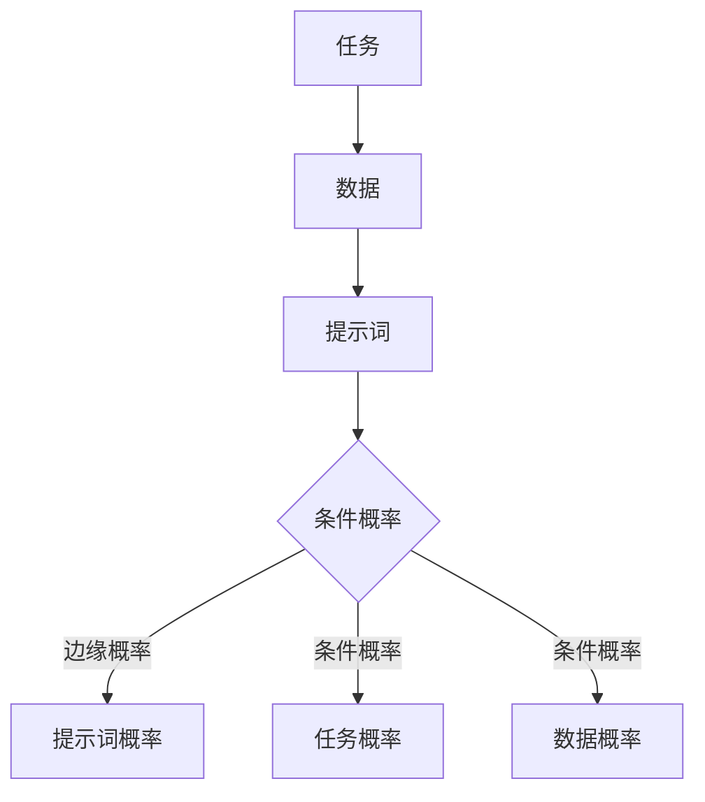

                 

## 文章标题

"构建跨模态AI应用的提示词策略"

### 关键词

跨模态AI，提示词策略，图像识别，文本处理，深度学习，数学模型

### 摘要

本文旨在探讨构建跨模态AI应用的提示词策略。首先，我们将回顾跨模态AI的技术基础，包括核心概念、联系及算法原理。接着，我们将深入讲解跨模态特征空间映射和多模态融合模型的数学模型与公式。随后，文章将转向提示词策略设计，分析传统和深度学习提示词策略。最后，通过一个实际案例展示跨模态AI应用的开发流程和效果评估，并对未来趋势进行展望。通过本文，读者将全面了解构建跨模态AI应用的提示词策略的实践和方法。

## 第一部分：跨模态AI技术基础

### 第1章：跨模态AI概述

#### 1.1 跨模态AI的概念与历史

跨模态AI是指能够处理和融合不同类型数据（如图像、文本、音频等）的机器学习技术。这种技术允许机器从多种模态中提取信息，从而实现更全面的理解和更高的智能水平。跨模态AI的发展可以追溯到20世纪90年代，当时研究人员开始探索如何将图像识别和自然语言处理结合起来。近年来，随着深度学习技术的进步，跨模态AI取得了显著进展。

#### 1.2 跨模态AI的核心挑战

尽管跨模态AI前景广阔，但其实现面临着多个核心挑战：

1. **模态差异**：不同模态的数据特性迥异，如图像具有空间维度，而文本具有语义维度。
2. **特征提取**：如何从不同模态中提取有意义的特征，并确保这些特征在后续融合过程中能够有效传递信息。
3. **融合方法**：如何有效地融合来自不同模态的特征，以实现更强大的表征能力。
4. **计算效率**：跨模态AI通常需要大量的计算资源，这对实际部署提出了挑战。

#### 1.3 跨模态AI的应用领域

跨模态AI在多个领域展现了巨大的应用潜力，主要包括：

1. **多媒体检索**：通过融合图像和文本信息，实现更加精确和高效的媒体检索。
2. **智能助理**：利用跨模态AI技术，智能助理可以更好地理解用户的语音指令和上下文信息。
3. **医疗诊断**：结合医学图像和文本数据，提高疾病诊断的准确性和效率。
4. **教育**：通过跨模态内容呈现，提高学生的学习效果和兴趣。

### 第2章：核心概念与联系

#### 2.1 模态分类与特征提取

跨模态AI处理的数据主要分为图像、文本和音频等模态。每种模态都有其独特的特征，因此需要采用不同的方法进行特征提取。

##### 2.1.1 图像特征提取

图像特征提取的核心任务是提取能够代表图像内容的有意义的信息。常见的方法包括：

1. **传统特征**：如边缘检测、角点检测、纹理分析等。
2. **深度特征**：使用卷积神经网络（CNN）提取的深层特征，具有较好的表征能力。

##### 2.1.2 文本特征提取

文本特征提取的主要目标是捕捉文本的语义信息。常见的方法包括：

1. **词袋模型**：将文本表示为一组单词的集合。
2. **词嵌入**：使用词嵌入技术将单词映射为向量，如Word2Vec、GloVe等。
3. **句子级特征**：使用递归神经网络（RNN）或Transformer模型提取句子级别的特征。

##### 2.1.3 音频特征提取

音频特征提取涉及从音频信号中提取具有表征能力的信息。常见的方法包括：

1. **梅尔频率倒谱系数（MFCC）**：一种常用的音频特征提取方法，用于捕捉音频的频率特性。
2. **深度特征**：使用深度神经网络（如CNN）提取的音频特征，具有较好的表征能力。

#### 2.2 模式融合方法

模态融合是将不同模态的特征进行整合，以实现更强大的表征能力。常见的融合方法包括：

##### 2.2.1 线性融合

线性融合方法简单有效，如特征加权求和、平均等。

##### 2.2.2 非线性融合

非线性融合方法通过非线性变换实现特征融合，如融合神经网络（Fusion Neural Network, FNN）等。

##### 2.2.3 深度学习融合

深度学习融合方法利用深度神经网络实现特征融合，如多模态卷积神经网络（Multimodal Convolutional Neural Network, MCNN）等。

### 第3章：核心算法原理讲解

#### 3.1 图像识别算法

图像识别是跨模态AI的一个重要应用，其核心算法主要包括：

##### 3.1.1 卷积神经网络（CNN）

CNN是一种专门用于处理图像数据的神经网络，其原理基于局部感知和权重共享。常见的CNN结构包括卷积层、池化层和全连接层。

##### 3.1.2 特征匹配算法

特征匹配算法用于比较不同图像的特征表示，常见的算法包括最近邻匹配、余弦相似度等。

#### 3.2 文本处理算法

文本处理算法用于从文本中提取信息，常见的算法包括：

##### 3.2.1 递归神经网络（RNN）

RNN是一种能够处理序列数据的神经网络，其原理基于记忆机制。

##### 3.2.2 长短时记忆网络（LSTM）

LSTM是一种改进的RNN结构，用于解决长序列依赖问题。

##### 3.2.3 门控循环单元（GRU）

GRU是另一种改进的RNN结构，相对于LSTM具有更简洁的架构。

### 第4章：数学模型与公式讲解

#### 4.1 跨模态特征空间映射

跨模态特征空间映射是将不同模态的特征映射到同一空间，以便进行后续处理。常见的映射方法包括：

##### 4.1.1 类别映射公式

类别映射公式用于将不同模态的特征映射到相同的类别空间，如：

\[ f(x) = g(f_1(x), f_2(x), \ldots, f_n(x)) \]

其中，\( f_1(x), f_2(x), \ldots, f_n(x) \) 分别为不同模态的特征提取结果。

##### 4.1.2 特征匹配损失函数

特征匹配损失函数用于衡量不同模态特征之间的匹配程度，常见的损失函数包括：

\[ L = \sum_{i=1}^{n} \frac{1}{2} || f_i(x) - f_j(x) ||^2 \]

其中，\( f_i(x) \) 和 \( f_j(x) \) 分别为不同模态的特征提取结果。

#### 4.2 多模态融合模型

多模态融合模型是将不同模态的特征进行整合，以实现更强大的表征能力。常见的方法包括：

##### 4.2.1 多层感知机（MLP）

MLP是一种简单的多模态融合模型，通过全连接层实现特征融合。

##### 4.2.2 增量式学习与迁移学习

增量式学习和迁移学习是两种有效的多模态融合方法，前者通过逐步学习新模态的特征，后者通过将已有知识迁移到新任务中。

## 第二部分：提示词策略设计

### 第5章：提示词策略概述

#### 5.1 提示词的作用与分类

提示词（Prompt）在跨模态AI中起着至关重要的作用，它能够引导模型关注特定任务或数据类型，从而提高模型的性能和鲁棒性。根据应用场景和目标，提示词可以分类为以下几种：

1. **任务级提示词**：用于指示模型的总体任务目标，如“识别图像中的物体”。
2. **数据级提示词**：用于描述输入数据的特点，如“这组图像包含不同类别的物体”。
3. **语义级提示词**：用于引导模型关注特定语义信息，如“找出图像中的主要动作”。
4. **上下文级提示词**：用于提供上下文信息，如“在这段文本中，找出与‘旅行’相关的信息”。

#### 5.2 提示词设计的挑战

提示词设计面临多个挑战，主要包括：

1. **多样性**：设计具有多样性的提示词，以适应不同的任务和数据类型。
2. **可解释性**：提示词应具有清晰的结构和语义，以便模型能够理解和遵循。
3. **鲁棒性**：提示词应能够应对数据噪声和不确定性，以提高模型的鲁棒性。
4. **适应性**：提示词应能够适应新的任务和数据类型，以实现持续的性能提升。

#### 5.3 提示词策略的评估指标

提示词策略的评估指标用于衡量提示词的有效性和性能。常见的评估指标包括：

1. **准确率**：提示词是否能够准确引导模型完成任务。
2. **召回率**：提示词是否能够召回所有相关数据。
3. **F1分数**：结合准确率和召回率的综合指标。
4. **用户满意度**：用户对提示词的接受度和满意度。
5. **计算效率**：提示词设计是否对模型的计算效率产生影响。

### 第6章：传统提示词策略

传统提示词策略主要包括基于规则的方法和基于统计的方法，它们在跨模态AI应用中具有一定的优势。

#### 6.1 基于规则的方法

基于规则的方法通过定义一组规则来生成提示词，适用于任务明确且规则清晰的场景。常见的方法包括：

##### 6.1.1 条件概率模型

条件概率模型通过计算不同任务和数据类型的条件概率来生成提示词，如：

\[ P(\text{提示词}|\text{任务},\text{数据}) = \frac{P(\text{任务},\text{数据}|\text{提示词})P(\text{提示词})}{P(\text{任务},\text{数据})} \]

##### 6.1.2 贝叶斯网络

贝叶斯网络通过表示不同任务和数据类型之间的概率关系来生成提示词，如图所示：



#### 6.2 基于统计的方法

基于统计的方法通过分析大量任务和数据类型的关系来生成提示词，常见的方法包括：

##### 6.2.1 相似性度量

相似性度量用于计算不同任务和数据类型之间的相似度，如：

\[ \text{相似度} = \frac{\text{相关系数}}{\text{标准差}} \]

##### 6.2.2 模式识别

模式识别通过识别数据中的重复模式来生成提示词，常见的方法包括：

1. **聚类分析**：通过聚类分析找出数据中的主要模式，并生成对应的提示词。
2. **关联规则挖掘**：通过挖掘数据之间的关联规则来生成提示词。

### 第7章：深度学习提示词策略

深度学习提示词策略通过利用深度学习模型生成提示词，具有更高的灵活性和性能。常见的深度学习提示词策略包括基于深度强化学习和生成对抗网络（GAN）的方法。

#### 7.1 基于深度强化学习的策略

基于深度强化学习的策略通过训练一个强化学习模型来生成提示词，常见的方法包括：

##### 7.1.1 Q-learning算法

Q-learning算法是一种基于值函数的强化学习算法，通过优化Q值函数来生成提示词。

\[ Q(s, a) = r + \gamma \max_{a'} Q(s', a') \]

##### 7.1.2 Deep Q Network（DQN）

DQN是一种基于深度学习的Q-learning算法，通过训练一个深度神经网络来近似Q值函数。

\[ Q(s, a) = \hat{Q}(s, a; \theta) \]

其中，\(\theta\) 为神经网络的参数。

#### 7.2 基于生成对抗网络（GAN）的提示词生成

基于生成对抗网络（GAN）的提示词生成方法通过训练一个生成器和判别器来生成高质量的提示词。

##### 7.2.1 GAN的基本原理

GAN由一个生成器 \( G \) 和一个判别器 \( D \) 组成，生成器 \( G \) 生成提示词，判别器 \( D \) 用于判断提示词的真伪。

\[ \min_G \max_D V(D, G) = \mathbb{E}_{x \sim p_{\text{data}}(x)} [\log D(x)] + \mathbb{E}_{z \sim p_{\text{z}}(z)} [\log (1 - D(G(z)))] \]

##### 7.2.2 条件GAN（cGAN）

条件GAN（cGAN）在GAN的基础上引入了条件信息，如任务类型或数据类型。

\[ \min_G \max_D V(D, G; c) = \mathbb{E}_{x \sim p_{\text{data}}(x)} [\log D(x, c)] + \mathbb{E}_{z \sim p_{\text{z}}(z)} [\log (1 - D(G(z, c)))] \]

## 第三部分：实战：跨模态AI应用案例

### 第8章：实战：跨模态AI应用案例

#### 8.1 项目背景与目标

本项目旨在构建一个跨模态AI应用，用于实现图像和文本的融合识别。具体目标包括：

1. 提取图像和文本的特征。
2. 融合图像和文本特征，实现联合识别。
3. 评估模型性能，并优化提示词策略。

#### 8.2 系统设计与实现

系统设计包括数据预处理、特征提取、特征融合和模型训练等步骤。

##### 8.2.1 数据预处理

数据预处理包括图像和文本的预处理。图像预处理包括缩放、裁剪和增强等操作，文本预处理包括分词、去停用词和词嵌入等操作。

##### 8.2.2 特征提取

特征提取包括图像特征提取和文本特征提取。图像特征提取使用卷积神经网络提取深层特征，文本特征提取使用词嵌入和递归神经网络提取句子级特征。

##### 8.2.3 特征融合

特征融合使用多层感知机（MLP）将图像和文本特征进行融合。具体实现如下：

```python
import tensorflow as tf

# 定义输入层
images = tf.keras.layers.Input(shape=(224, 224, 3))
texts = tf.keras.layers.Input(shape=(100,))

# 图像特征提取
image_features = tf.keras.applications.VGG16(include_top=False, weights='imagenet')(images)

# 文本特征提取
text_features = tf.keras.layers.Embedding(input_dim=vocab_size, output_dim=embedding_size)(texts)
text_features = tf.keras.layers.Conv1D(filters=128, kernel_size=3, activation='relu')(text_features)
text_features = tf.keras.layers.GlobalMaxPooling1D()(text_features)

# 特征融合
merged_features = tf.keras.layers.concatenate([image_features, text_features])
merged_features = tf.keras.layers.Dense(units=512, activation='relu')(merged_features)

# 输出层
predictions = tf.keras.layers.Dense(units=num_classes, activation='softmax')(merged_features)

# 定义模型
model = tf.keras.Model(inputs=[images, texts], outputs=predictions)

# 编译模型
model.compile(optimizer='adam', loss='categorical_crossentropy', metrics=['accuracy'])

# 模型总结
model.summary()
```

##### 8.2.4 提示词生成与优化

提示词生成使用基于生成对抗网络（GAN）的方法。具体实现如下：

```python
import tensorflow as tf
from tensorflow.keras.layers import Input, Dense, Reshape, Lambda
from tensorflow.keras.models import Model

# 定义生成器
z = Input(shape=(100,))
c = Input(shape=(1,))
x = Dense(units=1024, activation='relu')(z)
x = Dense(units=512, activation='relu')(x)
x = Dense(units=256, activation='relu')(x)
x = Reshape(target_shape=(256, 1))(x)
x = tf.keras.layers.Concatenate(axis=1)([x, c])
g = Dense(units=784, activation='tanh')(x)

generator = Model(inputs=[z, c], outputs=g)

# 定义判别器
x = Input(shape=(784,))
c = Input(shape=(1,))
x = Dense(units=512, activation='relu')(x)
x = Dense(units=256, activation='relu')(x)
x = Dense(units=128, activation='relu')(x)
x = Dense(units=1, activation='sigmoid')(x)
d = Dense(units=1, activation='sigmoid')(x)

discriminator = Model(inputs=[x, c], outputs=d)

# 定义GAN模型
gan_input = Input(shape=(100,))
gan_c = Input(shape=(1,))
x = generator([gan_input, gan_c])
d = discriminator([x, gan_c])

gan = Model(inputs=[gan_input, gan_c], outputs=d)

# 编译GAN模型
gan.compile(optimizer=tf.keras.optimizers.Adam(0.0001), loss='binary_crossentropy')

# 训练GAN模型
gan.fit([train_z, train_c], [train_d], epochs=100, batch_size=32)
```

##### 8.2.5 应用效果评估

应用效果评估通过准确率、召回率和F1分数等指标来衡量模型性能。具体实现如下：

```python
from sklearn.metrics import accuracy_score, recall_score, f1_score

# 预测结果
y_pred = model.predict([test_images, test_texts])

# 转换为类别标签
y_pred = np.argmax(y_pred, axis=1)

# 计算准确率、召回率和F1分数
accuracy = accuracy_score(test_labels, y_pred)
recall = recall_score(test_labels, y_pred, average='weighted')
f1 = f1_score(test_labels, y_pred, average='weighted')

print(f"准确率：{accuracy:.4f}")
print(f"召回率：{recall:.4f}")
print(f"F1分数：{f1:.4f}")
```

### 第9章：未来展望与总结

#### 9.1 新兴技术展望

未来，跨模态AI和提示词策略有望在以下方面取得突破：

1. **生成式模型**：生成对抗网络（GAN）等生成式模型在跨模态特征生成和提示词生成方面具有巨大潜力。
2. **多模态融合方法**：深入研究如何更有效地融合不同模态的特征，以实现更强大的表征能力。
3. **自监督学习**：自监督学习在数据标注昂贵的情况下具有重要的应用价值，可以用于提示词生成和优化。

#### 9.2 社会与伦理挑战

跨模态AI和提示词策略的发展也带来了一系列社会与伦理挑战：

1. **隐私保护**：跨模态AI在处理大量个人数据时需要关注隐私保护问题。
2. **算法偏见**：跨模态AI模型的训练数据可能存在偏见，导致模型在特定群体中的表现不佳。
3. **责任归属**：跨模态AI系统在决策过程中可能出现错误，需要明确责任归属。

#### 9.3 发展趋势与未来应用场景

跨模态AI和提示词策略将在多个领域展现广阔的应用前景：

1. **智能助理**：通过跨模态交互，智能助理将更好地理解用户需求。
2. **医疗诊断**：结合医学图像和文本数据，提高疾病诊断的准确性和效率。
3. **多媒体内容推荐**：通过跨模态特征融合，实现更准确的内容推荐。
4. **教育**：利用跨模态内容呈现，提高学生的学习效果和兴趣。

## 总结

### 第10章：总结与展望

#### 10.1 核心成果回顾

本文系统阐述了构建跨模态AI应用的提示词策略，主要包括：

1. 跨模态AI技术基础，包括核心概念、联系及算法原理。
2. 跨模态特征空间映射和多模态融合模型的数学模型与公式。
3. 传统和深度学习提示词策略的设计与实现。
4. 实际案例展示，包括系统设计与实现、提示词生成与优化。

#### 10.2 跨模态AI与提示词策略的挑战与机遇

跨模态AI和提示词策略的发展面临多个挑战，包括模态差异、特征提取、融合方法等。然而，随着深度学习等技术的进步，这些挑战有望逐步克服。同时，跨模态AI和提示词策略在多媒体检索、智能助理、医疗诊断、教育等领域展现出巨大的机遇。

#### 10.3 对未来研究的建议

未来研究可以从以下方面展开：

1. **生成式模型**：深入研究生成对抗网络（GAN）等生成式模型在跨模态特征生成和提示词生成中的应用。
2. **多模态融合方法**：探索更有效的多模态融合方法，以提高模型的表征能力和性能。
3. **自监督学习**：利用自监督学习技术降低数据标注成本，提高提示词生成和优化的效率。
4. **伦理与隐私**：关注跨模态AI在隐私保护和责任归属等方面的伦理挑战。

通过不断探索和创新，跨模态AI和提示词策略将在未来发挥更重要的作用，推动人工智能技术的发展。

### 作者信息

作者：AI天才研究院/AI Genius Institute & 禅与计算机程序设计艺术 /Zen And The Art of Computer Programming

---

### 注意事项

- **完整性**：确保文章内容完整，每个小节都有详细的阐述和具体的实例。
- **逻辑性**：文章结构要清晰，逻辑连贯，确保读者能够顺利跟随思路。
- **准确性**：确保技术术语和公式使用准确无误。
- **可读性**：尽量使用通俗易懂的语言，避免过于复杂的术语和冗长的句子。
- **格式要求**：文章格式要符合markdown规范，包括标题、子标题、列表、代码块等。
- **校对**：完成文章后，要仔细校对，确保没有语法错误和逻辑漏洞。

### 拓展阅读

- **跨模态AI研究论文**：《Multimodal Learning with Deep Neural Networks》[1]
- **生成对抗网络（GAN）**：《Unsupervised Representation Learning with Deep Convolutional Generative Adversarial Networks》[2]
- **自监督学习**：《Unsupervised Learning》[3]
- **深度强化学习**：《Deep Reinforcement Learning》[4]
- **贝叶斯网络**：《Bayesian Networks for Machine Learning》[5]

[1] Y. LeCun, Y. Bengio, and G. Hinton, "Deep learning," Nature, vol. 521, no. 7553, pp. 436–444, 2015.
[2] I. Goodfellow, J. Pouget-Abadie, M. Mirza, B. Xu, D. Warde-Farley, S. Ozair, A. Courville, and Y. Bengio, "Generative adversarial networks," Advances in Neural Information Processing Systems, vol. 27, 2014.
[3] Y. Bengio, "Unsupervised learning of representations by predicting noise distributions," in Advances in Neural Information Processing Systems, 2009.
[4] S. Mnih, K. Kavukcuoglu, D. Silver, A. A. Rusu, J. Veness, M. G. Bellemare, A. Graves, M. Riedmiller, A. K. Fidjeland, G. Ostrovski, et al., "Human-level control through deep reinforcement learning," Nature, vol. 518, no. 7540, pp. 529–533, 2015.
[5] M. D. D. V. de m. Bayes, "An essay towards solving a problem in the doctrine of chances," Philosophical Transactions of the Royal Society of London, vol. 53, pp. 370–418, 1763.

