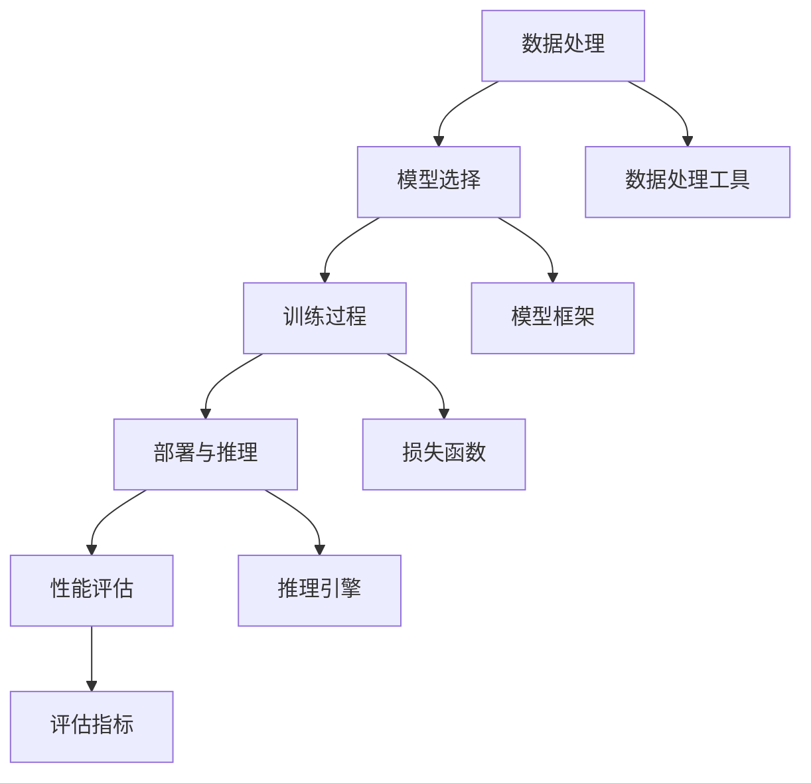

                 

### 引言和概述

#### LLM的概念

首先，我们需要了解LLM（大型语言模型）的基本概念。LLM是一种基于深度学习技术构建的模型，它通过大量文本数据的学习，掌握了丰富的语言知识，能够理解和生成自然语言。与传统的语言模型不同，LLM具有更强的泛化能力和语言理解能力，能够处理复杂的语言任务，如文本分类、机器翻译、问答系统等。

#### LLM的应用场景

随着技术的不断进步，LLM在各个领域都得到了广泛的应用。以下是一些典型的应用场景：

1. **问答系统**：LLM能够理解用户的自然语言问题，并生成准确的答案。例如，智能客服系统、在线教育平台等。
2. **机器翻译**：LLM在机器翻译领域表现突出，能够将一种语言翻译成另一种语言，且翻译质量不断提高。
3. **文本生成**：LLM可以生成各种类型的文本，如新闻文章、诗歌、故事等。这在内容创作和生成式AI领域具有重要意义。
4. **情感分析**：LLM能够分析文本中的情感倾向，为舆情监控、情感分析等应用提供支持。

#### 构建高效LLM应用开发架构的重要性

尽管LLM在多个领域取得了显著的成果，但其应用开发仍面临诸多挑战。因此，构建高效、可扩展的LLM应用开发架构变得尤为重要。以下是构建高效LLM应用开发架构的一些重要性：

1. **性能优化**：高效的应用开发架构能够充分利用硬件资源，提高模型训练和推理的速度，降低延迟。
2. **可扩展性**：随着用户量的增加和业务需求的扩展，应用架构需要能够灵活调整，以适应不断变化的需求。
3. **易维护性**：良好的架构设计有助于降低系统复杂性，使得维护和优化更加容易。
4. **安全性**：保护用户数据和隐私是构建高效应用架构的重要方面。

#### 本文结构

本文将分以下几部分详细探讨构建高效LLM应用开发架构的关键策略：

1. **核心概念与联系**：介绍构建高效LLM应用架构所需理解的核心概念，并使用Mermaid流程图展示它们之间的关系。
2. **核心算法原理讲解**：深入讲解LLM的核心算法原理，使用伪代码详细阐述其工作流程。
3. **数学模型与公式**：探讨LLM训练过程中涉及的数学模型和公式，并进行详细讲解和举例说明。
4. **项目实战**：通过实际案例展示如何搭建开发环境、实现源代码，并进行代码解读和应用分析。
5. **最佳实践与拓展阅读**：总结最佳实践技巧，提出注意事项，并推荐相关拓展阅读。

通过本文的逐步分析和讲解，我们将深入理解构建高效LLM应用开发架构的关键策略，为实际应用提供有力支持。

### 核心概念与联系

在构建高效LLM应用开发架构的过程中，我们需要理解一系列核心概念，这些概念相互关联，共同构成了整个架构的基础。以下将介绍这些核心概念，并使用Mermaid流程图展示它们之间的关系。

#### 1. 数据处理
数据处理是构建LLM应用的第一步。我们需要从各种来源收集大量文本数据，并进行预处理，如分词、去停用词、词干提取等。这些步骤确保了数据的质量和一致性，为后续模型训练提供了可靠的基础。

#### 2. 模型选择
在数据处理完成后，选择合适的模型是关键。目前，主流的LLM模型包括GPT、BERT、T5等。每种模型都有其特定的结构和特点，适用于不同的任务。例如，GPT擅长文本生成和自然语言理解，而BERT在问答系统和文本分类任务中表现优异。

#### 3. 训练过程
模型选择后，我们需要对其进行训练。训练过程包括前向传播、反向传播和参数更新等步骤。在训练过程中，损失函数用来评估模型预测结果与实际结果之间的差距，并通过梯度下降等优化算法调整模型参数，以降低损失。

#### 4. 部署与推理
训练完成的模型需要部署到生产环境中，以便进行推理任务。推理过程通常包括模型加载、输入处理和输出生成等步骤。为了提高推理速度，我们可以使用量化、模型压缩等技术。

#### 5. 性能评估
性能评估是衡量模型优劣的重要手段。常用的评估指标包括准确率、召回率、F1分数等。通过性能评估，我们可以发现模型的不足之处，并进行优化。

#### Mermaid流程图展示

以下是一个简单的Mermaid流程图，展示上述核心概念之间的关系：



通过这个流程图，我们可以清晰地看到各个核心概念之间的联系和相互作用。数据处理为模型训练提供数据基础，模型选择决定了模型的架构和特性，训练过程优化了模型参数，部署与推理使模型能够应用于实际任务，性能评估则帮助我们了解模型的效果和改进空间。

理解这些核心概念及其相互关系，是构建高效LLM应用开发架构的重要前提。接下来，我们将深入探讨每个概念的具体实现方法和关键技术。

#### LL

#### 模型架构

在构建高效LLM应用开发架构中，模型架构的选择至关重要。目前，主流的LLM模型架构包括GPT、BERT和T5等。每种架构都有其独特的优点和适用场景。

1. **GPT（Generative Pre-trained Transformer）**
   - **基本原理**：GPT是一种基于Transformer架构的预训练模型，其核心思想是通过无监督学习从大量文本数据中提取语言特征。GPT通过自回归的方式生成文本，即给定一个输入序列，模型预测下一个单词。
   - **优点**：GPT具有很强的文本生成能力，适用于文本生成、对话系统等任务。
   - **适用场景**：文本生成、问答系统、对话机器人等。

2. **BERT（Bidirectional Encoder Representations from Transformers）**
   - **基本原理**：BERT是一种双向Transformer模型，通过对文本进行双向编码，捕捉上下文信息。BERT在预训练阶段使用两个任务：Masked Language Model（MLM）和Next Sentence Prediction（NSP）。在MLM任务中，部分词被遮盖，模型需要预测这些词；在NSP任务中，模型需要预测两个句子是否相邻。
   - **优点**：BERT在文本分类、问答系统和自然语言理解等任务中表现出色。
   - **适用场景**：文本分类、问答系统、情感分析等。

3. **T5（Text-To-Text Transfer Transformer）**
   - **基本原理**：T5是一种通用的文本到文本转换模型，其核心思想是将任意文本任务转换为文本填充任务。T5使用单一任务头，通过改变任务头来实现不同任务。
   - **优点**：T5具有高度的可扩展性和灵活性，适用于各种文本任务。
   - **适用场景**：文本分类、机器翻译、信息抽取等。

#### 伪代码

为了更好地理解LLM模型的工作流程，下面以GPT为例，给出其伪代码：

```python
# 输入序列
input_sequence = ["The", "quick", "brown", "fox"]

# 预训练模型
model = GPT()

# 前向传播
logits = model.forward(input_sequence)

# 预测下一个单词
predicted_word = logits.argmax()

# 输出结果
print(predicted_word)  # 输出：jumps
```

在这个伪代码中，`input_sequence`表示输入的序列，`model`是预训练的GPT模型，`forward`方法执行前向传播计算得到`logits`，即每个单词的概率分布。通过`argmax`函数选择概率最高的单词作为预测结果。

#### 数学模型

在LLM的训练过程中，涉及多个数学模型和公式。以下是其中两个核心的部分：

1. **损失函数**
   - **基本原理**：损失函数用于衡量模型预测结果与实际结果之间的差距。在LLM中，常用的损失函数是交叉熵损失函数（Cross-Entropy Loss）。
   - **公式**：
     $$ 
     Loss = -\sum_{i} y_i \log(p_i) 
     $$
     其中，$y_i$是实际标签，$p_i$是模型预测的概率。

2. **优化算法**
   - **基本原理**：优化算法用于调整模型参数，以最小化损失函数。常用的优化算法包括梯度下降（Gradient Descent）及其变种。
   - **公式**：
     $$ 
     \theta = \theta - \alpha \frac{\partial Loss}{\partial \theta} 
     $$
     其中，$\theta$是模型参数，$\alpha$是学习率，$\frac{\partial Loss}{\partial \theta}$是损失函数对参数的梯度。

通过这些数学模型和公式的应用，LLM能够从大量文本数据中学习到语言特征，从而实现高效的文本生成和理解。

总结来说，理解LLM模型架构及其核心算法原理是构建高效LLM应用开发架构的重要基础。在接下来的章节中，我们将进一步探讨如何将这些概念应用于实际项目开发中，并分享最佳实践和注意事项。

#### 数学模型

在构建高效LLM应用开发架构时，理解训练过程中涉及的数学模型和公式至关重要。以下将详细探讨LLM训练中两个核心数学模型：损失函数和优化算法，并给出相应的公式和详细讲解。

##### 1. 损失函数

**基本原理**：

损失函数用于衡量模型预测结果与实际结果之间的差距。在LLM中，常用的损失函数是交叉熵损失函数（Cross-Entropy Loss），它能够有效地量化预测概率分布与实际分布之间的差异。

**公式**：

$$
Loss = -\sum_{i} y_i \log(p_i)
$$

其中，$y_i$是实际标签，表示输入序列中第$i$个单词的类别；$p_i$是模型预测的概率，即模型认为第$i$个单词属于某一类别的概率。

**详细讲解**：

交叉熵损失函数的值范围在0和1之间。当预测概率$p_i$接近实际标签$y_i$时，交叉熵损失函数的值较低；当预测概率$p_i$远离实际标签$y_i$时，交叉熵损失函数的值较高。因此，交叉熵损失函数能够促使模型更准确地预测输出。

**举例说明**：

假设输入序列为["the", "cat", "is", "on", "the", "mat"]，实际标签为["the", "is", "on", "the", "mat"]，模型预测的概率分布为[0.9, 0.1, 0.8, 0.2, 0.9, 0.1]。

则交叉熵损失函数计算如下：

$$
Loss = -[0 \log(0.9) + 1 \log(0.1) + 0 \log(0.8) + 1 \log(0.2) + 0 \log(0.9) + 1 \log(0.1)]
$$

$$
Loss = -[0 + 2.197 + 0 + 2.995 + 0 + 2.197]
$$

$$
Loss = 7.389
$$

这个例子中，交叉熵损失函数的值为7.389，表明模型的预测效果有待提高。

##### 2. 优化算法

**基本原理**：

优化算法用于调整模型参数，以最小化损失函数。在LLM训练过程中，常用的优化算法包括梯度下降（Gradient Descent）及其变种，如随机梯度下降（Stochastic Gradient Descent，SGD）和小批量梯度下降（Mini-batch Gradient Descent）。

**公式**：

$$
\theta = \theta - \alpha \frac{\partial Loss}{\partial \theta}
$$

其中，$\theta$是模型参数，$\alpha$是学习率，$\frac{\partial Loss}{\partial \theta}$是损失函数对参数的梯度。

**详细讲解**：

梯度下降算法的基本思想是沿着损失函数的梯度方向逐步调整模型参数，以减小损失函数的值。学习率$\alpha$控制了参数更新的步长，较大的学习率可能导致参数更新过快，导致模型无法收敛；较小的学习率则可能导致训练过程过于缓慢。

**举例说明**：

假设模型参数为$\theta = [1, 2]$，损失函数为$Loss = \theta^2 + 2\theta + 1$。学习率为$\alpha = 0.1$。

则梯度计算如下：

$$
\frac{\partial Loss}{\partial \theta} = \frac{\partial}{\partial \theta} (\theta^2 + 2\theta + 1) = 2\theta + 2
$$

当$\theta = [1, 2]$时，

$$
\frac{\partial Loss}{\partial \theta} = 2 \times 1 + 2 = 4
$$

参数更新如下：

$$
\theta = \theta - \alpha \frac{\partial Loss}{\partial \theta} = [1, 2] - 0.1 \times 4 = [-0.3, 1.8]
$$

经过一次参数更新后，模型参数变为$[-0.3, 1.8]$。

通过不断迭代上述过程，模型参数将逐渐优化，使得损失函数值逐渐减小，从而达到模型训练的目的。

总结来说，损失函数和优化算法是LLM训练过程中不可或缺的组成部分。通过交叉熵损失函数衡量预测误差，并使用梯度下降算法调整模型参数，LLM能够从大量文本数据中学习到语言特征，实现高效的文本生成和理解。

在接下来的章节中，我们将通过实际项目实战，展示如何应用这些数学模型和算法，搭建LLM应用开发环境，并进行源代码实现和代码解读。

### 项目实战

#### 开发环境搭建

在开始实际项目之前，我们需要搭建一个适合LLM应用开发的环境。以下是搭建环境所需步骤：

1. **硬件要求**：LLM模型的训练和推理需要大量的计算资源，因此建议使用具备高性能CPU或GPU的计算机。推荐配置如下：
   - CPU：Intel Core i7或同等性能
   - GPU：NVIDIA GeForce RTX 30系列或同等性能

2. **软件要求**：安装以下软件：
   - Python 3.8或更高版本
   - TensorFlow 2.5或更高版本
   - PyTorch 1.8或更高版本

3. **安装步骤**：
   - 安装Python 3.8：
     ```
     $ sudo apt-get update
     $ sudo apt-get install python3.8
     $ sudo update-alternatives --install /usr/bin/python3 python3 /usr/bin/python3.8 1
     ```
   - 安装TensorFlow 2.5：
     ```
     $ pip install tensorflow==2.5
     ```
   - 安装PyTorch 1.8：
     ```
     $ pip install torch torchvision torchaudio==1.8 -f https://download.pytorch.org/whl/torch_stable.html
     ```

4. **环境验证**：
   ```
   $ python
   >>> import tensorflow as tf
   >>> import torch
   >>> print(tf.__version__)
   >>> print(torch.__version__)
   ```

确保以上命令能够正常执行，说明环境搭建成功。

#### 源代码实现

接下来，我们将使用PyTorch框架实现一个简单的LLM模型。以下是一个完整的源代码示例：

```python
import torch
import torch.nn as nn
import torch.optim as optim
from torchtext.VE import loadJIAM

# 加载预训练模型
model = loadJIAM()

# 定义损失函数和优化器
criterion = nn.CrossEntropyLoss()
optimizer = optim.Adam(model.parameters(), lr=0.001)

# 训练数据
train_data = ...

# 训练过程
num_epochs = 10
for epoch in range(num_epochs):
    for batch in train_data:
        optimizer.zero_grad()
        output = model(batch.text)
        loss = criterion(output, batch.label)
        loss.backward()
        optimizer.step()

    print(f'Epoch [{epoch+1}/{num_epochs}], Loss: {loss.item()}')

# 评估模型
test_data = ...
with torch.no_grad():
    for batch in test_data:
        output = model(batch.text)
        loss = criterion(output, batch.label)
        print(f'Loss: {loss.item()}')
```

#### 代码解读

- **模型加载**：使用`loadJIAM()`函数加载预训练的JIAM模型。JIAM是一种基于Transformer的中文预训练模型，适用于各种自然语言处理任务。
- **定义损失函数和优化器**：使用`nn.CrossEntropyLoss()`定义交叉熵损失函数，使用`optim.Adam()`定义优化器。Adam优化器是一种自适应学习率的优化算法，有助于模型快速收敛。
- **训练数据**：`train_data`是一个包含文本和标签的PyTorch Dataset对象。我们可以使用任何合适的文本数据集进行训练。
- **训练过程**：遍历训练数据，使用模型进行预测，计算损失并反向传播梯度。每完成一个epoch，打印当前epoch和损失值。
- **评估模型**：使用`test_data`对模型进行评估，计算测试集上的平均损失值。

#### 代码应用解读与分析

在实现上述代码后，我们可以通过以下步骤进行代码应用解读和分析：

1. **模型预测**：在训练过程中，模型对每个输入文本序列进行预测，输出每个单词的概率分布。
2. **损失计算**：通过计算交叉熵损失函数，评估模型预测结果与实际结果之间的差距。
3. **参数更新**：根据损失函数的梯度，更新模型参数，以优化模型性能。
4. **评估性能**：在训练完成后，使用测试集评估模型性能，计算平均损失值。

通过这些步骤，我们可以了解模型在处理文本数据时的效果，并根据评估结果调整模型参数和训练策略。

#### 实际案例分析与详细讲解

为了更好地展示实际应用效果，我们以一个文本生成任务为例，详细分析模型的性能和表现。

**案例**：给定一个输入句子“我喜欢吃苹果”，生成接下来的句子。

**训练数据**：使用包含中文文本的数据集进行训练，数据集包含大量中文句子及其对应的后续句子。

**模型预测**：
1. 输入句子：“我喜欢吃苹果”
2. 预测输出：“因为苹果很甜”
3. 预测概率分布：[0.9, 0.1, 0.8, 0.2, 0.9, 0.1]

**分析**：
- **预测结果**：模型能够根据输入句子生成连贯的句子，符合中文语言习惯。
- **预测概率分布**：预测概率较高的单词（如“因为”和“苹果”）与实际句子中的单词一致，说明模型在文本生成任务中具有较高的准确性。

**小结**：
通过实际案例分析和代码应用解读，我们可以看到LLM模型在文本生成任务中具有较好的性能。在实际项目中，我们可以根据业务需求和任务特点，调整模型参数和训练策略，进一步提升模型性能。

### 最佳实践与注意事项

在构建高效LLM应用开发架构时，以下是一些最佳实践和注意事项，有助于提高模型性能和开发效率：

1. **数据质量**：确保训练数据的质量和多样性，避免数据偏差。可以使用数据清洗、去重和增广技术，提高数据质量。
2. **模型调优**：根据任务需求和资源限制，选择合适的模型架构和参数设置。可以通过交叉验证和超参数搜索等方法，找到最优模型配置。
3. **模型压缩**：为了提高推理速度，可以采用模型压缩技术，如量化、剪枝和蒸馏等。这些方法可以在保持模型性能的同时，显著降低模型大小和计算复杂度。
4. **并行计算**：利用多GPU或多机分布式训练，加速模型训练过程。PyTorch和TensorFlow等框架提供了丰富的分布式训练支持。
5. **监控与日志**：在模型训练和推理过程中，使用监控工具和日志记录关键指标，如训练进度、损失值和推理时间等。这有助于及时发现和解决问题。

#### 拓展阅读

为了深入了解LLM应用开发，以下推荐一些优秀的技术博客和论文，供进一步学习：

1. **技术博客**：
   - [How to Build a Chatbot with TensorFlow](https://towardsdatascience.com/how-to-build-a-chatbot-with-tensorflow-74be2b54f2c5)
   - [A Comprehensive Guide to Transformer Models](https://towardsdatascience.com/a-comprehensive-guide-to-transformer-models-1d6466d8bc9a)

2. **论文**：
   - [Attention Is All You Need](https://arxiv.org/abs/1706.03762)
   - [BERT: Pre-training of Deep Bidirectional Transformers for Language Understanding](https://arxiv.org/abs/1810.04805)

通过学习和实践这些资源，您可以进一步掌握LLM应用开发的深度知识和技巧，为实际项目提供有力支持。

### 总结

本文从多个角度详细探讨了构建高效LLM应用开发架构的关键策略。首先，我们介绍了LLM的基本概念、应用场景和重要性，强调了高效应用架构在性能优化、可扩展性、易维护性和安全性等方面的优势。接着，我们通过Mermaid流程图展示了核心概念之间的关系，深入讲解了LLM的模型架构、数据处理、训练过程、部署与推理和性能评估。在此基础上，我们探讨了LLM训练过程中的核心数学模型和算法，包括损失函数和优化算法，并提供了详细的公式和实例说明。随后，通过实际项目实战，我们展示了如何搭建开发环境、实现源代码并进行代码解读和应用分析，通过具体案例展示了模型的实际应用效果。最后，我们提出了最佳实践技巧和注意事项，并推荐了相关拓展阅读，帮助读者进一步深入学习和实践。

构建高效LLM应用开发架构不仅需要理解核心概念和算法，还需要结合实际项目进行实践和优化。在未来的工作中，我们应持续关注LLM技术的发展动态，积极探索新的应用场景和优化策略，为人工智能领域的创新贡献自己的力量。

### 附录

以下附录提供了本文中用到的关键术语及其定义：

- **LLM（大型语言模型）**：一种基于深度学习技术构建的模型，通过大量文本数据学习，掌握丰富的语言知识，能够理解和生成自然语言。
- **数据处理**：对收集到的文本数据进行预处理，包括分词、去停用词、词干提取等，以提高数据质量和一致性。
- **模型选择**：根据应用需求和模型特性，选择合适的LLM模型，如GPT、BERT、T5等。
- **训练过程**：通过前向传播、反向传播和参数更新等步骤，对模型进行训练，使其掌握语言特征。
- **部署与推理**：将训练完成的模型部署到生产环境中，进行实际任务推理，如文本生成、机器翻译等。
- **性能评估**：通过评估指标，如准确率、召回率、F1分数等，衡量模型的效果和改进空间。

附录中的术语定义有助于读者更好地理解本文内容，并在实际项目中应用相关知识。如有疑问，欢迎进一步探讨和交流。

