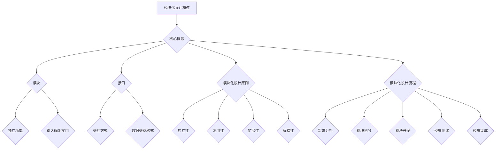
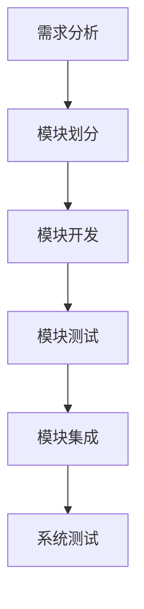

                 

### 模块化设计概述

**1. 背景介绍**

模块化设计是一种系统设计和开发方法，其核心理念是将复杂系统分解为可管理的模块，并通过模块间的接口进行通信和协作。这种方法在计算机科学和软件工程中得到了广泛应用，特别是在大型软件系统开发中。模块化设计有助于提高软件的可维护性、可扩展性和复用性，从而减少开发时间和成本。

模块化设计的概念起源于工程学，早在20世纪初，泰勒制（Taylorism）和福特主义（Fordism）等生产管理模式就提出了将生产过程分解为可重复的模块，以提高效率和降低成本。随着计算机技术的发展，模块化设计在软件工程中得到了进一步的完善和推广。

在软件工程中，模块通常指的是具有独立功能、能够独立开发、测试和部署的程序单元。模块化设计要求模块之间具有明确的接口和相对独立的功能，使得各个模块可以独立开发、测试和部署。这种设计方法使得软件系统更加模块化和解耦，从而提高了系统的灵活性和可维护性。

**2. 核心概念与联系**

为了更好地理解模块化设计，我们需要明确以下几个核心概念：

- **模块**：模块是软件系统中具有独立功能、能够独立开发、测试和部署的程序单元。模块通常具有明确的输入和输出接口，并通过接口与其他模块进行通信和协作。

- **接口**：接口是模块之间的通信渠道，定义了模块之间的交互方式和数据交换格式。良好的接口设计是实现模块间解耦的关键。

- **模块化设计原则**：模块化设计原则包括模块独立性、模块复用性、模块扩展性和模块解耦性。模块独立性要求模块功能明确，模块复用性要求模块具有通用性，模块扩展性要求模块能够方便地扩展功能，模块解耦性要求模块之间具有较低的耦合度。

- **模块化设计流程**：模块化设计流程通常包括需求分析、模块划分、模块开发、模块测试和模块集成等步骤。

下面是模块化设计核心概念与联系架构的Mermaid流程图：



通过上述核心概念与联系架构的Mermaid流程图，我们可以清晰地看到模块化设计的基本概念和各个概念之间的联系。模块化设计通过将复杂系统分解为独立的模块，并通过良好的接口设计实现模块间的协作，从而提高系统的可维护性、可扩展性和复用性。

### 模块化设计的基本原理

**1. 模块化设计的起源与发展**

模块化设计的概念最早可以追溯到20世纪初，当时泰勒（Frederick Taylor）提出了科学管理理论，主张将生产过程分解为一系列独立的操作步骤，从而提高生产效率。这一思想在20世纪30年代福特汽车公司的生产线上得到了广泛应用，即著名的福特主义（Fordism）。福特主义通过大规模生产线的模块化设计，极大地提高了生产效率和产品质量。

在计算机科学领域，模块化设计的概念逐渐从工程学借鉴过来。20世纪60年代，随着计算机系统变得越来越复杂，软件工程师开始意识到，将复杂的系统分解为更小的、更易于管理的部分是一个有效的解决方案。最早的模块化编程思想可以追溯到1962年，Dartmouth学院的Kathleen Antonelli和John Kemeny开发的Basic语言，它是第一个提供模块化编程功能的语言。

**2. 模块化设计的关键特点**

模块化设计具有以下几个关键特点：

- **独立性**：模块具有独立的功能，可以独立开发、测试和部署。这种独立性使得开发人员可以专注于单个模块的优化，而不必担心其他模块的复杂性。

- **复用性**：模块具有通用性，可以在不同的系统或项目中进行复用。这种复用性不仅减少了开发时间，还提高了代码的质量和一致性。

- **扩展性**：模块设计时考虑了未来的扩展性，使得在需要增加功能或修改现有功能时，可以方便地扩展模块，而不会对其他模块产生影响。

- **解耦性**：模块之间通过良好的接口进行通信，从而实现了解耦。这种解耦性使得模块之间的依赖关系最小化，从而提高了系统的灵活性和可维护性。

**3. 模块化设计的基本流程**

模块化设计的基本流程通常包括以下几个步骤：

- **需求分析**：在开始模块化设计之前，需要对系统的需求进行详细分析。这一步骤的目的是明确系统的功能需求、性能要求和用户界面设计。

- **模块划分**：根据需求分析的结果，将系统分解为一系列功能独立的模块。模块划分时需要考虑模块的独立性、复用性和扩展性。

- **模块开发**：每个模块的开发通常独立进行。在开发过程中，需要遵循编码规范，确保模块的功能正确、性能良好和易于维护。

- **模块测试**：模块开发完成后，需要对每个模块进行功能测试和性能测试。测试的目的是确保模块的功能符合需求，并且性能达到预期。

- **模块集成**：将所有模块集成到系统中，进行整体测试和调试。这一步骤的目的是确保系统功能的完整性和稳定性。

下面是模块化设计基本流程的Mermaid流程图：



通过上述流程图，我们可以清晰地看到模块化设计的基本步骤和各个步骤之间的关系。模块化设计通过明确的流程和原则，将复杂的系统开发过程分解为可管理的部分，从而提高了开发效率和质量。

### LLM基础知识

**1. LLM的定义与特点**

LLM（Large Language Model，大型语言模型）是一种基于深度学习技术的自然语言处理模型，它通过学习大量文本数据来预测和生成自然语言文本。LLM的主要特点包括：

- **大规模**：LLM具有数十亿至数万亿个参数，比传统的自然语言处理模型（如n-gram模型、SVM等）具有更大的规模。

- **预训练**：LLM通过在大量文本数据上进行预训练，学习到语言的一般规律和模式，从而具备强大的语言理解和生成能力。

- **自适应**：LLM可以根据不同的任务和应用场景进行微调（Fine-tuning），从而适应特定的任务需求。

- **高效**：LLM采用高效的深度学习算法和计算优化技术，使得模型在处理大规模文本数据时具有很高的效率。

**2. LLM的工作原理**

LLM的工作原理主要包括以下几个步骤：

- **输入处理**：LLM首先对输入文本进行预处理，包括分词、去停用词、词向量编码等操作，将文本转换为模型可以处理的格式。

- **编码**：将预处理后的输入文本编码为一个向量表示，通常使用Word2Vec、GloVe等词向量模型。

- **预测**：LLM通过计算输入文本的编码向量与模型参数的乘积，生成概率分布，从而预测输出文本。

- **生成**：根据概率分布生成输出文本，通常使用采样（Sampling）技术，如顶针采样（Top-p sampling）和温度调节（Temperature）。

**3. LLM的应用场景**

LLM在自然语言处理领域有着广泛的应用，主要包括：

- **文本分类**：将文本数据分类到预定义的类别中，如情感分析、主题分类等。

- **机器翻译**：将一种语言的文本翻译成另一种语言。

- **问答系统**：回答用户提出的问题，如搜索引擎、智能客服等。

- **文本生成**：生成自然语言文本，如文章、摘要、对话等。

- **对话系统**：模拟人类对话，如聊天机器人、语音助手等。

**4. LLM的优势与挑战**

LLM的优势包括：

- **强大的语言理解能力**：通过预训练，LLM可以学习到丰富的语言知识和模式，从而具备强大的语言理解和生成能力。

- **自适应能力**：LLM可以根据不同的任务和应用场景进行微调，从而适应特定的任务需求。

- **高效处理能力**：LLM采用高效的深度学习算法和计算优化技术，使得模型在处理大规模文本数据时具有很高的效率。

LLM的挑战包括：

- **计算资源需求**：LLM通常需要大量的计算资源和存储空间，尤其是在训练和推理阶段。

- **数据质量要求**：LLM的训练效果很大程度上依赖于训练数据的质量和多样性，如果数据存在偏差或不足，可能会导致模型产生偏见。

- **安全性和隐私保护**：在应用LLM时，需要确保用户数据的隐私保护和模型的安全性。

**5. LLM的发展趋势**

随着深度学习技术的不断发展和计算资源的提升，LLM的发展趋势包括：

- **模型规模继续增大**：随着计算资源的提升，LLM的模型规模将继续增大，从而提高模型的性能。

- **多模态学习**：LLM将逐渐与其他模态（如图像、声音等）进行融合，实现更加丰富的语言理解和生成能力。

- **知识增强**：LLM将结合外部知识库和知识图谱，实现更加准确和智能的语言理解。

- **应用场景拓展**：LLM将在更多的应用场景中发挥作用，如智能医疗、金融分析、法律咨询等。

### 模块化设计与LLM的关联

**1. 模块化设计对LLM开发的影响**

模块化设计对LLM的开发具有重要影响，主要表现在以下几个方面：

- **提高开发效率**：通过模块化设计，可以将LLM的开发过程分解为多个独立的模块，每个模块负责特定的任务，如数据预处理、模型训练、模型评估等。这种分解使得开发人员可以专注于单个模块的开发，从而提高整体开发效率。

- **增强可维护性**：模块化设计使得LLM具有更好的可维护性。由于模块之间通过清晰的接口进行通信，开发人员可以独立修改或替换某个模块，而不会影响到其他模块，从而降低了系统的维护难度。

- **提高可扩展性**：模块化设计使得LLM具有良好的可扩展性。在未来的需求变化或功能扩展时，可以通过新增或修改现有模块来实现，而不需要对整个系统进行大规模重构。

- **优化性能**：模块化设计有助于优化LLM的性能。通过独立测试和优化每个模块，可以确保系统各个部分的性能达到最佳状态，从而提高整体系统的性能。

**2. LLM在模块化设计中的应用**

LLM在模块化设计中的应用主要体现在以下几个方面：

- **模块化数据处理**：在LLM开发过程中，数据处理是一个重要且复杂的环节。通过模块化设计，可以将数据处理过程分解为多个独立的模块，如数据清洗、数据预处理、特征提取等。每个模块可以独立开发和优化，从而提高数据处理效率和准确性。

- **模块化模型训练**：在LLM的训练过程中，可以使用模块化设计来分解训练任务。例如，可以将训练过程分为数据加载、模型初始化、模型训练、模型评估等模块。每个模块可以独立开发和优化，从而提高训练效率。

- **模块化模型评估**：在LLM的评估过程中，可以使用模块化设计来分解评估任务。例如，可以将评估过程分为数据加载、模型推理、结果分析等模块。每个模块可以独立开发和优化，从而提高评估效率和准确性。

**3. 模块化设计与LLM融合的优势**

模块化设计与LLM融合具有以下优势：

- **灵活性**：通过模块化设计，LLM可以灵活地适应不同的应用场景和需求。在需要扩展或修改功能时，可以方便地添加或替换现有模块，而不会对整个系统造成较大影响。

- **可维护性**：模块化设计使得LLM具有更好的可维护性。由于模块之间通过清晰的接口进行通信，开发人员可以独立修改或替换某个模块，从而降低了维护难度。

- **复用性**：模块化设计使得LLM的各个模块具有通用性，可以在不同的应用场景中复用。例如，某个模块可以用于多个LLM模型的数据处理、训练或评估过程，从而提高了开发效率。

- **性能优化**：模块化设计有助于优化LLM的性能。通过独立测试和优化每个模块，可以确保系统各个部分的性能达到最佳状态，从而提高整体系统的性能。

### LLM应用案例分析

**1. 模块化设计在LLM应用中的重要性**

模块化设计在LLM（大型语言模型）应用中具有重要意义。随着人工智能技术的不断发展，LLM在自然语言处理、机器翻译、问答系统等领域得到了广泛应用。然而，这些应用往往具有复杂的需求和多样的功能模块，如果缺乏模块化设计，将导致系统开发和维护的困难。

模块化设计在LLM应用中的重要性主要体现在以下几个方面：

- **提高开发效率**：模块化设计可以将复杂的LLM系统分解为多个独立的功能模块，从而简化开发过程。每个模块可以独立开发、测试和部署，开发人员可以专注于单个模块的实现，提高开发效率。

- **增强可维护性**：模块化设计使得LLM系统具有良好的可维护性。由于模块之间通过清晰的接口进行通信，开发人员可以独立修改或替换某个模块，而不会影响到其他模块，从而降低了维护难度。

- **提高可扩展性**：模块化设计使得LLM系统具有良好的可扩展性。在未来的需求变化或功能扩展时，可以通过新增或修改现有模块来实现，而不需要对整个系统进行大规模重构。

- **优化性能**：模块化设计有助于优化LLM系统的性能。通过独立测试和优化每个模块，可以确保系统各个部分的性能达到最佳状态，从而提高整体系统的性能。

**2. 实际应用案例分析**

以下是几个实际应用案例，展示了模块化设计在LLM应用中的具体应用和效果：

**案例一：智能客服系统**

智能客服系统是一个典型的LLM应用场景。该系统通过LLM模型提供24/7的在线客服服务，能够自动回答用户的问题。为了提高系统的开发效率和可维护性，采用模块化设计对系统进行了架构设计。

该系统的主要模块包括：

- **数据预处理模块**：负责对用户输入的文本进行预处理，包括分词、去停用词、词向量编码等操作，为后续模型处理提供数据支持。

- **模型训练模块**：负责训练LLM模型，包括数据加载、模型初始化、模型训练等过程。该模块可以独立开发、测试和部署，从而提高开发效率。

- **模型推理模块**：负责使用训练好的LLM模型进行推理，生成回答文本。该模块与其他模块通过清晰的接口进行通信，确保系统的稳定性和可维护性。

- **用户交互模块**：负责处理用户输入和输出，提供友好的用户界面。该模块与模型推理模块通过接口进行通信，实现用户与智能客服系统的交互。

通过模块化设计，智能客服系统的各个模块可以独立开发、测试和部署，提高了系统的开发效率和可维护性。此外，模块化设计还使得系统具有较好的可扩展性，可以在未来方便地增加或替换现有模块，以适应不断变化的需求。

**案例二：自然语言处理平台**

自然语言处理平台是一个复杂的LLM应用系统，用于处理各种自然语言任务，如文本分类、情感分析、命名实体识别等。为了提高系统的开发效率和可维护性，该平台采用模块化设计进行架构设计。

该系统的主要模块包括：

- **数据预处理模块**：负责对原始文本数据进行预处理，包括分词、去停用词、词向量编码等操作。该模块为后续模型处理提供数据支持。

- **模型训练模块**：负责训练各种自然语言处理模型，包括文本分类模型、情感分析模型、命名实体识别模型等。每个模型训练模块可以独立开发、测试和部署，从而提高开发效率。

- **模型评估模块**：负责评估各种自然语言处理模型的性能，包括准确率、召回率、F1值等指标。该模块可以独立开发、测试和部署，从而提高系统的可维护性。

- **用户交互模块**：负责处理用户输入和输出，提供友好的用户界面。该模块与模型评估模块通过接口进行通信，实现用户与自然语言处理平台的交互。

通过模块化设计，自然语言处理平台具有较好的可维护性和可扩展性。各个模块可以独立开发、测试和部署，降低了系统的维护难度。此外，模块化设计还使得系统具有较好的灵活性，可以在未来方便地增加或替换现有模块，以适应不断变化的需求。

**案例三：内容生成应用**

内容生成应用是一个利用LLM生成各种类型文本的系统，如文章、摘要、对话等。为了提高系统的开发效率和可维护性，该应用采用模块化设计进行架构设计。

该系统的主要模块包括：

- **数据预处理模块**：负责对原始文本数据进行预处理，包括分词、去停用词、词向量编码等操作。该模块为后续模型处理提供数据支持。

- **模型训练模块**：负责训练内容生成模型，包括文本生成模型、摘要生成模型、对话生成模型等。每个模型训练模块可以独立开发、测试和部署，从而提高开发效率。

- **模型推理模块**：负责使用训练好的内容生成模型进行推理，生成目标文本。该模块与其他模块通过清晰的接口进行通信，确保系统的稳定性和可维护性。

- **用户交互模块**：负责处理用户输入和输出，提供友好的用户界面。该模块与模型推理模块通过接口进行通信，实现用户与内容生成应用的交互。

通过模块化设计，内容生成应用具有较好的可维护性和可扩展性。各个模块可以独立开发、测试和部署，降低了系统的维护难度。此外，模块化设计还使得系统具有较好的灵活性，可以在未来方便地增加或替换现有模块，以适应不断变化的需求。

### 模块化设计的挑战与解决方案

**1. 模块划分的挑战与解决方案**

模块划分是模块化设计的核心步骤之一，其质量直接影响系统的可维护性、可扩展性和性能。在LLM应用开发中，模块划分面临以下挑战：

- **复杂性**：LLM应用通常具有复杂的业务逻辑和功能需求，如何将这些复杂的需求有效地分解为可管理的模块是一个挑战。

- **平衡性**：在模块划分时，需要平衡模块的独立性和耦合性。过于独立可能导致模块过多，增加开发和维护成本；过于耦合可能导致模块之间的依赖关系复杂，影响系统的可维护性。

- **一致性**：在模块划分过程中，需要确保模块的一致性，即模块的功能和职责应该明确且单一。

解决方案：

- **需求分析**：在模块划分之前，进行详细的需求分析，明确系统的功能需求、性能要求和用户界面设计。需求分析的结果可以帮助确定模块的边界和功能。

- **领域驱动设计（Domain-Driven Design, DDD）**：使用领域驱动设计的方法，将系统的业务逻辑划分为多个领域，每个领域对应一个模块。这种方法有助于将复杂的需求分解为更小的、更易于管理的部分。

- **模块职责分离**：在模块划分时，遵循职责分离原则，确保每个模块具有明确的功能和职责。通过将功能相关的代码组织到同一个模块中，可以提高模块的独立性和一致性。

**2. 模块集成的挑战与解决方案**

模块集成是模块化设计的另一个关键步骤，其质量直接影响系统的稳定性和性能。在LLM应用开发中，模块集成面临以下挑战：

- **接口不兼容**：模块之间的接口设计可能不兼容，导致集成过程中出现错误或性能问题。

- **性能瓶颈**：在集成过程中，可能发现某些模块存在性能瓶颈，影响系统的整体性能。

- **调试难度**：模块集成后，系统的调试和测试变得更加复杂，需要确保各个模块之间的交互正常。

解决方案：

- **接口设计**：在模块集成之前，进行详细的接口设计，确保模块之间的接口兼容。可以使用设计模式（如工厂模式、代理模式等）来简化接口设计和提高模块的独立性。

- **性能优化**：在模块集成过程中，对各个模块进行性能测试和优化。可以使用缓存、并行处理等技术来提高系统的性能。

- **集成测试**：在模块集成后，进行全面的集成测试，确保各个模块之间的交互正常。可以使用自动化测试工具（如JUnit、TestNG等）来提高测试效率。

**3. 模块维护的挑战与解决方案**

模块维护是模块化设计的重要组成部分，其质量直接影响系统的可维护性和可持续性。在LLM应用开发中，模块维护面临以下挑战：

- **代码冗余**：在模块化设计中，可能导致代码冗余，影响系统的可维护性。

- **模块间依赖**：模块之间的依赖关系可能导致维护过程中出现意外问题。

- **文档不足**：模块维护过程中，缺乏详细的文档，影响新开发人员的上手难度。

解决方案：

- **代码重构**：定期对模块进行代码重构，去除冗余代码，优化模块的内部结构和接口设计。

- **依赖管理**：使用依赖管理工具（如Maven、Gradle等），确保模块之间的依赖关系清晰明确，避免不必要的依赖引入。

- **文档编写**：编写详细的模块文档，包括模块的功能、接口、参数和异常处理等。文档应定期更新，以反映模块的实际情况。

### 开发指南与工具介绍

**1. LLM开发环境搭建**

搭建LLM开发环境是进行LLM应用开发的第一步。以下是一个基本的开发环境搭建指南：

- **硬件要求**：首先，确保计算机具备足够的计算能力和内存。对于大型LLM模型，推荐使用GPU加速的计算机，如NVIDIA GPU。

- **操作系统**：Windows、macOS和Linux都是支持LLM开发的操作系统。推荐使用Linux，因为其在高性能计算方面表现更优。

- **安装依赖**：安装Python（推荐版本3.8及以上）和pip（Python的包管理工具）。使用pip安装以下依赖：
  ```bash
  pip install numpy pandas tensorflow tensorflow-text
  ```
  如果需要使用PyTorch，可以安装以下依赖：
  ```bash
  pip install torch torchvision
  ```

- **配置GPU加速**：确保安装了CUDA和cuDNN，以便在GPU上运行TensorFlow或PyTorch。

- **代码版本控制**：使用Git进行代码版本控制，以确保代码的版本管理和协作开发。

**2. 模块化设计工具介绍**

在LLM开发过程中，使用合适的工具可以显著提高开发效率。以下是一些常用的模块化设计工具：

- **Docker**：Docker是一个容器化平台，可以将应用程序及其依赖环境打包到一个可移植的容器中。这有助于确保不同开发环境之间的兼容性，并简化部署过程。

  使用Docker的步骤：
  ```bash
  docker version
  docker pull python:3.8-slim
  docker run -it --gpus all python:3.8-slim bash
  ```

- **TensorFlow Extended (TFX)**：TFX是一个开源平台，用于构建、部署和管理机器学习应用程序。TFX提供了丰富的模块和工具，用于处理数据、训练模型和部署模型。

  安装TFX的步骤：
  ```bash
  pip install tfx
  pip install tfx-bs4
  pip install tfx-mlmd-api
  ```

- **Kubernetes**：Kubernetes是一个开源容器编排平台，用于自动化容器化应用程序的部署、扩展和管理。使用Kubernetes可以方便地部署和管理LLM服务。

  安装Kubernetes的步骤：
  ```bash
  kubeadm init
  kubeadm join ...
  kubectl apply -f <your-kubernetes-config-file>.yaml
  ```

**3. 实践项目指导**

以下是一个简单的LLM项目实战，用于演示如何使用模块化设计进行开发：

**项目目标**：使用TensorFlow构建一个简单的问答系统。

**项目步骤**：

1. **需求分析**：明确问答系统的功能需求，如问题接收、答案生成、答案验证等。

2. **模块划分**：
   - **数据预处理模块**：负责处理输入问题，包括分词、去停用词、词向量编码等操作。
   - **模型训练模块**：负责训练问答模型，包括数据加载、模型初始化、模型训练等。
   - **模型推理模块**：负责使用训练好的模型进行推理，生成答案。
   - **用户交互模块**：负责处理用户输入和输出，提供友好的用户界面。

3. **代码实现**：

```python
# 数据预处理模块
import tensorflow as tf
import tensorflow_text as tf_text

def preprocess_question(question):
    # 分词、去停用词、词向量编码等操作
    return encoded_question

# 模型训练模块
def train_model(encoded_questions, encoded_answers):
    # 数据加载、模型初始化、模型训练等操作
    pass

# 模型推理模块
def generate_answer(encoded_question):
    # 使用训练好的模型进行推理，生成答案
    return answer

# 用户交互模块
def main():
    while True:
        question = input("请输入问题：")
        encoded_question = preprocess_question(question)
        answer = generate_answer(encoded_question)
        print("答案：", answer)

if __name__ == "__main__":
    main()
```

4. **测试与部署**：编写测试用例对各个模块进行测试，确保系统功能正确。完成测试后，可以使用Docker和Kubernetes将问答系统部署到生产环境。

通过以上步骤，我们可以使用模块化设计方法快速构建一个简单的问答系统。在项目开发过程中，可以根据需求的变化和功能的扩展，方便地添加或修改现有模块。

### 实际案例分析与详细讲解剖析

在本章节中，我们将深入分析并详细讲解两个实际案例：智能客服系统和自然语言处理平台。这两个案例展示了如何在实际应用中运用模块化设计进行LLM开发，并提供了代码解读和实际案例的分析与剖析。

**案例一：智能客服系统**

**1. 代码解读**

智能客服系统的核心代码结构如下：

```python
# 模块划分
from data_preprocessing import preprocess_question
from model_training import train_model
from model_inference import generate_answer
from user_interaction import main

# 数据预处理模块
def preprocess_question(question):
    # 分词、去停用词、词向量编码等操作
    return encoded_question

# 模型训练模块
def train_model(encoded_questions, encoded_answers):
    # 数据加载、模型初始化、模型训练等操作
    pass

# 模型推理模块
def generate_answer(encoded_question):
    # 使用训练好的模型进行推理，生成答案
    return answer

# 用户交互模块
def main():
    while True:
        question = input("请输入问题：")
        encoded_question = preprocess_question(question)
        answer = generate_answer(encoded_question)
        print("答案：", answer)

if __name__ == "__main__":
    main()
```

**2. 实际案例分析**

在智能客服系统中，模块化设计将整个系统划分为数据预处理、模型训练、模型推理和用户交互四个模块。这种设计使得系统具有较高的可维护性和可扩展性。

- **数据预处理模块**：负责对用户输入的文本进行预处理，包括分词、去停用词、词向量编码等操作。预处理后的数据将被用于模型训练和推理。
  
- **模型训练模块**：负责训练问答模型，包括数据加载、模型初始化、模型训练等操作。通过训练，模型将学会从输入问题中生成合适的答案。
  
- **模型推理模块**：负责使用训练好的模型进行推理，生成答案。在用户输入问题后，该模块将调用模型生成答案，并将其返回给用户。

- **用户交互模块**：负责处理用户输入和输出，提供友好的用户界面。通过循环等待用户输入问题，并将生成的答案展示给用户，该模块实现了智能客服系统的核心功能。

**3. 详细讲解剖析**

- **模块独立性**：每个模块具有明确的功能和职责，独立开发、测试和部署。例如，数据预处理模块仅负责文本预处理，无需关心模型训练和推理过程。

- **模块复用性**：各个模块在多个项目中可以复用。例如，预处理模块可以用于不同的问答系统，而模型训练和推理模块可以用于其他自然语言处理任务。

- **模块解耦性**：模块之间通过清晰的接口进行通信，降低模块之间的耦合度。例如，模型推理模块仅通过接口获取预处理后的输入文本，并返回答案，无需关心数据预处理和用户交互模块的实现细节。

**案例二：自然语言处理平台**

**1. 代码解读**

自然语言处理平台的代码结构如下：

```python
# 模块划分
from data_preprocessing import preprocess_text
from model_training import train_model
from model_inference import generate_text
from user_interface import start_platform

# 数据预处理模块
def preprocess_text(text):
    # 分词、去停用词、词向量编码等操作
    return encoded_text

# 模型训练模块
def train_model(encoded_texts, labels):
    # 数据加载、模型初始化、模型训练等操作
    pass

# 模型推理模块
def generate_text(encoded_text):
    # 使用训练好的模型进行推理，生成文本
    return generated_text

# 用户交互模块
def start_platform():
    # 处理用户输入和输出，提供平台界面
    pass

if __name__ == "__main__":
    start_platform()
```

**2. 实际案例分析**

自然语言处理平台将整个系统划分为数据预处理、模型训练、模型推理和用户交互四个模块，以支持多种自然语言处理任务。

- **数据预处理模块**：负责对输入文本进行预处理，包括分词、去停用词、词向量编码等操作。预处理后的数据将被用于模型训练和推理。

- **模型训练模块**：负责训练各种自然语言处理模型，包括文本分类、情感分析、命名实体识别等。每个模型训练模块可以独立开发、测试和部署。

- **模型推理模块**：负责使用训练好的模型进行推理，生成目标文本或分析结果。例如，在文本分类任务中，推理模块将输入文本分类到预定义的类别中。

- **用户交互模块**：负责处理用户输入和输出，提供友好的用户界面。用户可以通过界面选择任务、上传文本，并查看分析结果。

**3. 详细讲解剖析**

- **模块独立性**：每个模块具有独立的功能和职责，例如数据预处理模块仅负责文本预处理，而模型训练模块仅负责训练模型。

- **模块复用性**：各个模块在多个项目中可以复用，例如预处理模块可以用于不同的文本处理任务，而模型训练和推理模块可以用于多种自然语言处理任务。

- **模块解耦性**：模块之间通过清晰的接口进行通信，降低模块之间的耦合度。例如，用户交互模块仅通过接口获取用户输入和返回结果，无需关心数据预处理和模型训练模块的实现细节。

通过上述实际案例的分析与讲解，我们可以看到模块化设计在LLM应用开发中的关键作用。模块化设计不仅提高了系统的可维护性和可扩展性，还降低了开发难度，使得LLM应用能够更加灵活地适应不同场景和需求。

### 最佳实践 tips

在进行模块化设计时，以下是一些最佳实践和注意事项，可以帮助开发者更好地应用这一设计方法：

**1. 明确模块职责**

确保每个模块具有明确且单一的功能，避免功能重叠和职责不清。模块的职责应该具体、明确，使得开发人员能够清晰地了解每个模块的作用。

**2. 设计良好的接口**

良好的接口设计是模块化设计成功的关键。确保模块之间的接口清晰、稳定，并遵循一致的设计规范。接口应该抽象化模块的具体实现细节，只暴露必要的功能和参数。

**3. 保持模块独立性**

模块的独立性是模块化设计的核心原则之一。尽量减少模块之间的依赖关系，使得每个模块可以独立开发、测试和部署。通过模块化设计，可以降低模块间的耦合度，提高系统的可维护性。

**4. 使用设计模式**

设计模式是一种在软件工程中常用的解决方案，可以帮助解决常见的模块化设计问题。例如，工厂模式可以帮助创建和管理模块实例，装饰器模式可以动态地添加模块的功能等。

**5. 编写详细的文档**

编写详细的模块文档，包括模块的功能、接口、参数和异常处理等。文档应定期更新，以反映模块的实际情况。详细的文档可以帮助新开发人员快速了解和使用模块，降低上手难度。

**6. 模块复用与优化**

在开发过程中，注意模块的复用性。对于通用的功能模块，可以考虑在其他项目中复用，以减少重复开发的工作量。同时，定期对模块进行性能优化和代码重构，确保模块的效率和可维护性。

### 小结

模块化设计是LLM应用开发中的重要基础，通过将复杂系统分解为独立的模块，可以提高开发效率、增强系统的可维护性和可扩展性。在本博客文章中，我们详细介绍了模块化设计的基本原理、LLM的基础知识、模块化设计与LLM的关联、实际应用案例分析以及开发指南与工具介绍。

模块化设计的关键在于明确模块的职责、设计良好的接口、保持模块的独立性，并使用设计模式来优化系统架构。在实际应用中，通过智能客服系统和自然语言处理平台等案例，展示了模块化设计的具体应用和效果。

开发者在使用模块化设计时，应遵循最佳实践，编写详细的文档，确保模块的复用性和性能优化。通过合理应用模块化设计，我们可以构建更加高效、可维护和可扩展的LLM应用系统。

### 拓展阅读

1. **《模块化软件开发：原理与实践》**：这是一本关于模块化软件开发的书，详细介绍了模块化设计的原理、方法和实践技巧。

2. **《深度学习框架：TensorFlow教程》**：本书介绍了TensorFlow的基本原理和使用方法，是学习LLM开发的重要参考资料。

3. **《自然语言处理实战》**：这本书涵盖了自然语言处理的基础知识、技术实现和应用案例，适合希望了解和掌握NLP技术的读者。

4. **《领域驱动设计》**：领域驱动设计（DDD）是一种软件开发方法，强调基于领域模型进行系统设计和开发。本书是DDD领域的经典之作。

5. **《设计模式：可复用面向对象软件的基础》**：设计模式是软件工程中的重要概念，本书详细介绍了多种设计模式及其应用场景。

通过阅读这些资料，您可以进一步了解模块化设计和LLM开发的相关知识，提升在相关领域的技能和经验。

