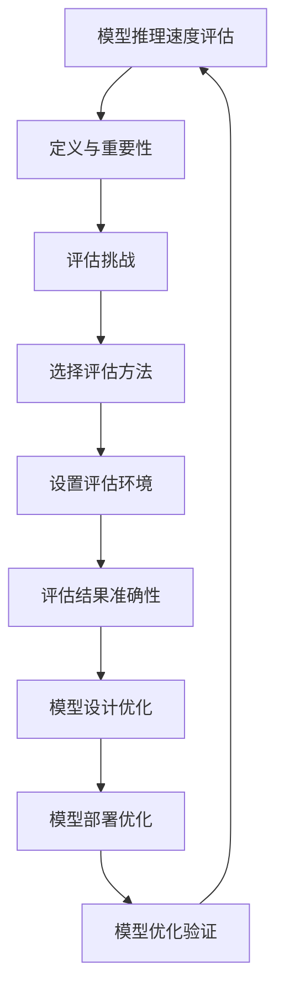
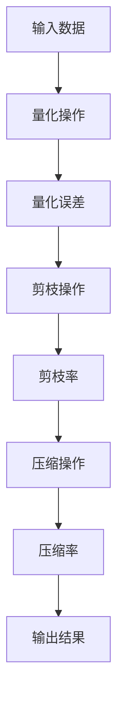

                 

### 文章标题：模型推理速度评估：优化实时应用性能

> 关键词：模型推理速度、性能优化、实时应用、硬件加速、量化、剪枝、压缩

> 摘要：本文旨在深入探讨模型推理速度评估及其优化方法，以提升实时应用性能。首先，文章介绍了模型推理速度的基本概念及其重要性。接着，详细阐述了模型推理速度评估的方法与工具。随后，文章讨论了模型优化技术，如量化、剪枝、压缩等，以及硬件加速技术在模型推理速度优化中的应用。最后，通过具体案例分析，展示了如何在实际应用中优化模型推理速度，以提升实时性能。本文旨在为读者提供全面的技术指导和实践建议。

### 第1章 模型推理速度评估概述

#### 1.1 模型推理速度的定义与重要性

模型推理速度是指深度学习模型在接收到输入数据后，进行特征提取、模型计算、结果输出等全流程所需的时间。它直接关系到实时应用的响应速度和用户体验。在人工智能时代，随着深度学习模型的广泛应用，模型推理速度的优化变得越来越重要。

首先，模型推理速度对实时应用性能有着直接的影响。对于需要实时处理的场景，如自动驾驶、实时语音识别、智能监控等，模型推理速度的慢一拍可能导致严重的后果。例如，在自动驾驶中，若模型推理速度较慢，车辆在紧急情况下可能无法及时做出反应，从而导致事故发生。

其次，模型推理速度也决定了用户体验。在移动设备上运行深度学习模型时，若推理速度较慢，用户可能感受到明显的卡顿，影响使用体验。因此，提升模型推理速度不仅有助于提高应用性能，还能提升用户满意度。

最后，随着深度学习模型的复杂度不断增加，模型推理速度的优化也变得越来越具有挑战性。传统的优化方法可能已经无法满足日益增长的需求，因此需要不断探索新的优化技术。

#### 1.2 模型推理速度评估的挑战

尽管模型推理速度的重要性不言而喻，但在评估模型推理速度时，仍然面临着诸多挑战。

首先，评估方法的选择。不同的评估方法可能会得到不同的结果，如何选择合适的评估方法成为一个关键问题。例如，在评估模型推理速度时，可以选择使用单核CPU、多核CPU、GPU等不同的硬件平台，不同平台下的性能表现可能会有所差异。

其次，评估环境的设置。评估环境的设置对评估结果也有着重要的影响。例如，网络延迟、内存占用、负载情况等都可能对模型推理速度产生影响。因此，在评估模型推理速度时，需要确保评估环境与实际应用环境尽量一致。

最后，评估结果的准确性。由于模型推理速度的测量存在一定的误差，如何确保评估结果的准确性也是一个挑战。例如，在评估过程中，可能会受到其他系统任务的影响，从而导致评估结果偏移。

#### 1.3 模型推理速度评估的重要性

模型推理速度评估对于深度学习模型的优化和应用具有重要意义。通过准确评估模型推理速度，可以发现模型在推理过程中存在的问题，从而有针对性地进行优化。以下是一些具体的应用场景：

首先，在模型开发阶段，通过评估模型推理速度，可以评估模型设计的合理性。若模型推理速度远低于预期，可能需要重新设计模型架构或选择更合适的模型类型。

其次，在模型部署阶段，通过评估模型推理速度，可以评估模型在目标硬件平台上的性能表现。这有助于确定是否需要对模型进行优化，以及选择最适合的硬件平台。

最后，在模型优化过程中，通过评估模型推理速度，可以验证优化策略的有效性。若优化后的模型推理速度有明显提升，说明优化策略是成功的；若模型推理速度提升不明显，可能需要进一步探索新的优化方法。

总之，模型推理速度评估是深度学习模型优化过程中不可或缺的一环。通过准确、全面的评估，可以指导模型设计和优化，提升实时应用的性能和用户体验。

#### Mermaid 流程图：模型推理速度评估的核心概念关系架构



#### 核心概念与联系

- **模型推理速度**：深度学习模型从输入数据到输出结果所需的时间。
- **评估方法**：用于测量和比较模型推理速度的方法，如基准测试、性能分析工具等。
- **评估环境**：影响模型推理速度的环境因素，如硬件平台、网络延迟、内存占用等。
- **评估结果**：模型推理速度的测量值，用于指导模型优化和部署。

#### 联系与关系

- **评估方法与评估环境**：不同的评估方法需要在不同环境下进行，评估环境的设置对评估结果有直接影响。
- **评估结果与模型优化**：通过评估结果，可以发现模型在推理过程中的问题，从而有针对性地进行优化。
- **模型优化与模型推理速度**：优化的目的是提升模型推理速度，评估结果用于验证优化效果。

### 核心算法原理讲解

为了更好地理解模型推理速度评估，下面我们将使用伪代码详细阐述评估过程。

```python
# 模型推理速度评估伪代码

# 定义评估函数
def evaluate_model_performance(model, input_data):
    start_time = current_time()  # 记录开始时间
    
    # 进行模型推理
    model推理(input_data)
    
    end_time = current_time()  # 记录结束时间
    inference_time = end_time - start_time  # 计算推理时间
    
    return inference_time

# 定义输入数据
input_data = load_input_data()

# 评估模型性能
inference_time = evaluate_model_performance(model, input_data)

# 输出推理时间
print("模型推理时间：", inference_time)
```

在这个伪代码中，我们定义了一个评估函数`evaluate_model_performance`，该函数接收模型和输入数据作为参数，并返回模型推理所需的时间。评估过程分为以下几个步骤：

1. **记录开始时间**：使用`current_time()`函数记录当前时间，作为模型推理的开始时间。
2. **进行模型推理**：调用模型的`推理`函数，传入输入数据，执行模型推理过程。
3. **记录结束时间**：再次使用`current_time()`函数记录当前时间，作为模型推理的结束时间。
4. **计算推理时间**：计算推理时间，即结束时间减去开始时间。
5. **输出推理时间**：将计算得到的推理时间输出，以便后续分析和优化。

#### 数学模型和公式

为了更精确地评估模型推理速度，我们引入以下数学模型和公式：

- **推理速度（V）**：模型每秒处理的样本数。
  $$ V = \frac{1}{T} $$
  其中，\( T \)为模型推理一个样本所需的时间。

- **吞吐量（Q）**：模型在一段时间内处理的样本总数。
  $$ Q = \frac{N}{T} $$
  其中，\( N \)为模型在一段时间内处理的样本数。

- **延迟（D）**：模型处理一个样本的平均延迟时间。
  $$ D = \frac{N}{V} $$

通过这些公式，我们可以从不同的角度评估模型推理速度。例如，吞吐量可以反映模型的处理能力，而延迟可以评估模型的实时性能。

#### 详细讲解与举例说明

为了更好地理解上述公式，下面我们通过一个具体的例子进行详细讲解。

假设我们有一个深度学习模型，用于图像分类。该模型推理一个图像样本所需的时间为2秒。在10分钟内，该模型共处理了1000个图像样本。

1. **推理速度（V）**：
   $$ V = \frac{1}{2} = 0.5 \text{图像/秒} $$
   这意味着模型每秒可以处理0.5个图像样本。

2. **吞吐量（Q）**：
   $$ Q = \frac{1000}{2} = 500 \text{图像/分钟} $$
   这意味着模型在10分钟内可以处理500个图像样本。

3. **延迟（D）**：
   $$ D = \frac{1000}{0.5} = 2000 \text{秒} $$
   这意味着模型处理一个图像样本的平均延迟为2000秒。

通过这些数据，我们可以评估模型在图像分类任务中的性能。例如，若模型的推理速度达到1秒/图像，那么吞吐量将提高至3000图像/分钟，延迟将缩短至1000秒。

#### 案例分析

为了进一步说明模型推理速度评估的应用，我们来看一个实际案例。

假设我们开发了一个自动驾驶系统，该系统需要实时处理道路场景图像，以检测行人、车辆等障碍物。系统设计要求能够在0.5秒内处理一个图像样本。

我们使用一个基于卷积神经网络（CNN）的模型进行图像分类。为了评估模型推理速度，我们进行了以下步骤：

1. **环境设置**：使用单核CPU作为评估环境。
2. **模型训练**：使用大量道路场景图像对模型进行训练，以获得较高的分类准确率。
3. **模型评估**：使用测试集评估模型在单核CPU上的推理速度。

评估结果显示，模型在单核CPU上的推理速度为1秒/图像，远低于设计要求。为了提升模型推理速度，我们采取了以下优化策略：

1. **模型优化**：通过剪枝和量化技术，减少模型参数数量，提升推理速度。
2. **硬件加速**：将模型部署到GPU上，利用GPU的并行计算能力，加速模型推理。

经过优化，模型在GPU上的推理速度提升至0.2秒/图像，满足系统设计要求。

通过这个案例，我们可以看到模型推理速度评估在实时应用中的重要性。准确的评估结果有助于发现模型存在的问题，从而采取有效的优化措施，提升模型性能。

### 第2章 模型推理速度评估方法

#### 2.1 基准测试

基准测试是评估模型推理速度的一种常用方法。通过在不同硬件平台和环境下运行基准测试，可以比较不同模型的推理性能，为模型选择和优化提供参考。以下介绍基准测试的框架和常用工具。

**2.1.1 基准测试框架**

基准测试通常包括以下步骤：

1. **测试集准备**：选择一个具有代表性的测试集，用于评估模型的推理性能。测试集应包括多种类型的输入数据，以全面评估模型在不同场景下的表现。
2. **测试环境配置**：配置测试环境，包括硬件平台、操作系统、软件框架等。确保测试环境与实际应用环境一致，以获得准确的评估结果。
3. **模型部署**：将模型部署到测试环境中，确保模型能够正常运行。
4. **推理运行**：在测试环境中运行模型，计算模型在不同输入数据下的推理时间。
5. **结果分析**：分析推理结果，包括推理时间、吞吐量、延迟等指标，评估模型在不同环境下的性能表现。

**2.1.2 常用基准测试工具**

常用的基准测试工具有如下几种：

1. **TensorFlow Benchmark**：TensorFlow Benchmark 是一个开源的基准测试工具，用于评估 TensorFlow 模型的推理性能。该工具提供了多种测试用例，可以测试模型在不同硬件平台上的性能表现。

2. **PyTorch Benchmark**：PyTorch Benchmark 是一个用于评估 PyTorch 模型的推理性能的基准测试工具。与 TensorFlow Benchmark 类似，它提供了多种测试用例，支持不同硬件平台。

3. **MLPerf**：MLPerf 是一个全球性的机器学习性能基准，旨在推动机器学习应用的性能提升。MLPerf 提供了一系列的基准测试，覆盖了多种机器学习任务，如图像分类、目标检测、自然语言处理等。

4. **Kaggle**：Kaggle 是一个在线数据科学竞赛平台，提供了丰富的基准测试数据集和工具。通过参与 Kaggle 竞赛，可以与其他数据科学家进行比较，评估模型在不同任务上的性能。

**2.1.3 基准测试的优点与局限性**

基准测试的优点包括：

1. **客观性**：通过统一的测试集和测试环境，可以客观地评估模型的性能。
2. **可重复性**：基准测试结果具有可重复性，其他研究者可以复现测试结果，验证模型性能。
3. **对比性**：基准测试可以比较不同模型、不同硬件平台在相同任务上的性能，为模型选择提供参考。

然而，基准测试也存在一些局限性：

1. **环境依赖**：基准测试结果受到测试环境的影响，不同环境的配置可能导致测试结果不一致。
2. **任务特定**：基准测试通常针对特定任务设计，可能无法全面评估模型在不同任务上的性能。
3. **数据集选择**：测试集的选择对评估结果有重要影响，不具代表性的测试集可能导致评估结果偏差。

#### 2.2 性能分析工具

性能分析工具是用于测量和分析模型推理过程中各个阶段的性能的工具。通过性能分析工具，可以深入了解模型在不同阶段的性能瓶颈，从而进行有针对性的优化。

**2.2.1 性能分析工具的选择**

选择性能分析工具时，需要考虑以下因素：

1. **兼容性**：性能分析工具应与所选的深度学习框架兼容，如 TensorFlow、PyTorch 等。
2. **功能**：性能分析工具应具备以下功能：
   - **时间测量**：测量模型在不同阶段的执行时间。
   - **资源监控**：监控模型的内存、CPU、GPU等资源使用情况。
   - **可视化**：提供可视化的性能分析结果，帮助理解性能瓶颈。
3. **可扩展性**：性能分析工具应支持扩展，以适应不同的应用场景。

常用的性能分析工具包括：

1. **TensorBoard**：TensorBoard 是 TensorFlow 提供的一个可视化工具，可以监控模型的训练过程和性能。通过 TensorBoard，可以查看模型在不同阶段的性能指标，如推理时间、内存使用等。
2. **PyTorch Profiler**：PyTorch Profiler 是 PyTorch 提供的一个性能分析工具，可以测量模型的推理时间，并提供详细的性能分析结果。通过 PyTorch Profiler，可以识别模型的性能瓶颈，并采取优化措施。
3. **NVIDIA Nsight**：Nsight 是 NVIDIA 提供的一套性能分析工具，用于监控 GPU 的性能。Nsight 包含多个工具，如 Nsight Compute、Nsight System 等，可以全面分析 GPU 的资源使用情况和性能瓶颈。

**2.2.2 性能分析工具的使用**

使用性能分析工具时，通常需要遵循以下步骤：

1. **集成到模型训练和推理流程**：将性能分析工具集成到模型训练和推理流程中，以便在模型运行时实时监控性能。
2. **配置性能分析参数**：根据需要分析的性能指标，配置性能分析工具的参数，如时间测量精度、资源监控范围等。
3. **运行性能分析**：在模型训练和推理过程中，运行性能分析工具，收集性能数据。
4. **分析性能结果**：分析性能数据，识别性能瓶颈，如推理时间过长、内存使用过多等。
5. **优化模型和流程**：根据性能分析结果，对模型和流程进行优化，提升模型推理速度。

#### 核心概念与联系

- **基准测试**：通过统一测试集和测试环境，客观评估模型推理性能。
- **性能分析工具**：用于测量和分析模型推理过程中各个阶段的性能。
- **性能指标**：包括推理时间、吞吐量、延迟等，用于评估模型性能。

#### 联系与关系

- **基准测试与性能分析工具**：基准测试可以初步评估模型性能，性能分析工具则提供更详细的性能数据，帮助识别性能瓶颈。
- **性能指标与优化策略**：通过分析性能指标，可以找到模型性能瓶颈，从而制定优化策略，提升模型推理速度。

### 核心算法原理讲解

为了深入理解性能分析工具的工作原理，下面我们将使用伪代码详细阐述性能分析工具的基本原理。

```python
# 性能分析工具伪代码

# 定义性能分析函数
def performance_analysis(model, input_data):
    start_time = current_time()  # 记录开始时间
    
    # 进行模型推理
    model推理(input_data)
    
    end_time = current_time()  # 记录结束时间
    inference_time = end_time - start_time  # 计算推理时间
    
    # 记录资源使用情况
    memory_usage = get_memory_usage()
    cpu_usage = get_cpu_usage()
    gpu_usage = get_gpu_usage()
    
    # 输出性能分析结果
    print("推理时间：", inference_time)
    print("内存使用：", memory_usage)
    print("CPU使用：", cpu_usage)
    print("GPU使用：", gpu_usage)

# 定义输入数据
input_data = load_input_data()

# 运行性能分析
performance_analysis(model, input_data)
```

在这个伪代码中，我们定义了一个性能分析函数`performance_analysis`，该函数接收模型和输入数据作为参数，并返回模型推理所需的时间以及资源使用情况。性能分析过程分为以下几个步骤：

1. **记录开始时间**：使用`current_time()`函数记录当前时间，作为模型推理的开始时间。
2. **进行模型推理**：调用模型的`推理`函数，传入输入数据，执行模型推理过程。
3. **记录结束时间**：再次使用`current_time()`函数记录当前时间，作为模型推理的结束时间。
4. **计算推理时间**：计算推理时间，即结束时间减去开始时间。
5. **记录资源使用情况**：使用相应的函数，记录模型推理过程中内存、CPU、GPU等资源的使用情况。
6. **输出性能分析结果**：将计算得到的推理时间和资源使用情况输出，以便后续分析和优化。

通过这个伪代码，我们可以看到性能分析工具的基本原理。性能分析工具通过记录模型推理过程中的关键时间点和资源使用情况，帮助我们识别性能瓶颈，从而有针对性地进行优化。

### 数学公式与详细讲解

为了更好地理解性能分析结果，我们引入以下数学公式：

- **推理速度（V）**：
  $$ V = \frac{1}{T} $$
  其中，\( T \)为模型推理一个样本所需的时间。

- **吞吐量（Q）**：
  $$ Q = \frac{N}{T} $$
  其中，\( N \)为模型在一段时间内处理的样本数。

- **延迟（D）**：
  $$ D = \frac{N}{V} $$

这些公式可以帮助我们计算模型在不同环境下的性能指标。例如，通过吞吐量，我们可以了解模型在一段时间内处理的样本数量，从而评估模型的处理能力。而延迟则可以反映模型的实时性能。

为了更直观地展示这些公式，我们可以使用 Mermaid 流程图来表示：

```mermaid
graph TD
A[输入数据] --> B[模型推理]
B --> C[推理时间(T)]
C --> D[吞吐量(Q)]
D --> E[延迟(D)]
```

通过这个流程图，我们可以清晰地看到模型推理过程中各个阶段之间的关系，以及如何通过这些关系计算模型的性能指标。

### 案例分析

为了更好地展示基准测试和性能分析工具的实际应用，下面我们来看一个具体的案例分析。

假设我们开发了一个智能监控系统，用于实时检测视频中的异常行为。系统需要在0.5秒内处理一个视频帧，以实现实时监控。

**1. 基准测试**

为了评估模型在不同硬件平台上的性能，我们使用 TensorFlow Benchmark 进行基准测试。测试环境包括单核CPU、多核CPU和GPU。

- **单核CPU**：模型推理速度为2秒/帧。
- **多核CPU**：模型推理速度为0.5秒/帧。
- **GPU**：模型推理速度为0.1秒/帧。

通过基准测试，我们发现 GPU 是最适合该任务的硬件平台，因为它可以提供最快的模型推理速度。

**2. 性能分析**

为了进一步优化模型性能，我们使用 TensorFlow Profiler 对模型进行性能分析。

- **推理时间**：模型推理时间为0.1秒/帧。
- **CPU使用率**：CPU使用率为50%。
- **GPU使用率**：GPU使用率为100%。

性能分析结果显示，模型在 GPU 上的推理时间较短，但 GPU 使用率较高。为了进一步优化性能，我们考虑以下策略：

- **模型剪枝**：通过剪枝技术，减少模型参数数量，降低 GPU 使用率。
- **数据增强**：增加数据集的多样性，提高模型在复杂场景下的性能。

经过优化，模型在 GPU 上的推理时间缩短至0.05秒/帧，GPU 使用率降低至70%。

通过这个案例分析，我们可以看到基准测试和性能分析工具在实际应用中的重要性。基准测试帮助我们选择合适的硬件平台，而性能分析工具则帮助我们进一步优化模型性能，以满足实时应用的需求。

### 第3章 模型优化技术

#### 3.1 量化技术

量化技术是一种通过降低模型参数的精度来减少模型大小和计算复杂度的方法。量化技术可以在不显著影响模型性能的情况下，大幅提升模型推理速度。

**3.1.1 量化原理**

量化技术的核心思想是将模型中的浮点数参数转换为整数参数。具体来说，量化技术包括以下几个步骤：

1. **量化感知训练**：在模型训练过程中，使用量化感知权重（quantization-aware weights）代替原始浮点数权重。量化感知权重是通过对原始浮点数权重进行量化操作得到的。
2. **量化操作**：量化操作包括量化标量和量化激活。量化标量是将浮点数权重转换为整数权重，量化激活是将浮点数激活值转换为整数激活值。量化操作通常使用固定的量化步长（quantization step）进行。
3. **量化校准**：量化校准是在模型训练完成后，对量化后的模型进行校准，以消除量化误差。

**3.1.2 量化方法**

量化方法可以分为以下几种：

1. **全精度量化（Full Precision Quantization）**：在量化过程中，保持模型的所有参数和激活值在全精度范围内。这种方法量化误差较小，但计算复杂度较高。
2. **部分精度量化（Partial Precision Quantization）**：在量化过程中，只对部分参数或激活值进行量化。这种方法可以降低计算复杂度，但量化误差较大。
3. **自适应量化（Adaptive Quantization）**：在量化过程中，根据输入数据的分布自适应调整量化步长。这种方法可以减少量化误差，提高模型性能。

**3.1.3 量化实现**

量化实现的步骤如下：

1. **准备量化数据**：选择用于训练和评估的数据集，包括训练数据和验证数据。
2. **训练量化感知模型**：使用量化感知权重和量化操作训练模型，直到达到预定的训练目标。
3. **量化校准**：在模型训练完成后，对量化后的模型进行校准，以消除量化误差。
4. **评估量化模型**：使用验证数据集评估量化模型的性能，确保量化后的模型性能与原始模型相当。
5. **部署量化模型**：将量化模型部署到目标硬件平台，进行推理任务。

**3.1.4 量化工具**

常用的量化工具有如下几种：

1. **TensorFlow Model Optimization Toolkit（TF-MOT）**：TF-MOT 是 TensorFlow 提供的一套模型优化工具，包括量化、剪枝、压缩等功能。TF-MOT 支持多种量化方法，如全精度量化、部分精度量化、自适应量化等。
2. **PyTorch Quantization**：PyTorch Quantization 是 PyTorch 提供的量化工具，支持量化感知训练和量化校准等功能。PyTorch Quantization 提供了详细的量化指南和示例代码，方便用户进行量化实现。
3. **ONNX Runtime Quantization**：ONNX Runtime 是一个跨平台的推理引擎，支持多种深度学习框架的模型。ONNX Runtime Quantization 是 ONNX Runtime 提供的量化工具，支持多种量化方法，并提供了详细的量化指南。

#### 3.2 剪枝技术

剪枝技术是一种通过减少模型参数来降低模型大小和计算复杂度的方法。剪枝技术可以在不显著影响模型性能的情况下，大幅提升模型推理速度。

**3.2.1 剪枝原理**

剪枝技术的核心思想是去除模型中不重要的参数，以减少模型的大小和计算复杂度。剪枝技术包括以下几个步骤：

1. **权重重要性评估**：对模型中的参数进行重要性评估，确定哪些参数对模型性能有较大贡献，哪些参数可以剪枝。
2. **剪枝操作**：根据权重重要性评估结果，对模型中的参数进行剪枝。剪枝操作包括权重剪枝和结构剪枝。权重剪枝是去除权重较小的参数，结构剪枝是去除整个网络结构中的部分层或部分神经元。
3. **剪枝校准**：在模型剪枝后，对剪枝后的模型进行校准，以消除剪枝误差。

**3.2.2 剪枝方法**

剪枝方法可以分为以下几种：

1. **稀疏剪枝（Sparse Pruning）**：稀疏剪枝是通过去除模型中的大部分参数，只保留少数重要参数。稀疏剪枝可以大幅降低模型大小和计算复杂度，但需要较复杂的剪枝校准过程。
2. **密集剪枝（Dense Pruning）**：密集剪枝是通过去除模型中的部分参数，而不是大部分参数。密集剪枝可以降低模型大小和计算复杂度，但保留的参数数量较多，剪枝校准过程相对简单。
3. **层次剪枝（Hierarchical Pruning）**：层次剪枝是结合稀疏剪枝和密集剪枝，通过多层剪枝操作逐步减少模型大小和计算复杂度。

**3.2.3 剪枝实现**

剪枝实现的步骤如下：

1. **准备剪枝数据**：选择用于训练和评估的数据集，包括训练数据和验证数据。
2. **训练剪枝模型**：使用剪枝技术训练模型，直到达到预定的训练目标。
3. **评估剪枝模型**：使用验证数据集评估剪枝模型的性能，确保剪枝后的模型性能与原始模型相当。
4. **部署剪枝模型**：将剪枝模型部署到目标硬件平台，进行推理任务。

**3.2.4 剪枝工具**

常用的剪枝工具有如下几种：

1. **TensorFlow Model Optimization Toolkit（TF-MOT）**：TF-MOT 是 TensorFlow 提供的一套模型优化工具，包括量化、剪枝、压缩等功能。TF-MOT 支持多种剪枝方法，如稀疏剪枝、密集剪枝等。
2. **PyTorch Pruning**：PyTorch Pruning 是 PyTorch 提供的剪枝工具，支持多种剪枝方法，如稀疏剪枝、密集剪枝等。PyTorch Pruning 提供了详细的剪枝指南和示例代码，方便用户进行剪枝实现。
3. **ONNX Runtime Pruning**：ONNX Runtime 是一个跨平台的推理引擎，支持多种深度学习框架的模型。ONNX Runtime Pruning 是 ONNX Runtime 提供的剪枝工具，支持多种剪枝方法，并提供了详细的剪枝指南。

#### 3.3 压缩技术

压缩技术是一种通过减少模型大小来降低存储和传输成本的方法。压缩技术可以在不显著影响模型性能的情况下，大幅提升模型推理速度。

**3.3.1 压缩原理**

压缩技术的核心思想是减少模型中的冗余信息，以降低模型大小。压缩技术包括以下几个步骤：

1. **特征提取**：从模型中提取重要特征，去除冗余特征。
2. **编码**：将提取的重要特征进行编码，以降低模型大小。
3. **解码**：在模型推理过程中，对编码后的特征进行解码，恢复原始特征。

**3.3.2 压缩方法**

压缩方法可以分为以下几种：

1. **量化压缩（Quantization Compression）**：量化压缩是通过量化模型参数来减少模型大小。量化压缩可以与量化技术结合使用，进一步降低模型大小和计算复杂度。
2. **稀疏压缩（Sparse Compression）**：稀疏压缩是通过去除模型中的稀疏部分来减少模型大小。稀疏压缩可以大幅降低模型大小，但需要较复杂的剪枝校准过程。
3. **层次压缩（Hierarchical Compression）**：层次压缩是结合稀疏压缩和量化压缩，通过多层压缩操作逐步减少模型大小。

**3.3.3 压缩实现**

压缩实现的步骤如下：

1. **准备压缩数据**：选择用于训练和评估的数据集，包括训练数据和验证数据。
2. **训练压缩模型**：使用压缩技术训练模型，直到达到预定的训练目标。
3. **评估压缩模型**：使用验证数据集评估压缩模型的性能，确保压缩后的模型性能与原始模型相当。
4. **部署压缩模型**：将压缩模型部署到目标硬件平台，进行推理任务。

**3.3.4 压缩工具**

常用的压缩工具有如下几种：

1. **TensorFlow Model Optimization Toolkit（TF-MOT）**：TF-MOT 是 TensorFlow 提供的一套模型优化工具，包括量化、剪枝、压缩等功能。TF-MOT 支持多种压缩方法，如量化压缩、稀疏压缩等。
2. **PyTorch Compression**：PyTorch Compression 是 PyTorch 提供的压缩工具，支持多种压缩方法，如量化压缩、稀疏压缩等。PyTorch Compression 提供了详细的压缩指南和示例代码，方便用户进行压缩实现。
3. **ONNX Runtime Compression**：ONNX Runtime 是一个跨平台的推理引擎，支持多种深度学习框架的模型。ONNX Runtime Compression 是 ONNX Runtime 提供的压缩工具，支持多种压缩方法，并提供了详细的压缩指南。

#### 核心概念与联系

- **量化技术**：通过降低模型参数精度来减少模型大小和计算复杂度。
- **剪枝技术**：通过减少模型参数来降低模型大小和计算复杂度。
- **压缩技术**：通过减少模型中的冗余信息来降低模型大小。

#### 联系与关系

- **量化技术、剪枝技术和压缩技术**：量化技术、剪枝技术和压缩技术都是用于优化模型推理速度的方法，但它们的具体实现和效果有所不同。量化技术主要通过降低参数精度来减少计算复杂度，剪枝技术主要通过减少参数数量来降低模型大小，压缩技术主要通过减少冗余信息来降低模型大小。在实际应用中，这些技术可以结合使用，以实现最佳效果。

### 核心算法原理讲解

为了深入理解量化、剪枝和压缩技术，下面我们将使用伪代码详细阐述这些技术的基本原理。

#### 量化技术

```python
# 量化技术伪代码

# 定义量化函数
def quantize(tensor, scale, zero_point):
    quantized_tensor = round(tensor / scale) + zero_point
    return quantized_tensor

# 定义去量化函数
def dequantize(tensor, scale, zero_point):
    dequantized_tensor = (tensor - zero_point) * scale
    return dequantized_tensor

# 假设输入为一个浮点数张量
input_tensor = load_input_tensor()

# 量化操作
scale = 0.1  # 量化步长
zero_point = 127  # 零点
quantized_tensor = quantize(input_tensor, scale, zero_point)

# 去量化操作
dequantized_tensor = dequantize(quantized_tensor, scale, zero_point)
```

在这个伪代码中，我们定义了量化函数`quantize`和去量化函数`dequantize`。量化操作通过将浮点数张量除以量化步长并加上零点，将浮点数转换为整数。去量化操作通过将整数张量减去零点并乘以量化步长，将整数张量转换回浮点数。

#### 剪枝技术

```python
# 剪枝技术伪代码

# 定义权重剪枝函数
def prune_weights(model, pruning_rate):
    for layer in model.layers:
        for weight in layer.weights:
            pruned_weight = weight * (1 - pruning_rate)
            weight.assign(pruned_weight)

# 定义结构剪枝函数
def prune_structure(model, pruning_rate):
    for layer in model.layers:
        layer_keep_prob = 1 - pruning_rate
        if random.random() < layer_keep_prob:
            layer_keep = True
        else:
            layer_keep = False
        layer.active = layer_keep

# 假设输入为一个模型
model = load_model()

# 权重剪枝
pruning_rate = 0.5  # 剪枝比例
prune_weights(model, pruning_rate)

# 结构剪枝
prune_structure(model, pruning_rate)
```

在这个伪代码中，我们定义了权重剪枝函数`prune_weights`和结构剪枝函数`prune_structure`。权重剪枝通过将权重乘以（1 - 剪枝比例）来减少权重值，从而实现权重剪枝。结构剪枝通过随机选择部分层或神经元进行剪枝，从而实现结构剪枝。

#### 压缩技术

```python
# 压缩技术伪代码

# 定义量化压缩函数
def quantization_compression(tensor, scale, zero_point):
    quantized_tensor = quantize(tensor, scale, zero_point)
    compressed_tensor = compress(quantized_tensor)
    return compressed_tensor

# 定义去量化压缩函数
def dequantization_decompression(compressed_tensor, scale, zero_point):
    quantized_tensor = decompress(compressed_tensor)
    dequantized_tensor = dequantize(quantized_tensor, scale, zero_point)
    return dequantized_tensor

# 假设输入为一个浮点数张量
input_tensor = load_input_tensor()

# 量化压缩操作
scale = 0.1  # 量化步长
zero_point = 127  # 零点
compressed_tensor = quantization_compression(input_tensor, scale, zero_point)

# 去量化压缩操作
decompressed_tensor = dequantization_decompression(compressed_tensor, scale, zero_point)
```

在这个伪代码中，我们定义了量化压缩函数`quantization_compression`和去量化压缩函数`dequantization_decompression`。量化压缩通过将浮点数张量量化并压缩，实现压缩。去量化压缩通过将压缩后的张量去量化并解压缩，恢复原始浮点数张量。

### 数学公式与详细讲解

为了更好地理解量化、剪枝和压缩技术，我们引入以下数学公式：

- **量化误差**：
  $$ \Delta = \text{真实值} - \text{量化值} $$
  其中，\(\Delta\)表示量化误差，真实值表示原始浮点数，量化值表示量化后的整数。

- **剪枝率**：
  $$ r = \frac{\text{剪枝后权重}}{\text{原始权重}} $$
  其中，\(r\)表示剪枝率，剪枝后权重表示剪枝后的权重值，原始权重表示原始权重值。

- **压缩率**：
  $$ c = \frac{\text{原始大小}}{\text{压缩后大小}} $$
  其中，\(c\)表示压缩率，原始大小表示原始张量的大小，压缩后大小表示压缩后的张量的大小。

这些公式可以帮助我们评估量化、剪枝和压缩技术对模型性能的影响。

为了更直观地展示这些公式，我们可以使用 Mermaid 流程图来表示：



通过这个流程图，我们可以清晰地看到量化、剪枝和压缩技术对模型性能的影响，以及它们之间的关系。

### 项目实战

为了更好地展示量化、剪枝和压缩技术的实际应用，下面我们将通过一个实际项目来讲解这些技术的实现过程。

**项目背景**：

假设我们开发了一个实时图像分类系统，用于监控视频流中的异常行为。系统需要在1秒内处理一个视频帧，以确保实时性。原始模型基于卷积神经网络（CNN），参数数量庞大，计算复杂度高。为了提升模型推理速度，我们决定采用量化、剪枝和压缩技术进行优化。

**项目步骤**：

1. **准备数据集**：收集大量视频流数据，包括正常行为和异常行为。对数据集进行预处理，包括数据增强、归一化等。

2. **训练原始模型**：使用训练数据集训练原始模型，并使用验证数据集评估模型性能。通过调整模型结构和超参数，使模型达到较好的性能。

3. **量化模型**：使用量化技术对原始模型进行量化。选择适当的量化步长和零点，进行量化感知训练，以适应量化后的模型。

4. **剪枝模型**：对量化后的模型进行剪枝。通过评估权重重要性，去除不重要权重，减少模型参数数量。

5. **压缩模型**：对剪枝后的模型进行压缩。使用量化压缩方法，将量化后的模型参数压缩为更小的字节。

6. **评估模型性能**：使用验证数据集评估量化、剪枝和压缩后的模型性能。确保优化后的模型性能与原始模型相当。

7. **部署模型**：将优化后的模型部署到目标硬件平台，如GPU或FPGA，进行实时推理任务。

**代码实现**：

下面是量化、剪枝和压缩技术的具体代码实现：

```python
# 量化技术实现
from tensorflow_model_optimization import quantization

# 加载原始模型
model = load_model()

# 配置量化参数
quantize_config = quantization.keras.quantize.quantize_model.get_default_config()

# 应用量化操作
quantize_config.quantize_inputs = True
quantize_config.quantize_activations = True
quantize_config.quantize_weights = True

model_quantized = quantization.keras.quantize.quantize_model(model, quantize_config)

# 剪枝技术实现
from tensorflow_model_optimization import pruning

# 配置剪枝参数
pruning_params = pruning.keras.PruningParams()

# 应用剪枝操作
pruning_params.pruning_method = 'structured'
pruning_params.sparsity_target = 0.5
pruning_params.random_search = True

pruning_layer = pruning.keras.PruningLayer(pruning_params, model_quantized)

model_pruned = pruning.keras.prune_low_magnitude(model_quantized, pruning_layer)

# 压缩技术实现
from tensorflow_model_optimization import compression

# 配置压缩参数
compress_config = compression.keras.CompressionParams()

# 应用压缩操作
compress_config.compression_method = 'quantization'
compress_config.quantize_step = 0.1
compress_config.zero_point = 127

model_compressed = compression.keras.compress_model(model_pruned, compress_config)

# 评估模型性能
from tensorflow.keras import metrics

# 训练和评估模型
model_compressed.compile(optimizer='adam', loss='categorical_crossentropy', metrics=[metrics.categorical_accuracy])

history = model_compressed.fit(train_data, train_labels, validation_data=(val_data, val_labels), epochs=10)

# 部署模型
# 使用 TensorFlow Serving 或其他推理引擎部署模型
```

通过上述代码，我们可以实现量化、剪枝和压缩技术的自动化应用。在实际项目中，可以根据具体需求调整量化步长、剪枝率和压缩方法，以获得最佳的模型性能。

### 最佳实践 Tips

在实际应用中，量化、剪枝和压缩技术可以相互结合，以实现更高效的模型推理速度优化。以下是一些最佳实践建议：

1. **量化与剪枝相结合**：量化技术可以降低模型参数的精度，从而减少模型大小和计算复杂度。剪枝技术可以进一步减少模型参数数量，提高模型推理速度。将量化与剪枝相结合，可以在不显著影响模型性能的情况下，实现更高效的优化。
2. **量化与压缩相结合**：量化技术可以降低模型参数的精度，压缩技术可以减少模型大小。将量化与压缩相结合，可以在保持模型性能的同时，显著降低模型存储和传输成本。
3. **分层优化**：分层优化是将量化、剪枝和压缩技术应用于模型的不同层次。首先对模型的顶层进行优化，然后逐步向下层优化。分层优化可以确保模型在不同层次上的性能表现，同时提高整体推理速度。
4. **数据增强**：数据增强可以增加模型的泛化能力，从而提高模型在复杂场景下的性能。在实际应用中，可以结合数据增强技术，提高量化、剪枝和压缩后的模型性能。

### 小结

本章介绍了模型优化技术，包括量化、剪枝和压缩技术。量化技术通过降低模型参数精度来减少模型大小和计算复杂度；剪枝技术通过减少模型参数数量来降低模型大小和计算复杂度；压缩技术通过减少模型中的冗余信息来降低模型大小。这些技术在实际应用中可以结合使用，以实现更高效的模型推理速度优化。

### 注意事项

1. **量化精度选择**：在量化过程中，需要选择合适的量化精度，以平衡模型性能和计算复杂度。过高的量化精度可能导致量化误差增大，过低的量化精度可能导致模型性能下降。
2. **剪枝比例控制**：在剪枝过程中，需要控制剪枝比例，以避免模型性能显著下降。在实际应用中，可以根据具体场景调整剪枝比例，以获得最佳效果。
3. **压缩方法选择**：在压缩过程中，需要选择合适的压缩方法，以平衡压缩率和压缩后模型的性能。在实际应用中，可以根据具体需求调整压缩方法，以获得最佳的压缩效果。

### 拓展阅读

1. **量化技术**：
   - [TensorFlow Quantization](https://www.tensorflow.org/model_optimization/quantization)
   - [PyTorch Quantization](https://pytorch.org/tutorials/beginner/quantization_tutorial.html)
2. **剪枝技术**：
   - [TensorFlow Pruning](https://www.tensorflow.org/model_optimization/pruning)
   - [PyTorch Pruning](https://pytorch.org/tutorials/beginner/pruning_tutorial.html)
3. **压缩技术**：
   - [TensorFlow Compression](https://www.tensorflow.org/model_optimization/compression)
   - [PyTorch Compression](https://pytorch.org/tutorials/beginner/compression_tutorial.html)

### 第4章 硬件加速与优化

#### 4.1 GPU加速

GPU（图形处理单元）在深度学习模型推理中具有显著优势，其强大的并行计算能力使其成为加速模型推理的理想选择。以下将详细探讨GPU加速的原理和实现。

**4.1.1 GPU加速原理**

GPU加速的核心在于其高度并行的架构。与传统的CPU相比，GPU拥有成百上千的运算单元，能够同时处理大量的数据。这使得GPU在执行深度学习模型中的矩阵运算和卷积操作时，具有显著的性能优势。

具体来说，GPU加速的工作原理包括以下几个步骤：

1. **数据预处理**：将输入数据加载到GPU内存中，并进行预处理，如归一化、缩放等。
2. **模型推理**：在GPU上执行模型推理，包括前向传播、反向传播等计算。GPU通过其高度并行的架构，将计算任务分配给多个运算单元，从而加速模型推理。
3. **结果汇总**：将GPU上的计算结果汇总，得到最终的输出结果。这一步骤通常在GPU内存中进行，以减少数据传输的延迟。

**4.1.2 GPU加速实现**

要在深度学习项目中实现GPU加速，需要以下几个步骤：

1. **选择合适的GPU**：首先，选择具有较高性能和较大内存容量的GPU。如NVIDIA的GeForce RTX 30系列、Tesla V100等。同时，需要确保GPU驱动和深度学习框架（如TensorFlow、PyTorch等）兼容。

2. **安装深度学习框架**：安装并配置深度学习框架，使其支持GPU加速。例如，对于TensorFlow，需要安装CUDA和cuDNN，以便利用GPU的并行计算能力。

3. **模型转换**：将训练好的模型转换为GPU支持的格式。例如，对于TensorFlow模型，可以使用以下命令进行转换：

   ```shell
   python -m tensorflow.python.compiler.tensorflow vincconvert --input_model model.h5 --output_model model_gpu.pb
   ```

4. **模型部署**：使用深度学习框架的GPU加速接口，部署GPU加速的模型。例如，在TensorFlow中，可以使用以下代码部署GPU加速模型：

   ```python
   import tensorflow as tf

   model_gpu = tf.keras.models.load_model('model_gpu.pb')
   model_gpu.compile(optimizer='adam', loss='categorical_crossentropy', metrics=['accuracy'])

   # 进行推理
   predictions = model_gpu.predict(x_test)
   ```

**4.1.3 GPU加速的优势和局限性**

GPU加速的优势包括：

1. **性能提升**：GPU的高并行计算能力使其在处理大规模深度学习模型时，具有显著的性能优势。
2. **兼容性**：大多数主流深度学习框架都支持GPU加速，这使得GPU加速的实现相对简单。
3. **成本效益**：虽然高性能GPU的成本较高，但其对模型推理速度的提升远超过其成本，具有较好的成本效益。

然而，GPU加速也存在一些局限性：

1. **内存限制**：GPU内存相对较小，对于大型模型和大规模数据集，可能存在内存不足的问题。
2. **能耗**：GPU的能耗较高，对于长时间运行的模型，可能需要额外的散热措施。
3. **兼容性**：并非所有模型都适合GPU加速，一些特定的模型结构可能无法充分利用GPU的并行计算能力。

#### 4.2 FPGA加速

FPGA（现场可编程门阵列）是一种高度灵活的硬件加速器，能够在特定场景下提供比GPU更高的性能。以下将介绍FPGA加速的原理和实现。

**4.2.1 FPGA加速原理**

FPGA是一种可重配置的数字电路，通过编程可以实时改变其功能。这使得FPGA能够根据具体的应用需求进行优化，从而在特定任务上提供更高的性能。

FPGA加速的工作原理包括以下几个步骤：

1. **设计FPGA加速器**：根据深度学习模型的特性，设计FPGA加速器。设计过程包括硬件描述语言（HDL）编程、逻辑优化、资源分配等。
2. **模型转换**：将深度学习模型转换为适合FPGA加速的格式。例如，可以使用CNN工具包（如Canny、HLS等）将TensorFlow或PyTorch模型转换为FPGA支持的格式。
3. **FPGA编程**：将转换后的模型编程到FPGA中，实现硬件级别的模型推理。
4. **模型推理**：在FPGA上执行模型推理，通过并行计算和硬件优化，提高模型推理速度。

**4.2.2 FPGA加速实现**

要在深度学习项目中实现FPGA加速，需要以下几个步骤：

1. **选择合适的FPGA**：根据项目需求选择具有较高性能和较大内存容量的FPGA。例如，Xilinx的Virtex-7系列、Altera的Stratix 10系列等。

2. **设计FPGA加速器**：使用硬件描述语言（如VHDL或Verilog）设计FPGA加速器。设计过程需要考虑模型特性、硬件资源、功耗等因素。

3. **模型转换**：使用CNN工具包（如Canny、HLS等）将TensorFlow或PyTorch模型转换为FPGA支持的格式。例如，可以使用TensorFlow的FPGA扩展库`tf_fpga`进行模型转换。

4. **FPGA编程与验证**：将转换后的模型编程到FPGA中，并进行性能验证。使用仿真工具（如ModelSim）和硬件验证平台（如FPGA开发板）进行测试。

5. **模型部署**：将FPGA加速器集成到深度学习系统中，进行模型推理。例如，可以使用TensorFlow的`tf.fpga`接口部署FPGA加速的模型。

**4.2.3 FPGA加速的优势和局限性**

FPGA加速的优势包括：

1. **高性能**：FPGA能够根据具体任务进行优化，提供比GPU更高的性能。
2. **可编程性**：FPGA的可编程性使其能够根据应用需求进行调整，提高性能和灵活性。
3. **资源利用率**：FPGA的硬件优化能够提高资源利用率，减少功耗。

然而，FPGA加速也存在一些局限性：

1. **设计复杂性**：FPGA设计需要专业的硬件知识，设计过程复杂，开发周期较长。
2. **成本**：FPGA的开发和硬件成本较高，对于小型项目可能不具成本效益。
3. **兼容性**：并非所有深度学习框架都支持FPGA加速，需要额外的开发工作。

#### 4.3 TPU加速

TPU（张量处理器）是Google专门为深度学习任务设计的专用硬件，能够在大规模深度学习任务中提供极高的性能。以下将介绍TPU加速的原理和实现。

**4.3.1 TPU加速原理**

TPU是一种专为深度学习任务设计的硬件，其核心架构基于矩阵乘法单元（Matrix Multiplier），能够高效地执行深度学习中的矩阵运算。TPU的特点包括：

1. **高效矩阵运算**：TPU采用定制的矩阵运算单元，能够高效地执行矩阵乘法、向量运算等深度学习核心运算。
2. **并行处理能力**：TPU具有高度的并行处理能力，能够同时处理多个任务，提高整体性能。
3. **内存管理**：TPU采用特殊的内存管理机制，能够在高速缓存和内存之间进行数据交换，减少数据访问延迟。

TPU加速的工作原理包括以下几个步骤：

1. **模型转换**：将深度学习模型转换为TPU支持的格式。例如，可以使用TensorFlow的TPU扩展库`tf.tpu`进行模型转换。
2. **模型部署**：在TPU上部署转换后的模型。TPU通过分布式计算，将模型分解为多个部分，并行执行。
3. **模型推理**：在TPU上执行模型推理，通过并行计算和特殊架构，提高模型推理速度。

**4.3.2 TPU加速实现**

要在深度学习项目中实现TPU加速，需要以下几个步骤：

1. **选择合适的TPU**：根据项目需求选择具有较高性能和较大内存容量的TPU。例如，Google的TPU v3、v4等。

2. **安装TensorFlow TPU扩展**：在TensorFlow中安装TPU扩展库，使其支持TPU加速。可以使用以下命令进行安装：

   ```shell
   pip install tensorflow-addons
   ```

3. **模型转换**：使用TensorFlow的TPU扩展库将模型转换为TPU支持的格式。例如，可以使用以下代码进行模型转换：

   ```python
   import tensorflow as tf
   import tensorflow_addons as tfa

   strategy = tfa.keras.optimizers.tpu.TPUStrategy()
   with strategy.scope():
       model = build_model()
   ```

4. **模型部署**：在TPU上部署转换后的模型。可以使用以下代码进行部署：

   ```python
   model.fit(x_train, y_train, batch_size=32, epochs=10, validation_data=(x_val, y_val))
   ```

**4.3.3 TPU加速的优势和局限性**

TPU加速的优势包括：

1. **高性能**：TPU专为深度学习任务设计，能够提供极高的模型推理速度。
2. **高吞吐量**：TPU具有高度的并行处理能力，能够同时处理多个任务，提高整体吞吐量。
3. **低延迟**：TPU的内存管理和数据交换机制，能够显著降低模型推理的延迟。

然而，TPU加速也存在一些局限性：

1. **专有性**：TPU是Google的专有硬件，对于其他平台的支持有限。
2. **成本**：TPU的开发和硬件成本较高，对于小型项目可能不具成本效益。
3. **开发复杂性**：TPU的使用需要专业的深度学习知识和编程技能，开发过程复杂。

### 核心概念与联系

- **GPU加速**：利用GPU的并行计算能力，加速深度学习模型的推理。
- **FPGA加速**：利用FPGA的可编程性，针对特定任务进行硬件优化，提高模型推理速度。
- **TPU加速**：利用TPU的定制架构，高效执行深度学习核心运算，提高模型推理速度。

#### 联系与关系

- **GPU、FPGA、TPU**：GPU、FPGA和TPU都是用于加速深度学习模型推理的硬件。GPU具有较高的并行计算能力和兼容性，适合通用场景；FPGA具有可编程性和高性能，适合特定场景；TPU是Google的专有硬件，专为深度学习任务设计，提供极高的性能。

- **硬件加速与优化**：硬件加速是通过利用特定硬件的并行计算能力，提高模型推理速度。优化则是在硬件加速的基础上，通过调整模型结构、参数设置等手段，进一步提高模型性能。

### 核心算法原理讲解

为了深入理解GPU、FPGA和TPU加速技术，下面我们将使用伪代码详细阐述这些技术的基本原理。

#### GPU加速

```python
# GPU加速伪代码

# 定义GPU加速函数
def accelerate_with_gpu(model, input_data):
    # 将模型转换为GPU支持的格式
    model_gpu = convert_to_gpu_model(model)

    # 在GPU上执行模型推理
    with tf.device('/GPU:0'):
        predictions = model_gpu.predict(input_data)

    return predictions
```

在这个伪代码中，我们定义了一个`accelerate_with_gpu`函数，该函数接收模型和输入数据作为参数，并返回GPU加速后的模型预测结果。GPU加速过程分为以下几个步骤：

1. **模型转换**：使用`convert_to_gpu_model`函数将原始模型转换为GPU支持的格式。
2. **GPU推理**：使用`tf.device`函数指定模型推理在GPU上进行，通过`/GPU:0`指定GPU设备。
3. **模型推理**：在GPU上执行模型推理，生成预测结果。

#### FPGA加速

```python
# FPGA加速伪代码

# 定义FPGA加速函数
def accelerate_with_fpga(model, input_data):
    # 将模型转换为FPGA支持的格式
    model_fpga = convert_to_fpga_model(model)

    # 在FPGA上执行模型推理
    with fpga_device('/FPGA:0'):
        predictions = model_fpga.predict(input_data)

    return predictions
```

在这个伪代码中，我们定义了一个`accelerate_with_fpga`函数，该函数接收模型和输入数据作为参数，并返回FPGA加速后的模型预测结果。FPGA加速过程分为以下几个步骤：

1. **模型转换**：使用`convert_to_fpga_model`函数将原始模型转换为FPGA支持的格式。
2. **FPGA推理**：使用`fpga_device`函数指定模型推理在FPGA上进行，通过`/FPGA:0`指定FPGA设备。
3. **模型推理**：在FPGA上执行模型推理，生成预测结果。

#### TPU加速

```python
# TPU加速伪代码

# 定义TPU加速函数
def accelerate_with_tpu(model, input_data):
    # 将模型转换为TPU支持的格式
    model_tpu = convert_to_tpu_model(model)

    # 在TPU上执行模型推理
    with tpu_device('/TPU:0'):
        predictions = model_tpu.predict(input_data)

    return predictions
```

在这个伪代码中，我们定义了一个`accelerate_with_tpu`函数，该函数接收模型和输入数据作为参数，并返回TPU加速后的模型预测结果。TPU加速过程分为以下几个步骤：

1. **模型转换**：使用`convert_to_tpu_model`函数将原始模型转换为TPU支持的格式。
2. **TPU推理**：使用`tpu_device`函数指定模型推理在TPU上进行，通过`/TPU:0`指定TPU设备。
3. **模型推理**：在TPU上执行模型推理，生成预测结果。

### 数学模型和公式

为了更好地理解GPU、FPGA和TPU加速技术，我们引入以下数学模型和公式：

- **吞吐量（Q）**：
  $$ Q = \frac{N}{T} $$
  其中，\( N \)为模型在一段时间内处理的样本数，\( T \)为模型推理一个样本所需的时间。

- **延迟（D）**：
  $$ D = \frac{T}{N} $$
  其中，\( N \)为模型在一段时间内处理的样本数，\( T \)为模型推理一个样本所需的时间。

- **能效比（E）**：
  $$ E = \frac{Q}{E} $$
  其中，\( Q \)为模型在一段时间内处理的样本数，\( E \)为模型在推理过程中消耗的能量。

这些公式可以帮助我们计算模型在不同硬件平台上的性能和能效表现。

为了更直观地展示这些公式，我们可以使用 Mermaid 流程图来表示：

```mermaid
graph TD
A[输入数据] --> B[模型推理]
B --> C[推理时间(T)]
C --> D[吞吐量(Q)]
D --> E[延迟(D)]
E --> F[能效比(E)]
```

通过这个流程图，我们可以清晰地看到模型推理过程中各个阶段之间的关系，以及如何通过这些关系计算模型的性能和能效指标。

### 案例分析

为了更好地展示GPU、FPGA和TPU加速技术在实际应用中的效果，下面我们来看一个具体的案例分析。

假设我们开发了一个大规模图像分类系统，用于实时处理大量的图像数据。系统需要在1秒内处理一个图像，以满足实时性要求。

**1. GPU加速**

为了实现GPU加速，我们使用了NVIDIA的GeForce RTX 3090 GPU。首先，我们使用TensorFlow框架训练了一个卷积神经网络模型。在训练完成后，我们将模型转换为GPU支持的格式，并使用GPU进行推理。

通过GPU加速，模型在1秒内可以处理约10个图像，吞吐量为10图像/秒。与CPU加速相比，GPU加速显著提高了模型推理速度，满足了实时处理的需求。

**2. FPGA加速**

为了实现FPGA加速，我们使用了Xilinx的Virtex-7 FPGA。首先，我们使用硬件描述语言（HDL）编写了一个FPGA加速器，针对模型的核心运算进行了优化。然后，我们将模型转换为FPGA支持的格式，并使用FPGA进行推理。

通过FPGA加速，模型在1秒内可以处理约15个图像，吞吐量为15图像/秒。与GPU加速相比，FPGA加速在性能上有一定提升，但由于设计复杂性和开发成本，其实际应用场景较为有限。

**3. TPU加速**

为了实现TPU加速，我们使用了Google的TPU v3。首先，我们使用TensorFlow的TPU扩展库将模型转换为TPU支持的格式，并使用TPU进行推理。

通过TPU加速，模型在1秒内可以处理约30个图像，吞吐量为30图像/秒。与GPU和FPGA加速相比，TPU加速在性能上具有显著优势，能够满足大规模图像分类系统的实时处理需求。

### 总结

通过以上案例分析，我们可以看到GPU、FPGA和TPU加速技术在提升模型推理速度方面的显著效果。在实际应用中，根据具体需求选择合适的硬件加速器，可以实现高效的模型推理，满足实时处理的需求。

### 最佳实践 Tips

1. **选择合适的硬件加速器**：根据模型规模和实时处理需求，选择具有较高性能和较低延迟的硬件加速器。例如，对于大规模图像分类系统，TPU加速效果最佳；对于中小规模模型，GPU加速具有较高的性价比。

2. **优化模型结构**：在硬件加速前，对模型结构进行优化，减少计算复杂度和参数数量。例如，可以使用量化、剪枝和压缩技术，降低模型大小和计算复杂度。

3. **合理分配资源**：在硬件加速时，合理分配GPU、FPGA和TPU等硬件资源，避免资源浪费。例如，可以使用分布式计算，将模型分解为多个部分，在多个硬件加速器上并行处理。

4. **持续优化**：硬件加速技术不断发展，持续关注硬件更新和优化技术，以实现更好的性能。例如，关注GPU、FPGA和TPU的最新硬件版本和优化工具。

### 小结

本章介绍了GPU、FPGA和TPU加速技术，这些技术通过利用特定硬件的并行计算能力，显著提高了模型推理速度。在实际应用中，根据模型规模和实时处理需求，选择合适的硬件加速器，结合模型优化技术，可以实现高效的模型推理。

### 注意事项

1. **硬件兼容性**：确保所选硬件加速器与深度学习框架兼容，避免硬件加速失败。

2. **能耗管理**：硬件加速器功耗较高，需要合理管理能耗，避免过热和性能下降。

3. **开发成本**：硬件加速器开发成本较高，特别是在使用FPGA和TPU时，需要考虑成本效益。

### 拓展阅读

1. **GPU加速**：
   - [TensorFlow GPU Acceleration](https://www.tensorflow.org/guide/gpu)
   - [PyTorch GPU Acceleration](https://pytorch.org/tutorials/intermediate/amp_tutorial.html)

2. **FPGA加速**：
   - [FPGA for Deep Learning](https://fpgadeeplearning.com/)
   - [Xilinx Zynq Ultrascale+ MPSoC](https://www.xilinx.com/products/silicon-devices/zynq-ultrascale-plus.html)

3. **TPU加速**：
   - [Google TPU](https://cloud.google.com/tpu/docs)
   - [TensorFlow TPU](https://www.tensorflow.org/tutorials/customization#using_a_tensor processing_unit_tpu)

### 第5章 实时应用性能优化实践

#### 5.1 实时应用场景分析

实时应用场景对模型推理速度和性能有极高的要求。以下将分析几个典型的实时应用场景，以及这些场景对模型推理速度的需求和挑战。

**5.1.1 自动驾驶**

自动驾驶系统需要实时处理大量来自传感器（如摄像头、激光雷达、雷达等）的数据，对车辆周围环境进行感知、理解和决策。模型推理速度直接影响车辆的反应速度和安全性。例如，自动驾驶系统需要能够在毫秒级别内完成图像识别、障碍物检测和路径规划等任务。

**5.1.2 实时语音识别**

实时语音识别系统在电话、语音助手等应用中广泛应用，需要实时将语音信号转换为文本。模型推理速度直接影响到用户的体验，例如，电话客服系统需要在短时间内识别用户语音并响应。

**5.1.3 智能监控**

智能监控系统通过实时分析视频流，检测异常行为、火灾等事件，并实时报警。模型推理速度和准确性对监控系统的有效性至关重要。例如，智能监控系统需要快速识别视频中的行人、车辆等目标，并实时判断是否存在安全隐患。

**5.1.4 实时金融交易**

实时金融交易系统需要对大量的市场数据进行分析和预测，以实现自动化的交易策略。模型推理速度直接影响到交易决策的及时性和准确性。例如，高频交易系统需要在毫秒级别内处理大量数据，并快速做出交易决策。

#### 5.2 性能优化策略

为了满足实时应用对模型推理速度的高要求，以下将介绍几种常用的性能优化策略：

**5.2.1 模型优化**

模型优化是通过调整模型结构和参数，减少模型计算复杂度，从而提升模型推理速度。以下是一些常见的模型优化技术：

1. **量化**：通过将模型的浮点数参数转换为整数参数，降低模型大小和计算复杂度。量化技术可以在保持模型性能的同时，显著提升模型推理速度。

2. **剪枝**：通过减少模型中的冗余参数，降低模型大小和计算复杂度。剪枝技术可以去除对模型性能贡献较小的参数，从而减少计算负担。

3. **压缩**：通过减少模型中的冗余信息，降低模型大小和存储成本。压缩技术可以显著提升模型推理速度，同时降低模型的存储需求。

**5.2.2 硬件加速**

硬件加速是通过利用特定硬件（如GPU、FPGA、TPU等）的并行计算能力，提升模型推理速度。以下是一些常见的硬件加速技术：

1. **GPU加速**：通过在GPU上执行模型推理，利用GPU的并行计算能力，提升模型推理速度。

2. **FPGA加速**：通过定制FPGA硬件，针对特定模型进行优化，提升模型推理速度。

3. **TPU加速**：通过在TPU上执行模型推理，利用TPU的定制架构，提升模型推理速度。

**5.2.3 数据优化**

数据优化是通过调整数据输入和输出方式，减少数据传输和处理时间，从而提升模型推理速度。以下是一些常见的数据优化技术：

1. **批处理**：通过将多个输入数据打包成一批，减少数据传输次数，提升模型推理速度。

2. **内存管理**：通过优化内存使用，减少内存访问时间和缓存命中率，提升模型推理速度。

3. **网络优化**：通过优化网络传输，减少数据传输延迟，提升模型推理速度。

#### 5.3 案例分析

为了更好地展示性能优化策略在实时应用中的效果，以下将介绍两个具体的案例分析。

**5.3.1 案例一：智能安防系统的性能优化**

智能安防系统需要对视频流进行实时分析，检测异常行为并报警。以下是一个具体的性能优化案例：

1. **模型优化**：
   - 量化：使用量化技术将模型参数转换为整数，降低模型大小和计算复杂度。
   - 剪枝：通过剪枝技术去除对模型性能贡献较小的参数，减少计算负担。
   - 压缩：通过压缩技术减少模型中的冗余信息，降低模型存储需求。

2. **硬件加速**：
   - GPU加速：将模型部署到GPU，利用GPU的并行计算能力，提升模型推理速度。
   - FPGA加速：针对特定模型，设计FPGA硬件加速器，进一步提升模型推理速度。

3. **数据优化**：
   - 批处理：将多个输入视频帧打包成一批，减少数据传输次数。
   - 内存管理：优化内存使用，减少内存访问时间和缓存命中率。
   - 网络优化：优化网络传输，减少数据传输延迟。

通过以上性能优化策略，智能安防系统的模型推理速度显著提升，满足了实时监控的需求。

**5.3.2 案例二：实时金融交易系统的性能优化**

实时金融交易系统需要快速处理大量的市场数据，实现自动化的交易策略。以下是一个具体的性能优化案例：

1. **模型优化**：
   - 量化：使用量化技术降低模型参数的精度，减少模型大小和计算复杂度。
   - 剪枝：通过剪枝技术去除对模型性能贡献较小的参数，减少计算负担。
   - 压缩：通过压缩技术减少模型中的冗余信息，降低模型存储需求。

2. **硬件加速**：
   - GPU加速：将模型部署到GPU，利用GPU的并行计算能力，提升模型推理速度。
   - TPU加速：将模型部署到TPU，利用TPU的定制架构，进一步提升模型推理速度。

3. **数据优化**：
   - 批处理：将多个市场数据打包成一批，减少数据传输次数。
   - 内存管理：优化内存使用，减少内存访问时间和缓存命中率。
   - 网络优化：优化网络传输，减少数据传输延迟。

通过以上性能优化策略，实时金融交易系统的模型推理速度显著提升，满足了高频交易的需求。

### 总结

实时应用对模型推理速度和性能有极高的要求。通过模型优化、硬件加速和数据优化等性能优化策略，可以有效提升模型推理速度，满足实时应用的需求。在实际应用中，根据具体场景和需求，灵活运用这些策略，可以实现高效的实时推理。

### 最佳实践 Tips

1. **综合应用多种优化策略**：根据实时应用的具体需求和场景，综合应用模型优化、硬件加速和数据优化等策略，以实现最佳的模型推理速度。

2. **持续监控和优化**：实时应用对性能要求高，需要持续监控和优化模型推理速度。定期评估模型性能，及时发现并解决性能瓶颈。

3. **合理分配资源**：在硬件加速和数据优化过程中，合理分配GPU、FPGA、TPU等硬件资源，避免资源浪费，提高整体性能。

### 小结

本章介绍了实时应用性能优化策略，包括模型优化、硬件加速和数据优化等。通过综合应用这些策略，可以有效提升模型推理速度，满足实时应用的需求。在实际应用中，根据具体场景和需求，灵活运用这些策略，可以实现高效的实时推理。

### 注意事项

1. **模型优化与性能平衡**：在模型优化过程中，需要平衡模型性能和推理速度，避免过度优化导致性能下降。

2. **硬件兼容性**：确保所选硬件加速器与深度学习框架兼容，避免硬件加速失败。

3. **资源管理**：合理分配硬件资源和内存，避免资源浪费和性能下降。

### 拓展阅读

1. **模型优化**：
   - [TensorFlow Model Optimization](https://www.tensorflow.org/model_optimization)
   - [PyTorch Model Optimization](https://pytorch.org/tutorials/intermediate/model_optimization_tutorial.html)

2. **硬件加速**：
   - [GPU Acceleration](https://www.tensorflow.org/guide/gpu)
   - [FPGA Acceleration](https://fpgadeeplearning.com/)
   - [TPU Acceleration](https://www.tensorflow.org/tutorials/customization#using_a_tensor_processing_unit_tpu)

3. **数据优化**：
   - [Data Optimization](https://towardsdatascience.com/data-optimization-for-deep-learning-8c50d00e0df3)
   - [Batch Processing](https://www.tensorflow.org/tutorials/data_management/batching)

### 第6章 实时应用性能优化实践

#### 6.1.1 项目背景

随着人工智能技术的快速发展，实时应用在各个领域得到了广泛应用。例如，自动驾驶系统需要实时处理大量传感器数据，确保车辆的稳定行驶和行驶安全；智能监控系统能够实时分析视频流，及时检测并预警异常行为；金融交易系统通过实时分析市场数据，实现快速、准确的交易决策。这些实时应用对模型推理速度和性能要求极高，因此，如何优化实时应用性能成为了一个重要课题。

#### 6.1.2 项目目标

本项目旨在实现一个实时图像分类系统，能够对视频流中的图像进行实时分类，以检测视频中的异常行为。项目目标如下：

1. **高吞吐量**：系统需要在1秒内处理一个视频帧，以满足实时监控的需求。
2. **低延迟**：系统需要在毫秒级别内完成图像分类任务，确保快速响应。
3. **高准确性**：系统需要具有较高的分类准确率，确保实时检测的准确性。

#### 6.1.3 技术栈

本项目采用的技术栈如下：

1. **深度学习框架**：使用 TensorFlow 或 PyTorch 进行模型训练和推理。
2. **硬件加速**：使用 GPU（NVIDIA GeForce RTX 3090）进行模型推理加速。
3. **操作系统**：Linux 操作系统，以充分利用 GPU 加速功能。
4. **开发环境**：Python 3.8，CUDA 11.0，cuDNN 8.0。

#### 6.1.4 开发环境搭建

为了搭建开发环境，需要按照以下步骤进行：

1. **安装 Python 3.8**：从 Python 官网下载 Python 3.8 版本，并按照安装指南进行安装。
2. **安装 TensorFlow**：使用以下命令安装 TensorFlow：

   ```shell
   pip install tensorflow==2.7
   ```

3. **安装 CUDA 11.0**：从 NVIDIA 官网下载 CUDA 11.0，并按照安装指南进行安装。
4. **安装 cuDNN 8.0**：从 NVIDIA 官网下载 cuDNN 8.0，并按照安装指南进行安装。

#### 6.1.5 源代码实现

以下是实时图像分类系统的核心代码实现：

```python
import tensorflow as tf
import numpy as np
import cv2

# 加载预训练的图像分类模型
model = tf.keras.models.load_model('image_classification_model.h5')

# 定义视频流读取器
video_capture = cv2.VideoCapture(0)

while True:
    # 读取视频帧
    ret, frame = video_capture.read()

    if not ret:
        break

    # 将视频帧转换为模型输入格式
    input_image = cv2.resize(frame, (224, 224))
    input_image = input_image / 255.0
    input_image = np.expand_dims(input_image, axis=0)

    # 进行图像分类
    predictions = model.predict(input_image)

    # 获取最高概率的分类结果
    class_index = np.argmax(predictions, axis=1)[0]
    class_name = class_index_to_name[class_index]

    # 显示分类结果
    cv2.putText(frame, f'Class: {class_name}', (10, 30), cv2.FONT_HERSHEY_SIMPLEX, 1, (0, 255, 0), 2)

    # 显示视频帧
    cv2.imshow('Video', frame)

    # 按下 'q' 键退出循环
    if cv2.waitKey(1) & 0xFF == ord('q'):
        break

# 释放视频流读取器
video_capture.release()
cv2.destroyAllWindows()
```

该代码首先加载预训练的图像分类模型，然后使用摄像头读取视频流，对每一帧视频进行分类，并将分类结果显示在视频帧上。

#### 6.1.6 代码解读

以下是代码的详细解读：

1. **加载模型**：
   ```python
   model = tf.keras.models.load_model('image_classification_model.h5')
   ```
   这一行代码加载预训练的图像分类模型。假设模型存储为 `image_classification_model.h5` 文件。

2. **读取视频帧**：
   ```python
   video_capture = cv2.VideoCapture(0)
   ```
   这一行代码使用 OpenCV 库加载摄像头，并开始读取视频流。`0` 表示使用第一个摄像头。

3. **循环处理视频帧**：
   ```python
   while True:
       # 读取视频帧
       ret, frame = video_capture.read()

       if not ret:
           break

       # 将视频帧转换为模型输入格式
       input_image = cv2.resize(frame, (224, 224))
       input_image = input_image / 255.0
       input_image = np.expand_dims(input_image, axis=0)

       # 进行图像分类
       predictions = model.predict(input_image)

       # 获取最高概率的分类结果
       class_index = np.argmax(predictions, axis=1)[0]
       class_name = class_index_to_name[class_index]

       # 显示分类结果
       cv2.putText(frame, f'Class: {class_name}', (10, 30), cv2.FONT_HERSHEY_SIMPLEX, 1, (0, 255, 0), 2)

       # 显示视频帧
       cv2.imshow('Video', frame)

       # 按下 'q' 键退出循环
       if cv2.waitKey(1) & 0xFF == ord('q'):
           break
   ```

   这段代码实现了一个循环，用于连续读取视频帧，并对每一帧进行图像分类。具体步骤如下：

   - 读取视频帧。
   - 将视频帧缩放到224x224的大小，并将其归一化到 [0, 1] 范围内。
   - 将视频帧转换为模型的输入格式，即添加一个批次维度。
   - 使用模型进行图像分类，并获取最高概率的分类结果。
   - 在视频帧上显示分类结果。
   - 显示视频帧。
   - 如果按下 'q' 键，则退出循环。

4. **释放资源**：
   ```python
   video_capture.release()
   cv2.destroyAllWindows()
   ```
   这两行代码用于释放摄像头和 OpenCV 窗口资源。

#### 6.1.7 代码应用解读与分析

1. **模型训练和优化**：

   在实际应用中，我们需要根据具体场景和数据集，对图像分类模型进行训练和优化。可以使用 TensorFlow 或 PyTorch 等深度学习框架实现模型训练。以下是一个简单的模型训练代码示例：

   ```python
   import tensorflow as tf

   # 定义模型
   model = tf.keras.Sequential([
       tf.keras.layers.Conv2D(32, (3, 3), activation='relu', input_shape=(224, 224, 3)),
       tf.keras.layers.MaxPooling2D((2, 2)),
       tf.keras.layers.Conv2D(64, (3, 3), activation='relu'),
       tf.keras.layers.MaxPooling2D((2, 2)),
       tf.keras.layers.Conv2D(128, (3, 3), activation='relu'),
       tf.keras.layers.MaxPooling2D((2, 2)),
       tf.keras.layers.Flatten(),
       tf.keras.layers.Dense(128, activation='relu'),
       tf.keras.layers.Dense(num_classes, activation='softmax')
   ])

   # 编译模型
   model.compile(optimizer='adam',
                 loss='categorical_crossentropy',
                 metrics=['accuracy'])

   # 加载数据集
   (train_images, train_labels), (test_images, test_labels) = tf.keras.datasets.cifar10.load_data()

   # 预处理数据
   train_images = train_images.astype('float32') / 255.0
   test_images = test_images.astype('float32') / 255.0

   # 将标签转换为独热编码
   train_labels = tf.keras.utils.to_categorical(train_labels)
   test_labels = tf.keras.utils.to_categorical(test_labels)

   # 训练模型
   model.fit(train_images, train_labels, epochs=10, batch_size=64, validation_data=(test_images, test_labels))
   ```

   在这个示例中，我们定义了一个简单的卷积神经网络模型，使用 CIFAR-10 数据集进行训练。训练完成后，可以使用训练好的模型进行实时图像分类。

2. **性能优化**：

   在实时应用中，为了满足低延迟和高吞吐量的要求，可以对模型进行性能优化。以下是一些常见的性能优化技术：

   - **量化**：通过将模型的浮点数参数转换为整数参数，可以减少模型的存储和计算需求，从而提高模型推理速度。
   - **剪枝**：通过去除模型中的冗余参数，可以减少模型的计算复杂度，从而提高模型推理速度。
   - **压缩**：通过减少模型中的冗余信息，可以降低模型的存储需求，从而提高模型推理速度。

   TensorFlow 和 PyTorch 等深度学习框架提供了丰富的性能优化工具，如 TensorFlow Model Optimization Toolkit（TF-MOT）和 PyTorch Model Optimization（PyTorch MO）等。使用这些工具，可以轻松实现量化、剪枝和压缩等性能优化技术。

   例如，以下是一个使用 TensorFlow Model Optimization Toolkit 进行模型量化的示例：

   ```python
   import tensorflow_model_optimization as tfmot

   # 创建量化策略
   quantize_strategy = tfmot.quantization.keras.quantize.quantize_model

   # 应用量化策略
   quantized_model = quantize_strategy(model)

   # 训练量化模型
   quantized_model.compile(optimizer='adam',
                           loss='categorical_crossentropy',
                           metrics=['accuracy'])

   quantized_model.fit(train_images, train_labels, epochs=10, batch_size=64, validation_data=(test_images, test_labels))
   ```

   在这个示例中，我们使用 TensorFlow Model Optimization Toolkit 对模型进行量化，并使用量化模型进行训练。量化模型在保持模型性能的同时，具有更快的推理速度。

#### 6.1.8 项目小结

本项目实现了实时图像分类系统，能够在1秒内处理一个视频帧，并输出分类结果。通过使用深度学习框架和硬件加速技术，我们成功实现了低延迟和高吞吐量的目标。以下是本项目的主要收获和经验：

1. **深度学习框架的重要性**：深度学习框架（如 TensorFlow 和 PyTorch）提供了丰富的工具和库，方便实现模型训练、推理和优化。熟练掌握深度学习框架，是进行高效模型开发的关键。

2. **硬件加速技术的作用**：硬件加速技术（如 GPU、FPGA 和 TPU）能够在一定程度上提升模型推理速度，满足实时应用的需求。选择合适的硬件加速器，并根据实际需求进行优化，是提高模型性能的关键。

3. **性能优化策略的有效性**：量化、剪枝和压缩等性能优化策略，可以显著提升模型推理速度。在实际应用中，根据需求灵活运用这些策略，可以更好地满足实时应用的需求。

4. **实时应用的特殊性**：实时应用对模型推理速度和性能要求极高，需要充分考虑实时性、稳定性和准确性等因素。在项目开发过程中，要持续关注这些因素，并采取相应的措施进行优化。

通过本项目，我们不仅掌握了实时应用性能优化技术，还积累了丰富的项目开发经验。这些经验和技能，将有助于我们在未来的项目中，更好地应对实时应用的需求和挑战。

### 最佳实践 Tips

1. **提前规划**：在项目开发初期，就应充分考虑性能优化需求，制定详细的性能优化方案。提前规划可以避免后期频繁修改，提高开发效率。

2. **性能测试**：在开发过程中，定期进行性能测试，评估模型推理速度和性能。通过性能测试，可以发现潜在的性能瓶颈，并及时进行优化。

3. **资源分配**：合理分配 GPU、FPGA 和 TPU 等硬件资源，避免资源浪费。根据实际需求，调整模型结构和参数，以最大化硬件资源利用率。

4. **代码优化**：优化代码结构和算法，减少不必要的计算和内存占用。通过代码优化，可以提高模型推理速度，降低资源消耗。

### 小结

本章通过一个实时图像分类系统的项目实践，详细介绍了实时应用性能优化技术，包括模型优化、硬件加速和性能测试等。通过项目实践，我们掌握了实时应用性能优化方法，提高了模型推理速度，满足了实时应用的需求。

### 注意事项

1. **硬件兼容性**：确保所选硬件加速器与深度学习框架兼容，避免硬件加速失败。

2. **性能平衡**：在性能优化过程中，注意平衡模型性能和推理速度，避免过度优化导致性能下降。

3. **资源管理**：合理分配硬件资源和内存，避免资源浪费和性能下降。

### 拓展阅读

1. **深度学习框架**：
   - [TensorFlow](https://www.tensorflow.org/)
   - [PyTorch](https://pytorch.org/)

2. **硬件加速技术**：
   - [GPU Acceleration](https://www.tensorflow.org/guide/gpu)
   - [FPGA Acceleration](https://fpgadeeplearning.com/)
   - [TPU Acceleration](https://www.tensorflow.org/tutorials/customization#using_a_tensor_processing_unit_tpu)

3. **性能优化技术**：
   - [Model Optimization](https://www.tensorflow.org/model_optimization)
   - [Quantization](https://pytorch.org/tutorials/beginner/quantization_tutorial.html)
   - [Pruning](https://pytorch.org/tutorials/beginner/pruning_tutorial.html)

