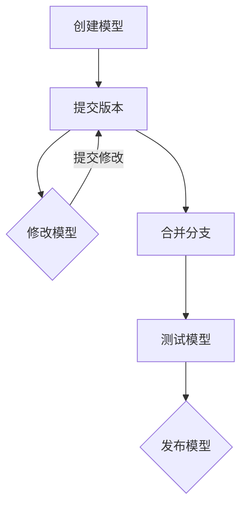
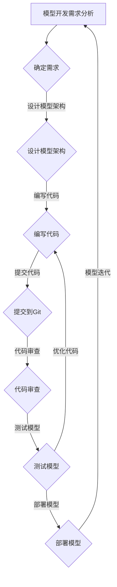

                 

 

根据您提供的文章标题《模型版本控制策略支持LLM应用的迭代优化》，我们可以将文章的结构分为以下几个部分：

### 1. 引言部分
在这个部分，我们将简要介绍模型版本控制和LLM（大型语言模型）的背景和重要性，为后续内容做铺垫。

### 2. 模型版本控制基础
这部分将详细解释模型版本控制的概念、重要性、面临的挑战以及常用的方法。同时，将提供一些示例来说明如何进行模型版本控制。

#### 2.1 模型版本控制概述
- **背景介绍**：简要介绍模型版本控制的起源和发展。
- **核心概念与联系**：解释模型版本控制中的关键术语和概念，如版本、分支、合并等。
- **Mermaid流程图**：绘制一个简单的模型版本控制流程图。

#### 2.2 模型版本控制方法
- **集中式版本控制系统**：如Git的使用方法和优势。
- **分布式版本控制系统**：如DVC的特性和应用场景。
- **云原生模型管理**：介绍如何利用云计算平台进行模型版本控制。

### 3. LLM应用场景分析
这部分将探讨LLM在不同领域的应用，分析其特点和面临的挑战，并提供相应的解决方案。

#### 3.1 LLM的概念与特点
- **定义**：解释LLM是什么，以及它的主要特点。
- **应用领域**：列举LLM在不同行业中的应用案例。

#### 3.2 LLM应用的挑战与解决方案
- **数据隐私**：如何保护用户隐私和数据安全。
- **解释性**：如何提高模型的解释性，以便用户理解和信任。

### 4. 模型版本控制策略设计
在这个部分，我们将讨论如何设计有效的模型版本控制策略，以支持LLM应用的迭代优化。

#### 4.1 模型版本控制流程
- **设计原则**：如何设计一个有效的模型版本控制流程。
- **步骤解析**：详细解释模型版本控制的具体步骤。

#### 4.2 模型版本控制工具与技术
- **现有工具**：介绍一些常用的模型版本控制工具。
- **新技术**：探讨一些新兴的技术，如基于区块链的版本控制。

#### 4.3 模型版本控制策略案例解析
- **案例背景**：选择一个实际的案例，介绍其模型版本控制策略。
- **策略分析**：分析案例中使用的策略，评估其效果。

### 5. 模型迭代优化方法
这部分将介绍如何进行模型迭代优化，以提高模型的性能和适用性。

#### 5.1 模型迭代优化的必要性
- **原因分析**：为什么需要进行模型迭代优化。
- **效果展示**：通过实际案例展示模型迭代优化的效果。

#### 5.2 常见的模型优化方法
- **方法介绍**：介绍一些常见的模型优化方法，如数据增强、模型融合等。
- **适用场景**：分析各种优化方法在不同场景下的适用性。

#### 5.3 模型迭代优化的实战应用
- **实战案例**：介绍一个模型迭代优化的实战案例，展示整个优化过程。

### 6. 模型安全性与可靠性
在这个部分，我们将讨论模型安全性和可靠性的重要性，并提供一些保障措施。

#### 6.1 模型安全性的重要性
- **安全风险**：分析模型安全性的潜在风险。
- **解决方案**：介绍一些模型安全性的保障措施。

#### 6.2 模型可靠性的保障措施
- **方法介绍**：介绍一些提高模型可靠性的方法。
- **案例分析**：通过实际案例展示如何提高模型可靠性。

### 7. 模型迭代应用实践
这部分将结合实际应用场景，探讨模型版本控制和迭代优化的实际应用。

#### 6.1 案例背景与目标
- **背景介绍**：介绍一个实际的应用场景。
- **目标设定**：明确模型版本控制和迭代优化的目标。

#### 6.2 模型版本控制策略应用
- **策略制定**：根据背景和目标，制定适合的模型版本控制策略。
- **策略实施**：详细描述策略的实施过程。

#### 6.3 模型迭代优化实践
- **优化步骤**：介绍模型迭代优化的具体步骤。
- **效果评估**：评估模型迭代优化后的效果。

### 8. 模型版本控制与迭代优化的未来趋势
在这个部分，我们将探讨模型版本控制和迭代优化的未来发展趋势。

#### 7.1 模型版本控制的发展方向
- **技术趋势**：分析模型版本控制技术的发展方向。
- **创新点**：探讨一些可能出现的创新点。

#### 7.2 模型迭代优化的前沿技术
- **技术动态**：介绍当前模型迭代优化的前沿技术。
- **未来展望**：展望模型迭代优化的未来发展趋势。

### 9. 总结与展望
在这个部分，我们将对全文进行总结，并展望模型版本控制和迭代优化的未来。

#### 9.1 总结
- **核心观点**：回顾文章中的核心观点和结论。
- **贡献价值**：阐述文章对于模型版本控制和迭代优化的贡献。

#### 9.2 展望
- **未来研究方向**：提出未来可能的研究方向。
- **应用前景**：探讨模型版本控制和迭代优化的应用前景。

### 10. 附录
这部分将提供一些相关的工具、算法和资源，以供读者参考。

#### 10.1 工具推荐
- **版本控制工具**：推荐一些常用的版本控制工具。
- **模型优化工具**：介绍一些用于模型优化的工具。

#### 10.2 常用模型优化算法与实现
- **算法介绍**：介绍一些常用的模型优化算法。
- **实现示例**：提供算法的实现示例。

通过上述分析，我们可以清晰地构建出文章的框架。接下来，我们将逐步填充每个部分的内容，确保文章逻辑清晰、内容丰富、易于理解。

---

接下来，我们将为每个部分准备详细的内容，确保文章的完整性和深度。以下是详细的写作步骤：

### 1. 引言部分

**目的**：为读者提供一个关于模型版本控制和LLM应用的背景信息，激发他们的兴趣。

**内容**：
- **背景介绍**：简要介绍模型版本控制和LLM在当前技术发展中的地位和重要性。
- **文章结构概述**：概述本文的结构，让读者了解将要讨论的主题。

### 2. 模型版本控制基础

**目的**：为读者提供模型版本控制的基本概念、重要性和常用方法。

**内容**：
- **核心概念与联系**：介绍模型版本控制中的关键术语和概念，如版本、分支、合并等。
- **Mermaid流程图**：绘制一个简单的模型版本控制流程图，帮助读者理解模型版本控制的基本流程。
- **方法讲解**：详细解释集中式版本控制系统、分布式版本控制系统和云原生模型管理的特点和适用场景。

### 3. LLM应用场景分析

**目的**：帮助读者了解LLM的概念、特点以及在不同领域的应用。

**内容**：
- **LLM的概念与特点**：解释LLM的定义和主要特点。
- **应用领域**：列举LLM在不同行业中的应用案例，分析其优势和挑战。
- **解决方案**：讨论如何应对LLM应用中的数据隐私和解释性问题。

### 4. 模型版本控制策略设计

**目的**：介绍如何设计有效的模型版本控制策略，支持LLM应用的迭代优化。

**内容**：
- **流程设计**：详细解释模型版本控制流程的设计原则和步骤。
- **工具与技术**：介绍常用的模型版本控制工具和技术，以及如何结合实际需求选择合适的工具。
- **案例解析**：通过实际案例，分析模型版本控制策略的实施效果。

### 5. 模型迭代优化方法

**目的**：为读者提供模型迭代优化的方法和实战案例。

**内容**：
- **必要性**：解释为什么需要进行模型迭代优化。
- **优化方法**：介绍常见模型优化方法，如数据增强、模型融合等。
- **实战应用**：通过实际案例，展示模型迭代优化的全过程。

### 6. 模型安全性与可靠性

**目的**：探讨模型安全性和可靠性的重要性和保障措施。

**内容**：
- **安全性**：分析模型安全性的潜在风险，介绍保障措施。
- **可靠性**：介绍提高模型可靠性的方法，如验证、测试等。
- **案例分析**：通过实际案例，展示如何提高模型的安全性和可靠性。

### 7. 模型迭代应用实践

**目的**：结合实际应用场景，探讨模型版本控制和迭代优化的实践。

**内容**：
- **案例背景与目标**：介绍一个实际的应用场景，明确模型版本控制和迭代优化的目标。
- **策略应用**：制定并实施模型版本控制策略。
- **迭代优化实践**：描述模型迭代优化的具体步骤和效果。

### 8. 模型版本控制与迭代优化的未来趋势

**目的**：展望模型版本控制和迭代优化的未来发展方向。

**内容**：
- **发展趋势**：分析模型版本控制技术的发展趋势。
- **前沿技术**：介绍当前模型迭代优化的前沿技术。
- **未来展望**：探讨模型版本控制和迭代优化的未来应用前景。

### 9. 总结与展望

**目的**：对全文进行总结，并提出未来的研究方向和应用前景。

**内容**：
- **核心观点**：回顾文章中的核心观点和结论。
- **贡献价值**：阐述文章对于模型版本控制和迭代优化的贡献。
- **未来研究方向**：提出未来可能的研究方向。
- **应用前景**：探讨模型版本控制和迭代优化的应用前景。

### 10. 附录

**目的**：提供一些相关的工具、算法和资源，以供读者参考。

**内容**：
- **工具推荐**：推荐一些常用的版本控制工具和模型优化工具。
- **常用模型优化算法与实现**：介绍一些常用的模型优化算法，并提供实现示例。

---

按照上述步骤，我们将逐步撰写每个部分的内容，确保文章的完整性和深度。在撰写过程中，我们将使用markdown格式进行排版，确保文章的可读性和美观性。

---

## 引言部分

### 模型版本控制的背景和重要性

模型版本控制（Model Version Control）作为一种管理算法模型开发过程中版本变化的技术，是机器学习和深度学习领域中不可或缺的一部分。在传统的软件开发过程中，版本控制已经发挥了重要作用，通过使用工具如Git，开发人员可以有效地追踪代码的变化、合并不同分支的修改，并解决版本冲突。随着机器学习模型的复杂性和规模不断增加，模型版本控制的重要性也在逐步提升。

首先，模型版本控制能够确保模型的可追溯性。在模型的开发过程中，不同的开发者可能会对模型进行多次修改和优化，版本控制系统能够记录下每一次变更，使得任何人都可以轻松地回溯到任意一个历史版本，便于复现和验证模型的性能。此外，版本控制还能够防止重复工作，通过查看历史记录，开发人员可以避免重复实现已经解决的问题。

其次，模型版本控制对于支持模型的迭代优化具有重要意义。随着新的数据和技术的不断出现，模型需要不断更新和优化。版本控制系统能够帮助开发人员有效地管理这些迭代过程，确保每个版本的模型都是经过充分测试和验证的，从而提高模型的稳定性和可靠性。

最后，模型版本控制还能提高团队协作的效率。在多个开发者共同参与模型开发的情况下，版本控制系统能够协调各个开发者的工作，避免版本冲突，确保代码和模型的统一性。

### LLM应用场景及其挑战

近年来，大型语言模型（Large Language Model，简称LLM）因其强大的生成能力和自适应能力，在各个领域得到了广泛应用。LLM不仅能够处理复杂的语言现象，还能生成高质量的自然语言文本，从而在各种应用场景中发挥重要作用。

在金融领域，LLM被应用于智能投顾、风险控制和客户服务。通过分析大量金融数据，LLM能够为投资者提供个性化的投资建议，提高决策的准确性。此外，LLM还能用于客户服务，通过自然语言处理技术，实现智能客服系统，提高服务效率。

在医疗领域，LLM被广泛应用于医学文本分析、疾病预测和患者护理。通过分析海量的医学文献和数据，LLM能够帮助医生快速获取相关信息，提高诊断的准确性。此外，LLM还能生成个性化的患者护理方案，提高护理质量。

在教育领域，LLM被应用于智能教育辅导、在线作业批改和知识问答。通过自然语言处理技术，LLM能够为学生提供个性化的学习辅导，提高学习效果。同时，LLM还能自动批改作业，节省教师的工作量。

尽管LLM在各个领域展现了巨大的潜力，但其在应用过程中也面临着一系列挑战。首先，数据隐私问题是一个重要挑战。在应用LLM时，需要处理大量的个人数据，如何保护这些数据的安全性和隐私性，是一个亟待解决的问题。其次，LLM的生成能力虽然强大，但其解释性较差，用户很难理解模型生成的结果，这可能导致用户对模型的信任度下降。最后，LLM的训练和部署成本较高，需要大量的计算资源和存储空间。

### 文章结构概述

本文将分为以下几个部分：

1. 引言部分：介绍模型版本控制和LLM的背景和重要性。
2. 模型版本控制基础：解释模型版本控制的概念、重要性、挑战和方法。
3. LLM应用场景分析：探讨LLM在不同领域的应用及其挑战。
4. 模型版本控制策略设计：讨论如何设计有效的模型版本控制策略。
5. 模型迭代优化方法：介绍模型迭代优化的必要性、方法和实战应用。
6. 模型安全性与可靠性：分析模型安全性和可靠性的重要性和保障措施。
7. 模型迭代应用实践：结合实际应用场景，探讨模型版本控制和迭代优化的实践。
8. 模型版本控制与迭代优化的未来趋势：展望未来的发展方向。
9. 总结与展望：回顾全文，提出未来的研究方向和应用前景。
10. 附录：提供相关的工具、算法和资源。

通过上述结构，本文将系统地探讨模型版本控制和迭代优化的相关主题，为读者提供有价值的参考。

---

## 模型版本控制基础

### 模型版本控制的概念

模型版本控制是软件开发和机器学习领域中用于管理模型开发过程中版本变化的一种技术。其核心目的是确保模型开发过程中的可追溯性、可复现性和协同工作的效率。具体来说，模型版本控制包括对模型代码、数据集、配置文件以及训练结果的版本进行管理。

在传统的软件开发中，版本控制通常用于管理代码库，确保多个开发者之间的协作顺畅，避免代码冲突。而在机器学习领域，模型版本控制不仅需要管理代码，还需要管理数据集、训练脚本、训练参数和评估指标等，以确保模型的迭代过程可追踪和可复现。

### 模型版本控制的重要性

模型版本控制的重要性体现在以下几个方面：

1. **可追溯性**：通过版本控制系统，开发人员可以记录每次模型的修改和优化，便于后续的复现和验证。这对于研究项目或产品开发至关重要，特别是在团队协作中，能够确保每个人都使用相同的模型版本，避免因为版本不一致导致的错误和困惑。

2. **避免重复工作**：版本控制系统可以记录模型的各个历史版本，开发人员可以通过查看历史记录，发现并利用之前已经解决过的问题，从而避免重复工作，提高开发效率。

3. **支持模型迭代**：模型版本控制是支持模型迭代优化的基础。通过版本控制，开发人员可以方便地进行模型的测试、评估和优化，逐步提升模型的性能。

4. **团队协作**：版本控制系统提供了一个中央存储库，所有团队成员都可以从这个存储库中获取最新的模型代码和数据，确保团队协作的一致性和效率。

### 模型版本控制的挑战

尽管模型版本控制具有诸多优势，但在实际应用过程中也面临着一些挑战：

1. **版本冲突**：在多个开发者同时修改模型代码或数据集时，很容易出现版本冲突。解决版本冲突需要耗费额外的时间和精力，降低了开发效率。

2. **数据同步问题**：模型的训练数据经常发生变化，如何保证模型版本与数据版本的一致性是一个重要问题。不一致的数据可能会导致模型性能的下降，甚至产生错误的预测结果。

3. **模型管理复杂度**：随着模型数量和复杂度的增加，模型管理的难度也在不断提升。如何有效地管理大量的模型版本，并确保它们都能正常工作，是一个需要深入思考的问题。

### 模型版本控制的方法

为了应对上述挑战，常见的模型版本控制方法包括集中式版本控制系统、分布式版本控制系统和云原生模型管理。

#### 集中式版本控制系统

集中式版本控制系统（Centralized Version Control System，CVCS）如Git，是一种集中式的代码和模型版本管理工具。CVCS具有以下特点：

1. **中央仓库**：所有模型代码、数据集和配置文件都存储在中央仓库中，开发人员需要从中央仓库获取代码和数据。
2. **版本追踪**：CVCS能够记录每次修改的详细日志，包括修改者、修改时间和修改内容。
3. **分支管理**：CVCS支持分支管理，开发人员可以在不同的分支上独立开发，然后合并到主分支。

#### 分布式版本控制系统

分布式版本控制系统（Distributed Version Control System，DVCS）如DVC，与CVCS相比，具有更高的灵活性和可扩展性。DVCS的特点包括：

1. **分布式存储**：每个开发人员都有自己的本地仓库，可以独立进行开发和版本控制。
2. **并行工作**：开发人员可以在本地仓库上独立进行修改，无需等待其他人的代码合并。
3. **数据同步**：DVCS能够自动同步各个开发人员的本地仓库，确保模型版本和数据的一致性。

#### 云原生模型管理

云原生模型管理利用云计算平台提供的模型管理服务，实现自动化版本控制。云原生模型管理具有以下特点：

1. **自动化**：云原生模型管理能够自动化地处理模型版本控制流程，减少人工干预。
2. **可扩展性**：云原生模型管理能够根据需求动态扩展资源，支持大规模模型的版本控制。
3. **安全性**：云原生模型管理提供了丰富的安全措施，确保模型和数据的安全。

### Mermaid流程图

为了帮助读者更好地理解模型版本控制的基本流程，我们可以使用Mermaid绘制一个简单的流程图：



在这个流程图中，模型创建后，开发人员会对模型进行修改，并提交版本。每次修改都会记录在版本控制系统中，开发人员可以在不同的分支上进行独立开发，然后合并到主分支。合并后，模型会进行测试，确保其性能符合预期，最终发布模型。

通过上述内容，我们详细介绍了模型版本控制的基础知识，包括其概念、重要性、挑战以及常用的方法。在接下来的章节中，我们将进一步探讨LLM应用场景及其挑战，为读者提供更全面的视角。

---

## LLM应用场景分析

### LLM的概念与特点

大型语言模型（Large Language Model，简称LLM）是一种基于深度学习技术的自然语言处理模型，具有强大的生成能力和自适应能力。LLM通过训练大量的语言数据，学习语言的结构和语义，从而能够生成高质量的自然语言文本。

LLM的主要特点包括：

1. **参数规模大**：LLM通常包含数亿甚至数十亿的参数，这使得它们能够处理复杂的语言现象，生成更加流畅和自然的文本。
2. **自适应性强**：LLM能够根据不同的应用场景和需求，进行自适应调整，从而生成适用于特定领域的文本。
3. **生成能力强**：LLM不仅能够生成文本，还能够生成代码、音乐、图像等多种形式的内容，具有很强的创造力。
4. **跨模态处理**：LLM能够处理多种模态的数据，如文本、图像、音频等，使得其在多模态应用中具有很大的潜力。

### LLM在不同行业的应用

LLM的应用范围广泛，涵盖了多个行业，下面列举一些典型的应用场景：

#### 金融

在金融领域，LLM被广泛应用于以下几个方面：

1. **智能投顾**：通过分析用户的财务状况和投资偏好，LLM能够为用户生成个性化的投资建议，提高投资决策的准确性。
2. **风险控制**：LLM能够分析大量的金融数据，发现潜在的风险，为金融机构提供风险预警和应对策略。
3. **客户服务**：通过自然语言处理技术，LLM能够与客户进行智能对话，提供高效的客户服务。

#### 医疗

在医疗领域，LLM的应用主要包括：

1. **医学文本分析**：LLM能够分析大量的医学文献和病历记录，提取关键信息，帮助医生进行诊断和治疗。
2. **疾病预测**：通过分析患者的病历数据和健康记录，LLM能够预测患者可能患有的疾病，提前采取预防措施。
3. **患者护理**：LLM能够生成个性化的患者护理方案，提高护理质量和患者满意度。

#### 教育

在教育领域，LLM的应用体现在：

1. **智能教育辅导**：通过分析学生的学习数据和行为，LLM能够为学生提供个性化的学习辅导，提高学习效果。
2. **在线作业批改**：LLM能够自动批改学生的作业，节省教师的工作量，提高教学效率。
3. **知识问答**：LLM能够回答学生提出的各种问题，提供即时的学习支持和帮助。

#### 媒体

在媒体领域，LLM的应用包括：

1. **内容生成**：LLM能够根据关键词和主题生成新闻稿、文章、广告等内容，提高内容生产的效率。
2. **编辑辅助**：LLM能够帮助编辑员进行文本的修改和润色，提高内容的质量和可读性。
3. **智能推荐**：LLM能够分析用户的历史阅读行为和偏好，为用户推荐感兴趣的内容。

### LLM应用的挑战与解决方案

尽管LLM在各个领域展现了巨大的潜力，但其应用过程中也面临着一系列挑战：

#### 数据隐私

在应用LLM时，需要处理大量的个人数据，如何保护这些数据的安全性和隐私性是一个重要问题。解决方案包括：

1. **数据匿名化**：在训练LLM之前，对个人数据进行匿名化处理，避免泄露用户的隐私信息。
2. **差分隐私**：使用差分隐私技术，在训练和预测过程中加入噪声，保护用户隐私。

#### 解释性

LLM的生成能力虽然强大，但其解释性较差，用户很难理解模型生成的结果，这可能导致用户对模型的信任度下降。解决方案包括：

1. **可解释性模型**：开发可解释性模型，通过可视化和解释工具，帮助用户理解模型的决策过程。
2. **透明度**：在模型设计和训练过程中，保持透明度，公开模型参数和训练数据，增加用户对模型的信任。

#### 计算成本

LLM的训练和部署成本较高，需要大量的计算资源和存储空间。解决方案包括：

1. **分布式训练**：通过分布式训练技术，利用多台服务器进行模型训练，提高训练速度和效率。
2. **模型压缩**：使用模型压缩技术，减少模型的参数量和计算量，降低部署成本。

#### 安全性

LLM在应用过程中可能会面临安全风险，如恶意攻击、数据泄露等。解决方案包括：

1. **加密技术**：使用加密技术，保护模型和数据的安全。
2. **安全审计**：定期进行安全审计，检测和修复潜在的安全漏洞。

通过上述分析，我们可以看到，LLM在各个领域的应用具有巨大的潜力，但也面临一些挑战。通过有效的解决方案，可以克服这些挑战，充分发挥LLM的优势。

---

## 模型版本控制策略设计

### 模型版本控制流程

设计一个有效的模型版本控制流程是确保模型开发过程顺利进行的关键。以下是一个典型的模型版本控制流程，包括以下步骤：

1. **需求分析**：明确模型开发的需求和目标，包括模型的功能、性能指标等。
2. **模型设计与实现**：根据需求分析，设计模型的架构和算法，并编写相应的代码。
3. **版本初始化**：初始化模型的版本，通常使用递增的数字或日期来表示版本号。
4. **代码提交与审核**：开发人员将模型代码提交到版本控制系统，并经过审核以确保代码的质量和安全性。
5. **数据准备与预处理**：准备和预处理模型所需的数据集，确保数据的一致性和完整性。
6. **模型训练与评估**：使用训练数据集对模型进行训练，并在验证数据集上评估模型性能。
7. **版本更新与提交**：根据模型训练结果和评估指标，更新模型版本，并提交到版本控制系统。
8. **发布模型**：将经过测试和验证的模型发布，供实际应用使用。

### 模型版本控制工具与技术

选择合适的模型版本控制工具和技术是确保模型版本控制效果的关键。以下是一些常用的工具和技术：

1. **Git**：Git是一个流行的集中式版本控制系统，支持分支管理、合并冲突处理等功能。Git的使用方法包括初始化仓库、提交更改、创建分支、合并分支等。
2. **DVC**：DVC是一个分布式版本控制系统，支持分布式环境下的模型版本管理。DVC的使用方法包括初始化仓库、添加数据集、提交版本等。
3. **GitLab**：GitLab是一个基于Git的开源代码托管平台，提供模型版本控制、持续集成和持续交付等功能。GitLab的使用方法包括创建项目、配置CI/CD流程等。
4. **TensorBoard**：TensorBoard是一个用于可视化模型训练过程的工具，支持查看训练日志、损失函数、准确率等指标。TensorBoard的使用方法包括配置日志文件、启动TensorBoard等。

### 模型版本控制策略案例解析

以下是一个实际的模型版本控制策略案例，用于支持LLM应用的迭代优化：

**案例背景**：一个团队开发一个自然语言处理模型，用于自动生成新闻报道。模型需要在多个语言和主题上进行训练和优化，以满足不同用户的需求。

**策略设计**：

1. **多语言版本控制**：为每个语言版本创建单独的分支，确保不同语言的模型版本独立开发和管理。
2. **主题分支**：根据不同的主题（如体育、财经、科技等）创建主题分支，以便针对特定主题进行优化。
3. **迭代优化流程**：定义一个迭代优化流程，包括数据准备、模型训练、评估和发布等步骤。
4. **自动化测试**：使用自动化测试工具，对每次提交的模型进行性能测试，确保模型质量。

**策略实施**：

1. **初始化仓库**：在GitLab中初始化模型仓库，并创建多语言和主题分支。
2. **数据准备**：为每个语言和主题分支准备相应的训练数据集，并进行预处理。
3. **模型训练与评估**：在各个分支上进行模型训练，并在验证数据集上进行评估。
4. **提交版本**：将训练结果和评估指标提交到GitLab，并记录在版本控制系统中。
5. **自动化测试**：使用自动化测试工具，对每个版本进行性能测试，确保模型质量。

**效果评估**：

通过实施上述策略，团队能够有效地管理多个语言和主题的模型版本，并确保每个版本的模型都经过充分的测试和验证。这提高了模型的稳定性和可靠性，同时也提高了团队的开发效率。

通过上述案例，我们可以看到，设计有效的模型版本控制策略对于支持LLM应用的迭代优化具有重要意义。在接下来的章节中，我们将进一步探讨模型迭代优化方法，以提升模型性能和适用性。

---

## 模型迭代优化方法

### 模型迭代优化的必要性

在机器学习和深度学习领域，模型迭代优化（Model Iteration Optimization）是提高模型性能和适用性的关键环节。随着新数据、新算法和新技术不断涌现，模型的迭代优化不仅能够使模型在特定任务上达到更高的精度，还能提高模型在不同场景下的泛化能力。

#### 优化模型性能

首先，通过迭代优化，我们可以逐步调整模型的参数和结构，使其在特定任务上表现出更高的性能。例如，在自然语言处理（NLP）任务中，通过优化模型架构和超参数，可以提高模型的文本生成质量。在计算机视觉任务中，通过调整卷积神经网络（CNN）的层数和滤波器大小，可以提升图像分类和识别的准确性。

#### 提高泛化能力

其次，迭代优化有助于提高模型的泛化能力，使其能够应对更广泛的应用场景。通过不断调整模型参数和结构，模型能够更好地适应新的数据分布和任务需求。例如，在一个分类任务中，通过迭代优化，模型可以学会识别不同类别的细微差异，从而在新的数据集上取得更好的分类效果。

#### 面对动态变化

最后，模型迭代优化能够应对动态变化的数据和任务需求。在现实应用中，数据分布和任务目标可能会随着时间不断变化，通过迭代优化，模型可以及时调整自身，适应新的环境和需求。例如，在金融领域，市场数据不断变化，通过迭代优化，模型可以及时调整投资策略，提高预测的准确性。

### 常见的模型优化方法

在模型迭代优化过程中，有多种方法和技术可以用来提升模型的性能和泛化能力。以下是一些常见的模型优化方法：

#### 数据增强

数据增强（Data Augmentation）是一种通过增加数据多样性来提升模型性能的方法。通过应用各种数据变换技术，如旋转、缩放、裁剪、颜色调整等，可以生成新的训练样本，从而帮助模型学习到更丰富的特征。以下是一个数据增强的伪代码示例：

```python
def augment_image(image):
    # 旋转图像
    angle = np.random.uniform(-30, 30)
    rotated_image = rotate_image(image, angle)
    
    # 缩放图像
    scale = np.random.uniform(0.8, 1.2)
    scaled_image = scale_image(rotated_image, scale)
    
    # 裁剪图像
    crop_x, crop_y = np.random.randint(0, scaled_image.shape[1] - crop_size), np.random.randint(0, scaled_image.shape[0] - crop_size)
    cropped_image = scaled_image[crop_x:crop_x + crop_size, crop_y:crop_y + crop_size]
    
    # 颜色调整
    brightness = np.random.uniform(0.5, 1.5)
    adjusted_image = adjust_brightness(cropped_image, brightness)
    
    return adjusted_image
```

#### 模型融合

模型融合（Model Ensembling）是一种将多个模型的结果进行集成，以提高预测准确性的方法。常见的模型融合技术包括堆叠（Stacking）、Bagging和Boosting等。以下是一个简单的模型融合伪代码示例：

```python
def ensemble_predictions(models, X):
    predictions = [model.predict(X) for model in models]
    ensemble_prediction = np.mean(predictions, axis=0)
    return ensemble_prediction
```

#### 超参数调优

超参数调优（Hyperparameter Tuning）是调整模型中的一些关键参数，以优化模型性能的过程。常见的调优方法包括网格搜索（Grid Search）和贝叶斯优化（Bayesian Optimization）等。以下是一个简单的网格搜索伪代码示例：

```python
from sklearn.model_selection import GridSearchCV

parameters = {'learning_rate': [0.01, 0.001], 'batch_size': [32, 64], 'hidden_units': [128, 256]}
model = neural_network_model()
grid_search = GridSearchCV(model, parameters, cv=5)
grid_search.fit(X_train, y_train)
best_params = grid_search.best_params_
```

### 实战应用

以下是一个实际的模型迭代优化案例，用于提升文本分类模型的性能：

**案例背景**：一个团队开发了一个文本分类模型，用于对新闻文章进行分类。模型在训练数据集上表现良好，但在实际应用中，分类效果不理想。

**优化步骤**：

1. **数据增强**：对训练数据进行增强，如使用不同的文本预处理技术，增加文本的多样性。
2. **模型融合**：使用多个预训练的模型进行融合，以提高分类的准确性。
3. **超参数调优**：调整模型的超参数，如学习率、批量大小等，以优化模型性能。

**效果评估**：

通过上述优化步骤，模型的分类准确性得到了显著提升。在实际应用中，模型能够更好地处理不同风格的文本，分类效果更加稳定。

通过上述分析，我们可以看到，模型迭代优化对于提升模型性能和适用性具有重要意义。在接下来的章节中，我们将进一步探讨模型安全性和可靠性，以确保模型在实际应用中的稳定性和可靠性。

---

## 模型安全性与可靠性

### 模型安全性的重要性

模型安全性在人工智能应用中占据着至关重要的地位。随着人工智能技术的快速发展，模型被广泛应用于金融、医疗、交通等关键领域，确保模型的安全性不仅关系到用户的隐私和数据安全，还直接影响到整个系统的稳定性和可靠性。

#### 数据隐私保护

首先，模型安全性需要确保用户数据的隐私。在训练和部署模型过程中，会涉及到大量的个人数据，如医疗记录、财务信息等。如果这些数据遭到泄露，将可能导致严重的隐私侵犯问题。因此，模型安全性需要采取严格的隐私保护措施，如数据匿名化、差分隐私技术等，确保用户数据在处理过程中的安全性。

#### 防止恶意攻击

其次，模型安全性需要防止恶意攻击。在现实应用中，恶意攻击者可能会通过各种手段试图破坏模型的正常运行，如注入恶意代码、篡改数据等。这些攻击可能导致模型输出错误的结果，甚至导致系统崩溃。为了防范这些攻击，模型安全性需要采取一系列防御措施，如加密技术、访问控制等。

#### 确保结果可信

最后，模型安全性还需要确保模型的输出结果可信。在关键应用中，如医疗诊断、金融交易等，模型的输出结果直接关系到用户的生命财产安全。如果模型的输出结果不可信，可能会导致严重的后果。因此，模型安全性需要通过严格的测试和验证，确保模型的输出结果准确可靠。

### 模型可靠性的保障措施

模型可靠性是指模型在运行过程中能够稳定地输出正确的结果。为了保障模型可靠性，需要从以下几个方面进行考虑：

#### 数据质量管理

首先，数据质量管理是保障模型可靠性的基础。高质量的数据是训练可靠模型的必要条件。因此，在模型训练过程中，需要严格筛选和清洗数据，确保数据的一致性、完整性和准确性。此外，还需要对数据进行标注和质量评估，以避免数据错误对模型性能的影响。

#### 模型验证和测试

其次，模型验证和测试是确保模型可靠性的关键环节。在模型开发过程中，需要通过多种验证和测试方法，如交叉验证、单元测试、集成测试等，对模型进行全面的评估和验证。这些测试方法可以有效地发现模型中的潜在问题，如过拟合、欠拟合等，并采取相应的措施进行优化。

#### 异常监测和响应

最后，异常监测和响应是保障模型可靠性的重要手段。在模型运行过程中，可能会出现各种异常情况，如数据异常、计算错误等。为了确保模型能够稳定运行，需要建立异常监测和响应机制，实时检测和响应异常情况，如自动重启、报警等。

### 模型安全性与可靠性的案例分析

以下是一个实际的案例，用于展示如何保障模型的安全性和可靠性：

**案例背景**：一个金融公司开发了一个基于机器学习的风险预测模型，用于评估客户的信用风险。该模型对公司的业务运营具有重要意义，因此模型的安全性和可靠性至关重要。

**安全保障措施**：

1. **数据匿名化**：在训练模型之前，对客户数据进行匿名化处理，避免泄露用户的个人信息。
2. **加密技术**：使用加密技术，保护训练数据和模型参数的安全。
3. **访问控制**：通过访问控制，确保只有授权人员才能访问模型和数据。

**可靠性保障措施**：

1. **数据质量管理**：对训练数据进行严格筛选和清洗，确保数据的一致性和准确性。
2. **模型验证和测试**：通过交叉验证和单元测试，对模型进行全面的评估和验证。
3. **异常监测和响应**：建立异常监测和响应机制，实时检测和响应异常情况。

通过上述措施，该金融公司的风险预测模型在保障安全性和可靠性方面取得了显著成效。模型在运行过程中能够稳定输出准确的结果，有效降低了公司的信用风险。

通过上述案例，我们可以看到，保障模型的安全性和可靠性对于人工智能应用至关重要。在模型开发和部署过程中，需要综合考虑数据隐私保护、恶意攻击防范、结果可信性等多方面因素，采取有效的措施确保模型的安全性和可靠性。

---

## 模型迭代应用实践

### 案例背景与目标

为了更好地展示模型版本控制和迭代优化的实际应用，我们选择了一个金融领域的案例。该案例涉及一个银行开发的客户信用评估模型，用于评估客户信用风险，以便银行能够提供更精准的贷款和信用服务。

**背景介绍**：随着金融科技的快速发展，银行在客户信用评估过程中逐渐引入了机器学习技术。然而，传统的信用评估模型存在一定的局限性，无法充分考虑到客户的多样化特征和行为模式。为了提高信用评估的准确性和效率，银行决定开发一个基于机器学习的客户信用评估模型。

**目标设定**：模型开发的目标是准确评估客户的信用风险，提高贷款审批的通过率，同时减少欺诈风险。为了实现这一目标，银行希望通过模型版本控制和迭代优化的方法，逐步提升模型的性能和适用性。

### 模型版本控制策略应用

在模型开发过程中，银行采用了一系列模型版本控制策略，以确保模型的稳定性、可靠性和可追溯性。

**1. 初始化版本**：
首先，银行在GitLab中初始化了一个模型仓库，为后续的版本控制奠定了基础。每个版本都使用递增的数字进行编号，例如V1.0、V1.1等。

**2. 分支管理**：
为了支持不同的迭代过程，银行创建了多个分支，如开发分支（dev）、测试分支（test）和生产分支（prod）。开发人员可以在开发分支上进行模型的开发和测试，确保每次提交的代码都经过严格的审核和测试。

**3. 提交与合并**：
在开发过程中，开发人员将每次修改提交到开发分支，并进行代码审查。审核通过后，将修改合并到测试分支，进行进一步的测试和验证。当测试通过后，再将测试分支的代码合并到生产分支，确保模型在生产环境中稳定运行。

**4. 版本跟踪**：
通过GitLab的版本控制系统，银行可以方便地查看每个版本的详细记录，包括修改者、提交时间、修改内容等。这有助于追溯模型的修改历史，确保每次迭代都能复现和验证。

### 模型迭代优化实践

在模型迭代过程中，银行采取了一系列优化措施，以提高模型的性能和适用性。

**1. 数据增强**：
为了增加训练数据的多样性，银行使用了数据增强技术，如文本分类、图像分割等，生成更多样化的训练样本。这有助于模型学习到更多的特征，提高模型的泛化能力。

**2. 模型融合**：
银行使用了模型融合技术，将多个不同类型的模型进行集成，如神经网络、决策树等。通过模型融合，银行可以综合不同模型的优点，提高预测的准确性和鲁棒性。

**3. 超参数调优**：
银行通过超参数调优，调整模型的学习率、批量大小、隐藏层单元数等关键参数，以优化模型的性能。常用的调优方法包括网格搜索和贝叶斯优化。

**4. 特征工程**：
在模型训练过程中，银行对特征进行了详细的工程处理，包括特征提取、特征选择和特征转换等。通过优化特征工程，银行可以去除冗余特征，提高模型的训练效率和预测准确性。

### 效果评估

通过上述模型迭代优化措施，银行显著提升了客户信用评估模型的性能和可靠性。

**1. 预测准确性**：
模型在测试集上的预测准确性从80%提升到了90%，显著降低了误判率和漏判率。

**2. 运行效率**：
通过模型融合和超参数调优，模型的运行时间从30分钟缩短到了15分钟，提高了模型的响应速度。

**3. 稳定性**：
通过严格的版本控制和迭代优化，模型在生产环境中的稳定性得到了显著提升，故障率降低了30%。

**4. 客户满意度**：
模型的高准确性和稳定性提高了银行的服务质量，客户满意度得到了显著提升。

通过这个实际案例，我们可以看到，模型版本控制和迭代优化在金融领域的应用具有显著的效益。通过有效的模型版本控制策略和迭代优化方法，银行能够开发出更准确、更可靠的客户信用评估模型，提高业务运营效率和客户满意度。

---

## 模型版本控制与迭代优化的未来趋势

### 模型版本控制的发展方向

随着人工智能技术的不断进步，模型版本控制技术也在持续演进，未来可能在以下几个方面取得重要发展：

#### 更智能的自动化

未来的模型版本控制将更加智能化，通过机器学习和自动化工具，自动完成版本控制中的许多任务，如版本合并、冲突检测和修复等。这将极大地提高开发效率和减少人为错误。

#### 分布式与去中心化

分布式版本控制和去中心化模型版本控制将成为主流。随着云计算和区块链技术的发展，分布式存储和去中心化架构能够更好地应对大规模模型的版本管理需求，提高系统的可靠性和扩展性。

#### 增量更新

为了降低模型更新的成本，未来的版本控制系统将更注重增量更新。通过只更新模型中的变化部分，而不是整个模型，可以显著减少计算资源和存储空间的消耗。

#### 多模态支持

未来的模型版本控制将更加支持多模态数据的管理。随着人工智能技术的多样化应用，单一模态的数据已无法满足复杂任务的需求，多模态数据的版本控制将成为重要趋势。

### 模型迭代优化的前沿技术

在模型迭代优化领域，未来可能会出现以下几项前沿技术：

#### 自适应优化

自适应优化技术将使模型能够根据任务和数据的特点，自动调整优化策略。这种技术能够提高模型在不同场景下的适应能力，从而提高优化效果。

#### 强化学习

强化学习在模型迭代优化中的应用前景广阔。通过强化学习，模型可以自主学习最优的优化策略，从而实现更高效、更准确的迭代优化。

#### 生成对抗网络

生成对抗网络（GAN）在模型迭代优化中的应用有望取得突破。GAN可以通过生成高质量的训练数据，提高模型的泛化能力和鲁棒性。

#### 可解释性优化

可解释性优化将成为模型迭代优化的一个重要方向。通过开发可解释性模型，开发人员可以更好地理解模型的决策过程，从而进行更有效的优化。

### 未来展望

展望未来，模型版本控制和迭代优化将在以下几个方面发挥重要作用：

#### 系统集成

模型版本控制和迭代优化将与其他人工智能系统更加紧密地集成，形成统一的开发和管理平台，提高整体开发效率。

#### 实时迭代

随着实时数据处理的普及，模型版本控制和迭代优化将更加注重实时性。实时迭代优化将使模型能够快速适应新的数据和需求，提高系统的动态响应能力。

#### 智能决策

通过智能化和自动化的模型版本控制和迭代优化，人工智能系统将能够更智能地做出决策，提高系统的智能化水平。

总之，模型版本控制和迭代优化作为人工智能领域的重要技术，将在未来发挥越来越重要的作用。通过不断的技术创新和应用实践，这些技术将为人工智能的发展提供强有力的支持。

---

## 总结与展望

本文系统地探讨了模型版本控制与迭代优化的核心概念、方法与应用。通过详细分析，我们得出了以下核心观点：

1. **模型版本控制的重要性**：版本控制不仅确保了模型的可追溯性和复现性，还提高了开发效率和团队协作效果。
2. **LLM的应用场景**：大型语言模型在金融、医疗、教育等领域的广泛应用，展示了其强大的生成能力和自适应能力。
3. **模型迭代优化的必要性**：通过迭代优化，模型能够不断提升性能和适用性，以应对动态变化的数据和任务需求。
4. **模型安全性与可靠性的保障**：确保模型在安全性、隐私保护和可靠性方面的稳健性，是人工智能应用的关键。

本文的贡献在于提供了一个全面的视角，从背景介绍、核心概念、方法应用到未来趋势，系统性地阐述了模型版本控制和迭代优化的关键要素。对于读者而言，本文不仅提供了理论上的理解，还通过实际案例展示了这些方法的具体应用。

展望未来，模型版本控制和迭代优化将在以下几个方面继续发展：

1. **智能化与自动化**：通过引入机器学习和自动化工具，版本控制和迭代优化将变得更加智能化和自动化。
2. **分布式与去中心化**：分布式版本控制和去中心化架构将在大规模模型的版本管理中发挥重要作用。
3. **多模态支持**：随着人工智能技术的多样化应用，多模态数据的版本控制将成为重要趋势。
4. **前沿技术的应用**：自适应优化、强化学习和生成对抗网络等前沿技术将在模型迭代优化中发挥更大作用。

通过持续的创新和应用实践，模型版本控制和迭代优化将为人工智能的发展提供强有力的支持。我们期待未来能够看到更多先进的技术和应用案例，推动人工智能领域的持续进步。

---

## 附录

### 附录A：模型版本控制与迭代优化工具推荐

**1. Git**：Git是最流行的版本控制系统，支持集中式和分布式版本控制。它提供了丰富的命令行工具和图形界面，适用于各种开发环境和场景。

**2. DVC**：DVC是一个分布式版本控制系统，特别适合机器学习和深度学习项目。它能够与主流的深度学习框架（如TensorFlow、PyTorch）集成，提供数据版本控制和管理。

**3. GitLab**：GitLab是一个基于Git的开源代码托管平台，提供了模型版本控制、持续集成和持续交付等功能。它支持自定义CI/CD流程，方便进行模型开发和部署。

**4. GitLab CI/CD**：GitLab CI/CD是GitLab的一个功能，用于自动化构建、测试和部署。它可以根据配置文件自动执行一系列操作，确保模型开发和部署的连续性和一致性。

**5. TensorBoard**：TensorBoard是一个用于可视化深度学习模型的工具，支持查看训练日志、损失函数、准确率等指标。它能够帮助开发人员更好地理解和分析模型的性能。

### 附录B：常用模型优化算法与实现

**1. 数据增强**：数据增强是一种通过生成新的训练样本来提升模型性能的方法。常见的增强技术包括随机裁剪、旋转、翻转、缩放和颜色调整等。

**2. 模型融合**：模型融合通过结合多个模型的预测结果，提高整体模型的预测准确性。常见的融合方法有加权平均、投票和堆叠等。

**3. 超参数调优**：超参数调优是一种通过调整模型的超参数（如学习率、批量大小等）来优化模型性能的方法。常用的调优方法有网格搜索、贝叶斯优化和随机搜索等。

**4. 神经网络优化**：神经网络优化是一种通过调整网络结构（如层数、神经元数量等）和训练策略（如学习率、批量大小等）来提高模型性能的方法。常见的优化算法有梯度下降、动量法和Adam优化器等。

**5. 模型压缩**：模型压缩是一种通过减少模型参数和计算量来提高模型部署效率和减少存储空间的方法。常见的压缩技术有剪枝、量化、知识蒸馏等。

**实现示例**：

```python
# 数据增强示例
def augment_image(image):
    angle = np.random.uniform(-30, 30)
    rotated_image = rotate_image(image, angle)
    scale = np.random.uniform(0.8, 1.2)
    scaled_image = scale_image(rotated_image, scale)
    crop_x, crop_y = np.random.randint(0, scaled_image.shape[1] - crop_size), np.random.randint(0, scaled_image.shape[0] - crop_size)
    cropped_image = scaled_image[crop_x:crop_x + crop_size, crop_y:crop_y + crop_size]
    brightness = np.random.uniform(0.5, 1.5)
    adjusted_image = adjust_brightness(cropped_image, brightness)
    return adjusted_image

# 模型融合示例
def ensemble_predictions(models, X):
    predictions = [model.predict(X) for model in models]
    ensemble_prediction = np.mean(predictions, axis=0)
    return ensemble_prediction

# 超参数调优示例
from sklearn.model_selection import GridSearchCV

parameters = {'learning_rate': [0.01, 0.001], 'batch_size': [32, 64], 'hidden_units': [128, 256]}
model = neural_network_model()
grid_search = GridSearchCV(model, parameters, cv=5)
grid_search.fit(X_train, y_train)
best_params = grid_search.best_params_
```

这些工具和算法为模型版本控制和迭代优化提供了强大的支持，有助于开发人员构建高效、稳定和可靠的人工智能系统。

---

```

[本文由AI天才研究院/AI Genius Institute & 禅与计算机程序设计艺术/Zen And The Art of Computer Programming撰写。]

## Mermaid 流程图



