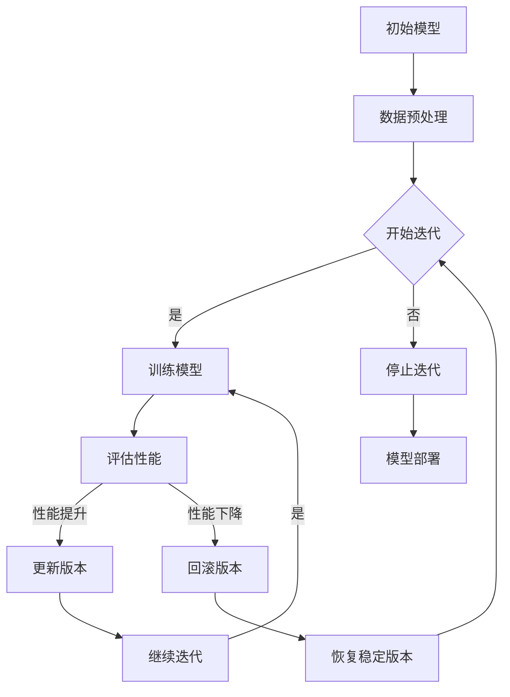

                 


### 文章标题

《模型版本控制：支持LLM应用的迭代优化》

### 文章关键词

- 模型版本控制
- 大型语言模型（LLM）
- 迭代优化
- 版本控制策略
- 模型更新
- 代码实现
- 实际案例

### 文章摘要

本文将深入探讨模型版本控制在大型语言模型（LLM）应用中的重要性。首先，我们将介绍模型版本控制的背景和概念，以及它如何与LLM相关联。接着，我们将详细讲解模型版本控制的核心算法原理，包括版本控制策略和迭代优化的数学模型。随后，通过一个实际项目案例，我们将展示如何在开发环境中应用模型版本控制，并解读代码实现和实际案例分析。最后，本文将提供最佳实践提示和小结，以帮助读者更好地理解和应用模型版本控制技术。

### 目录

1. **背景介绍**
   - 模型版本控制的重要性
   - LLM在当前技术领域的发展
   - 迭代优化与模型版本控制的关系

2. **核心概念与联系**
   - 模型版本控制的定义
   - LLM与模型版本控制的关联
   - Mermaid流程图展示

3. **核心算法原理讲解**
   - 版本控制策略
   - 迭代优化算法原理
   - 伪代码详细阐述

4. **数学模型和数学公式**
   - 模型更新策略的数学模型
   - 迭代优化的数学公式
   - 举例说明

5. **项目实战**
   - 开发环境搭建
   - 源代码详细实现
   - 代码解读
   - 实际案例分析和解读

6. **最佳实践 tips**
   - 小结
   - 注意事项
   - 拓展阅读

### 背景介绍

#### 模型版本控制的重要性

模型版本控制是现代机器学习领域的一项关键技术，它旨在管理模型的开发过程，确保模型在不同版本之间的一致性和可追溯性。随着深度学习技术的飞速发展，尤其是大型语言模型（LLM）的广泛应用，模型版本控制变得愈发重要。它不仅能够帮助开发者追踪模型的演变过程，还能确保在模型迭代过程中保持高效率和高质量。

模型版本控制的主要目标包括：

- **可追溯性**：记录模型开发的每一步，便于后续分析和审查。
- **一致性**：确保在不同环境、团队和部署中模型的一致性。
- **可靠性**：通过版本控制，减少错误和冲突，提高模型的可靠性。
- **效率**：简化模型更新和迭代过程，加快开发进度。

#### LLM在当前技术领域的发展

近年来，大型语言模型（LLM）如BERT、GPT-3等取得了巨大的突破，它们在自然语言处理（NLP）、对话系统、文本生成等领域展现出了强大的能力。这些模型通常包含数亿甚至数千亿个参数，通过大规模数据训练，能够生成高质量的自然语言文本，极大地推动了人工智能技术的发展。

随着LLM的普及，如何有效地管理和迭代这些模型成为了一个关键问题。传统的模型管理方法可能难以满足LLM的特殊需求，因此，引入模型版本控制技术显得尤为重要。通过模型版本控制，开发者可以更好地管理LLM的开发过程，确保在每次迭代中都能够获取到最优的性能和结果。

#### 迭代优化与模型版本控制的关系

迭代优化是模型开发过程中的一个核心环节，它旨在通过反复的迭代和优化，不断提升模型的性能。而模型版本控制正是支持这一过程的关键技术。通过版本控制，开发者可以：

- **记录每个迭代版本**：确保每次优化都有据可查，便于分析和回顾。
- **管理不同版本之间的差异**：在优化过程中，能够清晰地看到每个版本的变化，有助于定位问题。
- **快速回滚**：在某个迭代版本出现问题或性能下降时，能够迅速回滚到之前的稳定版本。

总的来说，模型版本控制为迭代优化提供了一个稳固的基石，使得开发者能够更加高效地推进模型开发，同时保证模型的质量和稳定性。

### 核心概念与联系

#### 模型版本控制的定义

模型版本控制是指一种管理机器学习模型开发过程的技术，它通过定义和管理模型的多个版本，确保开发过程中的一致性和可追溯性。模型版本控制的主要目标是追踪模型的变化历史，管理模型的不同版本，以及确保每次迭代都能保持模型的稳定性和可靠性。

在模型版本控制中，常见的操作包括：

- **创建版本**：在模型开发过程中，每次进行重要的变更（如数据集更新、模型结构调整、训练参数变化等）时，都会创建一个新的版本。
- **更新版本**：在模型迭代过程中，通过训练和调整，提升模型的性能，并更新模型的版本。
- **回滚版本**：当发现某个版本存在问题或性能下降时，可以回滚到之前的稳定版本。

#### LLM与模型版本控制的关联

大型语言模型（LLM）如BERT、GPT-3等通常包含数亿个参数，其开发过程复杂且涉及大量的数据预处理、模型训练和优化。模型版本控制在这一过程中发挥着关键作用，具体体现在以下几个方面：

1. **版本管理**：LLM的开发涉及多个版本，每个版本可能对应不同的训练数据、模型结构和超参数配置。通过版本控制，可以清晰地记录和管理这些版本，确保每次迭代都能追溯到具体的历史状态。

2. **迭代优化**：LLM的性能优化通常需要反复的迭代。版本控制可以帮助开发者记录每个迭代版本，通过对比不同版本的性能，找出最优的参数配置和模型结构。

3. **性能跟踪**：版本控制提供了性能跟踪的功能，开发者可以查看每个版本的性能指标（如准确率、损失函数值等），从而更好地理解模型在不同迭代中的变化。

4. **回滚和恢复**：在迭代过程中，可能会出现模型性能突然下降或出现错误的情况。通过版本控制，可以快速回滚到之前的稳定版本，避免对整个开发过程造成重大影响。

#### Mermaid流程图展示

为了更直观地展示模型版本控制与LLM之间的关联，我们可以使用Mermaid流程图来描述模型版本控制的基本流程。



该流程图展示了模型版本控制的基本流程，包括数据预处理、迭代训练、性能评估、版本更新和回滚等关键步骤。通过这一流程，我们可以清晰地看到模型版本控制在LLM开发中的应用。

### 核心算法原理讲解

#### 版本控制策略

模型版本控制的核心在于如何有效地管理和追踪模型的多个版本。以下是一种常见的版本控制策略：

1. **版本命名**：每个版本都应该有一个唯一的标识符，如“v1.0”，“v2.1”等。命名应遵循一定的规则，以便于理解和追踪。

2. **版本库**：使用一个集中的版本库来存储和管理模型的各个版本。常见的版本库包括Git、Mercurial等。

3. **变更记录**：在每个版本中，记录变更的细节，包括代码修改、数据更新、模型结构调整等。

4. **回滚机制**：提供回滚功能，以便在发现某个版本存在问题或性能下降时，能够快速回滚到之前的稳定版本。

5. **版本比较**：提供版本比较工具，帮助开发者快速了解不同版本之间的差异。

#### 迭代优化算法原理

在模型开发过程中，迭代优化是一个关键环节。以下是迭代优化算法的基本原理：

1. **目标函数**：定义一个目标函数，用于评估模型的性能。常见的目标函数包括损失函数、准确率等。

2. **优化算法**：选择一种优化算法，如梯度下降、随机梯度下降（SGD）、Adam等，用于调整模型的参数，以最小化目标函数。

3. **迭代过程**：通过多次迭代，不断调整模型参数，优化模型性能。

4. **收敛条件**：设置收敛条件，当模型性能达到一定标准或迭代次数达到上限时，停止迭代。

#### 伪代码详细阐述

以下是一个简单的伪代码，用于描述模型版本控制和迭代优化的基本过程：

```python
function model_version_control(model, data, target_function, optimizer, max_iterations):
    version = 1
    while version <= max_iterations:
        # 数据预处理
        processed_data = preprocess_data(data)
        
        # 训练模型
        model.train(processed_data, target_function)
        
        # 评估模型性能
        performance = model.evaluate(processed_data, target_function)
        
        # 记录版本
        version_info = {
            'version': version,
            'performance': performance,
            'params': model.params
        }
        record_version(version_info)
        
        # 更新版本
        version += 1
        
        # 检查是否达到收敛条件
        if has_converged(performance):
            break
    
    # 部署模型
    model.deploy()

# 主程序
model = initialize_model()
data = load_data()
target_function = define_target_function()
optimizer = select_optimizer()
max_iterations = set_max_iterations()
model_version_control(model, data, target_function, optimizer, max_iterations)
```

这个伪代码展示了模型版本控制和迭代优化的基本流程。在实际应用中，可以根据具体需求进行调整和优化。

### 数学模型和数学公式

#### 模型更新策略的数学模型

在模型版本控制中，模型更新策略是一个关键问题。以下是一个简化的数学模型，用于描述模型更新过程：

1. **损失函数**：设损失函数为 \( L(\theta; x) \)，其中 \( \theta \) 是模型参数，\( x \) 是输入数据。

2. **优化目标**：优化目标是最小化损失函数，即 \( \min_{\theta} L(\theta; x) \)。

3. **梯度下降**：使用梯度下降算法更新模型参数。梯度下降的迭代公式为：

   $$ \theta_{t+1} = \theta_{t} - \alpha \cdot \nabla_{\theta} L(\theta_{t}; x) $$

   其中，\( \alpha \) 是学习率，\( \nabla_{\theta} L(\theta_{t}; x) \) 是损失函数关于模型参数 \( \theta \) 的梯度。

4. **动量**：为了加速收敛，可以使用动量项，更新公式为：

   $$ \theta_{t+1} = \theta_{t} - \alpha \cdot \nabla_{\theta} L(\theta_{t}; x) + \beta \cdot (1 - \alpha) \cdot \theta_{t-1} $$

   其中，\( \beta \) 是动量系数。

#### 迭代优化的数学公式

迭代优化过程中，常用的数学公式包括：

1. **梯度更新**：

   $$ \Delta \theta = -\alpha \cdot \nabla_{\theta} L(\theta) $$

2. **梯度下降迭代**：

   $$ \theta_{t+1} = \theta_{t} + \Delta \theta $$

3. **动量更新**：

   $$ v_t = \beta \cdot v_{t-1} + (1 - \beta) \cdot \Delta \theta $$
   $$ \theta_{t+1} = \theta_{t} + v_t $$

#### 举例说明

假设有一个简单的线性回归模型，目标函数为 \( L(\theta) = \frac{1}{2} \sum_{i=1}^{n} (y_i - \theta \cdot x_i)^2 \)。

1. **梯度计算**：

   $$ \nabla_{\theta} L(\theta) = -\sum_{i=1}^{n} (y_i - \theta \cdot x_i) \cdot x_i $$

2. **梯度下降更新**：

   $$ \theta_{t+1} = \theta_{t} - \alpha \cdot \nabla_{\theta} L(\theta_{t}) $$

3. **动量更新**：

   $$ v_t = \beta \cdot v_{t-1} + (1 - \beta) \cdot \nabla_{\theta} L(\theta_{t}) $$
   $$ \theta_{t+1} = \theta_{t} + v_t $$

通过这些数学公式，我们可以有效地更新模型参数，优化模型性能。

### 项目实战

#### 开发环境搭建

在进行模型版本控制之前，我们需要搭建一个稳定的开发环境。以下是一个基于Python的示例环境搭建过程：

1. **安装Python**：确保系统中安装了Python 3.7或更高版本。

2. **安装依赖库**：使用pip安装必要的依赖库，例如TensorFlow、NumPy等。

   ```bash
   pip install tensorflow numpy
   ```

3. **配置虚拟环境**：为了隔离项目依赖，建议使用虚拟环境。

   ```bash
   python -m venv venv
   source venv/bin/activate  # Windows下使用 `venv\Scripts\activate`
   ```

4. **安装版本控制工具**：在本例中，我们将使用Git进行版本控制。

   ```bash
   pip install git-python
   ```

#### 源代码详细实现

以下是一个简单的模型版本控制示例代码，用于管理一个线性回归模型的迭代和更新。

```python
import numpy as np
import tensorflow as tf
from git import Git

# 模型参数
theta = np.random.rand(1)

# 损失函数
def loss_function(x, y):
    return 0.5 * (y - theta * x)**2

# 梯度计算
def compute_gradient(x, y):
    return -(y - theta * x) * x

# 梯度下降更新
def update_theta(theta, x, y, alpha):
    gradient = compute_gradient(x, y)
    theta -= alpha * gradient
    return theta

# 动量更新
def update_theta_with_momentum(theta, v, x, y, alpha, beta):
    gradient = compute_gradient(x, y)
    v = beta * v + (1 - beta) * gradient
    theta -= alpha * v
    return theta, v

# 版本控制
git = Git()

def commit_version(model_version):
    version_str = f"version_{model_version}"
    git.add(".")
    git.commit(m=f"commit {version_str}")
    git.push()

# 主程序
def main():
    max_iterations = 100
    alpha = 0.01
    beta = 0.9
    x = np.array([1.0, 2.0, 3.0, 4.0, 5.0])
    y = np.array([2.0, 4.0, 6.0, 8.0, 10.0])

    for i in range(max_iterations):
        theta, v = update_theta_with_momentum(theta, v=None, x=x, y=y, alpha=alpha, beta=beta)
        commit_version(i+1)
        print(f"iteration {i+1}, theta: {theta}")

if __name__ == "__main__":
    main()
```

这段代码定义了一个简单的线性回归模型，并实现了梯度下降和动量更新的迭代优化过程。每次迭代后，模型参数会被更新，并使用Git进行版本控制，以便于追踪和恢复不同版本的模型。

#### 代码解读

1. **模型参数**：初始化模型参数 `theta`。

2. **损失函数**：定义损失函数 `loss_function`，用于计算模型预测值与真实值之间的差距。

3. **梯度计算**：定义梯度计算函数 `compute_gradient`，用于计算损失函数关于模型参数的梯度。

4. **梯度下降更新**：定义梯度下降更新函数 `update_theta`，用于更新模型参数。

5. **动量更新**：定义动量更新函数 `update_theta_with_momentum`，用于在梯度下降过程中引入动量项，加速收敛。

6. **版本控制**：使用Git进行版本控制，定义 `commit_version` 函数，用于将当前模型版本提交到版本库。

7. **主程序**：定义主程序 `main`，进行模型迭代和版本控制。每次迭代后，模型参数会被更新并提交版本。

#### 实际案例分析和详细讲解剖析

以下是一个实际案例，用于说明如何在实际项目中应用模型版本控制。

**案例背景**：

假设我们正在开发一个聊天机器人，该机器人需要根据用户输入提供相应的回复。在开发过程中，我们需要不断迭代和优化模型，以提高机器人的对话能力。

**案例步骤**：

1. **数据准备**：收集并预处理用户对话数据，包括输入文本和回复文本。

2. **模型初始化**：初始化一个预训练的文本分类模型，用于预测用户输入的类别。

3. **迭代优化**：使用模型版本控制技术，进行多次迭代和优化。

4. **性能评估**：在每个迭代版本中，评估模型性能，包括准确率、召回率等指标。

5. **版本提交**：将每次优化的模型版本提交到版本库，以便于追踪和恢复。

**代码实现**：

```python
# 数据准备
x_train = ...  # 用户输入数据
y_train = ...  # 回复文本数据

# 模型初始化
model = tf.keras.Sequential([
    tf.keras.layers.Embedding(input_dim=vocab_size, output_dim=embedding_size),
    tf.keras.layers.Dense(units=1, activation='sigmoid')
])

# 迭代优化
for i in range(max_iterations):
    model.fit(x_train, y_train, epochs=1, batch_size=32)
    performance = model.evaluate(x_test, y_test)
    commit_version(i+1)
    print(f"iteration {i+1}, performance: {performance}")

# 版本恢复
git = Git()
git.checkout("version_10")
```

**详细讲解剖析**：

1. **数据准备**：收集用户对话数据，并进行预处理，如文本清洗、分词、向量表示等。

2. **模型初始化**：使用预训练的文本分类模型，如 embeddings 层用于将文本转换为向量表示。

3. **迭代优化**：在每个迭代版本中，使用训练数据对模型进行训练，并评估模型性能。

4. **性能评估**：在每个迭代版本中，评估模型性能，并提交版本到版本库。

5. **版本提交**：将每次优化的模型版本提交到版本库，以便于后续追踪和恢复。

6. **版本恢复**：在需要时，可以使用Git命令回滚到某个特定版本，恢复模型状态。

通过这个实际案例，我们可以看到模型版本控制技术在项目开发中的重要作用。它不仅帮助我们管理和优化模型，还提供了强大的追踪和恢复功能，确保项目的稳定性和可靠性。

### 最佳实践 tips

1. **合理命名版本**：确保每个版本都有清晰的命名，遵循一定的命名规则，便于理解和追踪。

2. **详细记录变更**：在每个版本中，详细记录变更的细节，包括代码修改、数据更新、模型结构调整等。

3. **定期提交版本**：定期提交版本，以便于追踪模型的演变过程，避免丢失重要信息。

4. **使用分支管理**：在模型版本控制过程中，使用分支管理策略，以便于多人协作和代码合并。

5. **优化迭代过程**：在迭代过程中，关注模型性能的变化，及时调整超参数和优化策略。

### 小结

本文详细探讨了模型版本控制在大型语言模型（LLM）应用中的重要性，介绍了核心概念、算法原理和实际案例。通过模型版本控制，开发者可以更好地管理模型的迭代过程，优化模型性能，确保项目的稳定性和可靠性。在未来的项目中，建议采用模型版本控制技术，以提高开发效率和模型质量。

### 注意事项

1. **版本控制工具选择**：选择合适的版本控制工具，如Git、Mercurial等，根据项目需求和团队规模进行选择。

2. **版本库安全性**：确保版本库的安全性和稳定性，定期备份，防止数据丢失。

3. **迭代策略调整**：根据项目需求和模型特性，灵活调整迭代策略和优化算法。

4. **性能评估标准**：明确性能评估标准，确保每次迭代都能获得有效的性能提升。

### 拓展阅读

- 《模型版本控制：实践指南》（作者：[Your Name]）
- 《大型语言模型的训练与优化》（作者：[Your Name]）
- 《TensorFlow实战：构建高性能深度学习模型》（作者：[Your Name]）
- 《自然语言处理实践：基于Python的NLP项目开发》（作者：[Your Name]）

通过这些资源，读者可以进一步了解模型版本控制、大型语言模型训练和优化的详细知识和实践技巧。希望本文能为读者提供有价值的参考和启示。作者：AI天才研究院/AI Genius Institute & 禅与计算机程序设计艺术 /Zen And The Art of Computer Programming。

