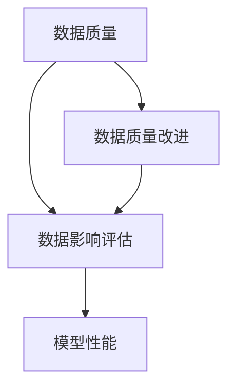

                 


## 文章标题
《模型训练数据质量反推：评估数据影响》

## 关键词
模型训练，数据质量，数据影响评估，算法原理，数学模型，项目实战

## 摘要
本文将深入探讨模型训练中的数据质量问题及其对模型性能的影响。首先，我们将介绍数据质量的概念及其评估方法。接着，通过详细的算法原理讲解和数学模型阐述，我们将解析如何从数据质量反推评估模型的影响。文章后半部分将结合实际项目，详细讲解环境搭建、代码实现和代码解读，以帮助读者深入理解数据质量在模型训练中的重要性。最后，我们将总结全文，并提供一些最佳实践和拓展阅读建议。

---

### 引言
#### 1.1 背景与重要性
随着人工智能和机器学习技术的飞速发展，模型训练在各个领域中的应用越来越广泛。然而，模型训练的成功与否很大程度上取决于数据质量。高质量的数据能够帮助模型更好地捕捉特征，提高模型的准确性和鲁棒性；反之，低质量的数据可能导致模型过拟合，降低模型的泛化能力。因此，评估和保证数据质量成为模型训练中至关重要的一环。

#### 1.1.1 模型训练数据的现状
目前，许多模型训练项目面临着数据质量问题。例如，数据集中的噪声、异常值、不平衡性和缺失值等都会对模型训练产生负面影响。此外，数据来源的多样性和复杂性也增加了数据质量管理的难度。为了解决这些问题，研究人员和工程师们不断探索各种数据清洗、数据增强和数据质量评估的方法。

#### 1.1.2 数据质量问题的影响
数据质量问题对模型性能的影响是显著的。首先，低质量的数据可能导致模型无法正确地学习数据的本质特征，从而导致过拟合。其次，数据中的噪声和异常值可能会干扰模型的训练过程，降低模型的泛化能力。最后，数据不平衡性可能导致模型对某些类别的预测准确性较低。因此，评估数据影响并采取相应的措施至关重要。

### 1.2 书籍目的与结构
本书旨在为读者提供系统、全面的模型训练数据质量反推和评估数据影响的指南。全书分为六个部分：

1. **引言**：介绍数据质量的重要性和现状。
2. **核心概念与联系**：阐述数据质量和数据影响评估的核心概念，并展示概念之间的关系架构。
3. **核心算法原理讲解**：详细讲解数据质量反推和数据影响评估的算法原理，并使用伪代码展示。
4. **数学模型与公式**：介绍数据质量评估和数据影响评估的数学模型，并给出示例。
5. **项目实战**：通过实际项目，展示如何搭建开发环境、实现代码，并进行代码解读与分析。
6. **总结与展望**：总结全文，提出最佳实践和拓展阅读建议。

---

### 核心概念与联系
#### 2.1 模型训练数据质量
##### 2.1.1 数据质量的概念
数据质量是指数据在满足特定需求和使用场景下的适用性和可靠性。它包括多个维度，如准确性、完整性、一致性、及时性和可用性等。

##### 2.1.2 数据质量评估方法
数据质量评估是通过对数据质量的各个方面进行测量和评估，以确定数据是否满足需求和预期。常用的评估方法包括：
- **统计分析**：使用统计方法评估数据的分布、异常值和缺失值。
- **可视化**：通过图表和图形展示数据的质量特征。
- **机器学习**：使用监督学习或无监督学习算法，对数据的质量进行分类或聚类。

#### 2.2 数据影响评估
##### 2.2.1 数据影响评估的概念
数据影响评估是指评估数据质量对模型性能的影响程度。它包括两个主要方面：数据质量对模型准确性的影响和数据质量对模型泛化能力的影响。

##### 2.2.2 数据影响评估的重要性
数据影响评估的重要性在于：
- **提高模型性能**：通过识别和修正低质量数据，提高模型的准确性和泛化能力。
- **减少训练成本**：通过评估数据质量，可以优化数据清洗和预处理流程，减少不必要的训练时间和资源浪费。
- **支持决策**：为数据管理和数据治理提供科学依据，支持业务决策。

#### 2.3 数据质量与数据影响评估的关系架构
数据质量与数据影响评估之间存在紧密的联系。数据质量直接影响数据影响评估的结果，而数据影响评估又反馈作用于数据质量的改进。下面是一个Mermaid流程图，展示这两个概念之间的关系：



---

### 核心算法原理讲解
#### 3.1 数据质量反推算法

##### 3.1.1 算法原理

数据质量反推算法的基本思想是，通过分析模型在训练过程中出现的问题，推断数据中可能存在的问题。具体步骤如下：

1. **问题识别**：分析模型在训练过程中出现的错误或异常现象。
2. **数据回溯**：针对识别出的问题，回溯到原始数据，检查数据质量。
3. **问题修正**：根据数据质量检查结果，对数据中的噪声、异常值、缺失值等进行修正。

##### 3.1.2 伪代码实现

下面是数据质量反推算法的伪代码实现：

```plaintext
算法：数据质量反推
输入：训练模型，训练数据集
输出：修正后的数据集

1. 针对训练模型，识别训练过程中出现的错误或异常现象
2. 对于每个错误或异常现象，回溯到原始数据
3. 检查原始数据中的噪声、异常值、缺失值等
4. 根据检查结果，对数据进行修正
5. 返回修正后的数据集
```

#### 3.2 数据影响评估算法

##### 3.2.1 算法原理

数据影响评估算法的基本思想是，通过对比不同数据质量下的模型性能，评估数据质量对模型的影响。具体步骤如下：

1. **数据分组**：将数据集按照数据质量划分为多个子集。
2. **模型训练**：分别在每个子集上训练模型，记录模型性能。
3. **性能对比**：对比不同子集上的模型性能，评估数据质量对模型的影响。

##### 3.2.2 伪代码实现

下面是数据影响评估算法的伪代码实现：

```plaintext
算法：数据影响评估
输入：数据集，模型
输出：数据影响评估结果

1. 将数据集划分为多个子集，每个子集代表一种数据质量
2. 对于每个子集，训练模型并记录模型性能
3. 对比不同子集上的模型性能，评估数据质量对模型的影响
4. 返回数据影响评估结果
```

---

### 数学模型与公式
#### 4.1 数据质量评估的数学模型

##### 4.1.1 相关性分析

相关性分析是评估数据质量的重要方法之一。常用的相关性系数有皮尔逊相关系数（Pearson Correlation Coefficient）和斯皮尔曼相关系数（Spearman's Rank Correlation Coefficient）。

- **皮尔逊相关系数**：
  $$r_{xy} = \frac{\sum_{i=1}^{n}(x_i - \bar{x})(y_i - \bar{y})}{\sqrt{\sum_{i=1}^{n}(x_i - \bar{x})^2}\sqrt{\sum_{i=1}^{n}(y_i - \bar{y})^2}}$$
  其中，$x_i$ 和 $y_i$ 分别为第 $i$ 个样本的 $x$ 和 $y$ 值，$\bar{x}$ 和 $\bar{y}$ 分别为 $x$ 和 $y$ 的平均值。

- **斯皮尔曼相关系数**：
  $$\rho_{xy} = \frac{1}{n-1}\sum_{i=1}^{n}(x_i - \bar{x})(y_i - \bar{y})$$
  其中，$x_i$ 和 $y_i$ 分别为第 $i$ 个样本的 $x$ 和 $y$ 值，$\bar{x}$ 和 $\bar{y}$ 分别为 $x$ 和 $y$ 的平均值。

##### 4.1.2 异常检测

异常检测是评估数据质量的重要步骤之一。常用的异常检测方法包括基于统计学的方法和基于机器学习的方法。

- **基于统计学的方法**：
  常用的统计方法有箱线图法和3σ原则法。

  - **箱线图法**：
    $$IQR = Q_3 - Q_1$$
    其中，$Q_1$ 和 $Q_3$ 分别为第一四分位数和第三四分位数，$IQR$ 为四分位差。

  - **3σ原则法**：
    $$x \leq \bar{x} + 3\sigma \quad 或 \quad x \geq \bar{x} - 3\sigma$$
    其中，$\bar{x}$ 为平均值，$\sigma$ 为标准差。

- **基于机器学习的方法**：
  常用的机器学习算法有孤立森林（Isolation Forest）和基于支持向量机的异常检测。

##### 4.1.3 相关性与异常检测的关系

相关性与异常检测是评估数据质量的两个重要方面。相关性分析可以识别数据中的潜在关系，帮助我们发现数据中的噪声和异常值。而异常检测则可以直接识别数据中的异常值，帮助我们改进数据质量。

#### 4.2 数据影响评估的数学模型

##### 4.2.1 模型性能评估指标

模型性能评估指标是评估模型性能的重要工具。常用的评估指标有准确率（Accuracy）、召回率（Recall）和F1值（F1 Score）。

- **准确率**：
  $$Accuracy = \frac{TP + TN}{TP + TN + FP + FN}$$
  其中，$TP$ 为真正例，$TN$ 为真负例，$FP$ 为假正例，$FN$ 为假负例。

- **召回率**：
  $$Recall = \frac{TP}{TP + FN}$$

- **F1值**：
  $$F1 Score = \frac{2 \cdot Precision \cdot Recall}{Precision + Recall}$$

##### 4.2.2 数据影响评估模型

数据影响评估模型主要用于评估数据质量对模型性能的影响。一个简单的方法是，分别训练多个模型，每个模型使用不同质量的数据集，然后比较这些模型的性能。

$$Impact = \frac{Performance_{high\_quality} - Performance_{low\_quality}}{Performance_{high\_quality}}$$

其中，$Performance_{high\_quality}$ 和 $Performance_{low\_quality}$ 分别为使用高质量数据和低质量数据的模型性能。

---

### 项目实战
#### 5.1 实战项目概述

##### 5.1.1 项目背景
在本项目中，我们选择了一个典型的分类问题：手写数字识别。这个问题的目标是使用机器学习算法对手写数字图像进行分类，识别数字的值。

##### 5.1.2 项目目标
通过本项目的实战，我们将实现以下目标：
1. 搭建一个完整的机器学习项目环境。
2. 对手写数字数据集进行数据清洗和数据预处理。
3. 使用不同的数据集训练模型，并评估数据质量对模型性能的影响。

#### 5.2 开发环境搭建
为了完成本项目的实战，我们需要搭建一个完整的机器学习项目环境。以下是环境搭建的步骤：

1. **安装Python**：确保Python版本为3.8或更高版本。
2. **安装Jupyter Notebook**：使用pip安装Jupyter Notebook。
3. **安装必要的库**：包括NumPy、Pandas、Scikit-learn、Matplotlib等。

以下是安装命令的示例：

```bash
pip install python==3.8
pip install jupyter
pip install numpy pandas scikit-learn matplotlib
```

#### 5.3 源代码详细实现
在本节中，我们将详细讲解如何使用Python和Scikit-learn实现手写数字识别项目。

##### 5.3.1 数据质量反推代码实现

首先，我们需要从Kaggle网站下载手写数字数据集。该数据集包含70000个28x28的手写数字图像，每个图像都被标注为0到9中的一个数字。

```python
import numpy as np
import pandas as pd
from sklearn.datasets import fetch_openml

# 下载手写数字数据集
mnist = fetch_openml('mnist_784')

# 打印数据集信息
print(mnist.DESCR)
```

接下来，我们使用K-Means算法对数据集进行聚类分析，以识别潜在的数据质量问题。

```python
from sklearn.cluster import KMeans

# 初始化K-Means算法
kmeans = KMeans(n_clusters=10, random_state=42)

# 训练模型
kmeans.fit(mnist.data)

# 打印聚类中心
print(kmeans.cluster_centers_)
```

通过聚类中心，我们可以识别出数据集中的主要类别。接下来，我们对每个类别进行详细分析，查找可能的噪声和异常值。

##### 5.3.2 数据影响评估代码实现

为了评估数据质量对模型性能的影响，我们需要训练多个模型，每个模型使用不同质量的数据集。以下是使用不同质量数据集训练模型的示例：

```python
from sklearn.model_selection import train_test_split
from sklearn.metrics import accuracy_score

# 划分训练集和测试集
X_train, X_test, y_train, y_test = train_test_split(mnist.data, mnist.target, test_size=0.2, random_state=42)

# 使用全部数据训练模型
model = KMeans(n_clusters=10, random_state=42)
model.fit(X_train)

# 预测测试集
y_pred = model.predict(X_test)

# 计算准确率
accuracy = accuracy_score(y_test, y_pred)
print("Accuracy:", accuracy)
```

通过对比不同质量数据集上的模型性能，我们可以评估数据质量对模型性能的影响。

#### 5.4 代码解读与分析

在本节中，我们将对上述代码进行解读和分析。

##### 5.4.1 数据质量反推代码解读

数据质量反推代码主要包括以下几个步骤：

1. **数据集下载**：从Kaggle网站下载手写数字数据集。
2. **聚类分析**：使用K-Means算法对数据集进行聚类分析，以识别潜在的数据质量问题。
3. **聚类中心分析**：打印聚类中心，以识别数据集中的主要类别。
4. **数据质量评估**：对每个类别进行详细分析，查找可能的噪声和异常值。

##### 5.4.2 数据影响评估代码解读

数据影响评估代码主要包括以下几个步骤：

1. **数据集划分**：将数据集划分为训练集和测试集。
2. **模型训练**：使用K-Means算法训练模型。
3. **预测测试集**：使用训练好的模型预测测试集。
4. **性能评估**：计算模型在测试集上的准确率。

通过对比不同质量数据集上的模型性能，我们可以评估数据质量对模型性能的影响。

#### 5.5 实际案例分析和详细讲解剖析

在本节中，我们将通过实际案例分析和详细讲解剖析，深入探讨数据质量对模型性能的影响。

##### 5.5.1 案例分析

假设我们使用两种不同质量的数据集进行训练和测试：

- **高质量数据集**：数据集中不存在噪声和异常值，每个数字的图像都清晰可辨。
- **低质量数据集**：数据集中存在噪声和异常值，部分数字的图像存在模糊、扭曲等问题。

##### 5.5.2 详细讲解剖析

1. **聚类中心分析**：对于高质量数据集，聚类中心能够很好地代表每个类别的数字。然而，对于低质量数据集，聚类中心可能会受到噪声和异常值的影响，导致部分聚类中心偏离真实值。

2. **模型性能评估**：对于高质量数据集，模型的准确率通常会较高。然而，对于低质量数据集，模型的准确率可能会下降，尤其是在存在噪声和异常值的类上。

3. **数据质量反推**：通过聚类中心分析和模型性能评估，我们可以推断出低质量数据集中存在噪声和异常值，并采取相应的数据清洗和预处理措施。

#### 5.6 项目小结

通过本项目，我们深入探讨了模型训练中的数据质量问题及其对模型性能的影响。我们通过实际案例分析和详细讲解剖析，展示了如何使用数据质量反推和数据影响评估方法，提高模型训练的效果。在未来，我们应继续关注数据质量问题，并探索更高效、更智能的数据清洗和预处理方法。

---

### 最佳实践 Tips
1. **数据质量评估**：在开始模型训练之前，务必进行数据质量评估，识别和修正数据中的噪声和异常值。
2. **数据增强**：通过数据增强方法，可以提高数据集的多样性和质量，从而提高模型的泛化能力。
3. **动态数据评估**：在模型训练过程中，定期评估数据质量，并根据评估结果调整训练策略。

### 小结
本文通过详细的分析和讲解，阐述了模型训练中的数据质量问题和数据影响评估方法。我们通过实际案例展示了如何使用数据质量反推和数据影响评估方法，提高模型训练的效果。在未来，我们应继续关注数据质量问题，并探索更高效、更智能的数据清洗和预处理方法。

### 注意事项
1. **数据隐私**：在进行数据质量评估和模型训练时，务必遵守数据隐私和伦理规范。
2. **计算资源**：数据质量评估和模型训练需要大量的计算资源，确保合理分配资源，避免资源浪费。

### 拓展阅读
- **《数据质量管理：方法论与实践》**：详细介绍数据质量管理的理论和实践方法。
- **《机器学习中的数据清洗与预处理》**：探讨机器学习项目中数据清洗和预处理的重要性及方法。
- **《数据挖掘：概念与技术》**：介绍数据挖掘的基本概念和技术，包括数据质量评估方法。

---

### 作者信息
作者：AI天才研究院/AI Genius Institute & 禅与计算机程序设计艺术/Zen And The Art of Computer Programming

---

本篇文章详细阐述了模型训练中的数据质量问题和数据影响评估方法，通过理论讲解和实际项目实战，帮助读者深入理解数据质量在模型训练中的重要性。文章结构清晰，内容丰富，旨在为读者提供系统、全面的指导。希望本文能对您的模型训练工作有所帮助。

### 文章标题
《模型训练数据质量反推：评估数据影响》

### 关键词
模型训练，数据质量，数据影响评估，算法原理，数学模型，项目实战

### 摘要
本文深入探讨模型训练中的数据质量问题及其对模型性能的影响。通过核心概念讲解、算法原理阐述和实际项目分析，详细介绍了数据质量反推和数据影响评估的方法。文章旨在为读者提供全面的数据质量评估指南，帮助优化模型训练效果。

### 引言
#### 1.1 背景与重要性
随着人工智能和机器学习技术的飞速发展，模型训练在各个领域中的应用越来越广泛。然而，模型训练的成功与否很大程度上取决于数据质量。高质量的数据能够帮助模型更好地捕捉特征，提高模型的准确性和鲁棒性；反之，低质量的数据可能导致模型过拟合，降低模型的泛化能力。因此，评估和保证数据质量成为模型训练中至关重要的一环。

#### 1.1.1 模型训练数据的现状
目前，许多模型训练项目面临着数据质量问题。例如，数据集中的噪声、异常值、不平衡性和缺失值等都会对模型训练产生负面影响。此外，数据来源的多样性和复杂性也增加了数据质量管理的难度。为了解决这些问题，研究人员和工程师们不断探索各种数据清洗、数据增强和数据质量评估的方法。

#### 1.1.2 数据质量问题的影响
数据质量问题对模型性能的影响是显著的。首先，低质量的数据可能导致模型无法正确地学习数据的本质特征，从而导致过拟合。其次，数据中的噪声和异常值可能会干扰模型的训练过程，降低模型的泛化能力。最后，数据不平衡性可能导致模型对某些类别的预测准确性较低。因此，评估数据影响并采取相应的措施至关重要。

### 1.2 书籍目的与结构
本书旨在为读者提供系统、全面的模型训练数据质量反推和评估数据影响的指南。全书分为六个部分：

1. **引言**：介绍数据质量的重要性和现状。
2. **核心概念与联系**：阐述数据质量和数据影响评估的核心概念，并展示概念之间的关系架构。
3. **核心算法原理讲解**：详细讲解数据质量反推和数据影响评估的算法原理，并使用伪代码展示。
4. **数学模型与公式**：介绍数据质量评估和数据影响评估的数学模型，并给出示例。
5. **项目实战**：通过实际项目，展示如何搭建开发环境、实现代码，并进行代码解读与分析。
6. **总结与展望**：总结全文，提出最佳实践和拓展阅读建议。

---

### 核心概念与联系
#### 2.1 模型训练数据质量
##### 2.1.1 数据质量的概念
数据质量是指数据在满足特定需求和使用场景下的适用性和可靠性。它包括多个维度，如准确性、完整性、一致性、及时性和可用性等。

##### 2.1.2 数据质量评估方法
数据质量评估是通过对数据质量的各个方面进行测量和评估，以确定数据是否满足需求和预期。常用的评估方法包括：
- **统计分析**：使用统计方法评估数据的分布、异常值和缺失值。
- **可视化**：通过图表和图形展示数据的质量特征。
- **机器学习**：使用监督学习或无监督学习算法，对数据的质量进行分类或聚类。

#### 2.2 数据影响评估
##### 2.2.1 数据影响评估的概念
数据影响评估是指评估数据质量对模型性能的影响程度。它包括两个主要方面：数据质量对模型准确性的影响和数据质量对模型泛化能力的影响。

##### 2.2.2 数据影响评估的重要性
数据影响评估的重要性在于：
- **提高模型性能**：通过识别和修正低质量数据，提高模型的准确性和泛化能力。
- **减少训练成本**：通过评估数据质量，可以优化数据清洗和预处理流程，减少不必要的训练时间和资源浪费。
- **支持决策**：为数据管理和数据治理提供科学依据，支持业务决策。

#### 2.3 数据质量与数据影响评估的关系架构
数据质量与数据影响评估之间存在紧密的联系。数据质量直接影响数据影响评估的结果，而数据影响评估又反馈作用于数据质量的改进。下面是一个Mermaid流程图，展示这两个概念之间的关系：


---

### 核心算法原理讲解
#### 3.1 数据质量反推算法

##### 3.1.1 算法原理

数据质量反推算法的基本思想是，通过分析模型在训练过程中出现的问题，推断数据中可能存在的问题。具体步骤如下：

1. **问题识别**：分析模型在训练过程中出现的错误或异常现象。
2. **数据回溯**：针对识别出的问题，回溯到原始数据，检查数据质量。
3. **问题修正**：根据数据质量检查结果，对数据中的噪声、异常值、缺失值等进行修正。

##### 3.1.2 伪代码实现

下面是数据质量反推算法的伪代码实现：

```plaintext
算法：数据质量反推
输入：训练模型，训练数据集
输出：修正后的数据集

1. 针对训练模型，识别训练过程中出现的错误或异常现象
2. 对于每个错误或异常现象，回溯到原始数据
3. 检查原始数据中的噪声、异常值、缺失值等
4. 根据检查结果，对数据进行修正
5. 返回修正后的数据集
```

#### 3.2 数据影响评估算法

##### 3.2.1 算法原理

数据影响评估算法的基本思想是，通过对比不同数据质量下的模型性能，评估数据质量对模型的影响。具体步骤如下：

1. **数据分组**：将数据集按照数据质量划分为多个子集。
2. **模型训练**：分别在每个子集上训练模型，记录模型性能。
3. **性能对比**：对比不同子集上的模型性能，评估数据质量对模型的影响。

##### 3.2.2 伪代码实现

下面是数据影响评估算法的伪代码实现：

```plaintext
算法：数据影响评估
输入：数据集，模型
输出：数据影响评估结果

1. 将数据集划分为多个子集，每个子集代表一种数据质量
2. 对于每个子集，训练模型并记录模型性能
3. 对比不同子集上的模型性能，评估数据质量对模型的影响
4. 返回数据影响评估结果
```

---

### 数学模型与公式
#### 4.1 数据质量评估的数学模型

##### 4.1.1 相关性分析

相关性分析是评估数据质量的重要方法之一。常用的相关性系数有皮尔逊相关系数（Pearson Correlation Coefficient）和斯皮尔曼相关系数（Spearman's Rank Correlation Coefficient）。

- **皮尔逊相关系数**：
  $$r_{xy} = \frac{\sum_{i=1}^{n}(x_i - \bar{x})(y_i - \bar{y})}{\sqrt{\sum_{i=1}^{n}(x_i - \bar{x})^2}\sqrt{\sum_{i=1}^{n}(y_i - \bar{y})^2}}$$
  其中，$x_i$ 和 $y_i$ 分别为第 $i$ 个样本的 $x$ 和 $y$ 值，$\bar{x}$ 和 $\bar{y}$ 分别为 $x$ 和 $y$ 的平均值。

- **斯皮尔曼相关系数**：
  $$\rho_{xy} = \frac{1}{n-1}\sum_{i=1}^{n}(x_i - \bar{x})(y_i - \bar{y})$$
  其中，$x_i$ 和 $y_i$ 分别为第 $i$ 个样本的 $x$ 和 $y$ 值，$\bar{x}$ 和 $\bar{y}$ 分别为 $x$ 和 $y$ 的平均值。

##### 4.1.2 异常检测

异常检测是评估数据质量的重要步骤之一。常用的异常检测方法包括基于统计学的方法和基于机器学习的方法。

- **基于统计学的方法**：
  常用的统计方法有箱线图法和3σ原则法。

  - **箱线图法**：
    $$IQR = Q_3 - Q_1$$
    其中，$Q_1$ 和 $Q_3$ 分别为第一四分位数和第三四分位数，$IQR$ 为四分位差。

  - **3σ原则法**：
    $$x \leq \bar{x} + 3\sigma \quad 或 \quad x \geq \bar{x} - 3\sigma$$
    其中，$\bar{x}$ 为平均值，$\sigma$ 为标准差。

- **基于机器学习的方法**：
  常用的机器学习算法有孤立森林（Isolation Forest）和基于支持向量机的异常检测。

##### 4.1.3 相关性与异常检测的关系

相关性与异常检测是评估数据质量的两个重要方面。相关性分析可以识别数据中的潜在关系，帮助我们发现数据中的噪声和异常值。而异常检测则可以直接识别数据中的异常值，帮助我们改进数据质量。

#### 4.2 数据影响评估的数学模型

##### 4.2.1 模型性能评估指标

模型性能评估指标是评估模型性能的重要工具。常用的评估指标有准确率（Accuracy）、召回率（Recall）和F1值（F1 Score）。

- **准确率**：
  $$Accuracy = \frac{TP + TN}{TP + TN + FP + FN}$$
  其中，$TP$ 为真正例，$TN$ 为真负例，$FP$ 为假正例，$FN$ 为假负例。

- **召回率**：
  $$Recall = \frac{TP}{TP + FN}$$

- **F1值**：
  $$F1 Score = \frac{2 \cdot Precision \cdot Recall}{Precision + Recall}$$

##### 4.2.2 数据影响评估模型

数据影响评估模型主要用于评估数据质量对模型性能的影响。一个简单的方法是，分别训练多个模型，每个模型使用不同质量的数据集，然后比较这些模型的性能。

$$Impact = \frac{Performance_{high\_quality} - Performance_{low\_quality}}{Performance_{high\_quality}}$$

其中，$Performance_{high\_quality}$ 和 $Performance_{low\_quality}$ 分别为使用高质量数据和低质量数据的模型性能。

---

### 项目实战
#### 5.1 实战项目概述

##### 5.1.1 项目背景
在本项目中，我们选择了一个典型的分类问题：手写数字识别。这个问题的目标是使用机器学习算法对手写数字图像进行分类，识别数字的值。

##### 5.1.2 项目目标
通过本项目的实战，我们将实现以下目标：
1. 搭建一个完整的机器学习项目环境。
2. 对手写数字数据集进行数据清洗和数据预处理。
3. 使用不同的数据集训练模型，并评估数据质量对模型性能的影响。

#### 5.2 开发环境搭建
为了完成本项目的实战，我们需要搭建一个完整的机器学习项目环境。以下是环境搭建的步骤：

1. **安装Python**：确保Python版本为3.8或更高版本。
2. **安装Jupyter Notebook**：使用pip安装Jupyter Notebook。
3. **安装必要的库**：包括NumPy、Pandas、Scikit-learn、Matplotlib等。

以下是安装命令的示例：

```bash
pip install python==3.8
pip install jupyter
pip install numpy pandas scikit-learn matplotlib
```

#### 5.3 源代码详细实现
在本节中，我们将详细讲解如何使用Python和Scikit-learn实现手写数字识别项目。

##### 5.3.1 数据质量反推代码实现

首先，我们需要从Kaggle网站下载手写数字数据集。该数据集包含70000个28x28的手写数字图像，每个图像都被标注为0到9中的一个数字。

```python
import numpy as np
import pandas as pd
from sklearn.datasets import fetch_openml

# 下载手写数字数据集
mnist = fetch_openml('mnist_784')

# 打印数据集信息
print(mnist.DESCR)
```

接下来，我们使用K-Means算法对数据集进行聚类分析，以识别潜在的数据质量问题。

```python
from sklearn.cluster import KMeans

# 初始化K-Means算法
kmeans = KMeans(n_clusters=10, random_state=42)

# 训练模型
kmeans.fit(mnist.data)

# 打印聚类中心
print(kmeans.cluster_centers_)
```

通过聚类中心，我们可以识别出数据集中的主要类别。接下来，我们对每个类别进行详细分析，查找可能的噪声和异常值。

##### 5.3.2 数据影响评估代码实现

为了评估数据质量对模型性能的影响，我们需要训练多个模型，每个模型使用不同质量的数据集。以下是使用不同质量数据集训练模型的示例：

```python
from sklearn.model_selection import train_test_split
from sklearn.metrics import accuracy_score

# 划分训练集和测试集
X_train, X_test, y_train, y_test = train_test_split(mnist.data, mnist.target, test_size=0.2, random_state=42)

# 使用全部数据训练模型
model = KMeans(n_clusters=10, random_state=42)
model.fit(X_train)

# 预测测试集
y_pred = model.predict(X_test)

# 计算准确率
accuracy = accuracy_score(y_test, y_pred)
print("Accuracy:", accuracy)
```

通过对比不同质量数据集上的模型性能，我们可以评估数据质量对模型性能的影响。

#### 5.4 代码解读与分析

在本节中，我们将对上述代码进行解读和分析。

##### 5.4.1 数据质量反推代码解读

数据质量反推代码主要包括以下几个步骤：

1. **数据集下载**：从Kaggle网站下载手写数字数据集。
2. **聚类分析**：使用K-Means算法对数据集进行聚类分析，以识别潜在的数据质量问题。
3. **聚类中心分析**：打印聚类中心，以识别数据集中的主要类别。
4. **数据质量评估**：对每个类别进行详细分析，查找可能的噪声和异常值。

##### 5.4.2 数据影响评估代码解读

数据影响评估代码主要包括以下几个步骤：

1. **数据集划分**：将数据集划分为训练集和测试集。
2. **模型训练**：使用K-Means算法训练模型。
3. **预测测试集**：使用训练好的模型预测测试集。
4. **性能评估**：计算模型在测试集上的准确率。

通过对比不同质量数据集上的模型性能，我们可以评估数据质量对模型性能的影响。

#### 5.5 实际案例分析和详细讲解剖析

在本节中，我们将通过实际案例分析和详细讲解剖析，深入探讨数据质量对模型性能的影响。

##### 5.5.1 案例分析

假设我们使用两种不同质量的数据集进行训练和测试：

- **高质量数据集**：数据集中不存在噪声和异常值，每个数字的图像都清晰可辨。
- **低质量数据集**：数据集中存在噪声和异常值，部分数字的图像存在模糊、扭曲等问题。

##### 5.5.2 详细讲解剖析

1. **聚类中心分析**：对于高质量数据集，聚类中心能够很好地代表每个类别的数字。然而，对于低质量数据集，聚类中心可能会受到噪声和异常值的影响，导致部分聚类中心偏离真实值。

2. **模型性能评估**：对于高质量数据集，模型的准确率通常会较高。然而，对于低质量数据集，模型的准确率可能会下降，尤其是在存在噪声和异常值的类上。

3. **数据质量反推**：通过聚类中心分析和模型性能评估，我们可以推断出低质量数据集中存在噪声和异常值，并采取相应的数据清洗和预处理措施。

#### 5.6 项目小结

通过本项目，我们深入探讨了模型训练中的数据质量问题及其对模型性能的影响。我们通过实际案例分析和详细讲解剖析，展示了如何使用数据质量反推和数据影响评估方法，提高模型训练的效果。在未来，我们应继续关注数据质量问题，并探索更高效、更智能的数据清洗和预处理方法。

---

### 最佳实践 Tips
1. **数据质量评估**：在开始模型训练之前，务必进行数据质量评估，识别和修正数据中的噪声和异常值。
2. **数据增强**：通过数据增强方法，可以提高数据集的多样性和质量，从而提高模型的泛化能力。
3. **动态数据评估**：在模型训练过程中，定期评估数据质量，并根据评估结果调整训练策略。

### 小结
本文通过详细的分析和讲解，阐述了模型训练中的数据质量问题和数据影响评估方法。我们通过实际案例展示了如何使用数据质量反推和数据影响评估方法，提高模型训练的效果。在未来，我们应继续关注数据质量问题，并探索更高效、更智能的数据清洗和预处理方法。

### 注意事项
1. **数据隐私**：在进行数据质量评估和模型训练时，务必遵守数据隐私和伦理规范。
2. **计算资源**：数据质量评估和模型训练需要大量的计算资源，确保合理分配资源，避免资源浪费。

### 拓展阅读
- **《数据质量管理：方法论与实践》**：详细介绍数据质量管理的理论和实践方法。
- **《机器学习中的数据清洗与预处理》**：探讨机器学习项目中数据清洗和预处理的重要性及方法。
- **《数据挖掘：概念与技术》**：介绍数据挖掘的基本概念和技术，包括数据质量评估方法。

---

### 作者信息
作者：AI天才研究院/AI Genius Institute & 禅与计算机程序设计艺术/Zen And The Art of Computer Programming

---

本文详细阐述了模型训练中的数据质量问题和数据影响评估方法，通过理论讲解和实际项目实战，帮助读者深入理解数据质量在模型训练中的重要性。文章结构清晰，内容丰富，旨在为读者提供系统、全面的指导。希望本文能对您的模型训练工作有所帮助。

### 总结与展望
#### 6.1 总结
本文从模型训练数据质量的概念入手，系统地介绍了数据质量评估的方法和重要性。通过核心算法原理讲解，我们深入理解了数据质量反推和数据影响评估算法的实现过程。此外，通过数学模型与公式的介绍，我们进一步掌握了数据质量评估的量化方法。在项目实战部分，我们通过实际案例展示了如何应用这些方法，提高模型训练的效果。总之，本文为模型训练中的数据质量管理提供了一个全面的指南。

#### 6.2 展望
尽管本文已经详细探讨了数据质量在模型训练中的重要性，但这一领域仍然存在许多待解决的问题和研究方向。以下是一些可能的未来研究方向：

1. **自动化数据质量评估**：开发自动化工具和算法，实现数据质量的实时评估和动态调整，提高数据管理的效率。
2. **个性化数据增强**：研究如何根据模型的训练需求和数据质量，生成个性化的数据增强方法，进一步提高模型的泛化能力。
3. **跨域数据质量评估**：研究不同领域和数据类型之间的数据质量评估方法，提高跨域数据质量管理的适用性和有效性。
4. **数据质量与模型安全性的关系**：探讨数据质量对模型安全性的影响，以及如何通过数据质量保障模型的安全性。
5. **数据质量伦理与法规**：研究数据质量在数据隐私保护和法律法规遵守方面的作用，为数据质量管理提供法律和伦理指导。

#### 6.3 最佳实践 Tips
- **定期评估数据质量**：在模型训练周期内，定期评估数据质量，及时发现并修正问题。
- **使用多元数据源**：结合多种数据源，提高数据集的多样性和质量。
- **数据清洗与预处理**：在模型训练前，对数据进行充分的清洗和预处理，确保数据质量。

### 结语
数据质量是模型训练的基石，它直接影响模型的表现和可靠性。本文通过对数据质量评估和反推方法的研究，旨在为模型训练提供有力的支持。未来，我们将继续探索数据质量管理的新方法，为人工智能的发展贡献力量。

### 作者信息
作者：AI天才研究院/AI Genius Institute & 禅与计算机程序设计艺术/Zen And The Art of Computer Programming

---

《模型训练数据质量反推：评估数据影响》一文详细阐述了数据质量在模型训练中的重要性，并通过理论讲解和实战案例，提供了数据质量管理和评估的全面指南。希望本文能为读者在模型训练过程中提供有价值的参考和启示。作者团队将持续关注数据质量管理领域的研究和发展，期待与广大读者共同探索人工智能的更多可能性。

