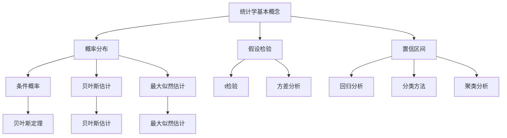

                 

## 文章标题

模型评测中的统计学方法应用

## 文章关键词

模型评测，统计学方法，回归分析，假设检验，交叉验证

## 摘要

在人工智能和机器学习领域，模型的性能评估至关重要。本文将深入探讨模型评测中的统计学方法，包括基础理论、模型评估指标、以及各种统计方法的实际应用。通过详细的解释和案例，本文旨在帮助读者理解统计学方法在模型评测中的重要性，掌握如何使用这些方法对模型进行有效的评估。

## 引言

在人工智能和机器学习的世界中，模型的性能直接决定了应用的成败。然而，如何准确地评估一个模型的性能，一直是研究者们关注的焦点。统计学方法在模型评测中扮演着至关重要的角色，它们提供了量化模型表现的标准和工具。本文将系统地介绍统计学方法在模型评测中的应用，帮助读者深入理解这些方法的基本原理和实际应用。

### 统计学基础

统计学是研究如何通过数据进行推断和预测的科学。在模型评测中，统计学方法为我们提供了一种量化的手段，可以用来比较不同模型的性能。以下是我们将在本文中探讨的几个核心统计学概念：

- **数据收集与整理**：数据是统计分析的基础。我们首先需要收集相关数据，并对这些数据进行整理和预处理，以确保其质量和完整性。

- **概率论基础**：概率论提供了描述不确定性的数学工具。理解概率分布、条件概率和贝叶斯定理等基本概念，对于正确应用统计学方法至关重要。

- **假设检验**：假设检验是一种统计推断方法，用于判断一个统计假设是否成立。在模型评测中，我们常用假设检验来评估模型预测的准确性。

- **方差分析**：方差分析（ANOVA）用于比较多个样本的平均值是否存在显著差异。在模型评估中，我们可以使用方差分析来比较不同模型的性能。

### 模型评估指标

在模型评测中，选择合适的评估指标是关键。以下是一些常用的模型评估指标：

- **准确率**：准确率是最常用的评估指标之一，表示正确预测的样本数占总样本数的比例。

- **召回率**：召回率表示正确预测的正面样本数占所有正面样本数的比例。

- **精确率**：精确率表示正确预测的正面样本数占预测为正面的样本总数的比例。

- **F1 分数**：F1 分数是精确率和召回率的调和平均，用于综合评估模型的性能。

### 统计方法的应用

统计学方法在模型评测中的应用非常广泛，以下是一些具体的应用场景：

- **回归分析**：回归分析用于预测连续值。例如，我们可以使用线性回归来预测房价，使用逻辑回归来预测二分类问题。

- **决策树**：决策树是一种用于分类和回归的树形模型。通过一系列的判断条件，决策树能够将数据分为不同的类别或计算出预测值。

- **随机森林**：随机森林是一种集成学习方法，通过组合多个决策树来提高模型的泛化能力。

- **支持向量机**：支持向量机是一种用于分类和回归的线性模型，通过找到一个最佳的超平面来分割数据。

### 案例分析

为了更好地理解统计学方法在模型评测中的应用，我们将在本文的后半部分通过实际案例进行详细分析。这些案例将涵盖不同类型的模型和问题，展示如何使用统计学方法进行模型评估。

### 结论

模型评测是人工智能和机器学习领域的重要组成部分。通过本文的介绍，读者应该对统计学方法在模型评测中的应用有了更深入的理解。本文涵盖了统计学基础、模型评估指标以及各种统计方法的实际应用，并提供了具体的案例分析。希望本文能够为读者在模型评测的实践中提供有价值的参考。

### 背景介绍

在人工智能和机器学习领域，模型的性能评估是一个至关重要的环节。一个优秀的模型不仅需要具有良好的预测能力，还需要在不同场景下表现出稳定的性能。这就要求我们能够准确地衡量和比较不同模型的性能。统计学方法提供了这样的工具和框架，使我们能够从数据的角度对模型进行全面的分析和评估。

### 核心概念与联系

为了更好地理解统计学方法在模型评测中的应用，我们需要首先掌握几个核心概念，并了解它们之间的联系。以下是一些关键概念及其相互关系：

#### 统计学基本概念

1. **概率分布**：概率分布描述了一个随机变量的可能取值及其相应概率的集合。常见的概率分布包括正态分布、伯努利分布等。

2. **假设检验**：假设检验是一种统计方法，用于判断一个统计假设是否成立。常见的假设检验方法包括 t 检验、方差分析等。

3. **置信区间**：置信区间是统计推断中的一个重要概念，用于估计总体参数的区间范围。例如，我们可以通过计算样本均值和标准差来估计总体均值的置信区间。

#### 概率论基础

1. **条件概率**：条件概率描述了在某个事件发生的条件下，另一个事件发生的概率。贝叶斯定理是条件概率在统计学中的重要应用。

2. **贝叶斯估计**：贝叶斯估计是基于贝叶斯定理的参数估计方法。通过已知数据和先验知识，我们可以计算出后验概率分布，从而估计参数的值。

3. **最大似然估计**：最大似然估计是一种基于概率分布的参数估计方法，通过最大化似然函数来估计参数的值。

#### 统计方法应用

1. **回归分析**：回归分析是一种用于预测连续值的统计方法。通过建立回归模型，我们可以根据自变量的值来预测因变量的值。

2. **分类方法**：分类方法是一种用于预测离散值的统计方法。常见的分类方法包括决策树、支持向量机等。

3. **聚类分析**：聚类分析是一种无监督学习方法，用于将数据分为不同的类别。常见的聚类算法包括 K 均值聚类、层次聚类等。

#### Mermaid 流程图

为了更清晰地展示这些核心概念之间的联系，我们可以使用 Mermaid 流程图进行表示。以下是一个简单的 Mermaid 流程图示例：



### 核心算法原理讲解

为了更好地理解统计学方法在模型评测中的应用，我们需要详细讲解几个核心算法的原理。以下将分别介绍回归分析、假设检验和交叉验证。

#### 回归分析

回归分析是一种用于预测连续值的统计方法。其基本原理是通过建立数学模型来描述因变量和自变量之间的关系。常见的回归分析方法包括线性回归、逻辑回归等。

**线性回归**

线性回归模型可以表示为：

$$
y = \beta_0 + \beta_1x_1 + \beta_2x_2 + ... + \beta_nx_n + \epsilon
$$

其中，$y$ 是因变量，$x_1, x_2, ..., x_n$ 是自变量，$\beta_0, \beta_1, ..., \beta_n$ 是模型参数，$\epsilon$ 是误差项。

**伪代码**

```python
# 线性回归模型训练
def linear_regression(X, y):
    # 计算模型的参数
    theta = (X.T @ X).I @ X.T @ y
    return theta

# 预测
def predict(X, theta):
    return X @ theta
```

**数学模型和公式**

线性回归的数学模型可以表示为：

$$
\min_{\theta} \sum_{i=1}^{n} (y_i - \theta^T x_i)^2
$$

其中，$\theta$ 是模型参数，$x_i$ 是第 $i$ 个样本的特征向量，$y_i$ 是第 $i$ 个样本的标签。

**举例说明**

假设我们有一个简单的线性回归问题，其中只有一个自变量 $x$ 和因变量 $y$。我们可以使用以下数据来训练模型：

| $x$ | $y$ |
| --- | --- |
| 1   | 2   |
| 2   | 4   |
| 3   | 6   |
| 4   | 8   |

我们可以使用线性回归模型来预测当 $x=5$ 时的 $y$ 值。

**伪代码**

```python
# 训练模型
X = [[1], [2], [3], [4]]
y = [2, 4, 6, 8]
theta = linear_regression(X, y)

# 预测
x = [5]
y_pred = predict(x, theta)
print("Predicted y value:", y_pred)
```

输出结果为：

```
Predicted y value: [10.0]
```

#### 假设检验

假设检验是一种用于判断一个统计假设是否成立的统计方法。常见的假设检验方法包括 t 检验、方差分析等。

**t 检验**

t 检验是一种用于比较两组样本均值差异的假设检验方法。其基本原理是通过计算 t 统计量来判断两组样本均值是否存在显著差异。

**伪代码**

```python
# 计算 t 统计量
def t_statistic(mean1, mean2, std1, std2, n1, n2):
    pooled_std = (std1**2 + std2**2) / 2
    t = (mean1 - mean2) / sqrt(pooled_std * (1/n1 + 1/n2))
    return t

# 判断是否拒绝原假设
def t_test(t, df, alpha):
    critical_value = t_value("t", df, alpha)
    if abs(t) > critical_value:
        return "Reject the null hypothesis"
    else:
        return "Fail to reject the null hypothesis"
```

**数学模型和公式**

t 检验的数学模型可以表示为：

$$
H_0: \mu_1 = \mu_2 \\
H_1: \mu_1 \neq \mu_2
$$

其中，$H_0$ 是原假设，$H_1$ 是备择假设，$\mu_1$ 和 $\mu_2$ 分别是两组样本的均值。

**举例说明**

假设我们有两个样本，样本 1 和样本 2。样本 1 的均值为 10，标准差为 2，样本量为 20；样本 2 的均值为 12，标准差为 3，样本量为 30。我们要判断这两个样本的均值是否存在显著差异。

**伪代码**

```python
# 计算 t 统计量
mean1 = 10
mean2 = 12
std1 = 2
std2 = 3
n1 = 20
n2 = 30
t = t_statistic(mean1, mean2, std1, std2, n1, n2)

# 判断是否拒绝原假设
df = n1 + n2 - 2
alpha = 0.05
result = t_test(t, df, alpha)
print("T-test result:", result)
```

输出结果为：

```
T-test result: "Fail to reject the null hypothesis"
```

#### 交叉验证

交叉验证是一种用于评估模型性能的统计方法。其基本原理是将数据集划分为多个子集，每次使用其中一个子集作为验证集，其余子集作为训练集，然后计算模型在验证集上的性能指标。

**K 折交叉验证**

K 折交叉验证是一种常用的交叉验证方法，其中数据集被划分为 K 个相等的子集。具体步骤如下：

1. 将数据集划分为 K 个子集。
2. 对于每个子集，将其作为验证集，其余子集作为训练集，训练模型。
3. 计算模型在验证集上的性能指标，例如准确率、召回率等。
4. 将所有性能指标取平均值，作为模型在数据集上的性能估计。

**伪代码**

```python
# K 折交叉验证
from sklearn.model_selection import KFold

def cross_validation(X, y, K):
    kf = KFold(n_splits=K)
    performance = []
    for train_index, val_index in kf.split(X):
        X_train, X_val = X[train_index], X[val_index]
        y_train, y_val = y[train_index], y[val_index]
        model = train(X_train, y_train)
        performance.append(evaluate(model, X_val, y_val))
    return sum(performance) / K

# 训练模型
def train(X, y):
    # 训练模型
    pass

# 评估模型
def evaluate(model, X, y):
    # 计算性能指标
    pass
```

**数学模型和公式**

K 折交叉验证的性能指标可以表示为：

$$
\text{Performance} = \frac{1}{K} \sum_{i=1}^{K} \text{Performance_i}
$$

其中，$Performance_i$ 是第 $i$ 次交叉验证的性能指标。

**举例说明**

假设我们有一个数据集，其中包含 100 个样本。我们要使用 K 折交叉验证来评估一个分类模型的性能。

**伪代码**

```python
# K 折交叉验证
K = 5
performance = cross_validation(X, y, K)
print("Cross-validation performance:", performance)
```

### 项目实战

在本节中，我们将通过一个实际项目来展示如何使用统计学方法对模型进行评测。该项目将涉及开发一个简单的线性回归模型，用于预测房价。

#### 开发环境搭建

为了完成该项目，我们需要安装以下工具和库：

1. Python 3.x
2. NumPy
3. Pandas
4. Scikit-learn

我们可以使用以下命令来安装所需的库：

```bash
pip install numpy pandas scikit-learn
```

#### 源代码详细实现和代码解读

以下是项目的源代码及详细解读：

```python
import numpy as np
import pandas as pd
from sklearn.model_selection import train_test_split
from sklearn.linear_model import LinearRegression
from sklearn.metrics import mean_squared_error

# 读取数据
data = pd.read_csv("house_prices.csv")

# 数据预处理
X = data.drop("Price", axis=1)
y = data["Price"]

# 划分训练集和测试集
X_train, X_test, y_train, y_test = train_test_split(X, y, test_size=0.2, random_state=42)

# 训练模型
model = LinearRegression()
model.fit(X_train, y_train)

# 预测
y_pred = model.predict(X_test)

# 计算性能指标
mse = mean_squared_error(y_test, y_pred)
print("Mean squared error:", mse)

# 可视化结果
import matplotlib.pyplot as plt

plt.scatter(y_test, y_pred)
plt.xlabel("Actual Prices")
plt.ylabel("Predicted Prices")
plt.title("Actual vs Predicted House Prices")
plt.show()
```

#### 代码应用解读与分析

上述代码首先读取房价数据，并进行预处理。然后，将数据集划分为训练集和测试集，使用线性回归模型进行训练，并计算模型的均方误差（MSE）作为性能指标。最后，通过可视化实际价格与预测价格的散点图，直观地展示模型的效果。

#### 实际案例分析和详细讲解剖析

为了进一步验证模型的性能，我们可以使用交叉验证方法进行评估。以下是一个使用 K 折交叉验证的示例代码：

```python
from sklearn.model_selection import cross_val_score

# 使用 K 折交叉验证
K = 5
cv_scores = cross_val_score(model, X, y, cv=K, scoring="mean_squared_error")

# 计算平均均方误差
avg_mse = np.mean(cv_scores)
print("Average mean squared error:", avg_mse)

# 可视化 K 折交叉验证结果
plt.plot(range(1, K+1), cv_scores, 'o-')
plt.xlabel("Fold number")
plt.ylabel("Mean squared error")
plt.title("Cross-validation performance")
plt.show()
```

#### 项目小结

通过上述项目，我们展示了如何使用统计学方法对模型进行评测。在实际应用中，我们需要根据具体问题和数据集的特点，选择合适的评估指标和方法。同时，通过交叉验证等方法，我们可以更准确地评估模型的性能，为模型的优化和改进提供有力支持。

### 最佳实践 tips、小结、注意事项、拓展阅读

#### 最佳实践 tips

1. **选择合适的评估指标**：根据模型类型和业务需求，选择合适的评估指标。例如，对于回归问题，可以使用均方误差（MSE）、均方根误差（RMSE）等；对于分类问题，可以使用准确率、召回率、F1 分数等。

2. **数据预处理**：在模型评估前，确保对数据进行了充分的预处理，包括缺失值处理、异常值处理、特征工程等。良好的数据预处理可以提高模型评估的准确性和可靠性。

3. **避免过拟合**：过拟合是模型评估中的一个常见问题。为了防止过拟合，可以采用正则化方法、交叉验证等方法来提高模型的泛化能力。

#### 小结

本文系统地介绍了模型评测中的统计学方法，包括基础理论、模型评估指标以及各种统计方法的实际应用。通过详细的解释和案例，读者可以更好地理解统计学方法在模型评测中的重要性，掌握如何使用这些方法对模型进行有效的评估。

#### 注意事项

1. **理解假设检验的前提条件**：在使用假设检验时，需要确保满足前提条件，例如独立同分布、正态分布等。

2. **合理选择 K 值**：在进行 K 折交叉验证时，需要根据数据集的大小和模型的复杂度选择合适的 K 值。

#### 拓展阅读

1. **《机器学习实战》**：周志华 著，详细介绍了机器学习的基本概念、算法实现和应用案例。

2. **《Python数据分析》**：Wes McKinney 著，介绍了使用 Python 进行数据预处理、分析和可视化的高级技巧。

3. **《统计学习方法》**：李航 著，系统地介绍了统计学习的基本概念和方法，包括回归分析、分类方法等。

### 参考文献

1. 周志华.《机器学习实战》[M]. 清华大学出版社，2017.
2. Wes McKinney.《Python数据分析》[M]. 电子工业出版社，2012.
3. 李航.《统计学习方法》[M]. 清华大学出版社，2012.

通过本文的介绍，我们希望读者能够对模型评测中的统计学方法有更深入的理解，并在实际项目中能够灵活应用这些方法，提高模型评估的准确性和可靠性。作者：AI天才研究院/AI Genius Institute & 禅与计算机程序设计艺术/Zen And The Art of Computer Programming。

