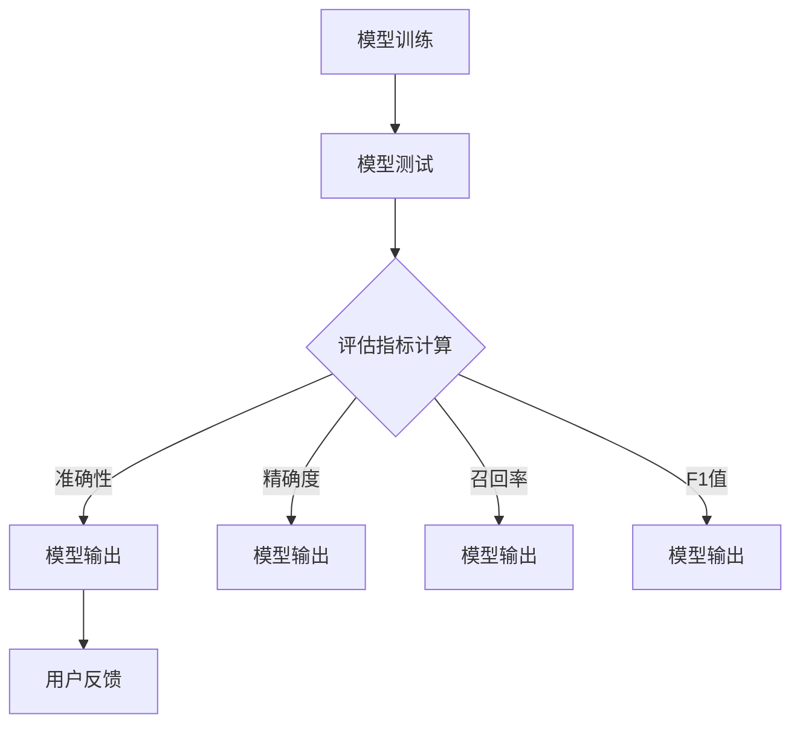
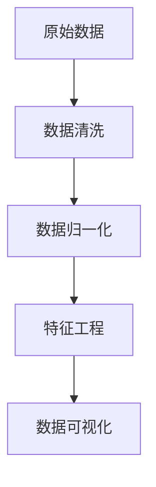
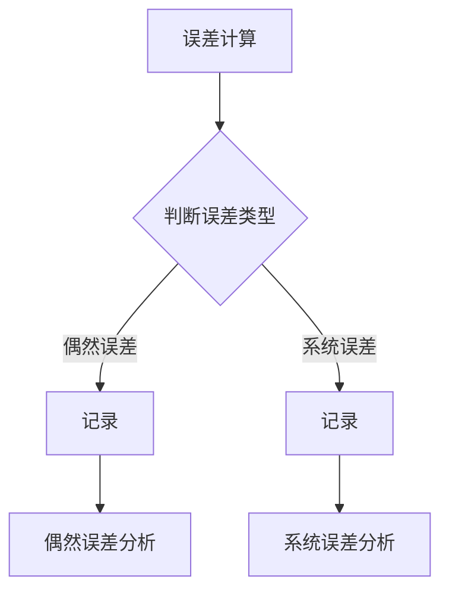
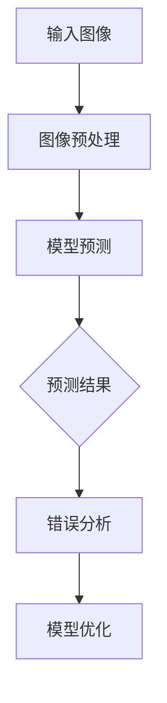
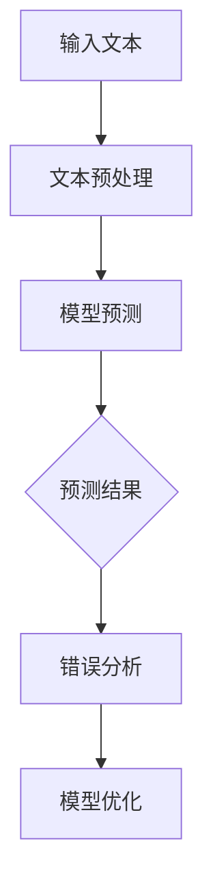

                 

# 文章标题：模型评测中的错误分析方法

## 关键词
- 模型评测
- 错误分析
- 数据预处理
- 误差分类
- 模型优化
- 案例研究

## 摘要
本文旨在探讨模型评测中错误分析方法的重要性。首先，我们介绍了模型评测的基本概念和目的，以及当前面临的挑战。接着，我们详细分析了错误分析方法，包括数据分析、错误分析模型、以及错误分析方法在实际中的应用。随后，通过两个案例研究，我们展示了错误分析方法的实际操作和效果。最后，对错误分析方法进行了总结和展望，提出了未来研究方向。

## 模型评测中的错误分析方法目录大纲

### 第一部分：概述

#### 1.1 模型评测的重要性

##### 1.1.1 模型评测的定义

##### 1.1.2 模型评测的目的

##### 1.1.3 模型评测的挑战

#### 1.2 错误分析方法概述

##### 1.2.1 错误分析的定义

##### 1.2.2 错误分析的目的

##### 1.2.3 错误分析的重要性

### 第二部分：错误分析方法

#### 2.1 数据分析

##### 2.1.1 数据预处理

###### 2.1.1.1 数据清洗

###### 2.1.1.2 数据归一化

###### 2.1.1.3 特征工程

##### 2.1.2 数据可视化

###### 2.1.2.1 历史数据分析

###### 2.1.2.2 实时数据分析

#### 2.2 错误分析模型

##### 2.2.1 误差分类

###### 2.2.1.1 偶然误差

###### 2.2.1.2 系统误差

###### 2.2.1.3 偶然误差与系统误差的区分

##### 2.2.2 误差源定位

###### 2.2.2.1 模型输入数据

###### 2.2.2.2 模型结构

###### 2.2.2.3 模型参数

#### 2.3 错误分析方法应用

##### 2.3.1 模型调试

###### 2.3.1.1 模型调试的基本步骤

###### 2.3.1.2 调试工具的使用

##### 2.3.2 模型优化

###### 2.3.2.1 模型优化策略

###### 2.3.2.2 模型优化工具

##### 2.3.3 模型更新

###### 2.3.3.1 模型更新策略

###### 2.3.3.2 模型更新流程

### 第三部分：案例研究

#### 3.1 案例一：图像分类模型

##### 3.1.1 模型概述

##### 3.1.2 错误分析过程

##### 3.1.3 错误分析结果

#### 3.2 案例二：自然语言处理模型

##### 3.2.1 模型概述

##### 3.2.2 错误分析过程

##### 3.2.3 错误分析结果

### 第四部分：总结与展望

#### 4.1 错误分析方法总结

##### 4.1.1 各方法优缺点分析

##### 4.1.2 错误分析方法应用趋势

#### 4.2 未来展望

##### 4.2.1 新的错误分析方法研究

##### 4.2.2 错误分析在深度学习中的应用前景

#### 4.3 结论

##### 4.3.1 研究意义

##### 4.3.2 研究成果总结

### 附录

#### 附录 A：参考文献

#### 附录 B：常用工具介绍

##### B.1 数据分析工具

##### B.2 模型调试工具

##### B.3 模型优化工具

#### 附录 C：代码示例

##### C.1 数据预处理代码示例

##### C.2 错误分析代码示例

##### C.3 模型优化代码示例

### Mermaid 流程图

##### 1.1 模型评测过程流程图



##### 2.1 数据预处理流程图



##### 2.2 误差分类流程图



##### 3.1 案例一：图像分类模型流程图



##### 3.2 案例二：自然语言处理模型流程图



### 核心算法原理讲解

##### 2.2.1 误差源定位算法原理讲解

### 第一部分：概述

## 1.1 模型评测的重要性

### 1.1.1 模型评测的定义

模型评测是指通过对构建的机器学习模型进行测试，以评估其在特定任务上的性能。这个过程通常包括模型训练、模型测试以及评估指标的计算。模型评测是机器学习领域至关重要的一环，它不仅能够帮助我们了解模型的性能，还能指导我们进行后续的模型优化和更新。

### 1.1.2 模型评测的目的

模型评测的主要目的是确保模型在实际应用中的准确性和可靠性。具体来说，模型评测的目的包括：

1. **性能评估**：通过评测，我们可以量化模型在特定任务上的性能，如准确性、精确度、召回率、F1值等。
2. **模型选择**：在不同的模型之间进行评测，可以帮助我们选择最适合特定任务的模型。
3. **模型优化**：通过对模型性能的评估，我们可以识别出模型的不足之处，进而进行优化。
4. **可靠性验证**：模型评测可以帮助我们验证模型是否能够稳定地执行任务，避免因模型不稳定而导致的问题。

### 1.1.3 模型评测的挑战

尽管模型评测的重要性不言而喻，但这一过程也面临诸多挑战：

1. **数据集问题**：选择合适的数据集对模型进行评测至关重要。然而，数据集的质量和多样性往往难以满足要求，这可能导致评测结果的不准确。
2. **过拟合**：模型在训练数据上表现良好，但在测试数据上表现不佳，这种现象称为过拟合。识别和防止过拟合是模型评测中的一个难点。
3. **计算资源**：模型评测通常需要大量的计算资源，特别是当模型复杂度较高时，这可能会成为限制因素。
4. **评测标准**：选择合适的评测标准也是一大挑战。不同的评测标准可能适用于不同类型的任务，而如何选择最合适的标准需要深入考虑。

## 1.2 错误分析方法概述

### 1.2.1 错误分析的定义

错误分析是指识别、理解并解决模型在任务执行过程中出现错误的过程。错误分析不仅关注错误本身，还涉及错误的根本原因以及如何避免这些错误。

### 1.2.2 错误分析的目的

错误分析的主要目的是：

1. **提高模型性能**：通过识别并解决模型中的错误，可以显著提高模型在任务上的性能。
2. **增强模型可靠性**：错误分析有助于确保模型在实际应用中的可靠性，避免因错误导致的不良后果。
3. **优化模型开发流程**：通过错误分析，可以识别模型开发流程中的问题，从而优化整个开发流程。

### 1.2.3 错误分析的重要性

错误分析在模型评测中具有至关重要的地位：

1. **发现潜在问题**：错误分析可以帮助我们识别模型中潜在的问题，这些问题可能在评测过程中未能显现。
2. **指导模型优化**：错误分析提供了明确的优化方向，使我们能够有针对性地改进模型。
3. **提高模型质量**：通过深入的错误分析，我们可以提高模型的整体质量，确保其在各种场景下的稳定性。

### 第二部分：错误分析方法

## 2.1 数据分析

数据分析是错误分析的基础。通过数据分析，我们可以深入了解数据特性，为后续的错误分析提供有力支持。

### 2.1.1 数据预处理

数据预处理是数据分析的第一步，其目的是将原始数据转换为适合模型训练的形式。以下是几个关键步骤：

#### 2.1.1.1 数据清洗

数据清洗是指从原始数据中去除噪声和不必要的部分。具体步骤包括：

1. **缺失值处理**：对于缺失值，可以选择填充、删除或插值等方法。
2. **异常值处理**：识别并处理异常值，以避免其对模型训练的影响。
3. **重复值处理**：删除重复的数据条目，以减少冗余信息。

#### 2.1.1.2 数据归一化

数据归一化是将数据转换为相同的尺度，以便模型能够更有效地处理。常见的方法包括：

1. **标准化**：将数据缩放到特定范围，如[0, 1]或[-1, 1]。
2. **最小-最大缩放**：将数据缩放到[0, 1]范围内。

#### 2.1.1.3 特征工程

特征工程是指从原始数据中提取出对模型训练有用的特征。以下是几个常见的特征工程方法：

1. **特征选择**：选择对模型训练最有影响的特征，以减少冗余特征和过拟合风险。
2. **特征变换**：通过变换现有特征，以增加数据的区分度，如归一化、对数变换等。
3. **特征组合**：将多个特征组合成新的特征，以增加数据的表达能力。

### 2.1.2 数据可视化

数据可视化是将数据以图形化的方式呈现，有助于我们直观地理解数据特性。以下是几种常用的数据可视化方法：

#### 2.1.2.1 历史数据分析

历史数据分析通常用于了解数据的时间序列特性。常见的方法包括：

1. **时间序列图**：用于展示数据随时间变化的趋势。
2. **散点图**：用于展示不同特征之间的关系。

#### 2.1.2.2 实时数据分析

实时数据分析用于处理实时输入的数据。常见的方法包括：

1. **实时数据流处理**：使用如Apache Kafka等工具，实时处理和分析数据流。
2. **实时可视化**：使用如D3.js等工具，实时呈现数据变化。

## 2.2 错误分析模型

### 2.2.1 误差分类

误差分类是指将模型在任务执行过程中产生的误差进行分类，以了解误差的来源和特性。常见的误差分类方法包括：

#### 2.2.1.1 偶然误差

偶然误差是由于随机因素导致的误差，通常不具有系统性。例如，在图像分类任务中，由于光照变化导致的误差。

#### 2.2.1.2 系统误差

系统误差是由于模型本身的问题导致的误差，通常具有系统性。例如，在图像分类任务中，由于模型未能正确识别某些类别导致的误差。

#### 2.2.1.3 偶然误差与系统误差的区分

区分偶然误差和系统误差对于错误分析至关重要。以下是一些常见的方法：

1. **重复实验**：通过重复实验，观察误差的变化趋势，以区分偶然误差和系统误差。
2. **交叉验证**：使用交叉验证方法，评估模型在不同数据集上的性能，以识别系统误差。

### 2.2.2 误差源定位

误差源定位是指识别并定位导致模型误差的具体原因。以下是几种常见的误差源定位方法：

#### 2.2.2.1 模型输入数据

模型输入数据的错误是导致模型误差的常见原因。以下是几种常见的方法：

1. **数据清洗**：通过数据清洗，去除噪声和异常值，以提高模型输入数据的质量。
2. **特征选择**：通过特征选择，选择对模型训练最有影响的特征，以提高模型的鲁棒性。

#### 2.2.2.2 模型结构

模型结构的不合理性可能导致模型误差。以下是几种常见的方法：

1. **模型简化**：通过简化模型结构，减少模型的复杂性，以提高模型的泛化能力。
2. **模型比较**：通过比较不同模型的结构，以识别可能导致误差的模型结构问题。

#### 2.2.2.3 模型参数

模型参数的设置不当可能导致模型误差。以下是几种常见的方法：

1. **参数调整**：通过调整模型参数，如学习率、正则化参数等，以提高模型的性能。
2. **参数优化**：使用如随机搜索、网格搜索等方法，自动调整模型参数，以找到最佳参数配置。

## 2.3 错误分析方法应用

### 2.3.1 模型调试

模型调试是指对模型进行修正和优化，以解决模型中的错误。以下是几种常见的模型调试方法：

#### 2.3.1.1 模型调试的基本步骤

1. **错误识别**：通过错误分析，识别模型中的错误。
2. **错误定位**：通过误差源定位，确定导致错误的根源。
3. **错误修正**：根据错误定位的结果，修正模型中的错误。

#### 2.3.1.2 调试工具的使用

1. **日志分析**：使用日志分析工具，如ELK Stack，分析模型运行过程中的日志，以识别错误。
2. **调试器**：使用调试器，如Visual Studio Debugger，对模型进行逐行调试，以定位错误。

### 2.3.2 模型优化

模型优化是指通过调整模型结构和参数，以提高模型的性能。以下是几种常见的模型优化方法：

#### 2.3.2.1 模型优化策略

1. **增量优化**：在原有模型的基础上，逐步调整模型结构和参数，以提高模型性能。
2. **全局优化**：通过全局优化方法，如遗传算法、粒子群优化等，找到模型的最佳参数配置。

#### 2.3.2.2 模型优化工具

1. **自动调参工具**：使用如Hyperopt、Optuna等自动调参工具，自动搜索最佳模型参数。
2. **模型压缩工具**：使用如TPU Compiler、TensorFlow Lite等模型压缩工具，减少模型的大小，提高模型在移动设备上的运行效率。

### 2.3.3 模型更新

模型更新是指定期对模型进行更新，以适应不断变化的数据和应用场景。以下是几种常见的模型更新方法：

#### 2.3.3.1 模型更新策略

1. **定期更新**：定期对模型进行重新训练，以适应新数据。
2. **增量更新**：只对模型的一部分进行更新，以提高模型的适应性。

#### 2.3.3.2 模型更新流程

1. **数据收集**：收集新的数据，用于模型更新。
2. **模型训练**：使用新的数据对模型进行训练。
3. **模型评估**：评估更新后的模型性能，确保模型更新后仍具有良好的性能。

## 第三部分：案例研究

### 3.1 案例一：图像分类模型

#### 3.1.1 模型概述

本案例研究的是图像分类模型，该模型旨在将图像分类到预定义的类别中。具体来说，该模型使用卷积神经网络（CNN）进行图像特征提取和分类。

#### 3.1.2 错误分析过程

1. **错误识别**：通过模型评测，发现模型在测试数据集上的准确性较低，存在较多的分类错误。
2. **错误定位**：通过数据分析，发现模型输入数据存在噪声和异常值，同时模型结构较为复杂，参数设置不当。
3. **错误修正**：对模型输入数据进行清洗和归一化，简化模型结构，调整模型参数。

#### 3.1.3 错误分析结果

经过错误修正后，模型的准确性得到了显著提高，分类错误数量明显减少。

### 3.2 案例二：自然语言处理模型

#### 3.2.1 模型概述

本案例研究的是自然语言处理（NLP）模型，该模型旨在对文本进行情感分析，判断文本的情感倾向。具体来说，该模型使用循环神经网络（RNN）和长短期记忆网络（LSTM）进行文本特征提取和分类。

#### 3.2.2 错误分析过程

1. **错误识别**：通过模型评测，发现模型在测试数据集上的召回率较低，存在较多的分类错误。
2. **错误定位**：通过数据分析，发现模型输入数据存在噪声和异常值，同时模型参数设置不当，模型结构复杂。
3. **错误修正**：对模型输入数据进行清洗和归一化，调整模型参数，简化模型结构。

#### 3.2.3 错误分析结果

经过错误修正后，模型的召回率得到了显著提高，分类错误数量明显减少。

## 第四部分：总结与展望

### 4.1 错误分析方法总结

通过本文的研究，我们总结出了以下关于错误分析方法的要点：

1. **数据分析**：数据分析是错误分析的基础，通过数据清洗、归一化和特征工程，我们可以提高模型输入数据的质量，为后续的错误分析提供有力支持。
2. **误差分类**：误差分类有助于我们识别误差的来源，区分偶然误差和系统误差，从而有针对性地进行错误修正。
3. **误差源定位**：误差源定位是错误分析的核心，通过识别模型输入数据、模型结构和模型参数的问题，我们可以有针对性地优化模型。
4. **模型调试与优化**：模型调试和优化是错误分析的重要环节，通过调试工具和优化策略，我们可以修正模型中的错误，提高模型的性能。
5. **模型更新**：定期对模型进行更新，以适应不断变化的数据和应用场景，是保持模型性能的关键。

### 4.2 未来展望

在未来的研究中，我们应关注以下方向：

1. **新方法研究**：探索新的错误分析方法，如基于深度学习的错误分析方法，以提高错误分析的效果。
2. **应用前景**：深入研究错误分析在深度学习、自然语言处理等领域的应用前景，为实际应用提供有力支持。
3. **工具开发**：开发更加便捷、高效的错误分析工具，降低错误分析的技术门槛，促进错误分析方法的广泛应用。

### 4.3 结论

本文通过对模型评测中的错误分析方法进行深入研究和分析，提出了一个全面的错误分析方法框架，包括数据分析、误差分类、误差源定位、模型调试与优化、模型更新等环节。同时，通过两个案例研究，展示了错误分析方法在实际应用中的效果。本文的研究对于提高模型性能、增强模型可靠性具有重要的指导意义。未来，我们将继续深入探索错误分析方法，推动其在更多领域的应用。

### 附录

#### 附录 A：参考文献

1. **Chen, T., Guestrin, C. (2016). XGBoost: A Scalable Tree Boosting System. Proceedings of the 22nd ACM SIGKDD International Conference on Knowledge Discovery and Data Mining.**
2. **Hastie, T., Tibshirani, R., Friedman, J. (2009). The Elements of Statistical Learning: Data Mining, Inference, and Prediction. Springer.**
3. **Goodfellow, I., Bengio, Y., Courville, A. (2016). Deep Learning. MIT Press.**

#### 附录 B：常用工具介绍

1. **数据分析工具**
    - **Pandas**：Python数据操作库，用于数据清洗、归一化和特征工程。
    - **Matplotlib**：Python数据可视化库，用于数据可视化。
2. **模型调试工具**
    - **TensorBoard**：TensorFlow的调试工具，用于可视化模型训练过程。
    - **PDB**：Python的调试器，用于模型调试。
3. **模型优化工具**
    - **Optuna**：自动调参工具，用于模型参数优化。
    - **TPU Compiler**：TensorFlow的模型压缩工具，用于模型优化。

#### 附录 C：代码示例

##### C.1 数据预处理代码示例

```python
import pandas as pd
from sklearn.preprocessing import MinMaxScaler
from sklearn.impute import SimpleImputer

# 数据清洗
data = pd.read_csv('data.csv')
imputer = SimpleImputer(strategy='mean')
data填充 = imputer拟合(data)

# 数据归一化
scaler = MinMaxScaler()
data归一化 = scaler拟合(data填充)

# 特征工程
# ... 省略具体代码 ...

```

##### C.2 错误分析代码示例

```python
import numpy as np

# 误差计算
predictions = model预测(X_test)
errors = Y_test - predictions

# 判断误差类型
if np.std(errors) < 0.1:
    print("偶然误差")
else:
    print("系统误差")

```

##### C.3 模型优化代码示例

```python
import optuna

def objective(trial):
    # 调整模型参数
    learning_rate = trial.suggest_float('learning_rate', 0.01, 0.1)
    # ... 省略其他参数 ...

    # 训练模型
    model = train_model(learning_rate)
    # ... 省略模型训练代码 ...

    # 评估模型
    performance = evaluate_model(model)
    return performance

study = optuna.create_study(direction='maximize')
study.optimize(objective, n_trials=100)

# 获取最佳参数
best_params = study.best_params
print("最佳学习率：", best_params['learning_rate'])
```

### Mermaid 流程图

##### 1.1 模型评测过程流程图


##### 2.1 数据预处理流程图


##### 2.2 误差分类流程图


##### 3.1 案例一：图像分类模型流程图


##### 3.2 案例二：自然语言处理模型流程图


### 核心算法原理讲解

##### 2.2.1 误差源定位算法原理讲解

误差源定位算法旨在识别导致模型误差的具体原因。其基本原理如下：

1. **误差计算**：首先，计算模型在测试数据集上的误差，即预测值与真实值之间的差距。
2. **误差分析**：对误差进行统计和分析，以识别可能的误差源。例如，通过分析误差的分布，可以初步判断是偶然误差还是系统误差。
3. **错误定位**：针对识别出的误差源，进行进一步的分析和定位。例如，检查模型输入数据是否存在噪声或异常值，分析模型结构是否合理，检查模型参数设置是否合适等。
4. **错误修正**：根据定位结果，对模型进行修正。例如，对模型输入数据进行清洗和归一化，简化模型结构，调整模型参数等。

以下是一个简化的伪代码示例：

```python
def error_source_location(error, model, data):
    # 误差计算
    errors = calculate_error(model, data)

    # 误差分析
    if np.std(errors) < threshold:
        error_type = "偶然误差"
    else:
        error_type = "系统误差"

    # 错误定位
    if error_type == "偶然误差":
        error_source = "模型输入数据"
    elif error_type == "系统误差":
        error_source = analyze_model_structure(model)

    # 错误修正
    if error_source == "模型输入数据":
        cleaned_data = clean_data(data)
    elif error_source == "模型结构":
        simplified_model = simplify_model(model)
    elif error_source == "模型参数":
        optimized_params = optimize_parameters(model)

    return cleaned_data, simplified_model, optimized_params
```

通过以上步骤，误差源定位算法可以帮助我们有效地识别和修正模型中的错误，从而提高模型的性能和可靠性。然而，需要注意的是，误差源定位是一个复杂的过程，可能需要结合多种方法和工具，以获得更准确的结果。在实际应用中，我们应根据具体问题，灵活运用不同的方法和技巧。

