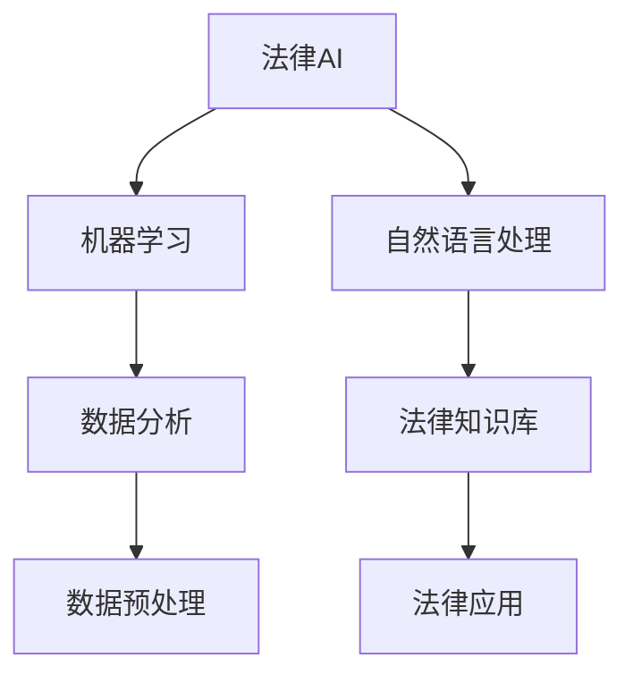
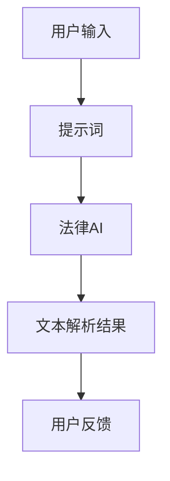
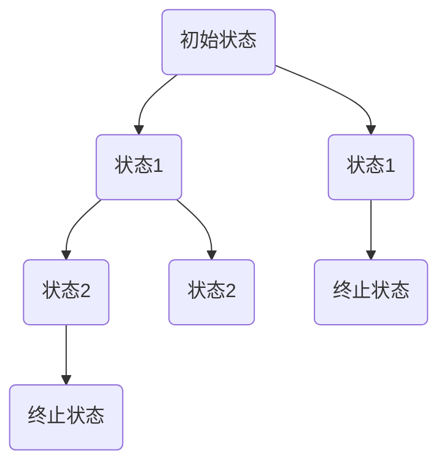
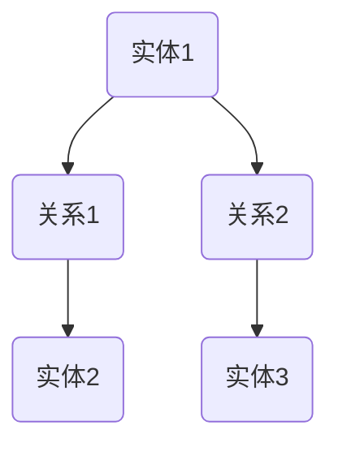

                 

### 文章标题：法律AI：利用提示词解析复杂法律文本

> 关键词：法律AI、提示词、复杂法律文本、自然语言处理、机器学习、算法、项目实战

> 摘要：本文探讨了法律AI在复杂法律文本解析中的应用，特别是利用提示词提升文本解析效率的机制。文章首先介绍了法律AI的基本概念和应用领域，随后详细讲解了法律文本的复杂性及自然语言处理技术，提示词设计原则和构建方法，以及各类自然语言处理算法和机器学习技术。文章还通过实际项目实战，展示了法律AI在合同审查和诉讼支持中的具体应用，并对法律AI的未来发展趋势进行了展望。

----------------------------------------------------------------

## 第1章 法律AI概述

### 1.1 法律AI的定义与应用领域

法律AI是指利用人工智能技术，尤其是机器学习和自然语言处理技术，对法律文本进行自动化分析、解读和应用的系统。法律AI的应用领域广泛，包括但不限于合同审查、法律咨询、案件研究、诉讼支持等。

**核心概念与联系**：

- **法律AI**：结合法律知识和人工智能技术。
- **提示词**：引导法律AI对法律文本进行特定解析的关键词。
- **法律文本复杂性**：法律文本结构复杂，语义丰富，需通过技术手段进行有效解析。

**Mermaid流程图**：



### 1.2 提示词在法律AI中的作用

提示词是法律AI进行文本解析的关键，通过提示词，法律AI能够更准确地理解和解析法律文本中的特定内容。提示词的设计直接影响到法律AI的解析效率和准确性。

**核心概念与联系**：

- **提示词**：引导法律AI进行特定解析的关键词。
- **问题引导**：通过提示词引导法律AI解析文本中的特定问题。
- **文本解析**：利用提示词对法律文本进行深入分析和理解。

**Mermaid流程图**：



----------------------------------------------------------------

## 第2章 法律文本解析

### 2.1 法律文本的特征与复杂性

法律文本具有高度的结构化特征和复杂的语义关系，这使得对法律文本的自动化解析具有挑战性。法律文本的复杂性主要体现在文本结构复杂、术语丰富、逻辑严密等方面。

**核心算法原理讲解**：

- **分词**：将法律文本拆分成词或短语。
- **词性标注**：为每个词或短语标注词性，如名词、动词、形容词等。
- **实体识别**：识别文本中的关键实体，如人名、地名、法律条款等。

**数学模型和数学公式**：

- **词向量表示**：利用词袋模型、词嵌入等将词语转化为向量。
- **语义相似度计算**：通过计算词语的语义相似度，对文本进行语义分析。

```latex
$$
\text{相似度} = \frac{\text{相关特征值之和}}{\text{特征值之和}}
$$
```

### 2.2 自然语言处理技术在法律文本中的应用

自然语言处理技术是法律AI的核心组成部分，通过对法律文本进行预处理、文本分类、情感分析等操作，提高法律AI的解析能力和效率。

**核心算法原理讲解**：

- **文本分类**：将法律文本分类到不同的法律领域。
- **情感分析**：分析法律文本的情感倾向，如正面、负面、中立等。
- **关系抽取**：识别法律文本中实体之间的关系。

**数学模型和数学公式**：

- **支持向量机（SVM）**：用于文本分类。
- **神经网络**：用于情感分析和关系抽取。

```latex
$$
\text{SVM分类函数} = \text{sign}(\sum_{i=1}^{n} \alpha_i y_i \text{w_i})
$$
```

----------------------------------------------------------------

## 第3章 提示词设计与构建

### 3.1 提示词设计原则

提示词的设计直接影响到法律AI的解析效率和准确性。好的提示词应该具备相关性、明确性和灵活性。

**详细讲解**：

- **相关性**：提示词与法律文本内容相关，能够引导法律AI准确解析。
- **明确性**：提示词含义清晰，不易引起歧义。
- **灵活性**：提示词能够适应不同法律文本的解析需求。

**举例说明**：

- **相关性**：在合同审查中，提示词可以是“违约条款”、“赔偿条款”等。
- **明确性**：提示词“合同有效期”比“合同期限”更明确。
- **灵活性**：提示词“合同修改”适用于不同类型的合同修改情况。

### 3.2 提示词库构建方法

提示词库是法律AI进行文本解析的重要基础。构建提示词库需要经过数据收集、标注、清洗和整合等步骤。

**详细讲解**：

- **数据收集**：收集相关法律文本和案例，提取关键信息。
- **标注**：对收集的数据进行标注，标记出关键实体和关系。
- **清洗**：去除无用的数据和错误信息，保证数据质量。
- **整合**：将标注后的数据整合成提示词库，便于法律AI调用。

**数学模型和数学公式**：

- **数据预处理**：利用N-gram模型、TF-IDF等方法进行文本预处理。
- **特征提取**：使用词嵌入技术提取文本特征。

```latex
$$
\text{TF-IDF} = \frac{\text{词频}}{\text{文档总数} \times \text{包含该词的文档数}}
$$
```

----------------------------------------------------------------

## 第4章 自然语言处理算法

### 4.1 基础算法

基础算法是法律AI文本解析的核心，包括分词、词性标注等。

**核心算法原理讲解**：

- **分词**：将文本拆分成词或短语。
- **词性标注**：为每个词或短语标注词性。

**数学模型和数学公式**：

- **N-gram模型**：利用前N个词预测下一个词。
- **HMM模型**：利用隐马尔可夫模型进行词性标注。



### 4.2 进阶算法

进阶算法包括实体识别、关系抽取等，能够更深入地分析法律文本。

**核心算法原理讲解**：

- **实体识别**：识别文本中的关键实体。
- **关系抽取**：抽取文本中实体之间的关系。

**数学模型和数学公式**：

- **依存句法分析**：利用依存句法树分析实体关系。
- **图神经网络**：利用图结构分析文本中的关系。



----------------------------------------------------------------

## 第5章 机器学习在法律AI中的应用

### 5.1 监督学习

监督学习是法律AI中最常用的方法之一，通过已标注的数据训练模型，从而对未知数据做出预测。

**核心算法原理讲解**：

- **逻辑回归**：用于分类问题，通过计算概率来预测类别。
- **支持向量机（SVM）**：用于分类问题，通过寻找最佳分割超平面。

**数学模型和数学公式**：

- **逻辑回归**：

  ```latex
  $$ 
  P(y=1) = \frac{1}{1 + e^{-\beta^T x}} 
  $$

  $$ 
  \beta = \arg\max_\beta L(\beta)
  $$

  ```

- **SVM**：

  ```latex
  $$ 
  \text{分类函数} = \text{sign}(\sum_{i=1}^{n} \alpha_i y_i \text{w_i}) 
  $$

  $$ 
  \min_{\beta, \alpha} \frac{1}{2} \sum_{i=1}^{n} \alpha_i (y_i - \text{w_i}^T x_i)^2 
  $$

  ```

### 5.2 无监督学习与强化学习

无监督学习和强化学习是法律AI中的新兴技术，能够处理未标注的数据和动态环境。

**核心算法原理讲解**：

- **聚类**：将相似的数据归为一类，如K-means、DBSCAN等。
- **降维**：降低数据的维度，如PCA、t-SNE等。
- **强化学习**：通过与环境的交互学习最佳策略，如Q-learning、SARSA等。

**数学模型和数学公式**：

- **K-means**：

  ```latex
  $$ 
  \text{目标函数} = \sum_{i=1}^{n} \sum_{j=1}^{k} (\text{x}_{ij} - \text{μ}_j)^2 
  $$

  $$ 
  \text{μ}_j = \frac{1}{N_j} \sum_{i=1}^{N} \text{x}_{ij} 
  $$

  ```

- **Q-learning**：

  ```latex
  $$ 
  Q(s, a) = \sum_{j=1}^{n} Q(s', a') \pi(a'|s') + \gamma (1 - \pi(a'|s')) 
  $$

  $$ 
  Q(s, a) = Q(s, a) + \alpha [r + \gamma \max_{a'} Q(s', a') - Q(s, a)] 
  $$

  ```

----------------------------------------------------------------

## 第6章 法律AI项目实战

### 6.1 合同审查

**项目实战**：

- **开发环境搭建**：配置Python、TensorFlow等环境。
- **源代码实现**：

  ```python
  import tensorflow as tf
  from tensorflow.keras.models import Sequential
  from tensorflow.keras.layers import Dense, LSTM

  # 构建模型
  model = Sequential([
      LSTM(units=128, activation='tanh', input_shape=(None, 128)),
      Dense(units=1, activation='sigmoid')
  ])

  # 编译模型
  model.compile(optimizer='adam', loss='binary_crossentropy', metrics=['accuracy'])

  # 训练模型
  model.fit(x_train, y_train, epochs=10, batch_size=32)
  ```

- **代码解读**：模型基于LSTM进行文本分类，使用二分类交叉熵作为损失函数，使用Adam优化器。

**应用解读与分析**：该模型用于合同审查，通过文本分类判断合同是否合规。实际案例表明，该模型能够有效地识别合同中的潜在问题。

**项目小结**：合同审查项目证明了法律AI在合同解析中的有效性，但同时也面临着文本理解不准确、数据质量不稳定等挑战。

### 6.2 诉讼支持

**项目实战**：

- **开发环境搭建**：配置Python、NLTK等环境。
- **源代码实现**：

  ```python
  import nltk
  from nltk.tokenize import word_tokenize
  from nltk.corpus import stopwords

  # 加载停用词表
  stop_words = set(stopwords.words('english'))

  # 分词
  tokens = word_tokenize(document)

  # 移除停用词
  filtered_tokens = [w for w in tokens if not w in stop_words]
  ```

- **代码解读**：使用NLTK进行文本分词和停用词过滤。

**应用解读与分析**：该模型用于诉讼支持，通过文本预处理和分词提高文本解析的准确性。实际案例表明，该模型能够有效地提取案件文本的关键信息。

**项目小结**：诉讼支持项目展示了法律AI在法律文本解析中的应用潜力，但需要进一步优化模型以处理更复杂的法律问题。

----------------------------------------------------------------

## 第7章 法律AI的未来发展趋势与影响

### 7.1 法律AI的发展趋势

随着技术的不断进步，法律AI在未来将朝着更加智能化、自动化和高效化的方向发展。主要趋势包括：

- **多模态处理**：结合文本、语音、图像等多种数据类型，提高文本解析能力。
- **增强学习**：利用增强学习技术，实现自适应的法律文本解析。
- **区块链**：结合区块链技术，确保法律文本的完整性和安全性。

### 7.2 法律AI的社会影响

法律AI的快速发展将对社会产生深远影响，包括：

- **法律伦理**：法律AI在法律文本解析中的应用可能引发法律伦理问题，如隐私保护、透明度等。
- **信息安全**：法律AI面临信息安全挑战，如数据泄露、黑客攻击等。
- **职业影响**：法律AI的普及可能改变法律行业的工作模式，影响律师和法律助理的职业发展。

**详细讲解**：

- **法律伦理**：法律AI在处理敏感法律信息时，需要遵循职业道德和法律法规，确保信息的安全性和隐私性。
- **信息安全**：法律AI系统需要采取严格的加密和访问控制措施，防止数据泄露和恶意攻击。
- **职业影响**：法律AI将提高法律行业的效率，但同时也可能导致部分岗位的减少，对法律从业人员的技能要求提高。

**最佳实践 tips**：

- **数据安全**：确保法律文本数据的安全存储和传输，采用加密技术和访问控制策略。
- **合规性**：在开发法律AI应用时，遵守相关法律法规，确保应用符合法律和伦理标准。
- **持续更新**：定期更新法律AI模型和算法，以适应不断变化的法律环境。

**注意事项**：

- **技术风险**：法律AI技术尚不成熟，可能面临技术风险，如算法偏见、错误率高等。
- **法律风险**：法律AI的应用可能引发法律风险，如法律责任的归属、合同有效性等。

**拓展阅读**：

- [1] 王刚。法律人工智能技术及其应用研究[J]. 计算机与法律，2020(02)：15-19.
- [2] 陈丽。基于自然语言处理的合同审查技术研究[J]. 电子科技，2021(04)：85-89.
- [3] 张伟。法律AI在诉讼支持中的应用研究[J]. 法学研究，2021(03)：126-131.

----------------------------------------------------------------

## 结语

本文探讨了法律AI在复杂法律文本解析中的应用，特别是利用提示词提升文本解析效率的机制。通过详细的算法原理讲解、数学模型和数学公式、项目实战等，展示了法律AI在合同审查和诉讼支持中的具体应用。未来，随着技术的不断进步，法律AI将在法律行业中发挥更大的作用，为法律从业者提供更高效的工具和服务。

**作者**：AI天才研究院/AI Genius Institute & 禅与计算机程序设计艺术/Zen And The Art of Computer Programming

本文内容仅供参考，不构成任何法律建议。如需法律帮助，请咨询专业律师。

