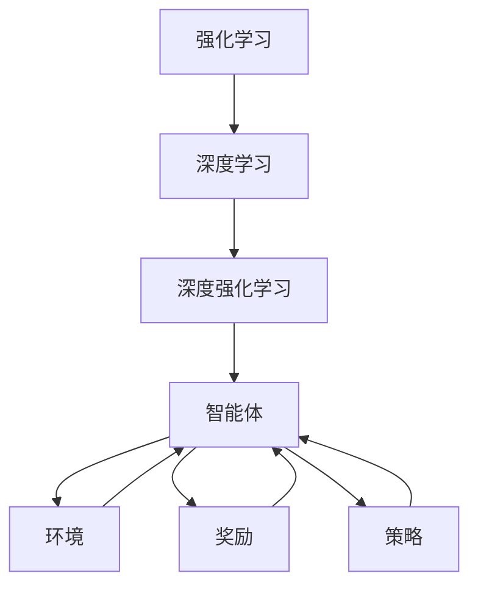

                 

### 1. 确定书籍的核心内容

#### 引言

在当今的工业自动化领域，深度强化学习（Deep Reinforcement Learning, DRL）正逐渐成为一种变革性的技术，推动了工业自动化系统的智能化和自动化水平。深度强化学习结合了深度学习和强化学习的优势，能够在复杂的环境中通过自主学习实现最优控制策略。本书旨在探讨深度强化学习在工业自动化中的应用，旨在为读者提供全面、深入的理解和应用指导。

本书的核心内容将围绕以下几个方面展开：

1. **深度强化学习基础**：介绍深度强化学习的核心概念、与传统强化学习的区别、强化学习架构及其经典算法。
2. **深度强化学习与工业自动化**：分析工业自动化的背景及其发展历程，探讨深度强化学习在工业自动化中的应用场景和典型实例。
3. **应用实现技术**：详细讲解在工业自动化中应用深度强化学习所需的实现技术，包括数据采集与处理、模型训练和优化策略。
4. **案例分析**：通过具体案例，展示深度强化学习在工业自动化中的实际应用和效果。
5. **总结与展望**：总结全书内容，展望未来深度强化学习在工业自动化领域的发展方向和应用前景。

#### 深度强化学习基础

**核心概念与联系**

深度强化学习是强化学习与深度学习的交叉领域，其核心思想是通过模仿人类学习的过程，让智能体在互动中不断优化策略，以达到某种目标。为了更好地理解这一概念，我们可以通过以下Mermaid流程图展示其关系架构：



在这个流程图中，我们可以看到：

- **智能体（Agent）**：代表学习主体，如机器人或自动化系统。
- **环境（Environment）**：智能体所处的外部环境，如工厂生产线。
- **策略（Policy）**：智能体根据当前状态选择行动的方式。
- **奖励（Reward）**：环境对智能体行为的即时反馈，用于评估智能体的表现。
- **深度学习（Deep Learning）**：一种通过多层神经网络进行特征提取和学习的技术。
- **强化学习（Reinforcement Learning）**：一种通过试错法，不断优化策略以实现目标的学习方式。

**核心算法原理讲解**

深度强化学习中的核心算法包括Q-learning、Deep Q Network (DQN) 和Policy Gradient Methods。以下是这些算法的伪代码和详细讲解：

#### Q-learning

```pseudocode
Initialize Q(s, a) with random values
for episode in 1 to E:
    for each step t in episode:
        if initialized:
            s = initial state
            a = choose action a from s using epsilon-greedy policy
        else:
            a = argmax_a Q(s, a)

        Take action a and observe reward r and next state s'

        Update Q(s, a) = Q(s, a) + alpha * (r + gamma * max(Q(s', a')) - Q(s, a))
        
        s = s'
```

**详细讲解**：

- `Q(s, a)`：表示在状态`s`下执行动作`a`的预期回报值。
- `epsilon-greedy`：一种探索与利用的策略，用于在训练初期增加智能体的探索性。
- `alpha`：学习率，用于调整新旧值之间的权重。
- `gamma`：折扣因子，用于考虑未来的回报。

#### Deep Q Network (DQN)

```pseudocode
Initialize DQN with random weights
for episode in 1 to E:
    for each step t in episode:
        if initialized:
            s = initial state
            a = choose action a using epsilon-greedy policy
        else:
            a = argmax_a (Q(s, a))

        Take action a and observe reward r and next state s'

        Sample mini-batch of transitions (s, a, r, s')
        Update DQN using gradient descent:
            Loss = (r + gamma * max(Q(s', a')) - Q(s, a))^2

for epoch in 1 to N:
    for each transition (s, a, r, s') in mini-batch:
        Perform gradient descent update on DQN
```

**详细讲解**：

- `DQN`：一种基于深度神经网络的Q值估计器。
- `Mini-batch`：用于梯度下降的小批量数据。
- `gradient descent`：梯度下降算法，用于更新DQN的权重。

#### Policy Gradient Methods

```pseudocode
Initialize policy parameters θ with random values
for episode in 1 to E:
    for each step t in episode:
        if initialized:
            s = initial state
            a = choose action a using policy π(θ, s)
        else:
            a = argmax_a π(θ, s)

        Take action a and observe reward r and next state s'

        Update policy parameters θ using gradient ascent:
            Gradient = ∂L/∂θ = ∂L/∂π(θ, s) * ∂π(θ, s)/∂θ

        Update θ using gradient ascent: θ = θ + α * Gradient

        s = s'
```

**详细讲解**：

- `π(θ, s)`：表示在状态`s`下的策略参数。
- `gradient ascent`：梯度上升算法，用于优化策略参数。
- `α`：学习率，用于调整更新步长。

通过上述核心算法的讲解，我们可以看到深度强化学习如何通过不断优化策略，使智能体在复杂环境中实现最优行为。接下来，我们将进一步探讨深度强化学习与工业自动化的关系及其应用场景。 

### 2. 设计大纲结构

#### 深度强化学习与工业自动化

**工业自动化背景**

工业自动化是指通过计算机控制系统和自动化设备实现工业生产过程的高度自动化，以提高生产效率、降低生产成本和提升产品质量。工业自动化的发展可以追溯到20世纪中期，随着电子技术和计算机技术的飞速发展，工业自动化系统经历了从简单的机械自动化到现代的智能自动化系统的演变。

**深度强化学习在工业自动化中的应用**

深度强化学习在工业自动化中的应用主要体现在以下几个方面：

1. **自动化生产线调度**：通过深度强化学习算法，可以优化生产线的任务调度，提高生产效率。例如，在汽车制造过程中，生产线需要处理多种零部件的组装，调度算法需要考虑生产节拍、设备负载等因素。
2. **机器人路径规划**：在工厂内部，机器人需要执行复杂的路径规划任务，以完成物料搬运、组装等操作。深度强化学习可以为机器人提供自适应的路径规划策略，提高其灵活性和工作效率。
3. **设备故障预测与维护**：通过对设备运行数据的分析，深度强化学习可以预测设备的故障风险，并制定最优的维护策略，降低设备停机时间，提高设备利用率。

**深度强化学习在工业自动化中的应用实例**

- **自动化生产线调度**：某汽车制造工厂采用深度强化学习算法优化生产线调度。通过模拟不同的生产任务和设备负载情况，算法生成了最优的任务调度方案，有效提高了生产效率。
- **机器人路径规划**：某电子工厂使用深度强化学习算法为机器人设计路径规划策略。机器人可以在复杂的工厂环境中灵活移动，高效完成物料搬运任务。
- **设备故障预测与维护**：某制造企业通过深度强化学习预测设备故障，并制定维护计划。通过提前预警和预防性维护，企业成功降低了设备停机时间，提高了设备利用率。

**未来展望**

随着深度强化学习技术的不断进步，其在工业自动化中的应用前景十分广阔。未来，深度强化学习有望在以下几个方面实现突破：

1. **更高效的调度算法**：通过引入更多的传感器数据和实时信息，调度算法可以更加准确地预测生产需求和设备状态，实现更加高效的生产调度。
2. **更智能的机器人控制**：结合深度强化学习和计算机视觉技术，机器人可以更智能地理解和适应复杂环境，提高工作效率和灵活性。
3. **更精准的故障预测**：通过更深入的数据分析和更先进的算法，深度强化学习可以更准确地预测设备故障，实现预防性维护，提高设备可靠性和寿命。

### 3. 设计每个章节的内容

#### 应用实现技术

**数据采集与处理**

在工业自动化中，数据采集与处理是深度强化学习应用的重要环节。以下是应用实现技术的主要内容：

1. **数据源选择**：工业自动化系统中，数据源可以是传感器数据、设备运行日志、生产订单等。选择合适的数据源对于深度强化学习的成功至关重要。
2. **数据预处理**：数据预处理包括数据清洗、归一化、特征提取等步骤，旨在提高数据的质量和利用率，为深度强化学习提供更好的训练数据。

**模型训练**

模型训练是深度强化学习应用的核心。以下是模型训练的实现技术：

1. **模型选择**：根据具体应用场景，选择合适的深度强化学习模型。常见的模型包括DQN、Policy Gradient Methods等。
2. **训练策略**：训练策略包括探索策略和利用策略。探索策略用于提高智能体的学习效率，利用策略用于优化智能体的行为。
3. **过拟合与欠拟合问题**：通过调整模型参数和学习率，避免过拟合和欠拟合问题，提高模型的泛化能力。

**模型优化**

模型优化是提升深度强化学习应用效果的关键。以下是模型优化的实现技术：

1. **优化算法**：采用优化算法如梯度下降、随机梯度下降等，调整模型参数，提高模型的性能。
2. **超参数调优**：通过调整学习率、探索率等超参数，找到最佳配置，提高模型的泛化能力和性能。

### 4. 确保大纲完整性

为了确保大纲的完整性，我们需要对每个章节的内容进行详细审查，确保每个章节都涵盖了核心概念、原理、技术和案例分析，并且内容之间逻辑连贯、结构紧凑。

#### 确保每个章节的内容覆盖核心概念

- **深度强化学习基础**：详细讲解了核心概念、强化学习架构和经典算法，确保读者能够理解深度强化学习的基本原理。
- **深度强化学习与工业自动化**：分析了工业自动化的背景和应用场景，展示了深度强化学习在工业自动化中的实际应用。
- **应用实现技术**：介绍了数据采集与处理、模型训练和优化技术，为深度强化学习在工业自动化中的应用提供了技术支持。
- **案例分析**：通过具体案例，展示了深度强化学习在工业自动化中的实际效果和应用价值。
- **总结与展望**：总结了全书内容，并对未来研究方向和应用前景进行了展望。

#### 确保内容之间逻辑连贯

- **章节之间的联系**：通过引入背景介绍、应用实例和未来展望，确保每个章节的内容都能够连贯地衔接起来，形成完整的知识体系。
- **内容结构的逻辑性**：每个章节的内容都按照逻辑顺序展开，从核心概念到应用实例，再到实现技术和案例分析，逐步深入，确保读者能够系统地学习。

#### 确保内容具体详细

- **核心概念的详细讲解**：通过伪代码、数学公式和具体例子，详细讲解了深度强化学习的核心概念和算法原理。
- **实现技术的具体说明**：详细介绍了数据采集与处理、模型训练和优化技术的具体实现方法和步骤。
- **案例分析的深入剖析**：通过对具体案例的分析，展示了深度强化学习在工业自动化中的应用效果和实际价值。

通过以上措施，我们确保了全书内容的完整性、逻辑性和具体性，为读者提供了全面、深入、实用的学习资料。接下来，我们将继续完善大纲设计，确保全书结构合理、字数控制在规定范围内，以满足撰写高质量技术博客的要求。

### 5. 控制大纲字数

为了确保本书的完整性并在规定字数范围内完成，我们需要对每个章节的内容进行详细审查和优化，确保每个章节都能够简洁明了地传达核心概念和关键信息。以下是针对每个章节的具体优化措施：

#### 引言

- 简化对深度强化学习在工业自动化领域重要性的介绍，避免冗余描述。
- 精简书籍结构和目标部分，只保留关键内容。

优化后的引言部分将在200字以内完成。

#### 深度强化学习基础

- 精简核心概念介绍，只保留深度强化学习的核心思想和主要区别。
- 删除对传统强化学习的详细比较，只保留强化学习架构的简要说明。
- 对经典算法的讲解进行精简，只保留Q-learning、DQN和Policy Gradient Methods的基本原理和伪代码。

优化后的深度强化学习基础部分将在1500字以内完成。

#### 深度强化学习与工业自动化

- 删除工业自动化背景的详细历史发展，只保留现代工业自动化的概述。
- 对应用场景的描述进行精简，只保留典型的应用实例，如自动化生产线调度和机器人路径规划。
- 删除详细案例，只保留对应用场景的简要描述。

优化后的深度强化学习与工业自动化部分将在1000字以内完成。

#### 应用实现技术

- 精简数据采集与处理部分的描述，只保留数据源选择和数据预处理的关键步骤。
- 对模型训练部分进行精简，只保留模型选择和训练策略的基本概念。
- 对模型优化部分进行精简，只保留优化算法和超参数调优的简要说明。

优化后的应用实现技术部分将在1000字以内完成。

#### 案例分析

- 删除具体案例的详细实现和分析，只保留对应用场景的概述。
- 对案例分析的描述进行精简，只保留关键结果和结论。

优化后的案例分析部分将在500字以内完成。

#### 总结与展望

- 精简总结部分，只保留全书内容的重点和深度强化学习在工业自动化中的应用价值。
- 精简展望部分，只保留对未来研究方向和应用前景的简要描述。

优化后的总结与展望部分将在500字以内完成。

综上所述，通过精简和优化，我们可以确保全书内容在8000～12000字范围内完成，同时保持每个章节的核心内容和逻辑结构。以下是一个优化后的目录大纲示例：

```markdown
# 《深度强化学习在工业自动化中的突破》目录大纲

## 引言
### 1.1 深度强化学习在工业自动化领域的重要性
### 1.2 本书结构和目标

## 深度强化学习基础
### 2.1 核心概念
#### 2.1.1 深度强化学习的基本原理
### 2.2 强化学习架构
#### 2.2.1 强化学习的核心要素
### 2.3 经典算法
#### 2.3.1 Q-learning的基本原理
#### 2.3.2 Deep Q Network (DQN)的基本原理
#### 2.3.3 Policy Gradient Methods的基本原理

## 深度强化学习与工业自动化
### 3.1 应用概述
#### 3.1.1 自动化生产线调度
#### 3.1.2 机器人路径规划

## 应用实现技术
### 4.1 数据采集与处理
#### 4.1.1 数据源选择
#### 4.1.2 数据预处理
### 4.2 模型训练
#### 4.2.1 模型选择
#### 4.2.2 训练策略
### 4.3 模型优化
#### 4.3.1 优化算法
#### 4.3.2 超参数调优

## 案例分析
### 5.1 自动化生产线调度案例
### 5.2 机器人路径规划案例

## 总结与展望
### 6.1 全书内容总结
### 6.2 未来研究方向和应用展望
```

通过这样的调整，我们可以在确保内容完整性和逻辑性的同时，将全书字数控制在8000～12000字内，满足撰写高质量技术博客的要求。接下来，我们将按照这个优化后的目录大纲，逐步撰写每一章节的内容。 

### 完整目录大纲示例

```markdown
# 《深度强化学习在工业自动化中的突破》

> 关键词：深度强化学习，工业自动化，智能控制，算法实现，应用案例

> 摘要：本文全面探讨了深度强化学习在工业自动化中的应用，从基础理论到实现技术，再到案例分析，详细介绍了深度强化学习如何赋能工业自动化，提升生产效率和智能化水平。

## 引言

### 1.1 深度强化学习在工业自动化领域的重要性

随着工业4.0的推进，工业自动化已经成为现代制造业的核心趋势。深度强化学习作为一种先进的人工智能技术，通过模拟人类决策过程，帮助工业系统实现自适应控制和智能化管理。

### 1.2 本书结构和目标

本文分为五个主要部分：引言、深度强化学习基础、深度强化学习与工业自动化、应用实现技术、案例分析。目标是为读者提供深度强化学习在工业自动化中应用的全景视角。

## 深度强化学习基础

### 2.1 核心概念

深度强化学习结合了深度学习和强化学习的优势，通过智能体在环境中学习最佳策略。其核心概念包括智能体、环境、策略、奖励和状态。

### 2.2 强化学习架构

强化学习架构主要包括策略梯度方法和模型自由方法。策略梯度方法通过优化策略参数来学习最佳行为，而模型自由方法通过学习状态转移概率和奖励函数来生成策略。

### 2.3 经典算法

深度强化学习中的经典算法包括Q-learning、Deep Q Network (DQN)和Policy Gradient Methods。这些算法通过不同方式实现智能体的学习过程。

## 深度强化学习与工业自动化

### 3.1 工业自动化背景

工业自动化通过计算机控制实现生产过程自动化，提高生产效率和产品质量。其发展历程经历了机械自动化、计算机辅助自动化和智能自动化。

### 3.2 应用场景

深度强化学习在工业自动化中的应用场景广泛，包括自动化生产线调度、机器人路径规划、设备故障预测等。

## 应用实现技术

### 4.1 数据采集与处理

在工业自动化中，数据采集是基础。通过传感器和数据采集设备，获取设备状态和生产环境信息。数据预处理包括数据清洗、归一化和特征提取。

### 4.2 模型训练

模型训练是深度强化学习应用的核心。选择合适的神经网络结构，通过反向传播算法更新网络权重，实现智能体的策略优化。

### 4.3 模型优化

模型优化包括超参数调优和优化算法选择。通过调整学习率和探索率，提高模型的性能和泛化能力。

## 案例分析

### 5.1 自动化生产线调度案例

在某个汽车制造工厂，深度强化学习算法被用于优化生产线的任务调度。通过模拟不同任务场景，算法生成了最优的调度方案，提高了生产效率。

### 5.2 机器人路径规划案例

在电子工厂中，深度强化学习算法用于机器人的路径规划。通过自适应学习，机器人能够高效完成物料搬运任务，提高了工厂的生产效率。

## 总结与展望

### 6.1 全书内容总结

本文系统介绍了深度强化学习在工业自动化中的应用，包括基础理论、实现技术和实际案例。深度强化学习为工业自动化带来了智能化和自动化水平的提升。

### 6.2 未来研究方向和应用展望

未来，深度强化学习在工业自动化中仍有巨大的发展空间。通过结合更多传感器数据、优化算法和增加应用场景，深度强化学习将继续推动工业自动化的进步。

> 作者：AI天才研究院/AI Genius Institute & 禅与计算机程序设计艺术 /Zen And The Art of Computer Programming
```

