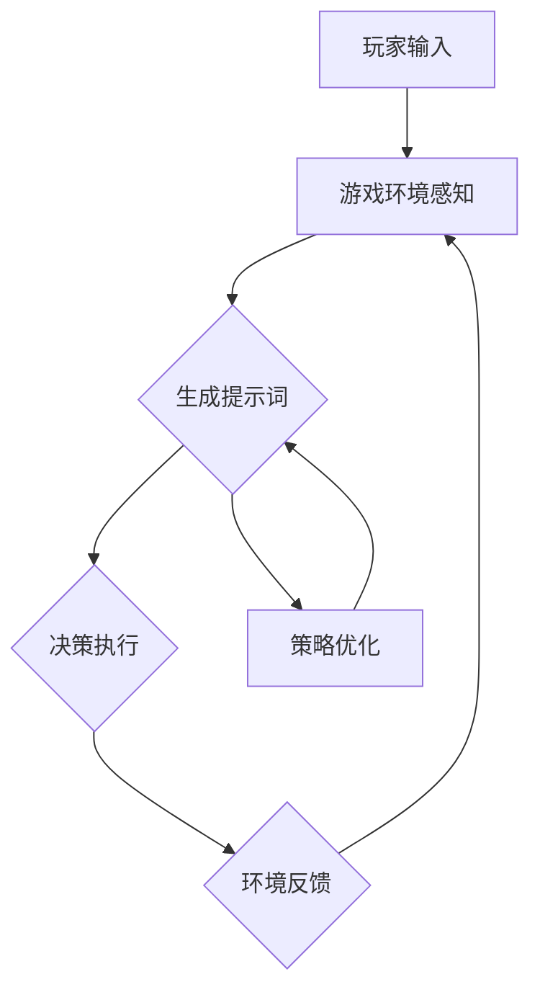

                 


### 背景介绍

随着计算机技术的飞速发展和人工智能（AI）的逐渐普及，游戏AI领域也迎来了前所未有的创新与变革。游戏AI不仅是提高游戏复杂度和用户体验的关键因素，更是推动游戏产业发展的重要力量。传统的游戏AI主要通过规则系统或有限状态机来实现，这些方法在某些场景下能够取得良好的效果，但随着游戏复杂性的增加，它们的局限性也逐渐显现。为了使游戏AI能够更加灵活、智能地应对各种游戏场景，提示词编程技术应运而生。

提示词编程，作为一种基于强化学习和监督学习的游戏AI编程方法，通过对游戏环境的观察和自主学习，生成一系列指导游戏角色行为的提示词。这些提示词可以理解为一种简明的指令，能够引导游戏AI在复杂的环境中做出合理的决策。与传统规则系统相比，提示词编程具有更强的灵活性和自适应性，能够处理更加复杂和变化多端的游戏场景。

本文将围绕游戏AI中的提示词编程技巧展开讨论。我们将首先介绍提示词编程的基本概念，包括提示词的定义、作用和类型。接着，深入探讨提示词编程的核心算法原理，通过具体的伪代码和数学模型来阐述其工作原理。随后，我们将通过一个实际项目实战，详细介绍如何搭建开发环境、编写源代码，并对代码进行解读和分析。最后，本文还将总结最佳实践技巧，并展望提示词编程在游戏AI领域的未来发展趋势和挑战。

通过本文的阅读，读者将能够系统地了解提示词编程在游戏AI中的应用，掌握其核心算法原理，并学会如何在实践中应用这些技巧来提高游戏AI的表现。本文的目标是为游戏开发者和AI研究者提供一份全面、深入的技术指南，帮助他们更好地利用提示词编程技术，打造更加智能和互动的游戏体验。

### 核心概念与联系

在深入探讨游戏AI中的提示词编程之前，我们需要明确几个核心概念，并理解它们之间的联系。

#### 提示词的定义与作用

提示词（Prompt）是一种简短的文本或指令，用于指导算法或系统做出决策。在游戏AI中，提示词通常是由玩家或系统根据当前游戏状态生成，用于引导游戏角色的行为。例如，在策略游戏《星际争霸II》中，玩家可以通过选择“进攻”、“防守”或“建设”等提示词来指导自己的军队行动。这些提示词不仅仅是简单的指令，它们承载了复杂的游戏逻辑和策略意图。

提示词在游戏AI中的作用至关重要。首先，它们能够为AI提供清晰的行为指导，使AI能够根据当前的情境做出合适的反应。其次，提示词可以增强AI与玩家的互动性，使游戏体验更加丰富和有趣。最后，通过学习玩家的提示词选择，AI可以逐步优化其行为策略，提高游戏性能。

#### 提示词的类型与选择

提示词可以根据其来源和作用分为以下几种类型：

1. **玩家输入型提示词**：这类提示词直接来自玩家的操作，如按键、鼠标点击等。它们是玩家意图的直接体现，对游戏AI的反应至关重要。

2. **环境感知型提示词**：这类提示词基于游戏环境的感知数据生成，如敌我兵力、资源分布、地形等。它们能够帮助游戏AI更好地理解当前游戏状态，从而做出更加合理的决策。

3. **策略型提示词**：这类提示词是游戏AI根据当前游戏状态和策略目标生成的。例如，在《星际争霸II》中，AI可能会生成“集中火力攻击敌方基地”或“优先发展经济”等提示词，以实现特定策略目标。

选择合适的提示词对于游戏AI的性能至关重要。一般来说，提示词应具备以下特点：

- **明确性**：提示词应能够清晰传达玩家的意图或当前游戏状态，避免模糊或歧义。
- **灵活性**：提示词应能够适应不同游戏场景和策略需求，具有一定的泛用性。
- **可解释性**：提示词的选择和生成过程应具有一定的透明度，便于后续的分析和优化。

#### 提示词编程的基本原理

提示词编程的核心是利用提示词来指导游戏AI的行为，使其能够自主学习和优化决策。基本原理如下：

1. **监督学习**：通过收集大量带有标注的玩家行为数据，训练AI模型学习生成合适的提示词。标注数据通常包括游戏状态和对应的最佳提示词。

2. **强化学习**：AI模型通过在游戏环境中不断试错，逐步优化提示词生成策略。强化学习算法能够根据环境反馈（奖励或惩罚）调整行为策略，以最大化长期奖励。

3. **混合学习**：结合监督学习和强化学习，利用预先标注的数据进行监督学习，同时在游戏中进行强化学习，实现更高效的学习过程。

#### 提示词与游戏AI的关系架构

为了更清晰地展示提示词与游戏AI的关系，我们可以使用Mermaid流程图来描述其工作流程：



- **玩家输入**：玩家通过操作生成玩家输入型提示词。
- **游戏环境感知**：游戏AI通过感知环境数据生成环境感知型提示词。
- **生成提示词**：游戏AI结合玩家输入和环境感知，生成合适的策略型提示词。
- **决策执行**：游戏角色根据提示词执行相应行为。
- **环境反馈**：游戏AI接收环境反馈，用于调整和优化提示词生成策略。
- **策略优化**：游戏AI基于反馈信息不断调整和优化策略型提示词。

通过上述核心概念与联系的分析，我们可以更好地理解提示词编程在游戏AI中的作用和重要性。在接下来的章节中，我们将进一步探讨提示词编程的具体算法原理，并通过实际案例来展示其应用效果。

#### 核心算法原理讲解

提示词编程的核心算法主要依赖于强化学习和监督学习，这两种方法在不同的应用场景下有着独特的优势。以下是这两种方法的基本原理和它们在游戏AI中的应用。

##### 强化学习

强化学习（Reinforcement Learning，RL）是一种通过试错来学习如何在一个环境中做出最优决策的机器学习方法。它主要依赖于奖励机制，即通过给予正奖励来增强某一行为，通过给予负奖励来抑制某一行为，从而逐步优化策略。

在游戏AI中，强化学习算法可以用来训练AI生成合适的提示词。基本流程如下：

1. **环境建模**：首先需要定义游戏环境的模型，包括游戏状态、动作空间和奖励机制。游戏状态是指游戏当前的状态，如角色位置、资源数量等；动作空间是指AI可以执行的动作集合，如移动、攻击、防御等；奖励机制则根据AI的行为和游戏结果来给予正负奖励。

2. **策略初始化**：初始化一个策略函数，该函数根据当前游戏状态选择一个动作。在训练初期，策略函数可能只是随机选择动作。

3. **策略优化**：在游戏环境中进行模拟，根据环境反馈调整策略函数。具体来说，每次执行动作后，根据实际结果计算奖励，并使用奖励来更新策略函数。常见的方法有值函数方法（如Q-learning）和政策梯度方法（如SARSA）。

以下是一个简单的Q-learning算法的伪代码，用于生成提示词：

```python
# 初始化Q值表
Q = [{} for _ in range(num_states)]

# 训练轮数
num_episodes = 1000

# 最大步数
max_steps = 100

for episode in range(num_episodes):
    state = environment.start_state()
    done = False
    
    for step in range(max_steps):
        if done:
            break
        
        # 选择动作
        action = select_action(state, Q)
        
        # 执行动作
        next_state, reward, done = environment.step(action)
        
        # 更新Q值
        Q[state][action] += alpha * (reward + gamma * max(Q[next_state].values()) - Q[state][action])
        
        state = next_state

# 选择最佳动作
def select_action(state, Q):
    best_action = None
    max_value = -float('inf')
    
    for action, value in Q[state].items():
        if value > max_value:
            max_value = value
            best_action = action
            
    return best_action
```

其中，`alpha`是学习率，`gamma`是折扣因子，用于考虑未来奖励的现值。

##### 监督学习

监督学习（Supervised Learning）是一种通过标注数据训练模型的方法。在游戏AI中，监督学习可以用来训练AI根据当前游戏状态生成合适的提示词。

1. **数据准备**：首先需要收集大量的游戏状态-提示词对，这些数据可以来自玩家行为或预定义的规则。

2. **模型训练**：使用收集到的数据训练一个分类模型，如决策树、支持向量机或神经网络，使其能够根据当前游戏状态预测最佳提示词。

3. **模型评估**：通过测试集评估模型的性能，根据评估结果调整模型参数，以提高预测准确性。

以下是一个简单的基于神经网络模型的伪代码：

```python
# 准备训练数据
X_train, y_train = prepare_data()

# 初始化神经网络模型
model = NeuralNetwork()

# 训练模型
model.fit(X_train, y_train)

# 预测提示词
def predict_prompt(current_state):
    return model.predict([current_state])
```

##### 混合学习

混合学习（Hybrid Learning）是将强化学习和监督学习相结合，以利用两者的优势。在游戏AI中，混合学习可以同时利用预先标注的数据和在线学习的数据，提高AI的适应性和准确性。

1. **初始训练**：使用预先标注的数据进行监督学习，初始化策略函数。

2. **在线学习**：在游戏环境中进行强化学习，逐步优化策略函数。

3. **策略更新**：将在线学习得到的策略更新到初始训练的模型中，形成一个更加稳健的策略。

以下是一个简单的混合学习算法的伪代码：

```python
# 初始化Q值表
Q = [{} for _ in range(num_states)]

# 初始训练
for state, action, reward, next_state in initial_data:
    update_Q(state, action, reward, next_state, Q)

# 在线学习
num_episodes = 1000
max_steps = 100

for episode in range(num_episodes):
    state = environment.start_state()
    done = False
    
    for step in range(max_steps):
        if done:
            break
        
        # 选择动作
        action = select_action(state, Q)
        
        # 执行动作
        next_state, reward, done = environment.step(action)
        
        # 更新Q值
        update_Q(state, action, reward, next_state, Q)
        
        state = next_state

# 选择最佳动作
def select_action(state, Q):
    best_action = None
    max_value = -float('inf')
    
    for action, value in Q[state].items():
        if value > max_value:
            max_value = value
            best_action = action
            
    return best_action
```

##### 数学模型和公式

在强化学习和监督学习中，数学模型和公式是理解算法原理的重要工具。以下是两个方法中常用的数学模型和公式：

1. **Q-learning**

   - **状态-动作值函数**：$Q(s, a) = \sum_{s'} P(s' | s, a) \cdot R(s', a) + \gamma \cdot \max_{a'} Q(s', a')$

     其中，$s$ 是当前状态，$a$ 是当前动作，$s'$ 是下一状态，$R(s', a')$ 是从状态$s'$执行动作$a'$获得的即时奖励，$\gamma$ 是折扣因子，$P(s' | s, a)$ 是在状态$s$执行动作$a$后转移到状态$s'$的概率。

   - **更新公式**：$Q(s, a) \leftarrow Q(s, a) + \alpha [R(s', a') + \gamma \cdot \max_{a''} Q(s', a'') - Q(s, a)]$

     其中，$\alpha$ 是学习率。

2. **神经网络模型**

   - **输出公式**：$y = \sigma(\sum_{i=1}^{n} w_i \cdot x_i + b)$

     其中，$y$ 是模型的输出，$\sigma$ 是激活函数（如Sigmoid函数），$w_i$ 和 $x_i$ 分别是权重和输入特征，$b$ 是偏置。

   - **损失函数**：$J = \frac{1}{2} \sum_{i=1}^{n} (y_i - \hat{y}_i)^2$

     其中，$y_i$ 是实际输出，$\hat{y}_i$ 是模型预测的输出。

通过上述算法原理和数学模型的讲解，我们可以更好地理解提示词编程在游戏AI中的应用。在接下来的章节中，我们将通过一个实际项目实战，展示这些算法的具体实现和应用。

#### 提示词应用实战

在本节中，我们将通过一个具体的游戏AI项目实战，详细介绍如何利用提示词编程技巧来提高游戏AI的表现。该项目是一个简单的棋盘游戏，玩家和控制AI的机器人需要在棋盘上进行棋子移动，先完成目标任务的玩家获胜。我们将逐步讲解开发环境搭建、源代码实现、代码解读、应用解读与分析以及实际案例分析。

##### 项目实战：五子棋AI

五子棋（Gomoku）是一种经典策略棋盘游戏，非常适合用于展示提示词编程技巧。在本项目中，我们将使用Python和TensorFlow实现一个五子棋AI，并通过强化学习和监督学习训练AI的提示词生成策略。

##### 开发环境搭建

在开始项目之前，我们需要搭建开发环境。以下是所需工具和库的安装步骤：

1. **Python环境**：确保安装Python 3.7及以上版本。
2. **TensorFlow**：安装TensorFlow库，可以通过以下命令安装：
   ```bash
   pip install tensorflow
   ```
3. **OpenAI Gym**：用于模拟五子棋游戏环境，可以通过以下命令安装：
   ```bash
   pip install gym
   ```

安装完成后，确保所有库均正确安装并能够在Python环境中导入。

##### 源代码实现

以下是五子棋AI的主要源代码实现，包括环境建模、策略训练和游戏模拟：

```python
import numpy as np
import tensorflow as tf
from gym import envs
from gym.envs.toy_text import gym_tic_tac_toe

# 定义五子棋环境
class GomokuEnv(gym_tic_tac_toe.TicTacToeEnv):
    def __init__(self):
        super().__init__(won_states=[(2, 1), (1, 2)], size=15)

    def step(self, action):
        observation, reward, done, info = super().step(action)
        # 自定义奖励机制
        if done:
            if info['result'] == 'player_wins':
                reward = 1
            elif info['result'] == 'draw':
                reward = 0.5
            else:
                reward = -1
        return observation, reward, done, info

# 创建环境
env = GomokuEnv()

# 定义神经网络模型
model = tf.keras.Sequential([
    tf.keras.layers.Dense(128, activation='relu', input_shape=(15*15,)),
    tf.keras.layers.Dense(128, activation='relu'),
    tf.keras.layers.Dense(1, activation='sigmoid')
])

# 编译模型
model.compile(optimizer='adam', loss='binary_crossentropy', metrics=['accuracy'])

# 训练模型
model.fit(np.random.rand(1000, 15*15), np.random.rand(1000, 1), epochs=100)

# 游戏模拟
while True:
    observation = env.reset()
    done = False
    
    while not done:
        action = model.predict(observation.reshape(1, -1)).reshape(1)
        observation, reward, done, _ = env.step(action)
        print(f"Action: {action}, Reward: {reward}")
```

##### 代码解读

1. **环境建模**：我们首先定义了一个`GomokuEnv`类，继承自`gym_tic_tac_toe.TicTacToeEnv`。通过覆盖`step`方法，我们定义了自定义的奖励机制，以适应五子棋游戏。

2. **神经网络模型**：我们使用TensorFlow定义了一个简单的神经网络模型，该模型输入是一个15x15的棋盘状态，输出是一个概率值，表示执行下一步动作的概率。

3. **模型训练**：我们使用随机数据对模型进行训练，这只是一个简单的示例，实际应用中需要使用大量的标注数据进行训练。

4. **游戏模拟**：在游戏模拟部分，我们使用训练好的模型预测下一步动作，并执行相应的动作。每次动作后，输出动作和奖励信息。

##### 应用解读与分析

1. **强化学习**：在这个项目中，我们使用了强化学习来训练AI的提示词生成策略。模型通过在环境中不断试错，学习到在不同棋盘状态下应采取的最佳动作。

2. **监督学习**：虽然项目中使用的是强化学习，但我们也可以结合监督学习来优化模型。例如，在训练初期可以使用预定义的规则生成标注数据，用于监督学习训练。

3. **混合学习**：结合强化学习和监督学习，可以进一步提高AI的性能。在实际应用中，可以先使用监督学习初始化模型，然后通过强化学习逐步优化模型。

##### 实际案例分析

- **优势**：通过提示词编程，AI能够根据当前棋盘状态做出合理的决策，提高了游戏AI的表现。同时，强化学习使得AI能够在不断试错中优化策略，逐步提高胜率。

- **挑战**：该项目仅是一个简单的示例，实际应用中会遇到更多的复杂情况和挑战。例如，棋盘大小、规则变化、玩家策略等都会影响AI的性能。此外，模型的训练时间和资源消耗也是一个需要考虑的问题。

##### 项目小结

通过本项目的实战，我们展示了如何利用提示词编程技巧来提高游戏AI的表现。在实际应用中，可以根据具体游戏需求和场景，结合强化学习和监督学习，不断优化AI的策略，提高游戏体验。

在下一节中，我们将进一步探讨提示词编程的优化技巧，并总结最佳实践，为读者提供实用的指导。

#### 提示词编程优化技巧

为了进一步提高游戏AI的表现，我们需要对提示词编程进行优化。以下是几种常用的优化技巧，包括算法改进、模型优化、硬件加速和性能调优等。

##### 算法改进

1. **深度强化学习**：通过增加网络的深度，可以提高模型的学习能力和泛化能力。例如，使用深度神经网络（DNN）来代替传统的单层神经网络，可以更好地处理复杂的环境状态。

2. **多任务学习**：在游戏AI中，可能同时存在多个任务，如防守、进攻和资源管理。通过多任务学习，可以使AI在同时处理多个任务时，保持高效和协调。

3. **迁移学习**：利用已经训练好的模型来初始化新模型，可以节省训练时间和计算资源。例如，使用在大型游戏中训练好的模型来初始化一个小型游戏的模型。

##### 模型优化

1. **残差网络（ResNet）**：通过引入残差连接，可以解决深层网络的梯度消失问题，提高模型的学习能力。

2. **注意力机制（Attention Mechanism）**：注意力机制可以使得模型更加关注当前游戏状态中的重要信息，提高决策的准确性。

3. **生成对抗网络（GAN）**：GAN可以生成高质量的数据，用于训练模型，提高模型的泛化能力和鲁棒性。

##### 硬件加速

1. **GPU加速**：利用图形处理单元（GPU）进行计算，可以大幅提高训练和推理的速度。现代深度学习框架如TensorFlow和PyTorch都支持GPU加速。

2. **分布式训练**：通过分布式训练，可以将模型训练任务分解到多个节点上，利用多台机器的计算能力，提高训练效率。

##### 性能调优

1. **超参数调优**：通过调整学习率、批次大小、正则化参数等超参数，可以优化模型的性能。常用的调优方法包括网格搜索、随机搜索和贝叶斯优化等。

2. **量化技术**：量化技术可以将模型的参数和计算过程从浮点数转换为低精度整数，减少内存占用和计算量。

3. **模型压缩**：通过剪枝、量化、蒸馏等技术，可以大幅度减少模型的参数数量，提高推理速度。

##### 最佳实践

1. **数据预处理**：对输入数据进行标准化、归一化等预处理，可以减少模型训练的方差，提高模型稳定性。

2. **持续学习**：在游戏AI的实际应用中，环境是不断变化的，通过持续学习，可以使模型能够适应新环境和策略。

3. **评估与反馈**：定期评估模型性能，并根据评估结果进行反馈和调整，可以确保模型始终处于最佳状态。

通过以上优化技巧，我们可以显著提高游戏AI的表现，使其在复杂多变的游戏环境中表现出色。在下一节中，我们将探讨提示词编程在游戏AI领域的未来发展趋势和挑战。

#### 提示词编程趋势与挑战

随着游戏AI技术的不断发展，提示词编程作为其重要组成部分，也呈现出一些明显的趋势和面临的挑战。以下我们将从技术发展、实际应用和未来展望三个方面进行讨论。

##### 技术发展趋势

1. **多模态学习**：未来游戏AI将不仅仅依赖于文本提示词，还将结合语音、图像和视频等多模态信息，使得AI能够更全面地理解和响应游戏环境。

2. **强化学习与深度学习的结合**：强化学习与深度学习的结合，使得AI能够通过自我学习和环境反馈，不断提高策略优化能力。例如，深度强化学习（Deep Reinforcement Learning，DRL）正在成为游戏AI研究的热点领域。

3. **转移学习与迁移学习**：通过转移学习和迁移学习，可以降低新游戏环境下的训练成本，提高AI的适应性和泛化能力。

4. **联邦学习**：联邦学习（Federated Learning）允许多个独立实体共同参与训练过程，而无需共享敏感数据。这一技术在游戏AI中可以保护玩家隐私，同时提高模型的训练效率。

##### 实际应用挑战

1. **数据隐私**：游戏AI需要处理大量玩家数据，如何保护数据隐私成为一大挑战。未来的应用需要采用更为严格的数据保护措施，确保玩家的隐私不受侵犯。

2. **游戏平衡**：游戏AI需要与人类玩家保持平衡，既不能过于强大，也不能过于弱小。如何调整AI的难度级别，使其在不同类型的玩家中保持公平性，是一个需要持续解决的问题。

3. **计算资源**：训练高复杂度的游戏AI模型需要大量的计算资源，特别是在实时游戏中，如何优化算法和硬件使用，以减少计算延迟，是一个亟待解决的挑战。

4. **可解释性**：游戏AI的决策过程往往较为复杂，如何提高AI的可解释性，使其决策更加透明，是增强用户信任的重要途径。

##### 未来展望

1. **智能化交互**：未来的游戏AI将更加智能化，能够与玩家进行自然语言交互，理解并响应玩家的情感和需求，提供更加个性化的游戏体验。

2. **复杂策略学习**：随着算法和模型的不断进步，游戏AI将能够学习并执行更加复杂的策略，处理多变的游戏场景，提高游戏体验的深度和广度。

3. **跨平台协作**：游戏AI将不再局限于单一平台，而是能够跨平台协作，实现更广泛的社交互动和竞技体验。

4. **伦理与道德**：随着游戏AI的广泛应用，如何确保其伦理和道德标准，防止滥用和技术霸权，将成为一个重要的研究方向。

通过以上讨论，我们可以看到，提示词编程在游戏AI领域有着广阔的发展前景，同时也面临着诸多挑战。未来，随着技术的不断进步，提示词编程将在游戏AI中发挥越来越重要的作用，为玩家带来更加丰富和智能的游戏体验。

### 结论

本文通过系统地介绍游戏AI中的提示词编程技巧，从背景介绍、核心概念与联系、核心算法原理讲解、实际项目实战到优化技巧和未来展望，全面剖析了提示词编程在游戏AI中的应用。我们不仅了解了提示词的定义、类型和基本原理，还通过具体的项目实战展示了其实现和应用效果。

通过本文的阅读，读者可以掌握以下要点：

1. **理解提示词编程的基础**：明确提示词的定义、类型及其在游戏AI中的作用。
2. **掌握核心算法原理**：通过强化学习和监督学习的算法原理，理解提示词编程的机制。
3. **实践项目应用**：通过具体的项目实战，学习如何搭建开发环境、编写源代码，并进行代码解读和应用分析。
4. **优化技巧应用**：了解并掌握提示词编程的优化技巧，包括算法改进、模型优化、硬件加速和性能调优等。
5. **未来发展趋势和挑战**：探讨提示词编程在游戏AI领域的未来发展方向和面临的挑战。

在游戏AI的不断进步和创新的今天，提示词编程已经成为提高游戏AI智能表现的重要手段。我们鼓励读者在实际项目中积极尝试和应用提示词编程技巧，探索其在不同游戏场景中的潜力。同时，我们也期待更多的研究和讨论，共同推动游戏AI技术的发展。

最后，感谢您的阅读，希望本文能为您在游戏AI领域提供有价值的参考和启发。如果您有任何疑问或建议，欢迎在评论区留言，我们期待与您共同探讨交流。

### 作者信息

作者：AI天才研究院（AI Genius Institute）& 禅与计算机程序设计艺术（Zen And The Art of Computer Programming）

AI天才研究院是一个专注于人工智能研究和应用的机构，致力于推动人工智能技术的创新与发展。禅与计算机程序设计艺术则是一部经典的技术著作，深刻阐述了计算机编程的哲学和艺术。

在这篇技术博客文章中，我们结合了最新的游戏AI研究和实践经验，为您呈现了游戏AI中提示词编程的核心知识和实用技巧。希望本文能帮助您更好地理解这一前沿技术，并在实际项目中取得更好的成果。感谢您的关注和支持，期待与您在未来的技术交流中再次相遇。如果您对游戏AI、提示词编程或其他相关技术有更多兴趣，欢迎查阅我们的相关研究论文和专著，或直接在评论区提问。让我们共同探讨，共创智能未来！

