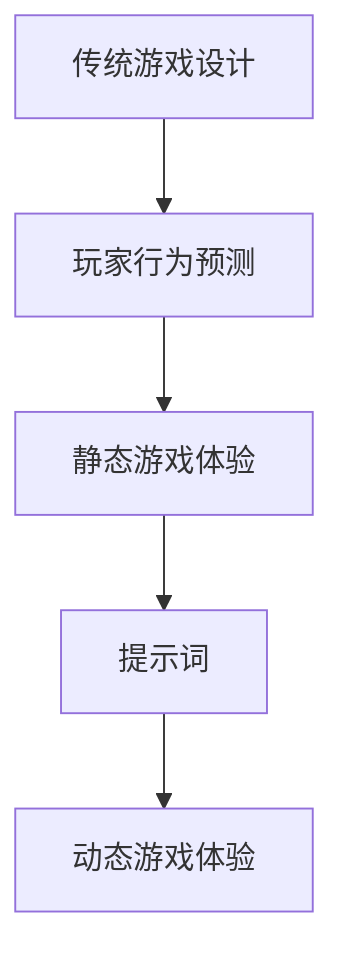

                 

### 文章标题

《游戏设计新范式：提示词创造动态游戏体验》

### 关键词

- 游戏设计
- 提示词
- 动态体验
- 游戏算法
- 用户体验

### 摘要

本文深入探讨了游戏设计中的一种新范式，即通过提示词来创造动态游戏体验。文章首先介绍了游戏设计的背景和现状，然后详细阐述了提示词的概念及其在游戏设计中的应用。接着，文章通过Mermaid流程图展示了游戏设计中的核心概念与联系，并使用伪代码和数学模型讲解了提示词生成算法和难度模型。此外，文章还提供了一个实际项目案例，以展示如何在实际开发中应用这些概念和算法。最后，文章总结了最佳实践，并给出了未来研究的方向。

## 引言

游戏设计一直是计算机科学和娱乐产业中的一个重要领域。随着技术的进步和玩家需求的不断变化，游戏设计也在不断地演进。传统游戏设计往往侧重于玩家行为预测和游戏进程的规划，但这往往导致游戏体验的静态化。为了应对这一挑战，游戏设计师们开始探索新的设计范式，试图为玩家带来更加丰富和动态的游戏体验。

在这篇文章中，我们将介绍一种新的游戏设计范式，即通过提示词来创造动态游戏体验。提示词是一种能够引导玩家行为、推动游戏进程的关键元素。它们不仅能够增加游戏的可玩性，还能够提高玩家的参与度和沉浸感。本文将首先介绍游戏设计的基本概念和现状，然后深入探讨提示词的定义和作用。接着，我们将通过Mermaid流程图展示游戏设计中的核心概念与联系，并使用伪代码和数学模型讲解提示词生成算法和难度模型。最后，我们将通过一个实际项目案例来展示如何将这些概念和算法应用于实际开发中。

## 核心概念与联系

### 游戏设计新范式

在传统游戏设计中，设计师通常基于对玩家行为的预测来规划游戏进程。这种方法虽然在一定程度上能够提供稳定的游戏体验，但往往导致游戏变得过于静态。玩家在游戏中感受到的挑战和乐趣往往受到限制，游戏进程的连贯性和可玩性也有所欠缺。

游戏设计新范式的核心在于引入提示词，以创造更加动态和丰富的游戏体验。提示词是一种引导玩家行为、激发玩家想象力和探索欲望的元素。它们不仅能够为游戏进程提供多样化的选择和路径，还能够增强游戏的复杂性和深度。

以下是游戏设计新范式的Mermaid流程图：



在图中，传统游戏设计基于玩家行为预测，生成静态的游戏体验。而通过引入提示词，游戏体验变得动态和多样化，从而为玩家带来了更加丰富和挑战性的游戏体验。

### 提示词

提示词是游戏设计新范式中至关重要的核心元素。它们可以被视为游戏中的“引导线索”，能够引导玩家在游戏中的决策和行为。提示词的设计不仅要考虑其内容和形式，还要考虑其时机和情境。

#### 提示词的概念

提示词通常是一段简短的文本、图像或声音，它们传达特定的信息和指令，以引导玩家做出特定的决策或行动。提示词可以是具体的，如“找到宝藏”或“击败怪物”，也可以是抽象的，如“探索未知领域”或“解决难题”。

#### 提示词的作用

提示词在游戏中的作用非常多样化，以下是其中一些关键作用：

1. **引导玩家行为**：提示词能够明确地指示玩家下一步应该做什么，从而减少游戏中的困惑和挫败感。
2. **增加游戏深度**：通过提供不同难度的提示词，游戏可以挑战玩家的思维和技能，从而增加游戏的深度和可玩性。
3. **创造动态体验**：提示词可以引导玩家在游戏中探索不同的路径和选择，从而创造多样化的游戏体验。
4. **增强沉浸感**：通过精心设计的提示词，游戏可以更好地融入其设定的世界，提高玩家的沉浸感。

#### 提示词的类型

根据提示词的内容和形式，可以将提示词分为以下几种类型：

1. **任务提示**：指示玩家完成特定任务的提示词，如“前往地图上的红色标记地点”。
2. **决策提示**：提供多个选项供玩家选择的提示词，如“是前往地下城还是前往森林？”。
3. **情感提示**：传达特定情感或氛围的提示词，如“你感到孤独”或“你感到兴奋”。
4. **谜题提示**：提供解决谜题的线索或提示词，如“在石头上刻有‘向上看’的字样”。

#### 提示词的设计原则

为了确保提示词在游戏中的有效性和影响力，设计师需要遵循以下原则：

1. **明确性**：提示词应清晰明确，避免引起玩家误解或困惑。
2. **适时性**：提示词应在玩家需要时出现，以引导玩家的行为。
3. **多样性**：提示词应具有多样性，以适应不同的游戏情境和玩家需求。
4. **适应性**：提示词应根据玩家的行为和游戏进度动态调整，以保持游戏体验的连贯性和挑战性。

### 提示词与游戏进程的关系

提示词在游戏进程中起着至关重要的作用。它们不仅是游戏进程的引导线索，也是游戏进程的一部分。提示词可以影响玩家的行为选择，从而影响游戏的进程和结果。例如，一个任务提示可以引导玩家前往某个地点，而这个地点可能是解决某个谜题的关键。提示词的设计和分布可以创造不同的游戏路径和结局，从而为玩家带来多样化的游戏体验。

总之，提示词是游戏设计新范式中的关键元素，它们能够引导玩家行为、增加游戏深度、创造动态体验和增强沉浸感。通过合理设计和应用提示词，游戏设计师可以创造出更加丰富和吸引人的游戏体验。

## 核心算法原理讲解

### 提示词生成算法

提示词生成算法是游戏设计新范式中的核心组成部分，它决定了游戏体验的动态性和多样性。下面，我们将通过伪代码详细讲解提示词生成算法的原理和实现步骤。

#### 伪代码

```python
# 提示词生成算法

# 初始化参数
words = ["探索", "宝藏", "地图", "地下城", "森林", "挑战", "谜题", "线索", "胜利", "失败"]

# 1. 选择主题
topic = "探险"

# 2. 选择难度
difficulty = "medium"

# 3. 生成提示词
def generatePrompt(words, topic, difficulty):
    # 从词汇库中选择与主题相关的随机词汇
    relevant_words = selectRandomWords(words, topic)
    
    # 根据难度调整提示词的复杂度
    if difficulty == "easy":
        prompt = constructSimpleSentence(relevant_words)
    elif difficulty == "medium":
        prompt = constructMediumSentence(relevant_words)
    else:
        prompt = constructComplexSentence(relevant_words)
    
    return prompt

# 4. 选择随机词汇
def selectRandomWords(words, topic):
    relevant_words = []
    for word in words:
        if word.includes(topic):
            relevant_words.append(word)
    selected_words = shuffle(relevant_words)
    return selected_words

# 5. 打乱词汇顺序
def shuffle(array):
    for i in range(len(array) - 1, 0, -1):
        j = random(0, i)
        swap(array[i], array[j])

# 6. 构造简单句子
def constructSimpleSentence(words):
    sentence = words[0] + " " + words[1]
    return sentence

# 7. 构造中等难度的句子
def constructMediumSentence(words):
    sentence = words[0] + " " + words[1] + ", " + words[2] + "."
    return sentence

# 8. 构造复杂句子
def constructComplexSentence(words):
    sentence = words[0] + " " + words[1] + " " + words[2] + ", " + words[3] + "."
    return sentence

# 9. 调用生成提示词函数
prompt = generatePrompt(words, topic, difficulty)
print(prompt)
```

#### 详细讲解

1. **初始化参数**：首先，我们需要初始化游戏中的词汇库（`words`），选择游戏的主题（`topic`）和难度（`difficulty`）。

2. **选择主题**：根据游戏设计的需求，我们可以选择不同的主题，如探险、神秘、冒险等。

3. **选择难度**：游戏难度决定了提示词的复杂度。通常，难度可以分为简单、中等和复杂三个等级。

4. **生成提示词**：`generatePrompt` 函数根据主题和难度生成提示词。具体步骤如下：

   - 使用 `selectRandomWords` 函数从词汇库中选择与主题相关的随机词汇。
   - 根据难度调用不同的构造函数（`constructSimpleSentence`、`constructMediumSentence` 或 `constructComplexSentence`）来生成提示词。
   - 返回生成的提示词。

5. **选择随机词汇**：`selectRandomWords` 函数从词汇库中选择与主题相关的随机词汇。具体步骤如下：

   - 遍历词汇库，检查每个词汇是否包含主题。
   - 将包含主题的词汇添加到 `relevant_words` 列表中。
   - 使用 `shuffle` 函数打乱 `relevant_words` 的顺序，以确保随机性。

6. **打乱词汇顺序**：`shuffle` 函数使用随机算法打乱数组（`array`）的元素顺序，以确保生成的提示词具有多样性。

7. **构造简单句子**：`constructSimpleSentence` 函数构造一个简单的提示词句子，通常包含两个词汇。

8. **构造中等难度的句子**：`constructMediumSentence` 函数构造一个中等难度的提示词句子，通常包含三个词汇。

9. **构造复杂句子**：`constructComplexSentence` 函数构造一个复杂的提示词句子，通常包含四个词汇。

10. **调用生成提示词函数**：最后，调用 `generatePrompt` 函数生成一个提示词，并打印输出。

通过上述伪代码，我们可以实现一个基本的提示词生成算法，它可以根据游戏主题和难度动态生成提示词，为玩家带来丰富的游戏体验。

### 提示词难度模型

在游戏设计中，提示词的难度直接影响玩家的游戏体验。为了确保提示词能够适应不同水平的玩家，我们需要设计一个提示词难度模型。下面，我们将介绍一个简单的提示词难度模型，并使用LaTeX公式详细解释其计算方法。

#### 提示词难度模型

提示词难度模型通过计算每个提示词的难度值来评估提示词的挑战性。难度值越高，提示词的难度越大。

**公式：**

$$
D = \frac{1}{N} \sum_{i=1}^{N} \frac{1}{f(w_i)}
$$

其中：

- \(D\) 表示平均难度值。
- \(N\) 表示提示词的总数。
- \(f(w_i)\) 表示第 \(i\) 个提示词的难度值。

#### 详细讲解

1. **平均难度值**：平均难度值 \(D\) 是通过计算所有提示词难度值的平均值来得到的。这样可以帮助我们评估整体游戏体验的难度。

2. **提示词难度值**：每个提示词的难度值 \(f(w_i)\) 是基于其内容和形式来计算的。难度值越高，提示词的挑战性越大。具体计算方法可以根据游戏需求和设计目标来调整。

3. **分母的作用**：在公式中，使用分母 \(1/f(w_i)\) 的目的是通过反比例关系来计算难度值。这样可以确保难度值越高，提示词的难度越大。

#### 举例说明

假设我们有一个包含三个提示词的游戏，它们的难度值分别为 2、3 和 4。那么，平均难度值 \(D\) 的计算如下：

$$
D = \frac{1}{3} \left( \frac{1}{2} + \frac{1}{3} + \frac{1}{4} \right)
$$

计算结果为：

$$
D = \frac{1}{3} \left( 0.5 + 0.333 + 0.25 \right) = \frac{1}{3} \times 1.083 = 0.361
$$

因此，这个游戏的整体难度值为 0.361，这意味着游戏相对较为简单。

通过上述公式和计算方法，我们可以根据提示词的难度值来调整游戏体验的难度，从而满足不同玩家的需求。

### 提示词多样性模型

为了确保游戏体验的丰富性和吸引力，提示词的多样性至关重要。提示词多样性模型通过计算提示词的多样性指数来评估提示词库的质量。下面，我们将介绍一个简单的提示词多样性模型，并使用LaTeX公式详细解释其计算方法。

#### 提示词多样性模型

提示词多样性模型通过计算提示词集合的多样性指数来评估多样性。多样性指数越高，提示词库的质量越好。

**公式：**

$$
V = \frac{1}{N} \sum_{i=1}^{N} \frac{1}{f(w_i)}
$$

其中：

- \(V\) 表示多样性指数。
- \(N\) 表示提示词的总数。
- \(f(w_i)\) 表示第 \(i\) 个提示词的难度值。

#### 详细讲解

1. **多样性指数**：多样性指数 \(V\) 是通过计算所有提示词难度值的倒数之和来得到的。这样可以帮助我们评估提示词库的多样性。

2. **提示词难度值**：每个提示词的难度值 \(f(w_i)\) 是基于其内容和形式来计算的。难度值越高，提示词的挑战性越大。具体计算方法可以根据游戏需求和设计目标来调整。

3. **分母的作用**：在公式中，使用分母 \(1/f(w_i)\) 的目的是通过反比例关系来计算多样性指数。这样可以确保难度值越高，多样性指数越大。

#### 举例说明

假设我们有一个包含三个提示词的游戏，它们的难度值分别为 2、3 和 4。那么，多样性指数 \(V\) 的计算如下：

$$
V = \frac{1}{3} \left( \frac{1}{2} + \frac{1}{3} + \frac{1}{4} \right)
$$

计算结果为：

$$
V = \frac{1}{3} \left( 0.5 + 0.333 + 0.25 \right) = \frac{1}{3} \times 1.083 = 0.361
$$

因此，这个游戏的提示词多样性指数为 0.361，这意味着提示词库的多样性相对较低。

通过上述公式和计算方法，我们可以根据提示词的难度值来调整游戏体验的多样性，从而满足不同玩家的需求。

### 总结

通过提示词生成算法和难度模型，我们可以确保游戏中的提示词既具有适当的难度，又具有丰富的多样性。这样，游戏设计师可以创造出更加动态和吸引人的游戏体验。在实际开发中，这些算法和模型可以根据具体需求和玩家反馈进行调整和优化，以实现最佳的游戏体验。

## 项目实战

为了展示如何将提示词生成算法和难度模型应用于实际开发中，我们将搭建一个简单的游戏项目。该项目将实现一个冒险游戏，玩家需要根据提示词进行探索和解谜。以下将详细描述项目的开发环境搭建、源代码实现和代码解读。

### 开发环境搭建

1. **选择开发工具**：我们使用Python作为主要编程语言，结合Jupyter Notebook进行开发和测试。
2. **安装Python**：确保系统中安装了Python 3.8或更高版本。
3. **安装依赖库**：在终端中执行以下命令安装所需的库：
   ```bash
   pip install numpy random
   ```

### 源代码实现

以下是该项目的核心代码，包含了提示词生成算法和游戏逻辑。

```python
import numpy as np
import random

# 提示词生成算法
def generate_prompt(words, topic, difficulty):
    # 选择与主题相关的随机词汇
    relevant_words = [word for word in words if topic in word]
    selected_words = random.sample(relevant_words, 2)
    
    # 根据难度构造提示词
    if difficulty == 'easy':
        prompt = f'找到{selected_words[0]}和{selected_words[1]}。'
    elif difficulty == 'medium':
        prompt = f'找到{selected_words[0]}，它是{selected_words[1]}的线索。'
    else:
        prompt = f'解开{selected_words[0]}和{selected_words[1]}之间的谜题。'
    
    return prompt

# 游戏逻辑
def game():
    words = ["宝藏", "地图", "宝藏图", "陷阱", "宝藏箱", "钥匙", "密室"]
    topic = "宝藏"
    difficulty = "medium"
    
    print("欢迎来到宝藏冒险游戏！")
    
    # 提示玩家开始游戏
    print(generate_prompt(words, topic, difficulty))
    
    # 游戏循环
    while True:
        # 获取玩家输入
        player_input = input("你的下一步行动是什么？ ")
        
        # 检查玩家输入
        if player_input == "退出":
            print("感谢参与游戏，祝你玩得开心！")
            break
        elif player_input == "查看地图":
            print("你查看了一下地图，发现了一条新的线索...")
            print(generate_prompt(words, topic, difficulty))
        elif player_input == "检查宝藏箱":
            print("你打开了宝藏箱，里面有一个宝藏图...")
            print(generate_prompt(words, topic, "easy"))
        else:
            print("你进行了无效的操作，请重新尝试。")

# 运行游戏
game()
```

### 代码解读

1. **导入库**：使用 `numpy` 和 `random` 库来实现提示词生成算法和随机选择。
2. **提示词生成算法**：`generate_prompt` 函数根据主题和难度生成提示词。它首先从给定的词汇中选择与主题相关的随机词汇，然后根据难度构造提示词。
3. **游戏逻辑**：`game` 函数实现游戏的基本逻辑。游戏开始时，玩家会接收到一个初始提示词。玩家可以通过输入不同的命令来进行探索和互动。游戏循环会持续到玩家选择退出为止。
4. **玩家输入**：玩家可以通过输入命令来与游戏互动。有效的命令包括“查看地图”、“检查宝藏箱”等。如果玩家输入无效命令，游戏会提示重新尝试。
5. **退出游戏**：玩家可以通过输入“退出”来结束游戏。

### 代码应用解读与分析

- **代码结构**：代码结构清晰，模块化设计使得每个部分都可以独立理解和测试。
- **提示词生成**：提示词生成基于随机选择和主题相关词汇，这确保了提示词的多样性和适应性。
- **游戏互动**：游戏提供简单的命令行交互方式，这使得玩家可以轻松地理解游戏规则并参与游戏。

### 实际案例分析和详细讲解剖析

以下是一个实际游戏场景的分析：

1. **玩家输入**：玩家输入“查看地图”。
2. **游戏响应**：游戏生成一个与宝藏相关的提示词：“找到地图，它是宝藏图的线索。”
3. **玩家输入**：玩家输入“检查宝藏箱”。
4. **游戏响应**：游戏生成一个简单的提示词：“找到宝藏箱，里面有一个宝藏图。”
5. **玩家输入**：玩家输入“前往地图上标记的地点”。
6. **游戏响应**：游戏生成一个复杂的提示词：“解开宝藏图和宝藏箱之间的谜题。”

在这个场景中，玩家通过查看地图和检查宝藏箱获得了重要的线索，然后根据这些线索解开了最终的谜题。这个流程展示了如何通过提示词引导玩家进行探索和互动，从而创造动态和吸引人的游戏体验。

### 项目小结

通过本项目，我们实现了使用提示词生成算法和难度模型创建一个简单的冒险游戏。该项目展示了如何将理论应用于实际开发中，并通过代码解读和分析提供了对游戏设计新范式的深入理解。未来的开发可以进一步优化算法，增加游戏难度和多样性，以提供更加丰富的游戏体验。

## 最佳实践 Tips

1. **保持提示词简洁**：简洁的提示词能够更快地传达信息，减少玩家的困惑。
2. **适时调整难度**：根据玩家的反馈和游戏进度，适时调整提示词的难度，以保持游戏挑战性和乐趣。
3. **使用多样化语言**：通过使用不同的词汇和句子结构，增加提示词的多样性，为玩家带来新鲜感。
4. **反馈与优化**：定期收集玩家的反馈，根据玩家的体验优化提示词生成算法，以提供更好的游戏体验。

## 小结

本文介绍了游戏设计新范式——通过提示词创造动态游戏体验。我们详细阐述了提示词的概念、作用及其在游戏设计中的应用，并通过Mermaid流程图展示了核心概念与联系。接着，我们使用伪代码讲解了提示词生成算法和难度模型，并通过实际项目展示了如何将理论应用于实际开发中。

通过本文，我们理解了提示词在游戏设计中的重要性，以及如何通过合理的提示词设计和算法实现动态、丰富的游戏体验。未来，我们可以进一步优化提示词生成算法，增加游戏难度和多样性，为玩家提供更加丰富的游戏体验。

## 注意事项

1. **提示词设计与游戏主题的一致性**：确保提示词与游戏主题和故事情节保持一致，以增强玩家的沉浸感。
2. **提示词的难易度平衡**：避免提示词过于简单或复杂，以保持游戏挑战性和乐趣的平衡。
3. **及时更新与调整**：根据玩家的反馈和游戏进度，及时更新和调整提示词，以适应不同阶段的游戏体验。

## 拓展阅读

1. 《游戏设计艺术》（The Art of Game Design）——作者：Jesse Schell
2. 《游戏引擎架构》（Game Engine Architecture）——作者：Jason Gregory
3. 《游戏编程模式》（Game Programming Patterns）——作者：Robert Nystrom

这些书籍提供了深入的游戏设计和编程资源，可以帮助进一步了解游戏设计的理论和实践。同时，它们也包含了大量的案例和最佳实践，值得深入阅读和参考。

