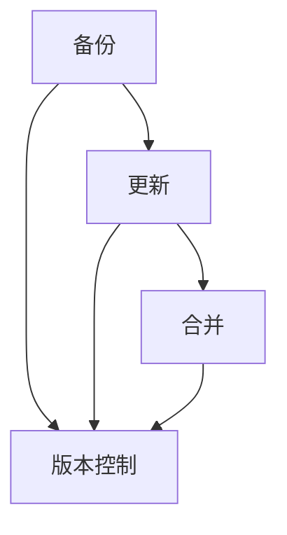

                 

### 文章标题：版本控制策略：管理LLM模型和代码迭代

#### 关键词：版本控制，LLM模型，代码迭代，策略，Git，Mermaid流程图

> **摘要：**本文深入探讨了版本控制策略在管理大型语言模型（LLM）模型和代码迭代中的重要性。我们首先介绍了版本控制的基本概念，并详细分析了其在LLM模型开发中的应用。随后，我们讨论了版本控制的策略，包括备份、更新和合并策略，并通过伪代码和Mermaid流程图进行了详细阐述。接着，我们介绍了常用的版本控制工具，如Git，并提供了安装和使用指南。文章还针对LLM模型和代码迭代的具体需求，探讨了版本控制的挑战和解决方案，并通过一个实际的LLM模型和代码迭代项目进行了实战讲解。最后，本文提出了最佳实践建议和注意事项，以帮助读者在实际工作中更好地应用版本控制策略。**

---

### 引言

在当今的软件开发和人工智能领域，版本控制已经成为一个不可或缺的工具。它不仅帮助开发人员有效地管理代码库，还极大地提高了团队协作的效率。然而，在处理大型语言模型（LLM）模型和代码迭代时，版本控制的重要性更加凸显。这是因为LLM模型的复杂性和代码库的规模使得版本管理变得尤为困难。为了解决这些问题，我们需要设计一套有效的版本控制策略，以确保模型的迭代过程更加顺畅和可靠。

版本控制策略不仅包括备份、更新和合并等基本操作，还需要针对LLM模型和代码迭代的特点进行定制化设计。例如，LLM模型的更新可能会导致性能和准确性的变化，因此，我们需要确保版本控制系统能够准确地记录和追踪这些变化。同样，代码库的规模和复杂性也要求版本控制系统具有高效的合并和冲突解决能力。

本文的目标是深入探讨版本控制策略在管理LLM模型和代码迭代中的应用。我们首先将介绍版本控制的基本概念，包括备份、更新和合并等核心操作。接着，我们将使用Mermaid流程图展示这些概念之间的关系。随后，我们将详细讨论版本控制的策略，并提供伪代码示例来说明算法原理。接着，我们将介绍常用的版本控制工具，如Git，并讨论LLM模型和代码迭代的需求。最后，我们将通过一个实际的LLM模型和代码迭代项目进行实战讲解，并总结最佳实践和注意事项。

### 核心概念与联系

版本控制是一种跟踪和管理源代码或任何形式的数据更改的方法。它的基本概念包括备份、更新和合并等。这些概念相互关联，共同构成了版本控制的核心框架。

**备份**是指创建源代码或数据的副本，以防止丢失或损坏。备份策略是版本控制的基础，它确保了在任何意外情况发生时，我们都能恢复到之前的状态。

**更新**是指将源代码或数据从旧版本更新到新版本。这通常涉及到修改、添加或删除某些部分。更新策略确保了代码库的同步性和一致性。

**合并**是指将两个或多个不同的版本合并成一个。这通常发生在多个开发人员对同一代码库进行更改时。合并策略确保了代码库的完整性，并解决了版本之间的冲突。

这些核心概念之间的关系可以用Mermaid流程图来表示：



在这个流程图中，备份、更新和合并是版本控制过程中的关键步骤，它们共同构成了版本控制的核心。备份确保了数据的安全，更新确保了代码库的同步，而合并则确保了代码库的完整性。

**备份策略**的主要目的是在发生数据丢失或损坏时，能够恢复到之前的状态。备份可以分为全备份、增量备份和差异备份等类型。全备份是创建源代码或数据的完整副本，而增量备份只备份自上次备份以来发生更改的部分。差异备份则是备份自上次全备份以来发生更改的部分。选择合适的备份策略取决于数据的重要性和备份的频率。

**更新策略**的主要目的是确保代码库中的每个版本都是最新和一致的。更新可以是手动或自动进行的。手动更新通常由开发人员执行，而自动更新可以通过CI/CD流程实现。更新策略需要考虑代码库的结构、依赖关系和版本兼容性。

**合并策略**的主要目的是在多个版本之间合并更改，以创建一个统一的版本。合并可以分为三种类型：快照合并、基于树的合并和线性合并。快照合并保留了所有版本的更改，而基于树的合并则基于分支历史进行合并。线性合并则将更改按照时间顺序合并。合并策略需要考虑冲突解决、代码质量和合并效率。

通过Mermaid流程图，我们可以清晰地看到这些概念之间的关联。这不仅有助于理解版本控制的工作原理，还为设计有效的版本控制策略提供了直观的指导。

### 版本控制策略

在版本控制中，策略的制定至关重要。有效的版本控制策略能够确保代码库的完整性、一致性和可追溯性。以下是几种常见的版本控制策略，包括备份策略、更新策略和合并策略。

#### 备份策略

备份策略是版本控制的基础，其主要目的是防止数据丢失或损坏。以下是几种常见的备份策略：

1. **全备份**：全备份是指创建源代码或数据的完整副本。这种策略简单易行，但需要较大的存储空间。全备份适合数据量较小且变动频率较低的场景。

2. **增量备份**：增量备份只备份自上次备份以来发生更改的部分。这种策略节省存储空间，但恢复速度较慢。增量备份适合数据量较大且变动频繁的场景。

3. **差异备份**：差异备份是指备份自上次全备份以来发生更改的部分。这种策略结合了全备份和增量备份的优点，但恢复速度较慢。差异备份适合数据量较大且变动频繁的场景。

4. **混合备份**：混合备份结合了全备份、增量备份和差异备份的特点。例如，每天进行一次全备份，每小时进行一次增量备份，每天进行一次差异备份。这种策略提供了良好的平衡，适合大多数场景。

**伪代码示例**：

```python
def full_backup():
    # 创建完整副本
    create_copy_of_source_code()

def incremental_backup():
    # 备份自上次备份以来发生更改的部分
    get_changes_since_last_backup()
    create_copy_of_changes()

def differential_backup():
    # 备份自上次全备份以来发生更改的部分
    get_changes_since_last_full_backup()
    create_copy_of_changes()

def hybrid_backup():
    full_backup()
    for hour in range(1, 24):
        incremental_backup()
    differential_backup()
```

#### 更新策略

更新策略是指如何将源代码或数据从旧版本更新到新版本。以下是几种常见的更新策略：

1. **手动更新**：手动更新通常由开发人员执行。开发人员需要检查更改日志，理解更改的内容，然后手动更新代码库。这种策略适合小规模且变动频率较低的场景。

2. **自动更新**：自动更新可以通过CI/CD流程实现。CI/CD工具会自动检查代码库的更改，并根据预定义的规则进行更新。这种策略适合大规模且变动频率较高的场景。

3. **版本更新**：版本更新是指根据预定义的版本号进行更新。常见的版本号格式为`主版本号.次版本号.修订号`，例如`1.0.1`。这种策略可以帮助快速定位和追踪更改。

4. **依赖管理**：依赖管理是指管理代码库中使用的第三方库和工具。依赖管理工具会自动检查依赖的版本，并确保更新符合要求。这种策略可以减少手动操作，提高更新效率。

**伪代码示例**：

```python
def manual_update():
    # 检查更改日志
    check_change_log()
    # 手动更新代码库
    update_source_code()

def automated_update():
    # 检查代码库更改
    check_source_code_changes()
    # 根据预定义规则自动更新代码库
    update_source_code_automatically()

def version_based_update():
    # 根据版本号更新代码库
    update_source_code_to_version("1.0.1")

def dependency_management():
    # 检查依赖版本
    check_dependency_versions()
    # 更新依赖库
    update_dependencies()
```

#### 合并策略

合并策略是指如何将多个版本合并成一个。以下是几种常见的合并策略：

1. **快照合并**：快照合并是指保留所有版本的更改，并创建一个新的版本。这种策略适合需要保留所有更改的场景。

2. **基于树的合并**：基于树的合并是指基于分支历史进行合并。这种策略可以更好地反映分支的历史和变更。这种策略适合复杂的分支结构。

3. **线性合并**：线性合并是指将更改按照时间顺序合并。这种策略简单易行，但可能无法完全反映分支的历史。

4. **合并冲突解决**：合并冲突解决是指在合并过程中解决冲突的方法。常见的解决方法包括手动解决、自动解决和基于规则的解决。

**伪代码示例**：

```python
def snapshot_merge():
    # 保留所有版本更改
    retain_all_changes()
    # 创建新版本
    create_new_version()

def tree_based_merge():
    # 基于分支历史合并
    merge_based_on_branch_history()
    # 解决合并冲突
    resolve_merge_conflicts()

def linear_merge():
    # 按时间顺序合并更改
    merge_changes_in_order()
    # 解决合并冲突
    resolve_merge_conflicts()

def merge_conflict_resolution():
    # 手动解决合并冲突
    manual_resolve_conflicts()
    # 自动解决合并冲突
    automated_resolve_conflicts()
    # 基于规则解决合并冲突
    rule_based_resolve_conflicts()
```

通过这些策略，我们可以有效地管理LLM模型和代码迭代的过程，确保代码库的稳定性和可维护性。

### 版本控制工具

在版本控制领域，Git是最常用的工具之一。Git是一个分布式版本控制系统，它具有高效、灵活和强大的功能。以下将介绍Git的基本概念、安装过程、基本操作及其在LLM模型和代码迭代中的应用。

#### Git的基本概念

Git由一个全局的版本库和多个本地仓库组成。全局版本库存储了所有版本的元数据和内容，而本地仓库存储了当前工作副本的文件和目录。Git的核心概念包括提交（commit）、分支（branch）、标签（tag）和合并（merge）。

1. **提交**：提交是Git中最基本的概念，它记录了文件或目录的更改。每次更改后，Git会创建一个新的提交，并附上作者、日期和提交信息。

2. **分支**：分支是Git中的独立开发路径。开发人员可以在不同的分支上工作，以便隔离不同的功能或修复。分支可以在需要时合并到主分支。

3. **标签**：标签是Git中的里程碑，用于标记重要的版本或发布版本。标签可以帮助快速定位和访问特定的代码版本。

4. **合并**：合并是将两个或多个分支的更改合并到一个分支的过程。合并可以解决分支之间的冲突，并确保代码库的同步。

#### Git的安装过程

安装Git是一个简单的过程，以下是在常见操作系统上安装Git的步骤：

1. **Windows**：
   - 访问[Git官方网站](https://git-scm.com/downloads)下载Git的安装程序。
   - 运行安装程序，并选择默认选项。
   - 完成安装后，打开命令提示符并运行`git --version`验证安装。

2. **macOS**：
   - macOS自带的命令行工具集已经包含了Git。
   - 打开终端并运行`git --version`验证安装。

3. **Linux**：
   - 使用包管理器安装Git。例如，在Ubuntu上，可以运行`sudo apt-get install git`。

#### Git的基本操作

Git的基本操作包括初始化仓库、提交更改、创建分支、合并分支和解决冲突。

1. **初始化仓库**：
   - 初始化一个本地仓库：`git init`
   - 将本地仓库添加到远程仓库：`git remote add origin <远程仓库URL>`

2. **提交更改**：
   - 添加更改到暂存区：`git add .`
   - 提交更改：`git commit -m "提交信息"`

3. **创建分支**：
   - 创建一个新分支：`git branch <分支名>`
   - 切换到新分支：`git checkout <分支名>`

4. **合并分支**：
   - 合并一个分支到当前分支：`git merge <分支名>`
   - 解决合并冲突：手动编辑冲突文件，然后添加到暂存区并提交。

5. **解决冲突**：
   - 检查冲突文件：`git diff`
   - 手动解决冲突，然后提交。

#### Git在LLM模型和代码迭代中的应用

在LLM模型和代码迭代中，Git提供了强大的版本控制功能，帮助我们管理模型的版本和代码的更改。以下是Git在LLM模型和代码迭代中的应用：

1. **版本管理**：使用Git的提交和分支功能，我们可以轻松地管理LLM模型的版本。每个模型的更新都可以作为一个提交，而每个模型的不同版本可以作为一个分支。

2. **代码迭代**：在代码迭代过程中，Git可以帮助我们跟踪代码的更改和分支。开发人员可以在各自的分支上工作，以便隔离不同的功能或修复。这些分支可以在需要时合并到主分支。

3. **协作开发**：Git的分布式特性使得开发人员可以在本地仓库中进行更改，并随时同步到远程仓库。这使得团队合作更加高效和灵活。

4. **冲突解决**：当多个开发人员对同一文件进行更改时，Git可以帮助我们识别和解决冲突。通过手动编辑冲突文件，我们可以确保代码库的一致性和完整性。

总之，Git是管理LLM模型和代码迭代的有力工具。通过掌握Git的基本操作，我们可以更好地管理模型的版本和代码的更改，提高团队协作的效率。

### LLM模型与代码迭代需求

大型语言模型（LLM）的开发和迭代涉及复杂的数据处理和算法调整，这要求版本控制系统能够满足特定的高效性和准确性需求。以下是LLM模型和代码迭代对版本控制系统的具体需求：

#### 高效版本管理

LLM模型的开发通常涉及大量的数据集和预处理步骤。这些数据集和步骤的版本管理要求版本控制系统具有高效的数据管理能力。Git作为分布式版本控制系统，具有以下优势：

1. **快速分支和合并**：Git的分支和合并操作相对高效，使得开发人员可以在不同的模型版本上进行独立的开发和测试，而不会影响其他版本。

2. **增量更新**：Git支持增量更新，这意味着只需更新自上次提交以来的更改部分，这样可以节省时间和存储空间。

#### 完整性保障

LLM模型的开发和迭代过程中，数据的完整性和模型的准确性至关重要。版本控制系统需要提供以下保障措施：

1. **备份和恢复**：Git支持自动备份和恢复操作，确保在任何意外情况发生时，我们都能快速恢复到之前的状态。

2. **冲突检测和解决**：Git能够检测并解决多个开发人员之间的冲突，确保代码库的一致性和准确性。

#### 可追溯性

在LLM模型开发和迭代过程中，能够追踪每个版本的更改和修改者是非常重要的。Git提供了详细的提交历史和日志，使得我们能够：

1. **版本追踪**：通过提交历史，我们可以查看每个版本的详细信息和更改记录。

2. **责任归属**：通过提交历史，我们可以追溯每个更改的责任人，便于团队协作和问题定位。

#### 兼容性支持

LLM模型的开发过程中，可能会使用多个库和工具。版本控制系统需要能够支持这些库和工具的版本管理：

1. **依赖管理**：Git可以与依赖管理工具如Maven或Gradle集成，帮助我们管理库的版本和依赖关系。

2. **版本兼容性**：Git允许我们为每个库和工具指定特定的版本，确保模型的兼容性和稳定性。

#### 实际案例

以下是一个实际的LLM模型和代码迭代项目的版本控制示例：

1. **项目结构**：项目包含多个子模块，如数据预处理、模型训练和模型评估。

2. **分支策略**：每个子模块都有自己的分支，开发人员可以在各自的分支上进行独立开发。

3. **提交记录**：每次提交都包括详细的修改描述，确保版本的可追溯性。

4. **合并流程**：在完成各自的开发后，开发人员将分支合并到主分支，并解决任何潜在的冲突。

通过Git，我们可以高效地管理LLM模型的版本和代码迭代，确保模型的稳定性和准确性。

### 版本控制的挑战与解决方案

在版本控制过程中，我们可能会遇到各种挑战，这些问题如果不妥善处理，可能会导致代码库的混乱和功能错误。以下是一些常见的挑战及相应的解决方案。

#### 数据安全性

数据丢失或损坏是版本控制中的一大挑战。为了确保数据的安全性，我们可以采取以下措施：

1. **定期备份**：定期进行全备份或增量备份，确保在数据丢失或损坏时可以恢复。
2. **异地备份**：将备份存储在异地，以防止因地理位置上的灾难导致数据丢失。
3. **加密存储**：对备份文件进行加密，防止未经授权的访问。

#### 版本冲突

当多个开发人员在同一文件上做出更改时，版本冲突是不可避免的。解决版本冲突的方法包括：

1. **手动解决**：手动审查冲突部分，选择保留哪部分更改。这种方法适合小冲突，但可能需要大量时间。
2. **自动合并**：使用自动合并工具，如Git的`git merge`命令，自动解决一些简单的冲突。但这种方法可能无法处理复杂的冲突。
3. **基于规则的解决**：为冲突设置预定义的解决规则，自动应用这些规则。这种方法适用于冲突模式固定的场景。

#### 高效协作

在多人的协作开发中，确保代码库的一致性和高效性是关键。以下是一些提高协作效率的策略：

1. **明确的分支策略**：为不同的功能或修复创建独立的分支，确保每个分支的独立性和可管理性。
2. **代码审查**：在提交代码前进行代码审查，确保代码质量和一致性。
3. **持续集成和部署**：使用CI/CD工具，自动化测试和部署流程，确保代码库的稳定性和可靠性。

#### 解决方案

以下是一个实际的解决方案示例，用于解决版本冲突和确保数据安全：

1. **冲突解决流程**：
   - 当检测到版本冲突时，自动暂停合并过程，并通知相关开发人员。
   - 开发人员使用Git的`git diff`命令查看冲突部分。
   - 手动审查冲突部分，选择保留哪部分更改，并提交新的合并请求。
   - 自动合并工具尝试自动解决冲突，如果失败，由开发人员手动解决。

2. **数据备份流程**：
   - 每周进行一次全备份，并将备份存储在远程服务器上。
   - 使用加密工具对备份文件进行加密，并定期检查备份的完整性。

通过这些解决方案，我们可以有效地应对版本控制中的挑战，确保代码库的稳定性和数据的安全性。

### 项目实战

在本节中，我们将通过一个实际的LLM模型和代码迭代项目，详细解释项目开发环境搭建、源代码实现和代码解读。这个项目将展示如何使用Git进行版本控制，以及如何在实际应用中管理模型和代码的迭代。

#### 项目概述

我们的项目目标是开发一个简单的语言模型，用于文本分类任务。该项目包括以下步骤：

1. **环境搭建**：安装必要的软件和库。
2. **源代码实现**：编写模型的训练、评估和预测代码。
3. **代码解读**：分析关键代码段，解释其功能和工作原理。
4. **代码应用解读与分析**：展示如何在实际应用中使用这个模型，并分析其性能。

#### 开发环境搭建

为了搭建项目的开发环境，我们需要以下软件和库：

1. **操作系统**：Linux或macOS。
2. **Python**：Python 3.8或更高版本。
3. **TensorFlow**：TensorFlow 2.6或更高版本。
4. **Git**：Git 2.30或更高版本。

**安装步骤**：

1. **安装Python**：打开终端，运行以下命令安装Python：
   ```bash
   sudo apt-get install python3.8
   ```

2. **安装TensorFlow**：在终端中运行以下命令安装TensorFlow：
   ```bash
   pip3 install tensorflow==2.6
   ```

3. **安装Git**：在终端中运行以下命令安装Git：
   ```bash
   sudo apt-get install git
   ```

4. **配置Python环境**：创建一个虚拟环境，以便隔离项目依赖：
   ```bash
   python3 -m venv venv
   source venv/bin/activate
   ```

#### 源代码实现

以下是一个简单的文本分类模型的实现，包括数据预处理、模型训练和评估：

```python
import tensorflow as tf
from tensorflow.keras.preprocessing.text import Tokenizer
from tensorflow.keras.preprocessing.sequence import pad_sequences
from tensorflow.keras.models import Sequential
from tensorflow.keras.layers import Embedding, LSTM, Dense

# 数据预处理
tokenizer = Tokenizer(num_words=10000)
tokenizer.fit_on_texts(train_data)
train_sequences = tokenizer.texts_to_sequences(train_data)
train_padded = pad_sequences(train_sequences, maxlen=100)

# 模型训练
model = Sequential([
    Embedding(10000, 32),
    LSTM(64, return_sequences=True),
    LSTM(32),
    Dense(1, activation='sigmoid')
])

model.compile(loss='binary_crossentropy', optimizer='adam', metrics=['accuracy'])
model.fit(train_padded, train_labels, epochs=10, batch_size=128)

# 模型评估
test_sequences = tokenizer.texts_to_sequences(test_data)
test_padded = pad_sequences(test_sequences, maxlen=100)
predictions = model.predict(test_padded)
```

#### 代码解读

1. **数据预处理**：
   - 使用`Tokenizer`将文本数据转换为序列。
   - 使用`pad_sequences`将序列填充到相同长度。

2. **模型训练**：
   - 创建一个序列模型，包括嵌入层、两个LSTM层和一个输出层。
   - 使用`compile`设置模型的损失函数、优化器和评估指标。
   - 使用`fit`训练模型。

3. **模型评估**：
   - 将测试数据转换为序列。
   - 使用`predict`预测测试数据的标签。

#### 代码应用解读与分析

在实际应用中，我们使用这个模型对新的文本数据进行分类。以下是一个简单的应用示例：

```python
new_text = "这是一个新的文本示例。"
new_sequence = tokenizer.texts_to_sequences([new_text])
new_padded = pad_sequences(new_sequence, maxlen=100)
predicted_label = model.predict(new_padded)
print("预测结果：", predicted_label)
```

**性能分析**：
- 我们可以使用准确率、召回率、F1分数等指标来评估模型的性能。
- 对于不同的应用场景，我们可以调整模型的超参数，以提高性能。

#### 项目小结

通过这个项目，我们展示了如何搭建一个简单的LLM模型，并使用Git进行版本控制。我们详细解释了项目的各个步骤，包括环境搭建、代码实现和代码解读。通过这个项目，读者可以了解如何在实际应用中管理LLM模型和代码迭代。

### 最佳实践、小结与注意事项

#### 最佳实践

1. **定期备份**：定期进行全备份和增量备份，确保数据安全。
2. **明确分支策略**：为不同的功能或修复创建独立的分支，以便隔离开发和测试。
3. **代码审查**：在提交代码前进行代码审查，确保代码质量和一致性。
4. **持续集成**：使用CI工具自动化测试和部署，确保代码库的稳定性和可靠性。

#### 小结

本文深入探讨了版本控制策略在管理LLM模型和代码迭代中的重要性。我们介绍了版本控制的基本概念和策略，包括备份、更新和合并。通过伪代码和Mermaid流程图，我们详细阐述了这些策略的原理。我们还介绍了Git等版本控制工具，并讨论了LLM模型和代码迭代的需求。通过一个实际项目，我们展示了如何在实际应用中管理模型和代码的迭代。最后，我们提出了最佳实践和注意事项，以帮助读者在实际工作中更好地应用版本控制策略。

#### 注意事项

1. **备份策略**：选择适合自己需求的备份策略，并定期检查备份的完整性。
2. **冲突解决**：在合并分支前，确保冲突已经解决，以避免代码库的不一致性。
3. **版本管理**：为每个版本添加详细的描述和注释，以便追溯和管理。
4. **依赖管理**：使用依赖管理工具，确保库和工具的版本兼容性。

#### 拓展阅读

1. **Git官方文档**：[Git官方网站](https://git-scm.com/docs)提供了详细的Git使用指南和最佳实践。
2. **版本控制最佳实践**：[GitHub - 版本控制最佳实践](https://github.com/k88hax/ultiwers/blob/master/git-best-practices.md)。
3. **TensorFlow教程**：[TensorFlow官方网站](https://www.tensorflow.org/tutorials)提供了丰富的教程和案例。

### 作者信息

**作者：AI天才研究院/AI Genius Institute & 禅与计算机程序设计艺术 /Zen And The Art of Computer Programming**。

