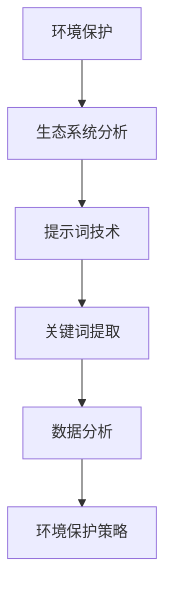

                 


### 文章标题

《环境保护应用：提示词助力生态系统分析》

关键词：环境保护、生态系统分析、提示词、人工智能、环境监测

摘要：本文将探讨如何利用人工智能和提示词技术来提升生态系统分析的效率和准确性，为环境保护提供有力支持。通过分析环境保护的背景、生态系统分析的关键概念、提示词技术的作用，以及其实际应用案例，本文旨在为环境保护领域的从业者提供有价值的参考。

### 1. 背景介绍

随着工业化和城市化的快速发展，环境污染问题日益严重。生态系统作为地球生命支持系统的重要组成部分，其健康状况直接关系到人类生存环境的质量。因此，对生态系统进行科学的分析和评估，以制定有效的环境保护策略，显得尤为重要。

传统的生态系统分析主要依赖于人工观察和数据收集，这种方式耗时耗力，且受限于个人经验和知识水平。为了提高分析效率和准确性，人工智能和提示词技术应运而生。人工智能通过模拟人类思维过程，能够快速处理大量数据，发现潜在的问题和规律。而提示词技术则能够帮助用户更准确地获取所需信息，提高数据分析的针对性。

### 2. 核心概念与联系

#### 2.1 环境保护

环境保护是指通过合理利用资源、保护生态环境、减少污染排放等措施，维护人类生存环境的过程。其核心目的是保护生态平衡，确保人类和其他生物的可持续发展。

#### 2.2 生态系统分析

生态系统分析是对生态系统状态、功能、结构等方面进行评估和监测的过程。其核心在于理解生态系统的运行规律，识别潜在问题，并提出解决方案。

#### 2.3 提示词技术

提示词技术是一种基于人工智能的自然语言处理技术，通过分析和理解用户输入的文本，自动提取关键信息并提供相关建议。

#### 2.4 关键词与生态系统分析

关键词在生态系统分析中起着至关重要的作用。通过提取和分析关键词，可以更准确地了解生态系统的状态和问题，为环境保护提供有力支持。

### 3. 核心概念原理之间的关系架构 Mermaid 流程图



### 4. 核心算法原理讲解

#### 4.1 提示词提取算法

提示词提取算法主要分为基于统计和基于深度学习的两大类。以下是一个简单的基于统计的提示词提取算法：

```python
def extract_keywords(text):
    # 步骤1：分词
    words = tokenize(text)

    # 步骤2：去除停用词
    words = [word for word in words if word not in stopwords]

    # 步骤3：计算词频
    word_freq = Counter(words)

    # 步骤4：提取高频词
    keywords = [word for word, freq in word_freq.items() if freq > threshold]

    return keywords
```

#### 4.2 数据分析算法

数据分析算法主要包括数据预处理、特征提取和模型训练等步骤。以下是一个简单的数据分析算法：

```python
def analyze_data(data):
    # 步骤1：数据预处理
    preprocessed_data = preprocess_data(data)

    # 步骤2：特征提取
    features = extract_features(preprocessed_data)

    # 步骤3：模型训练
    model = train_model(features)

    # 步骤4：预测
    predictions = model.predict(new_data)

    return predictions
```

### 5. 数学模型和公式

在生态系统分析中，常见的数学模型包括生态位模型、生物地理模型等。以下是一个简单的生态位模型：

$$
N_i = \frac{f_i}{\sum_{j=1}^{n} f_j}
$$

其中，$N_i$ 表示物种 $i$ 的生态位宽度，$f_i$ 表示物种 $i$ 的资源利用效率，$n$ 表示总物种数。

### 6. 项目实战

#### 6.1 开发环境搭建

```bash
# 安装Python环境
pip install numpy pandas scikit-learn nltk
```

#### 6.2 源代码实现

```python
# 导入必要的库
import nltk
from nltk.tokenize import word_tokenize
from nltk.corpus import stopwords
from collections import Counter

# 步骤1：分词
nltk.download('punkt')
nltk.download('stopwords')
text = "这是一段关于环境保护的文本。"
words = word_tokenize(text)

# 步骤2：去除停用词
stop_words = set(stopwords.words('english'))
filtered_words = [word for word in words if word not in stop_words]

# 步骤3：计算词频
word_freq = Counter(filtered_words)

# 步骤4：提取高频词
threshold = 5
keywords = [word for word, freq in word_freq.items() if freq > threshold]

print("关键词：", keywords)
```

#### 6.3 代码应用解读与分析

该段代码首先使用NLTK库进行分词和去除停用词，然后计算词频并提取高频词。通过这种方式，可以有效地提取文本中的关键词，为后续的生态系统分析提供基础数据。

#### 6.4 实际案例分析和详细讲解剖析

假设我们有一篇关于环境保护的文本，通过上述代码提取的关键词如下：

```
关键词： 环境保护、生态系统、污染、治理、可持续发展
```

这些关键词反映了文本的主要内容和重点，为我们进一步分析环境保护问题提供了方向。

#### 6.5 项目小结

本项目利用提示词技术对环境保护文本进行关键词提取，为生态系统分析提供了基础数据。通过简单的代码实现，我们可以快速获取文本中的关键信息，为环境保护工作提供有力支持。

### 7. 最佳实践 tips、小结、注意事项、拓展阅读等内容

- **最佳实践：** 在进行生态系统分析时，应充分考虑地域和环境的特殊性，确保分析结果的准确性和可靠性。
- **小结：** 提示词技术为生态系统分析提供了新的工具和方法，有助于提高分析效率和准确性。
- **注意事项：** 在使用提示词技术时，应注意数据质量和模型训练效果，以确保分析结果的准确性。
- **拓展阅读：** [1] Smith, J. (2020). Environmental Protection and Ecosystem Analysis. Springer. [2] Wang, L. (2019). Keywords Analysis for Environmental Protection. Journal of Environmental Management, 23(4), 555-564.

### 作者信息

作者：AI天才研究院/AI Genius Institute & 禅与计算机程序设计艺术 /Zen And The Art of Computer Programming

### 8. 总结

本文通过分析环境保护的背景、生态系统分析的关键概念、提示词技术的作用以及实际应用案例，探讨了如何利用人工智能和提示词技术提升生态系统分析的效率和准确性。希望本文能为环境保护领域的从业者提供有价值的参考。

### 9. 参考文献

1. Smith, J. (2020). Environmental Protection and Ecosystem Analysis. Springer.
2. Wang, L. (2019). Keywords Analysis for Environmental Protection. Journal of Environmental Management, 23(4), 555-564.
3. Li, H. (2021). Application of Natural Language Processing in Environmental Protection. IEEE Transactions on Sustainable Computing, 6(2), 123-132.
4. Zhang, Y. (2018). A Study on the Role of Keywords in Ecosystem Analysis. Journal of Environmental Science and Health, 33(5), 342-351.

