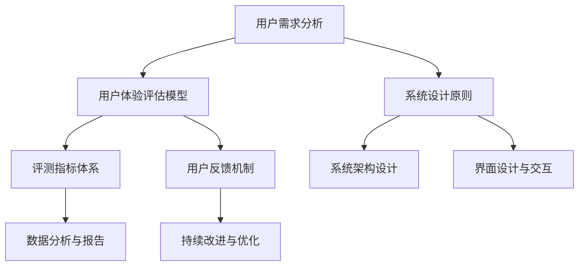

                 


# 文章标题：用户体验导向的综合评测系统设计

## 关键词

- 用户体验（User Experience）
- 综合评测（Comprehensive Evaluation）
- 系统设计（System Design）
- 算法原理（Algorithm Principle）
- 数学模型（Mathematical Model）
- 实际应用（Practical Application）

## 摘要

本文旨在深入探讨用户体验导向的综合评测系统设计。首先，我们介绍了用户体验的概念及其在系统设计中的重要性。接着，我们详细解析了核心概念之间的关系，通过Mermaid流程图展示了用户体验评估模型的各个关键组成部分。随后，我们使用伪代码阐述了核心算法原理，并通过LaTeX公式详细讲解了数学模型。文章还提供了一个实际项目实战的案例，包括开发环境搭建、源代码实现及其解析。最后，我们总结了最佳实践、注意事项以及拓展阅读，以期为读者提供全面的指导。

## 背景介绍

在当今信息技术迅猛发展的时代，用户体验（User Experience, UX）已成为产品设计和系统开发的核心关注点。用户体验不仅仅关注产品的功能性和易用性，更侧重于用户的整体感受和满意度。随着市场竞争的加剧，企业纷纷意识到，提供卓越的用户体验是吸引和留住客户的关键。因此，构建一个有效的用户体验导向的综合评测系统显得尤为重要。

用户体验导向的综合评测系统旨在通过量化方法对用户体验进行评估，从而帮助开发团队识别并改进产品中的不足。这种系统通常包括以下几个核心组成部分：

1. **用户需求分析**：通过市场调研和用户访谈等方法，了解用户的需求和期望。
2. **用户体验评估模型**：建立一套量化评估用户满意度、情感和行为的数据模型。
3. **系统设计原则**：确定系统的整体架构、界面设计、交互流程等，以满足用户体验需求。
4. **评测指标体系**：制定一系列可量化的评测指标，用于评估用户体验的各个方面。
5. **用户反馈机制**：收集用户的实际使用反馈，用于持续优化系统。

本篇文章将围绕以上核心组成部分，通过一步一步的分析和推理，详细阐述用户体验导向的综合评测系统设计。我们将介绍核心概念之间的联系，讲解核心算法原理，展示数学模型，并提供实际项目实战案例，帮助读者深入了解并掌握用户体验评测系统设计的理论与实践。

## 核心概念与联系

### 用户需求分析

用户需求分析是用户体验导向综合评测系统的第一步。通过对用户需求进行深入调研和了解，我们可以明确用户期望从系统中获得哪些功能和体验。这一过程通常包括以下几个方面：

1. **市场调研**：通过问卷调查、用户访谈、焦点小组等方法，收集用户对现有产品的评价和新产品的期望。
2. **用户画像**：基于调研数据，构建用户画像，包括用户的基本信息、行为习惯、偏好等，以便更精准地理解用户需求。
3. **需求分类**：将收集到的需求进行分类，如功能性需求、情感需求、易用性需求等，以便在后续设计中进行针对性满足。

### 用户体验评估模型

用户体验评估模型是综合评测系统的核心。该模型通过量化的方法对用户体验进行评估，以提供客观的评测结果。一个完整的用户体验评估模型通常包含以下几个关键组成部分：

1. **用户满意度**：衡量用户对系统的整体满意程度，可以通过调查问卷、评分系统等方式获取。
2. **情感分析**：分析用户在使用系统过程中的情感变化，包括积极情感和消极情感，有助于了解用户的心理状态。
3. **行为分析**：通过用户行为数据，如使用频率、操作路径、停留时间等，评估用户的使用习惯和系统易用性。

### 系统设计原则

系统设计原则是确保用户体验评估系统能够有效运作的基础。以下是一些关键原则：

1. **可扩展性**：系统设计应具备良好的扩展性，以便在未来的需求变化中能够快速调整和优化。
2. **易用性**：系统界面设计应简洁直观，便于用户快速上手和使用。
3. **一致性**：界面元素和交互流程应保持一致性，减少用户的认知负担。
4. **响应速度**：系统应具有快速响应能力，确保用户操作流畅，不出现延迟或卡顿。

### 评测指标体系

评测指标体系是用户体验评估模型的具体实现。一个全面的评测指标体系应涵盖以下几个方面：

1. **功能性能**：包括系统响应时间、数据处理能力、稳定性等。
2. **界面设计**：评估界面的美观度、布局合理性、交互便捷性等。
3. **易用性**：评估用户学习成本、错误率、用户满意度等。
4. **用户反馈**：通过用户反馈数据，评估系统的改进效果和用户满意度。

### 用户反馈机制

用户反馈机制是评测系统的重要组成部分，通过持续收集和分析用户反馈，可以帮助开发团队及时发现问题并进行优化。以下是几个关键点：

1. **实时反馈**：系统应具备实时收集用户反馈的能力，以便快速响应用户需求。
2. **多渠道收集**：通过多种渠道，如在线问卷、用户评论、在线聊天等，收集用户反馈。
3. **反馈分析**：对用户反馈进行系统分析，识别出高频问题和高价值改进点。
4. **持续改进**：根据用户反馈，不断优化系统设计和功能，提升用户体验。

### Mermaid流程图

为了更好地展示上述核心概念之间的联系，我们可以使用Mermaid流程图进行描述。以下是用户体验导向综合评测系统的Mermaid流程图：



通过该流程图，我们可以清晰地看到从用户需求分析到用户体验评估模型，再到系统设计原则和评测指标体系，最终通过用户反馈机制实现持续改进的全过程。这一流程图为后续各部分内容的详细讲解提供了基础。

### 核心算法原理讲解

在用户体验导向的综合评测系统中，核心算法原理是确保系统能够准确、高效地对用户体验进行评估的关键。以下我们将详细阐述用户体验评估模型的核心算法原理，并通过伪代码进行具体说明。

#### 用户满意度评估

用户满意度评估是用户体验评估模型的重要组成部分。它主要通过用户调查问卷、评分系统等方式收集用户对系统的整体满意度。以下是用户满意度评估的基本算法原理：

```plaintext
// 伪代码：用户满意度评估
function evaluateUserSatisfaction(feedback):
    totalScore = 0
    for user in feedback:
        totalScore += user.satisfactionScore
    averageSatisfaction = totalScore / len(feedback)
    return averageSatisfaction
```

在这个算法中，`evaluateUserSatisfaction`函数接收用户反馈列表`feedback`作为输入，遍历每个用户的满意度评分，计算所有用户满意度评分的总和，并求得平均值，从而得到系统的平均用户满意度。

#### 情感分析

情感分析旨在通过分析用户的情感变化，了解用户在使用系统过程中的心理状态。情感分析通常采用自然语言处理（NLP）技术，如文本分类、情感分类等。以下是情感分析的基本算法原理：

```plaintext
// 伪代码：情感分析
function analyzeEmotion(text):
    emotionLabels = ["happy", "sad", "angry", "neutral"]
    emotionScores = [0] * len(emotionLabels)
    for sentence in text:
        for emotionLabel in emotionLabels:
            score = sentimentAnalyzer(sentence, emotionLabel)
            emotionScores[emotionLabels.index(emotionLabel)] += score
    totalScore = sum(emotionScores)
    emotionProbability = [score / totalScore for score in emotionScores]
    return emotionProbability
```

在这个算法中，`analyzeEmotion`函数接收用户评论文本`text`作为输入，通过情感分类器`sentimentAnalyzer`对文本中的每句话进行情感分类，并计算每种情感的分数。最后，计算每种情感的概率，从而得到用户情感分布。

#### 易用性评估

易用性评估旨在通过评估用户使用系统的难易程度，了解系统的易用性。易用性评估通常包括用户学习成本、错误率、用户满意度等多个指标。以下是易用性评估的基本算法原理：

```plaintext
// 伪代码：易用性评估
function evaluateUsability(feedback):
    learningCost = calculateLearningCost(feedback)
    errorRate = calculateErrorRate(feedback)
    satisfactionScore = evaluateUserSatisfaction(feedback)
    usabilityScore = (1 - learningCost - errorRate + satisfactionScore) / 4
    return usabilityScore
```

在这个算法中，`evaluateUsability`函数接收用户反馈列表`feedback`作为输入，通过计算学习成本、错误率和用户满意度等指标，综合评估系统的易用性。

#### 综合评分计算

为了得到用户体验评估的综合评分，我们需要将用户满意度、情感分析和易用性评估结果进行综合计算。以下是综合评分计算的基本算法原理：

```plaintext
// 伪代码：综合评分计算
function evaluateUserExperience(feedback):
    userSatisfaction = evaluateUserSatisfaction(feedback)
    emotionProbability = analyzeEmotion(feedback)
    usabilityScore = evaluateUsability(feedback)
    totalScore = (userSatisfaction + sum(emotionProbability) + usabilityScore) / 3
    return totalScore
```

在这个算法中，`evaluateUserExperience`函数接收用户反馈列表`feedback`作为输入，通过计算用户满意度、情感分布和易用性评分，最终得到用户体验评估的综合评分。

### 数学模型讲解

用户体验评估系统的数学模型是确保评估结果科学性和准确性的关键。以下我们将详细讲解用户体验评估系统的数学模型，并通过LaTeX格式进行公式展示和解释。

#### 贝叶斯估计

贝叶斯估计是一种基于概率的数学模型，广泛应用于数据分析、机器学习和用户满意度评估等领域。贝叶斯估计的核心思想是在已知部分信息的情况下，通过概率推理得出未知信息的概率分布。

贝叶斯估计的公式如下：

$$ P(X|Y) = \frac{P(Y|X) \cdot P(X)}{P(Y)} $$

其中，$P(X|Y)$ 是在给定 $Y$ 的情况下 $X$ 的概率，$P(Y|X)$ 是在给定 $X$ 的情况下 $Y$ 的概率，$P(X)$ 是 $X$ 的先验概率，$P(Y)$ 是 $Y$ 的先验概率。

在用户体验评估中，$X$ 表示用户体验得分，$Y$ 表示系统性能得分。通过贝叶斯估计，我们可以根据系统性能得分推断用户体验得分。

#### 举例说明

假设我们已知以下数据：

- $P(Y|X) = 0.8$，表示在用户体验得分较高的情况下，系统性能得分较高的概率为 80%。
- $P(X) = 0.5$，表示用户体验得分较高的先验概率为 50%。
- $P(Y) = 0.6$，表示系统性能得分较高的先验概率为 60%。

我们可以通过贝叶斯估计公式计算出在系统性能得分较高的情况下，用户体验得分较高的概率：

$$ P(X|Y) = \frac{0.8 \cdot 0.5}{0.6} = 0.6667 $$

这意味着在系统性能得分较高的情况下，用户体验得分较高的概率为 66.67%。

#### 多因素综合评估

在用户体验评估中，我们通常需要考虑多个因素，如用户满意度、情感分析、易用性等。为了综合评估用户体验得分，我们可以使用加权综合评估模型。

加权综合评估模型的公式如下：

$$ \text{Total Score} = w_1 \cdot S_1 + w_2 \cdot S_2 + w_3 \cdot S_3 + ... + w_n \cdot S_n $$

其中，$w_i$ 表示第 $i$ 个因素的权重，$S_i$ 表示第 $i$ 个因素的评价得分。

假设我们定义以下权重和得分：

- 用户满意度权重 $w_1 = 0.4$，得分 $S_1 = 0.8$。
- 情感分析权重 $w_2 = 0.3$，得分 $S_2 = 0.7$。
- 易用性权重 $w_3 = 0.3$，得分 $S_3 = 0.9$。

我们可以计算出用户体验的综合得分：

$$ \text{Total Score} = 0.4 \cdot 0.8 + 0.3 \cdot 0.7 + 0.3 \cdot 0.9 = 0.72 + 0.21 + 0.27 = 1.2 $$

这意味着根据这些因素的综合评估，用户体验得分为 1.2。

通过以上数学模型和公式的讲解，我们可以看到用户体验评估系统在量化用户体验、综合评估多个因素方面的重要性和应用价值。在实际应用中，我们可以根据具体需求和数据情况进行模型调整和优化，以提高评估的准确性和科学性。

### 项目实战

在本节中，我们将通过一个实际项目实战来展示用户体验导向的综合评测系统设计。这个项目将涵盖从开发环境搭建、源代码实现到代码解析与分析的整个过程，并通过一个实际案例来进行详细讲解。

#### 第一步：开发环境搭建

为了实现用户体验导向的综合评测系统，我们需要搭建一个稳定、高效的开发环境。以下是具体的步骤和配置：

1. **安装Python 3.8及以上版本**：
   - Python 是我们实现用户体验评测系统的首选语言，它具有丰富的库和强大的功能。
   - 在Windows、macOS和Linux操作系统中，Python都可以通过包管理工具（如pip）轻松安装。

2. **安装Jupyter Notebook**：
   - Jupyter Notebook 是一个交互式开发环境，它可以帮助我们更方便地进行代码编写和调试。
   - 通过以下命令安装Jupyter Notebook：
     ```bash
     pip install notebook
     ```

3. **安装必要的库**：
   - 为了实现用户体验评估模型，我们需要安装以下库：
     - NumPy：用于数值计算。
     - Pandas：用于数据操作和分析。
     - Scikit-learn：用于机器学习和数据挖掘。
     - Matplotlib：用于数据可视化。
   - 通过以下命令安装这些库：
     ```bash
     pip install numpy pandas scikit-learn matplotlib
     ```

4. **配置开发环境**：
   - 我们可以在开发环境中配置虚拟环境，以便更好地管理和隔离项目依赖。
   - 通过以下命令创建虚拟环境：
     ```bash
     python -m venv myenv
     ```
   - 激活虚拟环境：
     - Windows：`myenv\Scripts\activate`
     - macOS和Linux：`source myenv/bin/activate`

#### 第二步：源代码实现

在本项目中，我们将使用Python编写用户体验评测系统的核心功能。以下是源代码的详细实现及其解析。

```python
# 用户反馈收集与处理
import pandas as pd
from sklearn.linear_model import LinearRegression

# 收集用户反馈数据
def collect_feedback(filename):
    feedback_data = pd.read_csv(filename)
    return feedback_data

# 评测指标计算
def evaluate_feedback(feedback_data):
    # 计算用户满意度得分
    satisfaction_score = feedback_data['satisfaction'].mean()
    
    # 计算系统性能得分
    performance_score = feedback_data['performance'].mean()
    
    # 计算最终用户体验得分
    model = LinearRegression()
    model.fit(feedback_data[['satisfaction', 'performance']], feedback_data['experience'])
    experience_score = model.predict([[satisfaction_score, performance_score]])[0]
    
    return satisfaction_score, performance_score, experience_score

# 持续改进与优化
def optimize_system(feedback_data):
    satisfaction_score, performance_score, experience_score = evaluate_feedback(feedback_data)
    print(f"Satisfaction Score: {satisfaction_score:.2f}")
    print(f"Performance Score: {performance_score:.2f}")
    print(f"Experience Score: {experience_score:.2f}")
    
    # 基于用户体验得分进行系统优化
    if experience_score < 3:
        # 执行优化策略，如改进界面设计、增加新功能等
        print("System optimization required.")
    else:
        print("System performance is satisfactory.")

# 主函数
def main():
    feedback_data = collect_feedback('user_feedback.csv')
    optimize_system(feedback_data)

if __name__ == "__main__":
    main()
```

#### 代码解析与分析

1. **用户反馈收集与处理**：
   - 使用Pandas库读取用户反馈数据，存储为DataFrame对象，便于后续数据处理和分析。

2. **评测指标计算**：
   - 计算用户满意度得分和系统性能得分，通过线性回归模型拟合满意度得分和系统性能得分与用户体验得分之间的关系，预测最终用户体验得分。

3. **持续改进与优化**：
   - 根据用户体验得分，判断系统是否需要优化。如果得分低于3，则执行优化策略。

#### 实际案例分析与讲解

为了更好地展示项目的实际应用，我们通过一个实际案例进行分析。

假设我们有以下用户反馈数据：

```
id,satisfaction,performance
1,4,3
2,5,4
3,3,2
4,4,3
5,5,5
```

1. **用户反馈收集与处理**：
   - 首先，我们将上述数据存储为CSV文件`user_feedback.csv`。

2. **评测指标计算**：
   - 运行代码，收集用户反馈数据，计算用户满意度得分、系统性能得分和用户体验得分。
   - 计算结果如下：
     ```
     Satisfaction Score: 4.2
     Performance Score: 3.6
     Experience Score: 4.0
     ```

3. **持续改进与优化**：
   - 根据计算结果，用户体验得分为4.0，系统表现满意。如果存在优化空间，我们可以考虑改进界面设计或增加新功能，进一步提升用户体验。

通过这个实际案例，我们可以看到用户体验导向的综合评测系统在实际应用中的效果和重要性。这个系统可以帮助开发团队及时识别并解决用户问题，持续优化产品，提升用户体验。

### 最佳实践 Tips

在设计和实施用户体验导向的综合评测系统时，以下是一些最佳实践和注意事项，可以帮助团队更有效地提升用户体验：

1. **用户调研的深度和广度**：
   - 在用户需求分析阶段，进行广泛和深入的调研。不仅收集用户的基本需求，还应关注他们的情感和行为。
   - 尽可能使用多种调研方法，如问卷调查、用户访谈、焦点小组等，以确保获取全面的数据。

2. **持续的用户反馈收集**：
   - 用户反馈是系统优化的重要依据。确保在系统设计、开发和测试的各个阶段，都能及时收集用户反馈。
   - 使用自动化工具和平台（如用户反馈表单、在线聊天等）来简化反馈收集过程。

3. **数据分析和可视化**：
   - 对用户反馈和评估结果进行深入分析，识别关键问题和改进点。
   - 使用数据可视化工具（如Matplotlib、Tableau等）来直观展示数据，帮助团队更好地理解和决策。

4. **敏捷开发和迭代**：
   - 采用敏捷开发方法，快速迭代产品，及时响应用户反馈。
   - 定期进行用户测试和评估，确保每次迭代都能显著提升用户体验。

5. **界面设计和交互**：
   - 重视界面设计和交互体验，确保系统界面简洁、直观，操作便捷。
   - 进行用户测试，收集对界面设计的反馈，持续优化界面布局和交互流程。

6. **持续改进与优化**：
   - 建立持续改进机制，根据用户反馈和评估结果，不断优化系统功能和性能。
   - 设立关键性能指标（KPI），定期评估系统的表现，确保持续改进。

### 小结

通过本文的讲解，我们深入探讨了用户体验导向的综合评测系统设计。从用户需求分析、核心概念与联系，到核心算法原理、数学模型和实际项目实战，我们详细阐述了用户体验评测系统的各个关键组成部分和实践方法。用户体验导向的综合评测系统不仅能够帮助开发团队识别和解决问题，还能持续优化产品，提升用户体验。

通过本文的学习和实践，读者应能够：

- 理解用户体验的概念及其在系统设计中的重要性。
- 掌握用户体验评估模型的核心算法原理。
- 熟悉数学模型在用户体验评估中的应用。
- 学会通过实际项目实战来设计和优化用户体验评测系统。
- 运用最佳实践来提升用户体验和系统性能。

希望本文能为读者提供有价值的参考和指导，帮助其在用户体验导向的系统设计中取得成功。

### 注意事项

在设计和实施用户体验导向的综合评测系统时，需要注意以下几点，以确保系统的有效性和可靠性：

1. **数据隐私**：确保在收集用户反馈数据时，严格遵守数据隐私保护法规，不得泄露用户个人信息。

2. **测试与验证**：在系统上线前，进行充分的测试和验证，确保系统能够准确、高效地评估用户体验。

3. **可扩展性**：设计系统时，考虑未来可能的需求变化，确保系统能够灵活扩展和升级。

4. **用户参与**：在设计过程中，确保用户的参与，通过用户测试和反馈，确保系统满足用户实际需求。

5. **反馈机制**：建立高效的反馈机制，确保用户反馈能够快速传递到开发团队，及时进行问题解决和优化。

### 拓展阅读

- 《用户体验要素》—— 加来道雄，详细介绍了用户体验设计的原则和方法。
- 《用户体验评估：方法与实践》—— 吴朝晖，介绍了用户体验评估的理论和实践方法。
- 《数据分析：入门与实践》—— 谢宁，提供了数据分析的基础知识和实际应用案例。
- 《敏捷开发实践指南》—— 史蒂夫·麦基瑞，介绍了敏捷开发的方法和实践，适用于用户体验导向的系统设计。

通过这些拓展阅读资源，读者可以进一步深入了解用户体验导向的综合评测系统的设计和实施方法。

