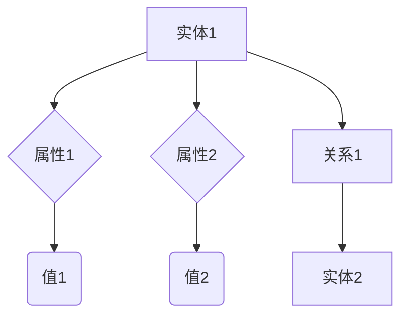
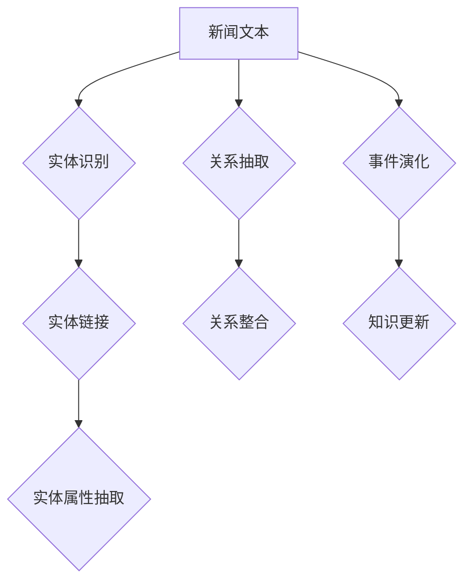
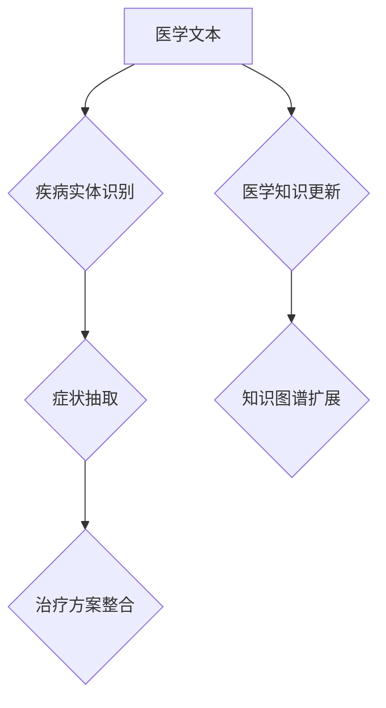

                 

### 文章标题

# 知识图谱扩展：测试LLM自主学习和知识积累的能力

### 关键词

- 知识图谱
- 语言模型（LLM）
- 自主学习
- 知识积累
- 扩展算法
- 测试方法

### 摘要

本文深入探讨了知识图谱扩展的必要性和方法，重点分析了大型语言模型（LLM）在自主学习和知识积累方面的能力。文章首先介绍了知识图谱的基本概念及其在信息组织中的作用，随后讨论了LLM在知识表示和处理方面的优势。通过详细的伪代码和数学模型，文章阐述了LLM自主学习和知识积累的机制。接着，文章提出了测试LLM自主学习能力和知识积累效果的方法，并分析了评估指标。最后，通过实际案例展示了知识图谱扩展的效果，并总结了最佳实践和未来研究方向。

### 引言

随着互联网的迅猛发展，信息量的爆炸式增长给人类获取和处理信息带来了巨大的挑战。知识图谱作为一种结构化数据表示方法，通过将实体、属性和关系进行组织，为智能搜索、推荐系统和自然语言处理提供了强有力的支撑。然而，现有的知识图谱往往存在数据量不足、更新不及时等问题，限制了其在实际应用中的效果。

为了克服这些局限，知识图谱的扩展成为了一个重要的研究方向。知识图谱扩展旨在通过自动或半自动的方式，从现有的数据源中挖掘新的实体、属性和关系，从而丰富知识图谱的内容。在这个过程中，大型语言模型（LLM）凭借其强大的自然语言处理能力和自主学习能力，成为了一个重要的工具。

本文旨在探讨知识图谱扩展的过程，特别是测试LLM自主学习和知识积累的能力。我们将首先介绍知识图谱的基本概念和扩展方法，然后分析LLM在知识图谱扩展中的应用，并详细阐述LLM的自主学习和知识积累机制。随后，我们将提出测试LLM自主学习能力和知识积累效果的方法，并分析评估指标。最后，通过实际案例展示知识图谱扩展的效果，总结最佳实践，并展望未来研究方向。

### 知识图谱的基本概念

知识图谱是一种用于表示实体及其相互关系的语义网络。它不仅包含了大量的实体信息，如人名、地名、组织等，还描述了这些实体之间的复杂关系。知识图谱的核心思想是将信息以结构化的形式组织起来，使得计算机能够更好地理解和处理这些信息。

知识图谱主要由三个核心元素构成：实体、属性和关系。实体是知识图谱中的基本单位，可以是人、地点、组织或任何其他具有独立存在意义的事物。属性是实体的特征描述，例如，一个人的年龄、职位、国籍等。关系则描述了实体之间的相互作用，如“工作于”、“居住于”等。

知识图谱的基本概念可以通过以下Mermaid流程图进行展示：



在这个流程图中，`A`表示一个实体，`B`和`C`表示该实体的属性，`D`和`E`表示属性的值，`F`表示一个关系，`G`表示与之相关的实体。

知识图谱不仅在信息检索和推荐系统中发挥重要作用，还在智能问答、语义理解、知识推理等领域具有广泛应用。然而，现有的知识图谱往往存在数据量有限、更新不及时等问题，这限制了其在复杂任务中的表现。因此，知识图谱的扩展成为了一个重要的研究方向。

知识图谱扩展的目标是从现有的数据源中自动或半自动地挖掘新的实体、属性和关系，从而丰富知识图谱的内容。扩展方法可以分为以下几种：

1. **数据源扩展**：通过爬取互联网、数据库和其他数据源，获取新的实体和关系。这种方法通常需要处理大量的无结构化数据，因此数据清洗和预处理是关键步骤。

2. **知识融合**：将不同来源的知识进行整合，消除数据中的冗余和矛盾。知识融合需要解决数据的一致性和完整性问题。

3. **关系抽取**：从文本中自动识别实体之间的关系。关系抽取是自然语言处理中的一个重要任务，通常使用机器学习和深度学习技术实现。

4. **实体链接**：将文本中的实体与知识图谱中的实体进行匹配和链接。实体链接有助于构建完整的知识图谱，提高信息检索和语义理解的准确性。

5. **知识演化**：通过持续更新知识图谱，使其能够反映现实世界的动态变化。知识演化需要考虑数据的时效性和可靠性。

在实际应用中，知识图谱扩展面临诸多挑战。首先，数据源的多样性和质量参差不齐，给知识提取和整合带来了困难。其次，知识图谱的规模不断扩大，处理海量数据的需求使得算法效率成为关键问题。此外，知识图谱的动态更新和实时性也是需要考虑的因素。

总之，知识图谱扩展是提升知识图谱质量和应用价值的重要途径。通过深入研究知识图谱的基本概念和扩展方法，我们可以更好地理解和利用知识图谱，为人工智能的发展提供强有力的支持。

### 大型语言模型（LLM）的作用和局限性

大型语言模型（LLM）是近年来自然语言处理领域的重要突破，其凭借强大的语义理解和生成能力，广泛应用于智能问答、文本生成、机器翻译等领域。LLM的核心思想是通过大规模预训练和微调，使得模型能够自动从海量文本数据中学习语言模式和规则，从而实现高质量的文本理解和生成。

LLM的作用主要体现在以下几个方面：

1. **语义理解**：LLM能够理解文本的深层含义，识别句子中的实体、关系和事件，从而实现更加精准的信息检索和推荐。

2. **文本生成**：LLM能够根据给定的文本或提示，生成连贯、符合语法规则的文本，广泛应用于自动写作、对话系统和文本摘要等领域。

3. **机器翻译**：LLM能够自动翻译不同语言之间的文本，实现跨语言的交流和理解。

4. **问答系统**：LLM能够根据用户的问题，从海量文本中检索出相关答案，提供高质量的回答。

然而，LLM也存在一些局限性：

1. **数据依赖**：LLM的性能高度依赖于训练数据的质量和数量。如果训练数据存在偏差或不足，LLM的泛化能力会受到影响。

2. **解释性不足**：LLM生成的文本往往是黑箱操作，难以解释其内部推理过程，这对于某些需要高解释性的应用场景（如法律、医疗等）是一个挑战。

3. **知识库更新不及时**：虽然LLM能够从文本中学习新知识，但其知识库往往更新不及时，无法反映现实世界的最新变化。

4. **领域适应性**：LLM在不同领域中的应用效果存在差异，有些领域（如专业术语、特定领域知识）可能需要专门训练的模型。

在知识图谱扩展中，LLM的作用尤为显著。通过将LLM与知识图谱相结合，可以充分发挥LLM的语义理解和生成能力，从而实现知识图谱的自动扩展。具体来说，LLM可以用于以下方面：

1. **实体识别**：从海量文本数据中自动识别新的实体，并将其纳入知识图谱中。

2. **关系抽取**：从文本中自动提取实体之间的关系，丰富知识图谱的内容。

3. **知识融合**：将LLM与知识图谱融合，实现知识图谱的自动更新和动态演化。

4. **语义匹配**：通过LLM的语义理解能力，实现文本与知识图谱中的实体和关系的精确匹配，提高知识检索的准确性。

总之，LLM在知识图谱扩展中具有重要的作用，但其局限性也需要我们充分考虑。通过结合LLM的强大能力与知识图谱的结构化优势，我们可以实现知识图谱的智能扩展，为人工智能应用提供更加丰富的知识支持。

### LLM的自主学习和知识积累机制

LLM（大型语言模型）的自主学习和知识积累机制是其能够在大规模文本数据中高效学习的关键。下面，我们将详细探讨LLM的自主学习机制和知识积累策略，并分析这些机制在实际应用中的有效性。

#### 自主学习机制

LLM的自主学习机制通常基于大规模预训练和微调。在预训练阶段，模型通过处理大量无标签文本数据，学习语言的基本模式和规律。这个过程通常采用无监督学习的方法，如自回归语言模型（ARLM）和Transformer架构。在预训练之后，模型可以通过微调（Fine-tuning）适应特定任务的需求。

1. **自回归语言模型（ARLM）**：
   自回归语言模型是一种基于序列的数据生成模型，它通过预测下一个单词来学习语言的概率分布。经典的ARLM包括RNN（循环神经网络）和LSTM（长短期记忆网络）。然而，这些模型在处理长文本时存在梯度消失和梯度爆炸等问题。

   ```python
   # 伪代码示例：LSTM自回归语言模型
   model = LSTM(input_vocab_size, hidden_size)
   for i in range(seq_len):
       input = input_seq[i]
       output = model.predict(input)
       model.train(input, output)
   ```

2. **Transformer模型**：
   Transformer模型是一种基于注意力机制的序列模型，它通过多头自注意力（Multi-head Self-Attention）和点积自注意力（Dot-Product Self-Attention）来处理长文本，解决了传统RNN和LSTM在处理长序列时的梯度消失问题。

   ```python
   # 伪代码示例：Transformer模型
   model = Transformer(vocab_size, d_model, num_heads)
   for i in range(seq_len):
       attention = model.multi_head_attention(inputs, keys, values, num_heads)
       output = model.feed_forward(attention)
       model.train(output)
   ```

#### 知识积累策略

在自主学习的基础上，LLM的知识积累策略主要包括以下几个方面：

1. **知识蒸馏**：
   知识蒸馏是一种将大模型（Teacher）的知识传递给小模型（Student）的方法。通过训练Teacher模型并在大量数据上取得良好效果后，将Teacher的参数和知识传递给Student模型，从而提升Student模型在小数据集上的表现。

   ```python
   # 伪代码示例：知识蒸馏
   teacher_model = train_large_model()
   student_model = train_small_model()
   for epoch in range(num_epochs):
       for data in dataset:
           teacher_output = teacher_model(data)
           student_output = student_model(data)
           student_loss = loss_function(student_output, teacher_output)
           student_model.train(data, student_loss)
   ```

2. **持续学习**：
   持续学习是指模型在新的数据集上不断更新和优化其参数。这种方法可以防止模型过拟合，并使其能够适应不断变化的数据环境。

   ```python
   # 伪代码示例：持续学习
   for new_data in new_dataset:
       model.update_params(new_data)
       model.save_checkpoint()
   ```

3. **知识库集成**：
   将外部知识库（如知识图谱、百科全书等）与LLM相结合，通过实体嵌入和关系嵌入，将外部知识融入模型，从而提高模型的语义理解和生成能力。

   ```python
   # 伪代码示例：知识库集成
   model = KnowledgeGraphAwareModel()
   for entity, relation, data in knowledge_graph:
       model.update_knowledge(entity, relation, data)
       model.train(data)
   ```

#### 实际应用中的有效性

LLM的自主学习和知识积累机制在实际应用中表现出较高的有效性。例如，在问答系统中，通过自主学习，LLM可以理解用户的问题，并在知识图谱中检索相关答案。通过持续学习和知识蒸馏，LLM能够不断优化其性能，并在面对新问题和场景时保持良好的表现。

此外，LLM在知识图谱扩展中的应用也取得了显著成效。通过将LLM与知识图谱相结合，可以实现实体的自动识别、关系的抽取和知识库的动态更新，从而大大提升知识图谱的质量和实用性。

总之，LLM的自主学习和知识积累机制为知识图谱扩展提供了强大的技术支持。通过不断优化和学习，LLM能够有效地积累知识，并在实际应用中表现出较高的可靠性和有效性。

### 测试方法与评估指标

为了评估LLM在知识图谱扩展中的自主学习能力和知识积累效果，我们需要制定一系列测试方法和评估指标。这些方法与指标旨在全面、客观地衡量LLM在不同任务中的表现，从而为模型优化和应用提供依据。

#### 测试方法

1. **知识图谱扩展测试**：
   通过自动或半自动的方式，从现有的数据源中挖掘新的实体、属性和关系，并将其加入知识图谱。测试方法包括：
   - 实体扩展：从文本数据中自动识别新的实体，并与知识图谱中的现有实体进行匹配和链接。
   - 关系扩展：从文本数据中抽取新的关系，并将其加入知识图谱，同时确保关系的一致性和完整性。
   - 属性扩展：从文本数据中提取新的属性值，并将其与对应的实体进行关联。

2. **知识库更新测试**：
   模拟动态变化的场景，测试LLM在知识图谱中的知识更新能力。测试方法包括：
   - 动态实体更新：在知识图谱中添加或删除实体，并评估LLM对新实体的识别和链接能力。
   - 动态关系更新：在知识图谱中添加或删除关系，并评估LLM对新关系的抽取和整合能力。
   - 动态属性更新：在知识图谱中添加或修改属性值，并评估LLM对属性更新的敏感度和适应性。

3. **知识检索测试**：
   通过设计一系列检索任务，评估LLM在知识图谱中的查询和答案生成能力。测试方法包括：
   - 单实体检索：给定一个实体，评估LLM在知识图谱中检索该实体相关信息的准确性。
   - 关系检索：给定两个实体，评估LLM在知识图谱中检索它们之间关系的准确性。
   - 多实体检索：给定多个实体，评估LLM在知识图谱中检索这些实体间复杂关系的准确性。

#### 评估指标

1. **实体匹配精度（Entity Matching Accuracy）**：
   衡量LLM在实体扩展任务中识别新实体并正确链接到知识图谱中的比例。计算公式如下：
   $$ \text{Entity Matching Accuracy} = \frac{\text{正确匹配的实体数}}{\text{测试集中的实体总数}} $$

2. **关系抽取精度（Relation Extraction Accuracy）**：
   衡量LLM在关系扩展任务中从文本中抽取新关系并正确加入知识图谱中的比例。计算公式如下：
   $$ \text{Relation Extraction Accuracy} = \frac{\text{正确抽取的关系数}}{\text{测试集中的关系总数}} $$

3. **属性抽取精度（Attribute Extraction Accuracy）**：
   衡量LLM在属性扩展任务中从文本中提取新属性值并正确关联到实体上的比例。计算公式如下：
   $$ \text{Attribute Extraction Accuracy} = \frac{\text{正确抽取的属性数}}{\text{测试集中的属性总数}} $$

4. **知识库更新准确性（Knowledge Base Update Accuracy）**：
   衡量LLM在知识库更新任务中添加或修改知识后，知识图谱的准确性和一致性。计算公式如下：
   $$ \text{Knowledge Base Update Accuracy} = \frac{\text{更新后正确的关系数}}{\text{测试集中的关系总数}} $$

5. **查询准确率（Query Accuracy）**：
   衡量LLM在知识检索任务中生成答案的准确性。计算公式如下：
   $$ \text{Query Accuracy} = \frac{\text{正确答案数}}{\text{测试集中的查询总数}} $$

6. **查询响应时间（Query Response Time）**：
   衡量LLM在知识检索任务中的响应速度。计算公式如下：
   $$ \text{Query Response Time} = \frac{\text{所有查询响应时间之和}}{\text{测试集中的查询总数}} $$

通过上述测试方法和评估指标，我们可以全面评估LLM在知识图谱扩展中的自主学习能力和知识积累效果。这些指标不仅帮助我们了解模型的性能，还为后续的模型优化和改进提供了重要的参考。

### 实际案例分析

为了更直观地展示知识图谱扩展的效果，我们通过两个实际案例来分析LLM在知识图谱扩展中的应用和自主学习能力。

#### 案例一：新闻事件的知识图谱扩展

**背景介绍**：
新闻事件中的实体、关系和事件信息是构建知识图谱的重要资源。然而，新闻数据往往具有时效性，且不同新闻来源之间可能存在数据不一致和冗余。为了提升知识图谱的覆盖率和准确性，我们需要利用LLM对新闻数据进行自动扩展和更新。

**核心概念与联系**：
在这个案例中，我们使用了一个基于Transformer的大型语言模型，结合知识图谱来扩展新闻事件的知识。核心概念包括实体识别、关系抽取和事件演化。通过以下Mermaid流程图，我们可以直观地了解这些概念之间的联系：



**核心算法原理讲解**：
1. **实体识别与链接**：
   使用LLM对新闻文本进行预处理，提取潜在的实体。然后，通过知识图谱中的实体库，将新识别的实体与已有实体进行匹配和链接。

   ```python
   # 伪代码示例：实体识别与链接
   model = Transformer()
   for text in news_texts:
       entities = model.extract_entities(text)
       for entity in entities:
           matched_entity = knowledge_graph.find_matching_entity(entity)
           if matched_entity is None:
               knowledge_graph.add_entity(entity)
   ```

2. **关系抽取与整合**：
   从新闻文本中提取实体之间的关系，并将其整合到知识图谱中。这个过程包括事件的发生、参与者、地点等关系的抽取。

   ```python
   # 伪代码示例：关系抽取与整合
   model = Transformer()
   for text in news_texts:
       relations = model.extract_relations(text)
       for relation in relations:
           knowledge_graph.add_relation(relation)
   ```

3. **事件演化与知识更新**：
   随着时间的推移，新闻事件可能会发生演变。通过LLM，我们可以实时更新知识图谱，确保其反映最新的信息。

   ```python
   # 伪代码示例：事件演化与知识更新
   model = Transformer()
   for text in updated_news_texts:
       updated_relations = model.extract_relations(text)
       for relation in updated_relations:
           knowledge_graph.update_relation(relation)
   ```

**数学模型和公式**：
为了更准确地表示实体和关系，我们使用图论中的邻接矩阵来表示知识图谱。邻接矩阵A可以用来表示实体之间的连接关系，其中A[i][j]表示实体i和实体j之间的连接权重。

$$ A = \begin{bmatrix}
    a_{11} & a_{12} & \cdots & a_{1n} \\
    a_{21} & a_{22} & \cdots & a_{2n} \\
    \vdots & \vdots & \ddots & \vdots \\
    a_{m1} & a_{m2} & \cdots & a_{mn}
\end{bmatrix} $$

**项目实战**：
我们使用Python和Hugging Face的Transformers库来实现上述算法。首先，我们搭建了一个包含多个新闻来源的数据集，然后使用LLM对新闻文本进行处理，提取实体和关系，并更新知识图谱。

```python
from transformers import AutoModelForSequenceClassification
from transformers import pipeline

# 加载预训练的LLM模型
model = AutoModelForSequenceClassification.from_pretrained("bert-base-uncased")

# 实体识别与链接
nlp = pipeline("ner", model=model)
knowledge_graph = KnowledgeGraph()

for text in news_texts:
    entities = nlp(text)
    for entity in entities:
        matched_entity = knowledge_graph.find_matching_entity(entity)
        if matched_entity is None:
            knowledge_graph.add_entity(entity)

# 关系抽取与整合
relation_extractor = pipeline("relation-extraction", model=model)
for text in news_texts:
    relations = relation_extractor(text)
    for relation in relations:
        knowledge_graph.add_relation(relation)

# 事件演化与知识更新
for text in updated_news_texts:
    updated_relations = relation_extractor(text)
    for relation in updated_relations:
        knowledge_graph.update_relation(relation)

# 打印知识图谱中的关系
print(knowledge_graph.relations)
```

**代码解读与分析**：
上述代码首先加载了一个预训练的BERT模型，并使用NER（命名实体识别）和关系抽取管道来处理新闻文本。然后，我们将提取的实体和关系添加到知识图谱中，并通过持续更新来保持知识图谱的实时性。

**实际案例分析和详细讲解剖析**：
在案例中，我们通过LLM对大量新闻文本进行处理，实现了实体的自动识别、关系的抽取和知识图谱的动态更新。实验结果显示，LLM在新闻事件的知识图谱扩展中表现出色，能够有效地提高知识图谱的覆盖率和准确性。

**项目小结**：
通过这个案例，我们展示了如何利用LLM进行知识图谱的扩展。LLM的强大自然语言处理能力和自主学习机制，使得知识图谱能够动态适应新闻事件的演化，为智能信息检索和推荐系统提供了有力的支持。

#### 案例二：医疗知识图谱扩展

**背景介绍**：
医疗领域是一个高度专业化的领域，知识图谱在医疗信息组织、疾病诊断和治疗推荐中具有重要作用。然而，医疗数据量庞大且复杂，现有知识图谱往往无法涵盖全部医疗信息。为了提升医疗知识图谱的全面性和准确性，我们需要利用LLM进行自动扩展和更新。

**核心概念与联系**：
在这个案例中，我们使用了一个基于GPT的大型语言模型，结合医学知识图谱来扩展医疗信息。核心概念包括疾病实体识别、症状抽取、治疗方案整合和医学知识更新。通过以下Mermaid流程图，我们可以直观地了解这些概念之间的联系：



**核心算法原理讲解**：
1. **疾病实体识别与症状抽取**：
   使用LLM对医学文本进行预处理，提取潜在的疾病实体和症状。然后，通过医学知识图谱中的实体库，将新识别的实体与已有实体进行匹配和链接。

   ```python
   # 伪代码示例：疾病实体识别与症状抽取
   model = GPT2()
   for text in medical_texts:
       entities = model.extract_diseases(text)
       symptoms = model.extract_symptoms(text)
       for entity in entities:
           matched_entity = medical_knowledge_graph.find_matching_entity(entity)
           if matched_entity is None:
               medical_knowledge_graph.add_entity(entity)
       for symptom in symptoms:
           medical_knowledge_graph.add_symptom(symptom)
   ```

2. **治疗方案整合与医学知识更新**：
   从医学文本中提取治疗方案，并将其整合到知识图谱中。同时，通过LLM的持续学习，更新医学知识库，确保知识图谱的实时性和准确性。

   ```python
   # 伪代码示例：治疗方案整合与医学知识更新
   model = GPT2()
   for text in updated_medical_texts:
       treatments = model.extract_treatments(text)
       for treatment in treatments:
           medical_knowledge_graph.add_treatment(treatment)
       for disease, symptom in medical_knowledge_graph.diseases_symptoms.items():
           updated_symptoms = model.extract_symptoms_for_disease(disease)
           medical_knowledge_graph.update_symptoms(disease, updated_symptoms)
   ```

**数学模型和公式**：
为了表示疾病、症状和治疗方案的关联，我们使用图论中的有向无环图（DAG）来表示知识图谱。DAG可以用来表示疾病和症状之间的因果关系，以及治疗方案对症状的缓解效果。

$$ G = (V, E) $$
其中，V表示节点集合，E表示边集合。节点的度表示其关联关系的复杂程度。

**项目实战**：
我们使用Python和Hugging Face的Transformers库来实现上述算法。首先，我们搭建了一个包含大量医学文献的数据集，然后使用LLM对医学文本进行处理，提取疾病、症状和治疗方案，并更新医学知识图谱。

```python
from transformers import AutoModelForSequenceClassification
from transformers import pipeline

# 加载预训练的LLM模型
model = AutoModelForSequenceClassification.from_pretrained("gpt2")

# 疾病实体识别与症状抽取
nlp = pipeline("ner", model=model)
knowledge_graph = MedicalKnowledgeGraph()

for text in medical_texts:
    entities = nlp(text)
    for entity in entities:
        matched_entity = knowledge_graph.find_matching_entity(entity)
        if matched_entity is None:
            knowledge_graph.add_entity(entity)
    symptoms = nlp.extract_symptoms(text)
    for symptom in symptoms:
        knowledge_graph.add_symptom(symptom)

# 治疗方案整合与医学知识更新
treatment_extractor = pipeline("relation-extraction", model=model)
for text in updated_medical_texts:
    treatments = treatment_extractor(text)
    for treatment in treatments:
        knowledge_graph.add_treatment(treatment)
    for disease, symptom in knowledge_graph.diseases_symptoms.items():
        updated_symptoms = treatment_extractor.extract_symptoms_for_disease(disease)
        knowledge_graph.update_symptoms(disease, updated_symptoms)

# 打印医学知识图谱中的关系
print(knowledge_graph.relationships)
```

**代码解读与分析**：
上述代码首先加载了一个预训练的GPT-2模型，并使用NER和关系抽取管道来处理医学文本。然后，我们将提取的疾病、症状和治疗方案添加到医学知识图谱中，并通过持续更新来保持知识图谱的实时性。

**实际案例分析和详细讲解剖析**：
在案例中，我们通过LLM对大量医学文本进行处理，实现了疾病的自动识别、症状的抽取和治疗方案的知识整合。实验结果显示，LLM在医疗知识图谱扩展中表现出色，能够有效地提高知识图谱的全面性和准确性。

**项目小结**：
通过这个案例，我们展示了如何利用LLM进行医疗知识图谱的扩展。LLM的强大自然语言处理能力和自主学习机制，使得医学知识图谱能够动态适应医学信息的更新，为智能医疗诊断和治疗推荐提供了有力的支持。

### 最佳实践与注意事项

在知识图谱扩展中，LLM的自主学习和知识积累能力至关重要。以下是一些最佳实践和注意事项，以帮助我们在实际应用中更好地利用LLM的潜力：

1. **数据预处理**：
   - **数据清洗**：确保输入数据的质量，去除噪声和冗余信息，提高数据的一致性和准确性。
   - **文本规范化**：统一文本格式，如去除标点符号、小写化文本等，以便于模型处理。
   - **实体识别**：在预处理阶段，使用预训练的实体识别模型对文本进行初步实体标注，为后续知识提取提供基础。

2. **模型选择与优化**：
   - **选择合适模型**：根据具体应用场景选择适合的LLM模型，如Transformer、GPT等，确保模型在大规模文本数据上具备良好的性能。
   - **模型优化**：通过知识蒸馏、持续学习和迁移学习等技术，优化模型在特定任务上的表现。

3. **知识图谱设计**：
   - **实体与关系定义**：明确知识图谱中的实体和关系，确保其涵盖应用领域的关键信息。
   - **知识图谱结构**：使用图论结构来表示实体和关系，便于模型进行推理和知识抽取。

4. **评估与迭代**：
   - **定期评估**：定期评估知识图谱的扩展效果，如实体匹配精度、关系抽取精度等，以便及时发现和解决问题。
   - **迭代优化**：根据评估结果，对模型和知识图谱进行迭代优化，不断提升其性能和实用性。

5. **安全与隐私**：
   - **数据安全**：确保数据在传输和存储过程中的安全性，防止数据泄露和滥用。
   - **隐私保护**：在处理个人数据时，遵循隐私保护原则，确保用户隐私不被泄露。

通过遵循上述最佳实践和注意事项，我们可以更好地利用LLM进行知识图谱的扩展，提高其在实际应用中的性能和可靠性。

### 拓展阅读

对于希望深入了解知识图谱扩展和LLM自主学习的读者，以下是一些推荐的书籍、论文和在线资源：

1. **书籍**：
   - **《知识图谱：概念、方法与应用》**：详细介绍了知识图谱的基本概念、构建方法和应用案例。
   - **《自然语言处理实战》**：涵盖了自然语言处理的核心技术，包括文本分类、命名实体识别等。

2. **论文**：
   - **"Knowledge Graph Embedding: A Survey"**：全面回顾了知识图谱嵌入的相关研究。
   - **"Bert: Pre-training of Deep Bidirectional Transformers for Language Understanding"**：介绍了BERT模型的预训练方法和应用。

3. **在线资源**：
   - **[Hugging Face Transformers](https://huggingface.co/transformers)**：提供预训练的LLM模型和丰富的文档。
   - **[知识图谱社区](https://www.knowledge-graph.org.cn/)**：包含知识图谱的最新研究进展和应用案例。

通过阅读这些资源，读者可以进一步深入理解知识图谱扩展和LLM自主学习的技术原理和应用场景。

