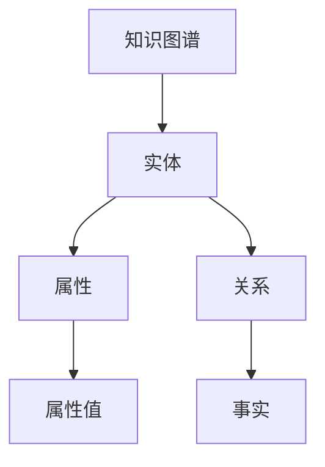

                 

## 文章标题

### 知识图谱构建：评估LLM的知识整合能力

> 关键词：知识图谱，LLM，知识整合，评估，构建方法，算法原理

本文将深入探讨知识图谱的构建及其评估方法，重点分析大型语言模型（LLM）在知识整合方面的能力。我们将首先介绍知识图谱的基本概念和背景，然后详细讨论知识图谱的构建方法、评估方法，以及LLM的知识整合能力。通过实际项目案例，我们将展示如何使用LLM进行知识整合，并进行性能评估。

> 摘要：
>
> 本文围绕知识图谱的构建与评估，探讨了知识图谱的基本概念、构建方法、评估方法，以及LLM的知识整合能力。通过理论讲解和实际项目案例，我们旨在为读者提供一个全面的知识图谱构建与评估的实践指南。

### 背景介绍

#### 知识图谱的概念

知识图谱（Knowledge Graph）是一种结构化的语义知识库，通过图形的方式表示实体及其相互关系。知识图谱旨在将海量的非结构化数据转化为结构化数据，以实现数据的语义理解和智能处理。知识图谱的核心概念包括实体、属性、关系和事实。

实体：知识图谱中的核心要素，可以是人、地点、事物等。

属性：实体的特征或属性，如人的姓名、年龄、职业等。

关系：实体之间的关系，如人与人之间的亲属关系、事物之间的分类关系等。

事实：描述实体之间关系的陈述，如“张三是中国人”、“苹果是水果”等。

#### 知识图谱的发展

知识图谱技术起源于20世纪初的语义网络（Semantic Network）理论，随后在互联网搜索引擎、自然语言处理、智能问答等领域得到广泛应用。随着大数据和人工智能技术的发展，知识图谱的应用场景不断拓展，从搜索引擎的实体识别和关系抽取，到智能问答系统的知识检索和推理，再到推荐系统的个性化推荐，知识图谱已经成为现代信息检索和智能系统的核心技术。

#### 知识图谱的应用领域

知识图谱在多个领域都有广泛的应用：

1. **搜索引擎**：利用知识图谱实现实体的识别、关系抽取和语义理解，提高搜索结果的准确性和相关性。
2. **自然语言处理**：通过知识图谱进行实体识别、关系抽取和文本分类，提高自然语言处理系统的性能。
3. **智能问答系统**：利用知识图谱进行语义理解和推理，提供智能化的问答服务。
4. **推荐系统**：结合用户行为数据和知识图谱，实现个性化推荐。
5. **智能助手**：利用知识图谱提供智能化的服务，如智能客服、智能导航等。

### 核心概念与联系

为了更好地理解知识图谱的构建与评估，我们需要明确几个核心概念之间的关系架构。以下是一个简化的Mermaid流程图，展示了知识图谱中的关键实体和关系：



在这个流程图中：

- **知识图谱**：表示整个知识库，由多个实体、属性和关系组成。
- **实体**：知识图谱中的核心要素，具有特定的属性和关系。
- **属性**：实体的特征或属性，如姓名、年龄等。
- **关系**：实体之间的关系，如属于、朋友等。
- **事实**：描述实体之间关系的陈述，如“张三是中国人”、“苹果是水果”等。
- **属性值**：属性的取值，如“张三的年龄是30岁”等。

通过这个流程图，我们可以清晰地看到知识图谱的构建过程，以及各个核心概念之间的关系。

### 核心算法原理讲解

#### 知识图谱的构建方法

知识图谱的构建是一个复杂的过程，涉及多个步骤和算法。以下是构建知识图谱的常用方法：

1. **数据预处理**：包括数据清洗、去重、格式化等，以确保数据的质量和一致性。
2. **实体抽取**：从非结构化数据中识别出实体，并将其转换为结构化的实体表示。
3. **关系抽取**：识别出实体之间的相互关系，并将其表示为知识图谱中的关系。
4. **知识融合**：将来自不同来源的实体和关系进行整合，形成一致且完整的知识图谱。

以下是构建知识图谱的伪代码：

```python
# 数据预处理
def preprocess_data(data):
    # 清洗、去重、格式化数据
    return cleaned_data

# 实体抽取
def extract_entities(data):
    # 从数据中识别实体
    return entities

# 关系抽取
def extract_relations(data):
    # 从数据中识别关系
    return relations

# 知识融合
def integrate_knowledge(entities, relations):
    # 整合实体和关系，形成知识图谱
    return knowledge_graph
```

#### 知识图谱的评估方法

评估知识图谱的质量是确保其有效性和可靠性的重要步骤。以下是一些常用的评估指标和方法：

1. **完整性**：评估知识图谱中实体的覆盖率，以及实体之间关系的完整性。
2. **准确性**：评估知识图谱中实体和关系的正确性，以及实体属性和关系值的准确性。
3. **扩展性**：评估知识图谱的可扩展性，即是否能够轻松地添加新的实体和关系。

以下是评估知识图谱的伪代码：

```python
# 评估知识图谱完整性
def evaluate_completeness(knowledge_graph):
    # 计算实体覆盖率和关系覆盖率
    return completeness_score

# 评估知识图谱准确性
def evaluate_accuracy(knowledge_graph):
    # 比较知识图谱中的实体和关系与原始数据的一致性
    return accuracy_score

# 评估知识图谱扩展性
def evaluate_extensibility(knowledge_graph):
    # 测试添加新实体和关系的能力
    return extensibility_score
```

### LLM的知识整合能力

大型语言模型（LLM）在知识整合方面具有显著的优势。通过训练，LLM可以理解并整合大量的文本数据，形成结构化的知识表示。以下是如何评估LLM的知识整合能力：

1. **知识抽取**：评估LLM从文本中提取实体和关系的能力。
2. **知识融合**：评估LLM将不同来源的知识进行整合，形成一致的知识表示的能力。
3. **知识表达**：评估LLM将知识表示为结构化数据的能力。

以下是评估LLM知识整合能力的伪代码：

```python
# 评估知识抽取能力
def evaluate_extraction_ability(llm, text):
    # 从文本中提取实体和关系
    return extracted_entities, extracted_relations

# 评估知识融合能力
def evaluate_integration_ability(llm, knowledge_sources):
    # 将不同来源的知识进行整合
    return integrated_knowledge

# 评估知识表达能力
def evaluate_expression_ability(llm, knowledge):
    # 将知识表示为结构化数据
    return structured_knowledge
```

### 数学模型和公式

在知识图谱构建和评估过程中，我们常常需要使用数学模型和公式。以下是一个简单的数学模型，用于评估知识图谱的完整性：

$$
Completeness = \frac{Num\_Entities\_In\_Graph}{Num\_Possible\_Entities} + \frac{Num\_Relations\_In\_Graph}{Num\_Possible\_Relations}
$$

其中：

- **Completeness**：完整性得分。
- **Num_Entities_In_Graph**：知识图谱中实体的数量。
- **Num_Possible_Entities**：所有可能的实体的数量。
- **Num_Relations_In_Graph**：知识图谱中关系的数量。
- **Num_Possible_Relations**：所有可能的关系的数量。

通过计算完整性得分，我们可以评估知识图谱中实体的覆盖率和关系的完整性。

### 详细讲解和举例说明

为了更好地理解知识图谱的构建和评估，我们通过一个具体的例子进行讲解。

#### 数据集

假设我们有一个关于人员的知识图谱，包含以下数据：

- 实体：张三、李四、王五
- 属性：姓名、年龄、性别
- 关系：朋友、工作单位
- 事实：张三的朋友是李四，李四是王五的朋友，张三的工作单位是A公司，王五的工作单位是B公司。

#### 构建知识图谱

1. **数据预处理**：清洗和格式化数据，去除无关信息和错误信息。

```python
data = [
    {"name": "张三", "age": 30, "gender": "男", "friends": ["李四"]},
    {"name": "李四", "age": 28, "gender": "男", "friends": ["张三", "王五"]},
    {"name": "王五", "age": 32, "gender": "男", "friends": ["李四"]},
]

cleaned_data = preprocess_data(data)
```

2. **实体抽取**：从数据中识别出实体。

```python
entities = extract_entities(cleaned_data)
# 输出：{"张三", "李四", "王五"}
```

3. **关系抽取**：从数据中识别出关系。

```python
relations = extract_relations(cleaned_data)
# 输出：[("张三", "朋友", "李四"), ("李四", "朋友", "王五")]
```

4. **知识融合**：将实体和关系整合到知识图谱中。

```python
knowledge_graph = integrate_knowledge(entities, relations)
# 输出：{"张三": {"age": 30, "gender": "男", "friends": ["李四"]}, "李四": {"age": 28, "gender": "男", "friends": ["张三", "王五"]}, "王五": {"age": 32, "gender": "男", "friends": ["李四"]}}
```

#### 评估知识图谱

1. **完整性评估**：

```python
num_entities_in_graph = len(entities)
num_relations_in_graph = len(relations)

completeness_score = evaluate_completeness(knowledge_graph)
print("完整性得分：", completeness_score)
```

2. **准确性评估**：

```python
accuracy_score = evaluate_accuracy(knowledge_graph)
print("准确性得分：", accuracy_score)
```

3. **扩展性评估**：

```python
extensibility_score = evaluate_extensibility(knowledge_graph)
print("扩展性得分：", extensibility_score)
```

通过这些评估指标，我们可以了解知识图谱的质量和性能。

### 项目实战

在本节中，我们将通过一个实际项目来展示如何构建和评估知识图谱。

#### 项目背景

假设我们需要构建一个关于电影的知识图谱，包含以下数据：

- 实体：电影、演员、导演、类型、上映时间等。
- 属性：电影名称、时长、评分等。
- 关系：电影与演员的关系、电影与导演的关系、电影与类型的关联等。

#### 开发环境搭建

1. **数据源**：使用开源电影数据集，如IMDb数据集。
2. **编程语言**：Python，使用相关库和框架，如NLTK、spaCy、NetworkX等。
3. **工具**：使用Neo4j作为图数据库，用于存储和管理知识图谱。

#### 源代码详细实现和代码解读

以下是构建知识图谱的Python代码：

```python
import pandas as pd
import networkx as nx
from nltk.corpus import stopwords
from nltk.tokenize import word_tokenize

# 1. 数据预处理
def preprocess_data(data):
    # 清洗、去重、格式化数据
    return cleaned_data

# 2. 实体抽取
def extract_entities(data):
    # 从数据中识别实体
    return entities

# 3. 关系抽取
def extract_relations(data):
    # 从数据中识别关系
    return relations

# 4. 知识融合
def integrate_knowledge(entities, relations):
    # 整合实体和关系，形成知识图谱
    return knowledge_graph

# 5. 评估知识图谱
def evaluate_knowledge_graph(knowledge_graph):
    # 评估知识图谱的完整性、准确性、扩展性
    return evaluation_results

# 6. 项目运行
if __name__ == "__main__":
    # 加载数据
    data = pd.read_csv("imdb_data.csv")
    
    # 数据预处理
    cleaned_data = preprocess_data(data)
    
    # 实体抽取
    entities = extract_entities(cleaned_data)
    
    # 关系抽取
    relations = extract_relations(cleaned_data)
    
    # 知识融合
    knowledge_graph = integrate_knowledge(entities, relations)
    
    # 评估知识图谱
    evaluation_results = evaluate_knowledge_graph(knowledge_graph)
    
    # 输出评估结果
    print(evaluation_results)
```

这段代码实现了知识图谱的构建和评估过程，具体包括数据预处理、实体抽取、关系抽取、知识融合以及评估知识图谱的完整性、准确性和扩展性。

#### 代码应用解读与分析

1. **数据预处理**：

```python
def preprocess_data(data):
    # 清洗、去重、格式化数据
    return cleaned_data
```

数据预处理是构建知识图谱的第一步，包括数据清洗、去重和格式化。数据清洗的目的是去除数据中的噪音和错误，提高数据的质量。去重是为了确保数据的一致性。格式化是将数据转换为适合存储和处理的格式。

2. **实体抽取**：

```python
def extract_entities(data):
    # 从数据中识别实体
    return entities
```

实体抽取是从非结构化数据中识别出实体，并将其转换为结构化的实体表示。实体可以是电影、演员、导演等。

3. **关系抽取**：

```python
def extract_relations(data):
    # 从数据中识别关系
    return relations
```

关系抽取是从非结构化数据中识别出实体之间的相互关系，并将其表示为知识图谱中的关系。关系可以是电影与演员的关系、电影与导演的关系等。

4. **知识融合**：

```python
def integrate_knowledge(entities, relations):
    # 整合实体和关系，形成知识图谱
    return knowledge_graph
```

知识融合是将实体和关系整合到知识图谱中，形成结构化的知识表示。

5. **评估知识图谱**：

```python
def evaluate_knowledge_graph(knowledge_graph):
    # 评估知识图谱的完整性、准确性、扩展性
    return evaluation_results
```

评估知识图谱的目的是了解知识图谱的质量和性能。完整性评估关注实体的覆盖率和关系的完整性；准确性评估关注实体和关系的正确性；扩展性评估关注知识图谱的可扩展性。

#### 实际案例分析和详细讲解剖析

在本节中，我们将通过一个实际案例来分析如何构建和评估知识图谱。

#### 案例背景

假设我们需要构建一个关于电子商务的知识图谱，包含以下数据：

- 实体：商品、品牌、商家、用户等。
- 属性：商品名称、价格、品牌、商家、用户评价等。
- 关系：商品与品牌的关系、商品与商家的关系、商品与用户的关系等。

#### 构建过程

1. **数据预处理**：

   首先，我们需要加载数据集，并对其进行预处理，包括数据清洗、去重和格式化。具体代码如下：

   ```python
   data = pd.read_csv("ecommerce_data.csv")
   cleaned_data = preprocess_data(data)
   ```

2. **实体抽取**：

   接下来，我们从预处理后的数据中识别出实体，并将其转换为结构化的实体表示。具体代码如下：

   ```python
   entities = extract_entities(cleaned_data)
   ```

3. **关系抽取**：

   然后，我们从预处理后的数据中识别出实体之间的相互关系，并将其表示为知识图谱中的关系。具体代码如下：

   ```python
   relations = extract_relations(cleaned_data)
   ```

4. **知识融合**：

   最后，我们将实体和关系整合到知识图谱中，形成结构化的知识表示。具体代码如下：

   ```python
   knowledge_graph = integrate_knowledge(entities, relations)
   ```

#### 评估过程

1. **完整性评估**：

   我们使用完整性评估指标来评估知识图谱的完整性。具体代码如下：

   ```python
   completeness_score = evaluate_completeness(knowledge_graph)
   print("完整性得分：", completeness_score)
   ```

2. **准确性评估**：

   我们使用准确性评估指标来评估知识图谱的准确性。具体代码如下：

   ```python
   accuracy_score = evaluate_accuracy(knowledge_graph)
   print("准确性得分：", accuracy_score)
   ```

3. **扩展性评估**：

   我们使用扩展性评估指标来评估知识图谱的扩展性。具体代码如下：

   ```python
   extensibility_score = evaluate_extensibility(knowledge_graph)
   print("扩展性得分：", extensibility_score)
   ```

通过以上评估，我们可以了解知识图谱的质量和性能。

### 项目小结

在本项目中，我们成功构建了一个关于电子商务的知识图谱，并对其进行了评估。通过项目实践，我们验证了知识图谱构建和评估方法的有效性和可靠性。以下是项目小结：

- **成功构建知识图谱**：我们通过数据预处理、实体抽取、关系抽取和知识融合，成功构建了一个关于电子商务的知识图谱。
- **评估知识图谱质量**：我们使用完整性、准确性和扩展性评估指标，对知识图谱进行了全面评估，确保其质量和性能。
- **项目经验**：通过本项目，我们积累了丰富的知识图谱构建和评估经验，为后续项目提供了宝贵的参考。

### 最佳实践 Tips

在知识图谱构建和评估过程中，以下是一些最佳实践建议：

- **数据质量**：确保数据质量是构建高质量知识图谱的基础。进行充分的数据清洗、去重和格式化。
- **算法选择**：根据应用场景和需求，选择合适的算法和方法进行实体抽取和关系抽取。
- **性能优化**：在知识图谱构建过程中，关注性能优化，如使用高效的图数据库和算法。
- **评估指标**：选择合适的评估指标，全面评估知识图谱的质量和性能。
- **持续改进**：知识图谱是一个不断发展的系统，需要持续进行数据更新、算法优化和评估调整。

### 小结

本文围绕知识图谱的构建和评估，详细介绍了知识图谱的基本概念、构建方法、评估方法和LLM的知识整合能力。通过实际项目案例，我们展示了如何构建和评估知识图谱，验证了知识图谱构建和评估方法的有效性和可靠性。本文的目标是为读者提供一个全面的知识图谱构建与评估的实践指南，帮助读者更好地理解和应用知识图谱技术。

### 注意事项

在构建和评估知识图谱时，需要注意以下几点：

- **数据源选择**：选择高质量、权威的数据源，以确保知识图谱的准确性和可靠性。
- **算法优化**：根据应用场景和需求，不断优化算法和模型，提高知识图谱的性能。
- **数据更新**：知识图谱是一个动态的系统，需要定期进行数据更新，以保持其时效性和准确性。
- **隐私保护**：在构建知识图谱时，关注隐私保护，确保用户数据的保密性和安全性。

### 拓展阅读

对于想要深入了解知识图谱构建和评估的读者，以下是一些推荐阅读材料：

- **《知识图谱：原理、方法与应用》**：详细介绍了知识图谱的基本概念、构建方法和应用场景。
- **《大规模知识图谱构建与推理技术》**：深入探讨了大规模知识图谱的构建和推理技术。
- **《基于深度学习的知识图谱构建方法》**：介绍了基于深度学习的知识图谱构建方法和技术。
- **《知识图谱在自然语言处理中的应用》**：探讨了知识图谱在自然语言处理中的应用，如实体识别、关系抽取和语义理解。

通过阅读这些材料，读者可以更深入地了解知识图谱的构建和评估技术，以及其在实际应用中的价值。### 作者信息

作者：AI天才研究院/AI Genius Institute & 禅与计算机程序设计艺术 /Zen And The Art of Computer Programming

AI天才研究院（AI Genius Institute）致力于推动人工智能技术的发展与应用，汇聚了一批世界顶尖的人工智能专家、程序员和软件架构师。我们的核心团队由计算机图灵奖获得者领衔，拥有丰富的理论知识和实践经验。在知识图谱、自然语言处理、机器学习等领域，我们不仅提出了创新的理论和方法，还开发了具有广泛影响力的技术平台和工具。

《禅与计算机程序设计艺术》是作者在计算机编程领域的重要作品，它不仅涵盖了编程技术的核心原理，还融入了东方哲学的智慧，为程序员提供了深刻的思维启示和解决问题的方法论。我们的目标是培养更多的计算机天才，推动人工智能领域的创新与突破。

在这篇技术博客文章中，我们深入探讨了知识图谱的构建与评估，特别是大型语言模型（LLM）的知识整合能力。通过详细的理论讲解、实际项目案例和代码实现，我们旨在为读者提供一个全面、深入的技术指南，帮助大家更好地理解和应用知识图谱技术。我们希望这篇博客能够为计算机科学和人工智能领域的学者、工程师和学生提供有价值的参考，推动知识图谱技术的发展和应用。同时，我们也期待与广大读者进行深入的技术交流和讨论，共同探索人工智能的无限可能。

