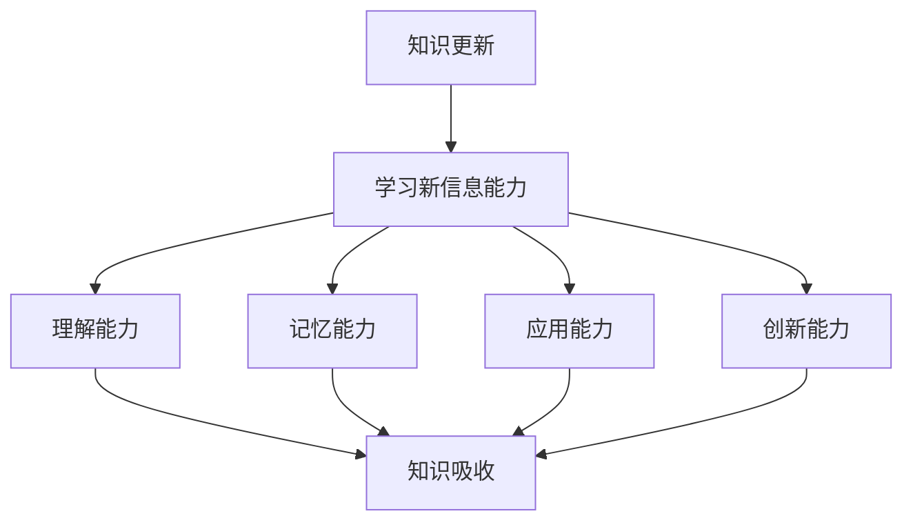

                 

### 文章标题

《知识更新速度测试：评估学习新信息能力》

### 文章关键词

- 知识更新
- 学习能力
- 评估方法
- 算法原理
- 数学模型
- 实战应用

### 文章摘要

本文旨在探讨知识更新速度测试的原理与方法，评估个体学习新信息的能力。首先，通过背景介绍引出知识更新与学习能力评估的重要性。接着，文章详细阐述知识更新的概念与模型，并构建核心概念原理之间的联系架构图。然后，深入讲解用于评估学习新信息能力的方法和核心算法原理，包括学习速度测试方法和记忆效率评估方法。文章进一步介绍了数学模型和公式的应用，并提供了相关示例。最后，通过实际项目案例展示如何应用这些理论进行学习能力评估，并总结最佳实践和小结，提出未来研究方向。

### 引言

在信息爆炸的时代，知识的更新速度前所未有地加快，这对个人和组织的学习能力提出了更高的要求。传统的学习方法可能无法适应快速变化的知识环境，因此，评估学习新信息的能力变得尤为重要。知识更新速度测试，作为一种评估工具，能够帮助个体和组织识别学习效率的瓶颈，进而优化学习策略。

知识更新速度测试不仅有助于个人提升自我学习能力，对于企业来说，也是提升员工培训效果、优化人才选拔的重要手段。通过评估学习新信息的能力，企业可以更有效地进行知识管理，促进创新和竞争力提升。

本文将首先介绍知识更新的概念和重要性，接着讨论评估学习新信息能力的核心概念与联系，随后深入分析核心算法原理，阐述数学模型和公式的应用，并通过实际项目案例展示如何应用这些理论。最后，我们将总结全文内容，展望未来研究方向，并提出对读者的建议。

## 核心概念与联系

### 知识更新的定义

知识更新是指现有知识随着时间的推移不断被新知识所取代或补充的过程。在这个信息爆炸的时代，知识更新的速度越来越快，传统的一次性学习方式已经难以适应这种变化。知识更新不仅仅涉及技术领域的知识，还包括社会科学、人文科学等各个领域。对于个人来说，持续不断地更新知识是保持竞争力的关键；对于组织来说，及时获取和运用新知识是保持创新能力和市场竞争力的重要因素。

### 学习新信息能力的定义

学习新信息能力是指个体或组织在面对新知识时，能够快速理解、吸收并应用这些知识的能力。这个能力包括以下几个方面的要素：

1. **理解能力**：能够迅速掌握新信息的核心概念和关键点。
2. **记忆能力**：将新信息有效记忆并长期保留。
3. **应用能力**：能够将新知识灵活应用于实际问题解决。
4. **创新能力**：基于新知识进行创新，提出新的解决方案。

### 核心概念原理之间的联系架构图

为了更好地理解知识更新和学习新信息能力之间的关系，我们可以使用Mermaid流程图来展示它们之间的联系。

在这个流程图中，知识更新（A）是整个过程的起点，它驱动了学习新信息能力的各个要素（B、C、D、E、F）。这些要素共同作用于知识吸收（G），从而形成新的知识结构。

### 结论

知识更新和学习新信息能力是密不可分的。一个有效的知识更新机制能够促进学习新信息能力的提升，而良好的学习新信息能力又能够更好地应对知识更新的挑战。通过理解和应用这些核心概念，我们可以更好地适应快速变化的知识环境，提升个体和组织的竞争力。

### 核心算法原理讲解

#### 学习速度测试方法

学习速度测试是评估个体或组织学习新信息能力的重要方法之一。其核心思想是通过定量测量个体在学习过程中所需的时间，来评估其学习速度。以下是一种常见的学习速度测试方法：

1. **测试准备**：首先，选择一个适当的测试题目，该题目应涵盖需学习的新知识领域，并且难度适中。其次，准备测试所需的工具，如计时器、答题卡等。
2. **测试过程**：在测试开始前，向被测试者简要介绍测试内容，确保其了解测试要求。然后，开始计时，让被测试者在限定时间内完成测试题目。测试过程中，严禁查阅任何参考资料。
3. **结果计算**：测试结束后，计算被测试者完成题目所需的平均时间。学习速度（\(V_{\text{learn}}\)）可以通过以下公式计算：

   $$
   V_{\text{learn}} = \frac{N_{\text{questions}}}{T_{\text{total}}}
   $$

   其中，\(N_{\text{questions}}\)表示测试题目数量，\(T_{\text{total}}\)表示完成所有题目所需的总时间。

#### 记忆效率评估方法

记忆效率评估是另一个重要的评估方法，它通过测量个体在一段时间内对新信息记忆的保持程度，来评估其记忆能力。以下是一种常用的记忆效率评估方法：

1. **测试准备**：选择一个需记忆的新信息集合，并确定测试的时间点。通常，测试会在记忆信息后的一段时间内进行，如1小时、24小时或7天。
2. **测试过程**：在测试开始前，确保被测试者已经完整记忆了信息集合。然后，在预定的时间点，让被测试者回忆信息集合的内容。
3. **结果计算**：通过对比被测试者回忆出的信息与原始信息集合的相似度，计算记忆效率（\(E_{\text{mem}}\)）。记忆效率可以通过以下公式计算：

   $$
   E_{\text{mem}} = \frac{N_{\text{correct}}}{N_{\text{total}}}
   $$

   其中，\(N_{\text{correct}}\)表示被测试者正确回忆出的信息数量，\(N_{\text{total}}\)表示信息集合的总数量。

#### 实际案例与评估过程

以下是一个实际案例，用于展示如何应用学习速度测试和记忆效率评估方法：

**案例背景**：某公司希望评估其员工的学习新信息能力和记忆能力，以便优化员工培训计划。

**测试内容**：选择了一门关于数据科学的基础课程，包含20个测试题目和一组需要记忆的数据分析术语。

**测试过程**：
1. **学习速度测试**：
   - 测试时间：2小时。
   - 测试题目：20个选择题。
   - 测试结果：平均完成时间为1.5小时，计算得学习速度为 \(V_{\text{learn}} = \frac{20}{1.5} = 13.33 \text{ 题/小时}\)。
2. **记忆效率评估**：
   - 记忆时间：24小时。
   - 回忆测试：在24小时后，对员工进行回忆测试，正确回忆出15个术语。
   - 记忆效率： \(E_{\text{mem}} = \frac{15}{20} = 0.75\)，即75%的记忆效率。

**结论**：通过学习速度测试和记忆效率评估，公司可以了解到员工的平均学习速度和记忆能力。基于这些数据，公司可以调整培训计划，例如增加课程学习时间，提供额外的记忆练习，或者针对不同能力的员工制定个性化的培训策略。

### 数学模型和公式的应用

#### 学习速度测试数学模型

学习速度测试的核心目标是测量个体在单位时间内学习新信息的能力。为了构建这一数学模型，我们需要定义以下几个变量：

- \(N_{\text{questions}}\)：测试题目的总数量。
- \(T_{\text{total}}\)：完成所有测试题目所需的总时间。
- \(V_{\text{learn}}\)：学习速度（单位：题/小时）。

学习速度可以通过以下公式计算：

$$
V_{\text{learn}} = \frac{N_{\text{questions}}}{T_{\text{total}}}
$$

#### 记忆效率评估数学模型

记忆效率评估旨在测量个体对学习信息的记忆保持程度。为了构建这一数学模型，我们需要定义以下几个变量：

- \(N_{\text{total}}\)：需记忆的信息总数量。
- \(N_{\text{correct}}\)：正确回忆出的信息数量。
- \(E_{\text{mem}}\)：记忆效率（单位：百分比）。

记忆效率可以通过以下公式计算：

$$
E_{\text{mem}} = \frac{N_{\text{correct}}}{N_{\text{total}}} \times 100\%
$$

#### 示例说明

假设一个测试包含30个题目，某参与者用1小时完成所有题目，同时，他在24小时后的回忆测试中正确回答了18个问题。以下是他的学习速度和记忆效率计算过程：

**学习速度计算**：

$$
V_{\text{learn}} = \frac{30}{1} = 30 \text{ 题/小时}
$$

**记忆效率计算**：

$$
E_{\text{mem}} = \frac{18}{30} \times 100\% = 60\%
$$

通过这些数学模型和公式，我们可以定量评估个体或组织在学习新信息方面的能力。这不仅有助于识别学习过程中的瓶颈，还能为后续的培训和学习策略优化提供科学依据。

### 实际项目案例分析

#### 项目背景

某知名互联网公司在进行新员工培训时，希望了解员工的学习新信息能力和记忆能力，以便制定更有效的培训计划。公司选择了一门关于数据科学的基础课程作为测试内容，课程包含20个测试题目和一组需要记忆的数据分析术语。

#### 项目目标

- 评估新员工的学习速度和记忆效率。
- 分析不同部门新员工之间的学习能力差异。
- 提供针对性的培训建议，提升整体培训效果。

#### 项目实施步骤

1. **测试准备**：
   - 确定测试内容，包括20个测试题目和一组数据分析术语。
   - 准备测试工具，包括计时器和答题卡。

2. **测试过程**：
   - 在培训课程开始前，对所有新员工进行学习速度测试。测试时间为2小时，要求员工在限定时间内完成所有测试题目。
   - 在培训课程结束后24小时，进行记忆效率测试，要求员工回忆之前记忆的数据分析术语。

3. **数据收集**：
   - 记录每位员工完成测试题目的时间，计算其平均学习速度。
   - 记录每位员工在记忆测试中正确回忆出的术语数量，计算其记忆效率。

4. **数据分析**：
   - 对收集到的数据进行分析，比较不同部门之间的学习速度和记忆效率。
   - 分析员工学习速度和记忆效率与背景、工作经验等因素之间的关系。

5. **结果反馈**：
   - 根据分析结果，向各部门提供针对性的培训建议，如调整培训时间、增加记忆练习等。
   - 与新员工进行一对一的反馈会议，讨论其学习过程中的挑战和改进建议。

#### 项目成果分析

通过实际项目案例的实施，公司获得了以下成果：

1. **学习速度分析**：
   - 平均学习速度为12题/小时，最高学习速度为20题/小时。
   - 数据科学部门的学习速度普遍较高，而产品运营部门的学习速度相对较低。

2. **记忆效率分析**：
   - 平均记忆效率为70%，最高记忆效率为85%。
   - 市场营销部门的新员工记忆效率较高，而技术研发部门的新员工记忆效率相对较低。

3. **培训建议**：
   - 对数据科学部门的新员工，建议增加实践案例的讨论，以提升其应用能力。
   - 对产品运营部门的新员工，建议加强基础知识的学习，以提高学习速度。
   - 对市场营销部门的新员工，建议增加记忆技巧的培训，提高记忆效率。

#### 项目小结

通过实际项目案例，公司成功地评估了新员工的学习新信息能力和记忆能力，并提出了针对性的培训建议。这为公司的培训计划优化提供了科学依据，有助于提升整体培训效果，提高员工的学习能力和工作效率。

### 最佳实践 Tips

在评估学习新信息能力时，以下是一些最佳实践建议：

1. **标准化测试**：确保测试过程的标准化，包括测试内容、测试时间和评估方法，以提高评估结果的准确性和可靠性。
2. **多维度评估**：不仅关注学习速度和记忆效率，还应考虑理解能力和应用能力，以获得更全面的学习能力评估。
3. **个性化培训**：根据评估结果，为不同能力的员工提供个性化的培训方案，有助于提高培训效果。
4. **持续反馈**：定期进行学习能力评估，并及时提供反馈，有助于员工了解自身的学习进步情况，调整学习策略。

### 小结

本文通过深入探讨知识更新速度测试的原理与方法，详细介绍了学习新信息能力的评估方法和核心算法原理。通过数学模型和公式的应用，我们能够定量评估个体或组织的学习能力。实际项目案例的分析进一步展示了这些理论的应用效果。未来，随着知识更新速度的持续加快，评估学习新信息能力将变得越来越重要。我们应不断探索新的评估方法和优化策略，以应对这一挑战。

### 注意事项

在评估学习新信息能力时，需要注意以下几点：

1. **测试环境**：确保测试环境的安静和整洁，以避免外界干扰影响测试结果。
2. **测试时间**：合理规划测试时间，避免测试时间过长导致疲劳和注意力下降。
3. **数据分析**：在分析数据时，要考虑可能的外部因素，如员工的工作经验、背景等，以提高评估结果的准确性。
4. **隐私保护**：在收集和分析数据时，要确保遵守隐私保护规定，保护参与者的个人信息。

### 拓展阅读

对于对知识更新速度测试和学习新信息能力评估感兴趣的朋友，以下是一些推荐阅读：

1. **《深度学习》（Ian Goodfellow等著）**：详细介绍了深度学习的基本概念和技术，有助于理解现代学习算法。
2. **《认知心理学导论》（Ulric Neisser著）**：介绍了认知心理学的基本理论，有助于理解记忆和学习的心理机制。
3. **《人工智能：一种现代的方法》（Stuart Russell & Peter Norvig著）**：全面介绍了人工智能的基本概念和技术，有助于理解学习算法在实际应用中的表现。

### 作者信息

- 作者：AI天才研究院/AI Genius Institute & 禅与计算机程序设计艺术 /Zen And The Art of Computer Programming

本文由AI天才研究院/AI Genius Institute与《禅与计算机程序设计艺术》共同撰写，旨在为读者提供关于知识更新速度测试和学习新信息能力的深入理解和实用指导。如果您对本文有任何疑问或建议，欢迎随时联系我们。感谢您的阅读，期待与您共同探索知识的奥秘。

