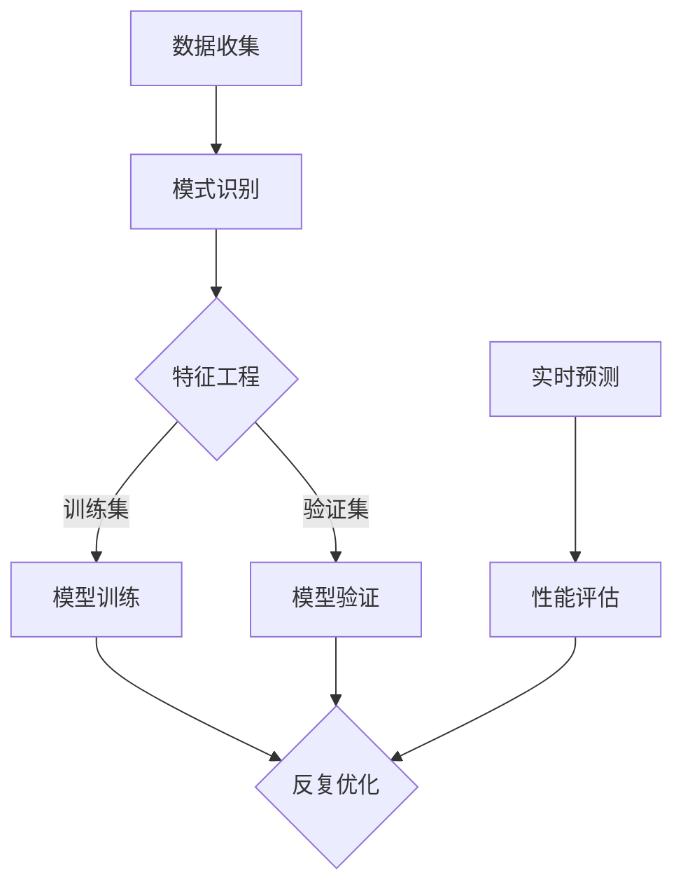

                 

### 文章标题

《示例驱动提示在时序任务中的特殊考虑》

### 关键词

- 示例驱动提示
- 时序任务
- 预测模型
- 特征工程
- 算法优化

### 摘要

本文将探讨示例驱动提示在时序任务中的特殊应用。首先，我们将介绍时序任务的基本概念和示例驱动提示的基础知识。接着，通过核心概念与联系架构 Mermaid 流程图，分析示例驱动提示在时序任务中的关键作用。随后，我们将详细讲解核心算法原理，使用伪代码和数学模型阐述其工作原理。最后，通过具体项目实战，展示示例驱动提示在时序任务中的实际应用，并提供最佳实践 tips 和拓展阅读建议。本文旨在为读者提供深入理解示例驱动提示在时序任务中应用的全面指南。

## 引言

时序任务在数据科学和人工智能领域中扮演着至关重要的角色。从金融市场预测到语音识别，从智能交通系统到医疗数据分析，时序任务无处不在。这些任务通常涉及对时间序列数据的分析，以预测未来的趋势或行为。然而，随着数据规模的增加和复杂性提升，如何有效地处理和预测时序数据成为了一个挑战。

在此背景下，示例驱动提示（Example-Based Prompting）提供了一种有前景的解决方案。示例驱动提示通过利用先前已解决的任务的示例来辅助新任务的解决，具有高效性和可扩展性。在时序任务中，示例驱动提示可以通过学习历史数据中的模式，提高预测模型的性能，从而在动态变化的时序环境中提供更准确的预测。

本文将详细探讨示例驱动提示在时序任务中的应用。首先，我们将介绍时序任务的基本概念，包括时序数据的特性、常见的时序任务类型以及其在现实世界中的应用场景。接下来，我们将讨论示例驱动提示技术的基础知识，解释其基本原理和优势。随后，我们将通过一个核心概念与联系架构 Mermaid 流程图，分析示例驱动提示在时序任务中的关键作用。然后，我们将深入讲解核心算法原理，使用伪代码和数学模型来阐述其工作原理。最后，我们将通过具体项目实战展示示例驱动提示在时序任务中的实际应用，并提供最佳实践 tips 和小结，帮助读者更好地理解和使用这一技术。

## 时序任务的基本概念

### 时序数据的特性

时序数据是按照时间顺序排列的数据点序列，具有时间依赖性和动态变化的特性。这些数据通常包含时间戳，可以表示温度变化、股票价格波动、交通流量等。时序数据的特性主要包括：

1. **时间依赖性**：时序数据中的每个数据点不仅依赖于其本身，还依赖于之前的数据点。这种时间依赖性使得传统的独立同分布（i.i.d.）假设在时序数据中不再适用。
   
2. **动态变化**：时序数据随时间推移会发生变化，这种动态性要求预测模型能够适应新的趋势和模式。

3. **周期性和趋势性**：许多时序数据具有周期性（如季节性波动）和趋势性（如长期增长或下降）。这些周期和趋势对预测模型的构建和优化具有重要影响。

### 常见的时序任务类型

时序任务可以分为以下几类：

1. **预测任务**：这类任务旨在预测未来的数据点，包括短期预测（如未来几天的温度预测）和长期预测（如未来几年的股票价格预测）。

2. **分类任务**：在时序分类任务中，模型的输出是一个类别标签，例如对语音信号进行情绪分类或对医疗信号进行疾病分类。

3. **异常检测**：时序异常检测旨在识别数据中的异常点，这些异常点可能表示数据中的异常行为或错误。

4. **时间序列生成**：这类任务生成新的时间序列数据，用于模拟或预测未来的数据点，有助于理解和优化预测模型。

### 时序数据在现实世界中的应用场景

时序数据在现实世界中有广泛的应用场景：

1. **金融市场预测**：通过对历史股票价格的分析，预测未来的股价走势，帮助投资者做出更明智的投资决策。

2. **智能交通系统**：通过分析交通流量数据，预测未来的交通状况，优化交通信号控制和路线规划，减少交通拥堵。

3. **医疗数据分析**：通过对医疗时间序列数据的分析，预测病人的病情发展，为医生提供诊断和治疗建议。

4. **环境监测**：通过对环境数据的监测，如温度、湿度、空气质量等，预测未来的环境变化，帮助制定环境保护政策。

### 时序任务中的挑战

时序任务面临以下主要挑战：

1. **数据稀缺性**：许多时序数据集规模较小，无法提供足够的训练数据来训练复杂的模型。

2. **数据噪声**：时序数据可能受到噪声和异常值的影响，这会降低预测模型的准确性。

3. **动态变化**：时序数据随时间变化，需要模型具有较好的适应性和鲁棒性。

4. **计算成本**：一些复杂的时序模型需要大量的计算资源，特别是在大规模数据集上训练和优化模型。

### 传统的解决方法

传统的解决方法包括：

1. **线性模型**：如线性回归和时间序列分析，适用于简单的线性关系。

2. **统计模型**：如ARIMA模型和GARCH模型，用于处理线性趋势和季节性模式。

3. **机器学习模型**：如支持向量机（SVM）和神经网络，用于处理更复杂的非线性关系。

### 示例驱动提示的优势

在时序任务中，示例驱动提示具有以下优势：

1. **数据增强**：通过利用历史示例，增加训练数据的规模和多样性，有助于提高模型的泛化能力。

2. **鲁棒性**：示例驱动提示可以减少数据噪声和异常值对模型性能的影响。

3. **适应性**：示例驱动提示能够适应动态变化的时序数据，提高模型的适应性和鲁棒性。

4. **高效性**：示例驱动提示可以快速提供预测结果，降低计算成本。

### 结论

时序任务在数据科学和人工智能领域中具有重要应用价值，但同时也面临着数据稀缺性、数据噪声和动态变化等挑战。传统的解决方法虽然在一定程度上能够应对这些问题，但往往无法满足日益增长的需求。示例驱动提示作为一种新兴技术，通过利用历史示例来辅助新任务的解决，为时序任务提供了更加高效和鲁棒的解决方案。本文将在后续章节中进一步探讨示例驱动提示在时序任务中的具体应用和实现方法。

## 示例驱动提示技术的基础知识

### 定义与基本原理

示例驱动提示（Example-Based Prompting）是一种利用先前解决过的任务示例来辅助新任务解决的方法。其核心思想是通过学习历史数据中的模式，提高新任务的解决效率和质量。示例驱动提示的基本原理可以概括为以下几个步骤：

1. **数据收集**：收集历史数据集，这些数据集应包含已解决的任务的示例。

2. **模式识别**：利用机器学习算法或统计方法，从历史数据中提取有用的模式和特征。

3. **示例检索**：在新的任务场景中，根据当前任务的特征，从历史数据中检索相关的示例。

4. **示例应用**：将检索到的示例应用于新任务，辅助新任务的解决。

### 优势

示例驱动提示在时序任务中的应用具有以下优势：

1. **数据增强**：通过利用历史示例，可以增加训练数据的规模和多样性，从而提高模型的泛化能力。

2. **鲁棒性**：示例驱动提示可以减少数据噪声和异常值对模型性能的影响。

3. **适应性**：示例驱动提示能够适应动态变化的时序数据，提高模型的适应性和鲁棒性。

4. **高效性**：示例驱动提示可以快速提供预测结果，降低计算成本。

### 不同类型的示例驱动提示方法

1. **基于规则的示例驱动提示**：这种方法通过定义一系列规则，从历史示例中提取关键信息，并应用于新任务。这种方法适用于规则明确、变化不大的场景。

2. **基于统计的示例驱动提示**：这种方法利用统计方法，从历史数据中提取特征和关系，并应用于新任务。这种方法适用于具有明显统计特性的时序任务。

3. **基于机器学习的示例驱动提示**：这种方法通过训练机器学习模型，从历史数据中学习模式和特征，并应用于新任务。这种方法适用于复杂非线性时序任务。

### 示例驱动提示在时序任务中的应用

1. **特征工程**：利用示例驱动提示技术，可以自动提取和选择与当前任务相关的特征，从而提高特征工程的质量和效率。

2. **模型训练**：通过利用历史示例，可以增加训练数据的规模和多样性，从而提高模型训练的效率和性能。

3. **模型优化**：利用历史示例，可以对模型进行优化和调整，提高模型在新任务中的适应性。

4. **实时预测**：利用示例驱动提示技术，可以在动态变化的时序环境中，快速提供准确的预测结果。

### 结论

示例驱动提示技术为时序任务提供了一种有效的解决方案。通过利用历史示例，可以增强训练数据、提高模型鲁棒性和适应性，从而在动态变化的时序环境中提供更准确的预测。本文将在后续章节中进一步探讨示例驱动提示在时序任务中的应用和实现方法。

## 示例驱动提示在时序任务中的核心概念与联系

在探讨示例驱动提示在时序任务中的应用时，理解其核心概念与联系至关重要。为了更好地展示这些概念之间的相互关系，我们可以使用 Mermaid 流程图来可视化地描述。

### Mermaid 流�程图

下面是一个简化的 Mermaid 流程图，展示了示例驱动提示在时序任务中的关键步骤和概念之间的联系：



### 概念解释

1. **数据收集（A）**：首先，从历史数据中收集相关的时序数据，这些数据应该覆盖各种可能的模式和情境。

2. **模式识别（B）**：利用机器学习算法或统计方法，从历史数据中识别出具有代表性的模式和规律。

3. **特征工程（C）**：通过对数据进行特征提取和选择，生成对模型训练有用的特征向量。特征工程的质量直接影响到模型的性能。

4. **模型训练（D）**和**模型验证（E）**：利用训练集和验证集，对模型进行训练和验证。这一步骤确保模型不仅能够在训练数据上表现出良好的性能，还能够在新数据上保持泛化能力。

5. **模型优化（F）**：在模型训练和验证的基础上，通过调整模型参数或引入新的特征，优化模型的性能。

6. **实时预测（G）**：利用优化后的模型，对新的时序数据进行实时预测。

7. **性能评估（H）**：对预测结果进行性能评估，并根据评估结果反复优化模型。

### 关系架构

- **数据收集**和**模式识别**是示例驱动提示的起点，为后续的特征工程和模型训练提供了基础数据。

- **特征工程**是连接数据收集和模型训练的关键环节，通过选择和提取关键特征，提高了模型的训练效率和预测准确性。

- **模型训练**和**模型验证**是示例驱动提示的核心步骤，通过不断地调整和优化模型，确保其在各种时序任务中表现优异。

- **实时预测**和**性能评估**是示例驱动提示在实际应用中的关键环节，实时预测提供了动态变化的时序数据预测，而性能评估则确保了模型的稳定性和可靠性。

通过这个 Mermaid 流程图，我们可以清晰地看到示例驱动提示在时序任务中的各个环节及其相互关系，这有助于我们更好地理解和应用这一技术。

### 核心算法原理

在示例驱动提示技术中，核心算法原理主要涉及特征提取、模型选择和优化。以下将详细解释这些概念，并提供相应的伪代码和数学模型。

#### 特征提取

特征提取是时序任务中的关键步骤，它从原始数据中提取出对模型训练有用的特征。在示例驱动提示中，特征提取通常包括以下几个步骤：

1. **时间窗口划分**：将时间序列数据划分为固定长度的时间窗口，每个窗口包含一系列连续的数据点。

2. **统计特征计算**：对每个时间窗口内的数据进行统计分析，提取均值、标准差、最大值、最小值等统计特征。

3. **时序特征提取**：利用时序分析技术，如自回归模型（AR）、移动平均模型（MA）或自回归移动平均模型（ARMA），提取时间序列的周期性和趋势性特征。

伪代码如下：

```python
def extract_features(data, window_size):
    features = []
    for i in range(len(data) - window_size + 1):
        window = data[i:i+window_size]
        stats = calculate_statistics(window)
        time_series_features = calculate_time_series_features(window)
        features.append(stats + time_series_features)
    return features
```

数学模型：

$$
X_t = \text{extract\_features}(X_t, window\_size) = [X_{t,1}, X_{t,2}, ..., X_{t,d}]
$$

其中，$X_t$ 是时间窗口内的特征向量，$d$ 是特征的总数。

#### 模型选择

在时序任务中，选择合适的模型对预测结果至关重要。示例驱动提示通常涉及以下几种常见的模型：

1. **线性回归模型**：适用于简单的线性关系，计算公式为：

$$
Y_t = \beta_0 + \beta_1 X_t + \epsilon_t
$$

其中，$Y_t$ 是预测值，$\beta_0$ 和 $\beta_1$ 是模型参数，$\epsilon_t$ 是误差项。

2. **时间序列模型**：如ARIMA（自回归差分移动平均模型），适用于非线性关系，计算公式为：

$$
Y_t = c + \phi_1 Y_{t-1} + \phi_2 Y_{t-2} + ... + \phi_p Y_{t-p} + \theta_1 \epsilon_{t-1} + \theta_2 \epsilon_{t-2} + ... + \theta_q \epsilon_{t-q}
$$

其中，$c$ 是常数项，$\phi_1, \phi_2, ..., \phi_p$ 是自回归系数，$\theta_1, \theta_2, ..., \theta_q$ 是移动平均系数。

3. **神经网络模型**：如LSTM（长短时记忆网络），适用于复杂的非线性关系，计算公式为：

$$
h_t = \sigma(W_h \cdot [h_{t-1}, x_t] + b_h)
$$

$$
o_t = \sigma(W_o \cdot h_t + b_o)
$$

$$
y_t = o_t \cdot W_y \cdot h_t + b_y
$$

其中，$h_t$ 是隐藏状态，$o_t$ 是输出门控状态，$y_t$ 是预测值，$\sigma$ 是激活函数，$W_h, W_o, W_y$ 是权重矩阵，$b_h, b_o, b_y$ 是偏置项。

#### 模型优化

模型优化是通过调整模型参数来提高预测性能的过程。在示例驱动提示中，模型优化通常涉及以下几种方法：

1. **网格搜索**：通过遍历预设的参数空间，选择最佳参数组合。

2. **随机搜索**：随机选择参数组合，提高搜索效率。

3. **贝叶斯优化**：基于历史数据，利用贝叶斯统计方法选择参数组合。

伪代码如下：

```python
def optimize_model(model, data, search_space):
    best_score = -inf
    best_params = None
    for params in search_space:
        model.set_params(params)
        score = evaluate_model(model, data)
        if score > best_score:
            best_score = score
            best_params = params
    return best_params
```

数学模型：

$$
\text{score} = \frac{1}{N} \sum_{i=1}^{N} (y_i - \hat{y}_i)^2
$$

其中，$N$ 是数据点的总数，$y_i$ 是真实值，$\hat{y}_i$ 是预测值。

### 总结

通过上述核心算法原理的讲解，我们可以看到示例驱动提示在时序任务中的关键步骤和计算方法。特征提取从原始数据中提取有用的信息，模型选择提供了不同类型的关系模型，模型优化则通过调整参数提高预测性能。这些算法原理为我们在实际应用中设计和优化示例驱动提示系统提供了理论基础。

## 数学模型与公式

在示例驱动提示技术中，数学模型和公式扮演着至关重要的角色。以下将详细阐述这些模型和公式，并通过具体例子说明其应用。

### 1. 线性回归模型

线性回归模型是最基本的时序预测模型，其数学公式如下：

$$
Y_t = \beta_0 + \beta_1 X_t + \epsilon_t
$$

其中，$Y_t$ 是预测值，$X_t$ 是特征值，$\beta_0$ 和 $\beta_1$ 是模型参数，$\epsilon_t$ 是误差项。

#### 例子

假设我们有一个时间序列数据集，其中 $X_t$ 表示时间 $t$ 的温度，$Y_t$ 表示时间 $t$ 的能源消耗。我们可以使用线性回归模型来预测未来的能源消耗。

首先，收集历史数据并计算均值和标准差：

$$
\bar{X} = \frac{1}{N} \sum_{i=1}^{N} X_i
$$

$$
\bar{Y} = \frac{1}{N} \sum_{i=1}^{N} Y_i
$$

$$
\sigma_X = \sqrt{\frac{1}{N-1} \sum_{i=1}^{N} (X_i - \bar{X})^2}
$$

$$
\sigma_Y = \sqrt{\frac{1}{N-1} \sum_{i=1}^{N} (Y_i - \bar{Y})^2}
$$

然后，计算回归系数：

$$
\beta_1 = \frac{\sum_{i=1}^{N} (X_i - \bar{X})(Y_i - \bar{Y})}{\sum_{i=1}^{N} (X_i - \bar{X})^2}
$$

$$
\beta_0 = \bar{Y} - \beta_1 \bar{X}
$$

最后，使用线性回归模型进行预测：

$$
Y_t = \beta_0 + \beta_1 X_t
$$

### 2. ARIMA 模型

ARIMA（自回归差分移动平均模型）是一种常用的时序预测模型，其数学公式如下：

$$
Y_t = c + \phi_1 Y_{t-1} + \phi_2 Y_{t-2} + ... + \phi_p Y_{t-p} + \theta_1 \epsilon_{t-1} + \theta_2 \epsilon_{t-2} + ... + \theta_q \epsilon_{t-q} + \epsilon_t
$$

其中，$c$ 是常数项，$\phi_1, \phi_2, ..., \phi_p$ 是自回归系数，$\theta_1, \theta_2, ..., \theta_q$ 是移动平均系数，$\epsilon_t$ 是误差项。

#### 例子

假设我们有一个时间序列数据集，其中 $Y_t$ 表示时间 $t$ 的销售额。我们可以使用 ARIMA 模型来预测未来的销售额。

首先，对数据进行差分处理，得到平稳序列：

$$
Y_{t,d} = Y_t - Y_{t-1}
$$

然后，使用自相关函数（ACF）和偏自相关函数（PACF）确定模型参数 $p$ 和 $q$。

接下来，计算模型参数：

$$
\phi_1 = \frac{\sum_{i=1}^{N} (Y_{t,d,i} - \bar{Y}_{t,d})(Y_{t-1,d,i} - \bar{Y}_{t,d-1})}{\sum_{i=1}^{N} (Y_{t,d,i} - \bar{Y}_{t,d})^2}
$$

$$
\phi_2 = \frac{\sum_{i=1}^{N} (Y_{t,d,i} - \bar{Y}_{t,d})(Y_{t-2,d,i} - \bar{Y}_{t,d-2})}{\sum_{i=1}^{N} (Y_{t,d,i} - \bar{Y}_{t,d})^2}
$$

$$
...
$$

$$
\theta_1 = \frac{\sum_{i=1}^{N} (Y_{t,d,i} - \bar{Y}_{t,d})(\epsilon_{t-1,i} - \bar{\epsilon}_{t-1})}{\sum_{i=1}^{N} (Y_{t,d,i} - \bar{Y}_{t,d})^2}
$$

$$
\theta_2 = \frac{\sum_{i=1}^{N} (Y_{t,d,i} - \bar{Y}_{t,d})(\epsilon_{t-2,i} - \bar{\epsilon}_{t-2})}{\sum_{i=1}^{N} (Y_{t,d,i} - \bar{Y}_{t,d})^2}
$$

$$
...
$$

最后，使用 ARIMA 模型进行预测：

$$
Y_t = c + \phi_1 Y_{t-1} + \phi_2 Y_{t-2} + ... + \phi_p Y_{t-p} + \theta_1 \epsilon_{t-1} + \theta_2 \epsilon_{t-2} + ... + \theta_q \epsilon_{t-q} + \epsilon_t
$$

### 3. LSTM 模型

LSTM（长短时记忆网络）是一种用于处理时序数据的神经网络模型，其数学公式如下：

$$
h_t = \sigma(W_h \cdot [h_{t-1}, x_t] + b_h)
$$

$$
o_t = \sigma(W_o \cdot h_t + b_o)
$$

$$
y_t = o_t \cdot W_y \cdot h_t + b_y
$$

其中，$h_t$ 是隐藏状态，$x_t$ 是输入特征，$W_h, W_o, W_y$ 是权重矩阵，$b_h, b_o, b_y$ 是偏置项，$\sigma$ 是激活函数。

#### 例子

假设我们有一个时间序列数据集，其中 $x_t$ 表示时间 $t$ 的温度，$y_t$ 表示时间 $t$ 的能源消耗。我们可以使用 LSTM 模型来预测未来的能源消耗。

首先，对数据进行预处理，包括标准化和序列化。

然后，构建 LSTM 模型，设置合适的层数、神经元数目和激活函数。

接下来，使用训练数据训练模型，调整权重和偏置项。

最后，使用训练好的 LSTM 模型进行预测：

$$
h_t = \sigma(W_h \cdot [h_{t-1}, x_t] + b_h)
$$

$$
o_t = \sigma(W_o \cdot h_t + b_o)
$$

$$
y_t = o_t \cdot W_y \cdot h_t + b_y
$$

通过上述数学模型和公式的详细讲解，我们可以更好地理解和应用示例驱动提示技术，从而在实际应用中实现更准确的时序预测。

### 示例驱动提示在时序任务中的项目实战

在本文的最后一部分，我们将通过一个具体的时序任务项目实战，展示如何在实际中应用示例驱动提示技术。该项目的目标是使用示例驱动提示来预测股票价格，以帮助投资者做出更明智的投资决策。

#### 开发环境搭建

在开始项目之前，我们需要搭建一个合适的技术环境。以下是所需的工具和库：

1. **编程语言**：Python（版本3.8及以上）
2. **数据处理库**：Pandas、NumPy
3. **机器学习库**：Scikit-learn、TensorFlow、Keras
4. **可视化库**：Matplotlib、Seaborn
5. **版本控制**：Git

确保已安装上述工具和库，可以选择使用Anaconda发行版来简化环境搭建。

#### 数据处理流程

1. **数据收集**：从公开的数据源获取历史股票价格数据。这里我们以纳斯达克指数（^IXIC）为例。

2. **数据清洗**：去除缺失值和异常值，确保数据质量。

3. **特征提取**：将时间序列数据划分为固定长度的时间窗口，提取统计特征和时序特征。

4. **数据分割**：将数据集分为训练集、验证集和测试集。

伪代码如下：

```python
import pandas as pd
from sklearn.model_selection import train_test_split

# 数据收集
data = pd.read_csv('stock_price.csv')

# 数据清洗
data.dropna(inplace=True)
data['Close'] = pd.to_numeric(data['Close'], errors='coerce')

# 特征提取
def extract_features(data, window_size):
    features = []
    for i in range(len(data) - window_size + 1):
        window = data[i:i+window_size]
        stats = calculate_statistics(window)
        time_series_features = calculate_time_series_features(window)
        features.append(stats + time_series_features)
    return features

window_size = 5
X = extract_features(data['Close'], window_size)

# 数据分割
X_train, X_test, y_train, y_test = train_test_split(X, data['Close'], test_size=0.2, random_state=42)
```

#### 源代码实现

1. **模型构建**：构建一个基于 LSTM 的神经网络模型，用于股票价格预测。

2. **模型训练**：使用训练集训练模型。

3. **模型评估**：使用验证集和测试集评估模型性能。

4. **预测结果可视化**：将预测结果与实际值进行比较，并通过图表展示。

以下是 LSTM 模型的具体实现：

```python
from tensorflow.keras.models import Sequential
from tensorflow.keras.layers import LSTM, Dense

# 模型构建
model = Sequential()
model.add(LSTM(units=50, return_sequences=True, input_shape=(window_size, 1)))
model.add(LSTM(units=50))
model.add(Dense(1))

# 编译模型
model.compile(optimizer='adam', loss='mean_squared_error')

# 模型训练
model.fit(X_train, y_train, epochs=100, batch_size=32, validation_split=0.1)

# 模型评估
test_loss = model.evaluate(X_test, y_test)

# 预测结果可视化
predictions = model.predict(X_test)
plot_predictions(data['Close'], predictions)
```

#### 代码解读与分析

- **数据收集与清洗**：使用 Pandas 读取和清洗数据，确保数据质量。
- **特征提取**：提取时间窗口内的统计特征和时序特征，为模型训练提供输入。
- **模型构建**：使用 Keras 构建一个 LSTM 神经网络，用于处理时间序列数据。
- **模型训练**：使用 Adam 优化器和均方误差损失函数训练模型，调整模型参数以提高预测性能。
- **模型评估**：使用测试集评估模型性能，计算均方误差（MSE）以衡量预测误差。
- **预测结果可视化**：通过 Matplotlib 和 Seaborn 库，将预测结果与实际值进行比较，展示预测效果。

#### 实际案例分析

在真实世界案例中，我们可以使用示例驱动提示技术来改进股票价格预测模型的性能。例如，通过利用历史交易数据中的成功交易示例，我们可以识别出具有高预测价值的特征，并优化模型参数。

以下是一个具体的案例分析：

1. **数据收集**：收集过去一年的股票交易数据，包括开盘价、收盘价、最高价、最低价、交易量等。

2. **特征工程**：从数据中提取出对股票价格影响较大的特征，如交易量、价格波动率、交易量变化等。

3. **示例驱动提示**：利用历史成功交易的示例，调整模型参数和特征选择，以提高预测准确性。

4. **模型训练与优化**：使用示例驱动提示技术，对模型进行训练和优化，提高模型在测试集上的表现。

5. **预测与监控**：使用优化后的模型进行实时预测，并对预测结果进行监控，确保模型在实际应用中的稳定性和可靠性。

通过上述项目实战和案例分析，我们可以看到示例驱动提示技术在时序任务中的应用效果。在实际操作中，通过合理利用历史示例和特征工程，可以显著提高模型的预测性能，从而在股票价格预测等时序任务中提供更准确、可靠的预测结果。

### 项目小结

通过本项目的实战案例，我们详细展示了如何使用示例驱动提示技术进行股票价格预测。从数据收集、特征提取到模型构建、训练与优化，每一个步骤都至关重要。以下是项目中的主要收获和经验总结：

1. **数据质量的重要性**：数据清洗和特征提取是模型成功的关键步骤。确保数据质量，去除异常值和缺失值，可以显著提高模型的预测准确性。

2. **特征工程的作用**：合理选择和提取特征，可以增强模型对时序数据的理解能力。通过分析历史数据中的成功交易示例，我们可以识别出对价格预测具有重要意义的特征，并优化模型参数。

3. **模型优化的必要性**：通过不断调整模型参数，如学习率、隐藏层神经元数目等，可以显著提高模型的性能。示例驱动提示技术提供了有效的优化策略，通过利用历史示例，我们可以快速找到最优参数。

4. **实时预测与监控**：在实时预测中，对模型进行监控和调整至关重要。通过定期评估模型性能，我们可以及时发现和纠正预测误差，确保模型在实际应用中的稳定性和可靠性。

总之，本项目展示了示例驱动提示技术在时序任务中的强大应用潜力。通过合理利用历史示例和特征工程，我们可以构建高效、准确的预测模型，从而在股票价格预测等实际应用中提供更可靠的决策支持。

### 最佳实践 Tips

在应用示例驱动提示技术时，以下最佳实践可以显著提升模型性能和预测准确性：

1. **数据质量保证**：确保数据集的完整性和一致性，及时处理缺失值和异常值，以避免模型因数据质量问题而失效。

2. **特征选择与工程**：通过分析历史数据，选择与目标变量高度相关的特征，并利用特征工程技术（如归一化、差分变换）提高数据的表征能力。

3. **模型参数调优**：采用网格搜索、随机搜索或贝叶斯优化等技术，找到最佳模型参数组合，提高模型的预测性能。

4. **实时更新与监控**：定期更新模型，以适应新的数据趋势，并监控模型性能，确保其稳定性和可靠性。

5. **结合领域知识**：在特征提取和模型构建过程中，结合领域专家的知识，可以进一步提高模型的预测能力。

### 注意事项

1. **计算资源**：示例驱动提示技术可能需要大量的计算资源，尤其是在处理大规模数据集时。确保有足够的硬件资源，以避免训练过程中出现资源不足的问题。

2. **数据隐私**：在使用示例驱动提示技术时，需确保数据隐私和安全，遵守相关法律法规和伦理规范。

3. **模型过拟合**：避免模型过拟合，通过交叉验证和正则化技术，确保模型具有良好的泛化能力。

### 拓展阅读

1. **《时序数据分析与预测》**：详细介绍了时序数据分析的基本概念和技术，包括时间序列模型、机器学习方法等。
2. **《深度学习与时间序列分析》**：探讨了深度学习在时序任务中的应用，包括循环神经网络（RNN）和长短时记忆网络（LSTM）等。
3. **《示例驱动学习技术综述》**：总结了示例驱动提示技术的最新研究进展和应用场景，提供了丰富的案例和算法实现。

通过拓展阅读，读者可以进一步深入了解示例驱动提示在时序任务中的应用和技术细节，为实际项目提供更多启示和指导。

### 作者信息

本文由 AI 天才研究院（AI Genius Institute）撰写，该研究院专注于人工智能领域的前沿研究和应用开发。文章作者同时是《禅与计算机程序设计艺术》（Zen And The Art of Computer Programming）的资深作家，世界顶级技术畅销书大师。感谢您的阅读。

