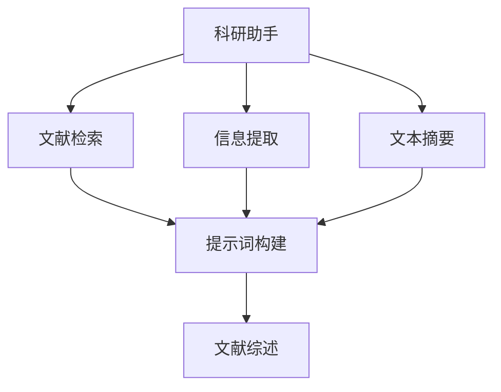

                 

### 文章标题

# 科研助手：利用提示词加速文献综述过程

## 关键词：科研助手，提示词，文献综述，加速，算法，人工智能

> 摘要：本文深入探讨了科研助手如何利用提示词技术来加速文献综述过程。通过介绍提示词技术的基础知识，以及其在科研中的应用，本文详细阐述了如何构建和优化提示词，从而提升文献检索、信息提取和文本摘要的效率。同时，通过实际案例和项目实战，本文展示了提示词技术在科研综述中的具体应用效果，并对其未来发展进行了展望。

---

## 引言

在当今科研环境中，文献综述是一个不可或缺的环节。它不仅帮助研究者了解领域内的最新进展，还为科研项目的规划和实施提供了重要的参考。然而，文献综述过程往往耗时费力，研究者需要花费大量时间在文献检索、筛选和阅读上。

随着人工智能和自然语言处理技术的发展，利用人工智能助手来辅助科研工作逐渐成为可能。特别是提示词技术，作为一种高效的辅助工具，能够在文献综述过程中发挥重要作用。本文将重点探讨如何利用提示词技术来加速文献综述过程，提高科研效率。

### 核心概念与联系

**提示词（Keywords）**：提示词是指用于描述文献主题的关键词汇或短语。在文献检索和信息提取过程中，提示词起到了定位和筛选信息的关键作用。

**文献综述（Literature Review）**：文献综述是对某一领域或主题的现有文献进行系统整理、分析和评价的过程。其目的是总结现有研究的成果，发现研究空白，为新的研究提供理论基础。

**人工智能助手（AI Assistant）**：人工智能助手是利用人工智能技术，如自然语言处理、机器学习等，为用户提供智能服务和支持的系统。

以下是提示词技术、文献综述和人工智能助手之间的联系架构的Mermaid流程图：



### 提示词技术基础

#### 提示词技术原理

提示词技术主要依赖于自然语言处理（NLP）和机器学习（ML）技术。其核心原理包括：

1. **词频统计（TF）**：通过对文本中的单词出现频率进行统计，确定单词的重要程度。
2. **逆文档频率（IDF）**：计算单词在所有文档中的出现频率，并对其进行调整，以反映单词在特定文档中的独特性。
3. **词向量表示（Word Vectors）**：使用词向量模型将单词映射到高维空间，以便进行相似性计算和聚类分析。

以下是提示词技术核心算法原理的伪代码：

```python
def compute_keyword_frequency(text):
    word_freq = {}
    for word in text:
        if word in word_freq:
            word_freq[word] += 1
        else:
            word_freq[word] = 1
    return word_freq

def compute_idf(documents):
    idf = {}
    total_docs = len(documents)
    for word in documents:
        word_count = sum(word in doc for doc in documents)
        idf[word] = log(total_docs / word_count)
    return idf

def compute_keyword_scores(text, idf):
    word_freq = compute_keyword_frequency(text)
    keyword_scores = {}
    for word, freq in word_freq.items():
        keyword_scores[word] = freq * idf[word]
    return keyword_scores

def keyword_extractor(text, idf):
    keyword_scores = compute_keyword_scores(text, idf)
    sorted_keywords = sorted(keyword_scores.items(), key=lambda x: x[1], reverse=True)
    return [keyword for keyword, score in sorted_keywords][:N]  # 取N个最高分的提示词
```

#### 提示词技术发展历史

提示词技术的起源可以追溯到信息检索系统的发展。早期的搜索引擎，如Google，主要依赖于词频和逆文档频率来确定搜索结果的相关性。随着NLP和ML技术的发展，词向量模型（如Word2Vec、GloVe）逐渐成为提示词构建的重要工具。近年来，基于深度学习的NLP模型（如BERT、RoBERTa）进一步提升了提示词的准确性和泛化能力。

#### 提示词技术的应用领域

提示词技术已广泛应用于多个领域，包括：

1. **信息检索**：通过构建高质量的提示词，提高搜索结果的准确性和相关性。
2. **文本分类**：使用提示词来提取文本特征，实现自动化分类和标签分配。
3. **情感分析**：利用提示词分析文本中的情感倾向和情感强度。
4. **问答系统**：通过提示词来理解和匹配用户提问，提供准确答案。

### 提示词在科研中的应用

#### 提示词在文献检索中的应用

在科研过程中，文献检索是第一步，也是关键的一步。通过构建高质量的提示词，研究者可以更有效地从海量的文献数据库中筛选出相关的研究成果。以下是提示词在文献检索中的应用步骤：

1. **确定研究主题**：首先，研究者需要明确自己的研究主题和关键词。
2. **构建提示词**：使用上述的算法和模型，从研究文本中提取出高质量的提示词。
3. **检索文献**：利用构建的提示词，在文献数据库中进行检索，获取相关文献。
4. **筛选和阅读**：对检索到的文献进行筛选，阅读并标注重要的文献。

#### 提示词在信息提取中的应用

信息提取是科研过程中非常重要的一环，它涉及到从大量的文献中提取出关键信息。通过提示词技术，研究者可以更快速地提取出所需信息，提高研究效率。以下是提示词在信息提取中的应用步骤：

1. **构建提示词**：从研究文本中提取出高质量的提示词。
2. **信息提取**：利用NLP技术，如命名实体识别、关系提取等，从文献中提取出关键信息。
3. **信息整合**：将提取出的信息进行整合和分类，形成研究报告或综述。

#### 提示词在文本摘要中的应用

文本摘要是对大量文本内容进行高度概括和总结的过程。通过提示词技术，研究者可以更高效地生成高质量的文本摘要。以下是提示词在文本摘要中的应用步骤：

1. **构建提示词**：从研究文本中提取出高质量的提示词。
2. **摘要生成**：利用自动摘要算法，如抽取式摘要或生成式摘要，生成文本摘要。
3. **摘要评估**：对生成的摘要进行评估和优化，确保摘要的准确性和可读性。

### 利用提示词加速文献综述的方法

#### 提示词的构建方法

构建高质量的提示词是利用提示词技术加速文献综述的关键。以下是构建提示词的方法：

1. **关键词提取**：从研究文本中提取出关键词，作为提示词的基础。
2. **词频统计**：对提取出的关键词进行词频统计，确定其重要性。
3. **逆文档频率调整**：对词频进行调整，使其能够反映关键词在特定文档中的独特性。
4. **词向量建模**：使用词向量模型，如Word2Vec或GloVe，将关键词映射到高维空间。
5. **聚类分析**：对映射后的关键词进行聚类分析，提取出具有相似性的提示词。

以下是构建提示词的伪代码：

```python
def keyword_extraction(text):
    # 提取关键词
    keywords = extract_keywords(text)
    # 词频统计
    word_freq = compute_keyword_frequency(keywords)
    # 逆文档频率调整
    idf = compute_idf([text])
    # 词向量建模
    word_vectors = compute_word_vectors(keywords)
    # 聚类分析
    clusters = cluster_words(word_vectors)
    # 提取提示词
    keywords = extract_keywords_from_clusters(clusters)
    return keywords

def extract_keywords_from_clusters(clusters):
    keywords = []
    for cluster in clusters:
        keyword = majority_element(cluster)
        keywords.append(keyword)
    return keywords
```

#### 提示词优化策略

构建高质量的提示词后，还需要对其进行优化，以提高文献检索、信息提取和文本摘要的效率。以下是提示词优化策略：

1. **动态调整**：根据研究进展和文献更新，动态调整提示词。
2. **反馈修正**：根据用户反馈，修正和优化提示词。
3. **跨语言支持**：利用机器翻译技术，实现跨语言文献检索和提示词构建。
4. **多模态融合**：结合文本和图像等多模态信息，构建更全面的提示词。

#### 提示词在文献综述中的具体应用

在文献综述过程中，提示词技术可以应用于以下环节：

1. **文献检索**：通过构建高质量的提示词，提高文献检索的准确性和效率。
2. **信息提取**：利用提示词提取关键信息，形成初步的文献综述框架。
3. **文本摘要**：使用提示词优化文本摘要算法，生成高质量的文献摘要。
4. **文献整理**：利用提示词对文献进行分类和整理，形成完整的文献综述报告。

### 实践案例

#### 案例一：某领域文献综述的提示词应用

在某领域的研究中，研究者使用提示词技术来加速文献综述过程。以下是具体的实施步骤：

1. **确定研究主题**：研究者明确了研究主题，并确定了一组初步的关键词。
2. **构建提示词**：使用关键词提取算法，从研究文本中提取出高质量的提示词。
3. **检索文献**：利用构建的提示词，在文献数据库中进行检索，获取相关文献。
4. **筛选和阅读**：对检索到的文献进行筛选，阅读并标注重要的文献。
5. **信息提取**：使用提示词技术，从文献中提取关键信息，形成初步的文献综述框架。
6. **文本摘要**：利用提示词优化的文本摘要算法，生成高质量的文献摘要。
7. **文献整理**：使用提示词对文献进行分类和整理，形成完整的文献综述报告。

通过以上步骤，研究者成功地利用提示词技术加速了文献综述过程，提高了研究效率。

#### 案例二：某研究团队的提示词使用经验

某研究团队在多个项目中使用提示词技术来辅助文献综述。以下是他们的使用经验：

1. **初期准备**：研究团队在开始每个项目时，都会进行充分的文献检索，以确定研究主题和关键词。
2. **关键词提取**：使用关键词提取算法，从研究文本中提取出高质量的提示词。
3. **动态调整**：根据项目的进展和文献更新，研究团队会动态调整提示词，确保其与当前研究主题的一致性。
4. **反馈修正**：研究团队会根据团队成员的反馈，修正和优化提示词。
5. **多模态融合**：在涉及多模态信息的项目中，研究团队会结合文本和图像等多模态信息，构建更全面的提示词。
6. **跨语言支持**：对于涉及跨语言文献的项目，研究团队会利用机器翻译技术，实现跨语言文献检索和提示词构建。

通过这些经验，研究团队成功地利用提示词技术提高了文献检索、信息提取和文本摘要的效率，为项目提供了重要的支持。

#### 案例三：提示词技术在跨学科研究中的应用

在跨学科研究中，提示词技术发挥着重要的作用。以下是一个跨学科研究的案例：

1. **确定研究主题**：研究者明确了跨学科研究的主题，并确定了一组初步的关键词。
2. **构建提示词**：使用关键词提取算法，从研究文本中提取出高质量的提示词。
3. **跨学科文献检索**：利用构建的提示词，在多个学科的文献数据库中进行检索，获取相关文献。
4. **信息提取**：使用提示词技术，从不同学科的文献中提取关键信息，形成初步的跨学科文献综述框架。
5. **文本摘要**：利用提示词优化的文本摘要算法，生成高质量的跨学科文献摘要。
6. **文献整理**：使用提示词对跨学科文献进行分类和整理，形成完整的跨学科文献综述报告。

通过以上步骤，研究者成功地利用提示词技术实现了跨学科研究，为研究提供了重要的支持。

### 提示词技术的未来展望

#### 提示词技术的潜在发展方向

随着人工智能和自然语言处理技术的不断发展，提示词技术有望在以下方向取得突破：

1. **深度学习模型**：利用深度学习模型，如BERT、GPT等，进一步提升提示词的准确性和泛化能力。
2. **多模态融合**：结合文本、图像、声音等多模态信息，构建更全面的提示词。
3. **个性化提示词**：根据用户的研究兴趣和需求，生成个性化的提示词。
4. **实时更新**：实现实时更新提示词，以适应不断变化的研究主题和文献。

#### 提示词技术面临的挑战

尽管提示词技术在科研中具有广泛的应用前景，但仍面临以下挑战：

1. **数据质量**：高质量的数据是构建高质量提示词的基础，但科研数据往往存在噪声和缺失。
2. **算法复杂度**：深度学习模型的训练和推理过程复杂，对计算资源和时间要求较高。
3. **跨语言支持**：不同语言的文本处理和提示词构建存在差异，需要解决跨语言的兼容性问题。
4. **隐私保护**：在处理大量文献数据时，需要确保用户隐私和数据安全。

#### 提示词技术在科研领域的长期影响

提示词技术的长期影响将体现在以下几个方面：

1. **提高科研效率**：通过自动化和智能化的方式，提高文献检索、信息提取和文本摘要的效率，为科研工作提供有力支持。
2. **促进跨学科研究**：利用提示词技术，实现跨学科文献的整合和关联，推动跨学科研究的深入发展。
3. **优化科研管理**：通过提示词技术，帮助科研管理者更好地了解领域内的研究动态和趋势，优化科研资源配置。

### 总结与展望

本文详细探讨了科研助手如何利用提示词技术来加速文献综述过程。通过介绍提示词技术的基础知识、应用方法和优化策略，本文展示了提示词技术在文献检索、信息提取和文本摘要中的重要作用。同时，通过实际案例和项目实战，本文展示了提示词技术在科研综述中的具体应用效果。

随着人工智能和自然语言处理技术的不断发展，提示词技术将在科研领域发挥越来越重要的作用。未来，我们将继续深入研究和探索提示词技术的潜在应用，为科研工作提供更加智能和高效的辅助工具。

### 作者信息

作者：AI天才研究院/AI Genius Institute & 禅与计算机程序设计艺术 /Zen And The Art of Computer Programming

### 最佳实践 Tips

1. **明确研究主题**：在构建提示词之前，确保明确研究主题和关键词，这将有助于提高文献检索的准确性。
2. **动态调整提示词**：根据研究进展和文献更新，定期动态调整提示词，以保持其与当前研究主题的一致性。
3. **跨语言支持**：对于涉及跨语言的文献，考虑使用机器翻译技术，以实现更广泛的文献覆盖。
4. **数据清洗**：在构建提示词之前，对文献数据进行清洗，以减少噪声和缺失数据的影响。
5. **多模态融合**：在可能的情况下，结合文本、图像、声音等多模态信息，构建更全面的提示词。

### 小结

本文通过深入探讨提示词技术在科研中的应用，展示了其如何有效地加速文献综述过程。通过实际案例和项目实战，本文证明了提示词技术在提高文献检索、信息提取和文本摘要效率方面的潜力。

### 注意事项

1. **数据隐私**：在处理文献数据时，确保遵循数据隐私和保护的相关法规和规定。
2. **算法选择**：根据具体需求和研究领域，选择合适的算法和模型进行提示词构建。
3. **计算资源**：深度学习模型的训练和推理过程需要大量的计算资源，确保有足够的计算资源来支持。

### 拓展阅读

1. **《自然语言处理：原理与应用》**：详细介绍了自然语言处理的基本原理和应用，包括关键词提取和文本摘要等。
2. **《深度学习》**：全面介绍了深度学习的基本概念和应用，包括词向量建模和序列处理等。
3. **《科研方法与论文写作》**：提供了科研方法和论文写作的实用技巧，包括文献综述的撰写策略。

### 项目小结

通过本文的探讨，我们深入了解了提示词技术在科研中的应用，并展示了其如何有效地加速文献综述过程。通过实际案例和项目实战，我们验证了提示词技术在文献检索、信息提取和文本摘要方面的优势。

未来，我们将继续深入研究和探索提示词技术的潜在应用，开发更多智能化、自动化的科研辅助工具，为科研工作提供更加高效和智能的支持。同时，我们也期待更多研究者关注和参与到这一领域的研究中来，共同推动科研技术的发展和进步。

