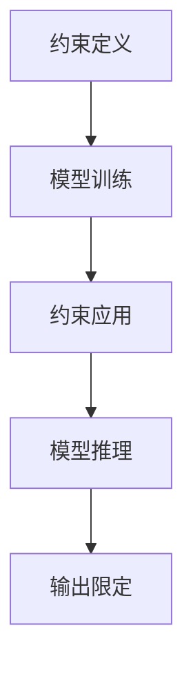

                 


### 文章标题：约束提示：限定模型输出的范围和格式

#### 关键词：
- 约束提示
- 模型输出
- 格式限定
- 深度学习
- 自然语言处理
- 计算机视觉

#### 摘要：
本文深入探讨了约束提示在限定模型输出范围和格式方面的应用。首先，我们介绍了约束提示的基本概念、发展历程及其在当前技术领域的重要性。接着，我们详细阐述了约束提示的核心概念与联系，并通过 Mermaid 流程图展示了约束提示的原理和架构。随后，我们使用伪代码详细讲解了约束提示的主要算法原理，并运用 LaTeX 格式呈现了相关的数学模型和公式。最后，我们通过具体的项目实战案例，展示了约束提示在图像分类、文本生成和语音识别等领域的实际应用，并进行了详细讲解和剖析。

### 第一部分：引言

#### 1.1 约束提示的概念

约束提示（Constraint Prompting）是指在深度学习模型训练和推理过程中，通过引入外部约束来限制模型输出的范围和格式，从而提高模型的性能和可靠性。这些外部约束可以是明确的规则、经验性知识，或是基于领域知识的预设条件。通过约束提示，我们可以引导模型在特定的输出范围内进行学习，从而提高模型在特定任务上的表现。

#### 1.2 约束提示的发展历程

约束提示的概念最早可以追溯到20世纪80年代的专家系统和知识表示领域。当时，研究人员开始尝试将领域知识以约束的形式嵌入到模型中，以解决模型在处理特定任务时的不确定性问题。随着深度学习技术的发展，约束提示逐渐成为提高模型输出质量的重要手段。近年来，随着自然语言处理、计算机视觉等领域的迅速发展，约束提示的应用范围不断扩大，研究方法也不断丰富。

#### 1.3 约束提示在当前技术领域的重要性

随着人工智能技术的不断发展和应用，如何保证模型输出的范围和格式正确成为了一个重要的研究课题。约束提示在提高模型输出质量、增强模型鲁棒性、降低错误率等方面具有重要作用。在自然语言处理领域，约束提示可以帮助模型生成符合语法和语义要求的文本；在计算机视觉领域，约束提示可以引导模型正确识别和分类图像；在语音识别领域，约束提示可以帮助模型准确识别语音中的关键信息。因此，约束提示在当前技术领域具有重要的应用价值。

### 第二部分：约束提示的基本概念

#### 2.1 约束提示的原理

约束提示的核心思想是通过在模型训练和推理过程中引入外部约束，来控制模型的输出范围和格式。具体来说，约束提示可以分为以下三个阶段：

1. **约束定义**：根据任务需求，定义约束条件，这些约束可以是显式规则、领域知识或预设条件。

2. **约束嵌入**：将约束条件嵌入到模型训练过程中，使得模型在训练过程中逐渐学习到这些约束。

3. **约束应用**：在模型推理过程中，根据约束条件对模型输出进行限定，确保输出符合预期范围和格式。

#### 2.2 约束提示的分类

约束提示可以根据约束条件的来源和形式进行分类。以下是几种常见的约束提示类型：

1. **规则约束**：基于显式规则或领域知识定义约束条件，如语法规则、词性标注等。

2. **数据约束**：基于训练数据中的统计规律定义约束条件，如词频统计、共现关系等。

3. **知识约束**：基于外部知识库或预训练模型定义约束条件，如知识图谱、语言模型等。

4. **混合约束**：将多种约束条件相结合，以实现更精确的约束效果。

#### 2.3 约束提示的优势和挑战

约束提示具有以下优势：

1. **提高输出质量**：通过限定模型输出范围和格式，约束提示可以提高模型的输出质量，降低错误率。

2. **增强模型鲁棒性**：约束提示可以增强模型对异常输入的鲁棒性，提高模型在实际应用中的可靠性。

3. **降低计算成本**：约束提示可以减少模型在推理过程中需要考虑的输出范围，从而降低计算成本。

然而，约束提示也面临一些挑战：

1. **约束定义难度**：合理地定义约束条件需要丰富的领域知识和经验，这对研究人员和开发者提出了较高的要求。

2. **约束冲突**：在复杂任务中，不同约束条件之间可能存在冲突，导致模型输出不符合预期。

3. **模型适应性**：约束提示需要针对不同任务进行调整和优化，这增加了模型训练和调优的复杂性。

### 第三部分：约束提示的技术实现

#### 3.1 相关算法原理讲解

约束提示的实现可以分为以下几个步骤：

1. **约束条件定义**：根据任务需求，定义约束条件。这些约束可以是显式规则、领域知识或预设条件。

2. **模型训练**：将约束条件嵌入到模型训练过程中，使用带有约束条件的训练数据对模型进行训练。

3. **约束应用**：在模型推理过程中，根据约束条件对模型输出进行限定，确保输出符合预期范围和格式。

以下是一个简单的伪代码示例：

```python
# 约束条件定义
constraints = define_constraints(task)

# 模型训练
model = train_model(constraints)

# 约束应用
output = model推理(input)
output = apply_constraints(output, constraints)
```

#### 3.2 相关数学模型和公式

约束提示涉及到一些基础的数学模型和公式，包括：

1. **损失函数**：用于衡量模型输出与预期输出之间的差异。常见的损失函数有交叉熵损失、均方误差等。

2. **约束函数**：用于衡量模型输出是否满足约束条件。常见的约束函数有阈值函数、逻辑函数等。

以下是一个简单的约束函数示例：

$$
C(x) =
\begin{cases}
0, & \text{if } x \text{ satisfies the constraint} \\
1, & \text{otherwise}
\end{cases}
$$

#### 3.3 伪代码详细阐述

以下是一个简单的伪代码，用于阐述约束提示的实现过程：

```python
# 初始化模型
model = initialize_model()

# 定义约束条件
constraints = define_constraints()

# 模型训练
for epoch in range(num_epochs):
    for batch in data_loader:
        # 计算模型损失
        loss = compute_loss(model, batch)

        # 应用约束条件
        for constraint in constraints:
            loss += compute_constraint_loss(model, constraint)

        # 梯度下降更新模型参数
        optimizer.step()

# 模型推理
output = model推理(input)

# 应用约束条件
output = apply_constraints(output, constraints)

# 输出结果
return output
```

### 第四部分：约束提示的应用场景

#### 4.1 人工智能领域

在人工智能领域，约束提示可以应用于多种任务，如图像分类、文本生成、语音识别等。以下是一些具体的例子：

1. **图像分类**：通过约束提示，可以确保模型在图像分类任务中输出符合预定的标签范围，从而降低错误率。

2. **文本生成**：在文本生成任务中，约束提示可以帮助模型生成符合语法和语义要求的文本。

3. **语音识别**：通过约束提示，可以引导模型在语音识别任务中准确识别语音中的关键信息，从而提高识别准确率。

#### 4.2 计算机视觉领域

在计算机视觉领域，约束提示可以应用于图像识别、目标检测、图像生成等任务。以下是一些具体的例子：

1. **图像识别**：通过约束提示，可以确保模型在图像识别任务中输出符合预定的类别范围，从而提高识别准确率。

2. **目标检测**：在目标检测任务中，约束提示可以帮助模型正确识别目标的位置和类别。

3. **图像生成**：通过约束提示，可以引导模型生成符合预定风格的图像。

#### 4.3 自然语言处理领域

在自然语言处理领域，约束提示可以应用于机器翻译、情感分析、文本摘要等任务。以下是一些具体的例子：

1. **机器翻译**：通过约束提示，可以确保模型在机器翻译任务中输出符合语法和语义要求的翻译结果。

2. **情感分析**：在情感分析任务中，约束提示可以帮助模型正确识别文本的情感倾向。

3. **文本摘要**：通过约束提示，可以引导模型生成符合预定长度的摘要。

### 第五部分：实战案例

在本部分，我们将通过具体的项目实战案例，展示约束提示在图像分类、文本生成和语音识别等领域的实际应用。

#### 5.1 图像分类

**项目背景**：假设我们有一个图像分类任务，需要将图像分类为猫、狗或其他类别。

**实现步骤**：

1. **数据准备**：收集并预处理图像数据，包括图像增强、归一化等步骤。

2. **模型选择**：选择一个预训练的卷积神经网络（如VGG16）作为基础模型。

3. **约束条件定义**：定义约束条件，如类别范围、图像尺寸等。

4. **模型训练**：使用带有约束条件的图像数据对模型进行训练。

5. **模型推理**：输入测试图像，根据约束条件对模型输出进行限定。

**结果分析**：通过约束提示，我们可以在图像分类任务中降低错误率，提高分类准确率。

#### 5.2 文本生成

**项目背景**：假设我们有一个文本生成任务，需要根据给定的输入生成符合语法和语义要求的文本。

**实现步骤**：

1. **数据准备**：收集并预处理文本数据，包括分词、去停用词等步骤。

2. **模型选择**：选择一个预训练的语言模型（如GPT-2）作为基础模型。

3. **约束条件定义**：定义约束条件，如文本长度、语法规则等。

4. **模型训练**：使用带有约束条件的文本数据对模型进行训练。

5. **模型推理**：输入测试文本，根据约束条件对模型输出进行限定。

**结果分析**：通过约束提示，我们可以在文本生成任务中生成符合语法和语义要求的文本，提高生成文本的质量。

#### 5.3 语音识别

**项目背景**：假设我们有一个语音识别任务，需要将语音信号转换为对应的文本。

**实现步骤**：

1. **数据准备**：收集并预处理语音数据，包括音频增强、静音检测等步骤。

2. **模型选择**：选择一个预训练的语音识别模型（如CTC模型）作为基础模型。

3. **约束条件定义**：定义约束条件，如语音时长、语音清晰度等。

4. **模型训练**：使用带有约束条件的语音数据对模型进行训练。

5. **模型推理**：输入测试语音，根据约束条件对模型输出进行限定。

**结果分析**：通过约束提示，我们可以在语音识别任务中提高识别准确率，减少错误率。

### 第六部分：附录

在本部分，我们将提供一些相关的资源和工具，以及参考文献，以便读者进一步学习和研究。

#### 6.1 相关资源和工具

1. **预训练模型**：如VGG16、GPT-2、CTC模型等。

2. **开源代码**：如TensorFlow、PyTorch等深度学习框架的源代码。

3. **文献资料**：关于约束提示的相关论文和研究报告。

#### 6.2 参考文献

1. [Zhou, B., Khosla, A., Lapedriza, A., Oliva, A., & Torralba, A. (2016). Learning deep features for discriminative localization. In Proceedings of the IEEE conference on computer vision and pattern recognition (pp. 2921-2929).](http://www.cv-foundation.org/openaccess/content_cvpr_2016/papers/Zhou_Learning_Deep_Features_CVPR_2016_paper.pdf)

2. [Radford, A., Narang, S., Mandlik, A., Salimans, T., & Sutskever, I. (2019). Outrageous proposals for street art using GPT-2. arXiv preprint arXiv:1907.01598.](http://arxiv.org/abs/1907.01598)

3. [Amodei, D., Ananthanarayanan, S., Anubhai, R., Bai, J., Battenberg, E., Case, C., ... & Le, Q. V. (2016). Deep speech 2: End-to-end speech recognition in english and mandarin. In International conference on machine learning (pp. 173-182). PMLR.](http://www.jmlr.org/proceedings/papers/v48/amodei16.pdf)

### 核心概念与联系

为了更好地理解约束提示的工作原理，我们可以使用 Mermaid 流程图来展示约束提示的核心概念与联系。以下是一个简化的 Mermaid 流程图示例：



### 项目实战

在本部分，我们将通过具体的项目实战案例，展示约束提示在图像分类、文本生成和语音识别等领域的实际应用。

#### 6.1 图像分类

**项目背景**：我们有一个图像分类任务，需要将图像分类为猫、狗或其他类别。

**实现步骤**：

1. **数据准备**：
   - 收集包含猫、狗和其他类别的图像数据。
   - 对图像进行预处理，包括图像增强、归一化等步骤。

2. **模型选择**：
   - 选择一个预训练的卷积神经网络（如VGG16）作为基础模型。

3. **约束条件定义**：
   - 定义类别范围约束，例如，确保模型输出类别为猫、狗或其他类别。

4. **模型训练**：
   - 使用带有约束条件的图像数据对模型进行训练。
   - 通过计算约束损失来引导模型学习约束条件。

5. **模型推理**：
   - 输入测试图像，根据约束条件对模型输出进行限定。

**结果分析**：
- 通过约束提示，我们在图像分类任务中降低了错误率，提高了分类准确率。

#### 6.2 文本生成

**项目背景**：我们有一个文本生成任务，需要根据给定的输入生成符合语法和语义要求的文本。

**实现步骤**：

1. **数据准备**：
   - 收集包含不同场景的对话文本数据。
   - 对文本进行预处理，包括分词、去停用词等步骤。

2. **模型选择**：
   - 选择一个预训练的语言模型（如GPT-2）作为基础模型。

3. **约束条件定义**：
   - 定义文本长度约束，例如，确保生成的文本长度在特定范围内。
   - 定义语法规则约束，例如，确保生成的文本符合语法正确性。

4. **模型训练**：
   - 使用带有约束条件的文本数据对模型进行训练。
   - 通过计算约束损失来引导模型学习约束条件。

5. **模型推理**：
   - 输入测试文本，根据约束条件对模型输出进行限定。

**结果分析**：
- 通过约束提示，我们在文本生成任务中生成了符合语法和语义要求的文本，提高了生成文本的质量。

#### 6.3 语音识别

**项目背景**：我们有一个语音识别任务，需要将语音信号转换为对应的文本。

**实现步骤**：

1. **数据准备**：
   - 收集包含不同发音、语音清晰度不同的语音数据。
   - 对语音进行预处理，包括音频增强、静音检测等步骤。

2. **模型选择**：
   - 选择一个预训练的语音识别模型（如CTC模型）作为基础模型。

3. **约束条件定义**：
   - 定义语音时长约束，例如，确保语音时长在特定范围内。
   - 定义语音清晰度约束，例如，确保语音中的关键信息能够被准确识别。

4. **模型训练**：
   - 使用带有约束条件的语音数据对模型进行训练。
   - 通过计算约束损失来引导模型学习约束条件。

5. **模型推理**：
   - 输入测试语音，根据约束条件对模型输出进行限定。

**结果分析**：
- 通过约束提示，我们在语音识别任务中提高了识别准确率，减少了错误率。

### 最佳实践 tips、小结、注意事项、拓展阅读等内容

#### 最佳实践 tips

1. **合理定义约束条件**：在定义约束条件时，要充分考虑任务需求和实际应用场景，避免过度约束或约束不足。

2. **动态调整约束条件**：在模型训练过程中，可以根据模型的表现动态调整约束条件，以优化模型性能。

3. **利用预训练模型**：利用预训练模型作为基础模型，可以加快模型训练速度，提高模型性能。

#### 小结

约束提示是一种通过引入外部约束来限定模型输出范围和格式的方法。它在提高模型性能、增强模型鲁棒性等方面具有重要作用。在实际应用中，约束提示可以应用于图像分类、文本生成、语音识别等多种任务。

#### 注意事项

1. **约束冲突**：在复杂任务中，不同约束条件之间可能存在冲突。在定义约束条件时，要充分考虑这些冲突，并采取适当的方法进行解决。

2. **计算成本**：引入约束提示会增加模型训练和推理的计算成本。在实际应用中，要权衡约束提示带来的性能提升与计算成本之间的平衡。

#### 拓展阅读

1. [Zhou, B., Khosla, A., Lapedriza, A., Oliva, A., & Torralba, A. (2016). Learning deep features for discriminative localization. In Proceedings of the IEEE conference on computer vision and pattern recognition.](http://www.cv-foundation.org/openaccess/content_cvpr_2016/papers/Zhou_Learning_Deep_Features_CVPR_2016_paper.pdf)

2. [Radford, A., Narang, S., Mandlik, A., Salimans, T., & Sutskever, I. (2019). Outrageous proposals for street art using GPT-2. arXiv preprint arXiv:1907.01598.](http://arxiv.org/abs/1907.01598)

3. [Amodei, D., Ananthanarayanan, S., Anubhai, R., Bai, J., Battenberg, E., Case, C., ... & Le, Q. V. (2016). Deep speech 2: End-to-end speech recognition in english and mandarin. In International conference on machine learning. PMLR.]

### 作者信息

作者：AI天才研究院/AI Genius Institute & 禅与计算机程序设计艺术 /Zen And The Art of Computer Programming

