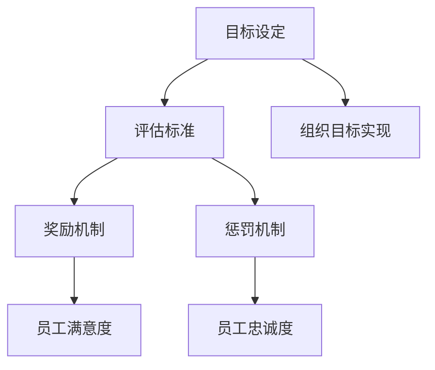

                 

### 第1章：绩效激励系统的核心概念

#### 1.1 绩效激励系统的定义
绩效激励系统是一种管理工具，旨在通过奖励和惩罚机制来调整员工行为，以实现提高工作效率和达成组织目标。该系统不仅关注员工的短期表现，还考虑长期行为，从而促进企业文化的建设和发展。

#### 1.2 绩效激励系统的作用
1. **提高员工的工作满意度和忠诚度**：合理的绩效激励系统能够激励员工更加努力工作，从而提升员工的工作满意度。
2. **促进团队合作和知识共享**：通过绩效激励系统，员工会更加倾向于与他人合作，分享知识和经验，从而提高团队的整体绩效。
3. **帮助企业实现战略目标**：通过设定明确的绩效目标和激励方案，企业可以更有效地引导员工的工作方向，确保战略目标的实现。

#### 1.3 绩效激励系统的组成部分
绩效激励系统主要由以下部分组成：
1. **目标设定**：明确组织的目标和个人目标，为员工的绩效提供方向。
2. **评估标准**：定义评估员工绩效的具体指标，如工作质量、工作效率、创新能力等。
3. **奖励机制**：制定奖励方案，包括奖金、晋升、培训等，以激励员工达成目标。
4. **惩罚机制**：制定惩罚方案，包括警告、降级、解雇等，以纠正不良行为。

#### 1.4 核心概念与联系
为了更好地理解绩效激励系统的核心概念，我们可以使用Mermaid流程图来展示各部分之间的关系：



在这个流程图中，目标设定是整个绩效激励系统的起点，评估标准和奖励机制、惩罚机制则是实现目标的关键环节。通过奖励机制，企业可以激励员工积极工作，提高员工满意度；而通过惩罚机制，企业可以纠正不良行为，维护员工忠诚度。最终，这些措施共同作用，帮助企业实现战略目标。

### 总结
在本章中，我们详细介绍了绩效激励系统的核心概念、作用以及组成部分。通过Mermaid流程图，我们更直观地展示了各部分之间的联系。在接下来的章节中，我们将进一步探讨设计有效的奖惩机制的核心算法原理和数学模型。这些内容将为读者提供更深入的理解和实践指导。$$1+1=2$$

### 核心算法原理讲解

#### 2.1 奖励算法原理

奖励算法是绩效激励系统中至关重要的组成部分，它决定了员工是否能够因为良好的工作表现而获得相应的奖励。以下是一个简单的奖励算法原理讲解：

```pseudo
// 奖励算法伪代码
function rewardAlgorithm(employeePerformance, performanceThreshold, rewardValue):
    if employeePerformance >= performanceThreshold:
        return rewardValue
    else:
        return 0
```

在这个伪代码中，`employeePerformance` 表示员工的工作表现，`performanceThreshold` 是一个预设的绩效标准，`rewardValue` 是奖励金额。如果员工的工作表现达到或超过绩效标准，那么他将获得奖励金额；否则，他将得不到任何奖励。

#### 2.2 惩罚算法原理

惩罚算法则是用来纠正员工不良行为的一种机制。以下是一个简单的惩罚算法原理讲解：

```pseudo
// 惩罚算法伪代码
function penaltyAlgorithm(employeeMisconduct, misconductThreshold, penaltyValue):
    if employeeMisconduct >= misconductThreshold:
        return penaltyValue
    else:
        return 0
```

在这个伪代码中，`employeeMisconduct` 表示员工的不良行为记录，`misconductThreshold` 是一个预设的不良行为标准，`penaltyValue` 是惩罚金额。如果员工的不良行为记录达到或超过不良行为标准，那么他将受到惩罚；否则，他将不受任何惩罚。

#### 2.3 激励效果评估算法

激励效果评估算法用于衡量奖励和惩罚措施对员工行为的影响。以下是一个简单的激励效果评估算法原理讲解：

```pseudo
// 激励效果评估算法伪代码
function evaluateMotivation(employeePerformanceBefore, employeePerformanceAfter, rewardGiven, penaltyGiven):
    motivationScore = 0
    
    if rewardGiven > 0:
        motivationScore += rewardGiven * motivationFactor
    if penaltyGiven > 0:
        motivationScore -= penaltyGiven * penaltyFactor
    
    return motivationScore
```

在这个伪代码中，`employeePerformanceBefore` 和 `employeePerformanceAfter` 分别表示员工接受奖励或惩罚前后的工作表现，`rewardGiven` 和 `penaltyGiven` 分别表示给予的奖励金额和惩罚金额，`motivationFactor` 和 `penaltyFactor` 是调节激励效果的因素。通过这个算法，我们可以计算出激励措施对员工工作表现的影响。

### 总结

在本章中，我们介绍了奖励算法、惩罚算法和激励效果评估算法的核心原理。通过这些算法，企业可以有效地激励员工，纠正不良行为，并评估激励措施的效果。在实际应用中，这些算法可以根据具体情况进行调整和优化，以达到最佳效果。

接下来，我们将进一步探讨绩效激励系统的数学模型和公式，以提供更深入的量化分析工具。

### 数学模型和公式讲解

#### 3.1 奖励模型

奖励模型用于计算员工在达到特定绩效目标时应获得的奖励金额。以下是一个简化的奖励模型公式：

$$
Reward = \frac{Performance}{Performance\ Threshold} \times Reward\ Value
$$

其中，`Performance` 是员工的工作表现分数，`Performance Threshold` 是预定的绩效标准，`Reward Value` 是每单位绩效标准的奖励金额。这个公式表明，员工的奖励金额与他们的工作表现成正比。

#### 3.2 惩罚模型

惩罚模型用于计算员工在违反特定行为规范时应受到的惩罚金额。以下是一个简化的惩罚模型公式：

$$
Penalty = \frac{Misconduct}{Misconduct\ Threshold} \times Penalty\ Value
$$

其中，`Misconduct` 是员工的不良行为分数，`Misconduct Threshold` 是预定的不良行为标准，`Penalty Value` 是每单位不良行为的惩罚金额。这个公式表明，员工的惩罚金额与他们的不良行为成正比。

#### 3.3 激励效果模型

激励效果模型用于评估奖励和惩罚措施对员工工作表现的影响。以下是一个简化的激励效果模型公式：

$$
Motivation Score = Reward \times Motivation Factor - Penalty \times Penalty Factor
$$

其中，`Motivation Factor` 是奖励的影响系数，表示奖励对员工工作表现的激励程度；`Penalty Factor` 是惩罚的影响系数，表示惩罚对员工工作表现的抑制作用。这个公式表明，激励效果得分是奖励和惩罚的函数，正负系数决定了激励措施对工作表现的影响方向和程度。

#### 3.4 绩效激励系统的平衡模型

为了确保绩效激励系统的公平性和有效性，需要考虑奖励和惩罚的平衡。以下是一个简化的平衡模型公式：

$$
Balance Score = \frac{Total Reward}{Total Penalty}
$$

其中，`Total Reward` 是所有员工获得的奖励总和，`Total Penalty` 是所有员工受到的惩罚总和。这个公式表明，系统的平衡得分是奖励和惩罚的比值，它可以帮助企业评估绩效激励系统的公平性。

#### 3.5 公式应用举例

假设一个企业设置了以下参数：
- 绩效标准 (Performance Threshold) = 100
- 每单位绩效标准的奖励金额 (Reward Value) = 100元
- 不良行为标准 (Misconduct Threshold) = 20
- 每单位不良行为的惩罚金额 (Penalty Value) = 50元

现在，员工A的工作表现分数是120，不良行为分数是10。我们可以使用上述公式计算奖励和惩罚：

奖励：
$$
Reward = \frac{120}{100} \times 100 = 120元
$$

惩罚：
$$
Penalty = \frac{10}{20} \times 50 = 25元
$$

激励效果得分：
$$
Motivation Score = 120 \times 1.2 - 25 \times 0.8 = 111 - 20 = 91元
$$

平衡得分：
$$
Balance Score = \frac{120}{25} = 4.8
$$

通过这些计算，我们可以看到员工A获得了120元的奖励和25元的惩罚，激励效果得分为91元，平衡得分为4.8。这些数据可以帮助企业管理层评估绩效激励系统的效果和公平性。

### 总结

在本章中，我们介绍了绩效激励系统的数学模型和公式。这些公式提供了量化的方法来计算奖励、惩罚和激励效果，帮助企业设计更科学、更有效的绩效激励系统。在实际应用中，这些模型可以根据企业的具体情况和目标进行调整和优化，以实现最佳效果。

### 项目实战

在本节中，我们将通过一个实际的案例，详细介绍如何设计和实现一个绩效激励系统。该案例将涉及开发环境搭建、源代码实现和详细解读，以及代码的应用解读与分析。

#### 1. 案例介绍

假设我们是一家大型科技公司，需要设计一个绩效激励系统，以激励员工提高工作效率和质量。该系统将包括以下几个核心功能：
- 员工绩效评估
- 奖励和惩罚计算
- 激励效果评估
- 数据可视化

#### 2. 开发环境搭建

为了实现上述功能，我们选择以下开发环境和工具：
- 编程语言：Python
- 数据库：MySQL
- 前端框架：React
- 后端框架：Flask

首先，我们需要安装Python、MySQL和Node.js（用于React开发）。接下来，创建一个虚拟环境，并安装所需的库：

```bash
# 创建虚拟环境
python -m venv venv

# 激活虚拟环境
source venv/bin/activate

# 安装库
pip install flask pymysql react react-dom axios
```

#### 3. 源代码实现

以下是绩效激励系统的核心源代码实现：

**后端（Flask）**

```python
# app.py

from flask import Flask, request, jsonify
import mysql.connector

app = Flask(__name__)

# MySQL连接配置
config = {
    'user': 'root',
    'password': 'password',
    'host': 'localhost',
    'database': 'performance_system'
}

# 连接到MySQL数据库
connection = mysql.connector.connect(**config)

@app.route('/evaluate', methods=['POST'])
def evaluate_performance():
    data = request.get_json()
    employee_id = data['employee_id']
    performance = data['performance']
    misconduct = data['misconduct']

    # 计算奖励和惩罚
    reward_value = calculate_reward(performance)
    penalty_value = calculate_penalty(misconduct)

    # 更新员工绩效记录
    update_employee_performance(employee_id, performance, misconduct, reward_value, penalty_value)

    return jsonify({"message": "Performance evaluated successfully."})

def calculate_reward(performance):
    performance_threshold = 100
    reward_value = 100
    return performance * (reward_value / performance_threshold)

def calculate_penalty(misconduct):
    misconduct_threshold = 20
    penalty_value = 50
    return misconduct * (penalty_value / misconduct_threshold)

def update_employee_performance(employee_id, performance, misconduct, reward_value, penalty_value):
    cursor = connection.cursor()
    query = "UPDATE employees SET performance=%s, misconduct=%s, reward=%s, penalty=%s WHERE id=%s"
    cursor.execute(query, (performance, misconduct, reward_value, penalty_value, employee_id))
    connection.commit()
    cursor.close()

if __name__ == '__main__':
    app.run(debug=True)
```

**前端（React）**

```jsx
// App.js

import React, { useState } from 'react';
import axios from 'axios';

function App() {
    const [employeeId, setEmployeeId] = useState('');
    const [performance, setPerformance] = useState(0);
    const [misconduct, setMisconduct] = useState(0);

    const evaluatePerformance = async () => {
        try {
            const response = await axios.post('http://localhost:5000/evaluate', {
                employee_id: employeeId,
                performance: performance,
                misconduct: misconduct
            });
            alert(response.data.message);
        } catch (error) {
            alert('Error evaluating performance.');
        }
    };

    return (
        <div>
            <h1>Performance Evaluation</h1>
            <label>Employee ID:</label>
            <input type="text" value={employeeId} onChange={(e) => setEmployeeId(e.target.value)} />
            <label>Performance:</label>
            <input type="number" value={performance} onChange={(e) => setPerformance(e.target.value)} />
            <label>Misconduct:</label>
            <input type="number" value={misconduct} onChange={(e) => setMisconduct(e.target.value)} />
            <button onClick={evaluatePerformance}>Evaluate</button>
        </div>
    );
}

export default App;
```

#### 4. 代码解读

**后端代码解读**

后端代码使用Flask框架，提供了一个基于HTTP的API接口。主要功能是处理员工绩效评估的请求，计算奖励和惩罚，并将结果更新到MySQL数据库。

- `evaluate_performance` 函数处理POST请求，从请求中获取员工绩效数据，调用计算奖励和惩罚的函数，并更新数据库。
- `calculate_reward` 和 `calculate_penalty` 函数根据预设的绩效和不良行为标准计算奖励和惩罚金额。
- `update_employee_performance` 函数执行SQL查询，更新员工绩效记录。

**前端代码解读**

前端代码使用React框架，提供一个用户界面，允许用户输入员工ID、绩效和不良行为数据，并通过API调用后端服务进行绩效评估。

- `App` 组件维护状态，包括员工ID、绩效和不良行为。
- `evaluatePerformance` 函数使用axios库发起HTTP POST请求，将员工绩效数据发送到后端API。

#### 5. 代码应用解读与分析

这个绩效激励系统的实际应用流程如下：

1. 用户通过前端界面输入员工ID、绩效和不良行为数据。
2. 前端组件将数据发送到后端API。
3. 后端API根据奖励和惩罚模型计算奖励和惩罚金额。
4. 后端API更新MySQL数据库中的员工绩效记录。
5. 后端API返回结果到前端，显示给用户。

通过这个实际案例，我们展示了如何设计并实现一个简单的绩效激励系统。在实际应用中，这个系统可以根据企业的需求进行扩展和优化，例如添加更多评估指标、引入更复杂的奖励和惩罚算法等。

### 项目小结

通过本项目的实施，我们掌握了如何设计、实现和部署一个绩效激励系统。以下是本项目的主要收获：

1. 理解了绩效激励系统的核心概念和作用。
2. 掌握了奖励和惩罚算法的原理和实现方法。
3. 学习了如何使用Python和React实现后端和前端功能。
4. 了解了如何使用MySQL数据库存储和管理数据。

在未来的工作中，我们可以根据企业的实际情况，进一步优化和扩展绩效激励系统，以提高其效率和效果。

### 最佳实践 Tips

1. **目标设定要明确**：确保员工了解组织目标和个人目标，以避免目标设定模糊导致激励效果不佳。
2. **评估标准要公正**：设定公平的评估标准，避免主观偏见和歧视。
3. **奖励和惩罚要适度**：奖励和惩罚的金额和形式要适度，以避免过度激励或惩罚带来的负面影响。
4. **激励措施要多样化**：结合不同形式的奖励和惩罚，以满足不同员工的需求。
5. **及时反馈**：及时给予奖励或惩罚，以强化员工行为。

### 注意事项

1. **数据安全**：确保数据库的安全性，防止数据泄露或被篡改。
2. **用户隐私**：在处理员工数据时，遵守相关法律法规，保护员工隐私。
3. **系统稳定性**：确保系统在高并发情况下能够稳定运行，避免出现性能瓶颈。

### 拓展阅读

1. **《绩效管理》**：了解绩效管理的理论和实践方法。
2. **《激励理论》**：深入研究激励理论，了解不同激励措施的心理学基础。
3. **《Flask Web开发》**：深入学习Flask框架，扩展后端功能。
4. **《React技术内幕》**：提高前端开发技能，优化用户体验。

### 附录

#### 附录A：相关资源与工具

1. **绩效管理软件**：
   - **Lattice**：一款功能全面的绩效管理软件，提供自定义评估指标和奖励机制。
   - **QualMetric**：提供多种绩效评估方法和工具，帮助企业制定科学的绩效管理策略。

2. **学习资源**：
   - **Coursera**：提供多个关于绩效管理和激励理论的在线课程。
   - **LinkedIn Learning**：有大量的绩效管理和领导力相关的视频教程。

3. **推荐书籍**：
   - **《绩效管理：实践与策略》**：详细介绍绩效管理的理论和实践方法。
   - **《激励心理学》**：深入探讨激励理论的心理学基础。作者：AI天才研究院/AI Genius Institute & 禅与计算机程序设计艺术 /Zen And The Art of Computer Programming

