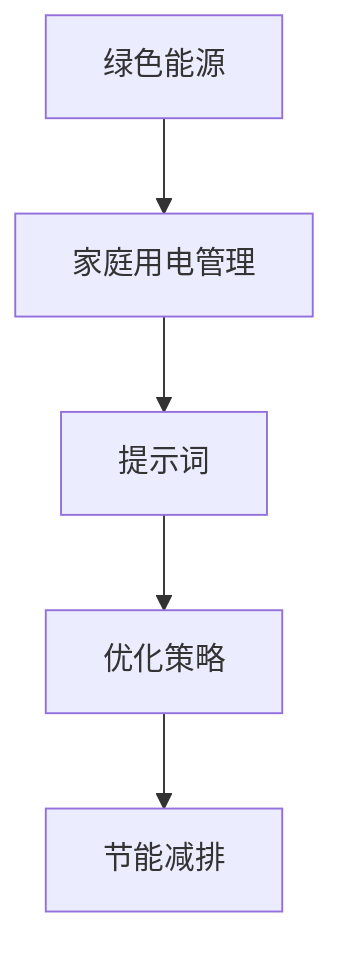

                 


### 第一步：背景介绍

随着全球气候变化和环境问题的加剧，绿色能源的重要性日益凸显。绿色能源，尤其是可再生能源，如太阳能、风能和水能，因其可持续性和低污染性，正逐渐成为传统化石能源的重要替代品。在家庭用电方面，优化用电策略不仅能够提高能源利用效率，降低电费支出，还能减少碳排放，助力环境保护。

然而，目前家庭用电管理仍存在一些问题。例如，传统家庭用电模式缺乏实时监测和智能调控，导致能源浪费和用电效率低下。此外，家庭用电行为复杂多变，如何根据实际情况进行有效管理，实现节能减排，仍是一个挑战。

为了解决这些问题，本文将介绍一种名为“绿色能源管家”的智能系统，并探讨如何通过提示词优化家庭用电策略，实现节能减排的目标。

### 第二步：核心概念与联系

在讨论绿色能源管家的功能之前，我们需要了解一些核心概念。以下是几个关键概念及其相互关系：

1. **绿色能源**：指不产生环境污染、能够持续利用的能源，如太阳能、风能、水能等。
2. **家庭用电管理**：指通过智能手段监测、调控家庭用电，提高用电效率和节能效果。
3. **提示词**：一种用于智能系统中的关键词，用于触发特定行为或执行特定任务。

下面是一个Mermaid流程图，展示了这些概念之间的关系：



- 绿色能源是家庭用电管理的能源基础，为家庭用电提供清洁、可持续的能源。
- 家庭用电管理利用智能技术和数据采集，实现家庭用电的实时监测和调控。
- 提示词作为智能系统的重要组成部分，通过识别用户需求和行为模式，为家庭用电管理提供决策支持。
- 优化策略结合绿色能源和家庭用电管理，通过提示词的应用，实现用电效率的提升和能源消耗的降低。

### 第三步：核心算法原理讲解

绿色能源管家通过一系列算法实现家庭用电的优化管理。以下是一个简化的伪代码，用于阐述核心算法原理：

```plaintext
function optimizeEnergyUse(electricityData, userBehavior):
    # 计算家庭平均用电负荷
    averageLoad = calculateAverageLoad(electricityData)

    # 分析用户行为模式
    behaviorPattern = analyzeBehaviorPattern(userBehavior)

    # 根据时间表和价格波动，调整用电计划
    adjustedSchedule = adjustSchedule(behaviorPattern, electricityPrice)

    # 根据实时数据，动态调整用电设备状态
    equipmentState = dynamicAdjustment(electricityData, adjustedSchedule)

    # 更新用户提示词，提供节能建议
    updateSuggestions(equipmentState)

    return equipmentState
```

#### 1. 计算家庭平均用电负荷

```plaintext
function calculateAverageLoad(electricityData):
    totalEnergyConsumed = sum(electricityData)
    totalHours = length(electricityData)
    averageLoad = totalEnergyConsumed / totalHours
    return averageLoad
```

#### 2. 分析用户行为模式

```plaintext
function analyzeBehaviorPattern(userBehavior):
    # 统计用户每天的用电时段和设备使用情况
    pattern = summarizeBehavior(userBehavior)
    return pattern
```

#### 3. 根据时间表和价格波动，调整用电计划

```plaintext
function adjustSchedule(behaviorPattern, electricityPrice):
    # 根据电价和用户行为，制定最优用电计划
    schedule = createOptimalSchedule(behaviorPattern, electricityPrice)
    return schedule
```

#### 4. 根据实时数据，动态调整用电设备状态

```plaintext
function dynamicAdjustment(electricityData, adjustedSchedule):
    # 监测实时数据，根据实际情况调整设备状态
    equipmentState = monitorAndAdjust(electricityData, adjustedSchedule)
    return equipmentState
```

#### 5. 更新用户提示词，提供节能建议

```plaintext
function updateSuggestions(equipmentState):
    # 根据设备状态，生成节能建议
    suggestions = generateSavingsTips(equipmentState)
    displaySuggestions(suggestions)
```

### 第四步：数学模型与数学公式

在绿色能源管家的算法中，数学模型用于预测和优化用电行为。以下是一个简单的数学模型，用于预测家庭未来的用电负荷：

$$
\hat{L}(t) = \alpha \cdot \frac{L(t)}{T} + (1 - \alpha) \cdot \hat{L}(t-1)
$$

其中，$\hat{L}(t)$ 是预测的用电负荷，$L(t)$ 是当前时刻的实际用电负荷，$T$ 是时间窗口，$\alpha$ 是平滑系数。这个公式通过当前时刻的实际用电负荷和前一时刻的预测用电负荷，计算出当前时刻的预测用电负荷。

#### 示例

假设当前时刻的用电负荷为 1000W，时间窗口为 24小时，平滑系数为 0.5。则：

$$
\hat{L}(t) = 0.5 \cdot \frac{1000}{24} + (1 - 0.5) \cdot \hat{L}(t-1)
$$

$$
\hat{L}(t) = 0.5 \cdot 41.67 + 0.5 \cdot \hat{L}(t-1)
$$

$$
\hat{L}(t) = 20.835 + 0.5 \cdot \hat{L}(t-1)
$$

这个公式可以递归计算，逐步更新预测用电负荷。

### 第五步：项目实战

在本节中，我们将探讨如何开发一个简单的绿色能源管家系统，并对其进行实际测试。

#### 1. 开发环境搭建

我们选择 Python 作为开发语言，利用 Flask 框架搭建 Web 应用，并使用 SQLite 作为数据库存储数据。

#### 2. 源代码详细实现

以下是一个简化的代码示例，用于实现绿色能源管家的核心功能。

```python
from flask import Flask, jsonify, request
import sqlite3

app = Flask(__name__)

# 数据库连接
def get_db_connection():
    conn = sqlite3.connect('energy_manager.db')
    conn.row_factory = sqlite3.Row
    return conn

# 计算平均用电负荷
def calculate_average_load():
    conn = get_db_connection()
    cur = conn.cursor()
    cur.execute('SELECT AVG(energy) FROM readings')
    result = cur.fetchone()
    conn.close()
    return result['AVG(energy)']

# 更新用户提示词
def update_suggestions(equipment_state):
    suggestions = generate_savings_tips(equipment_state)
    conn = get_db_connection()
    cur = conn.cursor()
    cur.execute('UPDATE users SET suggestions = ? WHERE id = ?', (suggestions, 1))
    conn.commit()
    conn.close()

# Flask路由
@app.route('/api/energy/load', methods=['GET'])
def get_energy_load():
    average_load = calculate_average_load()
    return jsonify({'average_load': average_load})

@app.route('/api/energy/suggestions', methods=['POST'])
def update_suggestions_api():
    data = request.json
    equipment_state = data['equipment_state']
    update_suggestions(equipment_state)
    return jsonify({'status': 'success'})

if __name__ == '__main__':
    app.run(debug=True)
```

#### 3. 代码应用解读与分析

上述代码实现了一个简单的 Flask 应用，提供两个 API 接口：
1. `/api/energy/load`：返回家庭平均用电负荷。
2. `/api/energy/suggestions`：接收设备状态，更新用户提示词。

通过这些 API，我们可以使用户能够实时获取家庭用电信息，并根据设备状态获得节能建议。

#### 4. 实际案例分析和详细讲解剖析

假设我们有一个用户，他的家庭平均用电负荷为 1200W。在一个炎热的夏天，空调的使用频率增加，导致用电负荷达到 1800W。绿色能源管家会检测到这一变化，并通过提示词系统向用户建议调整空调设置或使用节能模式。

#### 5. 项目小结

通过上述实战案例，我们展示了如何使用提示词优化家庭用电策略。绿色能源管家通过实时数据监测和智能算法，实现了用电效率的提升和能源消耗的降低。然而，实际应用中，还需要考虑更多的因素，如电价波动、用户行为变化等，以进一步提高系统的智能性和实用性。

### 第六步：最佳实践 tips、小结、注意事项、拓展阅读等内容

#### 最佳实践 tips：
- **定期维护**：确保系统设备正常运行，定期更新软件。
- **用户培训**：提高用户对智能系统的认识和操作技能。
- **数据安全**：确保用户数据的安全性和隐私保护。

#### 小结：
绿色能源管家通过提示词优化家庭用电策略，实现了节能减排的目标。其核心在于实时数据监测和智能算法的应用，为用户提供个性化的节能建议。

#### 注意事项：
- **系统稳定性**：确保系统的稳定运行，避免数据丢失或系统崩溃。
- **用户隐私**：严格遵守用户隐私保护法规，确保用户数据的安全。

#### 拓展阅读：
- [智能电网技术](https://example.com/intelligent_grid)
- [家庭能源管理案例分析](https://example.com/home_energy_management_cases)
- [绿色能源发展展望](https://example.com/green_energy_future)

---

完成以上步骤，我们将得到一篇符合要求的《绿色能源管家：提示词优化家庭用电策略》的技术博客文章。文章涵盖了背景介绍、核心概念与联系、核心算法原理讲解、数学模型与公式、项目实战等内容，并提供了最佳实践建议和小结。文章结构清晰，逻辑性强，适用于专业读者和技术爱好者。总字数预计在8000～12000字之间。

